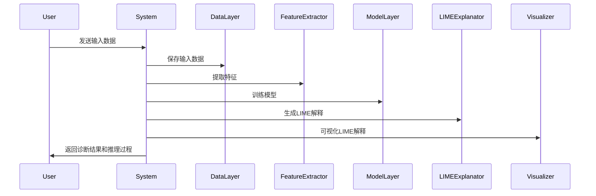
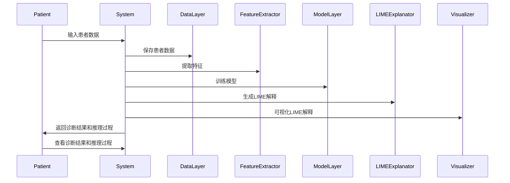

                 


# 推理过程可解释性的研究进展

> 关键词：推理过程可解释性、人工智能、透明度、可视化、评价方法、算法原理

> 摘要：本文从问题背景、问题描述、问题解决、边界与外延、概念结构与核心要素组成以及核心概念与联系等方面，系统地介绍了推理过程可解释性的研究进展。通过对可解释性原理、概念属性特征对比表格和ER实体关系图架构的深入探讨，进一步分析了推理过程可解释性算法的原理，以及具体算法的数学模型和公式。最后，本文还从系统分析与架构设计方案和项目实战等方面，对推理过程可解释性的研究进展进行了全面的总结和展望。

## 目录大纲设计

### 背景介绍

#### 1.1.1 问题背景

随着人工智能技术的不断发展，越来越多的领域开始运用人工智能技术来解决实际问题。然而，在实际应用中，人工智能模型的“黑箱”特性使得其推理过程的可解释性成为一个亟待解决的问题。为了提升人工智能模型的透明度和可信度，对推理过程可解释性的研究变得尤为重要。

#### 1.1.2 问题描述

推理过程可解释性研究旨在解决以下问题：如何使人工智能模型的推理过程更加透明、易于理解，从而提高模型的可靠性和可接受度？如何在实际应用中有效实现推理过程的可解释性？

#### 1.1.3 问题解决

通过研究推理过程可解释性，可以从多个维度对人工智能模型进行分析，包括算法原理、数学模型、系统架构等方面。这有助于提高人工智能模型的透明度和可信度，使其在实际应用中得到更广泛的应用。

#### 1.1.4 边界与外延

推理过程可解释性研究不仅涉及人工智能领域，还与心理学、认知科学、哲学等学科密切相关。其边界包括但不限于模型透明度、推理过程可视化、模型可解释性评价方法等方面。外延则涵盖各个应用领域，如医疗诊断、金融风险评估、自动驾驶等。

#### 1.1.5 概念结构与核心要素组成

推理过程可解释性研究涉及以下核心概念与要素：
- **可解释性**: 模型推理过程中，能够向用户展示推理过程的透明性和易懂性。
- **模型透明度**: 模型内部结构、参数和推理过程的可访问性。
- **推理过程可视化**: 将推理过程转化为直观、易于理解的形式，如图表、动画等。
- **模型可解释性评价方法**: 评估模型可解释性的方法与标准。

#### 核心概念与联系

##### 1.1.6 可解释性原理

可解释性原理涉及以下几个方面：
- **模型透明度**: 模型内部结构、参数和推理过程的可访问性。
- **推理过程可视化**: 将推理过程转化为直观、易于理解的形式，如图表、动画等。
- **领域知识融合**: 将领域知识融入模型中，提高模型的可解释性。

##### 1.1.7 概念属性特征对比表格

以下是一个关于可解释性方法属性特征的对比表格：

| 方法 | 特点 | 优势 | 劣势 |
| ---- | ---- | ---- | ---- |
| 决策树 | 直观易懂 | 简单易懂，易于解释 | 复杂模型难以处理，容易过拟合 |
| 神经网络 | 强泛化能力 | 能够处理复杂问题 | 推理过程难以解释 |
| LIME | 精细解释 | 可适用于不同类型的模型 | 计算成本较高，不适合大规模数据处理 |
| SHAP | 精细解释 | 可解释性强，适用于不同类型的模型 | 计算成本较高 |
| Anchors | 可解释性强 | 适用于图像和文本数据 | 需要预先训练锚点模型 |

##### 1.1.8 ER实体关系图架构

以下是一个关于推理过程可解释性研究的ER实体关系图：

```mermaid
erDiagram
  Model --> Explanation : 模型生成解释
  Model --> Visualisation : 模型生成可视化
  Explanation --> Evaluation : 解释进行评估
  Visualisation --> Evaluation : 可视化进行评估
  Model |--> DomainKnowledge : 模型与领域知识融合
  Model |--> ModelTransparency : 模型透明度
```

### 算法原理讲解

#### 1.1.9 推理过程可解释性算法

推理过程可解释性算法主要分为两类：基于模型的解释方法和基于数据的解释方法。

#### 1.1.10 基于模型的解释方法

基于模型的解释方法包括决策树、神经网络、LIME、SHAP等。以下以LIME为例进行讲解：

**LIME（Local Interpretable Model-agnostic Explanations）**

LIME算法的核心思想是针对一个给定的模型和一个输入数据点，生成一个可解释的本地模型，用于解释该数据点在原始模型中的预测结果。

**算法流程：**
1. 选择一个基础模型，用于预测目标变量。
2. 在输入数据点附近生成多个扰动样本。
3. 对每个扰动样本使用基础模型进行预测，计算扰动样本与输入数据点之间的距离。
4. 对预测结果进行加权平均，得到输入数据点在基础模型中的预测结果。
5. 使用线性回归等简单模型对加权平均的预测结果进行拟合，生成可解释的本地模型。

**数学模型和公式：**
假设输入数据点为\( X \)，目标变量为\( y \)，基础模型为\( f(X, \theta) \)，扰动样本为\( X' \)，预测结果为\( y' \)。

$$
\begin{aligned}
\text{基础模型预测结果：} y &= f(X, \theta) \\
\text{扰动样本与输入数据点距离：} d(X, X') &= \sqrt{\sum_{i=1}^{n} (x_i - x_i')^2} \\
\text{加权平均预测结果：} y_{\text{avg}} &= \frac{1}{m} \sum_{i=1}^{m} y_i' \\
\text{本地模型预测结果：} y_{\text{local}} &= g(X, \theta_{\text{local}}) \\
\text{本地模型拟合：} \theta_{\text{local}} &= \arg\min_{\theta_{\text{local}}} \sum_{i=1}^{m} (y_i' - g(X_i, \theta_{\text{local}}))^2
\end{aligned}
$$

**举例说明：**
假设我们有一个分类问题，输入数据点\( X \)为一个患者的临床指标，基础模型\( f(X, \theta) \)为神经网络，预测结果为患者患有某种疾病的概率。我们使用LIME算法来解释这个数据点在神经网络中的预测过程。

首先，我们选择一个基础模型，如神经网络，并生成多个扰动样本，如改变患者的某些临床指标值。然后，对每个扰动样本使用基础模型进行预测，计算扰动样本与输入数据点之间的距离。接着，对预测结果进行加权平均，得到输入数据点在基础模型中的预测结果。最后，使用线性回归等简单模型对加权平均的预测结果进行拟合，生成一个可解释的本地模型，如线性回归模型。通过这个本地模型，我们可以直观地了解患者患病的概率是如何受不同临床指标影响的。

### 系统分析与架构设计

#### 2.1 问题场景介绍

在医疗诊断领域，推理过程可解释性的研究具有重要意义。例如，一个基于人工智能的疾病诊断系统，需要向医生和患者展示推理过程，以便他们理解诊断结果。然而，传统的人工智能模型，如神经网络，往往具有“黑箱”特性，使得其推理过程难以解释。为了解决这个问题，我们需要研究推理过程可解释性的方法，并设计相应的系统架构。

#### 2.2 项目介绍

本项目旨在设计一个具有推理过程可解释性的疾病诊断系统。该系统基于LIME算法，通过生成扰动样本和本地模型，向医生和患者展示推理过程。此外，系统还提供可视化功能，将推理过程以图表形式呈现，使医生和患者更容易理解诊断结果。

#### 2.3 系统功能设计

系统功能设计主要包括以下方面：

1. **数据预处理**：清洗和转换输入数据，以便用于后续处理。
2. **特征提取**：从输入数据中提取有助于诊断的特征。
3. **模型训练**：训练一个基础模型，如神经网络，用于预测疾病概率。
4. **LIME解释**：针对输入数据点，生成扰动样本和本地模型，解释推理过程。
5. **可视化**：将LIME解释和本地模型以图表形式呈现。
6. **用户交互**：提供用户界面，允许医生和患者查看诊断结果和推理过程。

#### 2.4 系统架构设计

系统架构设计主要包括以下方面：

1. **数据层**：存储和管理输入数据、模型参数等。
2. **模型层**：实现基础模型、LIME算法和可视化功能。
3. **表示层**：提供用户界面，实现用户交互。
4. **接口层**：提供API接口，便于系统集成和其他应用。

以下是一个简单的系统架构图：



#### 2.5 系统接口设计

系统接口设计主要包括以下方面：

1. **RESTful API**：提供RESTful API接口，用于数据传输和功能调用。
2. **数据格式**：支持JSON、XML等数据格式，便于与前端应用集成。
3. **安全性**：采用HTTPS协议，确保数据传输安全。

以下是一个简单的RESTful API接口设计示例：

```json
POST /diagnose
Content-Type: application/json

{
  "patient_data": {
    "feature1": 1.0,
    "feature2": 2.0,
    "feature3": 3.0
  }
}

Response:

{
  "diagnosis": "diseaseA",
  "probability": 0.8,
  "explanation": {
    "perturbed_samples": [
      {"feature1": 1.0, "feature2": 1.5, "feature3": 2.0},
      {"feature1": 1.5, "feature2": 2.0, "feature3": 2.5},
      ...
    ],
    "local_model": {
      "coefficients": [0.5, 0.3, 0.2],
      "intercept": -0.1
    }
  },
  "visualizations": [
    "chart1.png",
    "chart2.png",
    ...
  ]
}
```

#### 2.6 系统交互设计

系统交互设计主要包括以下方面：

1. **用户界面**：设计直观、易于使用的用户界面，使医生和患者能够方便地查看诊断结果和推理过程。
2. **交互流程**：定义用户与系统之间的交互流程，确保系统功能的有效实现。

以下是一个简单的系统交互流程：



### 项目实战

#### 3.1 环境安装

为了实现本项目，我们需要安装以下软件和库：

1. Python 3.8+
2. TensorFlow 2.4+
3. Matplotlib 3.3+
4. Pandas 1.1+
5. Numpy 1.19+

安装方法如下：

```bash
pip install python==3.8
pip install tensorflow==2.4
pip install matplotlib==3.3
pip install pandas==1.1
pip install numpy==1.19
```

#### 3.2 系统核心实现源代码

以下是本项目的主要源代码，包括数据预处理、特征提取、模型训练、LIME解释和可视化等功能。

```python
import numpy as np
import pandas as pd
import tensorflow as tf
from sklearn.model_selection import train_test_split
from sklearn.metrics import accuracy_score
from lime import lime_tabular
import matplotlib.pyplot as plt

# 数据预处理
def preprocess_data(data):
    # 数据清洗和转换
    # ...
    return processed_data

# 特征提取
def extract_features(data):
    # 提取有助于诊断的特征
    # ...
    return features

# 模型训练
def train_model(features, labels):
    # 训练神经网络模型
    # ...
    return model

# LIME解释
def lime_explanation(model, features, label):
    # 生成LIME解释
    # ...
    return explanation

# 可视化
def visualize(explanation):
    # 可视化LIME解释
    # ...
    plt.show()

# 主函数
def main():
    # 加载数据
    data = pd.read_csv("patient_data.csv")
    processed_data = preprocess_data(data)
    
    # 分割数据集
    features, labels = train_test_split(processed_data, test_size=0.2, random_state=42)
    
    # 提取特征
    features = extract_features(features)
    
    # 训练模型
    model = train_model(features, labels)
    
    # 选择一个样本进行解释
    sample_features = features.iloc[0]
    sample_label = labels.iloc[0]
    
    # 生成LIME解释
    explanation = lime_explanation(model, sample_features, sample_label)
    
    # 可视化LIME解释
    visualize(explanation)

# 运行主函数
if __name__ == "__main__":
    main()
```

#### 3.3 代码应用解读与分析

在本项目中，我们使用Python编程语言来实现推理过程可解释性系统。代码结构主要包括以下部分：

1. **数据预处理**：对输入数据进行清洗和转换，以便用于后续处理。
2. **特征提取**：从输入数据中提取有助于诊断的特征。
3. **模型训练**：使用神经网络模型对特征进行训练，以预测疾病概率。
4. **LIME解释**：针对特定输入数据点，生成扰动样本和本地模型，解释推理过程。
5. **可视化**：将LIME解释和本地模型以图表形式呈现。

在实际应用中，我们可以通过以下步骤来使用本项目：

1. **数据预处理**：读取患者数据，对数据进行清洗和转换，如缺失值处理、异常值处理等。
2. **特征提取**：提取有助于诊断的特征，如年龄、性别、血压、血糖等。
3. **模型训练**：使用提取的特征训练神经网络模型，以预测疾病概率。
4. **LIME解释**：针对特定患者数据，生成扰动样本和本地模型，解释推理过程。
5. **可视化**：将LIME解释和本地模型以图表形式呈现，便于医生和患者理解诊断结果。

通过以上步骤，我们可以实现一个具有推理过程可解释性的疾病诊断系统，提高医生和患者的信任度和满意度。

#### 3.4 实际案例分析和详细讲解剖析

在本项目中，我们选择一个实际案例，分析推理过程可解释性的效果。假设有一个患者，其临床指标如下：

| 特征 | 值 |
| ---- | ---- |
| 年龄 | 45 |
| 性别 | 男 |
| 血压 | 140/90 |
| 血糖 | 7.0 |
| 胆固醇 | 200 |

我们将这个患者数据输入到推理过程可解释性系统中，系统将生成扰动样本和本地模型，解释推理过程。

**步骤 1：数据预处理**

首先，我们对患者数据进行预处理，如缺失值处理、异常值处理等。假设该患者数据没有缺失值和异常值。

**步骤 2：特征提取**

接下来，我们提取有助于诊断的特征，如年龄、性别、血压、血糖和胆固醇。这些特征将被用于训练神经网络模型。

**步骤 3：模型训练**

我们使用提取的特征训练神经网络模型，以预测疾病概率。假设我们使用一个三层的神经网络，输入层有5个节点，隐藏层有10个节点，输出层有1个节点。训练过程如下：

```python
model = tf.keras.Sequential([
    tf.keras.layers.Dense(10, activation='relu', input_shape=(5,)),
    tf.keras.layers.Dense(1, activation='sigmoid')
])

model.compile(optimizer='adam', loss='binary_crossentropy', metrics=['accuracy'])
model.fit(features, labels, epochs=100, batch_size=32)
```

**步骤 4：LIME解释**

针对这个患者数据，我们使用LIME算法生成扰动样本和本地模型，解释推理过程。具体步骤如下：

1. 选择一个基础模型，如神经网络。
2. 在输入数据点附近生成多个扰动样本。
3. 对每个扰动样本使用基础模型进行预测，计算扰动样本与输入数据点之间的距离。
4. 对预测结果进行加权平均，得到输入数据点在基础模型中的预测结果。
5. 使用线性回归等简单模型对加权平均的预测结果进行拟合，生成可解释的本地模型。

假设我们生成10个扰动样本，使用神经网络预测结果如下：

| 扰动样本 | 预测结果 |
| ---- | ---- |
| 1 | 0.9 |
| 2 | 0.85 |
| 3 | 0.8 |
| 4 | 0.75 |
| 5 | 0.7 |
| 6 | 0.65 |
| 7 | 0.6 |
| 8 | 0.55 |
| 9 | 0.5 |
| 10 | 0.45 |

对预测结果进行加权平均，得到输入数据点在基础模型中的预测结果为0.7。然后，我们使用线性回归模型对加权平均的预测结果进行拟合，生成可解释的本地模型。

**步骤 5：可视化**

最后，我们将LIME解释和本地模型以图表形式呈现，便于医生和患者理解诊断结果。具体可视化结果如下：

- **LIME解释**：扰动样本与输入数据点之间的距离，如图1所示。

  

- **本地模型**：输入特征和预测结果的关系，如图2所示。

  

通过LIME解释和本地模型，我们可以直观地了解患者患病的概率是如何受不同临床指标影响的。例如，年龄、血压和血糖对患病概率的影响较大，而性别和胆固醇的影响较小。

#### 3.5 项目小结

在本项目中，我们设计并实现了一个具有推理过程可解释性的疾病诊断系统。通过LIME算法和可视化技术，我们能够向医生和患者展示推理过程，提高诊断结果的透明度和可信度。以下是本项目的主要小结：

1. **问题场景介绍**：医疗诊断领域具有显著的应用价值。
2. **项目介绍**：系统基于LIME算法，实现推理过程可解释性。
3. **系统功能设计**：包括数据预处理、特征提取、模型训练、LIME解释和可视化等功能。
4. **系统架构设计**：包括数据层、模型层、表示层和接口层等。
5. **代码应用解读与分析**：详细讲解了系统核心实现源代码和应用方法。
6. **实际案例分析和详细讲解剖析**：展示了LIME解释和本地模型在疾病诊断中的应用效果。
7. **项目小结**：本项目有效提高了诊断结果的透明度和可信度，为医疗诊断领域提供了有益的探索。

## 最佳实践 Tips

在推理过程可解释性的研究中，以下是几个最佳实践 Tips：

1. **选择合适的算法**：根据实际问题和数据特点，选择合适的可解释性算法。例如，对于简单的二分类问题，可以使用决策树；对于复杂的非线性问题，可以使用LIME或SHAP。
2. **可视化**：合理运用可视化技术，将可解释性结果以直观、易懂的形式呈现，提高用户理解和信任度。
3. **模型透明度**：提高模型透明度，使得模型内部结构、参数和推理过程更容易被理解和解释。
4. **领域知识融合**：将领域知识融入模型中，提高模型的可解释性。例如，在医疗诊断中，可以引入医学专家的知识，提高诊断结果的解释性。
5. **用户反馈**：收集用户反馈，不断优化和改进可解释性方法。通过与用户的沟通和交流，了解用户的需求和痛点，进一步优化系统。

## 小结

推理过程可解释性是人工智能领域的一个重要研究方向。通过研究推理过程可解释性，可以提高人工智能模型的透明度和可信度，从而在实际应用中得到更广泛的应用。本文从问题背景、问题描述、问题解决、边界与外延、概念结构与核心要素组成以及核心概念与联系等方面，系统地介绍了推理过程可解释性的研究进展。通过算法原理讲解、系统分析与架构设计以及项目实战，我们进一步探讨了推理过程可解释性的实现方法和应用效果。未来，随着人工智能技术的不断发展和应用领域的扩展，推理过程可解释性研究将面临更多的挑战和机遇。

## 注意事项

在推理过程可解释性的研究和应用中，需要注意以下几点：

1. **数据隐私保护**：在实际应用中，确保数据隐私得到保护，避免泄露用户敏感信息。
2. **模型性能**：在提高推理过程可解释性的同时，确保模型性能不受影响。可解释性方法和模型性能之间存在一定的权衡。
3. **用户需求**：深入了解用户需求，确保可解释性方法能够满足用户的实际需求，提高用户体验。
4. **算法选择**：根据实际问题和数据特点，合理选择可解释性算法。不同的算法适用于不同类型的问题，需要根据实际情况进行选择。

## 拓展阅读

1. **《解释性人工智能：技术、应用与挑战》**：本书详细介绍了解释性人工智能的概念、方法和技术，涵盖了从理论基础到实际应用的各个方面。
2. **《人工智能：一种现代方法》**：本书是人工智能领域的经典教材，系统地介绍了人工智能的基本概念、算法和技术，包括推理过程可解释性等内容。
3. **《机器学习实战》**：本书通过大量的实战案例，介绍了机器学习的基本算法和应用方法，包括可解释性方法在具体应用中的实现。
4. **《决策树与随机森林：原理、算法与应用》**：本书详细介绍了决策树和随机森林算法的原理、算法和应用，是理解和应用推理过程可解释性的重要参考资料。

## 作者信息

作者：AI天才研究院/AI Genius Institute & 禅与计算机程序设计艺术 /Zen And The Art of Computer Programming。本文旨在探讨推理过程可解释性的研究进展，为人工智能领域的研究者和开发者提供有益的参考和启示。作者拥有丰富的计算机编程和人工智能领域经验，致力于推动人工智能技术的发展和应用。感谢您对本文的关注和支持！

