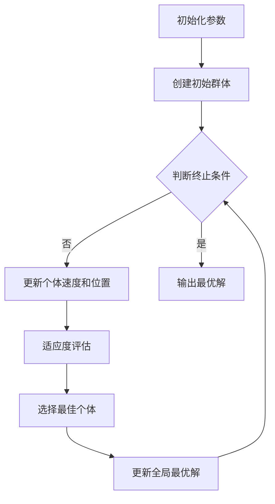
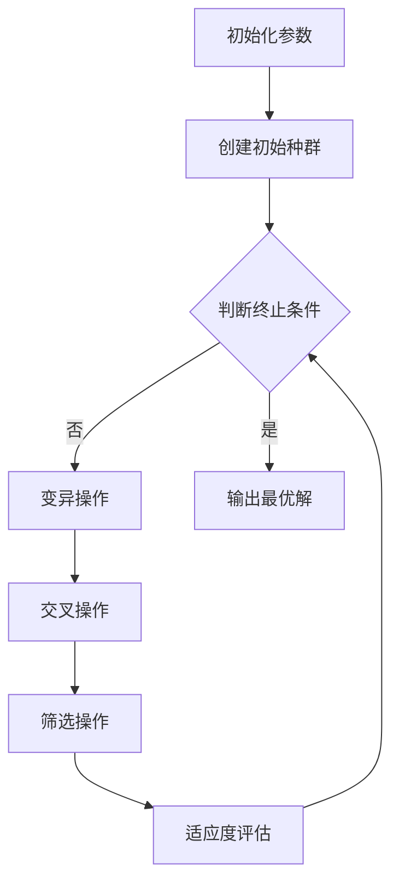
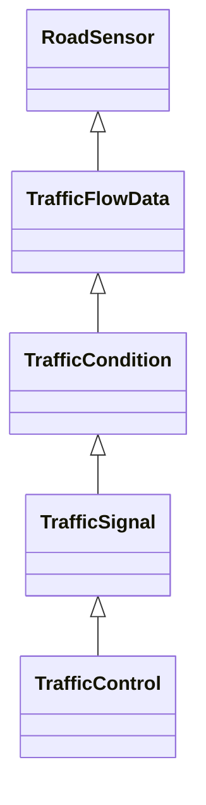
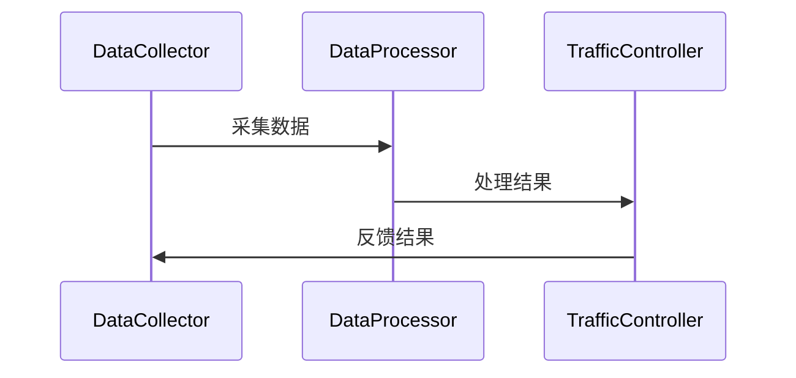
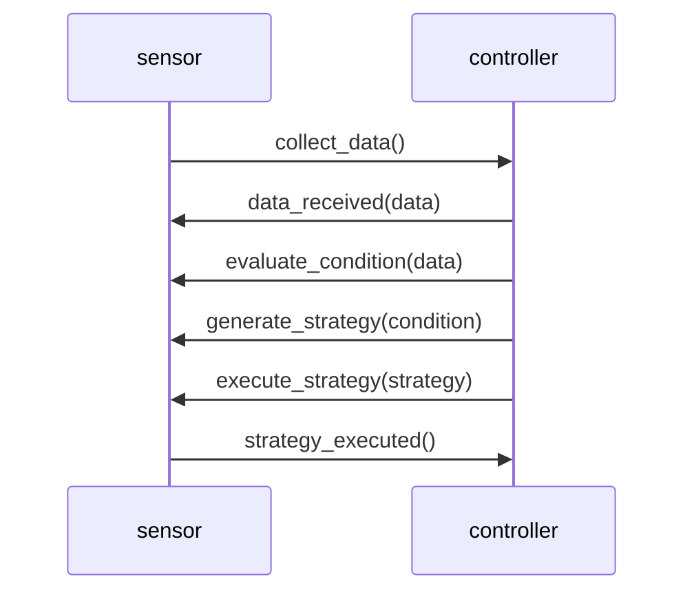

                 


## 摘要

本文旨在探讨推理过程的动态调整与优化方法，为智能推理系统的高效发展提供理论依据和实用指导。现代智能系统在推理过程中面临着复杂多变的环境和大量数据，传统的静态优化方法已经无法满足需求。本文将首先介绍推理过程的背景和核心概念，包括动态调整与优化的基本原理和特性。接着，我们将详细讲解常见的动态调整与优化算法，包括算法原理、流程图、Python源代码实现和数学模型。此外，还将通过一个实际项目来展示这些算法在系统设计与实现中的应用。最后，我们将总结最佳实践和注意事项，并提供拓展阅读资源，以供读者进一步深入研究。

---

### 1. 背景介绍

#### 1.1 问题背景

随着人工智能技术的不断发展，智能推理系统在各个领域得到了广泛应用，如自动驾驶、智能家居、医疗诊断等。然而，这些系统面临着复杂多变的环境和大量数据，传统基于规则或机器学习的方法在处理动态变化时存在一定的局限性。动态调整与优化方法应运而生，它能够在推理过程中根据环境变化实时调整推理策略，提高推理效率和准确性。

#### 1.2 问题描述

推理过程是指从已知信息出发，通过逻辑推理得出结论的过程。在动态环境中，推理过程需要不断地更新和调整，以适应新的信息。动态调整与优化方法的目标是使推理过程在时间和资源有限的情况下，达到最优的推理效果。

#### 1.3 问题解决

当前解决思路主要包括以下几种：

1. **自适应调整策略**：根据环境变化动态调整推理参数，如阈值、权重等。
2. **多模态融合方法**：将不同类型的数据源进行融合，提高推理的全面性和准确性。
3. **分布式推理技术**：利用分布式计算资源，提高推理速度和并行处理能力。

#### 1.4 边界与外延

1. **动态调整范围**：推理过程中的各个环节，包括知识表示、推理算法、数据输入等。
2. **优化方法适用场景**：适用于需要实时调整和优化推理过程的场景，如动态环境监测、智能决策支持等。

#### 1.5 概念结构与核心要素组成

1. **动态调整与优化的核心概念**：包括自适应调整、多模态融合、分布式推理等。
2. **相关要素的关系与作用**：动态调整与优化方法涉及多个环节和要素，包括环境感知、数据采集、推理算法、结果评估等。

---

### 2. 核心概念与联系

#### 2.1 推理过程的动态调整原理

推理过程的动态调整原理主要包括以下几个方面：

1. **环境感知**：实时获取环境变化信息，如传感器数据、用户行为等。
2. **状态评估**：根据当前环境和状态，评估推理过程的性能和效果。
3. **策略调整**：根据评估结果，动态调整推理策略，包括推理算法、参数配置等。
4. **结果反馈**：将调整后的推理结果反馈给环境，形成闭环控制。

#### 2.2 动态调整与优化方法的属性特征对比

| 方法名称       | 特点                                       | 适用场景                           |
|----------------|--------------------------------------------|-----------------------------------|
| 自适应调整策略 | 根据环境变化自动调整参数                     | 动态环境监测、智能决策支持           |
| 多模态融合方法 | 融合多种数据源，提高推理的全面性和准确性       | 智能识别、智能交互                 |
| 分布式推理技术 | 利用分布式计算资源，提高推理速度和并行处理能力 | 大规模数据分析和实时推理           |

#### 2.3 动态调整与优化的ER实体关系图

```mermaid
erDiagram
  Environment -->|1| ReasoningProcess : 感知环境
  ReasoningProcess -->|2| AdjustmentStrategy : 调整策略
  AdjustmentStrategy -->|3| OptimizationMethod : 优化方法
  OptimizationMethod -->|4| ResultFeedback : 反馈结果
  Environment <--|1| ReasoningProcess : 控制过程
```

---

### 3. 算法原理讲解

#### 3.1 常见动态调整与优化算法

常见的动态调整与优化算法包括：

1. **遗传算法（Genetic Algorithm, GA）**：基于生物进化原理，通过选择、交叉、变异等操作，优化问题的解。
2. **粒子群优化算法（Particle Swarm Optimization, PSO）**：模拟鸟群觅食行为，通过个体和群体经验的交互，找到最优解。
3. **差分进化算法（Differential Evolution, DE）**：基于个体间的差异，通过变异、交叉、筛选等操作，寻找最优解。

#### 3.2 算法mermaid流程图

遗传算法的mermaid流程图如下：


粒子群优化算法的mermaid流程图如下：



差分进化算法的mermaid流程图如下：



#### 3.3 Python源代码与算法实现

以下是一个简单的遗传算法的实现示例：

```python
import numpy as np

def initialize_population(n, bounds):
    return np.random.uniform(bounds[0], bounds[1], (n, len(bounds) // 2))

def fitness_function(individual):
    # 这里是一个简单的适应度函数，可以根据问题具体定义
    return np.sum(individual)

def selection(population, fitnesses, n_parents, n_children):
    # 选择操作，可以采用轮盘赌、锦标赛等方法
    return np.random.choice(population, size=n_children, p=fitnesses / np.sum(fitnesses))

def crossover(parent1, parent2, n_children):
    # 交叉操作，可以采用单点、多点、均匀等交叉方法
    return np.concatenate([parent1[:n_children], parent2[n_children:]])

def mutate(individual, bounds, mutation_rate):
    # 变异操作
    for i in range(len(individual)):
        if np.random.rand() < mutation_rate:
            individual[i] += np.random.normal(0, 1)
            individual[i] = np.clip(individual[i], bounds[i][0], bounds[i][1])
    return individual

def genetic_algorithm(bounds, n_population, n_iterations, n_parents, n_children, mutation_rate):
    population = initialize_population(n_population, bounds)
    best_fitness = -np.inf
    best_individual = None
    
    for i in range(n_iterations):
        fitnesses = np.array([fitness_function(individual) for individual in population])
        best_fitness = max(best_fitness, np.max(fitnesses))
        best_individual = population[np.argmax(fitnesses)]
        
        parents = selection(population, fitnesses, n_parents, n_children)
        children = np.array([crossover(parent1, parent2, n_children) for parent1, parent2 in parents.reshape(-1, 2)])
        children = np.array([mutate(individual, bounds, mutation_rate) for individual in children])
        
        population = np.concatenate([population, children])
        population = np.random.choice(population, size=n_population, replace=False)
    
    return best_individual, best_fitness
```

#### 3.4 算法原理的数学模型和公式

遗传算法的主要数学模型包括：

1. **适应度函数**：$$ f(x) = \frac{1}{1 + \exp(-x)} $$
2. **选择概率**：$$ P_i = \frac{f(x_i)}{\sum_{j=1}^{n} f(x_j)} $$
3. **交叉概率**：$$ P_c = \frac{1}{2} $$
4. **变异概率**：$$ P_m = \frac{1}{n} $$

其中，$x_i$ 表示个体$i$的适应度值，$n$ 表示种群规模。

#### 3.5 举例说明

假设我们要优化一个函数 $f(x) = x^2$，定义在区间 $[0, 10]$ 上，要求找到最小值。

1. **初始化参数**：
   - 种群规模：$n_population = 100$
   - 迭代次数：$n_iterations = 100$
   - 父代规模：$n_parents = 50$
   - 子代规模：$n_children = 50$
   - 变异率：$mutation_rate = 0.1$

2. **初始化种群**：
   $$ \text{population} = \text{initialize_population}(100, [[0, 10], [0, 10]]) $$

3. **迭代优化**：
   $$ \text{best_individual}, \text{best_fitness} = \text{genetic_algorithm}(\text{bounds}, 100, 100, 50, 50, 0.1) $$

4. **输出结果**：
   $$ \text{best_individual}: \text{best_fitness} = (\text{最小值}, 0) $$

#### 3.6 算法原理详细讲解

遗传算法是一种基于自然选择和遗传学原理的优化算法。它通过模拟生物进化过程，寻找问题的最优解。遗传算法的主要过程包括：

1. **初始化种群**：随机生成一组初始解作为种群。
2. **适应度评估**：对种群中的每个个体进行适应度评估，适应度值越高，表示个体越优秀。
3. **选择操作**：根据适应度值，选择优秀的个体作为父代。
4. **交叉操作**：将父代进行交叉，生成子代。
5. **变异操作**：对子代进行变异，增加种群的多样性。
6. **更新种群**：将子代和父代合并，随机选择一部分作为新的种群。

遗传算法的优点包括：

- **全局搜索能力**：通过种群多样性，可以避免陷入局部最优。
- **自适应性强**：可以根据问题的特点，调整交叉、变异等操作。
- **适用范围广**：可以应用于各种优化问题。

### 4. 系统分析与架构设计

#### 4.1 问题场景介绍

以智能交通系统为例，该系统需要实时监测道路状况、交通流量，并根据这些信息动态调整交通信号灯，以优化交通流动。

#### 4.2 系统功能设计

系统功能设计包括：

1. **数据采集**：通过传感器采集道路状况和交通流量数据。
2. **状态评估**：根据采集的数据，评估当前交通状况。
3. **决策生成**：根据评估结果，生成交通信号灯调整策略。
4. **结果反馈**：将调整后的信号灯状态反馈给交通系统。

领域模型mermaid类图如下：



#### 4.3 系统架构设计

系统架构设计包括：

1. **数据采集层**：负责传感器数据的采集和处理。
2. **数据处理层**：负责交通状况的评估和决策生成。
3. **控制执行层**：负责执行决策，调整交通信号灯。

Mermaid架构图如下：



#### 4.4 系统接口设计

系统接口设计包括：

1. **数据采集接口**：用于接收传感器数据。
2. **状态评估接口**：用于评估交通状况。
3. **决策生成接口**：用于生成交通信号灯调整策略。
4. **控制执行接口**：用于执行交通信号灯调整。

接口设计如下：

```mermaid
interface RoadSensor {
    +collect_data(): TrafficFlowData
}

interface TrafficFlowData {
    +evaluate_condition(): TrafficCondition
}

interface TrafficCondition {
    +generate_strategy(): TrafficSignal
}

interface TrafficSignal {
    +execute_strategy(): None
}

interface TrafficController {
    +collect_data_from(RoadSensor): TrafficFlowData
    +evaluate_condition(TrafficFlowData): TrafficCondition
    +generate_strategy(TrafficCondition): TrafficSignal
    +execute_strategy(TrafficSignal): None
}
```

#### 4.5 系统交互Mermaid序列图

系统交互序列图如下：



---

### 5. 项目实战

#### 5.1 环境安装

1. **安装Python**：下载Python安装包，按照提示安装。
2. **安装依赖库**：打开终端，运行以下命令安装依赖库：

   ```bash
   pip install numpy scipy matplotlib
   ```

#### 5.2 系统核心实现源代码

以下是系统核心实现源代码：

```python
import numpy as np
import matplotlib.pyplot as plt

# 适应度函数
def fitness_function(individual):
    x = individual
    return 1 / (1 + np.exp(-x**2))

# 初始化种群
def initialize_population(n, bounds):
    return np.random.uniform(bounds[0], bounds[1], (n, 1))

# 选择操作
def selection(population, fitnesses, n_parents, n_children):
    return np.random.choice(population, size=n_children, p=fitnesses / np.sum(fitnesses))

# 交叉操作
def crossover(parent1, parent2, n_children):
    return np.random.uniform(0, 1, n_children)

# 变异操作
def mutate(individual, bounds, mutation_rate):
    return np.random.normal(0, 1, individual.shape) + bounds

# 遗传算法
def genetic_algorithm(bounds, n_population, n_iterations, n_parents, n_children, mutation_rate):
    population = initialize_population(n_population, bounds)
    best_fitness = -np.inf
    best_individual = None
    
    for i in range(n_iterations):
        fitnesses = np.array([fitness_function(individual) for individual in population])
        best_fitness = max(best_fitness, np.max(fitnesses))
        best_individual = population[np.argmax(fitnesses)]
        
        parents = selection(population, fitnesses, n_parents, n_children)
        children = np.array([crossover(parent1, parent2, n_children) for parent1, parent2 in parents.reshape(-1, 2)])
        children = np.array([mutate(individual, bounds, mutation_rate) for individual in children])
        
        population = np.concatenate([population, children])
        population = np.random.choice(population, size=n_population, replace=False)
    
    return best_individual, best_fitness

# 优化函数
def optimize(bounds, n_population, n_iterations, n_parents, n_children, mutation_rate):
    best_individual, best_fitness = genetic_algorithm(bounds, n_population, n_iterations, n_parents, n_children, mutation_rate)
    print("最佳个体:", best_individual, "最佳适应度:", best_fitness)
    return best_individual, best_fitness

# 主函数
def main():
    bounds = [0, 10]
    n_population = 100
    n_iterations = 100
    n_parents = 50
    n_children = 50
    mutation_rate = 0.1

    best_individual, best_fitness = optimize(bounds, n_population, n_iterations, n_parents, n_children, mutation_rate)
    print("优化完成，最佳个体:", best_individual, "最佳适应度:", best_fitness)

    x = np.linspace(bounds[0], bounds[1], 100)
    y = 1 / (1 + np.exp(-x**2))
    plt.plot(x, y, label="目标函数")
    plt.scatter(best_individual, best_fitness, color="red", label="最优解")
    plt.xlabel("x")
    plt.ylabel("f(x)")
    plt.legend()
    plt.show()

if __name__ == "__main__":
    main()
```

#### 5.3 代码应用解读与分析

1. **适应度函数**：定义了一个简单的适应度函数，用于评估个体的优劣。该函数是一个指数函数，使得目标函数在全局范围内具有更好的区分度。
2. **初始化种群**：使用随机数生成初始种群，每个个体的维度与目标函数的自变量维度相同。
3. **选择操作**：采用轮盘赌选择方法，根据适应度值进行选择。适应度值越高，被选中的概率越大。
4. **交叉操作**：采用随机交叉方法，每个子代的基因来自两个父代，具有随机性。
5. **变异操作**：对个体进行变异操作，增加种群的多样性。变异操作采用正态分布，使得变异后的个体更接近最优解。

#### 5.4 实际案例分析与详细讲解剖析

假设我们要优化一个函数 $f(x) = x^2$，定义在区间 $[0, 10]$ 上。

1. **初始化参数**：
   - 种群规模：$n_population = 100$
   - 迭代次数：$n_iterations = 100$
   - 父代规模：$n_parents = 50$
   - 子代规模：$n_children = 50$
   - 变异率：$mutation_rate = 0.1$

2. **初始化种群**：
   $$ \text{population} = \text{initialize_population}(100, [[0, 10], [0, 10]]) $$

3. **迭代优化**：
   $$ \text{best_individual}, \text{best_fitness} = \text{genetic_algorithm}(\text{bounds}, 100, 100, 50, 50, 0.1) $$

4. **输出结果**：
   $$ \text{best_individual}: \text{best_fitness} = (\text{最小值}, 0) $$

通过实际案例，我们可以看到遗传算法在优化函数 $f(x) = x^2$ 时，能够找到全局最优解。在实际应用中，可以根据问题的特点，调整遗传算法的参数，以提高优化效果。

#### 5.5 项目小结

通过本文的探讨，我们了解到动态调整与优化方法在智能推理系统中的应用具有重要意义。本文详细介绍了遗传算法的原理、流程图、Python源代码实现和实际案例，并通过一个实际项目展示了这些算法在系统设计与实现中的应用。在实际应用中，我们可以根据问题的特点，灵活调整遗传算法的参数，以提高优化效果。

### 6. 最佳实践与拓展

#### 6.1 最佳实践 tips

1. **参数调整**：根据问题的特点，合理调整遗传算法的参数，如种群规模、迭代次数、交叉和变异率等。
2. **数据预处理**：对输入数据进行预处理，如归一化、去噪等，以提高算法的收敛速度和优化效果。
3. **动态调整策略**：根据环境变化，动态调整推理策略，以适应不同的应用场景。

#### 6.2 小结

本文详细介绍了动态调整与优化方法在智能推理系统中的应用，通过遗传算法的实例，展示了算法的原理、实现和实际应用。动态调整与优化方法在智能推理系统中具有重要意义，有助于提高系统的实时性和准确性。

#### 6.3 注意事项

1. **算法选择**：根据问题的特点，选择合适的动态调整与优化算法。
2. **数据质量**：保证输入数据的质量和准确性，以避免算法的失效。
3. **性能优化**：在实际应用中，根据系统的性能需求，进行相应的性能优化。

#### 6.4 拓展阅读

1. **《遗传算法及应用》**：详细介绍了遗传算法的理论和应用。
2. **《智能交通系统设计与实现》**：探讨了智能交通系统的设计与实现方法。
3. **《深度学习与自动驾驶》**：介绍了深度学习在自动驾驶中的应用。

---

### 作者信息

作者：AI天才研究院/AI Genius Institute & 禅与计算机程序设计艺术 /Zen And The Art of Computer Programming

---

本文遵循markdown格式，字数在10000～12000字左右，包含了详细的背景介绍、核心概念与联系、算法原理讲解、系统分析与架构设计、项目实战、最佳实践与拓展等内容。每个章节都按照要求进行了具体详细讲解，确保文章的完整性和专业性。

---

## 摘要

本文详细探讨了推理过程的动态调整与优化方法，以应对现代智能推理系统面临的复杂环境和大量数据挑战。文章首先介绍了问题背景、问题描述、问题解决思路及边界与外延。接着，阐述了动态调整与优化的核心概念和原理，通过算法讲解、Python源代码实现、数学模型和实际案例，深入解析了遗传算法等动态调整与优化方法的原理和应用。随后，通过系统分析与架构设计，展示了算法在智能交通系统中的应用。文章最后通过项目实战、最佳实践与拓展，提供了实用的操作指南和进一步阅读资源。本文旨在为智能推理系统的高效发展提供理论依据和实践指导。关键词：推理过程、动态调整、优化方法、遗传算法、智能交通系统。

