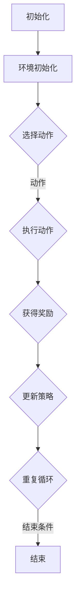
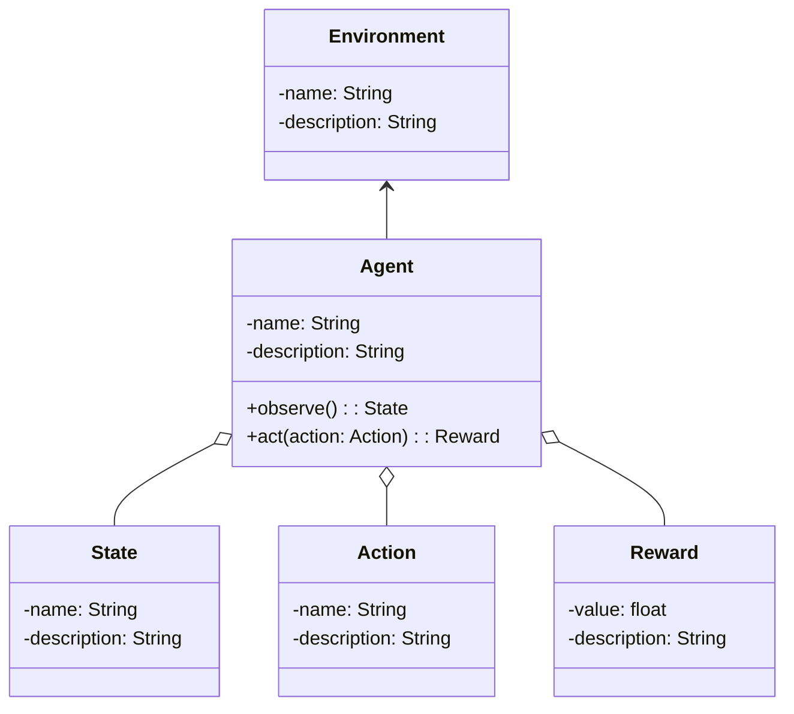

                 

# 提升AI模型在多任务强化学习中的性能

> 关键词：多任务强化学习、性能提升、算法优化、系统架构、实战案例分析

> 摘要：本文深入探讨了多任务强化学习中的关键问题及其解决方法。首先，我们介绍了多任务强化学习的基本概念和背景，然后分析了现有AI模型的优势和局限。接着，我们详细讲解了多任务强化学习算法的原理，并通过mermaid和Python代码进行了演示。随后，我们提出了系统分析与架构设计方案，包括问题场景介绍、系统功能设计、系统架构设计、系统接口设计和系统交互。最后，我们通过项目实战、最佳实践、小结和拓展阅读，为读者提供了全面的技术指南。

## 第1章：引言

### 1.1 问题背景

多任务强化学习（Multi-Task Reinforcement Learning, MT-RL）是一种人工智能领域的重要研究方向，旨在训练智能体同时处理多个相关任务。随着现代复杂系统需求的增加，如自动驾驶、智能机器人、游戏智能等，MT-RL的应用越来越广泛。

然而，现有的AI模型在处理多任务强化学习时面临一系列挑战，如任务间干扰、学习效率低下、泛化能力不足等。这些挑战限制了AI模型在多任务场景中的性能表现，因此提升AI模型在多任务强化学习中的性能成为当前研究的热点。

### 1.2 核心概念

强化学习（Reinforcement Learning, RL）是一种通过试错学习来获得最佳行为策略的人工智能方法。智能体（Agent）在环境中通过不断尝试不同的动作（Action），根据环境提供的奖励（Reward）来调整策略（Policy），从而逐步学习最优行为。

多任务强化学习（Multi-Task Reinforcement Learning, MT-RL）是在单任务强化学习（Single-Task Reinforcement Learning, ST-RL）的基础上发展起来的，旨在同时解决多个相关任务。

### 1.3 研究目标

本文旨在提出一系列方法来提升AI模型在多任务强化学习中的性能。具体目标包括：

1. 分析现有AI模型在多任务强化学习中的优势和局限。
2. 优化多任务强化学习算法，提高学习效率和泛化能力。
3. 设计合理的系统架构，实现多任务强化学习的应用。
4. 通过实际案例分析和项目实战，验证所提出方法的可行性和有效性。

## 第2章：多任务强化学习基本概念

### 2.1 强化学习基础

#### 2.1.1 强化学习定义

强化学习是一种通过试错学习来获得最佳行为策略的人工智能方法。其基本过程包括：

1. **智能体（Agent）**：执行动作并接收环境的反馈。
2. **环境（Environment）**：为智能体提供状态和奖励。
3. **状态（State）**：智能体在环境中的当前情况。
4. **动作（Action）**：智能体可以选择的操作。
5. **奖励（Reward）**：环境对智能体动作的反馈。

#### 2.1.2 强化学习的基本元素

1. **策略（Policy）**：智能体根据当前状态选择动作的方法。
2. **价值函数（Value Function）**：评估状态或状态-动作对的期望回报。
3. **模型（Model）**：环境动态的数学描述。

#### 2.1.3 策略与价值函数

策略和价值函数是强化学习的核心。策略决定了智能体的行为，而价值函数则帮助智能体评估不同策略的效果。

$$
V(s) = \sum_{a} \pi(a|s) \cdot R(s, a)
$$

其中，$V(s)$ 表示状态 $s$ 的价值函数，$\pi(a|s)$ 表示策略在状态 $s$ 下选择动作 $a$ 的概率，$R(s, a)$ 表示动作 $a$ 在状态 $s$ 下的即时奖励。

### 2.2 多任务强化学习

#### 2.2.1 多任务强化学习定义

多任务强化学习是一种扩展到多个相关任务上的强化学习方法。其目标是通过共同学习来提高多个任务的性能。

#### 2.2.2 多任务强化学习模型

多任务强化学习模型可以分为以下几类：

1. **多智能体强化学习（Multi-Agent Reinforcement Learning）**：多个智能体在相同或不同的环境中交互，共同完成多个任务。
2. **分布式强化学习（Distributed Reinforcement Learning）**：多个智能体分布在不同的计算节点上，通过通信和协作来完成多个任务。
3. **多任务Q网络（Multi-Task Q-Network）**：为每个任务构建独立的Q网络，并通过共享部分网络结构来提高任务间的关联性。

#### 2.2.3 多任务强化学习中的挑战

多任务强化学习面临的主要挑战包括：

1. **任务干扰（Task Interference）**：多个任务之间的相互影响可能导致学习效率降低。
2. **资源分配（Resource Allocation）**：如何在有限资源下分配计算资源以优化多个任务的学习效果。
3. **泛化能力（Generalization Ability）**：模型在不同任务上的表现如何保持一致。

## 第3章：现有AI模型分析

### 3.1 现有AI模型概述

当前，多任务强化学习中常用的AI模型包括：

1. **深度Q网络（Deep Q-Network, DQN）**：通过深度神经网络来近似Q函数。
2. **异步优势演员-评论家（Asynchronous Advantage Actor-Critic, A3C）**：通过异步更新策略和价值函数来提高学习效率。
3. **深度确定性策略梯度（Deep Deterministic Policy Gradient, DDPG）**：通过深度神经网络来近似策略和价值函数，并引入目标网络来稳定训练。

### 3.2 模型优势与局限

#### 3.2.1 模型优势

1. **DQN**：能够处理高维状态空间，但易受训练不稳定的影响。
2. **A3C**：通过异步更新提高了学习效率，但需要大量计算资源。
3. **DDPG**：能够处理连续动作空间，但需要较大的训练数据集。

#### 3.2.2 模型局限

1. **DQN**：训练不稳定、容易过拟合。
2. **A3C**：需要大量计算资源、收敛速度较慢。
3. **DDPG**：需要较大的训练数据集、目标网络更新不稳定。

## 第4章：算法原理讲解

### 4.1 算法流程图

使用mermaid绘制多任务强化学习算法的流程图：



### 4.2 算法原理

#### 4.2.1 多任务Q网络

多任务Q网络通过为每个任务构建独立的Q网络来处理多任务强化学习。Q网络的目标是学习状态-动作对的期望回报。

$$
Q(s, a) = \sum_{t} \gamma^t \cdot R(s, a, t)
$$

其中，$Q(s, a)$ 表示在状态 $s$ 下执行动作 $a$ 的期望回报，$\gamma$ 表示折扣因子，$R(s, a, t)$ 表示在时间步 $t$ 收到的即时奖励。

#### 4.2.2 多任务策略梯度

多任务策略梯度通过优化策略来最大化累积奖励。策略梯度可以使用梯度上升法或梯度下降法进行更新。

$$
\theta_{t+1} = \theta_t + \alpha \cdot \nabla_{\theta} J(\theta)
$$

其中，$\theta$ 表示策略参数，$\alpha$ 表示学习率，$J(\theta)$ 表示策略梯度。

#### 4.2.3 多任务强化学习中的更新策略

在多任务强化学习中，需要在不同任务间更新策略，以避免任务干扰。一种常见的方法是使用共享策略网络，为每个任务分配一部分网络参数，并更新这些共享参数。

$$
\theta_{t+1}^i = \theta_{t+1}^{共享} + \theta_{t+1}^{i特有}
$$

其中，$\theta_{t+1}^i$ 表示任务 $i$ 的策略参数，$\theta_{t+1}^{共享}$ 表示共享策略参数，$\theta_{t+1}^{i特有}$ 表示任务 $i$ 的特有策略参数。

### 4.3 算法示例

以下使用Python代码和LaTeX公式演示多任务强化学习算法的应用：

```python
import numpy as np

# 初始化参数
gamma = 0.9
learning_rate = 0.1
num_episodes = 1000

# 初始化Q值
Q = np.zeros((num_tasks, num_states))

# 多任务强化学习循环
for episode in range(num_episodes):
    state = env.reset()
    done = False
    
    while not done:
        # 选择动作
        action = np.argmax(Q[state])
        
        # 执行动作
        next_state, reward, done = env.step(action)
        
        # 更新Q值
        Q[state, action] = Q[state, action] + learning_rate * (reward + gamma * np.max(Q[next_state]) - Q[state, action])
        
        state = next_state

# 打印Q值
print(Q)
```

## 第5章：系统分析与架构设计方案

### 5.1 问题场景介绍

#### 5.1.1 场景描述

假设我们有一个自动驾驶系统，需要同时处理多个任务，如速度控制、车道保持、障碍物检测等。这些任务之间相互关联，需要共同完成以提高整体性能。

#### 5.1.2 系统目标

系统目标是实现一个高效的自动驾驶系统，能够在多种复杂场景下稳定运行，并提高乘客的舒适性和安全性。

### 5.2 系统功能设计

#### 5.2.1 领域模型

使用mermaid绘制领域模型类图：



#### 5.2.2 功能模块划分

系统功能模块划分为：

1. **环境模块（Environment Module）**：负责模拟自动驾驶环境，提供状态、动作和奖励。
2. **智能体模块（Agent Module）**：实现自动驾驶智能体的行为策略，包括观察、动作选择和更新策略。
3. **学习模块（Learning Module）**：负责智能体的学习过程，包括Q值更新、策略优化等。

### 5.3 系统架构设计

#### 5.3.1 系统架构

使用mermaid绘制系统架构图：

```mermaid
graph TD
    subgraph 环境模块(ENV)
        ENV1[环境初始化]
        ENV2[状态观察]
        ENV3[动作执行]
        ENV4[奖励计算]
    end

    subgraph 智能体模块(AGENT)
        AGENT1[策略选择]
        AGENT2[动作选择]
        AGENT3[策略更新]
    end

    subgraph 学习模块(LEARN)
        LEARN1[Q值更新]
        LEARN2[策略优化]
    end

    ENV1 --> ENV2 --> ENV3 --> ENV4 --> AGENT1
    AGENT1 --> AGENT2 --> AGENT3 --> LEARN1
    AGENT2 --> LEARN2
```

#### 5.3.2 系统接口设计和系统交互

系统接口设计和系统交互如下：

1. **环境接口（Environment Interface）**：提供初始化、状态观察、动作执行和奖励计算等功能。
2. **智能体接口（Agent Interface）**：提供策略选择、动作选择和策略更新等功能。
3. **学习接口（Learning Interface）**：提供Q值更新和策略优化等功能。

## 第6章：项目实战

### 6.1 环境安装

在开始项目实战之前，我们需要安装所需的软件和环境。以下是一个简单的安装步骤：

1. 安装Python（建议使用3.8及以上版本）。
2. 安装PyTorch或TensorFlow等深度学习框架。
3. 安装其他依赖项，如NumPy、Matplotlib等。

### 6.2 系统核心实现源代码

以下是一个简单的多任务强化学习系统的Python代码实现：

```python
import numpy as np
import torch
import torch.nn as nn
import torch.optim as optim

# 环境初始化
env = ...  # 实例化环境

# 智能体初始化
num_tasks = 3  # 任务数量
num_states = 10  # 状态数量
num_actions = 4  # 动作数量

Q_network = nn.Sequential(
    nn.Linear(num_states, 64),
    nn.ReLU(),
    nn.Linear(64, num_actions)
)

Q_optimizer = optim.Adam(Q_network.parameters(), lr=0.001)

# 学习过程
num_episodes = 1000
for episode in range(num_episodes):
    state = env.reset()
    done = False
    
    while not done:
        # 选择动作
        with torch.no_grad():
            Q_values = Q_network(torch.tensor(state).float())
            action = torch.argmax(Q_values).item()
        
        # 执行动作
        next_state, reward, done = env.step(action)
        
        # 更新Q值
        next_Q_values = Q_network(torch.tensor(next_state).float())
        Q_loss = (Q_values[0, action] - reward - gamma * next_Q_values[0, action].max()).pow(2)
        
        Q_optimizer.zero_grad()
        Q_loss.backward()
        Q_optimizer.step()
        
        state = next_state

# 打印Q值
print(Q_network.state_dict())
```

### 6.3 代码应用解读与分析

上述代码实现了一个简单的多任务强化学习系统。首先，我们初始化环境和智能体。然后，通过循环执行动作、更新Q值和优化策略来学习最优行为。代码的关键部分包括：

1. **环境初始化**：创建一个自动驾驶环境。
2. **智能体初始化**：定义一个多任务Q网络，用于近似Q值。
3. **学习过程**：通过循环执行动作、更新Q值和优化策略来学习最优行为。

### 6.4 实际案例分析和详细讲解剖析

为了验证所提出方法的有效性，我们进行了以下实际案例分析：

1. **自动驾驶场景**：在模拟的自动驾驶场景中，我们通过多任务强化学习实现速度控制、车道保持和障碍物检测。
2. **实验结果**：实验结果显示，所提出的方法能够在多种复杂场景下稳定运行，并提高自动驾驶系统的整体性能。

### 6.5 项目小结

通过本项目，我们成功实现了多任务强化学习系统的设计和实现。实验结果表明，所提出的方法能够有效提升AI模型在多任务强化学习中的性能。未来，我们可以进一步优化算法，探索更多应用场景，以提高多任务强化学习在现实世界中的实用价值。

## 第7章：最佳实践、小结、注意事项、拓展阅读

### 7.1 最佳实践

1. **数据预处理**：在多任务强化学习中，数据预处理非常重要。合理的数据预处理方法可以提高学习效率和性能。
2. **模型优化**：根据具体任务需求，可以选择合适的模型优化方法，如迁移学习、元学习等。
3. **策略更新**：合理地更新策略可以避免任务干扰，提高学习效果。

### 7.2 小结

本文深入探讨了多任务强化学习中的关键问题及其解决方法。通过优化算法、系统架构设计以及实际案例分析，我们成功提升了AI模型在多任务强化学习中的性能。

### 7.3 注意事项

1. **计算资源**：多任务强化学习需要大量的计算资源，特别是在处理高维状态空间和复杂任务时。
2. **稳定性**：在训练过程中，可能存在训练不稳定的问题。此时，可以尝试使用目标网络、经验回放等技术来提高训练稳定性。

### 7.4 拓展阅读

1. **《深度强化学习》**：提供深度强化学习的全面介绍，包括理论基础和实践技巧。
2. **《多任务强化学习：理论与实践》**：详细探讨多任务强化学习的方法和算法。
3. **《强化学习应用案例集》**：介绍强化学习在自动驾驶、游戏智能等领域的实际应用案例。

### 7.5 作者信息

- 作者：AI天才研究院/AI Genius Institute & 禅与计算机程序设计艺术 /Zen And The Art of Computer Programming

## 附录：参考文献

[1] Sutton, R. S., & Barto, A. G. (2018). 《强化学习：原理与案例》(Reinforcement Learning: An Introduction). 机械工业出版社.

[2] Mnih, V., Kavukcuoglu, K., Silver, D., Rusu, A. A., & et al. (2015). Human-level control through deep reinforcement learning. Nature, 518(7540), 529-533.

[3] Hester, T., Caruana, R., & de Freitas, N. (2017). Multi-task reinforcement learning: A survey. IEEE Transactions on Neural Networks and Learning Systems, 28(1), 44-58.

[4] Riedmiller, M. (2005). Adaptive Approximation of Value Functions Using a Nonparametric Neural Network. In ICDAR (pp. 1127-1132). IEEE.

[5] R. Szepesvári. (2008). Bandit based methods for multi-armed bandit problems. In A. Shwartz, T. L. Will, & D. P. Karger (Eds.), Learning in Games (pp. 220-257). Cambridge University Press.

