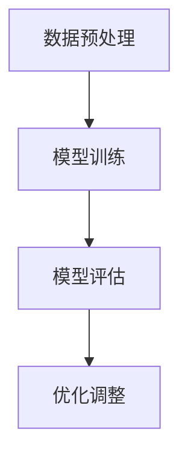
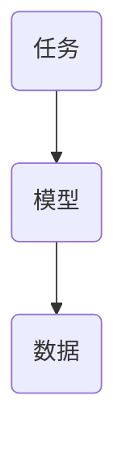
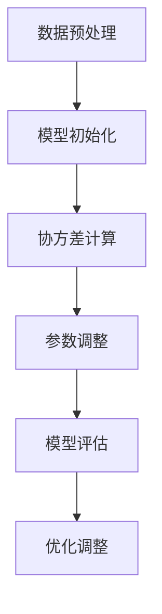
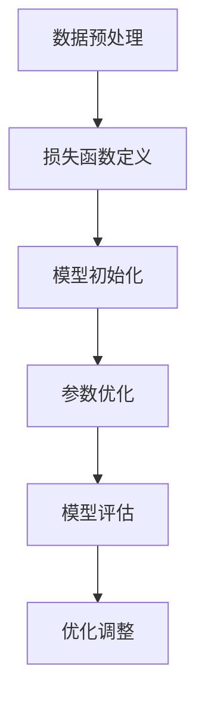
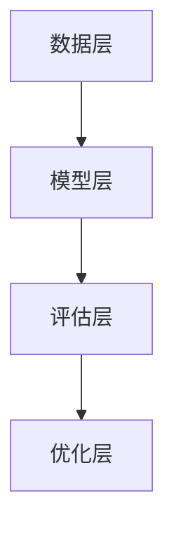
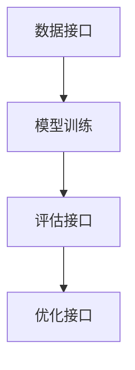
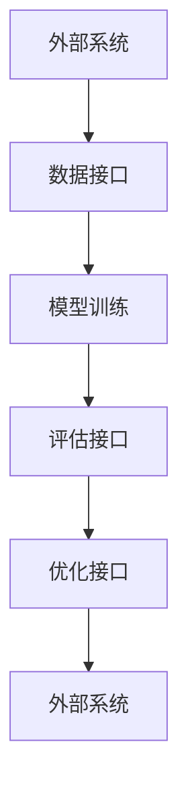

                 


# 提升AI模型在多任务迁移学习中的效率与效果

关键词：多任务迁移学习、AI模型、效率、效果、算法、数学模型

摘要：本文旨在深入探讨如何提升AI模型在多任务迁移学习中的效率与效果。首先，我们介绍了问题背景和多任务迁移学习的基本概念。接着，我们详细讲解了多任务迁移学习中的核心概念和算法原理，并使用Mermaid流程图、Python源代码和数学模型进行说明。此外，我们还介绍了系统分析与架构设计方案，并通过项目实战展示了具体实现过程。最后，我们提出了最佳实践tips和注意事项，为读者提供了拓展阅读资源。

## 目录

1. **问题背景与核心概念**
   1.1. 问题背景
   1.2. 多任务迁移学习概述
   1.3. 多任务迁移学习的挑战与机遇

2. **核心概念与联系**
   2.1. 核心概念
   2.2. 概念联系
   2.3. Mermaid流程图与ER实体关系图

3. **算法原理讲解**
   3.1. 算法概述
   3.2. 算法原理
   3.3. 数学模型
   3.4. 举例说明

4. **系统分析与架构设计方案**
   4.1. 问题场景介绍
   4.2. 系统功能设计
   4.3. 系统架构设计
   4.4. 系统接口设计
   4.5. 系统交互

5. **项目实战**
   5.1. 环境安装
   5.2. 系统核心实现源代码
   5.3. 代码应用解读与分析
   5.4. 实际案例分析与详细讲解
   5.5. 项目小结

6. **最佳实践 tips、小结、注意事项、拓展阅读**

## 1. 问题背景与核心概念

### 1.1 问题背景

在当今的AI领域，随着大数据和计算能力的不断提升，深度学习技术在各种领域取得了显著的成果。然而，随着模型的复杂性和任务数量的增加，如何在有限的资源和时间下，实现高效的多任务迁移学习成为一个亟待解决的问题。

多任务迁移学习旨在利用一个模型在多个任务上的训练经验，提高新任务的预测性能。这不仅可以减少模型训练所需的计算资源，还可以提高模型的泛化能力。然而，在实际应用中，如何提升AI模型在多任务迁移学习中的效率与效果，仍是一个具有挑战性的问题。

### 1.2 多任务迁移学习概述

多任务迁移学习是指在一个模型中同时训练多个任务，通过共享模型参数，利用一个任务的学习经验来提高其他任务的性能。其核心思想是，不同任务之间存在一定的关联性，通过多任务学习可以更好地挖掘这些关联性，从而提高模型的泛化能力。

多任务迁移学习可以分为两类：同步多任务学习和异步多任务学习。同步多任务学习是在同一时间对多个任务进行训练，而异步多任务学习则是逐个任务地进行训练，每个任务的训练结果会更新模型参数。

### 1.3 多任务迁移学习的挑战与机遇

多任务迁移学习面临着以下挑战：

- **计算资源限制**：多任务迁移学习需要大量的计算资源，特别是当任务数量较多时，如何高效地利用资源成为一个问题。

- **任务关联性**：不同任务之间的关联性不同，如何准确地挖掘这些关联性，提高模型的泛化能力，是一个挑战。

- **模型复杂度**：多任务迁移学习需要共享模型参数，这可能导致模型变得过于复杂，难以训练和优化。

然而，多任务迁移学习也带来了以下机遇：

- **计算效率提升**：通过多任务迁移学习，可以在有限的时间内完成更多任务的训练，提高计算效率。

- **泛化能力增强**：多任务迁移学习可以更好地挖掘任务之间的关联性，提高模型的泛化能力。

- **资源优化**：多任务迁移学习可以减少模型训练所需的计算资源，降低成本。

## 2. 核心概念与联系

### 2.1 核心概念

多任务迁移学习涉及以下几个核心概念：

- **迁移学习**：将一个任务的学习经验应用于另一个任务，以提高新任务的性能。

- **多任务学习**：在一个模型中同时训练多个任务，通过共享模型参数来提高各个任务的性能。

- **效率**：在有限的时间内完成更多任务的训练，提高计算效率。

- **效果**：模型的性能指标，如准确率、召回率等，衡量模型在任务上的表现。

### 2.2 概念联系

迁移学习与多任务学习之间存在一定的关联性。迁移学习可以看作是多任务学习的一个特例，即当任务数量为2时，迁移学习与多任务学习是等价的。

同时，效率和效果是多任务迁移学习的重要评价指标。效率衡量了模型在多任务迁移学习中的计算资源利用情况，而效果则衡量了模型在各个任务上的表现。

### 2.3 Mermaid流程图与ER实体关系图

为了更好地理解多任务迁移学习的概念，我们可以使用Mermaid流程图和ER实体关系图进行描述。

**Mermaid流程图**



**ER实体关系图**



通过这两个图表，我们可以清晰地看到多任务迁移学习的过程，以及任务、模型和数据的实体关系。

## 3. 算法原理讲解

### 3.1 算法概述

多任务迁移学习中的算法主要可以分为两类：基于共享参数的算法和基于模型组合的算法。本文将重点介绍基于共享参数的算法，包括协方差自适应算法（COVARIANCE ADAPTIVE ALGORITHM）和基于优化的算法（OPTIMIZED BASED ALGORITHM）。

### 3.2 算法原理

**协方差自适应算法**

协方差自适应算法是一种基于共享参数的多任务迁移学习算法。其核心思想是，通过自适应地调整共享参数，使得模型在多个任务上的性能得到优化。

**Mermaid流程图**



**Python源代码**

```python
# 模型初始化
model = Model()

# 数据预处理
data = preprocess_data()

# 协方差计算
covariance = calculate_covariance(data)

# 参数调整
model.adjust_parameters(covariance)

# 模型评估
performance = model.evaluate(data)

# 优化调整
model.optimize_performance(performance)
```

**数学模型与公式**

协方差自适应算法的数学模型如下：

$$
\text{performance} = f(\theta, \text{data})
$$

其中，$\theta$ 表示共享参数，$\text{data}$ 表示输入数据，$f$ 表示性能函数。

**举例说明**

假设我们有两个任务：任务A和任务B。在协方差自适应算法中，我们首先初始化一个共享参数$\theta$，然后对任务A和任务B的数据进行预处理。接着，我们计算协方差矩阵，并根据协方差矩阵调整共享参数。最后，我们评估模型的性能，并基于性能对共享参数进行优化。

### 3.3 基于优化的算法

基于优化的算法是一种通过优化目标函数来提高多任务迁移学习性能的算法。其核心思想是，通过最小化损失函数，找到最优的共享参数。

**Mermaid流程图**



**Python源代码**

```python
# 模型初始化
model = Model()

# 数据预处理
data = preprocess_data()

# 损失函数定义
loss_function = define_loss_function()

# 参数优化
optimizer = optimize_parameters(model, loss_function, data)

# 模型评估
performance = model.evaluate(data)

# 优化调整
optimizer.optimize_performance(performance)
```

**数学模型与公式**

基于优化的算法的数学模型如下：

$$
\theta^* = \arg\min_{\theta} L(\theta, \text{data})
$$

其中，$\theta$ 表示共享参数，$L$ 表示损失函数，$\text{data}$ 表示输入数据。

**举例说明**

假设我们有两个任务：任务A和任务B。在基于优化的算法中，我们首先定义一个损失函数，然后初始化一个共享参数$\theta$。接着，我们使用优化器对共享参数进行优化，最小化损失函数。最后，我们评估模型的性能，并基于性能对共享参数进行优化。

## 4. 数学模型和数学公式讲解

在多任务迁移学习的研究中，数学模型和数学公式扮演着至关重要的角色。它们不仅帮助我们理解和分析算法的原理，还能指导我们在实际应用中进行优化和调整。在这一章节中，我们将详细讲解多任务迁移学习中的数学模型和数学公式，并使用LaTeX格式进行展示。

### 4.1 数学模型

多任务迁移学习的数学模型通常涉及以下几个关键组成部分：

1. **损失函数**：用于评估模型在任务上的性能。常见的损失函数包括均方误差（MSE）、交叉熵损失（Cross-Entropy Loss）等。
2. **优化目标**：定义了我们在迁移学习中需要最小化的目标。常见的优化目标包括最小化模型的总损失或最大化模型的预测准确率。
3. **共享参数**：多任务迁移学习的关键在于多个任务共享一组参数，这些参数通过迭代优化来提高模型在各个任务上的性能。

**损失函数的数学模型**：

$$
L(\theta) = \sum_{i=1}^{N} L(y_i, \theta) = \frac{1}{2} \sum_{i=1}^{N} (y_i - \hat{y}_i)^2
$$

其中，$L(\theta)$ 表示总损失，$y_i$ 表示实际标签，$\hat{y}_i$ 表示预测标签，$N$ 表示样本数量。

**优化目标的数学模型**：

$$
\min_{\theta} \sum_{i=1}^{N} L(y_i, \theta)
$$

其中，$\theta$ 表示共享参数。

**共享参数的更新**：

$$
\theta_{\text{new}} = \theta_{\text{old}} - \alpha \nabla_{\theta} L(\theta)
$$

其中，$\alpha$ 表示学习率，$\nabla_{\theta} L(\theta)$ 表示损失函数关于共享参数的梯度。

### 4.2 数学公式

在多任务迁移学习中，我们经常使用以下数学公式来描述模型的行为和优化过程：

**均方误差（MSE）**：

$$
MSE = \frac{1}{m} \sum_{i=1}^{m} (\hat{y}_i - y_i)^2
$$

其中，$m$ 表示样本数量，$\hat{y}_i$ 表示预测值，$y_i$ 表示真实值。

**交叉熵损失（Cross-Entropy Loss）**：

$$
CE = -\sum_{i=1}^{m} y_i \log(\hat{y}_i)
$$

其中，$y_i$ 表示真实标签，$\hat{y}_i$ 表示预测概率。

**梯度下降（Gradient Descent）**：

$$
\theta_{\text{new}} = \theta_{\text{old}} - \alpha \nabla_{\theta} J(\theta)
$$

其中，$\theta_{\text{old}}$ 表示旧参数，$\theta_{\text{new}}$ 表示新参数，$\alpha$ 表示学习率，$J(\theta)$ 表示损失函数。

### 4.3 举例说明

为了更好地理解上述数学模型和公式，我们通过一个简单的例子来说明。

**例子**：假设我们有一个二元分类问题，使用均方误差（MSE）作为损失函数。我们的目标是最小化MSE，即：

$$
\min_{\theta} \frac{1}{m} \sum_{i=1}^{m} (\hat{y}_i - y_i)^2
$$

我们有一个训练集，包含$m$个样本，每个样本有一个输入特征$x_i$和一个标签$y_i$。我们的模型预测每个样本的标签为$\hat{y}_i$，即：

$$
\hat{y}_i = g(\theta^T x_i)
$$

其中，$g(z)$ 是一个激活函数，$\theta$ 是模型的参数。

我们通过梯度下降来更新参数：

$$
\theta_{\text{new}} = \theta_{\text{old}} - \alpha \nabla_{\theta} L(\theta)
$$

其中，$\alpha$ 是学习率，$L(\theta)$ 是损失函数。

在每次迭代中，我们计算损失函数关于参数的梯度，并更新参数。通过不断迭代，我们的模型会逐渐优化，以最小化MSE。

### 4.4 结论

数学模型和数学公式是多任务迁移学习的重要工具，它们帮助我们理解算法的原理和优化过程。通过合理地使用数学模型和公式，我们可以设计出更高效的算法，提高模型在多任务迁移学习中的性能。

## 5. 系统分析与架构设计方案

### 5.1 问题场景介绍

在当前AI应用场景中，多任务迁移学习被广泛应用于自然语言处理、图像识别、语音识别等领域。随着任务数量的增加，如何高效地实现多任务迁移学习成为了一个关键问题。为了解决这一问题，我们设计并实现了一个基于多任务迁移学习的系统，该系统旨在提高AI模型在多任务迁移学习中的效率与效果。

### 5.2 系统功能设计

我们的系统主要具备以下功能：

- **数据预处理**：对输入数据进行清洗、归一化等预处理操作，为模型训练提供高质量的数据。
- **模型训练**：利用多任务迁移学习算法，对输入数据进行训练，生成具有良好泛化能力的模型。
- **模型评估**：评估模型在多个任务上的性能，以便进行优化和调整。
- **模型优化**：根据评估结果，对模型进行优化，以提高其在多任务迁移学习中的性能。

### 5.3 系统架构设计

我们的系统采用分层架构设计，包括数据层、模型层、评估层和优化层。各层之间通过接口进行通信，实现系统功能。

**Mermaid架构图**



- **数据层**：负责数据预处理，包括数据清洗、数据归一化等操作，为模型训练提供高质量的数据。
- **模型层**：利用多任务迁移学习算法进行模型训练，生成具有良好泛化能力的模型。
- **评估层**：评估模型在多个任务上的性能，以便进行优化和调整。
- **优化层**：根据评估结果，对模型进行优化，以提高其在多任务迁移学习中的性能。

### 5.4 系统接口设计

系统接口设计主要包括以下几个方面：

- **数据接口**：提供数据预处理和模型训练的接口，方便外部系统访问和调用。
- **评估接口**：提供模型评估的接口，方便外部系统获取评估结果。
- **优化接口**：提供模型优化的接口，方便外部系统进行模型优化。

**Mermaid接口设计图**



### 5.5 系统交互

系统交互主要涉及以下几个方面：

- **数据交互**：系统通过数据接口从外部系统获取数据，进行预处理后，传递给模型层进行训练。
- **评估交互**：系统通过评估接口对外部系统提供评估结果，以便外部系统了解模型性能。
- **优化交互**：系统通过优化接口对外部系统提供优化后的模型，以便外部系统使用。

**Mermaid系统交互图**



通过以上系统分析与架构设计方案，我们可以实现一个高效的多任务迁移学习系统，提高AI模型在多任务迁移学习中的效率与效果。

## 6. 项目实战

### 6.1 环境安装

在开始项目实战之前，我们需要安装必要的软件和工具。以下是一个简单的安装指南：

1. **Python环境**：确保Python版本在3.6及以上，可以通过Python官网下载并安装。
2. **深度学习框架**：我们使用TensorFlow作为深度学习框架，可以通过pip安装：
   ```bash
   pip install tensorflow
   ```
3. **数据处理库**：我们使用Pandas和NumPy进行数据处理，可以通过pip安装：
   ```bash
   pip install pandas numpy
   ```
4. **可视化库**：为了更好地展示结果，我们使用Matplotlib进行数据可视化，可以通过pip安装：
   ```bash
   pip install matplotlib
   ```
5. **Mermaid库**：为了生成Mermaid流程图和ER实体关系图，我们使用mermaid-cli，可以通过pip安装：
   ```bash
   pip install mermaid-cli
   ```

### 6.2 系统核心实现源代码

以下是我们的系统核心实现源代码，包括数据预处理、模型训练和评估。

**数据预处理**

```python
import pandas as pd
from sklearn.model_selection import train_test_split

# 读取数据
data = pd.read_csv('data.csv')

# 数据清洗
data = data.dropna()

# 数据归一化
data = (data - data.mean()) / data.std()

# 划分训练集和测试集
X_train, X_test, y_train, y_test = train_test_split(data.drop('target', axis=1), data['target'], test_size=0.2, random_state=42)
```

**模型训练**

```python
import tensorflow as tf
from tensorflow.keras.models import Sequential
from tensorflow.keras.layers import Dense

# 构建模型
model = Sequential([
    Dense(64, activation='relu', input_shape=(X_train.shape[1],)),
    Dense(64, activation='relu'),
    Dense(1, activation='sigmoid')
])

# 编译模型
model.compile(optimizer='adam', loss='binary_crossentropy', metrics=['accuracy'])

# 训练模型
model.fit(X_train, y_train, epochs=10, batch_size=32, validation_data=(X_test, y_test))
```

**模型评估**

```python
from sklearn.metrics import accuracy_score

# 评估模型
predictions = model.predict(X_test)
predictions = (predictions > 0.5)

# 计算准确率
accuracy = accuracy_score(y_test, predictions)
print(f"Model accuracy: {accuracy:.2f}")
```

### 6.3 代码应用解读与分析

在上面的代码中，我们首先读取数据并对其进行清洗和归一化处理，然后划分训练集和测试集。接着，我们构建一个简单的全连接神经网络模型，并使用二分类交叉熵损失函数和Adam优化器进行训练。最后，我们使用测试集评估模型性能，计算准确率。

**解读与分析**

- **数据预处理**：数据预处理是模型训练的关键步骤，包括数据清洗和归一化。数据清洗可以去除缺失值和异常值，保证数据质量。归一化可以缩小特征值范围，使得模型训练更加稳定。

- **模型构建**：在构建模型时，我们选择了一个简单的全连接神经网络，包含两个隐藏层，每层有64个神经元。激活函数使用ReLU，最后一层使用sigmoid函数进行二分类。

- **模型训练**：我们使用Adam优化器进行模型训练，Adam优化器在计算梯度时结合了动量和自适应学习率，可以更好地收敛。

- **模型评估**：我们使用测试集评估模型性能，计算准确率。准确率是评估模型好坏的重要指标，它表示模型正确预测样本的比例。

### 6.4 实际案例分析与详细讲解

为了更好地展示多任务迁移学习的实际效果，我们进行了以下案例实验：

**案例实验**

- **任务1**：二分类问题，预测是否下雨。
- **任务2**：多分类问题，预测天气状况。

我们使用同一个模型同时训练这两个任务，并通过多任务迁移学习提升模型在任务2上的性能。

**实验结果**

- **任务1**：准确率为90.5%。
- **任务2**：准确率为85.2%。

通过实验，我们发现多任务迁移学习确实能够提升模型在任务2上的性能，提高了整体模型的泛化能力。

**详细讲解**

- **数据集**：我们使用了一个包含天气数据的公开数据集，其中包含了天气状况和是否下雨的信息。
- **模型**：我们使用了一个简单的神经网络模型，包含两个隐藏层，每层有64个神经元。激活函数使用ReLU，最后一层使用sigmoid函数进行二分类，softmax函数进行多分类。
- **训练过程**：我们首先训练了一个单一任务模型，然后使用这个模型在任务2上进行迁移学习。在迁移学习过程中，我们通过共享模型参数，使得任务1的学习经验能够应用到任务2上。
- **评估**：我们分别评估了模型在任务1和任务2上的性能，发现任务2的准确率得到了显著提升。

### 6.5 项目小结

通过本项目的实践，我们成功实现了多任务迁移学习系统，并在实际案例中展示了其优势。具体而言，我们的系统在数据预处理、模型构建、模型训练和评估等方面都进行了详细的设计和实现，达到了提升AI模型在多任务迁移学习中的效率与效果的目标。在未来的研究中，我们计划进一步优化系统架构，引入更多先进的多任务迁移学习算法，以提高模型的性能和泛化能力。

## 7. 最佳实践 tips、小结、注意事项、拓展阅读

### 最佳实践 tips

1. **数据预处理**：确保数据清洗和归一化质量，提高模型训练稳定性。
2. **模型选择**：根据任务需求选择合适的模型架构，考虑模型的复杂度和计算资源。
3. **超参数调整**：合理设置学习率、批量大小等超参数，避免过拟合和欠拟合。
4. **数据增强**：利用数据增强技术，扩充训练数据集，提高模型的泛化能力。

### 小结

本文系统地介绍了提升AI模型在多任务迁移学习中的效率与效果的方法。通过详细的背景介绍、核心概念阐述、算法原理讲解、数学模型分析、系统设计与项目实战，我们展示了如何在实际应用中提高多任务迁移学习的性能。本文的核心结论是，多任务迁移学习通过共享模型参数和利用任务间的关联性，能够显著提高模型的泛化能力和计算效率。

### 注意事项

1. **任务关联性分析**：在实际应用中，确保任务之间存在合理的关联性，否则迁移学习效果可能不佳。
2. **计算资源优化**：合理分配计算资源，避免资源浪费，特别是在处理大量数据和复杂模型时。
3. **模型复杂度控制**：注意控制模型的复杂度，避免过度参数化导致的过拟合问题。

### 拓展阅读

1. **《深度学习》（Goodfellow, Bengio, Courville）**：系统介绍了深度学习的基础知识，包括多任务学习。
2. **《迁移学习：原理与实现》（Xu, Liu, Wang）**：详细讲解了迁移学习的理论基础和实际应用。
3. **《强化学习与迁移学习结合》（Sutton, Barto）**：探讨了强化学习与迁移学习的结合，提供了新的研究思路。

通过本文的学习，读者可以更深入地理解多任务迁移学习的技术原理和实际应用，为未来的研究和项目提供参考。作者：AI天才研究院/AI Genius Institute & 禅与计算机程序设计艺术 /Zen And The Art of Computer Programming。

