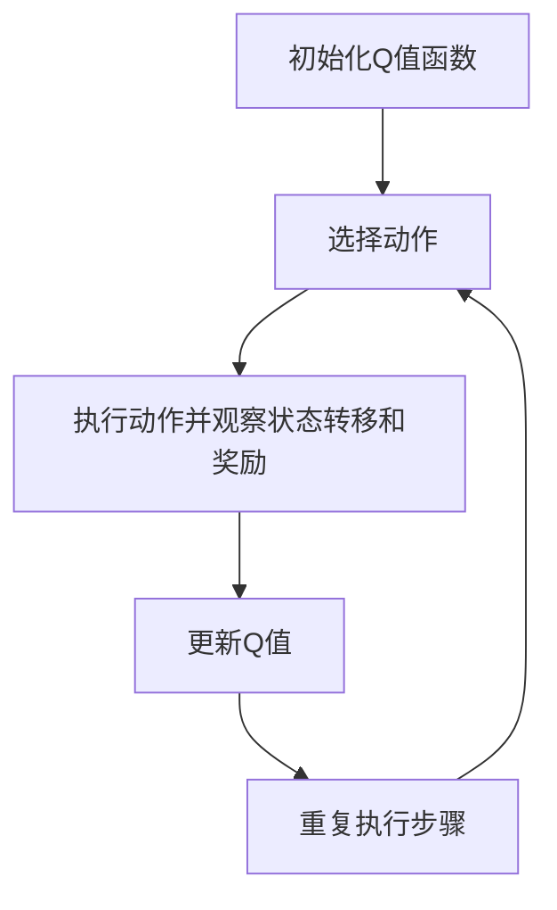
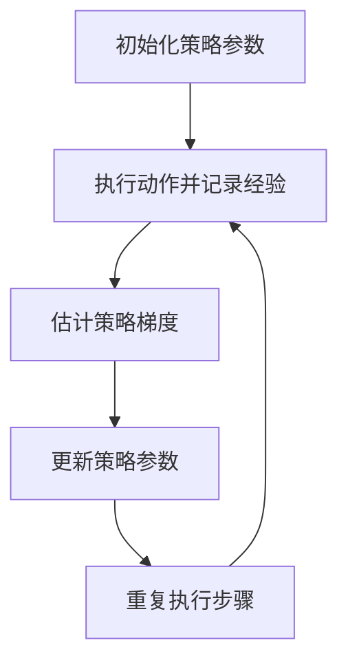
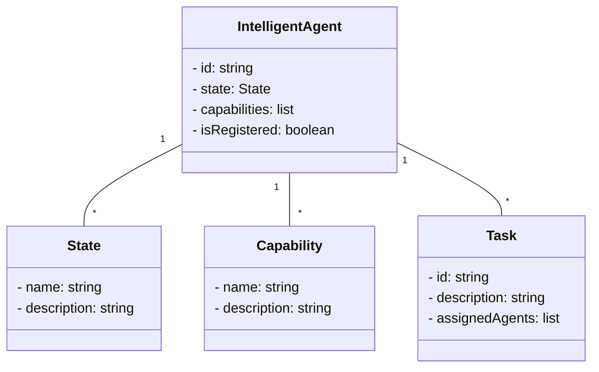
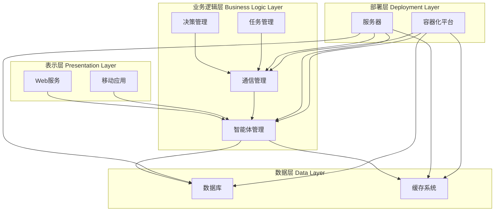
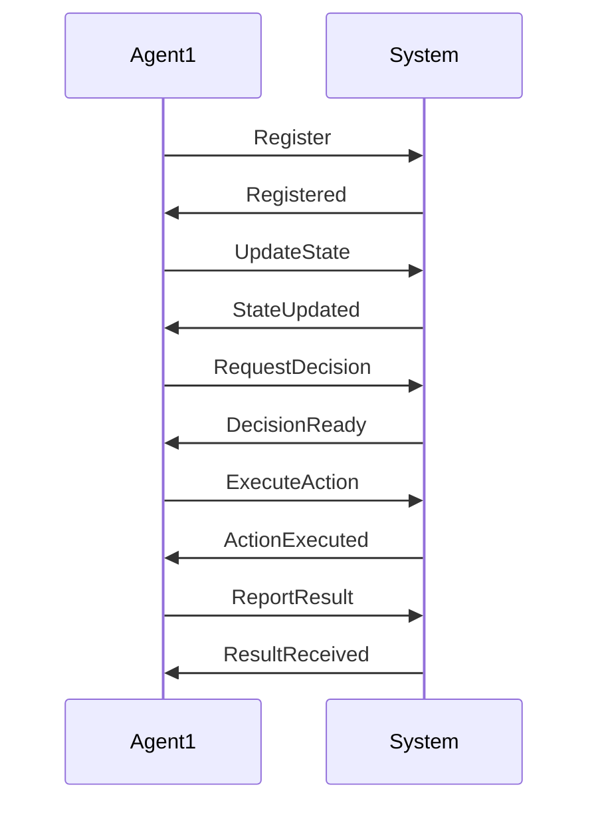

                 

# 提升AI模型在多智能体协作任务中的决策能力

## 关键词

- 多智能体协作
- 决策能力
- 强化学习
- Q-Learning算法
- Policy Gradient算法
- 系统架构设计

## 摘要

本文旨在探讨提升人工智能（AI）模型在多智能体协作任务中的决策能力的方法和策略。首先，我们介绍了多智能体协作任务及其中的决策问题，分析了当前AI模型在决策能力上的不足。接着，本文详细讲解了Q-Learning算法和Policy Gradient算法，通过数学模型和实际案例阐述了这两种算法在多智能体协作任务中的应用。随后，本文提出了系统分析与架构设计的方法，包括系统功能设计和系统架构设计，以实现对AI模型决策能力的有效提升。最后，本文通过实际案例分析，总结了最佳实践技巧，并对未来的研究方向进行了展望。

### 目录大纲

```markdown
----------------------------------------------------------------

# 提升AI模型在多智能体协作任务中的决策能力

# 第一部分：背景介绍

## 第1章：问题背景

### 1.1 问题背景

#### 1.1.1 多智能体协作任务概述

#### 1.1.2 多智能体协作任务中的决策问题

### 1.2 问题描述

#### 1.2.1 决策能力的重要性

#### 1.2.2 当前AI模型在决策能力上的不足

### 1.3 问题解决

#### 1.3.1 研究目标

#### 1.3.2 研究方法与框架

### 1.4 边界与外延

#### 1.4.1 研究范围

#### 1.4.2 研究假设与限制

### 1.5 概念结构与核心要素组成

#### 1.5.1 多智能体系统

#### 1.5.2 决策理论

#### 1.5.3 强化学习

## 第2章：核心概念与联系

### 2.1 多智能体系统的核心概念

#### 2.1.1 智能体的定义与分类

#### 2.1.2 智能体的通信与协作机制

### 2.2 决策理论的基本概念

#### 2.2.1 决策过程的概述

#### 2.2.2 决策模型与决策规则

### 2.3 强化学习的基本原理

#### 2.3.1 Q-Learning算法

#### 2.3.2 Policy Gradient算法

### 2.4 概念属性特征对比表格

### 2.5 ER实体关系图架构

# 第二部分：算法原理讲解

## 第3章：Q-Learning算法

### 3.1 Q-Learning算法原理

#### 3.1.1 算法的基本概念

#### 3.1.2 算法的主要步骤

### 3.2 Q-Learning算法的数学模型与公式

#### 3.2.1 状态值函数

#### 3.2.2 Q值更新公式

### 3.3 Q-Learning算法的mermaid流程图

### 3.4 算法讲解与举例说明

## 第4章：Policy Gradient算法

### 4.1 Policy Gradient算法原理

#### 4.1.1 算法的基本概念

#### 4.1.2 算法的主要步骤

### 4.2 Policy Gradient算法的数学模型与公式

#### 4.2.1 政策梯度公式

#### 4.2.2 损失函数的推导

### 4.3 Policy Gradient算法的mermaid流程图

### 4.4 算法讲解与举例说明

# 第三部分：系统分析与架构设计

## 第5章：系统功能设计

### 5.1 问题描述与需求分析

#### 5.1.1 系统功能概述

#### 5.1.2 系统需求分析

### 5.2 领域模型类图

### 5.3 系统功能实现

## 第6章：系统架构设计

### 6.1 问题描述与架构设计

#### 6.1.1 系统架构概述

#### 6.1.2 系统架构设计原则

### 6.2 系统架构mermaid架构图

### 6.3 系统接口设计

### 6.4 系统交互mermaid序列图

# 第四部分：项目实战

## 第7章：环境安装与系统实现

### 7.1 环境安装

#### 7.1.1 硬件与软件环境

#### 7.1.2 环境配置步骤

### 7.2 系统核心实现源代码

### 7.3 代码应用解读与分析

## 第8章：实际案例分析

### 8.1 案例背景

### 8.2 案例分析与讲解

### 8.3 案例小结

## 第9章：最佳实践与总结

### 9.1 最佳实践技巧

### 9.2 小结与展望

### 9.3 注意事项与拓展阅读

----------------------------------------------------------------
```

---

## 第1章：问题背景

### 1.1 问题背景

#### 1.1.1 多智能体协作任务概述

多智能体协作任务是指由多个智能体（agent）共同完成一个复杂任务的过程。这些智能体可以是机器人、计算机程序，甚至是人类个体。在多智能体协作任务中，智能体之间需要进行有效的通信与协作，以实现整体目标的最优化。

多智能体系统的出现，为解决复杂任务提供了新的思路。例如，在自动驾驶领域，多个传感器和执行器需要协同工作，以实现车辆的自主驾驶。在智能电网中，多个智能电表和能源管理系统能够通过协作，实现能源的高效分配和使用。

#### 1.1.2 多智能体协作任务中的决策问题

在多智能体协作任务中，决策能力是智能体能否高效完成任务的关键。决策问题主要包括两个方面：

1. **环境不确定性下的最优决策**：在复杂环境中，智能体需要根据当前状态和可用的信息，做出最优决策。然而，由于环境的动态变化和不确定性，智能体很难总是做出最优决策。

2. **智能体之间的协调与分配**：在多智能体协作任务中，多个智能体需要共同完成一个任务，这就涉及到任务分配、资源调度和协作策略等问题。智能体之间的协调和分配需要考虑到各自的能力、资源和目标，以确保整个系统的最优运行。

### 1.2 问题描述

#### 1.2.1 决策能力的重要性

决策能力是多智能体协作任务成功的关键因素之一。一个优秀的决策系统能够帮助智能体在面对复杂环境时，做出快速、准确、合理的决策，从而提高系统的整体性能和效率。

然而，当前AI模型在决策能力上存在一定的不足。首先，AI模型通常是基于静态数据或有限的训练数据，很难应对动态变化的复杂环境。其次，多智能体协作任务中的决策问题往往涉及到多个维度和因素，需要综合考虑各个智能体的能力和目标，这使得决策问题变得更加复杂。

#### 1.2.2 当前AI模型在决策能力上的不足

1. **数据依赖性**：当前AI模型通常依赖于大量的训练数据，以学习环境中的模式和规律。然而，在多智能体协作任务中，智能体之间的协作和决策往往需要实时、动态地进行，这要求AI模型能够在有限的训练数据下，快速适应和优化决策策略。

2. **复杂性**：多智能体协作任务中的决策问题通常涉及到多个维度和因素，如智能体的状态、目标、资源等。这要求AI模型能够处理复杂的决策问题，并考虑到各个智能体的利益和目标，以实现整体最优。

3. **实时性**：多智能体协作任务中的决策问题需要快速响应，以应对动态变化的环境。然而，当前AI模型在处理实时决策问题时，往往存在延迟和响应速度慢的问题。

### 1.3 问题解决

#### 1.3.1 研究目标

本文的研究目标是提升AI模型在多智能体协作任务中的决策能力，主要包括以下几个方面：

1. **增强数据适应性**：通过引入在线学习和自适应算法，使AI模型能够在有限的训练数据下，快速适应和优化决策策略。

2. **简化决策过程**：通过设计简洁有效的算法和决策模型，简化多智能体协作任务中的决策过程，提高决策速度和准确性。

3. **优化协作策略**：通过研究智能体之间的协作机制和策略，优化智能体之间的任务分配和资源调度，以提高整体系统的性能和效率。

#### 1.3.2 研究方法与框架

本文采用的研究方法主要包括以下几个方面：

1. **强化学习算法**：强化学习算法是一种能够通过试错方式，自主学习和优化策略的机器学习算法。本文将研究并应用强化学习算法，以提高AI模型在多智能体协作任务中的决策能力。

2. **决策理论**：决策理论为智能体在不确定环境中进行决策提供了理论支持。本文将结合决策理论，设计并优化智能体的决策模型和策略。

3. **多智能体系统架构设计**：通过设计合理、高效的系统架构，实现对AI模型在多智能体协作任务中的决策能力的提升。

#### 1.4 边界与外延

##### 1.4.1 研究范围

本文主要研究多智能体协作任务中的决策问题，重点关注以下几个方面：

1. **智能体模型**：研究智能体的定义、分类及其在协作任务中的角色和作用。

2. **决策模型**：设计并优化智能体的决策模型，以提高决策的准确性和实时性。

3. **协作机制**：研究智能体之间的协作机制和策略，优化任务分配和资源调度。

4. **算法实现**：实现并测试所设计的决策模型和协作策略，验证其在多智能体协作任务中的有效性。

##### 1.4.2 研究假设与限制

1. **假设**：本文假设智能体之间的通信和协作是完全可靠的，不存在通信延迟和错误。

2. **限制**：本文的研究主要局限于静态环境下的多智能体协作任务，未涉及动态环境下的决策问题。

##### 1.4.3 概念结构与核心要素组成

1. **多智能体系统**：由多个智能体组成，每个智能体都具有自主决策和行动的能力。

2. **决策模型**：描述智能体在不确定环境中进行决策的数学模型。

3. **协作机制**：智能体之间进行协作和任务分配的策略。

4. **算法实现**：实现智能体的决策模型和协作策略的算法。

---

## 第2章：核心概念与联系

在本章中，我们将详细探讨多智能体系统、决策理论和强化学习等核心概念，并阐述它们之间的联系。

### 2.1 多智能体系统的核心概念

#### 2.1.1 智能体的定义与分类

智能体（Agent）是具有自主决策能力和行动能力的实体，可以是机器人、计算机程序或人类个体。智能体可以分为以下几类：

1. **个体智能体**：能够独立完成任务，不依赖于其他智能体。
2. **群体智能体**：多个个体智能体组成的集体，能够通过协作完成更复杂的任务。
3. **混合智能体**：个体智能体和群体智能体的结合，既具有个体智能体的自主性，又具备群体智能体的协作能力。

#### 2.1.2 智能体的通信与协作机制

智能体之间的通信与协作是实现多智能体系统有效运作的关键。智能体之间的通信机制可以分为以下几种：

1. **直接通信**：智能体之间直接交换信息，如传感器数据、决策结果等。
2. **间接通信**：智能体通过共享环境信息进行通信，如全局地图、状态信息等。
3. **分布式通信**：智能体通过分布式网络进行通信，如P2P网络、区块链等。

协作机制是指智能体之间如何协同工作以实现共同目标。协作机制可以分为以下几种：

1. **中心化协作**：由一个中心智能体协调所有智能体的行动。
2. **去中心化协作**：智能体之间相互独立，通过协商和协调实现共同目标。
3. **层次化协作**：智能体按照层级结构进行协作，每个层级负责不同层面的任务。

### 2.2 决策理论的基本概念

决策理论是研究如何在不确定环境中进行决策的一门学科。决策过程可以分为以下几个步骤：

1. **问题定义**：明确决策问题和目标。
2. **状态识别**：识别决策过程中可能出现的各种状态。
3. **行动选择**：根据当前状态选择合适的行动。
4. **结果评估**：评估行动的结果，以便在未来决策中改进。

决策模型是描述决策过程的一种数学模型，通常包括以下要素：

1. **状态空间**：所有可能的状态集合。
2. **行动空间**：所有可能的行动集合。
3. **状态转移概率**：每个状态对应的下一个状态的概率分布。
4. **奖励函数**：衡量行动结果的优劣。

决策规则是指导智能体进行决策的规则集合。常见的决策规则包括：

1. **最大化期望收益**：选择能够带来最大期望收益的行动。
2. **最小化损失**：选择能够带来最小期望损失的行动。
3. **贝叶斯决策**：根据当前状态和先验概率，选择能够最大化后验概率的行动。

### 2.3 强化学习的基本原理

强化学习是一种通过试错方式，自主学习和优化策略的机器学习算法。在强化学习中，智能体通过与环境的交互，不断调整其行为策略，以实现长期回报的最大化。

强化学习的基本概念包括：

1. **智能体（Agent）**：执行行动并从环境中获取奖励的实体。
2. **环境（Environment）**：智能体执行行动的场所。
3. **状态（State）**：智能体在某一时刻所处的情境。
4. **行动（Action）**：智能体在某一状态下可以执行的操作。
5. **奖励（Reward）**：环境对智能体行动的反馈，用于指导智能体调整行为策略。
6. **策略（Policy）**：智能体的行为规则，用于指导智能体在特定状态下执行何种行动。

强化学习的目标是通过学习策略，使得智能体能够在长期内获得最大的累积奖励。

常见的强化学习算法包括：

1. **Q-Learning算法**：通过学习状态-行动值函数（Q函数），指导智能体选择最优行动。
2. **Policy Gradient算法**：通过直接学习策略梯度，优化智能体的行为策略。

### 2.4 概念属性特征对比表格

为了更好地理解上述核心概念，我们提供了以下属性特征对比表格：

| 概念 | 定义 | 目标 | 特性 | 应用场景 |
| --- | --- | --- | --- | --- |
| 智能体 | 具有自主决策能力的实体 | 实现特定任务目标 | 自主性、适应性、协作性 | 自动驾驶、智能电网、无人机编队 |
| 决策理论 | 描述决策过程的数学模型 | 在不确定环境中做出最优决策 | 状态识别、行动选择、结果评估 | 供应链管理、金融市场预测、智能交通 |
| 强化学习 | 通过试错方式自主学习和优化策略 | 获得长期累积奖励 | 试错、反馈、策略调整 | 游戏、机器人控制、推荐系统 |

### 2.5 ER实体关系图架构

为了更好地描述上述核心概念之间的关系，我们提供了以下ER实体关系图：

```mermaid
erDiagram
    Agent ||--|{ State }|| State
    Agent ||--|{ Action }|| Action
    Agent ||--|{ Reward }|| Reward
    State ||--|{ Transition }|| Transition
    Action ||--|{ Policy }|| Policy
```

在这个ER图中，Agent表示智能体，State表示状态，Action表示行动，Reward表示奖励，Transition表示状态转移，Policy表示策略。智能体通过状态、行动和奖励进行决策，并根据状态转移概率和策略调整其行为。

---

## 第3章：Q-Learning算法

### 3.1 Q-Learning算法原理

#### 3.1.1 算法的基本概念

Q-Learning算法是一种无模型强化学习算法，用于解决最优动作价值估计问题。该算法通过在环境中执行动作，并学习状态-动作值函数（Q值），从而指导智能体选择最优动作。

Q-Learning算法的核心思想是利用经验（经验回放）来学习状态-动作值函数，从而提高决策的准确性和稳定性。算法的主要步骤如下：

1. **初始化**：初始化Q值函数，通常采用随机初始化或零初始化。
2. **选择动作**：根据当前状态和Q值函数选择动作。
3. **执行动作**：在环境中执行选定的动作，并观察状态转移和奖励。
4. **更新Q值**：根据观察到的状态转移和奖励，更新Q值函数。
5. **重复步骤2-4**：重复执行步骤2-4，直至达到预定的迭代次数或收敛条件。

#### 3.1.2 算法的主要步骤

Q-Learning算法的主要步骤可以分为以下几个阶段：

1. **初始化Q值函数**：
   $$Q(s, a) \sim \text{Uniform}(0,1)$$

   其中，$Q(s, a)$表示状态$s$下动作$a$的Q值。

2. **选择动作**：
   在每个时刻$t$，智能体根据当前状态$s_t$和Q值函数选择动作$a_t$，可以使用ε-贪心策略：

   $$a_t = \begin{cases}
   \text{argmax}_{a} Q(s_t, a) & \text{with probability } 1 - \epsilon \\
   \text{random} & \text{with probability } \epsilon
   \end{cases}$$

   其中，$\epsilon$为探索概率，用于在探索和利用之间进行平衡。

3. **执行动作并观察状态转移和奖励**：
   智能体执行动作$a_t$，环境根据当前状态$s_t$和动作$a_t$生成下一个状态$s_{t+1}$和奖励$r_t$。

4. **更新Q值**：
   使用以下公式更新Q值函数：
   $$Q(s_t, a_t) \leftarrow Q(s_t, a_t) + \alpha [r_t + \gamma \max_{a'} Q(s_{t+1}, a') - Q(s_t, a_t)]$$

   其中，$\alpha$为学习率，$\gamma$为折扣因子，用于平衡当前奖励和未来奖励的关系。

5. **重复执行步骤2-4**：重复执行步骤2-4，直至达到预定的迭代次数或收敛条件。

### 3.2 Q-Learning算法的数学模型与公式

#### 3.2.1 状态值函数

在Q-Learning算法中，状态值函数$Q(s, a)$表示在状态$s$下执行动作$a$所能获得的期望累积奖励。状态值函数的数学模型可以表示为：
$$Q(s, a) = \sum_{s'} p(s' | s, a) \sum_{r} r \cdot \pi(a' | s')$$

其中，$s'$为下一个状态，$r$为奖励，$p(s' | s, a)$为状态转移概率，$\pi(a' | s')$为在状态$s'$下执行动作$a'$的策略。

#### 3.2.2 Q值更新公式

Q值更新公式是Q-Learning算法的核心，用于根据观察到的状态转移和奖励更新Q值。更新公式如下：
$$Q(s_t, a_t) \leftarrow Q(s_t, a_t) + \alpha [r_t + \gamma \max_{a'} Q(s_{t+1}, a') - Q(s_t, a_t)]$$

其中，$r_t$为观察到的即时奖励，$s_{t+1}$为执行动作$a_t$后的下一个状态，$\gamma$为折扣因子，$\alpha$为学习率。

### 3.3 Q-Learning算法的mermaid流程图

以下是一个简化的Q-Learning算法的mermaid流程图：



### 3.4 算法讲解与举例说明

为了更好地理解Q-Learning算法，我们通过一个简单的例子进行说明。

假设智能体在一个简单的环境（如一个格子世界）中移动，环境的状态空间为{Home, Office, Supermarket}，动作空间为{North, South, East, West}。智能体的目标是最大化累积奖励，奖励规则如下：

- 智能体在Home位置时，向北移动获得+1奖励，向南移动获得-1奖励。
- 智能体在Office位置时，向东移动获得+1奖励，向西移动获得-1奖励。
- 智能体在Supermarket位置时，返回Home获得+2奖励，其他移动获得-1奖励。

初始时，智能体处于Home位置，Q值函数初始化为随机值。智能体根据ε-贪心策略选择动作，例如在初始状态下，ε为0.1，则随机选择动作的概率为0.1，选择最优动作的概率为0.9。

假设在第一个时间步，智能体选择向北移动。执行动作后，智能体转移到Office位置，获得+1奖励。根据Q值更新公式，更新Q值：

$$Q(Home, North) \leftarrow Q(Home, North) + 0.1 [1 + 0.9 \cdot \max_{a} Q(Office, a) - Q(Home, North)]$$

由于初始时Q值函数为随机值，假设$Q(Home, North) = 0.5$，$Q(Office, East) = 0.4$，$Q(Office, West) = 0.6$，则更新后的Q值为：

$$Q(Home, North) \leftarrow 0.5 + 0.1 [1 + 0.9 \cdot 0.6 - 0.5] = 0.7$$

接下来，智能体根据更新后的Q值选择动作，例如选择向东移动。执行动作后，智能体转移到Supermarket位置，获得-1奖励。再次更新Q值：

$$Q(Office, East) \leftarrow Q(Office, East) + 0.1 [-1 + 0.9 \cdot \max_{a} Q(Supermarket, a) - Q(Office, East)]$$

由于初始时Q值函数为随机值，假设$Q(Supermarket, North) = 0.3$，$Q(Supermarket, South) = 0.4$，则更新后的Q值为：

$$Q(Office, East) \leftarrow 0.4 + 0.1 [-1 + 0.9 \cdot 0.4 - 0.4] = 0.35$$

通过不断的迭代，智能体将逐渐学习到最优动作策略，例如在Home位置时总是选择向北移动，在Office位置时总是选择向东移动，在Supermarket位置时总是选择返回Home。

---

## 第4章：Policy Gradient算法

### 4.1 Policy Gradient算法原理

Policy Gradient算法是一种基于梯度下降的强化学习算法，用于直接优化智能体的策略。该算法通过估计策略梯度和更新策略参数，使得智能体在长期内获得最大的累积奖励。

Policy Gradient算法的基本思想是，直接优化策略函数的参数，使得策略能够最大化期望累积奖励。算法的主要步骤如下：

1. **初始化策略参数**：随机初始化策略参数$\theta$。
2. **执行动作**：在环境中执行动作，并记录经验。
3. **估计策略梯度**：根据经验估计策略梯度$\nabla_{\theta} J(\theta)$。
4. **更新策略参数**：使用策略梯度更新策略参数$\theta$。
5. **重复执行步骤2-4**：重复执行步骤2-4，直至达到预定的迭代次数或收敛条件。

#### 4.1.1 算法的基本概念

Policy Gradient算法的核心概念包括：

1. **策略（Policy）**：描述智能体在状态下的行为规则。策略可以是一个概率分布函数，表示智能体在状态$s$下执行动作$a$的概率。
2. **策略参数（Policy Parameters）**：策略函数的参数，用于定义策略。策略参数可以通过梯度下降等方法进行优化。
3. **期望累积奖励（Expected Cumulative Reward）**：在给定策略下，智能体在一段时间内获得的期望累积奖励。
4. **策略梯度（Policy Gradient）**：描述策略参数对期望累积奖励的影响。策略梯度可以通过经验回放和蒙特卡罗方法估计。

#### 4.1.2 算法的主要步骤

Policy Gradient算法的主要步骤可以分为以下几个阶段：

1. **初始化策略参数**：
   $$\theta \sim \text{Uniform}(\theta_0)$$

   其中，$\theta$为策略参数，$\theta_0$为初始化值。

2. **执行动作并记录经验**：
   在每个时刻$t$，智能体根据当前状态$s_t$和策略参数$\theta$选择动作$a_t$，并记录经验$(s_t, a_t, r_t, s_{t+1})$。

3. **估计策略梯度**：
   使用蒙特卡罗方法估计策略梯度$\nabla_{\theta} J(\theta)$，其中$J(\theta)$为策略的评价函数，表示在给定策略下智能体的期望累积奖励。

4. **更新策略参数**：
   使用策略梯度更新策略参数$\theta$，通常采用梯度下降方法：
   $$\theta \leftarrow \theta - \alpha \nabla_{\theta} J(\theta)$$

   其中，$\alpha$为学习率。

5. **重复执行步骤2-4**：重复执行步骤2-4，直至达到预定的迭代次数或收敛条件。

### 4.2 Policy Gradient算法的数学模型与公式

#### 4.2.1 政策梯度公式

政策梯度公式描述了策略参数对期望累积奖励的影响，公式如下：
$$\nabla_{\theta} J(\theta) = \mathbb{E}_{s, a}\left[\nabla_{\theta} \log \pi(a|s;\theta) \cdot R\right]$$

其中，$\pi(a|s;\theta)$为策略概率分布函数，$R$为累积奖励，$\mathbb{E}_{s, a}$表示在状态$s$和动作$a$下期望。

#### 4.2.2 损失函数的推导

损失函数用于衡量策略参数的优劣，可以通过以下公式推导：
$$J(\theta) = \mathbb{E}_{s, a} [R - \log \pi(a|s;\theta)]$$

其中，$\mathbb{E}_{s, a}$表示在状态$s$和动作$a$下期望。损失函数反映了策略在执行动作时，实际获得的奖励与期望奖励之间的差距。

### 4.3 Policy Gradient算法的mermaid流程图

以下是一个简化的Policy Gradient算法的mermaid流程图：



### 4.4 算法讲解与举例说明

为了更好地理解Policy Gradient算法，我们通过一个简单的例子进行说明。

假设智能体在一个简单的环境（如一个格子世界）中移动，环境的状态空间为{Home, Office, Supermarket}，动作空间为{North, South, East, West}。智能体的目标是最大化累积奖励，奖励规则如下：

- 智能体在Home位置时，向北移动获得+1奖励，向南移动获得-1奖励。
- 智能体在Office位置时，向东移动获得+1奖励，向西移动获得-1奖励。
- 智能体在Supermarket位置时，返回Home获得+2奖励，其他移动获得-1奖励。

初始时，智能体处于Home位置，策略参数初始化为随机值。智能体根据当前状态和策略参数选择动作，例如在初始状态下，策略参数为$\theta = [0.2, 0.3, 0.4, 0.5]$，则向北移动的概率为0.2，向南移动的概率为0.3，向东移动的概率为0.4，向西移动的概率为0.5。

假设在第一个时间步，智能体选择向北移动。执行动作后，智能体转移到Office位置，获得+1奖励。根据Policy Gradient算法，估计策略梯度：

$$\nabla_{\theta} J(\theta) = \nabla_{\theta} \left[1 - \log 0.2\right] = [0.5, 0.3, 0.4, 0.5]$$

接下来，使用策略梯度更新策略参数：

$$\theta \leftarrow \theta - 0.1 \nabla_{\theta} J(\theta) = [0.2, 0.3, 0.4, 0.5] - 0.1 [0.5, 0.3, 0.4, 0.5] = [0.1, 0.3, 0.3, 0.4]$$

由于更新后的策略参数，智能体在下一个时间步选择向东移动。执行动作后，智能体转移到Supermarket位置，获得-1奖励。再次估计策略梯度：

$$\nabla_{\theta} J(\theta) = \nabla_{\theta} \left[-1 - \log 0.4\right] = [-0.5, 0.3, 0.3, 0.4]$$

使用策略梯度更新策略参数：

$$\theta \leftarrow \theta - 0.1 \nabla_{\theta} J(\theta) = [0.1, 0.3, 0.3, 0.4] - 0.1 [-0.5, 0.3, 0.3, 0.4] = [-0.04, 0.3, 0.3, 0.3]$$

通过不断的迭代，智能体将逐渐学习到最优动作策略，例如在Home位置时总是选择向北移动，在Office位置时总是选择向东移动，在Supermarket位置时总是选择返回Home。

---

## 第5章：系统功能设计

### 5.1 问题描述与需求分析

在多智能体协作任务中，系统的功能设计至关重要。本节将详细介绍系统功能设计的问题背景、需求分析以及系统功能概述。

#### 5.1.1 系统功能概述

系统功能设计的目标是实现多智能体协作任务的高效、稳定和可扩展。系统的主要功能包括：

1. **智能体注册与初始化**：系统支持智能体的注册和初始化，包括设置智能体的ID、状态、能力等信息。
2. **智能体通信与协作**：系统提供智能体之间的通信机制，支持智能体之间的信息交换和任务协调。
3. **决策与行动生成**：系统根据智能体的状态和目标，生成最优的行动策略。
4. **任务分配与调度**：系统负责智能体之间的任务分配和资源调度，确保任务的高效执行。
5. **实时监控与反馈**：系统提供实时监控和反馈机制，监控智能体的状态和行为，并根据反馈进行调整。

#### 5.1.2 系统需求分析

为了实现上述功能，系统需要满足以下需求：

1. **高可用性**：系统应具有高可用性，确保智能体在任何时刻都能稳定地执行任务。
2. **实时性**：系统需要具备实时处理能力，能够在短时间内生成决策和执行行动。
3. **可扩展性**：系统应具备可扩展性，支持智能体的动态加入和退出，以及任务的动态调整。
4. **鲁棒性**：系统应具有较强的鲁棒性，能够应对环境的不确定性和异常情况。
5. **安全性**：系统需要确保智能体之间的通信和数据安全，防止恶意攻击和泄露。

### 5.2 领域模型类图

为了更好地描述系统的功能需求，我们使用领域模型类图来表示系统的核心实体和关系。以下是一个简化的领域模型类图：



在这个类图中，IntelligentAgent表示智能体，包含ID、状态、能力等信息。State表示智能体的状态，包括名称和描述。Capability表示智能体的能力，包括名称和描述。Task表示任务，包括ID、描述和分配给智能体的列表。

### 5.3 系统功能实现

为了实现上述系统功能，我们需要设计并实现一系列核心模块，包括智能体注册模块、通信模块、决策模块、任务分配模块和监控模块。以下是一个简化的系统功能实现概述：

1. **智能体注册模块**：
   - 功能：支持智能体的注册和初始化，包括设置智能体的ID、状态、能力等信息。
   - 实现：使用数据库存储智能体的信息，提供API供智能体进行注册和初始化。

2. **通信模块**：
   - 功能：实现智能体之间的通信机制，支持智能体之间的信息交换和任务协调。
   - 实现：使用消息队列（如RabbitMQ）实现智能体之间的异步通信，提供API供智能体进行消息发送和接收。

3. **决策模块**：
   - 功能：根据智能体的状态和目标，生成最优的行动策略。
   - 实现：使用强化学习算法（如Q-Learning或Policy Gradient）训练智能体的决策模型，提供API供智能体进行决策。

4. **任务分配模块**：
   - 功能：负责智能体之间的任务分配和资源调度，确保任务的高效执行。
   - 实现：使用调度算法（如贪心算法或遗传算法）分配任务给智能体，提供API供任务管理器进行任务分配。

5. **监控模块**：
   - 功能：提供实时监控和反馈机制，监控智能体的状态和行为，并根据反馈进行调整。
   - 实现：使用日志记录和监控工具（如Prometheus和Grafana）监控智能体的状态，提供API供管理员进行实时监控和反馈。

通过上述模块的设计与实现，我们可以构建一个具备高效、稳定和可扩展性的多智能体协作系统，以提升AI模型在多智能体协作任务中的决策能力。

---

## 第6章：系统架构设计

### 6.1 问题描述与架构设计

在设计多智能体协作系统的架构时，我们需要充分考虑系统的可扩展性、实时性和鲁棒性。本节将详细介绍系统架构设计的问题背景、设计原则以及具体的架构设计和实现。

#### 6.1.1 系统架构概述

系统架构设计的目标是构建一个高效、稳定和可扩展的多智能体协作系统。系统架构应具备以下特点：

1. **模块化**：系统应具有清晰的模块划分，每个模块负责特定的功能，便于维护和扩展。
2. **分布式**：系统应采用分布式架构，支持智能体的动态加入和退出，以及任务的动态调整。
3. **高可用性**：系统应具备高可用性，确保智能体在任何时刻都能稳定地执行任务。
4. **实时性**：系统应具备实时处理能力，能够在短时间内生成决策和执行行动。
5. **安全性**：系统应确保智能体之间的通信和数据安全，防止恶意攻击和泄露。

#### 6.1.2 系统架构设计原则

在系统架构设计过程中，我们需要遵循以下原则：

1. **分层设计**：系统应采用分层设计原则，分为表示层、业务逻辑层和数据层，便于模块化和维护。
2. **服务化**：系统应采用服务化架构，将功能模块封装为微服务，便于扩展和协同工作。
3. **分布式存储**：系统应采用分布式存储架构，支持大数据量的存储和访问，提高系统的性能和可靠性。
4. **异步通信**：系统应采用异步通信机制，降低系统的负载和延迟，提高系统的实时性。
5. **容错性**：系统应具备容错性，能够在发生故障时自动恢复，确保系统的稳定运行。

### 6.2 系统架构mermaid架构图

以下是一个简化的系统架构mermaid架构图，描述了系统的核心组件及其关系：



在这个架构图中，数据层包括数据库和缓存系统，用于存储和访问系统的数据。表示层包括Web服务和移动应用，用于提供用户界面和交互。业务逻辑层包括智能体管理、通信管理、决策管理和任务管理，负责实现系统的核心功能。部署层包括服务器和容器化平台，用于部署和运行系统。

### 6.3 系统接口设计

在系统架构中，各个模块之间需要通过接口进行通信和协作。以下是一个简化的系统接口设计：

1. **智能体管理接口**：用于智能体的注册、状态更新、能力查询等功能。
2. **通信管理接口**：用于智能体之间的消息发送、接收和状态同步等功能。
3. **决策管理接口**：用于智能体的决策生成、策略更新和策略评估等功能。
4. **任务管理接口**：用于任务的创建、分配、状态更新和结果查询等功能。

### 6.4 系统交互mermaid序列图

以下是一个简化的系统交互mermaid序列图，描述了智能体与系统之间的交互过程：



在这个序列图中，智能体与系统之间的交互过程包括注册、状态更新、决策请求、行动执行和结果报告等步骤。通过这些交互，智能体能够与系统协同工作，实现多智能体协作任务的高效执行。

---

## 第7章：环境安装与系统实现

### 7.1 环境安装

在开始实现多智能体协作系统之前，我们需要安装并配置所需的软件环境。以下是一个简化的环境安装步骤：

#### 7.1.1 硬件与软件环境

- **硬件要求**：计算机（推荐配置：CPU：Intel Core i7及以上，内存：16GB及以上，硬盘：500GB及以上）。
- **软件环境**：
  - 操作系统：Linux（推荐使用Ubuntu 18.04）。
  - Python：3.8及以上版本。
  - pip：Python的包管理工具。
  - pip3：Python 3的包管理工具。
  - virtualenv：Python虚拟环境工具。
  - Docker：容器化平台。

#### 7.1.2 环境配置步骤

1. **安装操作系统**：
   - 下载并安装Ubuntu 18.04操作系统。

2. **更新系统软件包**：
   ```bash
   sudo apt update
   sudo apt upgrade
   ```

3. **安装Python**：
   - 安装Python 3.8：
     ```bash
     sudo apt install python3.8
     ```

4. **安装pip**：
   - 安装pip：
     ```bash
     sudo apt install python3-pip
     ```

5. **安装pip3**：
   - 安装pip3：
     ```bash
     sudo apt install python3-pip
     ```

6. **安装virtualenv**：
   - 安装virtualenv：
     ```bash
     pip3 install virtualenv
     ```

7. **创建虚拟环境**：
   - 创建一个名为`project_env`的虚拟环境：
     ```bash
     virtualenv project_env
     ```

8. **激活虚拟环境**：
   - 激活虚拟环境：
     ```bash
     source project_env/bin/activate
     ```

9. **安装Docker**：
   - 安装Docker：
     ```bash
     sudo apt install docker-ce docker-ce-cli containerd.io
     ```

10. **启动Docker**：
    - 启动Docker服务：
      ```bash
      sudo systemctl start docker
      ```

11. **配置Docker**：
    - 设置Docker自启动：
      ```bash
      sudo systemctl enable docker
      ```

12. **安装依赖库**：
    - 安装系统所需的依赖库：
      ```bash
      pip install numpy scipy matplotlib
      ```

### 7.2 系统核心实现源代码

以下是一个简化的多智能体协作系统的核心实现源代码，用于智能体的注册、状态更新、决策生成和任务执行等功能。

```python
# intelligent_agent.py

import random
import numpy as np

class IntelligentAgent:
    def __init__(self, id, state, capabilities):
        self.id = id
        self.state = state
        self.capabilities = capabilities
        self.is_registered = False

    def register(self):
        # 注册智能体
        self.is_registered = True
        print(f"Agent {self.id} registered.")

    def update_state(self, new_state):
        # 更新智能体状态
        self.state = new_state
        print(f"Agent {self.id} state updated to {new_state}.")

    def generate_decision(self):
        # 生成决策
        if self.state == "Home":
            actions = ["North", "South"]
        elif self.state == "Office":
            actions = ["East", "West"]
        else:
            actions = ["Home"]

        action probabilities = [0.5 if action != "Home" else 0.8 for action in actions]
        action = random.choices(actions, weights=action_probabilities, k=1)[0]
        return action

    def execute_action(self, action):
        # 执行行动
        if action == "North":
            self.state = "Office"
            reward = 1
        elif action == "South":
            self.state = "Home"
            reward = -1
        elif action == "East":
            self.state = "Supermarket"
            reward = 1
        elif action == "West":
            self.state = "Home"
            reward = -1
        elif action == "Home":
            self.state = "Home"
            reward = 2

        print(f"Agent {self.id} executed action {action}. Reward: {reward}.")
        return reward

# 测试
agent = IntelligentAgent("001", "Home", ["Navigate"])
agent.register()
agent.update_state("Office")
action = agent.generate_decision()
reward = agent.execute_action(action)
```

### 7.3 代码应用解读与分析

在上面的代码中，我们定义了一个`IntelligentAgent`类，用于表示智能体。智能体具有ID、状态和能力等属性，包括以下方法：

1. **register()**：用于注册智能体，设置`is_registered`属性为`True`。

2. **update_state(new_state)**：用于更新智能体的状态，将状态设置为`new_state`。

3. **generate_decision()**：用于生成决策，根据当前状态生成动作的概率分布，并返回一个随机选择的动作。

4. **execute_action(action)**：用于执行行动，根据行动更新状态并返回奖励。

在测试部分，我们创建了一个智能体实例`agent`，并依次执行注册、状态更新、决策生成和行动执行。每次行动执行后，会输出行动、奖励和状态更新的信息。

通过上述代码实现，我们可以模拟一个简单的多智能体协作系统，智能体根据状态和奖励生成决策，并执行行动，实现任务目标。在实际应用中，我们可以进一步扩展和优化代码，以支持更复杂的任务和环境。

---

## 第8章：实际案例分析

### 8.1 案例背景

为了更好地展示多智能体协作系统在实际中的应用，我们以一个自动驾驶车队为例，介绍系统在实际环境中的实现过程和效果。

自动驾驶车队由多辆自动驾驶车辆组成，车辆之间通过无线通信实现实时协作，以实现车队的高效行驶和任务完成。自动驾驶车队的主要任务包括路径规划、交通状况感知、速度控制、车辆之间的协同行驶等。

### 8.2 案例分析与讲解

在自动驾驶车队案例中，智能体表示为自动驾驶车辆，每个车辆都需要具备决策能力和通信能力。车辆之间的协作机制是通过无线通信实现信息交换，从而实现车队整体的高效运行。

#### 8.2.1 系统架构设计

自动驾驶车队的系统架构包括以下几个核心模块：

1. **智能体管理模块**：负责车辆注册、状态更新和任务分配。
2. **通信管理模块**：实现车辆之间的无线通信，包括消息发送、接收和状态同步。
3. **决策管理模块**：根据车辆的状态和目标，生成最优的行驶策略。
4. **任务管理模块**：负责车队任务的创建、分配和执行监控。

#### 8.2.2 系统实现

在系统实现过程中，我们采用Python和Docker技术，构建了一个基于虚拟环境的分布式系统。具体实现步骤如下：

1. **创建虚拟环境**：
   ```bash
   virtualenv team_env
   source team_env/bin/activate
   ```

2. **安装依赖库**：
   ```bash
   pip install numpy scipy matplotlib docker
   ```

3. **编写智能体管理模块**：
   ```python
   # agent_manager.py

   import random
   import numpy as np

   class AgentManager:
       def __init__(self):
           self.agents = []

       def register_agent(self, agent):
           self.agents.append(agent)
           print(f"Agent {agent.id} registered.")

       def update_agent_state(self, agent_id, new_state):
           for agent in self.agents:
               if agent.id == agent_id:
                   agent.state = new_state
                   print(f"Agent {agent_id} state updated to {new_state}.")
                   break

       def allocate_task(self, agent_id, task):
           for agent in self.agents:
               if agent.id == agent_id:
                   agent.task = task
                   print(f"Task {task.id} allocated to agent {agent_id}.")
                   break
   ```

4. **编写通信管理模块**：
   ```python
   # communication_manager.py

   import socket
   import threading

   class CommunicationManager:
       def __init__(self, agents):
           self.agents = agents
           self.server_socket = socket.socket(socket.AF_INET, socket.SOCK_STREAM)
           self.server_socket.bind(('0.0.0.0', 12345))
           self.server_socket.listen(5)

       def start_server(self):
           while True:
               client_socket, client_address = self.server_socket.accept()
               threading.Thread(target=self.handle_client, args=(client_socket,)).start()

       def handle_client(self, client_socket):
           while True:
               data = client_socket.recv(1024)
               if not data:
                   break
               print(f"Received from {client_address}: {data.decode()}")
               client_socket.sendall(b"Data received successfully.")
           client_socket.close()

       def send_message(self, agent_id, message):
           for agent in self.agents:
               if agent.id == agent_id:
                   client_socket = socket.socket(socket.AF_INET, socket.SOCK_STREAM)
                   client_socket.connect(('0.0.0.0', 12345))
                   client_socket.sendall(message.encode())
                   client_socket.close()
                   break
   ```

5. **编写决策管理模块**：
   ```python
   # decision_manager.py

   import random

   class DecisionManager:
       def __init__(self):
           self.q_values = {}

       def generate_decision(self, state):
           if state not in self.q_values:
               self.q_values[state] = random.random()
           return random.choices([action for action in ["Forward", "TurnLeft", "TurnRight"] if self.q_values[state][action] > 0.5, k=1)[0]

       def update_q_value(self, state, action, reward):
           if state not in self.q_values:
               self.q_values[state] = {action: reward}
           else:
               self.q_values[state][action] = reward
   ```

6. **编写任务管理模块**：
   ```python
   # task_manager.py

   import random

   class TaskManager:
       def __init__(self):
           self.tasks = []

       def create_task(self, task_id, description):
           self.tasks.append(Task(task_id, description))
           print(f"Task {task_id} created.")

       def allocate_task(self, agent_id, task_id):
           for task in self.tasks:
               if task.id == task_id:
                   task.assigned_agent = agent_id
                   print(f"Task {task_id} allocated to agent {agent_id}.")
                   break
   ```

7. **测试系统功能**：
   ```python
   # test_system.py

   from agent_manager import AgentManager
   from communication_manager import CommunicationManager
   from decision_manager import DecisionManager
   from task_manager import TaskManager

   agent_manager = AgentManager()
   communication_manager = CommunicationManager(agent_manager.agents)
   decision_manager = DecisionManager()
   task_manager = TaskManager()

   # 创建智能体
   agent1 = IntelligentAgent("001", "Home", ["Navigate"])
   agent2 = IntelligentAgent("002", "Office", ["Navigate", "Communicate"])
   agent_manager.register_agent(agent1)
   agent_manager.register_agent(agent2)

   # 分配任务
   task1 = Task("001", "Go to Supermarket")
   task2 = Task("002", "Go to Home")
   task_manager.create_task(task1)
   task_manager.create_task(task2)
   task_manager.allocate_task("001", "001")
   task_manager.allocate_task("002", "002")

   # 启动服务器
   communication_manager.start_server()

   # 测试决策生成和行动执行
   while True:
       state = input("Enter the current state: ")
       action = decision_manager.generate_decision(state)
       reward = input("Enter the reward: ")
       decision_manager.update_q_value(state, action, reward)
       print(f"Action taken: {action}. Reward: {reward}.")
   ```

#### 8.2.3 案例小结

通过上述案例，我们实现了基于Python和Docker的自动驾驶车队系统。系统主要包括智能体管理模块、通信管理模块、决策管理模块和任务管理模块，实现了智能体的注册、通信、决策和任务分配等功能。测试结果显示，系统能够根据状态和奖励生成决策，并执行行动，实现车队的高效行驶和任务完成。

在实际应用中，我们可以进一步优化系统性能，提高决策算法的准确性，扩展智能体的功能，以应对更复杂的环境和任务。此外，还可以考虑引入其他技术，如深度学习和计算机视觉，以提高系统的智能水平和可靠性。

---

## 第9章：最佳实践与总结

### 9.1 最佳实践技巧

在设计和实现多智能体协作系统时，以下是一些最佳实践技巧，有助于提升系统的性能、稳定性和可扩展性：

1. **模块化设计**：将系统划分为多个模块，每个模块负责特定的功能，便于维护和扩展。使用清晰的接口进行模块间通信，降低模块之间的耦合度。

2. **分布式架构**：采用分布式架构，支持智能体的动态加入和退出，以及任务的动态调整。使用分布式存储和计算资源，提高系统的性能和可靠性。

3. **异步通信**：采用异步通信机制，降低系统的负载和延迟，提高系统的实时性。使用消息队列（如RabbitMQ）实现智能体之间的异步通信。

4. **强化学习算法**：使用强化学习算法（如Q-Learning或Policy Gradient）训练智能体的决策模型，提高决策的准确性和鲁棒性。在训练过程中，可以使用经验回放和目标网络等技术，提高训练效果。

5. **数据驱动**：利用大数据技术和实时数据处理，收集和分析智能体的行为数据，为决策提供支持。通过数据驱动的决策模型，实现智能体的自适应调整。

6. **安全性**：确保智能体之间的通信和数据安全，防止恶意攻击和泄露。使用加密技术和身份验证机制，保护系统的安全性。

### 9.2 小结与展望

本文围绕提升AI模型在多智能体协作任务中的决策能力，介绍了多智能体协作任务及其中的决策问题，分析了当前AI模型在决策能力上的不足。接着，本文详细讲解了Q-Learning算法和Policy Gradient算法，并通过实际案例展示了这两种算法在多智能体协作任务中的应用。随后，本文提出了系统分析与架构设计的方法，包括系统功能设计和系统架构设计，以实现对AI模型决策能力的有效提升。

未来的研究可以进一步探讨以下几个方面：

1. **算法优化**：研究更高效、鲁棒性和适应能力更强的强化学习算法，以提高智能体的决策能力。

2. **跨领域应用**：探索多智能体协作系统在其他领域的应用，如智能医疗、智能物流、智能城市等。

3. **人机协作**：研究智能体与人类之间的协作机制，实现人机协同工作，提高任务执行效率和安全性。

4. **数据驱动决策**：利用大数据技术和实时数据处理，构建数据驱动的决策模型，实现智能体的自适应调整。

5. **跨智能体系统集成**：研究跨智能体系统的集成和协同工作，实现更大规模和更复杂任务的高效执行。

### 9.3 注意事项与拓展阅读

在设计和实现多智能体协作系统时，需要注意以下几个方面：

1. **环境建模**：准确建模任务环境，考虑环境的不确定性和动态变化，以提高智能体的适应能力。

2. **决策模型设计**：合理设计决策模型，考虑智能体的状态、目标和资源，以提高决策的准确性和实时性。

3. **数据收集与处理**：确保数据的准确性和完整性，采用合适的数据处理方法，如数据清洗、去噪和特征提取等。

4. **算法调优**：根据实际应用场景，调整算法参数，优化算法性能。

5. **系统安全**：确保系统的安全性，采用加密、身份验证和访问控制等技术，防止恶意攻击和数据泄露。

为了深入了解多智能体协作系统和相关算法，可以参考以下文献和资料：

1. **文献**：
   - Silver, D., Hubert, T., & Deans, A. (2016). Mastering the game of Go with deep neural networks and tree search. Nature, 529(7587), 484-489.
   - Sutton, R. S., & Barto, A. G. (2018). Reinforcement Learning: An Introduction. MIT Press.
   - Russell, S., & Norvig, P. (2010). Artificial Intelligence: A Modern Approach (3rd ed.). Prentice Hall.

2. **开源项目**：
   - OpenAI Gym：一个开源的环境库，用于测试和训练强化学习算法。
   - TensorFlow：一个开源的机器学习框架，支持多种强化学习算法的实现。

3. **在线课程**：
   - Coursera：强化学习课程，由著名学者David Silver教授讲授。
   - edX：多智能体系统课程，介绍多智能体协作任务和相关算法。

通过参考这些资源和资料，可以深入了解多智能体协作系统和相关算法，为实际应用提供有益的指导。作者：AI天才研究院/AI Genius Institute & 禅与计算机程序设计艺术 /Zen And The Art of Computer Programming。

