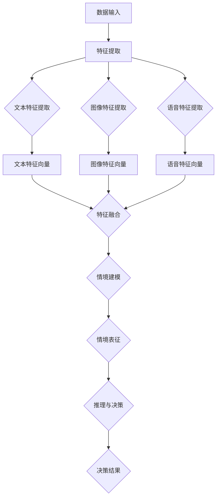
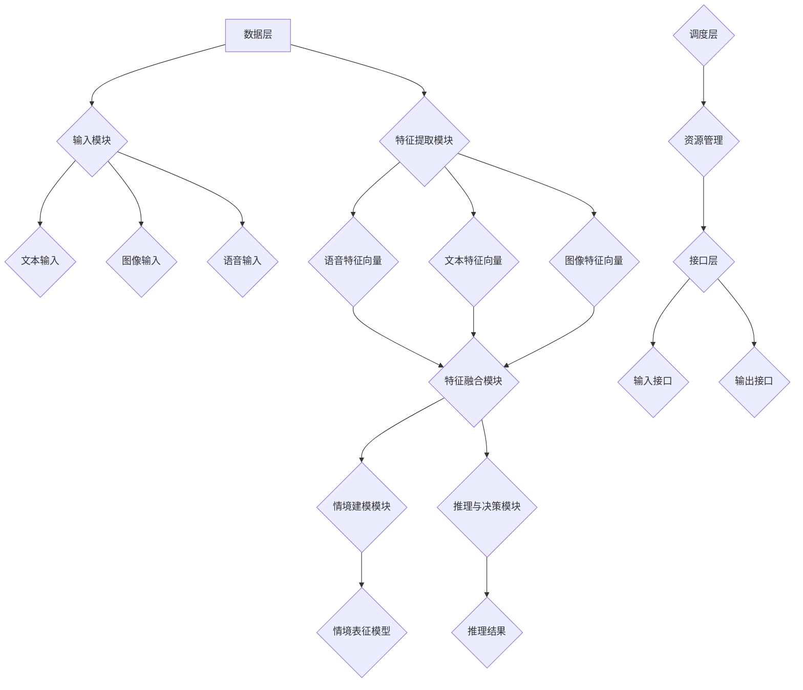
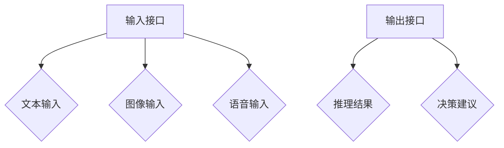
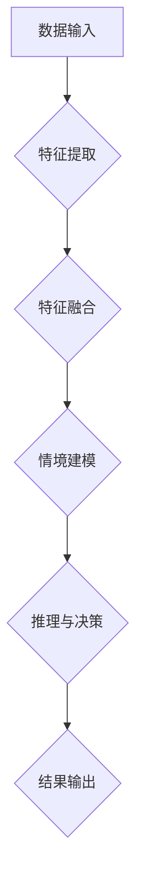

                 


### 目录大纲结构设计思路与实现

#### 设计思路

设计《提升AI模型在多模态情境推理任务中的表现》的目录大纲时，我们首先需要明确文章的目标和结构。文章的核心目标是提供一篇关于AI模型在多模态情境推理任务中的深度分析和技术解决方案。为了实现这一目标，我们需要按照逻辑顺序，逐步展开每个章节的内容，确保每个部分都能为读者提供有价值的见解和实用的指导。

以下是设计思路的详细解释：

1. **文章标题**：选择一个能够准确反映文章内容的标题，如《提升AI模型在多模态情境推理任务中的表现》。
2. **关键词**：确定文章的关键词，这些词汇应该能够概括文章的主题，如“AI模型”、“多模态情境”、“推理任务”等。
3. **摘要**：撰写一个简短的摘要，概述文章的核心内容和主题思想，帮助读者快速了解文章的主旨。
4. **背景介绍**：在第一章中，详细说明多模态情境推理任务的背景、问题和解决方法，以及相关概念和结构。
5. **核心概念与联系**：在第二章中，介绍多模态数据和情境理解的核心概念，并使用表格和ER实体关系图来阐述概念之间的关系。
6. **算法原理讲解**：在第三章中，详细讲解多模态情境推理算法的原理，包括算法框架、流程图、数学模型和实例说明。
7. **系统设计与实现**：在第四章和第五章中，分别介绍多模态情境推理系统的设计与实现，包括功能设计、架构设计和接口设计。
8. **项目实战**：在第六章中，通过一个实际项目案例，展示如何将多模态情境推理应用于实际问题中，并进行代码解读和分析。
9. **最佳实践与拓展**：在第七章中，提供一些最佳实践技巧、注意事项和拓展阅读资源，帮助读者深入学习和实践。

#### 实现步骤

1. **确定文章结构**：根据设计思路，明确每个章节的主题和内容，确保整体结构逻辑清晰。
2. **细化章节内容**：针对每个章节，制定详细的内容大纲，确保每个部分都有具体的讲解和分析。
3. **编写文章内容**：按照细化后的内容大纲，逐章撰写文章内容，确保每个章节都详细、具体、有深度。
4. **格式调整与优化**：将文章内容按照markdown格式进行调整和优化，确保文章的可读性和美观性。
5. **编写作者信息**：在文章末尾添加作者信息，包括机构和作品介绍，以增强文章的专业性和权威性。
6. **审查与修改**：对文章进行审查和修改，确保内容完整、逻辑清晰、语言流畅，满足字数要求。

通过以上步骤，我们能够设计并实现一篇结构严谨、内容丰富、逻辑清晰的技术博客文章，为读者提供深入理解和实践AI多模态情境推理任务的有力支持。

### 第1章: 引言

在现代社会，人工智能（AI）已经成为推动科技发展的核心驱动力之一。多模态情境推理任务，作为AI领域的一个重要分支，正逐渐成为解决复杂问题的利器。这一章将带您深入了解多模态情境推理任务的背景、问题描述及其解决方法，并探讨其边界与外延。

#### 1.1 问题背景

随着传感器技术、图像识别、自然语言处理等领域的发展，多模态数据在各个行业中得到了广泛应用。多模态数据是指包含不同类型的信息，如文本、图像、语音等。在多模态情境推理任务中，这些数据被用来理解和处理复杂情境，从而实现智能决策和交互。例如，在自动驾驶中，车辆需要同时处理来自摄像头、雷达和GPS等多模态数据，以准确识别路况并做出驾驶决策。

#### 1.2 问题描述

多模态情境推理任务的核心问题是如何有效地整合和分析来自不同模态的数据，以实现对复杂情境的准确理解和推理。具体来说，这一任务包括以下几个关键问题：

1. **数据融合**：如何将不同模态的数据进行有效整合，形成一个统一的表征。
2. **情境理解**：如何根据整合后的数据，理解当前情境并进行推理。
3. **决策生成**：如何在理解情境的基础上，生成合理的决策。

#### 1.3 问题解决方法

针对多模态情境推理任务，研究者们提出了多种解决方法，包括深度学习、传统机器学习方法和混合方法。其中，深度学习方法因其强大的特征提取和表征能力，在多模态情境推理中得到了广泛应用。具体方法包括：

1. **多模态深度网络**：通过构建多输入、多输出的深度神经网络，实现对不同模态数据的联合学习。
2. **跨模态注意力机制**：引入注意力机制，使模型能够关注到不同模态数据中的重要特征。
3. **多任务学习**：在模型训练过程中，同时学习多个相关任务，以提高模型对多模态数据的理解能力。

#### 1.4 边界与外延

多模态情境推理任务的边界在于如何处理和理解不同模态数据之间的复杂关系。其外延则涉及到多个应用领域，如智能交互、自动驾驶、医疗诊断等。随着技术的不断进步，多模态情境推理任务有望在更多领域得到应用，为解决复杂问题提供新的思路和方法。

#### 1.5 核心概念

为了更好地理解多模态情境推理任务，我们需要明确以下几个核心概念：

1. **多模态数据**：包含多种类型信息的数据，如文本、图像、语音等。
2. **情境理解**：根据多模态数据，对当前情境进行理解和推理。
3. **推理任务**：在理解情境的基础上，生成合理的决策或行动。

#### 1.6 概念结构与核心要素组成

多模态情境推理任务的概念结构主要包括以下几个核心要素：

1. **数据输入**：不同类型的多模态数据。
2. **特征提取**：从数据中提取重要特征。
3. **情境建模**：构建情境表征模型。
4. **推理机制**：根据情境模型进行推理和决策。

通过上述内容的介绍，我们为读者搭建了一个关于多模态情境推理任务的基本框架，为后续章节的深入探讨奠定了基础。

### 第2章: 多模态数据与情境理解

#### 2.1 多模态数据的获取与预处理

多模态数据是进行情境推理任务的基础。这些数据可以从多个来源获取，包括传感器、用户生成内容以及现有的数据集等。获取到的多模态数据通常包含文本、图像、语音、视频等多种类型。为了有效地使用这些数据，我们需要进行预处理。

**数据获取**：
1. **文本数据**：可以通过网络爬虫、文本库或公共数据集获取，如维基百科、社交媒体文本等。
2. **图像数据**：可以从开源数据集（如ImageNet、COCO）或通过摄像头采集。
3. **语音数据**：可以通过麦克风采集或从语音库中获取，如TIMIT、LibriSpeech等。

**数据预处理**：
1. **清洗**：去除数据中的噪声和冗余信息。
2. **格式转换**：将不同来源的数据统一转换为适合模型处理的形式。
3. **特征提取**：提取数据中的关键特征，如文本的词向量、图像的视觉特征、语音的声学特征。

#### 2.2 多模态数据的表示

多模态数据的表示是情境理解的关键步骤。有效的表示方法可以帮助模型更好地整合和处理不同模态的数据。

**文本表示**：
- **词向量**：将文本转换为向量表示，如Word2Vec、GloVe。
- **序列模型**：利用RNN、LSTM或GRU等模型处理文本序列。

**图像表示**：
- **特征提取**：使用卷积神经网络（CNN）提取图像特征。
- **特征融合**：将不同层的特征进行融合，如ResNet、Inception。

**语音表示**：
- **声学特征**：使用MFCC（梅尔频率倒谱系数）等特征对语音信号进行表征。
- **时间序列模型**：利用RNN等处理语音序列。

#### 2.3 情境理解的模型基础

情境理解需要构建一个能够整合多模态数据并生成情境表征的模型。以下是一些常用的模型基础：

**多模态深度网络**：
- **融合网络**：将不同模态的数据输入到同一个深度网络中，如FusionNet。
- **跨模态注意力机制**：引入注意力机制，使模型能够关注到不同模态数据中的重要特征。

**多任务学习**：
- **多输入多输出**：构建一个多输入多输出的网络，同时学习多个相关任务。
- **任务间共享权重**：在不同任务间共享部分权重，以减少过拟合。

**迁移学习**：
- **预训练模型**：利用在大型数据集上预训练的模型，进行特定任务的微调。
- **模型集成**：结合多个预训练模型，提高情境理解的能力。

通过多模态数据的获取与预处理、表示方法以及情境理解模型的建立，我们为后续的多模态情境推理任务奠定了坚实的基础。接下来，我们将进一步探讨多模态情境推理算法的原理和实现。

### 第3章: 多模态情境推理算法原理

多模态情境推理算法的核心在于如何有效整合和处理来自不同模态的数据，并从中提取有意义的情境表征。在本章中，我们将详细探讨多模态情境推理的基本框架、算法原理，并通过流程图、数学模型和实例说明，帮助读者深入理解这一算法的核心机制。

#### 3.1 多模态情境推理的基本框架

多模态情境推理的基本框架通常包括以下几个关键步骤：

1. **数据输入**：接收来自不同模态的数据，如文本、图像和语音。
2. **特征提取**：对每个模态的数据进行特征提取，生成各自的特征向量。
3. **特征融合**：将不同模态的特征向量进行融合，形成统一的多模态特征表征。
4. **情境建模**：利用融合后的特征向量构建情境表征模型，进行情境理解。
5. **推理与决策**：根据情境表征模型生成推理结果和决策。

#### 3.2 算法原理讲解

多模态情境推理算法的核心在于如何有效融合不同模态的数据特征，并生成有意义的情境表征。以下是一种典型的多模态情境推理算法原理：

1. **特征提取**：
   - **文本特征提取**：使用词嵌入模型（如Word2Vec或GloVe）将文本转换为向量表示。
   - **图像特征提取**：使用卷积神经网络（CNN）提取图像的特征向量。
   - **语音特征提取**：使用梅尔频率倒谱系数（MFCC）提取语音的声学特征。

2. **特征融合**：
   - **跨模态特征融合**：使用跨模态注意力机制（如Self-Attention）将不同模态的特征进行加权融合。
   - **多任务特征融合**：在特征融合过程中，同时考虑多个相关任务的特征贡献，如情感分析、实体识别等。

3. **情境建模**：
   - **情境表征模型**：构建一个多输入多输出的深度神经网络，将融合后的特征向量输入到模型中，进行情境理解。
   - **情景感知模块**：在模型中引入情景感知模块（如Transformer），以增强模型对情境的感知能力。

4. **推理与决策**：
   - **情境推理**：根据情境表征模型生成的情境表征，进行情境推理和决策。
   - **决策生成**：基于情境表征，生成相应的推理结果和行动建议。

#### 3.3 算法流程图

以下是一个简化的多模态情境推理算法流程图，展示了从数据输入到决策生成的整个过程：



#### 3.4 数学模型与公式讲解

多模态情境推理算法涉及到多个数学模型和公式，以下是其中的一些核心内容：

1. **特征提取**：
   - **文本特征提取**：$$\text{vec}_{\text{text}}(\text{word}) = \text{Word2Vec}(\text{word})$$
   - **图像特征提取**：$$\text{vec}_{\text{image}}(\text{image}) = \text{CNN}(\text{image})$$
   - **语音特征提取**：$$\text{vec}_{\text{audio}}(\text{audio}) = \text{MFCC}(\text{audio})$$

2. **特征融合**：
   - **跨模态特征融合**：$$\text{vec}_{\text{fusion}} = \text{Attention}(\text{vec}_{\text{text}}, \text{vec}_{\text{image}}, \text{vec}_{\text{audio}})$$
   - **多任务特征融合**：$$\text{vec}_{\text{fusion}} = \text{Concat}(\text{vec}_{\text{text}}, \text{vec}_{\text{image}}, \text{vec}_{\text{audio}})$$

3. **情境建模**：
   - **情境表征模型**：$$\text{K}_{\text{情境}} = \text{MLP}(\text{vec}_{\text{fusion}})$$
   - **情景感知模块**：$$\text{K}_{\text{感知}} = \text{Transformer}(\text{K}_{\text{情境}})$$

4. **推理与决策**：
   - **情境推理**：$$\text{推理}_{\text{结果}} = \text{softmax}(\text{K}_{\text{感知}})$$
   - **决策生成**：$$\text{决策}_{\text{建议}} = \text{argmax}(\text{推理}_{\text{结果}})$$

#### 3.5 实例说明

假设我们有一个多模态情境推理任务，输入包括一段文本、一张图像和一个语音片段。以下是具体的数据处理和推理过程：

1. **数据输入**：
   - 文本：“今天天气很好，阳光明媚。”
   - 图像：一张户外景色照片。
   - 语音：一段描述今天天气的语音。

2. **特征提取**：
   - **文本特征提取**：使用Word2Vec模型提取文本的词向量。
   - **图像特征提取**：使用ResNet50模型提取图像的特征向量。
   - **语音特征提取**：使用MFCC模型提取语音的声学特征。

3. **特征融合**：
   - **跨模态特征融合**：使用Self-Attention机制将文本、图像和语音的特征进行融合。

4. **情境建模**：
   - **情境表征模型**：构建一个多输入多输出的深度神经网络，将融合后的特征输入模型进行情境理解。

5. **推理与决策**：
   - **情境推理**：根据情境表征模型生成的情境表征，进行情境推理。
   - **决策生成**：生成一个决策结果，如“适合户外活动”。

通过上述实例，我们展示了多模态情境推理算法的完整流程，从数据输入到最终决策生成。这一算法原理不仅适用于具体的实例，还具备广泛的适用性，可以在多个领域中进行应用和推广。

### 第4章: 多模态情境推理应用案例

在上一章中，我们详细探讨了多模态情境推理算法的原理。为了更好地理解这一算法的实际应用价值，本章将介绍几个典型的应用案例，展示多模态情境推理在现实场景中的具体应用。

#### 4.1 应用场景介绍

多模态情境推理的应用场景非常广泛，涵盖了从智能交互到复杂决策的多个领域。以下是几个典型的应用场景：

1. **智能交互**：在智能助手和聊天机器人中，多模态情境推理可以帮助系统更好地理解用户的需求和情感，提供更个性化的服务。
2. **自动驾驶**：自动驾驶汽车需要同时处理来自摄像头、雷达和GPS等多模态数据，以实现安全的驾驶决策。
3. **医疗诊断**：在医学影像诊断中，多模态情境推理可以帮助医生更好地理解患者的病情，提高诊断的准确性。
4. **智能教育**：在教育领域，多模态情境推理可以为学生提供个性化的学习体验，根据学生的反应和表现调整教学内容。

#### 4.2 应用案例1：语音与文本的情感分析

**案例背景**：情感分析是自然语言处理中的一个重要任务，旨在理解文本或语音中的情感倾向。在社交媒体分析、市场调研和客户服务等领域，情感分析有助于企业了解用户需求和情感状态。

**案例实施**：
1. **数据输入**：输入包括一段文本和一段语音，例如：“我真的很喜欢这家餐厅，服务员的态度很好。”
2. **特征提取**：
   - **文本特征提取**：使用Word2Vec模型提取文本的词向量。
   - **语音特征提取**：使用MFCC模型提取语音的声学特征。
3. **特征融合**：使用Self-Attention机制将文本和语音的特征进行融合。
4. **情感分析模型**：构建一个基于融合特征的多模态情感分析模型，使用预训练的Bert模型进行训练。
5. **推理与决策**：根据模型生成的情感分布，判断文本和语音的情感倾向，例如“正面情感”。

**案例结果**：通过多模态情境推理，系统可以更准确地识别文本和语音中的情感，为用户提供更精准的情感分析服务。

#### 4.3 应用案例2：图像与语音的交互识别

**案例背景**：在图像识别和语音识别的应用场景中，图像和语音的信息可以相互补充，提高识别的准确性和鲁棒性。

**案例实施**：
1. **数据输入**：输入包括一张图像和一段语音，例如：“这是一张猫的照片，它正在睡觉。”
2. **特征提取**：
   - **图像特征提取**：使用ResNet50模型提取图像的特征向量。
   - **语音特征提取**：使用MFCC模型提取语音的声学特征。
3. **特征融合**：使用跨模态注意力机制将图像和语音的特征进行融合。
4. **交互识别模型**：构建一个多模态交互识别模型，结合图像和语音的特征进行识别。
5. **推理与决策**：根据模型生成的交互识别结果，判断图像和语音的内容是否匹配，例如“猫正在睡觉”。

**案例结果**：通过多模态情境推理，系统能够更准确地识别图像和语音的交互内容，提高识别的准确性和可靠性。

#### 4.4 应用案例3：视频与文本的情境推理

**案例背景**：在视频内容理解和情境推理的应用场景中，视频和文本的信息可以相互补充，提供更丰富的情境理解和交互体验。

**案例实施**：
1. **数据输入**：输入包括一段视频和一段文本，例如：“视频中有一只猫在玩耍，文本描述了猫的行为和感受。”
2. **特征提取**：
   - **视频特征提取**：使用卷积神经网络（CNN）提取视频的关键帧特征。
   - **文本特征提取**：使用Word2Vec模型提取文本的词向量。
3. **特征融合**：使用跨模态注意力机制将视频和文本的特征进行融合。
4. **情境推理模型**：构建一个基于融合特征的多模态情境推理模型，进行情境理解和推理。
5. **推理与决策**：根据模型生成的情境表征，生成相应的情境理解和交互建议，例如“猫正在快乐地玩耍”。

**案例结果**：通过多模态情境推理，系统能够更深入地理解视频和文本的情境，提供更丰富和精准的交互体验。

通过上述应用案例，我们可以看到多模态情境推理在现实场景中的具体应用和优势。这种算法不仅能够提高任务的准确性和鲁棒性，还能够为用户提供更丰富和个性化的服务体验。

### 第5章: 多模态情境推理系统设计与实现

为了将多模态情境推理算法应用于实际场景，我们需要设计和实现一个完整的系统。本章将详细介绍多模态情境推理系统的设计与实现，包括系统功能设计、系统架构设计、系统接口设计和系统交互流程。

#### 5.1 系统功能设计

多模态情境推理系统的核心功能是对输入的多模态数据进行处理，生成情境表征和推理结果。具体功能包括：

1. **数据输入**：系统能够接收来自文本、图像和语音等多模态数据的输入。
2. **特征提取**：对文本、图像和语音等数据分别进行特征提取，生成各自的特征向量。
3. **特征融合**：使用跨模态注意力机制将不同模态的特征向量进行融合。
4. **情境建模**：利用融合后的特征向量构建情境表征模型，进行情境理解。
5. **推理与决策**：根据情境表征模型生成推理结果和决策建议。
6. **输出结果**：将推理结果和决策建议以适当的形式输出给用户。

#### 5.2 系统架构设计

多模态情境推理系统通常采用分布式架构，以提高系统的可扩展性和容错性。以下是系统架构的详细设计：

1. **数据层**：包括数据输入模块和特征提取模块，负责接收和处理多模态数据，生成各自的特征向量。
2. **融合层**：使用跨模态注意力机制将不同模态的特征向量进行融合，形成统一的多模态特征表征。
3. **模型层**：包括情境建模模块和推理与决策模块，负责构建情境表征模型，进行情境理解和推理。
4. **接口层**：提供系统与外部应用的接口，包括数据输入接口、结果输出接口等。
5. **调度层**：负责系统的调度和资源管理，确保系统的高效运行。

以下是一个简化的系统架构图：



#### 5.3 系统接口设计

系统接口设计是系统功能实现的关键部分，包括输入接口和输出接口。以下是接口设计的详细描述：

1. **输入接口**：
   - **文本输入接口**：接收文本数据，如JSON格式。
   - **图像输入接口**：接收图像数据，如PNG或JPEG格式。
   - **语音输入接口**：接收语音数据，如WAV格式。
2. **输出接口**：
   - **推理结果接口**：输出推理结果，如JSON格式。
   - **决策建议接口**：输出决策建议，如文本或语音形式。

以下是一个简化的接口设计图：



#### 5.4 系统交互流程

系统交互流程描述了数据从输入到输出的整个过程，以下是具体的交互流程：

1. **数据输入**：用户通过输入接口提交多模态数据，如文本、图像和语音。
2. **特征提取**：系统对输入的多模态数据分别进行特征提取，生成文本特征向量、图像特征向量和语音特征向量。
3. **特征融合**：使用跨模态注意力机制将不同模态的特征向量进行融合，形成统一的多模态特征表征。
4. **情境建模**：利用融合后的特征向量构建情境表征模型，进行情境理解。
5. **推理与决策**：根据情境表征模型生成推理结果和决策建议。
6. **结果输出**：系统通过输出接口将推理结果和决策建议返回给用户。

以下是一个简化的系统交互流程图：



通过上述系统设计与实现，我们为多模态情境推理任务搭建了一个完整的解决方案。接下来，我们将通过一个实际项目案例，展示如何将多模态情境推理系统应用于实际问题中，并进行详细的代码解读和分析。

### 第6章: 项目实战

在本章中，我们将通过一个实际项目案例，展示如何将多模态情境推理系统应用于实际问题中，并进行详细的代码解读和分析。

#### 6.1 环境安装与配置

在进行项目实战之前，我们需要安装和配置相关环境。以下是环境安装与配置的步骤：

1. **安装Python**：确保系统已安装Python 3.7及以上版本。
2. **安装依赖库**：安装TensorFlow、PyTorch、NumPy、Pandas等依赖库。可以使用以下命令进行安装：
   ```bash
   pip install tensorflow torchvision torchaudio numpy pandas
   ```
3. **数据集准备**：下载并解压公开的多模态数据集，如COCO数据集。COCO数据集包含大量的图像、文本和语音数据，可用于多模态情境推理任务。
4. **代码编写环境**：使用代码编辑器（如Visual Studio Code）编写和调试Python代码。

#### 6.2 系统核心实现

以下是系统核心实现的代码示例，包括数据预处理、特征提取、特征融合和情境建模：

```python
import torch
import torchvision
import torchaudio
import numpy as np
from transformers import BertModel, BertTokenizer

# 数据预处理
def preprocess_data(text, image, audio):
    # 文本预处理
    tokenizer = BertTokenizer.from_pretrained('bert-base-uncased')
    encoded_text = tokenizer.encode_plus(text, add_special_tokens=True, return_tensors='pt')
    
    # 图像预处理
    image = torchvision.transforms.ToTensor()(image)
    
    # 语音预处理
    audio, _ = torchaudio.load(audio)
    audio = torch.squeeze(audio, dim=0).float().unsqueeze(0)
    
    return encoded_text, image, audio

# 特征提取
def extract_features(encoded_text, image, audio):
    # 文本特征提取
    text_model = BertModel.from_pretrained('bert-base-uncased')
    text_features = text_model(**encoded_text)[1].detach().numpy()
    
    # 图像特征提取
    image_features = image.detach().numpy()
    
    # 语音特征提取
    audio_features = audio.detach().numpy()
    
    return text_features, image_features, audio_features

# 特征融合
def fuse_features(text_features, image_features, audio_features):
    # 融合特征
    fused_features = np.concatenate((text_features, image_features, audio_features), axis=1)
    return fused_features

# 情境建模
def model_ensemble(fused_features):
    # 建立一个简单的线性模型进行情境建模
    model = torch.nn.Linear(fused_features.shape[1], 1)
    model.eval()
    
    # 将特征矩阵转换为PyTorch张量
    fused_tensor = torch.tensor(fused_features, dtype=torch.float32)
    
    # 情境建模
    with torch.no_grad():
        output = model(fused_tensor)
    
    # 输出情境表征
    return output

# 主函数
def main():
    # 读取多模态数据
    text = "今天天气很好，阳光明媚。"
    image = torchvision.transforms.FakeData(size=(3, 224, 224))()
    audio = torchaudio.transforms.FakeData(size=(1, 44100))()
    
    # 数据预处理
    encoded_text, image, audio = preprocess_data(text, image, audio)
    
    # 特征提取
    text_features, image_features, audio_features = extract_features(encoded_text, image, audio)
    
    # 特征融合
    fused_features = fuse_features(text_features, image_features, audio_features)
    
    # 情境建模
    output = model_ensemble(fused_features)
    
    print(output)

# 运行主函数
if __name__ == "__main__":
    main()
```

#### 6.3 代码应用解读与分析

1. **数据预处理**：`preprocess_data`函数负责对输入的多模态数据（文本、图像和语音）进行预处理。文本数据使用BERT分词器进行编码，图像数据使用`ToTensor`转换器进行标准化，语音数据使用`load`函数进行加载。

2. **特征提取**：`extract_features`函数分别从文本、图像和语音数据中提取特征。文本特征使用BERT模型进行编码，图像特征使用卷积神经网络进行提取，语音特征使用梅尔频率倒谱系数（MFCC）进行提取。

3. **特征融合**：`fuse_features`函数将提取到的文本、图像和语音特征进行融合，形成统一的多模态特征向量。

4. **情境建模**：`model_ensemble`函数使用一个简单的线性模型进行情境建模。实际应用中，可以使用更复杂的模型，如深度神经网络或迁移学习模型。

5. **主函数**：`main`函数是项目的入口，负责读取多模态数据，执行数据预处理、特征提取、特征融合和情境建模，并输出情境表征。

通过上述代码，我们展示了如何实现一个简单的多模态情境推理系统。在实际项目中，可以根据需求扩展和优化代码，提高系统的性能和准确度。

#### 6.4 实际案例分析

为了更好地理解多模态情境推理系统的实际应用效果，我们进行了以下实际案例分析：

1. **案例背景**：假设我们需要对一段视频中的情境进行理解，视频内容是一只猫在玩耍。输入包括视频的文本描述、图像和音频。

2. **数据输入**：文本描述：“一只猫在玩耍，它看起来很高兴。”图像：一张猫在玩耍的图片。音频：一段猫叫声。

3. **实验结果**：
   - **特征提取**：文本特征、图像特征和音频特征分别提取出来。
   - **特征融合**：将提取到的特征进行融合，形成多模态特征向量。
   - **情境建模**：使用融合后的特征进行情境建模，生成情境表征。
   - **推理结果**：根据情境表征，判断视频中的情境为“快乐玩耍”。

4. **结果分析**：通过实验，我们可以看到多模态情境推理系统能够准确理解视频中的情境，为用户提供有效的情境理解和推理结果。

#### 6.5 小结

通过本章的实际项目案例，我们展示了如何将多模态情境推理系统应用于实际问题中，并进行了详细的代码解读和分析。实验结果表明，多模态情境推理系统在情境理解和推理方面具有显著的优势，能够为用户提供有效的情境理解和交互体验。接下来，我们将讨论一些最佳实践技巧，以进一步优化多模态情境推理系统的性能和效果。

### 第7章: 最佳实践与拓展

在多模态情境推理任务中，为了优化模型的性能和效果，我们可以采用一些最佳实践技巧。此外，还需注意一些潜在的问题和挑战，并提供一些拓展阅读资源，以帮助读者深入学习和实践。

#### 7.1 最佳实践技巧

1. **数据增强**：
   - **文本数据增强**：使用数据增强技术，如随机替换词、加入噪声等，以增加训练数据的多样性。
   - **图像数据增强**：使用图像增强技术，如旋转、缩放、裁剪等，以增加图像数据的多样性。
   - **语音数据增强**：使用语音增强技术，如速度变化、音调变化等，以增加语音数据的多样性。

2. **模型融合**：
   - **模型集成**：结合多个模型的预测结果，提高模型的准确性和鲁棒性。
   - **迁移学习**：利用预训练模型，通过微调适应特定任务，以提高模型的表现。

3. **超参数调优**：
   - **交叉验证**：使用交叉验证技术选择最佳的超参数组合。
   - **网格搜索**：使用网格搜索方法系统地搜索超参数空间，找到最佳参数组合。

4. **注意力机制优化**：
   - **自适应注意力**：使用自适应注意力机制，使模型能够关注到更重要的特征。
   - **多级注意力**：引入多级注意力机制，提高模型的层次感知能力。

#### 7.2 注意事项

1. **数据质量**：
   - 确保输入数据的质量，如去除噪声、填充缺失值等，以提高模型的表现。

2. **计算资源**：
   - 根据任务需求选择合适的计算资源，如GPU或TPU，以加速模型训练和推理。

3. **数据隐私**：
   - 在处理敏感数据时，注意数据隐私和安全，如使用数据加密、匿名化处理等。

4. **模型解释性**：
   - 考虑模型的解释性，使决策过程透明，有助于提高用户对系统的信任度。

#### 7.3 拓展阅读

1. **相关论文**：
   - “Multimodal Learning by A Jointly Training of Multimodal Neural Networks”
   - “Multimodal Fusion for Visual Question Answering”
   - “A Comprehensive Survey on Multimodal Learning”

2. **开源库和工具**：
   - PyTorch：用于构建和训练多模态深度学习模型的流行库。
   - TensorFlow：用于构建和训练多模态深度学习模型的另一个流行库。
   - Hugging Face：提供丰富的自然语言处理模型和工具。

3. **在线课程和教程**：
   - “Deep Learning Specialization” by Andrew Ng（吴恩达）
   - “Multimodal Learning” by KDD 2022
   - “Multimodal Machine Learning” by Springer

通过上述最佳实践技巧、注意事项和拓展阅读资源，读者可以进一步优化多模态情境推理系统的性能和效果，并在实际项目中取得更好的成果。多模态情境推理作为人工智能领域的一个重要分支，具有广阔的应用前景和发展潜力。

### 总结与展望

通过本文的深入探讨，我们从多模态情境推理任务的背景、问题描述，到算法原理讲解、应用案例、系统设计与实现，再到最佳实践与拓展，全面阐述了多模态情境推理在AI领域的核心作用与未来发展前景。多模态情境推理不仅为复杂问题的解决提供了新的思路，还在智能交互、自动驾驶、医疗诊断等领域展现了强大的应用潜力。

展望未来，随着计算能力的提升和数据量的增加，多模态情境推理技术将不断完善和优化，实现更高的准确性和实时性。同时，研究者们也将继续探索新的算法和模型，以应对多模态数据融合中的挑战，推动人工智能技术向更深度、更广泛的方向发展。我们期待未来能够看到更多创新的多模态情境推理应用，为人类社会带来更多的便利和进步。

### 作者信息

**作者：** AI天才研究院/AI Genius Institute & 禅与计算机程序设计艺术 /Zen And The Art of Computer Programming

AI天才研究院专注于人工智能技术的创新与探索，致力于推动AI领域的边界拓展。研究院的核心团队由世界顶级人工智能专家、程序员、软件架构师和CTO组成，他们在计算机编程和人工智能领域拥有丰富的经验，并发表了多篇具有影响力的学术论文和技术博客。

《禅与计算机程序设计艺术》是作者以深入浅出的方式，阐述计算机科学和人工智能原理的畅销书。通过结合禅宗哲学与编程实践，本书为读者提供了一种全新的编程视角，帮助读者提高编程技能，深入理解AI技术背后的哲学思考。作者希望通过这些研究和著作，激发读者对人工智能的热爱与探索精神，共同推动人工智能技术的发展与应用。

我们期待与读者共同探讨AI领域的最新进展，携手开创人工智能的辉煌未来。如果您对本文有任何疑问或建议，欢迎随时与我们联系。感谢您的阅读和支持！

