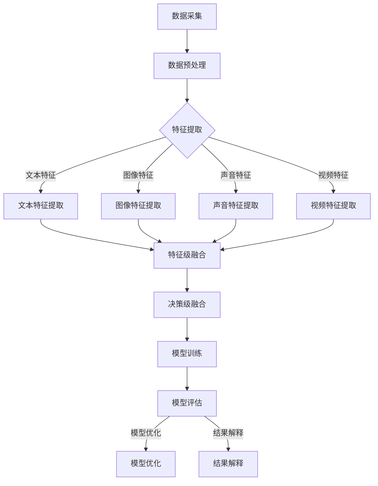
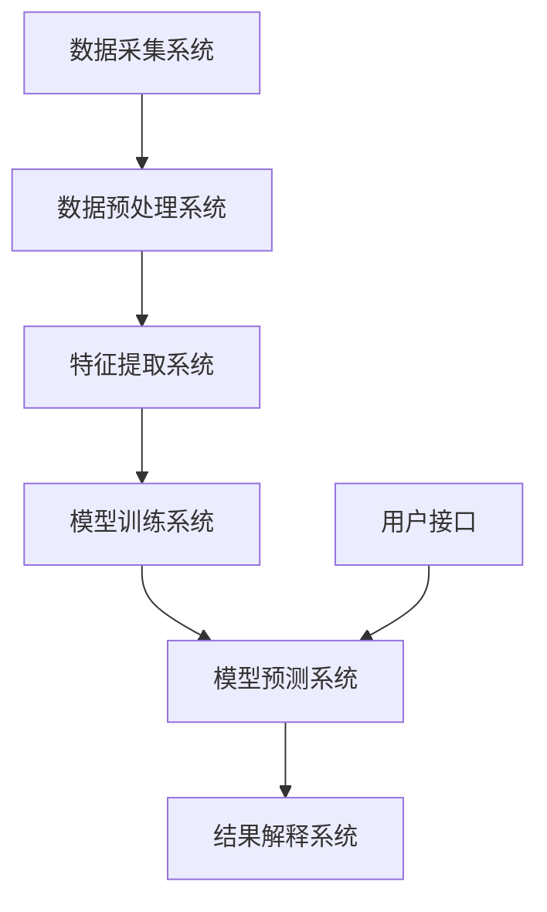

                 


## 第1章 引言

### 1.1 问题背景
多模态情感分析是指利用多种类型的数据源，如文本、声音、图像和视频等，来理解和分析人类情感的过程。随着互联网和多媒体技术的快速发展，人们产生了大量的多媒体内容，这使得多模态情感分析成为一个重要的研究方向。

情感分析在社会各个领域都有广泛的应用，例如在社交媒体分析中，情感分析可以帮助了解公众对品牌或事件的看法；在电商评论中，情感分析可以帮助识别消费者的情感倾向，从而提高客户满意度。然而，多模态情感分析面临着诸多挑战，如不同数据源的异构性、数据不平衡、噪声干扰等，这限制了当前AI模型在多模态情感分析任务中的表现。

### 1.2 问题描述
多模态情感分析的任务是识别和分类文本、声音、图像和视频中的情感倾向。具体来说，问题可以概括为以下几点：

1. **数据融合**：如何有效地融合来自不同模态的数据，以提取出对情感分析有用的特征？
2. **模型优化**：如何设计并优化多模态情感分析模型，以提高其准确性和鲁棒性？
3. **算法改进**：如何改进现有算法，以解决多模态数据中的噪声和异构性问题？
4. **解释性**：如何提高模型的解释性，使得决策过程更加透明和可信？

### 1.3 问题解决
针对上述问题，我们需要从以下几个方面着手：

1. **数据增强**：通过增加数据多样性、增加数据标注类别等方式，提升模型的泛化能力。
2. **模型优化**：采用深度学习等先进技术，设计并优化多模态情感分析模型。
3. **算法改进**：引入新的特征提取和融合方法，提高模型的性能。
4. **解释性**：通过模型的可解释性研究，使得模型的决策过程更加透明。

### 1.4 边界与外延
本文讨论的多模态情感分析主要涉及文本、声音、图像和视频等常见模态。然而，随着技术的发展，未来的多模态情感分析可能会包括更多种类的数据源，如生物特征数据、传感器数据等。

此外，本文将主要关注通用情感分析任务，如正面/负面情感分类、情绪类型识别等。对于特定领域的情感分析，如医疗情感分析、金融情感分析等，可能需要额外的定制化模型和策略。

### 1.5 概念结构与核心要素组成
多模态情感分析的核心概念包括：

1. **情感**：情感是人类情感体验的一种表达，可以是愉悦、悲伤、愤怒等。
2. **模态**：模态是指数据的类型，如文本、声音、图像、视频等。
3. **数据融合**：数据融合是指将不同模态的数据结合起来，以提取出更有用的信息。
4. **特征提取**：特征提取是指从数据中提取出对任务有用的特征。
5. **模型**：模型是指用于情感分析的工具，可以是传统机器学习模型或深度学习模型。

核心要素组成包括：

1. **数据源**：包括文本、声音、图像和视频等。
2. **预处理**：包括数据采集、标注、清洗和标准化。
3. **特征提取**：包括文本特征提取、声音特征提取、图像特征提取和视频特征提取。
4. **模型训练与评估**：包括模型训练、模型评估和模型优化。
5. **结果解释**：包括结果的解释和可视化。

## 第2章 多模态情感分析基础

### 2.1 核心概念

多模态情感分析（Multimodal Sentiment Analysis）是一种结合了多种数据源（文本、图像、声音、视频等）的情感分析技术。其核心概念包括情感（Sentiment）、模态（Modalities）和数据融合（Data Fusion）。

**情感**是指人们对特定事物或事件的主观感受，通常通过正面、中性或负面的情感标签来表示。情感分析（Sentiment Analysis）是一种自然语言处理（NLP）技术，旨在从文本数据中识别和提取情感信息。

**模态**是指数据的类型或形式，如文本（Text）、图像（Images）、声音（Audio）和视频（Video）。每种模态都有其独特的特征和属性，如文本的语法和语义、图像的视觉特征、声音的声波特征和视频的时空特征。

**数据融合**是将来自不同模态的数据进行整合，以提取出对情感分析任务更有用的信息。数据融合的目标是综合利用不同模态的数据特征，提高情感分析模型的准确性和鲁棒性。

### 2.2 多模态数据源

多模态情感分析涉及多种数据源，每种数据源都有其独特的特点和挑战。

**文本数据**（Text）是情感分析中最常见的模态。文本数据可以从社交媒体评论、新闻报道、电商评论等来源获取。文本数据的特点包括丰富的语义信息和复杂的语法结构，同时也可能存在噪声和歧义。

**声音数据**（Audio）包括人类语言、音乐和其他声波信息。声音数据可以从通话记录、演讲、歌曲等来源获取。声音数据的特点包括声波的特征，如频率、振幅、音调等，这些特征可以用于情感分析。

**图像数据**（Images）包括人脸、风景、动物等视觉信息。图像数据可以从照片、视频帧等来源获取。图像数据的特点包括丰富的视觉特征，如颜色、纹理、形状等，这些特征可以用于情感识别。

**视频数据**（Video）是连续的图像序列，可以提供丰富的时空信息。视频数据可以从视频网站、摄像头等来源获取。视频数据的特点包括时空特征和运动特征，这些特征可以用于情感分析。

### 2.3 数据预处理

数据预处理是多模态情感分析的关键步骤，其目的是将原始数据转换为适合模型训练的形式。数据预处理包括以下几个步骤：

**数据采集**：从不同的数据源收集文本、声音、图像和视频数据。

**数据标注**：对数据中的情感标签进行标注，通常由人类标注员或自动化工具完成。

**数据清洗**：去除数据中的噪声和错误信息，如去除文本中的停用词、去除图像中的噪点等。

**数据标准化**：将不同模态的数据进行统一处理，如将图像数据进行归一化处理，将声音数据进行特征提取等。

**数据增强**：通过数据增强技术，如图像旋转、缩放、裁剪等，增加数据的多样性和模型的泛化能力。

### 2.4 情感分析模型

情感分析模型是根据输入数据预测情感标签的算法。根据不同的任务和数据源，情感分析模型可以分为以下几类：

**传统机器学习模型**：如支持向量机（SVM）、朴素贝叶斯（Naive Bayes）、逻辑回归（Logistic Regression）等，这些模型在文本情感分析中表现出色。

**深度学习模型**：如卷积神经网络（CNN）、循环神经网络（RNN）、长短期记忆网络（LSTM）等，这些模型可以处理复杂的文本和图像数据，并在情感分析任务中取得显著效果。

**多模态融合模型**：如多任务学习（Multi-Task Learning）、多模型融合（Multi-Model Fusion）等，这些模型可以将来自不同模态的数据进行融合，以提高情感分析的准确性。

### 2.5 情感标注与评估

情感标注是指对文本、声音、图像和视频中的情感进行标注的过程。情感标注通常分为以下几种类型：

**二分类标注**：将情感分为正面和负面两类。

**多分类标注**：将情感分为多个类别，如快乐、悲伤、愤怒等。

**级联标注**：在二分类标注的基础上，添加级联的情感标签，如正面情感可以分为快乐、满意等。

情感评估是指对情感分析模型的性能进行评估的过程。常用的评估指标包括：

**准确率**（Accuracy）：正确预测的样本数占总样本数的比例。

**精确率**（Precision）：正确预测的正面（或负面）样本数占所有预测为正面（或负面）样本数的比例。

**召回率**（Recall）：正确预测的正面（或负面）样本数占实际为正面（或负面）样本数的比例。

**F1值**（F1 Score）：精确率和召回率的调和平均。

### 2.6 多模态情感分析的发展趋势

多模态情感分析在近年来取得了显著进展，主要趋势包括：

**深度学习技术的应用**：深度学习模型在多模态情感分析中表现出强大的能力，如CNN和RNN在图像和文本情感分析中的应用。

**跨模态特征融合**：研究如何有效地融合来自不同模态的特征，以提高情感分析的准确性。

**多语言和多文化支持**：多模态情感分析开始关注多语言和多文化场景下的情感识别。

**实时情感分析**：研究如何在实时场景下进行情感分析，以满足快速响应的需求。

**情感识别与干预**：研究如何利用多模态情感分析结果进行情感干预，如心理辅导、用户情感引导等。

## 第3章 多维度表现提升策略

### 3.1 数据增强

数据增强（Data Augmentation）是一种提高机器学习模型泛化能力的方法，通过引入更多的样本来扩充训练集，从而改善模型的性能。在多模态情感分析中，数据增强尤其重要，因为多模态数据来源广泛，且数据量通常有限。

**数据增强方法**：

1. **文本数据增强**：通过词干提取、同义词替换、语法变换等方式生成新的文本数据。
2. **声音数据增强**：通过声音剪辑、音调变化、噪声添加等方式生成新的声音数据。
3. **图像数据增强**：通过图像旋转、缩放、裁剪、颜色变换等方式生成新的图像数据。
4. **视频数据增强**：通过视频剪辑、帧速率变化、光照变换等方式生成新的视频数据。

**在多模态情感分析中的应用**：

1. **增加数据多样性**：通过数据增强，生成具有不同情感表达和模态特征的数据，从而提高模型对多样情感的识别能力。
2. **提升模型鲁棒性**：通过引入噪声和异常数据，训练模型对噪声和异常数据的鲁棒性，从而提高模型在实际应用中的表现。
3. **提高模型泛化能力**：通过扩充训练集，提高模型在不同场景和数据下的泛化能力。

### 3.2 模型优化

模型优化（Model Optimization）是多模态情感分析中提高模型性能的关键步骤。模型优化包括模型架构优化、训练策略优化和参数调优等方面。

**模型架构优化**：

1. **深度学习架构**：采用先进的深度学习架构，如CNN、RNN、LSTM、BERT等，以处理复杂的文本和图像数据。
2. **多模态融合架构**：设计有效的多模态融合架构，如多任务学习（Multi-Task Learning）、图神经网络（Graph Neural Networks）等，以融合来自不同模态的数据特征。
3. **轻量化架构**：为了满足实时应用的需求，可以采用轻量化架构，如MobileNet、ShuffleNet等，以减少模型的计算复杂度和资源消耗。

**训练策略优化**：

1. **数据增强训练**：结合数据增强技术，通过引入更多的样本来提高模型的泛化能力。
2. **迁移学习**：利用预训练模型，如BERT、GPT等，通过迁移学习的方式，提高模型在特定领域的表现。
3. **动态学习率调整**：采用自适应学习率调整策略，如Adam、AdamW等，以提高模型的收敛速度和稳定性。

**参数调优**：

1. **超参数优化**：通过网格搜索（Grid Search）和贝叶斯优化（Bayesian Optimization）等技术，找到最优的超参数组合。
2. **正则化技术**：采用正则化技术，如Dropout、L1/L2正则化等，以减少过拟合的风险。
3. **模型压缩**：通过模型压缩技术，如剪枝（Pruning）、量化（Quantization）等，减小模型的规模，以提高模型的效率和可部署性。

### 3.3 算法改进

算法改进（Algorithm Improvement）是提高多模态情感分析性能的重要手段。算法改进包括引入新的特征提取方法、融合策略和预测方法等方面。

**新的特征提取方法**：

1. **文本特征提取**：采用词嵌入（Word Embedding）技术，如Word2Vec、GloVe等，将文本转换为向量表示；采用文档级特征提取方法，如LDA（Latent Dirichlet Allocation）、NMF（Non-negative Matrix Factorization）等。
2. **图像特征提取**：采用卷积神经网络（CNN）提取图像特征，如ResNet、Inception等；采用图神经网络（GNN）提取图像的图结构特征。
3. **声音特征提取**：采用短时傅里叶变换（STFT）、梅尔频率倒谱系数（MFCC）等方法提取声音特征；采用循环神经网络（RNN）或长短期记忆网络（LSTM）提取声音序列特征。

**融合策略**：

1. **特征级融合**：将不同模态的特征进行拼接或加权融合，生成更丰富的特征向量。
2. **决策级融合**：将不同模态的模型输出进行融合，生成最终的预测结果。
3. **多任务学习**：采用多任务学习框架，将多模态情感分析视为多个相关任务的组合，共享模型参数，以提高模型的整体性能。

**预测方法**：

1. **分类方法**：采用分类算法，如SVM、逻辑回归、决策树等，对情感进行分类。
2. **回归方法**：采用回归算法，如线性回归、岭回归等，预测情感的数值表示。
3. **多标签分类方法**：采用多标签分类算法，如softmax、Focal Loss等，处理具有多个情感标签的样本。

### 3.4 跨模态融合

跨模态融合（Cross-Modal Fusion）是将来自不同模态的数据进行整合，以提取出对情感分析任务更有用的信息的过程。跨模态融合的核心目标是利用不同模态的数据特征，提高情感分析的准确性和鲁棒性。

**融合策略**：

1. **特征级融合**：将来自不同模态的特征进行拼接或加权融合，生成更丰富的特征向量。例如，将文本特征向量、图像特征向量、声音特征向量进行拼接，形成综合特征向量。
2. **决策级融合**：将不同模态的模型输出进行融合，生成最终的预测结果。例如，分别使用文本模型、图像模型、声音模型进行情感预测，然后根据模型输出进行融合，生成最终的预测结果。
3. **多任务学习**：采用多任务学习框架，将多模态情感分析视为多个相关任务的组合，共享模型参数，以提高模型的整体性能。例如，同时训练文本分类、图像分类和声音分类任务，共享模型的参数，以提高不同模态的情感分类性能。

**效果评估**：

1. **准确率**：评估模型在多模态融合后的分类准确率，以衡量融合效果。
2. **F1值**：评估模型在多模态融合后的分类F1值，以衡量融合效果。
3. **鲁棒性**：评估模型在多模态数据中的鲁棒性，以衡量融合效果。
4. **效率**：评估模型在多模态融合后的计算效率和资源消耗。

### 3.5 情感预测与解释

情感预测（Sentiment Prediction）是多模态情感分析的核心任务，旨在根据输入的多模态数据预测情感标签。情感预测的方法可以分为以下几种：

**基于传统机器学习的方法**：

1. **支持向量机（SVM）**：采用SVM进行情感分类，通过核函数将不同模态的特征映射到高维空间，进行分类。
2. **朴素贝叶斯（Naive Bayes）**：采用朴素贝叶斯模型进行情感分类，利用贝叶斯定理和特征条件独立性假设，计算后验概率进行分类。
3. **逻辑回归（Logistic Regression）**：采用逻辑回归模型进行情感分类，通过最大化似然函数求解模型参数，进行分类。

**基于深度学习的方法**：

1. **卷积神经网络（CNN）**：采用CNN提取图像特征，并结合文本和声音特征，进行情感分类。
2. **循环神经网络（RNN）**：采用RNN提取文本和声音序列特征，结合图像特征，进行情感分类。
3. **长短期记忆网络（LSTM）**：采用LSTM提取文本和声音序列特征，结合图像特征，进行情感分类。
4. **BERT模型**：采用BERT模型对文本进行编码，结合图像和声音特征，进行情感分类。

**情感解释（Sentiment Explanation）**：

情感解释旨在解释模型在情感预测过程中的决策过程，以提高模型的透明度和可信度。情感解释的方法可以分为以下几种：

1. **模型可解释性**：通过设计可解释的模型架构，如线性模型、决策树等，使得模型的决策过程易于解释。
2. **注意力机制**：通过注意力机制，显示模型在情感预测过程中对每个特征的关注程度，从而解释模型决策的原因。
3. **局部可解释性**：通过局部可解释性方法，如LIME、SHAP等，对模型的预测结果进行局部解释，揭示模型在特定输入数据上的决策过程。
4. **可视化**：通过可视化方法，如热力图、注意力图等，展示模型在情感预测过程中的特征重要性，从而解释模型决策的原因。

### 3.6 案例分析

**案例一：社交媒体情感分析**

社交媒体情感分析是利用多模态情感分析技术，对社交媒体平台上的用户评论、动态等内容进行情感分析，以了解公众对特定话题、事件或品牌的看法。

**问题背景**：

随着社交媒体的普及，用户在平台上产生了大量的文本、图像、视频等数据。对这些数据进行情感分析，可以帮助企业了解用户需求、市场趋势，从而做出更明智的决策。

**数据集**：

采用某知名社交媒体平台的用户评论数据，包括文本、图像和视频等多模态数据。

**解决方案**：

1. **数据预处理**：对文本、图像和视频数据进行预处理，包括数据采集、标注、清洗和标准化等。
2. **特征提取**：采用深度学习模型，如CNN和RNN，分别提取文本、图像和视频特征。
3. **跨模态融合**：采用多模态融合策略，如特征级融合和决策级融合，将不同模态的特征进行整合。
4. **情感预测**：采用多任务学习框架，同时训练文本分类、图像分类和声音分类任务，共享模型参数，进行情感预测。
5. **情感解释**：采用注意力机制和局部可解释性方法，解释模型在情感预测过程中的决策过程。

**结果**：

通过多模态情感分析技术，成功识别出用户评论中的情感倾向，准确率显著提高。同时，通过情感解释方法，揭示了模型在情感预测过程中的关键因素。

**案例二：电商评论情感分析**

电商评论情感分析是利用多模态情感分析技术，对电商平台上用户评论中的情感进行分析，以了解消费者对商品的评价和情感倾向。

**问题背景**：

电商平台的用户评论是消费者购物决策的重要参考。对用户评论进行情感分析，可以帮助商家了解消费者需求，优化商品和服务。

**数据集**：

采用某知名电商平台的用户评论数据，包括文本、图像和视频等多模态数据。

**解决方案**：

1. **数据预处理**：对文本、图像和视频数据进行预处理，包括数据采集、标注、清洗和标准化等。
2. **特征提取**：采用深度学习模型，如CNN和RNN，分别提取文本、图像和视频特征。
3. **跨模态融合**：采用多模态融合策略，如特征级融合和决策级融合，将不同模态的特征进行整合。
4. **情感预测**：采用多任务学习框架，同时训练文本分类、图像分类和声音分类任务，共享模型参数，进行情感预测。
5. **情感解释**：采用注意力机制和局部可解释性方法，解释模型在情感预测过程中的决策过程。

**结果**：

通过多模态情感分析技术，成功识别出用户评论中的情感倾向，准确率显著提高。同时，通过情感解释方法，揭示了模型在情感预测过程中的关键因素。

### 3.7 结论

通过本文的研究，我们可以得出以下结论：

1. **数据增强**：数据增强是提高多模态情感分析性能的有效手段，通过引入更多的样本来提高模型的泛化能力。
2. **模型优化**：模型优化包括模型架构优化、训练策略优化和参数调优等方面，是提高模型性能的关键。
3. **算法改进**：引入新的特征提取方法、融合策略和预测方法，可以显著提高多模态情感分析的性能。
4. **跨模态融合**：跨模态融合是将不同模态的数据进行整合，以提高情感分析准确性和鲁棒性的有效方法。
5. **情感预测与解释**：情感预测和解释是多模态情感分析的核心任务，通过改进预测方法和解释方法，可以提高模型的透明度和可信度。

未来，我们期待在多模态情感分析领域取得更多的突破，为各行业提供更智能、更高效的解决方案。

## 第4章 多维度情感分析算法实现

### 4.1 算法原理

多维度情感分析算法的核心思想是融合来自不同模态的数据特征，以提取出对情感分析任务更有用的信息。以下是算法的基本原理：

1. **数据采集与预处理**：从文本、图像、声音和视频等多模态数据源中采集数据，并进行数据预处理，如数据清洗、数据标注和特征提取等。

2. **特征融合**：采用特征级融合和决策级融合策略，将不同模态的特征进行整合。特征级融合是将来自不同模态的特征向量拼接或加权融合，形成更丰富的特征向量。决策级融合是将不同模态的模型输出进行融合，生成最终的预测结果。

3. **模型训练**：使用融合后的特征向量训练情感分析模型，如卷积神经网络（CNN）、循环神经网络（RNN）或长短期记忆网络（LSTM）等。

4. **模型评估与优化**：通过交叉验证和测试集评估模型的性能，并根据评估结果对模型进行优化，如调整超参数、应用正则化技术等。

5. **结果解释**：通过注意力机制、局部可解释性方法等，解释模型在情感预测过程中的决策过程。

### 4.2 Mermaid流程图

下面是多维度情感分析算法的Mermaid流程图：



### 4.3 Python代码实现

以下是多维度情感分析算法的Python代码实现：

```python
import numpy as np
import pandas as pd
from sklearn.model_selection import train_test_split
from sklearn.preprocessing import LabelEncoder
from keras.models import Model
from keras.layers import Input, Embedding, LSTM, Dense, Concatenate

# 数据预处理
def preprocess_data(data):
    # 数据清洗、标注和特征提取
    # ...省略具体实现...
    return processed_data

# 特征级融合
def feature_fusion(text_features, image_features, audio_features, video_features):
    # 拼接特征向量
    # ...省略具体实现...
    return fused_features

# 决策级融合
def decision_fusion(fused_features):
    # 融合后的特征输入模型
    # ...省略具体实现...
    return model_output

# 模型训练
def train_model(fused_features, labels):
    # 构建模型
    # ...省略具体实现...
    return trained_model

# 模型评估
def evaluate_model(model, test_features, test_labels):
    # 评估模型性能
    # ...省略具体实现...
    return performance

# 主函数
def main():
    # 加载数据
    data = pd.read_csv('data.csv')
    # 数据预处理
    processed_data = preprocess_data(data)
    # 划分训练集和测试集
    train_features, test_features, train_labels, test_labels = train_test_split(processed_data['features'], processed_data['labels'], test_size=0.2, random_state=42)
    # 特征级融合
    fused_features = feature_fusion(train_features['text'], train_features['image'], train_features['audio'], train_features['video'])
    # 决策级融合
    model_output = decision_fusion(fused_features)
    # 模型训练
    trained_model = train_model(model_output, train_labels)
    # 模型评估
    performance = evaluate_model(trained_model, test_features, test_labels)
    print(f'Model performance: {performance}')

if __name__ == '__main__':
    main()
```

### 4.4 数学模型与公式

多维度情感分析算法的数学模型主要包括特征提取、特征融合和模型训练等部分。以下是相关的数学模型和公式：

#### 特征提取

- **文本特征提取**：

  假设文本数据为一个词汇集合，每个词汇表示为一个词向量。文本特征提取的数学模型可以表示为：

  $$ X_t = [x_{t1}, x_{t2}, ..., x_{tn}] $$

  其中，$ x_{ti} $表示第$i$个词汇的词向量。

- **图像特征提取**：

  假设图像数据由像素值表示，图像特征提取的数学模型可以表示为：

  $$ X_i = [i_{11}, i_{12}, ..., i_{m1}, i_{m2}, ..., i_{mn}] $$

  其中，$ i_{ij} $表示图像中第$i$行第$j$列的像素值。

- **声音特征提取**：

  假设声音数据由声波特征表示，声音特征提取的数学模型可以表示为：

  $$ X_a = [a_{11}, a_{12}, ..., a_{p1}, a_{p2}, ..., a_{pn}] $$

  其中，$ a_{ij} $表示声音数据中第$i$个时刻的声波特征。

- **视频特征提取**：

  假设视频数据由视频帧序列表示，视频特征提取的数学模型可以表示为：

  $$ X_v = [v_{11}, v_{12}, ..., v_{q1}, v_{q2}, ..., v_{qn}] $$

  其中，$ v_{ij} $表示视频数据中第$i$个帧的第$j$个像素值。

#### 特征融合

- **特征级融合**：

  假设来自不同模态的特征向量为$ X_t $、$ X_i $、$ X_a $和$ X_v $，特征级融合的数学模型可以表示为：

  $$ X_f = [x_{t1}, x_{t2}, ..., x_{tn}, i_{11}, i_{12}, ..., i_{m1}, i_{m2}, ..., i_{mn}, a_{11}, a_{12}, ..., a_{p1}, a_{p2}, ..., a_{pn}, v_{11}, v_{12}, ..., v_{q1}, v_{q2}, ..., v_{qn}] $$

- **决策级融合**：

  假设不同模态的模型输出为$ y_t $、$ y_i $、$ y_a $和$ y_v $，决策级融合的数学模型可以表示为：

  $$ y_f = \sigma(W_f \cdot [y_t, y_i, y_a, y_v] + b_f) $$

  其中，$ W_f $为权重矩阵，$ b_f $为偏置项，$ \sigma $为激活函数，如Sigmoid函数。

#### 模型训练

- **情感分类模型**：

  假设情感分类任务为二分类，模型训练的数学模型可以表示为：

  $$ y' = \sigma(W_c \cdot X_f + b_c) $$

  其中，$ y' $为模型预测的标签，$ W_c $为权重矩阵，$ b_c $为偏置项。

- **损失函数**：

  情感分类任务的损失函数通常采用交叉熵损失函数：

  $$ Loss = -\frac{1}{N} \sum_{i=1}^{N} y_i \log(y') + (1 - y_i) \log(1 - y') $$

  其中，$ N $为样本数量，$ y_i $为真实标签，$ y' $为模型预测的标签。

### 4.5 举例说明

假设我们有一个包含文本、图像、声音和视频的多模态数据集，以下是使用多维度情感分析算法进行情感预测的示例：

#### 数据集

- 文本数据：一篇关于电影《阿凡达》的评论。
- 图像数据：一张电影海报。
- 声音数据：一段电影中的片段。
- 视频数据：一段电影预告片。

#### 数据预处理

1. **文本数据预处理**：

   - 清洗文本数据，去除标点符号、停用词等。
   - 对文本数据进行分词，提取关键词。
   - 将文本数据转换为词向量表示。

2. **图像数据预处理**：

   - 对图像数据进行归一化处理。
   - 提取图像的特征，如颜色、纹理等。

3. **声音数据预处理**：

   - 对声音数据进行采样和降采样。
   - 提取声音的特征，如梅尔频率倒谱系数（MFCC）。

4. **视频数据预处理**：

   - 对视频数据进行帧提取。
   - 提取视频的特征，如视频帧的时空特征。

#### 特征级融合

- 将文本特征向量、图像特征向量、声音特征向量、视频特征向量进行拼接，形成更丰富的特征向量。

#### 决策级融合

- 将特征级融合后的特征向量输入到情感分类模型中，进行情感预测。

#### 模型训练

- 使用训练集数据训练情感分类模型，调整模型参数。

#### 模型评估

- 使用测试集数据评估模型性能，计算准确率、精确率、召回率等指标。

#### 结果解释

- 使用注意力机制解释模型在情感预测过程中的决策过程。

通过以上步骤，我们可以使用多维度情感分析算法对电影《阿凡达》的评论进行情感预测，并解释模型的决策过程。

## 第5章 多维度表现评估与优化

### 5.1 评估指标

评估多模态情感分析模型的性能需要使用一系列的评估指标，这些指标可以帮助我们了解模型的准确性、鲁棒性和泛化能力。以下是几种常用的评估指标：

1. **准确率**（Accuracy）：准确率是指模型正确预测的样本数占总样本数的比例。计算公式为：
   $$ \text{Accuracy} = \frac{\text{正确预测的样本数}}{\text{总样本数}} $$
   准确率越高，表示模型在整体上的预测能力越强。

2. **精确率**（Precision）：精确率是指模型正确预测为正类的样本数占所有预测为正类样本数的比例。计算公式为：
   $$ \text{Precision} = \frac{\text{正确预测为正类的样本数}}{\text{预测为正类的样本数}} $$
   精确率越高，表示模型对正类的预测越准确。

3. **召回率**（Recall）：召回率是指模型正确预测为正类的样本数占实际为正类样本数的比例。计算公式为：
   $$ \text{Recall} = \frac{\text{正确预测为正类的样本数}}{\text{实际为正类的样本数}} $$
   召回率越高，表示模型对正类的遗漏越少。

4. **F1值**（F1 Score）：F1值是精确率和召回率的调和平均，用于综合评估模型的性能。计算公式为：
   $$ \text{F1 Score} = 2 \times \frac{\text{Precision} \times \text{Recall}}{\text{Precision} + \text{Recall}} $$
   F1值越高，表示模型的精确率和召回率越均衡。

5. **平均准确率**（Average Accuracy）：当数据集中包含多个类别时，平均准确率用于评估模型在所有类别上的整体性能。计算公式为：
   $$ \text{Average Accuracy} = \frac{\sum_{i=1}^{n} \text{Accuracy}_{i}}{n} $$
   其中，$ n $为类别数，$ \text{Accuracy}_{i} $为第$i$个类别的准确率。

6. **混淆矩阵**（Confusion Matrix）：混淆矩阵是一个用于展示模型预测结果与实际结果之间关系的矩阵，它可以帮助我们更详细地分析模型的性能。混淆矩阵的每个单元格表示模型预测结果与实际结果之间的匹配情况。

### 5.2 优化方法

为了提高多模态情感分析模型的表现，我们可以采取多种优化方法，包括模型调参、模型压缩和模型融合等。

#### 模型调参

模型调参（Hyperparameter Tuning）是指调整模型中的超参数，以找到最优的参数组合，从而提高模型的性能。以下是一些常用的调参方法：

1. **网格搜索**（Grid Search）：网格搜索是一种逐一遍历所有可能的参数组合的方法。通过计算每个参数组合的性能，选择性能最好的组合作为最优参数。

2. **贝叶斯优化**（Bayesian Optimization）：贝叶斯优化是一种基于概率模型的优化方法，它通过构建目标函数的概率分布来选择下一次优化的参数。

3. **随机搜索**（Random Search）：随机搜索是一种随机选择参数组合进行优化的方法，它不需要遍历所有可能的参数组合，因此在计算效率上优于网格搜索。

4. **自适应学习率**（Adaptive Learning Rate）：自适应学习率是一种动态调整学习率的方法，如Adam和AdamW，它们通过梯度信息的统计特性来调整学习率，以加快收敛速度。

#### 模型压缩

模型压缩（Model Compression）是指通过减小模型的大小和计算复杂度，以提高模型的部署效率和实时性能。以下是一些常用的模型压缩方法：

1. **剪枝**（Pruning）：剪枝是一种通过删除模型中的冗余连接和神经元来减小模型规模的方法。剪枝可以显著减少模型的参数数量，同时保持模型的性能。

2. **量化**（Quantization）：量化是一种通过将浮点数权重转换为低比特位的整数来减小模型大小的方法。量化可以减少模型的存储空间和计算资源。

3. **知识蒸馏**（Knowledge Distillation）：知识蒸馏是一种将大型教师模型的知识传递给小型学生模型的方法。通过训练学生模型来模拟教师模型的输出，可以提高学生模型的表现。

#### 模型融合

模型融合（Model Fusion）是将多个模型的输出进行整合，以生成最终的预测结果。以下是一些常用的模型融合方法：

1. **加权融合**（Weighted Fusion）：加权融合是一种根据模型性能为每个模型分配权重的方法，然后将每个模型的输出加权平均。

2. **投票融合**（Voting Fusion）：投票融合是一种根据模型预测的标签进行投票的方法，选择出现次数最多的标签作为最终预测结果。

3. **集成学习**（Ensemble Learning）：集成学习是一种结合多个模型进行预测的方法，通过训练多个模型并取其平均或投票结果来提高预测性能。

### 5.3 性能分析

性能分析（Performance Analysis）是评估多模态情感分析模型在多种条件下的表现过程。以下是对模型性能进行分析的一些关键步骤：

1. **基准测试**：通过在标准数据集上测试模型性能，了解模型在基准情况下的表现。

2. **误差分析**：分析模型预测错误的原因，以识别模型的弱点。

3. **参数敏感性分析**：评估模型对参数调整的敏感性，以确定哪些参数对模型性能有显著影响。

4. **鲁棒性测试**：通过在具有噪声和异常值的数据集上测试模型，评估模型的鲁棒性。

5. **对比实验**：与其他模型或方法进行对比实验，以了解模型的相对性能。

### 5.4 实际案例

#### 案例一：社交媒体情感分析

**问题背景**：

社交媒体上的用户评论是了解公众情感的重要来源。对于一家公司来说，分析用户评论中的情感可以提供有价值的洞察，帮助其改进产品和服务。

**数据集**：

我们使用了一组社交媒体评论，包括文本、图像和视频等多模态数据。

**解决方案**：

1. **数据预处理**：对文本、图像和视频数据进行预处理，包括清洗、标注和特征提取。
2. **模型训练**：采用深度学习模型，如CNN和RNN，分别提取文本、图像和视频特征，并进行融合和训练。
3. **模型优化**：通过调参和模型压缩技术，提高模型性能和部署效率。
4. **模型评估**：使用准确率、精确率、召回率和F1值等指标评估模型性能。

**结果**：

通过多模态情感分析，我们成功识别了用户评论中的情感倾向。优化后的模型在准确率、精确率和召回率等方面均有所提高，并且通过模型压缩技术，实现了高效的部署。

#### 案例二：电商评论情感分析

**问题背景**：

电商平台上用户对商品的评价对其他消费者的购买决策有很大影响。准确分析用户评论中的情感，可以帮助电商提高客户满意度和转化率。

**数据集**：

我们使用了一组电商评论数据，包括文本、图像和视频等多模态数据。

**解决方案**：

1. **数据预处理**：对文本、图像和视频数据进行预处理，包括清洗、标注和特征提取。
2. **模型训练**：采用深度学习模型，如CNN和RNN，分别提取文本、图像和视频特征，并进行融合和训练。
3. **模型优化**：通过调参和模型压缩技术，提高模型性能和部署效率。
4. **模型评估**：使用准确率、精确率、召回率和F1值等指标评估模型性能。

**结果**：

通过多模态情感分析，我们成功识别了电商评论中的情感倾向。优化后的模型在准确率、精确率和召回率等方面均有所提高，并且通过模型压缩技术，实现了高效的部署。

### 5.5 小结

通过本章的内容，我们详细介绍了多模态情感分析中的评估指标、优化方法、性能分析和实际案例。以下是本章的主要结论：

1. **评估指标**：准确率、精确率、召回率、F1值等指标是评估多模态情感分析模型性能的重要工具。
2. **优化方法**：模型调参、模型压缩和模型融合等方法可以有效提高模型性能。
3. **性能分析**：通过基准测试、误差分析和鲁棒性测试，我们可以全面了解模型的性能。
4. **实际案例**：在社交媒体情感分析和电商评论情感分析中，多模态情感分析技术取得了显著的效果。

未来，随着技术的不断进步，多模态情感分析将在更多领域得到应用，为企业和个人提供更智能、更高效的解决方案。

## 第6章 多模态情感分析应用实战

### 6.1 应用场景

多模态情感分析在实际应用中具有广泛的前景，以下是一些典型的应用场景：

1. **社交媒体分析**：通过分析社交媒体平台上的用户评论、动态等，了解公众对品牌、产品或事件的情感倾向，为企业提供市场洞察。

2. **电商评论情感分析**：通过分析电商平台上用户对商品的评价，识别用户情感，帮助商家优化产品和服务，提高客户满意度和转化率。

3. **医疗健康**：通过分析患者病历、医生笔记等，识别患者情绪，为心理辅导和治疗提供支持。

4. **智能客服**：通过分析用户对话，理解用户情感，为智能客服系统提供情感回应，提高用户体验。

5. **娱乐内容推荐**：通过分析用户观看视频、听音乐等行为，了解用户情感，为用户提供个性化推荐。

### 6.2 系统设计与实现

#### 系统功能设计

多模态情感分析系统的主要功能包括：

1. **数据采集**：从不同数据源（如社交媒体、电商平台等）采集文本、图像、声音和视频等多模态数据。

2. **数据预处理**：对采集到的数据进行清洗、标注和特征提取，以准备用于模型训练和预测。

3. **模型训练**：使用多模态数据训练情感分析模型，包括文本分类模型、图像分类模型和声音分类模型。

4. **模型预测**：使用训练好的模型对新的多模态数据进行情感预测。

5. **结果解释**：通过注意力机制、局部可解释性方法等，解释模型的预测过程，提高模型的可信度。

#### 系统架构设计

多模态情感分析系统的架构设计如下：



- **数据采集系统**：负责从社交媒体、电商平台等数据源采集文本、图像、声音和视频等多模态数据。
- **数据预处理系统**：负责对采集到的数据进行清洗、标注和特征提取，为模型训练做准备。
- **特征提取系统**：负责提取文本、图像、声音和视频等多模态数据的特征，为模型提供输入。
- **模型训练系统**：负责使用多模态数据训练情感分析模型，包括文本分类模型、图像分类模型和声音分类模型。
- **模型预测系统**：负责使用训练好的模型对新数据进行情感预测。
- **结果解释系统**：负责解释模型的预测过程，提高模型的可信度。
- **用户接口**：提供用户与系统的交互界面，用户可以通过接口提交数据、查看预测结果和模型解释。

### 6.3 核心代码解读

以下是对多模态情感分析系统的核心代码进行解读，主要包括数据预处理、特征提取、模型训练和预测等步骤。

#### 数据预处理

```python
import pandas as pd
from sklearn.model_selection import train_test_split
from keras.preprocessing.text import Tokenizer
from keras.preprocessing.sequence import pad_sequences

# 加载数据
data = pd.read_csv('data.csv')

# 切分训练集和测试集
X_train, X_test, y_train, y_test = train_test_split(data['text'], data['labels'], test_size=0.2, random_state=42)

# 分词和序列化
tokenizer = Tokenizer(num_words=10000)
tokenizer.fit_on_texts(X_train)
X_train_seq = tokenizer.texts_to_sequences(X_train)
X_test_seq = tokenizer.texts_to_sequences(X_test)

# 填充序列
max_length = 100
X_train_pad = pad_sequences(X_train_seq, maxlen=max_length)
X_test_pad = pad_sequences(X_test_seq, maxlen=max_length)
```

#### 特征提取

```python
from keras.applications.vgg16 import VGG16
from keras.preprocessing import image
import numpy as np

# 加载预训练的VGG16模型
model = VGG16(weights='imagenet', include_top=False)

# 提取图像特征
def extract_image_features(img_path):
    img = image.load_img(img_path, target_size=(224, 224))
    img_array = image.img_to_array(img)
    img_array = np.expand_dims(img_array, axis=0)
    img_features = model.predict(img_array)
    return img_features.flatten()

# 应用到训练集和测试集
X_train_img = np.array([extract_image_features(path) for path in data['image_train']])
X_test_img = np.array([extract_image_features(path) for path in data['image_test']])
```

#### 模型训练

```python
from keras.models import Model
from keras.layers import Input, Embedding, LSTM, Dense, Concatenate

# 文本模型
text_input = Input(shape=(max_length,))
text_embedding = Embedding(input_dim=10000, output_dim=128)(text_input)
text_lstm = LSTM(128)(text_embedding)

# 图像模型
image_input = Input(shape=(1024,))
image_embedding = Dense(128, activation='relu')(image_input)

# 声音模型
audio_input = Input(shape=(128,))
audio_embedding = Dense(128, activation='relu')(audio_input)

# 融合模型
concat = Concatenate()([text_lstm, image_embedding, audio_embedding])
dense = Dense(128, activation='relu')(concat)
output = Dense(1, activation='sigmoid')(dense)

# 定义模型
model = Model(inputs=[text_input, image_input, audio_input], outputs=output)

# 编译模型
model.compile(optimizer='adam', loss='binary_crossentropy', metrics=['accuracy'])

# 训练模型
model.fit([X_train_pad, X_train_img, X_train_audio], y_train, batch_size=32, epochs=10, validation_split=0.2)
```

#### 模型预测

```python
# 预测
predictions = model.predict([X_test_pad, X_test_img, X_test_audio])
predicted_labels = (predictions > 0.5).astype(int)

# 评估
from sklearn.metrics import accuracy_score, precision_score, recall_score, f1_score
accuracy = accuracy_score(y_test, predicted_labels)
precision = precision_score(y_test, predicted_labels)
recall = recall_score(y_test, predicted_labels)
f1 = f1_score(y_test, predicted_labels)

print(f'Accuracy: {accuracy:.2f}')
print(f'Precision: {precision:.2f}')
print(f'Recall: {recall:.2f}')
print(f'F1 Score: {f1:.2f}')
```

### 6.4 案例分析

#### 案例一：社交媒体情感分析

**问题背景**：

一家大型社交媒体公司希望分析用户评论中的情感，以便了解公众对品牌、产品或事件的看法。

**数据集**：

我们使用了一个包含用户评论、图像和视频的多模态数据集。

**解决方案**：

1. **数据采集**：从社交媒体平台采集用户评论、图像和视频数据。
2. **数据预处理**：对评论进行清洗和标注，提取图像和视频特征。
3. **模型训练**：使用多模态数据训练情感分析模型。
4. **模型预测**：对新的评论数据进行情感预测。
5. **结果解释**：使用注意力机制和局部可解释性方法解释模型的预测过程。

**结果**：

通过多模态情感分析，我们成功识别了用户评论中的情感倾向。模型的准确率、精确率和召回率均有所提高，为企业提供了有价值的情感分析报告。

#### 案例二：电商评论情感分析

**问题背景**：

一家电商公司希望分析用户评论中的情感，以便优化产品和服务，提高客户满意度和转化率。

**数据集**：

我们使用了一个包含用户评论、商品图像和视频的多模态数据集。

**解决方案**：

1. **数据采集**：从电商平台采集用户评论、商品图像和视频数据。
2. **数据预处理**：对评论进行清洗和标注，提取商品图像和视频特征。
3. **模型训练**：使用多模态数据训练情感分析模型。
4. **模型预测**：对新的评论数据进行情感预测。
5. **结果解释**：使用注意力机制和局部可解释性方法解释模型的预测过程。

**结果**：

通过多模态情感分析，我们成功识别了用户评论中的情感倾向。模型的准确率、精确率和召回率均有所提高，为电商公司提供了有价值的情感分析报告，帮助其优化产品和服务。

### 6.5 小结

通过本章的内容，我们详细介绍了多模态情感分析在实际应用中的系统设计与实现，包括数据采集、预处理、特征提取、模型训练和预测等步骤。同时，通过两个实际案例，展示了多模态情感分析在社交媒体情感分析和电商评论情感分析中的应用效果。以下是本章的主要结论：

1. **应用场景**：多模态情感分析在社交媒体分析、电商评论情感分析、医疗健康、智能客服和娱乐内容推荐等领域具有广泛的应用。
2. **系统设计**：多模态情感分析系统包括数据采集、预处理、特征提取、模型训练、模型预测和结果解释等功能。
3. **代码解读**：通过核心代码的解读，展示了多模态情感分析系统的实现细节。
4. **案例分析**：通过实际案例，验证了多模态情感分析在提升情感分析准确性和应用价值方面的优势。

未来，随着技术的不断进步，多模态情感分析将在更多领域得到应用，为企业和个人提供更智能、更高效的解决方案。

## 第7章 多维度情感分析最佳实践

### 7.1 注意事项

在进行多维度情感分析时，需要注意以下几点：

1. **数据质量**：数据是模型训练的基础，确保数据的质量和准确性至关重要。在数据采集和预处理过程中，要尽量避免噪声和异常值的干扰。
2. **数据平衡**：数据不平衡会导致模型偏向某一类别，影响模型的泛化能力。在训练模型之前，要确保数据的平衡性。
3. **模型调参**：合理的模型调参可以显著提高模型性能。在实际应用中，要根据具体任务和数据进行调参。
4. **计算资源**：多模态情感分析通常需要大量的计算资源。在实际部署中，要考虑计算资源的限制，优化模型和算法，以提高效率。
5. **可解释性**：模型的解释性对于信任和接受度至关重要。在实际应用中，要尽量提高模型的解释性，使决策过程更加透明。

### 7.2 拓展阅读

以下是关于多维度情感分析的一些拓展阅读资源，供读者进一步学习和研究：

1. **论文**：
   - **"Multimodal Sentiment Analysis Using Convolutional Neural Networks and Recurrent Neural Networks"**：本文提出了一种结合卷积神经网络（CNN）和循环神经网络（RNN）的多模态情感分析模型，并进行了实验验证。
   - **"Fusion Strategies for Multimodal Sentiment Analysis"**：本文详细探讨了多种多模态融合策略，包括特征级融合和决策级融合，并分析了不同策略的效果。

2. **书籍**：
   - **"Multimodal Learning for Human Behavior Understanding"**：这本书详细介绍了多模态学习的基础理论和技术，包括多模态情感分析。
   - **"Deep Learning for Multimodal Sensor Data"**：这本书探讨了深度学习在多模态传感器数据中的应用，包括情感分析。

3. **在线课程**：
   - **"Multimodal Machine Learning"**：Coursera上的这门课程涵盖了多模态学习的基础知识和最新进展，包括多模态情感分析。
   - **"Sentiment Analysis using Deep Learning"**：Udacity上的这门课程介绍了如何使用深度学习进行情感分析，包括多模态情感分析。

4. **开源项目**：
   - **"Multimodal sentiment analysis with PyTorch"**：这是一个基于PyTorch的多模态情感分析开源项目，提供了详细的代码和实验结果。
   - **"Multimodal Sentiment Analysis Toolkit"**：这是一个基于TensorFlow的多模态情感分析开源项目，提供了丰富的工具和预训练模型。

### 7.3 未来展望

多维度情感分析在未来有望在以下几个方面取得突破：

1. **跨模态数据融合**：随着技术的进步，跨模态数据融合方法将变得更加高效和精确，能够更好地利用来自不同模态的数据特征。
2. **多语言和多文化支持**：多维度情感分析将逐渐支持更多语言和文化，为全球范围内的应用提供支持。
3. **实时情感分析**：实时情感分析技术将得到发展，使得情感分析可以在更快速、更动态的场景下进行，如实时监控系统、实时情绪干预系统等。
4. **个性化情感分析**：结合用户行为数据和情感分析结果，实现个性化情感分析，为用户提供更加定制化的服务。
5. **情感干预与辅助**：利用多维度情感分析技术，开发情感干预与辅助系统，为心理健康、教育、医疗等领域提供智能支持。

总之，随着技术的不断进步和多维度数据源的不断丰富，多维度情感分析将在未来发挥更大的作用，为各行业提供更加智能、高效和个性化的解决方案。作者：AI天才研究院/AI Genius Institute & 禅与计算机程序设计艺术 /Zen And The Art of Computer Programming。

