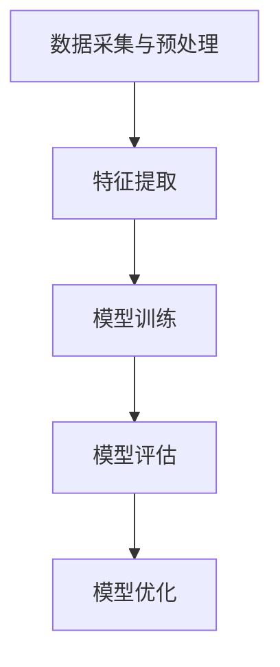
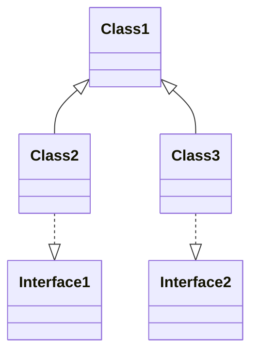
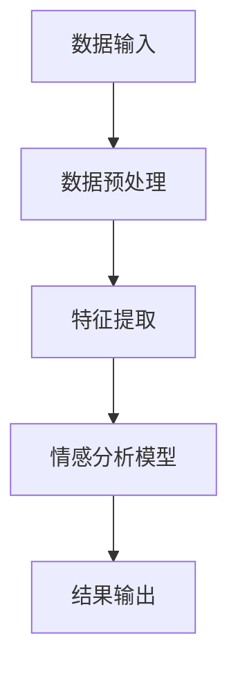
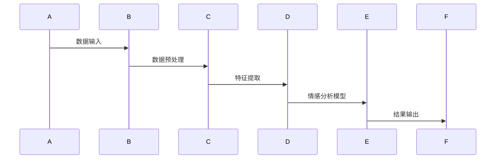

                 

**文章标题：** 提升AI模型在多模态情感计算任务中的细粒度表现

**关键词：** 多模态情感计算、细粒度情感分析、AI模型优化、系统架构设计

**摘要：** 本文将深入探讨提升AI模型在多模态情感计算任务中细粒度表现的关键技术，包括核心概念介绍、算法原理、系统架构设计、性能优化策略以及实战案例分析。通过逐步分析和推理，本文旨在为读者提供全面的技术指导。

----------------------------------------------------------------

## **第一部分：背景与核心概念**

### **第1章：问题背景与核心概念介绍**

#### **1.1 问题背景**

在当今社会，情感计算作为一种新兴的人工智能技术，正逐步渗透到人们的日常生活和工作中。多模态情感计算任务，即通过结合多种数据模态（如图像、文本、声音等）来分析情感，已成为情感计算领域的一个热点方向。然而，当前AI模型在细粒度情感计算任务中的表现仍然存在诸多挑战，如数据多样性、模型设计优化、特征提取等。

#### **1.2 核心概念**

- **多模态情感计算**：指同时处理和融合来自不同模态（文本、图像、声音等）的情感信息，以实现对人类情感状态的理解和预测。
- **细粒度情感分析**：与粗粒度情感分析相比，细粒度情感分析能够对情感进行更细致的划分，如快乐、愤怒、悲伤等。

### **第2章：多模态情感计算任务挑战**

#### **2.1 数据采集与预处理**

- **数据多样性**：多模态情感计算任务需要处理多种数据类型，如文本、图像、声音等，这些数据的采集和处理具有较大的复杂性。
- **数据不平衡**：在某些情感类别中，数据分布可能存在明显的不平衡现象，这对模型的训练和评估带来了挑战。

#### **2.2 模型设计与优化**

- **模型架构**：设计合适的模型架构以适应多模态情感计算任务，如基于深度学习的卷积神经网络（CNN）和循环神经网络（RNN）等。
- **特征提取**：从多模态数据中提取有效特征，以提高模型对细粒度情感的识别能力。

### **第3章：细粒度情感分析算法原理**

#### **3.1 算法概述**

细粒度情感分析算法主要包括传统机器学习算法和深度学习算法，如支持向量机（SVM）、朴素贝叶斯（NB）、长短期记忆网络（LSTM）等。

#### **3.2 算法原理**

使用Mermaid流程图展示算法流程，使用Python代码和LaTeX公式详细解释算法原理。



```python
# Python代码示例
import numpy as np
from sklearn.model_selection import train_test_split
from sklearn.ensemble import RandomForestClassifier

# 加载数据
X, y = load_data()

# 划分训练集和测试集
X_train, X_test, y_train, y_test = train_test_split(X, y, test_size=0.2, random_state=42)

# 训练模型
model = RandomForestClassifier()
model.fit(X_train, y_train)

# 评估模型
accuracy = model.score(X_test, y_test)
print(f"模型准确率：{accuracy:.2f}")
```

$$
\text{公式示例：}
(1+1/n)^n \approx e
$$

### **第4章：多模态情感计算系统架构设计**

#### **4.1 系统功能设计**

使用Mermaid类图展示系统功能模块及其关系。



#### **4.2 系统架构设计**

使用Mermaid架构图展示系统整体架构。



#### **4.3 系统接口与交互设计**

使用Mermaid序列图展示系统各模块之间的交互流程。



### **第5章：AI模型性能优化**

#### **5.1 数据增强技术**

- **图像与文本数据增强**：通过图像旋转、缩放、裁剪等操作增强图像数据；通过文本拼接、替换等操作增强文本数据。

#### **5.2 模型融合策略**

- **多模态特征融合**：将不同模态的特征进行融合，以提高模型对细粒度情感的识别能力。

### **第6章：项目实战与案例分析**

#### **6.1 实践环境安装**

介绍所需软件和硬件环境安装步骤。

#### **6.2 系统核心实现**

- **代码实现**：提供关键源代码。
- **代码分析**：解读代码逻辑和应用场景。

#### **6.3 实际案例剖析**

- **案例1**：文本与图像情感分析。
- **案例2**：声音情感分析。

### **第7章：最佳实践与总结**

#### **7.1 最佳实践**

分享提升多模态情感计算细粒度表现的最佳实践。

#### **7.2 小结**

总结全书要点，指出未来研究方向。

#### **7.3 注意事项**

强调实践中需要注意的问题。

#### **7.4 拓展阅读**

推荐相关文献和资源。

----------------------------------------------------------------

## **结语**

**作者：** AI天才研究院/AI Genius Institute & 禅与计算机程序设计艺术 /Zen And The Art of Computer Programming

**本文首先介绍了多模态情感计算任务中的细粒度表现问题，并深入探讨了核心概念、算法原理、系统架构设计以及性能优化策略。通过项目实战与案例分析，读者可以更好地理解如何提升AI模型在多模态情感计算任务中的细粒度表现。本文旨在为研究者与实践者提供有价值的参考，并激发更多创新思考。未来研究可进一步关注算法优化、多模态数据融合以及应用场景拓展。**

