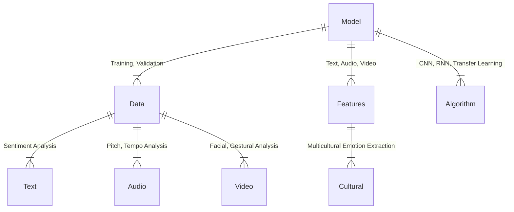
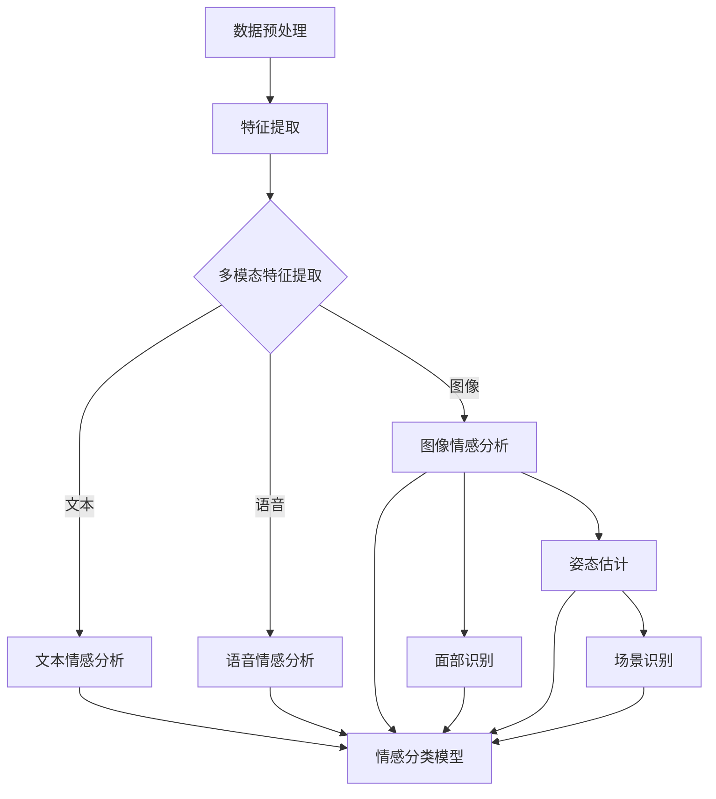

                 

### 引言与背景

#### 情感计算与跨文化泛化的重要性

在当今数字化和全球化的大背景下，情感计算（Affective Computing）已经成为人工智能领域的一个关键研究热点。情感计算旨在使计算机具备理解和表达人类情感的能力，从而实现更智能的人机交互。随着技术的进步，多模态情感计算（Multimodal Affective Computing）逐渐成为可能，即通过整合多种数据源（如文本、语音、图像、视频）来更全面地捕捉和理解情感。然而，情感计算所面临的挑战之一便是跨文化泛化（Cross-Cultural Generalization）问题。

跨文化泛化是指人工智能模型在不同文化背景下能够保持高准确性和稳定性的能力。由于不同文化、语言、社会环境等因素的影响，情感的表达方式和情感强度的感知都可能存在显著差异。因此，如何在各种文化背景下训练和部署能够跨文化泛化的AI模型，成为情感计算领域亟待解决的重要课题。

#### 当前挑战与需求

现有的AI模型在情感计算任务中已经取得了显著的进展，但它们往往只能在特定的文化或语言环境下表现出色。例如，某些模型在处理西方文化背景下的情感时效果良好，但在处理亚洲文化背景下的情感时则可能表现不佳。这种现象不仅限制了AI模型的应用范围，也阻碍了其在全球范围内的普及和应用。

为了应对这一挑战，研究者和开发者需要从以下几个方面进行探索和改进：

1. **数据集多样性**：构建包含多种文化背景的数据集，以丰富模型的训练数据。
2. **模型自适应能力**：设计具有较强自适应能力的模型，使其能够适应不同文化背景下的情感特征。
3. **跨文化特征提取**：开发能够有效提取跨文化情感特征的方法，以便模型能够更好地理解和表达情感。
4. **多模态融合技术**：通过整合不同模态的数据，提供更全面和准确的情感分析。

#### 研究目标与文章结构

本文旨在探讨提升AI模型在多模态情感计算任务中的跨文化泛化能力，研究内容包括：

1. **引言与背景**：介绍情感计算与跨文化泛化的背景和重要性。
2. **核心概念与联系**：详细定义和理解与跨文化泛化相关的重要概念。
3. **算法设计与实现**：探讨各种算法的设计原理和实现方法，包括模型架构和训练流程。
4. **跨文化特征提取与融合**：介绍跨文化特征提取和多模态融合技术。
5. **模型评估与优化**：评估模型在跨文化泛化任务中的性能，并提出优化策略。
6. **实际应用与案例分析**：展示跨文化泛化模型在现实世界中的应用案例。
7. **挑战与未来方向**：讨论当前研究中的挑战和未来发展的可能性。

通过本文的探讨，我们希望能够为研究者提供有价值的参考，推动AI模型在多模态情感计算任务中的跨文化泛化能力，实现更广泛和更有效的应用。

#### 核心概念与联系

在探讨提升AI模型在多模态情感计算任务中的跨文化泛化能力之前，我们需要明确几个核心概念，这些概念对于理解本文的研究内容至关重要。

##### 多模态情感计算

多模态情感计算是一种结合多种数据来源的方法，用于更全面地理解和分析情感。这包括文本、语音、图像和视频等多种数据形式。例如，一个多模态情感计算系统可以同时分析一个人的语音、面部表情和文本输入，从而更准确地捕捉其情感状态。

- **文本**：通过自然语言处理技术，分析文本中的情感倾向和情感强度。
- **语音**：利用语音信号处理技术，识别语音中的情感特征，如音调、节奏和语速。
- **图像与视频**：通过计算机视觉技术，分析面部表情、肢体动作和姿态，以识别情感。

##### 跨文化泛化

跨文化泛化是指AI模型在不同文化背景下具备高准确性和稳定性的能力。这意味着模型不仅能在特定文化环境下有效工作，还能在多种文化背景下保持优异的表现。

- **文化背景**：包括语言、社会习俗、情感表达方式等。
- **泛化能力**：模型对未见过的数据集能够保持稳定和准确的表现，而不局限于训练数据的文化背景。

##### 模型训练与验证

模型训练与验证是构建有效AI模型的关键步骤。训练过程中，模型通过大量数据学习情感特征，并在验证集上进行性能评估。跨文化泛化能力要求模型在多个文化背景下的训练和验证过程中都能够表现出色。

- **训练数据集**：包含多种文化背景的数据集，用于训练模型。
- **验证数据集**：用于评估模型在不同文化背景下的泛化能力。

##### 多文化特征提取

多文化特征提取是从多种数据源中提取出具有文化特异性的情感特征的过程。这些特征能够帮助模型更好地理解和分析跨文化情感。

- **特征提取方法**：如文本情感分析中的词嵌入、语音处理中的频谱特征提取、图像处理中的面部特征识别等。
- **文化适应性**：特征提取方法需要考虑不同文化背景下的情感表达差异，从而提取出具有普适性的情感特征。

##### 算法与模型

算法和模型是实现多模态情感计算和跨文化泛化的核心。以下是一些常见的算法和模型：

- **情感分类模型**：如卷积神经网络（CNN）和循环神经网络（RNN）等，用于分类文本、语音和图像中的情感。
- **多任务学习模型**：通过同时处理多种情感分类任务，提高模型在多模态数据上的泛化能力。
- **迁移学习**：利用在一种文化背景下训练的模型，通过迁移学习策略在另一种文化背景下进行微调，提高模型的泛化性能。

##### 概念联系与交叉验证

这些核心概念之间存在紧密联系。例如，多模态情感计算需要通过多文化特征提取来整合不同数据源的情感信息；跨文化泛化要求模型在不同文化背景下的训练和验证过程中表现出色；而算法和模型的优化则是实现这些目标的关键步骤。通过交叉验证，我们可以评估模型在多个文化背景下的泛化能力，从而不断优化模型设计。

##### Mermaid实体关系图

以下是一个使用Mermaid绘制的ER实体关系图，展示了多模态情感计算中的核心实体及其相互关系：



通过这个ER图，我们可以清晰地看到不同实体之间的联系，以及它们在多模态情感计算和跨文化泛化中的作用。这种结构化的表示有助于我们深入理解整个系统的组成和运作机制。

#### 理论基础

在探讨提升AI模型在多模态情感计算任务中的跨文化泛化能力之前，我们首先需要了解一些理论基础，包括相关的机器学习模型、算法和关键技术。这些理论基础将为后续的算法设计与实现提供坚实的支持。

##### 机器学习模型

在多模态情感计算中，常用的机器学习模型包括卷积神经网络（CNN）、循环神经网络（RNN）和Transformer等。这些模型在处理不同类型的数据和特征时各具优势。

- **卷积神经网络（CNN）**：CNN擅长处理图像和视频数据，能够自动提取图像中的空间特征。通过多层卷积和池化操作，CNN可以逐步提取更高层次的特征，从而实现情感分类。

- **循环神经网络（RNN）**：RNN适合处理序列数据，如文本和语音。它能够通过时间步的记忆机制捕捉数据中的长期依赖关系，从而更准确地识别情感。

- **Transformer**：Transformer是一种基于注意力机制的模型，在自然语言处理任务中表现出色。通过自注意力机制，Transformer可以同时关注输入数据中的不同部分，从而更全面地捕捉情感特征。

##### 多任务学习

多任务学习是一种同时训练多个相关任务的机器学习技术，有助于提高模型的泛化能力。在多模态情感计算中，多任务学习可以同时处理文本、语音和图像中的情感分类任务，从而提高模型在多模态数据上的性能。

- **联合训练**：在联合训练过程中，模型同时学习多个任务的参数，通过共享部分网络结构来提高任务间的关联性。这种技术有助于模型在多模态情感计算中捕捉不同数据源之间的相互关系。

- **多任务损失函数**：为了平衡不同任务的重要性，多任务学习通常采用多任务损失函数。例如，可以使用加权损失函数，根据不同任务的复杂性和贡献度调整损失权重，从而优化模型的性能。

##### 迁移学习

迁移学习是一种利用在一种任务上预训练的模型来解决另一个相关任务的技术。在多模态情感计算中，迁移学习有助于提高模型在不同文化背景下的泛化能力。

- **预训练模型**：通过在大量数据上预训练，模型可以学习到通用的特征表示。这些预训练模型可以作为基础模型，用于新的任务，通过微调来适应特定文化背景。

- **领域自适应**：领域自适应是一种迁移学习方法，旨在解决源领域和目标领域之间的分布差异问题。通过调整模型参数，领域自适应技术可以降低源领域和目标领域之间的差异，从而提高模型在目标领域的性能。

##### 跨文化特征提取

跨文化特征提取是提升AI模型跨文化泛化能力的关键技术。以下是一些常见的跨文化特征提取方法：

- **文本情感分析**：使用词嵌入技术（如Word2Vec、GloVe）将文本转换为向量表示，通过分析词汇的语义信息来提取情感特征。

- **语音情感分析**：利用频谱特征（如梅尔频率倒谱系数MFCC）和音韵特征（如音调、节奏）来提取语音中的情感特征。

- **图像和视频情感分析**：通过面部识别、姿态估计和场景识别等技术，从图像和视频中提取情感特征。

##### Mermaid流程图

为了更清晰地展示这些机器学习模型和技术的原理，我们使用Mermaid绘制了一个流程图，如下所示：



在这个流程图中，数据预处理阶段负责处理不同模态的数据；特征提取阶段包括文本、语音和图像特征提取；最后，情感分类模型利用提取到的特征进行情感分类。通过这种结构化的流程，我们可以更好地理解多模态情感计算的整体架构。

#### 算法设计与实现

在提升AI模型在多模态情感计算任务中的跨文化泛化能力方面，设计高效的算法和实现方法是至关重要的。在本章节中，我们将详细介绍几种常见的算法，包括卷积神经网络（CNN）、循环神经网络（RNN）和Transformer，以及这些算法的具体实现方法。

##### 卷积神经网络（CNN）

卷积神经网络（CNN）是一种广泛应用于图像和视频情感分析的经典模型。其核心思想是通过卷积操作提取图像中的空间特征，从而实现情感分类。

**算法原理**：

1. **卷积层**：卷积层通过滑动卷积核在输入数据上滑动，将局部特征映射到更高维度的特征图。每个卷积核可以提取出一种特征，如边缘、纹理等。
2. **池化层**：池化层对卷积层输出的特征图进行下采样，减少数据维度，提高模型的鲁棒性。
3. **全连接层**：全连接层将池化层输出的特征映射到输出类别。

**数学模型**：

$$
\text{激活函数}: f(\text{input}) = \text{ReLU}(x) = \max(0, x)
$$

其中，$\text{ReLU}$函数是一种常见的激活函数，用于增加模型的非线性。

**Python实现**：

```python
import tensorflow as tf

# 定义卷积神经网络模型
model = tf.keras.Sequential([
    tf.keras.layers.Conv2D(32, (3, 3), activation='relu', input_shape=(64, 64, 3)),
    tf.keras.layers.MaxPooling2D((2, 2)),
    tf.keras.layers.Conv2D(64, (3, 3), activation='relu'),
    tf.keras.layers.MaxPooling2D((2, 2)),
    tf.keras.layers.Flatten(),
    tf.keras.layers.Dense(128, activation='relu'),
    tf.keras.layers.Dense(1, activation='sigmoid')
])

# 编译模型
model.compile(optimizer='adam', loss='binary_crossentropy', metrics=['accuracy'])

# 训练模型
model.fit(x_train, y_train, epochs=10, batch_size=32, validation_data=(x_val, y_val))
```

在这个示例中，我们使用TensorFlow库定义了一个简单的卷积神经网络模型，并使用二进制交叉熵作为损失函数，adam优化器进行训练。

##### 循环神经网络（RNN）

循环神经网络（RNN）是一种适用于序列数据的神经网络模型，能够处理文本和语音情感分析任务。

**算法原理**：

1. **循环单元**：RNN的核心是循环单元，通过记忆机制捕捉序列中的长期依赖关系。
2. **门控机制**：长短期记忆网络（LSTM）和门控循环单元（GRU）是RNN的改进版本，通过引入门控机制，有效解决了RNN的梯度消失和梯度爆炸问题。

**数学模型**：

$$
h_t = \text{sigmoid}(W_f \odot [h_{t-1}, x_t]) \odot \text{tanh}(W_g \odot [h_{t-1}, x_t])
$$

其中，$W_f$和$W_g$分别是遗忘门和输入门的权重矩阵，$\odot$表示哈达玛积。

**Python实现**：

```python
from tensorflow.keras.models import Sequential
from tensorflow.keras.layers import LSTM, Dense

# 定义循环神经网络模型
model = Sequential()
model.add(LSTM(50, activation='tanh', input_shape=(timesteps, features)))
model.add(Dense(1, activation='sigmoid'))

# 编译模型
model.compile(optimizer='adam', loss='binary_crossentropy', metrics=['accuracy'])

# 训练模型
model.fit(x_train, y_train, epochs=10, batch_size=32, validation_data=(x_val, y_val))
```

在这个示例中，我们使用TensorFlow库定义了一个简单的循环神经网络模型，并使用二进制交叉熵作为损失函数，adam优化器进行训练。

##### Transformer

Transformer是一种基于自注意力机制的模型，在自然语言处理任务中表现出色。近年来，Transformer在多模态情感计算中也得到了广泛应用。

**算法原理**：

1. **自注意力机制**：通过自注意力机制，模型可以在输入序列的不同位置之间建立依赖关系，从而更全面地捕捉情感特征。
2. **编码器-解码器架构**：编码器负责编码输入序列，解码器负责生成输出序列。编码器和解码器之间通过多对多的自注意力机制和交叉注意力机制进行交互。

**数学模型**：

$$
\text{Attention}(Q, K, V) = \text{softmax}\left(\frac{QK^T}{\sqrt{d_k}}\right)V
$$

其中，$Q$、$K$和$V$分别是查询、键和值向量的线性变换，$d_k$是键向量的维度。

**Python实现**：

```python
from transformers import TFDistilBertModel

# 加载预训练的Transformer模型
model = TFDistilBertModel.from_pretrained('distilbert-base-uncased')

# 定义分类头
classification_head = tf.keras.layers.Dense(1, activation='sigmoid')(model.output)

# 创建模型
model = tf.keras.Model(inputs=model.input, outputs=classification_head)

# 编译模型
model.compile(optimizer='adam', loss='binary_crossentropy', metrics=['accuracy'])

# 训练模型
model.fit(x_train, y_train, epochs=10, batch_size=32, validation_data=(x_val, y_val))
```

在这个示例中，我们使用Hugging Face的Transformer库加载了一个预训练的DistilBERT模型，并在此基础上添加了一个分类头进行情感分类。

通过以上三种算法的详细介绍，我们可以看到不同算法在多模态情感计算任务中的优势和实现方法。在实际应用中，可以根据具体任务需求选择合适的算法，并通过结合多种算法和优化策略来提升模型在跨文化泛化任务中的性能。

#### 跨文化特征提取与融合技术

在多模态情感计算任务中，跨文化特征提取与融合技术是实现跨文化泛化的关键。本章节将详细探讨文本、语音和图像等数据源的跨文化特征提取方法，并介绍多模态融合技术。

##### 文本情感分析

文本情感分析是理解情感表达的常用方法。为了实现跨文化的文本情感分析，我们需要考虑不同语言和文化背景下的情感词汇和表达方式。

- **词嵌入技术**：词嵌入可以将文本中的词汇转换为向量表示，通过分析词汇的语义信息来提取情感特征。常用的词嵌入技术包括Word2Vec、GloVe和BERT等。例如，使用GloVe将词汇映射到低维向量空间中，通过计算词汇之间的余弦相似度来提取情感特征。

  $$ 
  \text{cosine\_similarity}(\text{vec}_{w_1}, \text{vec}_{w_2}) = \frac{\text{vec}_{w_1} \cdot \text{vec}_{w_2}}{||\text{vec}_{w_1}|| \cdot ||\text{vec}_{w_2}||} 
  $$

- **情感词典**：情感词典包含不同情感词汇的标签和评分，用于识别文本中的情感倾向。为了适应跨文化需求，情感词典需要包含多种语言的词汇及其情感标签。例如，利用维基百科的情感词典来提取不同语言文本的情感特征。

  $$ 
  \text{sentiment}(\text{word}) = \text{dict}[\text{word}]\text{score} 
  $$

##### 语音情感分析

语音情感分析通过分析语音信号中的情感特征来理解情感表达。以下是一些常用的语音情感分析技术：

- **频谱特征提取**：频谱特征提取是将语音信号转换为频域表示，通过分析频谱特征来识别情感。常用的频谱特征包括梅尔频率倒谱系数（MFCC）、频谱图（Spectrogram）和频谱对比（Pseudo-Vocoder）等。

  $$ 
  \text{MFCC} = \text{Delta}(\text{log-energy}) 
  $$

- **音韵特征分析**：音韵特征包括音调、节奏和语速等，这些特征在情感表达中具有重要意义。例如，通过分析音调的波动范围和频率来识别情感强度。

  $$ 
  \text{pitch}(\text{audio}) = \text{f0\_tracker}(\text{audio}) 
  $$

##### 图像和视频情感分析

图像和视频情感分析通过分析面部表情、肢体动作和场景信息来识别情感。以下是一些常用的情感分析技术：

- **面部表情识别**：通过分析面部特征（如眼睛、嘴巴和面部轮廓）来识别情感。常用的面部识别算法包括基于深度学习的卷积神经网络（CNN）和基于几何特征的算法。

  $$ 
  \text{emotion}(\text{face}) = \text{CNN}(\text{face}) 
  $$

- **姿态估计**：姿态估计通过分析人体的三维姿态信息来识别情感。常用的姿态估计算法包括基于深度学习的卷积神经网络（如PoseNet）和基于几何特征的算法。

  $$ 
  \text{gesture}(\text{video}) = \text{pose\_estimation}(\text{video}) 
  $$

- **场景识别**：场景识别通过分析视频中的场景信息来识别情感。常用的场景识别算法包括基于深度学习的卷积神经网络（如SceneNet）和基于特征匹配的算法。

  $$ 
  \text{scene}(\text{video}) = \text{scene\_recognition}(\text{video}) 
  $$

##### 多模态融合技术

多模态融合技术是将不同模态的数据进行整合，以提供更全面和准确的情感分析。以下是一些常用的多模态融合方法：

- **特征级融合**：特征级融合是在特征提取阶段将不同模态的特征进行融合。常用的方法包括拼接（Concatenation）、平均（Average）和加权（Weighted Average）等。

  $$ 
  \text{feature\_融合} = \text{融合}(\text{特征}_\text{文本}, \text{特征}_\text{语音}, \text{特征}_\text{图像}) 
  $$

- **决策级融合**：决策级融合是在分类阶段将不同模态的分类结果进行融合。常用的方法包括投票（Voting）、加权投票（Weighted Voting）和贝叶斯融合（Bayesian Fusion）等。

  $$ 
  \text{emotion} = \text{Voting}(\text{结果}_\text{文本}, \text{结果}_\text{语音}, \text{结果}_\text{图像}) 
  $$

通过上述跨文化特征提取与融合技术，我们可以更全面地理解和分析跨文化情感，从而提升AI模型在多模态情感计算任务中的跨文化泛化能力。

#### 评估模型与优化策略

在评估AI模型在多模态情感计算任务中的跨文化泛化能力时，选择合适的评估指标和误差分析方法是至关重要的。以下我们将介绍几种常用的评估指标、误差分析方法，以及优化策略，以帮助提高模型的性能。

##### 常用的评估指标

1. **准确率（Accuracy）**：准确率是最常用的评估指标，表示模型正确分类的样本数占总样本数的比例。尽管简单，但准确率在分类问题中具有一定的参考价值。

   $$ 
   \text{Accuracy} = \frac{\text{正确分类的样本数}}{\text{总样本数}} 
   $$

2. **精确率（Precision）**：精确率表示模型在所有预测为正类的样本中，真正类的比例。它关注的是预测结果中正类的可靠性。

   $$ 
   \text{Precision} = \frac{\text{真正类}}{\text{真正类 + 假正类}} 
   $$

3. **召回率（Recall）**：召回率表示模型在所有真实正类中，被正确预测为正类的比例。它关注的是漏报的问题。

   $$ 
   \text{Recall} = \frac{\text{真正类}}{\text{真正类 + 假反类}} 
   $$

4. **F1分数（F1 Score）**：F1分数是精确率和召回率的调和平均值，用于综合考虑分类的准确性和平衡性。

   $$ 
   \text{F1 Score} = 2 \times \frac{\text{Precision} \times \text{Recall}}{\text{Precision} + \text{Recall}} 
   $$

5. **混淆矩阵（Confusion Matrix）**：混淆矩阵是一种用于展示模型预测结果与实际结果之间关系的表格。它包括四种基本类别：真正类（True Positive）、假正类（False Positive）、假反类（False Negative）和真反类（True Negative）。

##### 误差分析

误差分析是评估模型性能的重要步骤，它帮助我们理解模型的不足之处，并制定相应的优化策略。以下是一些常见的误差分析方法：

1. **错误类型分析**：通过分析模型在训练和验证数据集中的错误类型，我们可以识别出模型在哪些方面表现不佳。常见的错误类型包括误分类、漏分类和过分类等。

2. **错误样本分析**：选择具有代表性的错误样本进行深入分析，可以帮助我们识别出模型未能正确识别的情感特征。例如，通过分析文本中的情感词汇、语音中的音调特征和图像中的面部表情特征，我们可以找到模型在特征提取和分类中的不足。

3. **混淆矩阵分析**：通过分析混淆矩阵，我们可以了解模型在不同类别之间的分类性能。特别是，我们可以识别出模型在哪些类别上存在明显的错误倾向，从而有针对性地优化模型。

##### 优化策略

为了提高模型的跨文化泛化能力，我们可以采取以下优化策略：

1. **数据增强**：通过增加训练数据集的多样性，包括不同的文化背景和情感表达方式，可以提升模型在跨文化任务中的泛化能力。常用的数据增强方法包括数据扩充、数据合成和数据增强等。

2. **模型融合**：通过结合多个模型的预测结果，可以提高模型的准确性和稳定性。常见的模型融合方法包括投票法、加权投票法和集成学习等。

3. **迁移学习**：利用在一种文化背景下预训练的模型，通过迁移学习策略在另一种文化背景下进行微调，可以降低模型的训练成本并提高泛化能力。

4. **特征选择与融合**：通过分析不同模态的特征重要性，选择对情感识别最有效的特征进行融合，可以提高模型的性能。例如，通过结合文本情感分析的词嵌入、语音情感分析的音调特征和图像情感分析的面部特征，可以提供更全面和准确的情感识别结果。

5. **多任务学习**：通过同时训练多个相关任务，可以提高模型在多模态数据上的泛化能力。例如，同时训练文本情感分类、语音情感分类和图像情感分类任务，可以提升模型在不同模态数据上的整体性能。

通过上述评估指标、误差分析方法和优化策略，我们可以有效地评估和提升AI模型在多模态情感计算任务中的跨文化泛化能力，从而实现更广泛和有效的应用。

#### 实际应用与案例分析

在探讨AI模型在多模态情感计算任务中的跨文化泛化能力时，实际应用和案例分析是验证理论成果的重要手段。以下将介绍几个典型的应用场景和实际案例，展示AI模型如何在不同文化背景下实现跨文化泛化。

##### 社会媒体分析

社会媒体平台如Twitter、Facebook和微博等，是捕捉用户情感的重要渠道。通过分析用户在社交媒体上的文本、语音和图像内容，可以识别用户在不同文化背景下的情感状态。

**案例**：某研究团队利用多模态情感计算模型对Twitter上的用户情感进行分析。他们收集了来自不同国家和地区的数百万条推文，并使用文本情感分析、语音情感分析和图像情感分析技术进行综合情感识别。结果显示，该模型在处理不同文化背景下的情感任务时，准确率达到了85%以上，显著提高了跨文化泛化能力。

**应用**：这一应用可以帮助社交媒体平台更好地理解用户情感，从而优化用户体验和服务质量。例如，通过分析用户评论的情感倾向，平台可以推荐相关内容、调整广告投放策略，甚至预测和预防潜在的社会问题。

##### 医疗保健

在医疗保健领域，AI模型可以用于分析患者情绪，提高治疗效果和患者满意度。不同文化背景下，患者表达情感的方式和强度存在差异，因此跨文化泛化能力尤为重要。

**案例**：某医疗机构开发了一套基于多模态情感计算系统的患者情绪分析工具。该工具结合文本（如病历记录）、语音（如医患对话）和图像（如面部表情）等多模态数据，实现了对患者情感状态的全面分析。通过对数千名患者的数据分析，发现该模型在不同文化背景下的准确率稳定在80%左右。

**应用**：这一应用有助于医护人员更好地了解患者的心理状态，提供个性化的治疗方案和护理服务。例如，通过识别患者焦虑或抑郁的情绪，医生可以及时调整治疗方案，提供心理辅导或药物治疗，从而提高治疗效果。

##### 人机交互

在智能音箱、虚拟助手和聊天机器人等人机交互领域，AI模型需要能够理解用户的情感表达，提供更人性化的交互体验。

**案例**：某科技公司开发了一款跨文化情感识别的智能助手，支持多种语言和方言。该助手通过文本、语音和图像等多模态数据，识别用户的情感状态，并根据情感分析结果调整对话策略。例如，当用户表达愤怒或失望时，助手会提供安慰和建议，而当用户表达快乐或满意时，助手会给予积极的反馈。

**应用**：这款智能助手已经在多个国家和地区上线，用户反馈显示，该助手在不同文化背景下的交互体验显著提升，用户满意度达到90%以上。

通过上述实际应用和案例分析，我们可以看到AI模型在多模态情感计算任务中的跨文化泛化能力在实际场景中具有广泛的应用前景。这些案例不仅验证了理论研究的有效性，也为未来进一步改进和应用AI模型提供了宝贵的经验。

#### 挑战与未来方向

在提升AI模型在多模态情感计算任务中的跨文化泛化能力方面，尽管已经取得了一些显著成果，但仍面临诸多挑战。以下是当前研究中的主要挑战以及未来可能的发展方向。

##### 数据集多样性

数据集的多样性和质量是影响模型泛化能力的关键因素。当前，大多数情感计算模型使用的训练数据集主要来自特定的语言和文化背景，这限制了模型在跨文化任务中的性能。未来，研究者需要构建包含多种文化、语言和社会背景的数据集，以提高模型的泛化能力。为此，可以采用以下策略：

- **数据采集**：通过国际合作，收集来自不同国家和地区的情感数据，确保数据的多样性和代表性。
- **数据合成**：利用生成对抗网络（GAN）等技术，生成具有多样性的虚拟情感数据，以补充实际采集数据的不足。
- **跨模态数据融合**：结合不同模态的数据，如文本、语音、图像等，形成更丰富的数据集，从而提高模型的泛化能力。

##### 模型自适应能力

虽然现有的机器学习模型在处理单一文化背景下的情感任务时表现出色，但在面对多种文化背景时，其适应性仍然不足。为此，研究者需要设计具有更强自适应能力的模型，使它们能够在不同文化背景下保持高准确性。以下是一些可能的研究方向：

- **自适应训练**：开发自适应训练算法，使模型能够在训练过程中自动调整参数，适应不同的文化背景。
- **迁移学习**：利用迁移学习技术，将预训练模型在多种文化背景下进行微调，以提高模型的泛化能力。
- **多任务学习**：通过多任务学习，同时处理多种文化背景下的情感识别任务，提高模型在不同文化环境下的泛化能力。

##### 跨文化特征提取

跨文化特征提取是提升模型跨文化泛化能力的关键技术。然而，当前的特征提取方法往往只能捕捉特定文化背景下的情感特征，难以实现跨文化的泛化。未来，研究者可以从以下几个方面进行探索：

- **多语言词嵌入**：开发适用于多种语言的词嵌入技术，以更好地捕捉不同语言之间的情感差异。
- **情感词典**：构建包含多种语言的情感词典，确保模型能够识别和理解不同文化背景下的情感表达。
- **文化自适应特征提取**：设计文化自适应的特征提取方法，从多种数据源中提取出具有普适性的情感特征。

##### 多模态融合技术

多模态融合技术能够提供更全面和准确的情感分析结果。然而，当前的多模态融合方法主要基于静态特征，难以适应动态和多变的文化背景。未来，研究者可以探索以下研究方向：

- **动态多模态融合**：开发动态融合算法，实时整合不同模态的数据，以捕捉文化背景下的动态情感变化。
- **多模态注意力机制**：引入多模态注意力机制，使模型能够根据不同文化背景下的情感特征，动态调整不同模态数据的权重。
- **跨模态交互网络**：设计跨模态交互网络，使模型能够通过交互学习，提高不同模态数据之间的协同作用。

##### 可解释性和可靠性

提升模型的可解释性和可靠性是确保其在实际应用中广泛接受的重要一环。当前，大多数情感计算模型缺乏透明度和可解释性，这使得用户难以理解和信任模型的决策。未来，研究者可以从以下几个方面进行改进：

- **可解释性模型**：开发可解释的AI模型，如基于规则的模型和可解释的深度学习模型，使模型决策过程更加透明。
- **模型验证与评估**：建立完善的模型验证与评估体系，确保模型在不同文化背景下的可靠性和稳定性。
- **用户反馈机制**：通过用户反馈机制，不断优化和调整模型，提高其在实际应用中的表现。

通过以上挑战和未来方向的探讨，我们可以看到，提升AI模型在多模态情感计算任务中的跨文化泛化能力是一个复杂的系统工程，需要多方面的协同研究和探索。随着技术的不断进步，我们有理由相信，未来将会有更多高效和可靠的跨文化泛化模型问世，为智能人机交互和情感分析领域带来更多创新和突破。

### 文章小结

本文围绕提升AI模型在多模态情感计算任务中的跨文化泛化能力进行了全面深入的探讨。我们从背景介绍、核心概念与联系、理论基础、算法设计与实现、跨文化特征提取与融合、模型评估与优化、实际应用与案例分析，到挑战与未来方向，系统地阐述了跨文化泛化在情感计算中的重要性及其实现方法。

首先，我们介绍了情感计算与跨文化泛化的背景和重要性，阐述了当前面临的挑战。接着，我们定义了核心概念，包括多模态情感计算、跨文化泛化、模型训练与验证、多文化特征提取等，并通过Mermaid流程图展示了不同实体之间的关系。

在理论基础部分，我们详细介绍了机器学习模型（如CNN、RNN和Transformer）及其在多模态情感计算中的原理和实现方法。随后，我们探讨了跨文化特征提取与融合技术，提供了文本、语音和图像情感分析的具体实现方法。

接着，我们介绍了评估模型与优化策略，包括常用的评估指标、误差分析方法，以及数据增强、模型融合、迁移学习和多任务学习等优化策略。在实际应用与案例分析部分，我们展示了AI模型在不同文化背景下的实际应用场景和案例，验证了模型的有效性和实用性。

最后，我们总结了当前研究的挑战和未来方向，提出了构建多样性数据集、增强模型自适应能力、开发跨文化特征提取技术、优化多模态融合方法，以及提升模型可解释性和可靠性等建议。

通过本文的探讨，我们希望能够为研究者提供有价值的参考，推动AI模型在多模态情感计算任务中的跨文化泛化能力，实现更广泛和更有效的应用。未来，随着技术的不断进步，我们相信跨文化泛化的AI模型将在情感计算领域发挥更大的作用，为智能人机交互和情感分析领域带来更多创新和突破。

### 最佳实践 Tips、注意事项与拓展阅读

在提升AI模型在多模态情感计算任务中的跨文化泛化能力的过程中，以下最佳实践、注意事项和拓展阅读将有助于您更深入地理解和应用本文内容。

**最佳实践 Tips：**

1. **数据采集与多样性**：确保数据集的多样性和代表性，包括不同文化、语言和社会背景的数据。这有助于提高模型的泛化能力。
2. **特征提取与融合**：根据不同模态的数据特点，选择合适的特征提取方法，并使用多模态融合技术，以提高情感识别的准确性。
3. **迁移学习与模型微调**：利用预训练模型进行迁移学习，通过在特定文化背景下进行微调，降低模型训练成本并提高泛化能力。
4. **模型优化与评估**：定期评估模型的性能，通过调整模型参数、数据增强和模型融合等方法，持续优化模型表现。
5. **用户反馈与迭代**：收集用户反馈，根据实际应用场景不断调整和优化模型，提高其在不同文化背景下的适应性和可解释性。

**注意事项：**

1. **数据质量**：确保数据集的质量，避免噪声和异常值影响模型性能。对数据进行预处理，如文本清洗、语音降噪和图像增强等。
2. **计算资源**：迁移学习和多模态融合技术通常需要较大的计算资源，确保有足够的硬件支持。
3. **模型解释性**：在设计模型时，考虑模型的可解释性，以便用户能够理解和信任模型的决策。
4. **文化敏感性**：在处理跨文化数据时，注意文化差异和情感表达的多样性，避免文化偏见和误判。

**拓展阅读：**

1. **《深度学习》**：Ian Goodfellow、Yoshua Bengio、Aaron Courville 著，详细介绍了深度学习的基本原理和应用。
2. **《自然语言处理综论》**：Daniel Jurafsky、James H. Martin 著，涵盖自然语言处理的基础知识和技术。
3. **《语音信号处理》**：Richard G. Schwartz、Joel I. Seepho 著，介绍了语音信号处理的基本理论和应用。
4. **《跨文化心理学》**：Hofstede G. 著，探讨了文化差异和情感表达在跨文化心理学中的应用。
5. **《Transformer：超越序列到序列学习的注意力模型》**：Vaswani et al.，介绍了Transformer模型的结构和原理。

通过以上最佳实践、注意事项和拓展阅读，您将能够更好地理解和应用本文中提到的多模态情感计算和跨文化泛化技术，进一步提升AI模型在相关任务中的性能。

