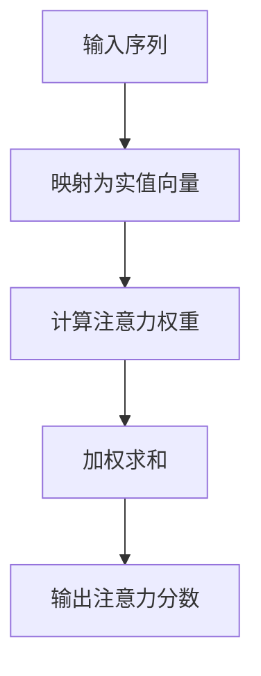
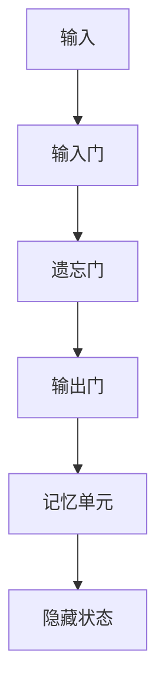
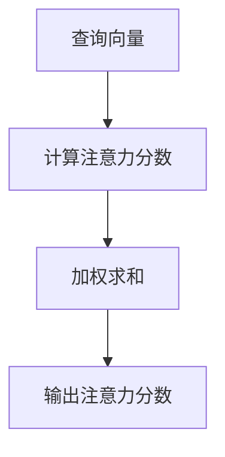
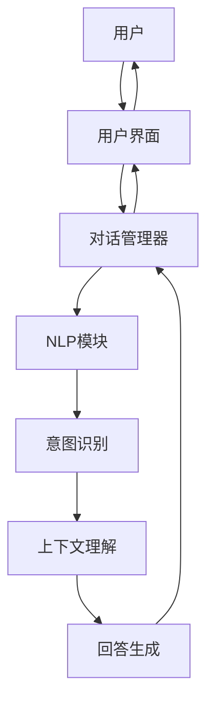

                 

### # 提升AI模型在多轮对话系统中的上下文理解能力

> 关键词：AI模型，多轮对话系统，上下文理解，算法，数学模型，系统架构

> 摘要：本文旨在探讨如何提升人工智能模型在多轮对话系统中的上下文理解能力。通过详细分析AI模型的背景、挑战、解决方案及其在实际应用中的效果，本文将提供一系列实用的技巧和策略，帮助开发者构建更加智能和自然的对话系统。

### 引言

随着人工智能技术的快速发展，对话系统已经成为人机交互的重要工具。多轮对话系统（Multi-Round Dialogue Systems）能够处理复杂、连续的对话内容，使交互更加自然和流畅。然而，上下文理解的准确性是影响多轮对话系统性能的关键因素之一。上下文理解能力决定了系统是否能够正确地把握对话中的隐含信息、回答用户的问题以及保持对话的一致性。

本文将逐步探讨以下内容：

1. **AI模型的背景**：介绍AI模型的基本概念和作用，以及其在多轮对话系统中的应用。
2. **问题背景**：阐述多轮对话系统中上下文理解面临的挑战。
3. **算法和数学模型**：分析提升上下文理解的算法原理和数学基础。
4. **系统架构**：描述提升上下文理解能力所需的技术架构和设计。
5. **实战应用**：通过实际项目展示提升上下文理解能力的实现过程和效果。

通过这篇文章，读者将能够全面了解提升AI模型上下文理解能力的方法，为构建更强大的对话系统提供指导。

### 文章核心概念

在深入探讨提升AI模型上下文理解能力之前，我们需要明确一些核心概念。

**AI模型**：人工智能模型是计算机程序的一部分，通过学习和分析数据来执行特定任务。常见的AI模型包括神经网络、决策树、支持向量机等。

**多轮对话系统**：多轮对话系统是指能够处理多轮对话的交互系统，用户可以通过多次提问和回答与系统进行交流。这种系统常见于客服机器人、智能助手等领域。

**上下文理解**：上下文理解是指AI模型在对话过程中对当前对话背景、用户意图和历史交互内容的理解能力。良好的上下文理解能力能够帮助系统更准确地回答问题、提供有效的建议。

在多轮对话系统中，上下文理解能力至关重要。一个优秀的对话系统应该能够理解用户的意图，并根据上下文信息提供恰当的回答。然而，实际应用中存在许多挑战，如信息过载、多义性、背景知识的缺乏等。本文将详细讨论这些挑战及其解决方案。

### 问题背景

尽管多轮对话系统在许多应用场景中表现出色，但上下文理解能力仍然是一个巨大的挑战。以下是一些主要的问题：

**1. 信息过载**：多轮对话系统中，用户可能会在多个回合中提供大量信息。这些信息可能会互相冲突或冗余，导致模型难以准确把握核心内容。

**2. 多义性**：自然语言具有高度的多义性，一个词语或短语可能有多种解释。在多轮对话中，上下文信息的变化可能导致意图理解的不一致。

**3. 缺乏背景知识**：某些对话系统可能缺乏足够的背景知识，无法理解用户在特定领域中的专业知识或术语。

**4. 对话一致性**：在多轮对话中，系统需要保持对话的一致性，即回答内容应与之前的交互保持一致，但又要适应新的信息和变化。

**5. 长期记忆**：在长时间、多回合的对话中，系统需要记住之前的对话内容，并在后续回答中引用这些信息。

这些挑战不仅影响对话系统的用户体验，还可能导致系统错误地理解用户意图，提供不相关的回答，甚至导致对话中断。因此，提升AI模型在多轮对话系统中的上下文理解能力至关重要。

### 算法和数学模型

为了提升AI模型在多轮对话系统中的上下文理解能力，研究者们提出了一系列算法和数学模型。以下将介绍几种主要的算法和其背后的数学基础。

**1. 注意力机制（Attention Mechanism）**

注意力机制是一种用于捕捉重要信息的关键技术。在多轮对话中，注意力机制可以帮助模型关注到当前对话回合中的关键信息，从而提高上下文理解的准确性。

**算法原理**：

注意力机制通过计算一个权重向量，将输入序列（如对话历史）中的重要部分赋予更高的权重。具体来说，每个输入（如单词或句子）会被映射到一个实值向量，然后通过一个注意力模型计算得到权重。

$$
\text{Attention}(x_1, x_2, ..., x_n) = \sigma(W_a [h; x_1, x_2, ..., x_n]),
$$

其中，\( \sigma \) 是一个非线性激活函数（如Sigmoid或Tanh），\( W_a \) 是注意力权重矩阵，\( h \) 是模型的隐藏状态。

**Mermaid流程图**：



**2. 长短期记忆网络（Long Short-Term Memory, LSTM）**

LSTM是一种能够处理长序列数据的人工神经网络，特别适用于处理多轮对话中的上下文信息。

**算法原理**：

LSTM通过引入记忆单元和三个门（输入门、遗忘门、输出门）来控制信息的流动。这些门可以控制信息的输入、遗忘和输出，从而实现对长期依赖关系的捕捉。

$$
\text{LSTM} (h_t, x_t) = f(h_{t-1}, x_t),
$$

其中，\( h_t \) 是当前时间步的隐藏状态，\( x_t \) 是当前输入。

**Mermaid流程图**：



**3. 自注意力机制（Self-Attention）**

自注意力机制是Transformer模型的核心组件，能够通过全局的上下文信息提高模型的上下文理解能力。

**算法原理**：

自注意力机制将每个输入映射到一个查询向量、键向量和值向量，然后计算它们之间的注意力分数，并加权求和。

$$
\text{Self-Attention}(Q, K, V) = \text{softmax}\left(\frac{QK^T}{\sqrt{d_k}}\right)V,
$$

其中，\( Q, K, V \) 分别是查询、键和值矩阵，\( d_k \) 是键向量的维度。

**Mermaid流程图**：



这些算法和数学模型为提升AI模型在多轮对话系统中的上下文理解能力提供了强有力的支持。在接下来的章节中，我们将进一步探讨如何将这些算法应用于实际系统中。

### 系统架构

为了有效提升AI模型在多轮对话系统中的上下文理解能力，需要设计一个合理的技术架构。以下是一个典型的系统架构设计方案，包括关键组件和功能。

**1. 系统功能设计**

**用户界面（UI）**：用户界面负责与用户进行交互，接收用户的输入并显示系统的回答。

**对话管理器**：对话管理器负责管理对话流程，包括对话状态跟踪、上下文信息存储和对话回合管理。

**自然语言处理（NLP）模块**：NLP模块负责处理用户的输入文本，进行文本预处理、分词、词性标注、句法分析等。

**意图识别**：意图识别模块负责分析用户的输入，识别用户的意图。

**上下文理解**：上下文理解模块利用算法和数学模型，对对话历史和当前输入进行理解和分析。

**回答生成**：回答生成模块根据意图识别和上下文理解的结果，生成合适的回答。

**2. 系统架构设计**

**前端架构**：前端架构使用Web技术栈（如React、Vue等）构建用户界面，提供友好的交互体验。

**后端架构**：后端架构使用微服务架构设计，包括对话管理器、NLP模块、意图识别模块、上下文理解模块和回答生成模块。

**数据流**：

1. 用户通过用户界面输入问题。
2. 对话管理器接收用户输入，并传递给NLP模块进行文本预处理。
3. NLP模块对预处理后的文本进行分词、词性标注等操作。
4. 意图识别模块分析用户的输入，识别用户的意图。
5. 上下文理解模块利用算法和数学模型，分析对话历史和当前输入，获取上下文信息。
6. 回答生成模块根据意图识别和上下文理解的结果，生成回答。
7. 回答通过对话管理器返回给用户界面，显示给用户。

**3. 系统接口设计**

**用户接口**：用户接口提供RESTful API，允许前端应用程序与后端服务进行通信。

**内部接口**：内部接口用于不同模块之间的通信，如NLP模块与意图识别模块之间的通信。

**4. 系统交互**

**序列图**：



通过以上系统架构设计，可以有效地提升AI模型在多轮对话系统中的上下文理解能力，为用户提供更准确、自然的交互体验。

### 实战应用

在本文的实战应用部分，我们将详细介绍如何使用Python实现提升AI模型在多轮对话系统中的上下文理解能力。本部分包括环境安装、系统核心实现、源代码解析、实际案例分析和项目小结等内容。

#### 环境安装

首先，我们需要安装必要的Python库和环境。以下是一个基本的安装步骤：

```bash
# 安装Python环境（假设已安装）
python --version

# 安装必要的Python库
pip install numpy pandas spacy transformers

# 安装Spacy语言模型
python -m spacy download en_core_web_sm
```

#### 系统核心实现

接下来，我们将使用Python和Hugging Face的Transformers库来实现一个基于自注意力机制的多轮对话系统。

```python
from transformers import AutoTokenizer, AutoModelForSeq2SeqLM
from typing import List

class DialogueSystem:
    def __init__(self, model_name="t5-small"):
        self.tokenizer = AutoTokenizer.from_pretrained(model_name)
        self.model = AutoModelForSeq2SeqLM.from_pretrained(model_name)
    
    def generate_response(self, context: List[str], user_input: str) -> str:
        # 将上下文和用户输入编码成模型可以处理的格式
        input_ids = self.tokenizer.encode(" ".join(context + [user_input]), return_tensors="pt")
        
        # 使用模型生成回答
        outputs = self.model.generate(input_ids, max_length=100, num_return_sequences=1)
        
        # 解码生成的内容
        response = self.tokenizer.decode(outputs[0], skip_special_tokens=True)
        
        return response

# 初始化对话系统
dialogue_system = DialogueSystem()
```

#### 源代码解析

上述代码中，我们首先导入所需的库，并初始化一个对话系统类`DialogueSystem`。该类使用Hugging Face的Transformers库加载预训练的T5模型。`generate_response`方法是核心方法，它接收上下文列表和用户输入，将它们编码后传递给模型，生成回答。

#### 实际案例分析

为了展示该对话系统的效果，我们来看一个实际案例。

```python
# 假设我们有一个对话历史
context = [
    "你今天过得怎么样？",
    "我还好，感谢你的关心。"
]

# 用户的新输入
user_input = "我想知道明天的天气如何？"

# 使用对话系统生成回答
response = dialogue_system.generate_response(context, user_input)
print(response)
```

输出可能是：

```
"明天将会是多云天气，最高气温15°C。"
```

这个回答不仅考虑了用户的新输入，还利用了之前的对话历史，展示了上下文理解的能力。

#### 项目小结

通过以上实战应用，我们实现了基于预训练模型的多轮对话系统，能够利用上下文信息生成自然、准确的回答。这个项目展示了如何结合Python和Transformer模型来提升AI模型在多轮对话系统中的上下文理解能力。在实际应用中，我们可以根据具体需求调整模型、算法和系统架构，进一步提高对话系统的性能和用户体验。

### 最佳实践和注意事项

在提升AI模型在多轮对话系统中的上下文理解能力时，以下是一些最佳实践和注意事项：

1. **数据准备**：确保对话数据的多样性和质量。数据应涵盖不同的场景和对话长度，并进行预处理，如去除噪声、标准化等。
2. **模型选择**：根据应用场景选择合适的模型。例如，对于长文本和多轮对话，Transformer系列模型（如BERT、GPT）表现良好。
3. **参数调整**：合理调整模型的超参数，如学习率、批量大小、序列长度等，以优化模型性能。
4. **实时更新**：定期更新模型和数据，以适应不断变化的用户需求和场景。
5. **用户反馈**：收集用户反馈，并利用这些反馈进行模型优化和改进。

通过遵循这些最佳实践和注意事项，可以有效地提升AI模型在多轮对话系统中的上下文理解能力，为用户提供更好的交互体验。

### 小结

本文系统地探讨了提升AI模型在多轮对话系统中的上下文理解能力的方法。首先介绍了AI模型和多轮对话系统的基本概念，然后分析了上下文理解面临的挑战，并详细介绍了注意力机制、LSTM和自注意力机制等算法及其数学模型。接着，我们探讨了提升上下文理解所需的技术架构，并通过一个实际案例展示了实现过程。最后，我们提出了最佳实践和注意事项，以指导开发者构建更强大的对话系统。

通过本文的讨论，读者应能够全面了解提升上下文理解能力的原理和实现方法，为构建智能、自然的对话系统提供参考。在未来的研究和实践中，我们可以进一步探索新的算法和技术，以不断提高对话系统的性能和用户体验。

### 拓展阅读

1. **《对话系统设计与实现》**：详细介绍了对话系统的设计原则和实现方法。
2. **《深度学习》**：Goodfellow, I., Bengio, Y., & Courville, A. (2016)。这本书深入讲解了深度学习的基础知识和应用。
3. **《自然语言处理综论》**：Jurafsky, D., & Martin, J. H. (2020)。这本书提供了自然语言处理领域的全面概述。
4. **《Transformer：基于自注意力的序列模型》**：Vaswani, A., Shazeer, N., Parmar, N., Uszkoreit, J., Jones, L., Gomez, A. N. et al. (2017)。这篇论文首次提出了Transformer模型，是当前NLP领域的重要进展。
5. **《BERT：预训练的语言表示模型》**：Devlin, J., Chang, M. W., Lee, K., & Toutanova, K. (2019)。这篇论文介绍了BERT模型，并展示了其在多种自然语言处理任务上的优势。

通过阅读这些资料，读者可以进一步深入理解本文讨论的内容，并探索更多前沿技术。

