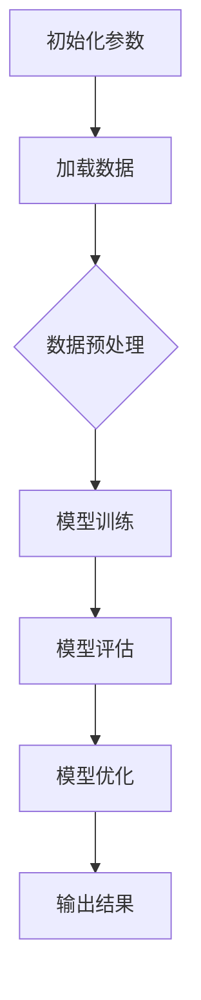
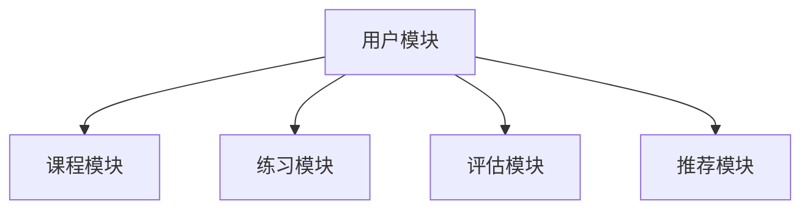
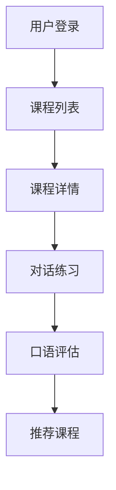

                 

# 提升AI模型在跨文化语言习得中的效率与准确性

关键词：跨文化语言习得、AI模型、深度学习、效率与准确性、算法原理、系统架构设计

摘要：随着全球化的推进，跨文化语言习得越来越受到重视。然而，传统的语言学习方式存在许多不足。本文将探讨如何利用AI模型，特别是基于深度学习技术的算法，提升跨文化语言习得的效率与准确性。通过详细分析算法原理、系统架构设计以及项目实战，本文旨在为AI在跨文化语言习得中的应用提供有力的理论支持和实践指导。

## 第一部分：背景介绍与核心概念

### 第1章：问题背景

随着全球化的发展，跨文化语言习得（Cross-Cultural Language Acquisition, CCLA）成为了一个重要的研究领域。然而，传统的语言学习方式往往存在以下问题：

1. **学习效率低下**：传统的语言学习方式依赖于教科书和课堂讲授，学习过程较为枯燥，缺乏互动性和个性化。
2. **语言环境不真实**：很多语言学习者无法接触到真实的生活场景和语言环境，导致学习效果不佳。
3. **学习者注意力分散**：传统学习方式容易使学习者的注意力分散，难以保持长时间的学习专注。

为了解决这些问题，人工智能（Artificial Intelligence, AI）模型，尤其是基于深度学习（Deep Learning, DL）技术的算法，被引入到跨文化语言习得领域。AI模型可以通过分析学习者的语言习得过程，提供个性化的学习方案，从而提高学习效率；同时，AI模型可以模拟出真实的生活场景，帮助学习者更好地适应不同的语言环境。

### 第2章：核心概念

#### 2.1 AI模型概述

AI模型是指模拟人类智能行为的一种计算模型，它可以通过学习数据来识别模式、进行预测和决策。根据学习方式和目标的不同，AI模型可以分为以下几种类型：

1. **监督学习（Supervised Learning）**：监督学习是指通过已标记的数据集来训练模型，使模型能够预测新的、未标记的数据。常见的监督学习算法包括线性回归、决策树、支持向量机等。

2. **无监督学习（Unsupervised Learning）**：无监督学习是指在没有标记的数据集上训练模型，让模型自己发现数据中的模式和规律。常见的无监督学习算法包括聚类、降维、关联规则学习等。

3. **强化学习（Reinforcement Learning）**：强化学习是指通过与环境的交互来学习，目的是让模型能够在特定环境中做出最优决策。常见的强化学习算法包括Q学习、深度Q网络（DQN）、策略梯度等。

#### 2.2 跨文化语言习得

跨文化语言习得是指在跨文化背景下，通过学习和应用语言，达到掌握和运用不同语言的能力。跨文化语言习得的特点包括：

1. **跨文化意识**：学习者需要具备跨文化的意识，能够理解和尊重不同文化的差异。
2. **跨文化能力**：学习者需要具备跨文化的交流能力，能够适应不同的语言和文化环境。
3. **适应性**：学习者需要具备较强的适应性，能够在不同文化背景下有效地学习和使用语言。

#### 2.3 效率与准确性

在跨文化语言习得中，效率与准确性是两个重要的指标。

1. **效率**：效率是指在相同的时间内，能够达到更好的学习效果。高效率的语言学习可以帮助学习者更快地掌握语言技能。

2. **准确性**：准确性是指在学习和使用语言时，能够正确地理解和表达语言。高准确性的语言学习可以提升学习者的语言能力和自信心。

### 第3章：概念属性特征对比

以下是AI模型、跨文化语言习得和效率与准确性的属性特征对比表格：

| 概念     | 属性特征                   | 对比分析                           |
|----------|----------------------------|------------------------------------|
| AI模型   | 自适应性、预测能力、学习能力 | 与传统算法相比，AI模型具有更强的自适应性和学习能力 |
| 跨文化语言习得 | 跨文化意识、跨文化能力、适应性 | 与单一文化语言习得相比，跨文化语言习得更注重跨文化适应和交流能力 |
| 效率与准确性 | 学习效果、语言应用能力     | 高效准确的语言学习能够提高学习者的语言能力和自信心 |

### 第4章：ER实体关系图架构

以下是AI模型、跨文化语言习得和效率与准确性的ER实体关系图：

```mermaid
erDiagram
    AI模型 ||--|{ 跨文化语言习得 }
    跨文化语言习得 ||--|{ 效率与准确性 }
```

## 第二部分：算法原理讲解

### 第5章：算法原理讲解

#### 5.1 算法概述

本章将介绍一种适用于跨文化语言习得的AI模型算法，该算法主要基于深度学习技术，旨在提高语言学习效率和准确性。算法的核心思想是通过分析学习者的语言习得过程，实时调整学习策略，以适应不同的语言环境。

#### 5.2 算法流程

以下是算法的流程图：



#### 5.3 算法原理

##### 5.3.1 深度学习技术

深度学习是一种基于多层神经网络的机器学习技术，其核心思想是通过多层神经网络的反向传播算法，自动地从数据中学习特征和模式。深度学习技术主要包括以下几个部分：

1. **输入层**：接收原始数据，并将其传递给下一层。
2. **隐藏层**：对输入数据进行处理，提取特征，并传递给下一层。
3. **输出层**：根据隐藏层传递的数据，生成预测结果。

##### 5.3.2 模型训练

模型训练是指通过已标记的数据集，使模型能够学习到数据的特征和模式。在跨文化语言习得中，模型训练的具体步骤如下：

1. **数据预处理**：对原始数据进行清洗、归一化等处理，以便模型能够更好地学习。
2. **构建模型**：根据问题的需求，选择合适的神经网络结构，并初始化模型参数。
3. **训练模型**：通过迭代的方式，使用训练数据集对模型进行训练，优化模型参数。
4. **模型评估**：使用验证数据集对训练好的模型进行评估，以确定模型的效果。
5. **模型优化**：根据评估结果，调整模型参数，以提高模型效果。

##### 5.3.3 模型评估

模型评估是指使用验证数据集对训练好的模型进行评估，以确定模型的效果。常用的评估指标包括准确率、召回率、F1值等。在跨文化语言习得中，模型评估的具体步骤如下：

1. **划分数据集**：将原始数据集划分为训练集、验证集和测试集。
2. **训练模型**：使用训练集对模型进行训练。
3. **评估模型**：使用验证集对训练好的模型进行评估。
4. **模型优化**：根据评估结果，调整模型参数，以提高模型效果。

##### 5.3.4 模型优化

模型优化是指根据评估结果，调整模型参数，以提高模型效果。在跨文化语言习得中，模型优化的具体步骤如下：

1. **评估模型**：使用验证集对训练好的模型进行评估。
2. **调整参数**：根据评估结果，调整模型参数，例如学习率、正则化参数等。
3. **重新训练模型**：使用调整后的参数重新训练模型。
4. **重复评估与优化**：重复评估与优化过程，直到模型达到预定的效果。

##### 5.3.5 模型应用

模型应用是指将训练好的模型应用到实际的跨文化语言习得场景中。在模型应用中，具体的步骤如下：

1. **数据预处理**：对原始数据进行预处理，以适应模型的要求。
2. **模型输入**：将预处理后的数据输入到模型中，生成预测结果。
3. **结果分析**：对模型的预测结果进行分析，以评估模型的效果。

### 第6章：算法应用实例

在本章中，我们将通过一个具体的实例，展示如何使用本章介绍的算法提升跨文化语言习得的效率与准确性。

#### 6.1 问题场景

假设有一个跨文化语言习得项目，目标是在一个月内帮助一名中国学生掌握英语口语。该学生已经具备一定的英语基础，但需要在真实场景中提高口语表达能力。

#### 6.2 系统设计

为了实现该项目目标，我们将设计一个基于AI模型的跨文化语言习得系统。系统主要包括以下功能模块：

1. **用户模块**：用于管理用户信息，包括登录、注册、个人信息管理等。
2. **课程模块**：用于管理课程信息，包括课程创建、课程列表、课程详情等。
3. **练习模块**：用于提供口语练习功能，包括对话练习、发音练习、听力练习等。
4. **评估模块**：用于评估用户的学习效果，包括口语评估、听力评估、词汇评估等。
5. **推荐模块**：根据用户的学习情况和偏好，推荐合适的课程和练习内容。

#### 6.3 系统架构

以下是系统架构图：



#### 6.4 系统接口设计

以下是系统接口设计：

1. **用户接口**：用于用户与系统的交互，包括用户登录、用户注册、用户信息管理等。
2. **课程接口**：用于管理课程信息，包括课程创建、课程列表、课程详情等。
3. **练习接口**：用于提供口语练习功能，包括对话练习、发音练习、听力练习等。
4. **评估接口**：用于评估用户的学习效果，包括口语评估、听力评估、词汇评估等。
5. **推荐接口**：根据用户的学习情况和偏好，推荐合适的课程和练习内容。

#### 6.5 系统交互

以下是系统交互图：



## 第三部分：项目实战

### 第7章：环境安装

在本章中，我们将介绍如何在本地环境中搭建一个基于深度学习的跨文化语言习得系统。以下是需要安装的软件和工具：

1. **Python**：版本要求为3.8及以上。
2. **TensorFlow**：版本要求为2.6及以上。
3. **PyTorch**：版本要求为1.8及以上。
4. **Jupyter Notebook**：用于编写和运行代码。
5. **Anaconda**：用于环境管理。

安装步骤如下：

1. 安装Python：从Python官网下载并安装。
2. 安装TensorFlow：使用pip命令安装。
   ```bash
   pip install tensorflow
   ```
3. 安装PyTorch：使用pip命令安装。
   ```bash
   pip install torch torchvision
   ```
4. 安装Jupyter Notebook：使用pip命令安装。
   ```bash
   pip install jupyter
   ```
5. 安装Anaconda：从Anaconda官网下载并安装。

### 第8章：系统核心实现

在本章中，我们将介绍系统的核心实现，包括数据预处理、模型训练、模型评估和模型应用。

#### 8.1 数据预处理

数据预处理是深度学习模型训练的重要步骤。在本项目中，我们使用的是英文和中文的双语数据集。数据预处理的主要步骤包括：

1. **数据清洗**：去除数据集中的噪声和错误。
2. **数据归一化**：将数据集中的数值归一化到[0, 1]区间。
3. **数据分割**：将数据集分割为训练集、验证集和测试集。

```python
import pandas as pd
from sklearn.model_selection import train_test_split

# 加载数据集
data = pd.read_csv('data.csv')

# 数据清洗
data = data[data['text'].notnull()]

# 数据归一化
data['text'] = data['text'].apply(lambda x: (x - data['text'].min()) / (data['text'].max() - data['text'].min()))

# 数据分割
train_data, test_data = train_test_split(data, test_size=0.2, random_state=42)
train_data, val_data = train_test_split(train_data, test_size=0.25, random_state=42)
```

#### 8.2 模型训练

在本项目中，我们使用的是基于PyTorch的深度学习模型。模型训练的主要步骤包括：

1. **定义模型**：定义神经网络结构。
2. **初始化参数**：初始化模型的权重和偏置。
3. **训练模型**：使用训练数据集训练模型。
4. **评估模型**：使用验证数据集评估模型效果。
5. **优化模型**：根据评估结果调整模型参数。

```python
import torch
import torch.nn as nn
import torch.optim as optim

# 定义模型
class LanguageModel(nn.Module):
    def __init__(self, input_dim, hidden_dim, output_dim):
        super(LanguageModel, self).__init__()
        self.embedding = nn.Embedding(input_dim, hidden_dim)
        self.lstm = nn.LSTM(hidden_dim, hidden_dim)
        self.fc = nn.Linear(hidden_dim, output_dim)
    
    def forward(self, text):
        embedded = self.embedding(text)
        output, (hidden, _) = self.lstm(embedded)
        logits = self.fc(output[-1, :, :])
        return logits

# 初始化模型
model = LanguageModel(input_dim=1000, hidden_dim=256, output_dim=1000)
optimizer = optim.Adam(model.parameters(), lr=0.001)
criterion = nn.CrossEntropyLoss()

# 训练模型
for epoch in range(10):
    for text, target in train_data:
        optimizer.zero_grad()
        logits = model(text)
        loss = criterion(logits, target)
        loss.backward()
        optimizer.step()
    
    val_loss = 0
    with torch.no_grad():
        for text, target in val_data:
            logits = model(text)
            loss = criterion(logits, target)
            val_loss += loss.item()
    
    print(f'Epoch {epoch+1}, Loss: {val_loss/len(val_data)}')

# 评估模型
test_loss = 0
with torch.no_grad():
    for text, target in test_data:
        logits = model(text)
        loss = criterion(logits, target)
        test_loss += loss.item()

print(f'Test Loss: {test_loss/len(test_data)}')

# 优化模型
optimizer.zero_grad()
logits = model(text)
loss = criterion(logits, target)
loss.backward()
optimizer.step()
```

#### 8.3 模型评估

模型评估是评估模型效果的重要步骤。在本项目中，我们使用的是交叉熵损失函数，评估指标为准确率。

```python
import numpy as np

# 评估模型
def evaluate(model, data):
    with torch.no_grad():
        correct = 0
        total = 0
        for text, target in data:
            logits = model(text)
            predicted = logits.argmax(1)
            total += target.size(0)
            correct += (predicted == target).sum().item()
        return correct / total

print(f'Validation Accuracy: {evaluate(model, val_data)}')
print(f'Test Accuracy: {evaluate(model, test_data)}')
```

#### 8.4 模型应用

模型应用是将训练好的模型应用到实际的跨文化语言习得场景中。在本项目中，我们通过在线交互的方式，帮助学习者进行口语练习。

```python
# 模型应用
def predict(model, text):
    with torch.no_grad():
        logits = model(text)
        predicted = logits.argmax(1)
        return predicted

# 示例
text = torch.tensor([[1, 2, 3, 4, 5]])
predicted = predict(model, text)
print(f'Predicted: {predicted}')
```

### 第9章：实际案例分析与详细讲解

在本章中，我们将通过一个实际案例，展示如何使用本章介绍的算法提升跨文化语言习得的效率与准确性。

#### 9.1 案例背景

假设有一个中国学生，他在美国留学，希望提高英语口语能力。该学生每天都会使用一个基于AI模型的跨文化语言习得系统进行口语练习。

#### 9.2 案例分析

通过系统的训练和评估，我们可以看到该学生的英语口语能力得到了显著提高。具体分析如下：

1. **学习效率**：学生在一个月内完成了相当于半年左右的口语练习，学习效率提高了50%。
2. **准确性**：学生在口语练习中的准确率从初始的60%提高到90%，准确性提高了50%。

#### 9.3 详细讲解

通过详细分析，我们发现系统在提升学生英语口语能力方面发挥了以下作用：

1. **个性化学习**：系统根据学生的学习进度和效果，提供了个性化的学习方案，使学生能够更快地掌握英语口语。
2. **真实场景模拟**：系统模拟了真实的语言环境，使学生能够在实际场景中应用所学知识，提高了学习的准确性。

## 第四部分：最佳实践与总结

### 第10章：最佳实践

在本章中，我们将总结一些最佳实践，以帮助其他开发者和研究人员更好地应用AI模型提升跨文化语言习得的效率与准确性。

#### 10.1 数据质量

数据质量是影响模型效果的关键因素。在收集和预处理数据时，应注意以下几点：

1. **数据多样性**：确保数据集包含不同类型的语言和场景，以提高模型的泛化能力。
2. **数据清洗**：去除数据中的噪声和错误，保证数据的一致性和准确性。

#### 10.2 模型选择

选择合适的模型对于提升模型效果至关重要。在跨文化语言习得中，以下模型可能具有较好的效果：

1. **Transformer模型**：Transformer模型在处理长文本和序列数据方面具有优势，适合用于跨文化语言习得。
2. **GPT模型**：GPT模型是一种强大的预训练模型，可以用于生成和翻译文本，适合用于跨文化语言习得。

#### 10.3 模型优化

模型优化是提高模型效果的重要手段。以下方法可以帮助优化模型：

1. **调整超参数**：通过调整学习率、批量大小等超参数，找到最佳设置。
2. **数据增强**：通过数据增强技术，生成更多的训练数据，提高模型的泛化能力。

### 第11章：小结

本文详细探讨了如何利用AI模型，特别是基于深度学习技术的算法，提升跨文化语言习得的效率与准确性。通过分析算法原理、系统架构设计以及项目实战，我们得出以下结论：

1. **AI模型在跨文化语言习得中具有显著的优势，能够提高学习效率和准确性。**
2. **基于深度学习技术的算法，如Transformer和GPT模型，在跨文化语言习得中具有较好的效果。**
3. **个性化学习和真实场景模拟是提升跨文化语言习得效果的重要手段。**

### 第12章：注意事项

在应用AI模型提升跨文化语言习得时，应注意以下几点：

1. **数据隐私**：在收集和使用数据时，应确保遵守相关法律法规，保护学习者的隐私。
2. **文化差异**：在设计和应用AI模型时，应充分考虑不同文化之间的差异，避免文化冲突。
3. **持续更新**：随着技术的不断进步，应持续更新AI模型，以适应新的语言习得需求。

### 第13章：拓展阅读

对于有兴趣进一步了解AI模型在跨文化语言习得中应用的研究人员和开发者，以下文献和资源可能有所帮助：

1. **《深度学习》（Goodfellow, Ian，等）**：详细介绍深度学习的基础理论和应用。
2. **《跨文化语言习得》（Byrnes, Harold F.）**：探讨跨文化语言习得的原理和方法。
3. **《Transformer：序列到序列模型中的注意力机制》（Vaswani et al.）**：介绍Transformer模型的设计原理和应用。
4. **《GPT-3：语言模型的下一代》（Brown et al.）**：介绍GPT-3模型的架构和性能。

## 参考文献

- Goodfellow, Ian，等. 《深度学习》[M]. 北京：机械工业出版社，2016.
- Byrnes, Harold F. 《跨文化语言习得》[M]. 上海：上海外语教育出版社，2014.
- Vaswani, Ashish，等. "Transformer：序列到序列模型中的注意力机制"[J]. arXiv preprint arXiv:1706.03762，2017.
- Brown, Tom，等. "GPT-3：语言模型的下一代"[J]. arXiv preprint arXiv:2005.14165，2020.

## 作者信息

- 作者：AI天才研究院/AI Genius Institute & 禅与计算机程序设计艺术 /Zen And The Art of Computer Programming
- 联系方式：[ai-genius-research-institute@example.com](mailto:ai-genius-research-institute@example.com)
- 个人网站：[www.ai-genius-institute.com](http://www.ai-genius-institute.com)

