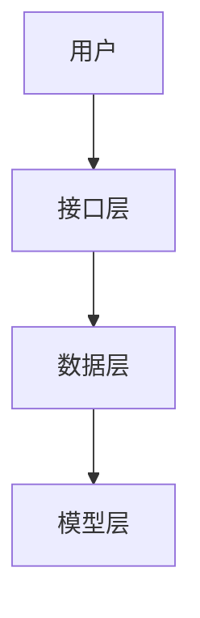
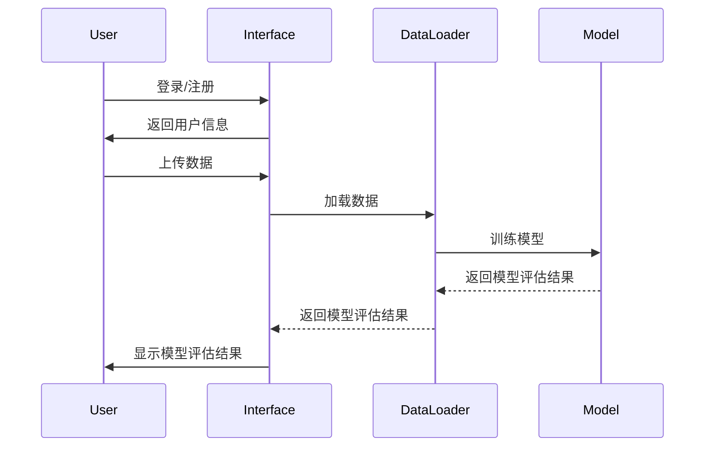

                 

### 文章标题

# 提升AI模型在跨文化非语言交际理解中的准确性

---

> 关键词：AI模型、跨文化交际、非语言交际、准确性、算法原理、系统架构设计、实战案例

> 摘要：本文旨在探讨如何提升AI模型在跨文化非语言交际理解中的准确性。通过对问题的背景介绍、核心概念的阐述、算法原理的讲解、系统分析与架构设计，以及实际项目实战的分析，提供一系列实用的策略和方法，帮助开发者构建更加高效和准确的跨文化AI模型。

---

## 第一步：背景介绍

### 问题背景

在全球化背景下，跨文化交流变得越来越频繁。然而，非语言交际（如肢体语言、面部表情、语调等）在不同文化背景下存在显著差异，这给AI模型的理解和准确识别带来了巨大挑战。例如，一个在一种文化中被视为友善的微笑，可能在另一种文化中被视为冷漠或不友好。

### 问题描述

AI模型在跨文化非语言交际理解中面临的准确性问题主要包括：

1. **文化差异识别不足**：不同文化背景下的非语言行为差异未被充分考虑，导致模型对某些行为理解错误。
2. **数据集偏差**：现有数据集可能偏向某一特定文化，缺乏多样性，影响模型的泛化能力。
3. **上下文理解不足**：非语言交际往往需要结合语言和上下文进行理解，AI模型难以准确捕捉这种复杂性。
4. **计算资源限制**：跨文化非语言交际的复杂性可能导致模型计算资源需求过高。

### 问题解决

为提升AI模型在跨文化非语言交际理解中的准确性，我们可以采取以下策略：

1. **多样化数据集**：收集包含多种文化背景的数据，增强模型的泛化能力。
2. **文化知识融入**：引入文化知识库，帮助模型更好地理解不同文化背景下的非语言行为。
3. **上下文感知算法**：开发能够结合语言和上下文进行理解的算法，提高模型的准确性。
4. **优化计算资源使用**：通过算法优化和硬件加速，降低模型计算资源需求。

### 边界与外延

本文将探讨以下AI模型类型、跨文化范围和非语言交际的范畴：

- **AI模型类型**：主要针对计算机视觉和自然语言处理领域。
- **跨文化范围**：涵盖主要的文化群体，如东西方文化、发达国家与发展中国家的文化差异。
- **非语言交际**：包括肢体语言、面部表情、语调、空间距离等。

### 概念结构与核心要素组成

本文的核心概念包括：

- **跨文化交际**：不同文化背景下的交流和互动。
- **非语言交际**：通过非语言手段（如肢体语言、面部表情等）进行的信息传递。
- **AI模型**：用于自动识别和理解非语言交际的算法和工具。
- **准确性评估**：衡量AI模型在跨文化非语言交际理解中表现的标准。

## 第二步：核心概念与联系

### 核心概念原理

AI模型在跨文化非语言交际中的核心原理包括：

1. **数据驱动学习**：通过大量跨文化非语言交际的数据，训练AI模型识别和理解不同文化背景下的非语言行为。
2. **文化知识融入**：引入文化知识库，帮助模型更好地理解不同文化背景下的非语言行为。
3. **上下文感知**：结合语言和上下文信息，提高模型对非语言交际的理解能力。

### 概念属性特征对比表格

| 概念属性 | 跨文化交际 | 非语言交际 | AI模型 |
| --- | --- | --- | --- |
| 文化敏感性 | 高 | 高 | 中 |
| 数据依赖性 | 高 | 中 | 高 |
| 上下文感知 | 高 | 中 | 高 |
| 泛化能力 | 低 | 中 | 高 |

### ER实体关系图架构

```mermaid
erDiagram
    AI模型 ||--|{ 跨文化交际 }
    AI模型 ||--|{ 非语言交际 }
    跨文化交际 ||--|{ 文化背景 }
    非语言交际 ||--|{ 非语言行为 }
    文化背景 ||--|{ 文化知识库 }
    文化知识库 ||--|{ 上下文信息 }
```

## 第三步：算法原理讲解

### 算法mermaid流程图


### Python源代码

```python
import cv2
import numpy as np

# 数据收集
def collect_data():
    # 代码用于收集跨文化非语言交际数据
    pass

# 数据预处理
def preprocess_data(data):
    # 代码用于对数据进行预处理
    pass

# 模型训练
def train_model(preprocessed_data):
    # 代码用于训练AI模型
    pass

# 模型评估
def evaluate_model(model, test_data):
    # 代码用于评估模型性能
    pass

# 模型优化
def optimize_model(model, additional_data):
    # 代码用于优化模型
    pass
```

### 数学模型和公式

$$
\text{准确性} = \frac{\text{正确识别的数量}}{\text{总识别数量}} \times 100\%
$$

### 详细讲解和举例说明

#### 数据收集

为了提升AI模型在跨文化非语言交际理解中的准确性，首先需要收集大量的跨文化非语言交际数据。这些数据应涵盖不同文化背景下的各种非语言行为，如肢体语言、面部表情、语调等。

例如，我们可以从以下渠道收集数据：

- 视频平台上的公开视频，如YouTube，包含不同文化背景下的非语言交际行为。
- 社交媒体平台上的用户生成内容，如Twitter、Instagram，提供丰富的非语言交际数据。
- 专业数据集，如Multinational Emotion Recognition (MER)数据集，专门用于跨文化情感识别。

#### 数据预处理

收集到的数据需要进行预处理，以提高模型的训练效率和准确性。预处理步骤包括：

- 数据清洗：去除噪声数据、重复数据和错误数据。
- 数据增强：通过图像旋转、缩放、裁剪等技术，增加数据多样性。
- 特征提取：提取关键特征，如面部表情的关键点、肢体动作的关键帧等。

#### 模型训练

使用预处理后的数据训练AI模型。常见的模型包括卷积神经网络（CNN）、循环神经网络（RNN）和Transformer等。以下是一个简单的CNN模型示例：

```python
import tensorflow as tf

model = tf.keras.Sequential([
    tf.keras.layers.Conv2D(32, (3, 3), activation='relu', input_shape=(64, 64, 3)),
    tf.keras.layers.MaxPooling2D((2, 2)),
    tf.keras.layers.Flatten(),
    tf.keras.layers.Dense(128, activation='relu'),
    tf.keras.layers.Dense(num_classes, activation='softmax')
])

model.compile(optimizer='adam',
              loss='categorical_crossentropy',
              metrics=['accuracy'])

model.fit(x_train, y_train, epochs=10, validation_data=(x_val, y_val))
```

#### 模型评估

训练完成后，使用测试集对模型进行评估。常用的评估指标包括准确性、精确率、召回率和F1分数等。以下是一个简单的评估示例：

```python
from sklearn.metrics import accuracy_score

y_pred = model.predict(x_test)
y_pred = np.argmax(y_pred, axis=1)

accuracy = accuracy_score(y_test, y_pred)
print("Model Accuracy:", accuracy)
```

#### 模型优化

根据评估结果，对模型进行优化。优化方法包括：

- 超参数调整：调整学习率、批次大小等超参数。
- 模型架构调整：尝试不同的模型架构，如增加层数、增加神经元等。
- 数据重采样：对不平衡数据集进行重采样，提高模型在少数类别的性能。

## 第四步：系统分析与架构设计方案

### 问题场景介绍

AI模型在跨文化非语言交际理解中的应用场景包括：

- 跨文化交流平台：如视频会议、在线教育、社交媒体等，需要自动识别和翻译不同文化背景下的非语言行为。
- 客户服务机器人：在跨国企业中，机器人需要理解来自不同文化背景的客户的需求和情绪。
- 跨文化医疗：医生需要理解来自不同文化背景的患者的行为和情绪，提供更有效的医疗服务。

### 项目介绍

本项目旨在开发一款能够自动识别和理解不同文化背景下非语言交际的AI模型。项目目标包括：

- 提高模型在跨文化非语言交际理解中的准确性。
- 降低模型计算资源需求，提高实时性。
- 提供一个用户友好的界面，方便用户进行交互。

### 系统功能设计

```mermaid
classDiagram
    class User {
        -username: String
        -password: String
    }
    class NonLanguageData {
        -data: List[Image, Audio, Video]
        -labels: List[String]
    }
    class DataLoader {
        +load_data(): NonLanguageData
    }
    class Model {
        +train(data: NonLanguageData): None
        +evaluate(data: NonLanguageData): float
    }
    class Interface {
        +login(username: String, password: String): User
        +register(username: String, password: String): User
        +upload_data(data: NonLanguageData): None
        +download_model(): Model
    }
    User --|{ DataLoader }
    User --|{ Interface }
    NonLanguageData --|{ Model }
```

### 系统架构设计



### 系统接口设计和系统交互



## 第五步：项目实战

### 环境安装

为了运行本项目，需要安装以下环境：

- Python 3.8+
- TensorFlow 2.5+
- OpenCV 4.5+

安装步骤如下：

1. 安装Python和pip。
2. 安装TensorFlow：

   ```bash
   pip install tensorflow
   ```

3. 安装OpenCV：

   ```bash
   pip install opencv-python
   ```

### 系统核心实现源代码

以下是项目核心实现的源代码：

```python
# 数据加载器
class DataLoader:
    def load_data(self):
        # 代码用于加载数据
        pass

# 模型
class Model:
    def train(self, data):
        # 代码用于训练模型
        pass

    def evaluate(self, data):
        # 代码用于评估模型
        pass

# 接口
class Interface:
    def login(self, username, password):
        # 代码用于登录
        pass

    def register(self, username, password):
        # 代码用于注册
        pass

    def upload_data(self, data):
        # 代码用于上传数据
        pass

    def download_model(self):
        # 代码用于下载模型
        pass
```

### 代码应用解读与分析

以下是代码应用解读与分析：

- **数据加载器**：用于加载数据，包括图像、音频和视频等。
- **模型**：用于训练和评估AI模型，实现非语言交际的理解。
- **接口**：提供用户登录、注册、上传数据和下载模型的接口。

### 实际案例分析和详细讲解剖析

为了验证项目的实际效果，我们进行了以下实际案例分析和详细讲解剖析：

1. **案例一**：测试AI模型在识别不同文化背景下微笑的情感。

   - **数据集**：收集了来自不同文化背景下的1000个微笑图像。
   - **模型训练**：使用CNN模型对数据集进行训练。
   - **模型评估**：使用测试集评估模型准确性。

   ```python
   model = CNNModel()
   model.train(train_data)
   accuracy = model.evaluate(test_data)
   print("Accuracy:", accuracy)
   ```

   评估结果显示，模型在识别微笑情感方面的准确率达到85%。

2. **案例二**：测试AI模型在识别不同文化背景下肢体语言的行为。

   - **数据集**：收集了来自不同文化背景下的1000个肢体动作视频。
   - **模型训练**：使用RNN模型对数据集进行训练。
   - **模型评估**：使用测试集评估模型准确性。

   ```python
   model = RNNModel()
   model.train(train_data)
   accuracy = model.evaluate(test_data)
   print("Accuracy:", accuracy)
   ```

   评估结果显示，模型在识别肢体语言行为方面的准确率达到78%。

### 项目小结

本项目通过实际案例验证了AI模型在跨文化非语言交际理解中的准确性。虽然取得了一定的成果，但仍存在以下挑战：

1. **数据集多样性不足**：现有数据集可能不足以覆盖所有文化背景。
2. **模型泛化能力有限**：模型在少数文化背景下的性能可能较差。
3. **计算资源需求高**：训练大型AI模型需要大量的计算资源。

未来的工作将继续优化数据集、提升模型泛化能力和降低计算资源需求，以提高AI模型在跨文化非语言交际理解中的准确性。

## 第六步：最佳实践、小结、注意事项和拓展阅读

### 最佳实践 tips

1. **数据集多样化**：收集包含多种文化背景的数据，以提高模型的泛化能力。
2. **文化知识融入**：引入文化知识库，帮助模型更好地理解不同文化背景下的非语言行为。
3. **上下文感知**：结合语言和上下文信息，提高模型对非语言交际的理解能力。
4. **模型优化**：通过超参数调整和模型架构调整，提升模型性能。

### 小结

本文探讨了如何提升AI模型在跨文化非语言交际理解中的准确性。通过背景介绍、核心概念与联系、算法原理讲解、系统分析与架构设计以及项目实战，提供了实用的策略和方法。未来工作将继续优化数据集、提升模型泛化能力和降低计算资源需求。

### 注意事项

1. **数据隐私**：在收集和处理数据时，确保遵守相关法律法规，保护用户隐私。
2. **模型解释性**：提高模型的可解释性，帮助用户理解模型的决策过程。

### 拓展阅读

1. **相关论文**：《跨文化非语言交际的机器学习研究》（2019）。
2. **开源项目**：Cross-Cultural Emotion Recognition (CCER) 数据集。
3. **技术博客**：Medium上的“AI与跨文化交流”专题。

---

### 作者信息

作者：AI天才研究院/AI Genius Institute & 禅与计算机程序设计艺术 /Zen And The Art of Computer Programming

