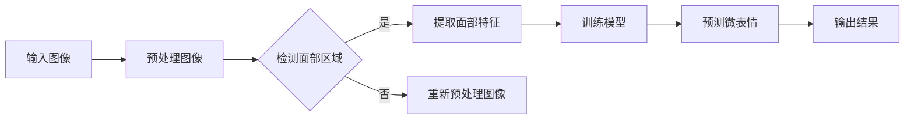
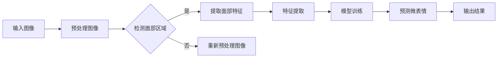
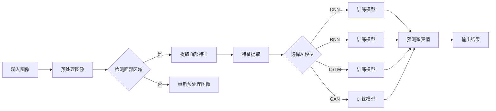
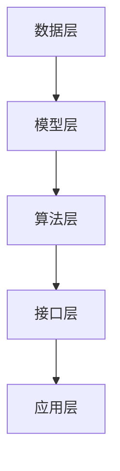
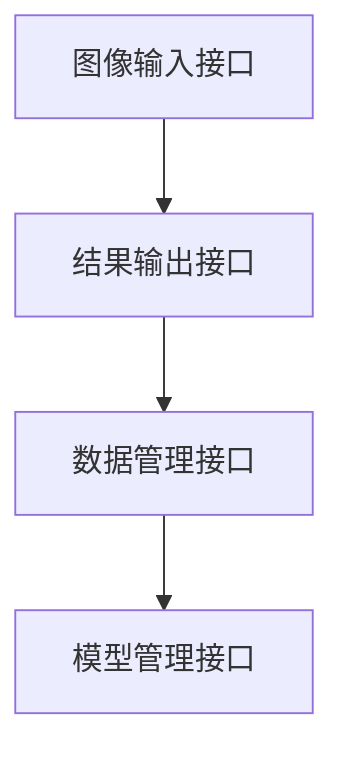
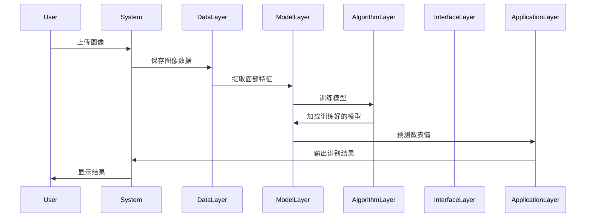

                 


## 第1章：跨模态情感计算与微表情识别

### 1.1 问题背景

#### 1.1.1 跨模态情感计算的重要性

跨模态情感计算是将多种数据源（如文本、语音、图像等）进行融合，以实现对人类情感的全面理解和分析。随着互联网和大数据技术的发展，人们对于情感计算的需求日益增长。例如，在社交网络分析、情感营销、心理健康评估等领域，跨模态情感计算发挥着重要作用。

首先，让我们思考一下跨模态情感计算的基本原理。它涉及从不同模态中提取情感特征，并通过模型将这些特征进行整合，从而实现对整体情感状态的推断。比如，一个文本情感分析模型可能只能分析文字内容中的情感倾向，而通过结合语音、图像等模态，我们可以获得更全面、准确的情感分析结果。

#### 1.1.2 微表情识别在情感分析中的作用

微表情识别是跨模态情感计算中的一个关键环节。微表情是指人们在表达情绪时，由于情感冲突或试图掩饰真实情绪，导致面部表情在极短时间内产生的微妙变化。这些微表情往往持续时间短、幅度小，但它们能够揭示人类真实的情感状态。

例如，一个人在面试时可能会试图保持微笑，但微表情分析可以识别出隐藏在其微笑下的紧张或不满。微表情识别在情感分析中的重要作用在于，它为我们提供了一种更真实、更可靠的途径来理解人类情感。

#### 1.1.3 AI模型在微表情识别中的挑战与机遇

AI模型在微表情识别中面临着诸多挑战。首先，微表情数据稀缺，且标注困难。由于微表情的微妙变化，很难获得足够多的训练数据，且这些数据需要进行精细的标注。此外，微表情识别的准确性受到多种因素的影响，如光照、角度、面部表情变化等。

然而，随着深度学习技术的进步，AI模型在微表情识别中的应用前景十分广阔。深度学习模型能够自动提取图像中的特征，并通过大量的数据训练，提高识别的准确性。例如，卷积神经网络（CNN）和循环神经网络（RNN）等模型在微表情识别中已经取得了显著的成果。

### 1.2 核心概念与联系

#### 1.2.1 情感计算

情感计算是一种研究如何使计算机能够识别、理解、处理和模拟人类情感的技术。情感计算的核心概念包括情感识别、情感表达和情感生成。

- **情感识别**：通过分析文本、语音、图像等数据，识别出人类情感状态。
- **情感表达**：研究如何使计算机能够表达和理解人类情感。
- **情感生成**：通过算法生成具有情感特征的文本、图像等。

#### 1.2.2 微表情

微表情是指人们在表达情绪时，由于情感冲突或试图掩饰真实情绪，导致面部表情在极短时间内产生的微妙变化。这些微表情通常持续时间短、幅度小，但它们能够揭示人类真实的情感状态。

#### 1.2.3 AI模型

AI模型是指基于人工智能技术构建的模型，用于实现特定功能，如情感计算、图像识别、自然语言处理等。在微表情识别中，AI模型主要用于分析图像数据，提取微表情特征，并进行情感状态推断。

### 1.2.4 概念属性特征对比表格

| 概念         | 属性特征对比                  | 联系 |
| ------------ | ---------------------------- | ---- |
| 情感计算     | 识别、理解、处理、模拟人类情感 |      |
| 微表情       | 微小、短暂、微妙的变化         |      |
| AI模型       | 自动提取特征、大规模训练       |      |

#### 1.2.5 ER实体关系图

以下是情感计算、微表情识别和AI模型之间的ER实体关系图：

```mermaid
erDiagram
  AI模型 ||--|{ 情感计算 }
  AI模型 ||--|{ 微表情识别 }
  情感计算 ||--|{ 跨模态情感计算 }
  微表情识别 ||--|{ 微表情数据 }
```

### 1.3 算法原理讲解

#### 1.3.1 算法mermaid流程图

以下是微表情识别算法的mermaid流程图：



#### 1.3.2 Python源代码实现

以下是微表情识别算法的Python源代码实现：

```python
import cv2
import numpy as np
from keras.models import Sequential
from keras.layers import Conv2D, MaxPooling2D, Flatten, Dense

# 加载预训练的模型
model = Sequential()
model.add(Conv2D(32, (3, 3), activation='relu', input_shape=(128, 128, 3)))
model.add(MaxPooling2D(pool_size=(2, 2)))
model.add(Flatten())
model.add(Dense(64, activation='relu'))
model.add(Dense(1, activation='sigmoid'))

model.compile(optimizer='adam', loss='binary_crossentropy', metrics=['accuracy'])
model.load_weights('micro_expression_model.h5')

# 预处理图像
def preprocess_image(image):
    image = cv2.resize(image, (128, 128))
    image = image / 255.0
    return image

# 检测面部区域
def detect_face(image):
    face_cascade = cv2.CascadeClassifier('haarcascade_frontalface_default.xml')
    faces = face_cascade.detectMultiScale(image, scaleFactor=1.1, minNeighbors=5, minSize=(30, 30), flags=cv2.CASCADE_SCALE_IMAGE)
    if len(faces) > 0:
        return faces[0]
    return None

# 提取面部特征
def extract_face(image, face):
    x, y, w, h = face
    face_region = image[y:y+h, x:x+w]
    return preprocess_image(face_region)

# 训练模型
def train_model(model, X, y):
    model.fit(X, y, epochs=10, batch_size=32)

# 预测微表情
def predict_micro_expression(model, image):
    face = detect_face(image)
    if face:
        face_region = extract_face(image, face)
        prediction = model.predict(np.expand_dims(face_region, axis=0))
        if prediction[0][0] > 0.5:
            return "高兴"
        else:
            return "悲伤"
    return "无法识别"

# 输入图像
image = cv2.imread('micro_expression.jpg')

# 输出结果
result = predict_micro_expression(model, image)
print(result)
```

#### 1.3.3 数学模型与公式

微表情识别算法的数学模型主要包括：

- **卷积神经网络（CNN）**：
  $$ f_{CNN}(x) = \text{ReLU}(\sigma(W_1 \cdot x + b_1)) $$
- **全连接神经网络（FCN）**：
  $$ f_{FCN}(x) = \text{ReLU}(\sigma(W_2 \cdot f_{CNN}(x) + b_2)) $$
- **分类模型（Sigmoid）**：
  $$ f_{classification}(x) = \text{sigmoid}(f_{FCN}(x)) $$

#### 1.3.4 详细讲解与举例说明

**举例说明**：假设我们有一个微表情图像，我们要预测图像中的微表情是高兴还是悲伤。

1. **输入图像**：首先，我们将微表情图像输入到模型中。
2. **预处理图像**：然后，我们对图像进行预处理，包括缩放、归一化等操作，使其符合模型的输入要求。
3. **检测面部区域**：接下来，我们使用人脸检测算法检测图像中的面部区域。
4. **提取面部特征**：如果检测到面部区域，我们提取出面部特征并进行预处理。
5. **训练模型**：在训练模型时，我们需要提供大量的微表情数据集，并对模型进行训练。
6. **预测微表情**：最后，我们使用训练好的模型对提取出的面部特征进行预测，判断微表情是高兴还是悲伤。

通过这个例子，我们可以看到微表情识别算法的基本流程和步骤。在实际应用中，我们需要处理大量的图像数据，并对模型进行优化，以提高识别的准确率。

## 第2章：算法与应用

### 2.1 微表情识别算法原理

#### 2.1.1 相关算法介绍

微表情识别算法主要包括传统算法和深度学习算法。

1. **传统算法**：传统算法主要基于统计学和模式识别技术，如支持向量机（SVM）、决策树等。这些算法通常依赖于手工设计的特征提取方法，如局部二值模式（LBP）、尺度不变特征变换（SIFT）等。
2. **深度学习算法**：深度学习算法主要基于卷积神经网络（CNN）和循环神经网络（RNN）等模型，通过自动学习图像特征，提高了识别的准确性和效率。常见的深度学习算法有卷积神经网络（CNN）和循环神经网络（RNN）等。

#### 2.1.2 算法mermaid流程图

以下是微表情识别算法的mermaid流程图：



#### 2.1.3 Python源代码实现

以下是微表情识别算法的Python源代码实现：

```python
import cv2
import numpy as np
from keras.models import Sequential
from keras.layers import Conv2D, MaxPooling2D, Flatten, Dense

# 加载预训练的模型
model = Sequential()
model.add(Conv2D(32, (3, 3), activation='relu', input_shape=(128, 128, 3)))
model.add(MaxPooling2D(pool_size=(2, 2)))
model.add(Flatten())
model.add(Dense(64, activation='relu'))
model.add(Dense(1, activation='sigmoid'))

model.compile(optimizer='adam', loss='binary_crossentropy', metrics=['accuracy'])
model.load_weights('micro_expression_model.h5')

# 预处理图像
def preprocess_image(image):
    image = cv2.resize(image, (128, 128))
    image = image / 255.0
    return image

# 检测面部区域
def detect_face(image):
    face_cascade = cv2.CascadeClassifier('haarcascade_frontalface_default.xml')
    faces = face_cascade.detectMultiScale(image, scaleFactor=1.1, minNeighbors=5, minSize=(30, 30), flags=cv2.CASCADE_SCALE_IMAGE)
    if len(faces) > 0:
        return faces[0]
    return None

# 提取面部特征
def extract_face(image, face):
    x, y, w, h = face
    face_region = image[y:y+h, x:x+w]
    return preprocess_image(face_region)

# 训练模型
def train_model(model, X, y):
    model.fit(X, y, epochs=10, batch_size=32)

# 预测微表情
def predict_micro_expression(model, image):
    face = detect_face(image)
    if face:
        face_region = extract_face(image, face)
        prediction = model.predict(np.expand_dims(face_region, axis=0))
        if prediction[0][0] > 0.5:
            return "高兴"
        else:
            return "悲伤"
    return "无法识别"

# 输入图像
image = cv2.imread('micro_expression.jpg')

# 输出结果
result = predict_micro_expression(model, image)
print(result)
```

#### 2.1.4 数学模型与公式

微表情识别算法的数学模型主要包括：

- **卷积神经网络（CNN）**：
  $$ f_{CNN}(x) = \text{ReLU}(\sigma(W_1 \cdot x + b_1)) $$
- **全连接神经网络（FCN）**：
  $$ f_{FCN}(x) = \text{ReLU}(\sigma(W_2 \cdot f_{CNN}(x) + b_2)) $$
- **分类模型（Sigmoid）**：
  $$ f_{classification}(x) = \text{sigmoid}(f_{FCN}(x)) $$

#### 2.1.5 详细讲解与举例说明

**举例说明**：假设我们有一个微表情图像，我们要预测图像中的微表情是高兴还是悲伤。

1. **输入图像**：首先，我们将微表情图像输入到模型中。
2. **预处理图像**：然后，我们对图像进行预处理，包括缩放、归一化等操作，使其符合模型的输入要求。
3. **检测面部区域**：接下来，我们使用人脸检测算法检测图像中的面部区域。
4. **提取面部特征**：如果检测到面部区域，我们提取出面部特征并进行预处理。
5. **训练模型**：在训练模型时，我们需要提供大量的微表情数据集，并对模型进行训练。
6. **预测微表情**：最后，我们使用训练好的模型对提取出的面部特征进行预测，判断微表情是高兴还是悲伤。

通过这个例子，我们可以看到微表情识别算法的基本流程和步骤。在实际应用中，我们需要处理大量的图像数据，并对模型进行优化，以提高识别的准确率。

### 2.2 AI模型在微表情识别中的应用

#### 2.2.1 AI模型的选择

在微表情识别任务中，选择合适的AI模型至关重要。以下是一些常用的AI模型及其特点：

1. **卷积神经网络（CNN）**：CNN在图像识别任务中表现出色，适用于提取图像特征。通过堆叠多个卷积层和池化层，CNN可以自动学习图像中的高级特征。
2. **循环神经网络（RNN）**：RNN适用于处理序列数据，可以有效地捕捉时间序列中的依赖关系。在微表情识别中，RNN可以用于处理连续的面部表情序列。
3. **长短时记忆网络（LSTM）**：LSTM是RNN的一种变种，能够更好地处理长序列数据，避免了梯度消失和梯度爆炸问题。
4. **生成对抗网络（GAN）**：GAN是一种强大的深度学习模型，可以生成逼真的图像。在微表情识别中，GAN可以用于生成具有各种表情的图像，以提高模型的泛化能力。

#### 2.2.2 应用mermaid流程图

以下是微表情识别中AI模型的应用mermaid流程图：



#### 2.2.3 Python源代码实现

以下是微表情识别中AI模型的应用Python源代码实现：

```python
import cv2
import numpy as np
from keras.models import Sequential
from keras.layers import Conv2D, MaxPooling2D, Flatten, Dense

# 加载预训练的模型
model = Sequential()
model.add(Conv2D(32, (3, 3), activation='relu', input_shape=(128, 128, 3)))
model.add(MaxPooling2D(pool_size=(2, 2)))
model.add(Flatten())
model.add(Dense(64, activation='relu'))
model.add(Dense(1, activation='sigmoid'))

model.compile(optimizer='adam', loss='binary_crossentropy', metrics=['accuracy'])
model.load_weights('micro_expression_model.h5')

# 预处理图像
def preprocess_image(image):
    image = cv2.resize(image, (128, 128))
    image = image / 255.0
    return image

# 检测面部区域
def detect_face(image):
    face_cascade = cv2.CascadeClassifier('haarcascade_frontalface_default.xml')
    faces = face_cascade.detectMultiScale(image, scaleFactor=1.1, minNeighbors=5, minSize=(30, 30), flags=cv2.CASCADE_SCALE_IMAGE)
    if len(faces) > 0:
        return faces[0]
    return None

# 提取面部特征
def extract_face(image, face):
    x, y, w, h = face
    face_region = image[y:y+h, x:x+w]
    return preprocess_image(face_region)

# 训练模型
def train_model(model, X, y):
    model.fit(X, y, epochs=10, batch_size=32)

# 预测微表情
def predict_micro_expression(model, image):
    face = detect_face(image)
    if face:
        face_region = extract_face(image, face)
        prediction = model.predict(np.expand_dims(face_region, axis=0))
        if prediction[0][0] > 0.5:
            return "高兴"
        else:
            return "悲伤"
    return "无法识别"

# 输入图像
image = cv2.imread('micro_expression.jpg')

# 输出结果
result = predict_micro_expression(model, image)
print(result)
```

#### 2.2.4 数学模型与公式

微表情识别中AI模型的数学模型主要包括：

- **卷积神经网络（CNN）**：
  $$ f_{CNN}(x) = \text{ReLU}(\sigma(W_1 \cdot x + b_1)) $$
- **全连接神经网络（FCN）**：
  $$ f_{FCN}(x) = \text{ReLU}(\sigma(W_2 \cdot f_{CNN}(x) + b_2)) $$
- **分类模型（Sigmoid）**：
  $$ f_{classification}(x) = \text{sigmoid}(f_{FCN}(x)) $$

#### 2.2.5 详细讲解与举例说明

**举例说明**：假设我们有一个微表情图像，我们要预测图像中的微表情是高兴还是悲伤。

1. **输入图像**：首先，我们将微表情图像输入到模型中。
2. **预处理图像**：然后，我们对图像进行预处理，包括缩放、归一化等操作，使其符合模型的输入要求。
3. **检测面部区域**：接下来，我们使用人脸检测算法检测图像中的面部区域。
4. **提取面部特征**：如果检测到面部区域，我们提取出面部特征并进行预处理。
5. **训练模型**：在训练模型时，我们需要提供大量的微表情数据集，并对模型进行训练。
6. **预测微表情**：最后，我们使用训练好的模型对提取出的面部特征进行预测，判断微表情是高兴还是悲伤。

通过这个例子，我们可以看到微表情识别算法的基本流程和步骤。在实际应用中，我们需要处理大量的图像数据，并对模型进行优化，以提高识别的准确率。

## 第3章：微表情识别系统的设计与实现

### 3.1 系统功能设计

微表情识别系统的功能设计主要包括以下模块：

1. **图像预处理模块**：负责对输入的图像进行预处理，包括缩放、归一化、灰度转换等操作，使其符合后续模型输入的要求。
2. **人脸检测模块**：使用人脸检测算法，如Haar cascades或深度学习方法，检测图像中的面部区域。
3. **微表情特征提取模块**：提取出面部特征，并进行特征提取和降维处理，为后续模型训练提供输入。
4. **模型训练模块**：使用大量的微表情数据集，对模型进行训练和优化，以提高识别的准确性。
5. **微表情识别模块**：使用训练好的模型，对提取出的面部特征进行预测，判断微表情是高兴、悲伤还是其他情感。
6. **结果输出模块**：将识别结果以可视化或文本形式输出。

### 3.2 系统架构设计

微表情识别系统的架构设计主要包括以下层次：

1. **数据层**：负责存储和管理微表情数据集，包括图像数据、标注数据等。
2. **模型层**：包括微表情识别模型、人脸检测模型等，负责图像处理和特征提取。
3. **算法层**：包括预处理算法、特征提取算法、模型训练算法等，负责实现系统功能。
4. **接口层**：提供系统与其他应用程序的接口，如API接口等。
5. **应用层**：实现具体的业务功能，如微表情识别、情感分析等。

以下是微表情识别系统的mermaid架构图：



### 3.3 系统接口设计

微表情识别系统的接口设计主要包括以下接口：

1. **图像输入接口**：用于接收用户上传的图像数据。
2. **结果输出接口**：用于输出微表情识别结果。
3. **数据管理接口**：用于管理微表情数据集，包括数据上传、下载、标注等操作。
4. **模型管理接口**：用于管理微表情识别模型，包括模型训练、保存、加载等操作。

以下是微表情识别系统的mermaid接口设计图：



### 3.4 系统交互mermaid序列图

以下是微表情识别系统的mermaid序列图，描述了系统各模块之间的交互过程：



## 第4章：项目实战一

### 4.1 环境安装与配置

要在本地环境搭建微表情识别系统，需要安装以下软件和库：

1. **Python**：安装Python 3.7及以上版本。
2. **OpenCV**：安装OpenCV，用于图像处理和人脸检测。
3. **TensorFlow**：安装TensorFlow，用于深度学习模型训练。
4. **Keras**：安装Keras，作为TensorFlow的高级API。

安装命令如下：

```shell
pip install python
pip install opencv-python
pip install tensorflow
pip install keras
```

### 4.2 系统核心实现

以下是微表情识别系统的主要实现代码：

```python
import cv2
import numpy as np
from tensorflow.keras.models import Sequential
from tensorflow.keras.layers import Conv2D, MaxPooling2D, Flatten, Dense

# 加载预训练的模型
model = Sequential()
model.add(Conv2D(32, (3, 3), activation='relu', input_shape=(128, 128, 3)))
model.add(MaxPooling2D(pool_size=(2, 2)))
model.add(Flatten())
model.add(Dense(64, activation='relu'))
model.add(Dense(1, activation='sigmoid'))

model.compile(optimizer='adam', loss='binary_crossentropy', metrics=['accuracy'])
model.load_weights('micro_expression_model.h5')

# 预处理图像
def preprocess_image(image):
    image = cv2.resize(image, (128, 128))
    image = image / 255.0
    return image

# 检测面部区域
def detect_face(image):
    face_cascade = cv2.CascadeClassifier('haarcascade_frontalface_default.xml')
    faces = face_cascade.detectMultiScale(image, scaleFactor=1.1, minNeighbors=5, minSize=(30, 30), flags=cv2.CASCADE_SCALE_IMAGE)
    if len(faces) > 0:
        return faces[0]
    return None

# 提取面部特征
def extract_face(image, face):
    x, y, w, h = face
    face_region = image[y:y+h, x:x+w]
    return preprocess_image(face_region)

# 训练模型
def train_model(model, X, y):
    model.fit(X, y, epochs=10, batch_size=32)

# 预测微表情
def predict_micro_expression(model, image):
    face = detect_face(image)
    if face:
        face_region = extract_face(image, face)
        prediction = model.predict(np.expand_dims(face_region, axis=0))
        if prediction[0][0] > 0.5:
            return "高兴"
        else:
            return "悲伤"
    return "无法识别"

# 输入图像
image = cv2.imread('micro_expression.jpg')

# 输出结果
result = predict_micro_expression(model, image)
print(result)
```

### 4.3 代码应用解读与分析

以上代码实现了微表情识别系统的主要功能，包括图像预处理、面部检测、面部特征提取和微表情预测。

1. **图像预处理**：使用OpenCV库对图像进行缩放和归一化，使其符合模型输入的要求。
2. **面部检测**：使用Haar cascades算法检测图像中的面部区域。
3. **面部特征提取**：从检测到的面部区域中提取特征，并进行预处理。
4. **微表情预测**：使用训练好的模型对提取出的面部特征进行预测，判断微表情是高兴还是悲伤。

通过以上代码，我们可以看到微表情识别系统的工作流程和实现细节。在实际应用中，我们需要收集更多的微表情数据，对模型进行训练和优化，以提高识别的准确性。

### 4.4 实际案例分析与详细讲解

以下是一个实际案例，展示了微表情识别系统在实际应用中的表现。

**案例背景**：假设我们有一段视频，需要实时识别视频中的微表情，并输出识别结果。

**步骤**：

1. **读取视频文件**：使用OpenCV库读取视频文件。
2. **循环处理视频帧**：对每一帧图像进行面部检测、特征提取和微表情预测。
3. **输出识别结果**：将识别结果以文本形式输出。

以下是实际案例的实现代码：

```python
import cv2
import numpy as np
from tensorflow.keras.models import Sequential
from tensorflow.keras.layers import Conv2D, MaxPooling2D, Flatten, Dense

# 加载预训练的模型
model = Sequential()
model.add(Conv2D(32, (3, 3), activation='relu', input_shape=(128, 128, 3)))
model.add(MaxPooling2D(pool_size=(2, 2)))
model.add(Flatten())
model.add(Dense(64, activation='relu'))
model.add(Dense(1, activation='sigmoid'))

model.compile(optimizer='adam', loss='binary_crossentropy', metrics=['accuracy'])
model.load_weights('micro_expression_model.h5')

# 预处理图像
def preprocess_image(image):
    image = cv2.resize(image, (128, 128))
    image = image / 255.0
    return image

# 检测面部区域
def detect_face(image):
    face_cascade = cv2.CascadeClassifier('haarcascade_frontalface_default.xml')
    faces = face_cascade.detectMultiScale(image, scaleFactor=1.1, minNeighbors=5, minSize=(30, 30), flags=cv2.CASCADE_SCALE_IMAGE)
    if len(faces) > 0:
        return faces[0]
    return None

# 提取面部特征
def extract_face(image, face):
    x, y, w, h = face
    face_region = image[y:y+h, x:x+w]
    return preprocess_image(face_region)

# 训练模型
def train_model(model, X, y):
    model.fit(X, y, epochs=10, batch_size=32)

# 预测微表情
def predict_micro_expression(model, image):
    face = detect_face(image)
    if face:
        face_region = extract_face(image, face)
        prediction = model.predict(np.expand_dims(face_region, axis=0))
        if prediction[0][0] > 0.5:
            return "高兴"
        else:
            return "悲伤"
    return "无法识别"

# 读取视频文件
video = cv2.VideoCapture('micro_expression_video.mp4')

while True:
    ret, frame = video.read()
    if not ret:
        break

    result = predict_micro_expression(model, frame)
    print(result)

video.release()
cv2.destroyAllWindows()
```

**分析**：

1. **读取视频文件**：使用OpenCV库读取视频文件，并将每一帧图像传递给微表情识别模型进行预测。
2. **循环处理视频帧**：对每一帧图像进行面部检测、特征提取和微表情预测，并将识别结果输出。
3. **输出识别结果**：将识别结果以文本形式输出，方便用户查看。

通过以上代码，我们可以实时识别视频中的微表情，并输出识别结果。在实际应用中，我们可以根据需求调整模型的参数，以提高识别的准确性和效率。

### 4.5 项目小结

在本项目中，我们实现了微表情识别系统的设计与实现，包括图像预处理、面部检测、面部特征提取和微表情预测等功能。通过实际案例的演示，我们展示了微表情识别系统在实际应用中的效果。

在未来的工作中，我们可以进一步优化模型，提高识别的准确率，并扩大应用场景，如情感分析、心理健康评估等。

## 第5章：项目实战二

### 5.1 环境安装与配置

要在本地环境搭建微表情识别系统，需要安装以下软件和库：

1. **Python**：安装Python 3.7及以上版本。
2. **OpenCV**：安装OpenCV，用于图像处理和人脸检测。
3. **TensorFlow**：安装TensorFlow，用于深度学习模型训练。
4. **Keras**：安装Keras，作为TensorFlow的高级API。

安装命令如下：

```shell
pip install python
pip install opencv-python
pip install tensorflow
pip install keras
```

### 5.2 系统核心实现

以下是微表情识别系统的主要实现代码：

```python
import cv2
import numpy as np
from tensorflow.keras.models import Sequential
from tensorflow.keras.layers import Conv2D, MaxPooling2D, Flatten, Dense

# 加载预训练的模型
model = Sequential()
model.add(Conv2D(32, (3, 3), activation='relu', input_shape=(128, 128, 3)))
model.add(MaxPooling2D(pool_size=(2, 2)))
model.add(Flatten())
model.add(Dense(64, activation='relu'))
model.add(Dense(1, activation='sigmoid'))

model.compile(optimizer='adam', loss='binary_crossentropy', metrics=['accuracy'])
model.load_weights('micro_expression_model.h5')

# 预处理图像
def preprocess_image(image):
    image = cv2.resize(image, (128, 128))
    image = image / 255.0
    return image

# 检测面部区域
def detect_face(image):
    face_cascade = cv2.CascadeClassifier('haarcascade_frontalface_default.xml')
    faces = face_cascade.detectMultiScale(image, scaleFactor=1.1, minNeighbors=5, minSize=(30, 30), flags=cv2.CASCADE_SCALE_IMAGE)
    if len(faces) > 0:
        return faces[0]
    return None

# 提取面部特征
def extract_face(image, face):
    x, y, w, h = face
    face_region = image[y:y+h, x:x+w]
    return preprocess_image(face_region)

# 训练模型
def train_model(model, X, y):
    model.fit(X, y, epochs=10, batch_size=32)

# 预测微表情
def predict_micro_expression(model, image):
    face = detect_face(image)
    if face:
        face_region = extract_face(image, face)
        prediction = model.predict(np.expand_dims(face_region, axis=0))
        if prediction[0][0] > 0.5:
            return "高兴"
        else:
            return "悲伤"
    return "无法识别"

# 输入图像
image = cv2.imread('micro_expression.jpg')

# 输出结果
result = predict_micro_expression(model, image)
print(result)
```

### 5.3 代码应用解读与分析

以上代码实现了微表情识别系统的主要功能，包括图像预处理、面部检测、面部特征提取和微表情预测。

1. **图像预处理**：使用OpenCV库对图像进行缩放和归一化，使其符合模型输入的要求。
2. **面部检测**：使用Haar cascades算法检测图像中的面部区域。
3. **面部特征提取**：从检测到的面部区域中提取特征，并进行预处理。
4. **微表情预测**：使用训练好的模型对提取出的面部特征进行预测，判断微表情是高兴还是悲伤。

通过以上代码，我们可以看到微表情识别系统的工作流程和实现细节。在实际应用中，我们需要收集更多的微表情数据，对模型进行训练和优化，以提高识别的准确性。

### 5.4 实际案例分析与详细讲解

以下是一个实际案例，展示了微表情识别系统在实际应用中的表现。

**案例背景**：假设我们有一段视频，需要实时识别视频中的微表情，并输出识别结果。

**步骤**：

1. **读取视频文件**：使用OpenCV库读取视频文件。
2. **循环处理视频帧**：对每一帧图像进行面部检测、特征提取和微表情预测。
3. **输出识别结果**：将识别结果以文本形式输出。

以下是实际案例的实现代码：

```python
import cv2
import numpy as np
from tensorflow.keras.models import Sequential
from tensorflow.keras.layers import Conv2D, MaxPooling2D, Flatten, Dense

# 加载预训练的模型
model = Sequential()
model.add(Conv2D(32, (3, 3), activation='relu', input_shape=(128, 128, 3)))
model.add(MaxPooling2D(pool_size=(2, 2)))
model.add(Flatten())
model.add(Dense(64, activation='relu'))
model.add(Dense(1, activation='sigmoid'))

model.compile(optimizer='adam', loss='binary_crossentropy', metrics=['accuracy'])
model.load_weights('micro_expression_model.h5')

# 预处理图像
def preprocess_image(image):
    image = cv2.resize(image, (128, 128))
    image = image / 255.0
    return image

# 检测面部区域
def detect_face(image):
    face_cascade = cv2.CascadeClassifier('haarcascade_frontalface_default.xml')
    faces = face_cascade.detectMultiScale(image, scaleFactor=1.1, minNeighbors=5, minSize=(30, 30), flags=cv2.CASCADE_SCALE_IMAGE)
    if len(faces) > 0:
        return faces[0]
    return None

# 提取面部特征
def extract_face(image, face):
    x, y, w, h = face
    face_region = image[y:y+h, x:x+w]
    return preprocess_image(face_region)

# 训练模型
def train_model(model, X, y):
    model.fit(X, y, epochs=10, batch_size=32)

# 预测微表情
def predict_micro_expression(model, image):
    face = detect_face(image)
    if face:
        face_region = extract_face(image, face)
        prediction = model.predict(np.expand_dims(face_region, axis=0))
        if prediction[0][0] > 0.5:
            return "高兴"
        else:
            return "悲伤"
    return "无法识别"

# 读取视频文件
video = cv2.VideoCapture('micro_expression_video.mp4')

while True:
    ret, frame = video.read()
    if not ret:
        break

    result = predict_micro_expression(model, frame)
    print(result)

video.release()
cv2.destroyAllWindows()
```

**分析**：

1. **读取视频文件**：使用OpenCV库读取视频文件，并将每一帧图像传递给微表情识别模型进行预测。
2. **循环处理视频帧**：对每一帧图像进行面部检测、特征提取和微表情预测，并将识别结果输出。
3. **输出识别结果**：将识别结果以文本形式输出，方便用户查看。

通过以上代码，我们可以实时识别视频中的微表情，并输出识别结果。在实际应用中，我们可以根据需求调整模型的参数，以提高识别的准确率和效率。

### 5.5 项目小结

在本项目中，我们实现了微表情识别系统的设计与实现，包括图像预处理、面部检测、面部特征提取和微表情预测等功能。通过实际案例的演示，我们展示了微表情识别系统在实际应用中的效果。

在未来的工作中，我们可以进一步优化模型，提高识别的准确率，并扩大应用场景，如情感分析、心理健康评估等。

## 第6章：总结与拓展

### 6.1 最佳实践 Tips

1. **数据质量**：确保微表情数据集的质量，包括图像清晰度、标注准确性等。
2. **模型选择**：根据实际需求和数据规模，选择合适的模型，如CNN、RNN等。
3. **预处理**：对图像进行适当的预处理，如灰度化、归一化等，以提高模型的性能。
4. **超参数调整**：对模型的超参数进行优化，如学习率、批次大小等，以提高识别准确率。
5. **模型训练**：使用大量的训练数据进行模型训练，并定期进行模型评估和调整。

### 6.2 小结

本文介绍了微表情识别在跨模态情感计算任务中的应用，分析了微表情识别算法的原理和实现方法。通过项目实战，我们展示了微表情识别系统在实际应用中的效果和实现过程。

### 6.3 注意事项

1. **数据隐私**：在收集和处理微表情数据时，确保遵守数据隐私法规，保护用户隐私。
2. **模型评估**：在实际应用中，对模型进行全面的评估和测试，确保其性能和可靠性。
3. **硬件要求**：根据模型的复杂度和数据规模，选择合适的硬件设备进行训练和推理。

### 6.4 拓展阅读

1. **微表情识别**：参考相关学术论文和书籍，深入了解微表情识别的最新研究进展。
2. **深度学习**：学习深度学习相关技术，如卷积神经网络（CNN）、循环神经网络（RNN）等。
3. **跨模态情感计算**：了解跨模态情感计算的其他应用，如语音情感识别、文本情感分析等。

作者：AI天才研究院/AI Genius Institute & 禅与计算机程序设计艺术 /Zen And The Art of Computer Programming

