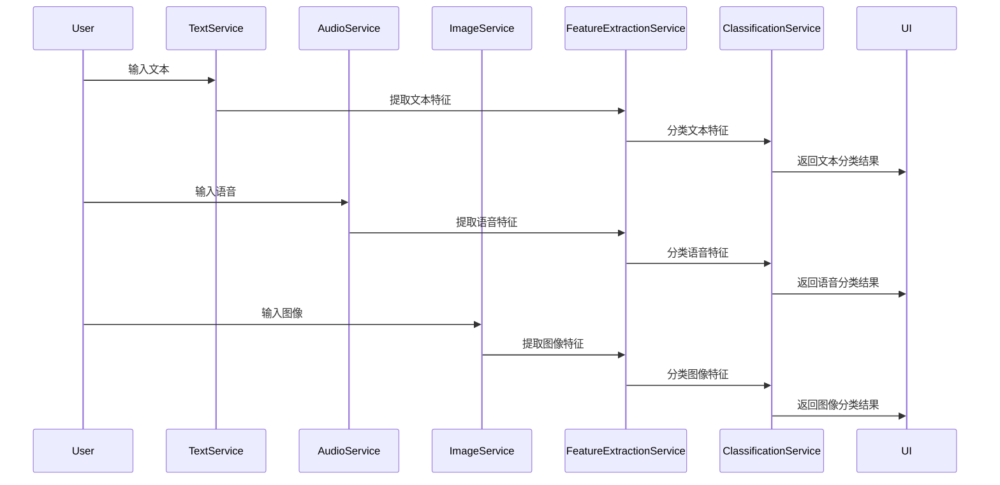

                 

### 第1章：问题背景与核心概念

#### 1.1 问题背景

跨模态情感计算的兴起

随着互联网和多媒体技术的迅猛发展，人们产生了大量丰富的多媒体内容。这些内容不仅包括传统的文本，还涵盖了语音、图像、视频等多种形式。在这种背景下，如何有效处理和利用这些多媒体信息，成为了学术界和工业界关注的热点问题。特别是情感计算作为人工智能领域的一个重要分支，其核心任务之一便是理解和分析人类情感。而跨模态情感计算，作为一种结合了多种模态信息的技术，正日益受到研究者的关注。

跨模态情感计算的重要性

跨模态情感计算的重要性主要体现在以下几个方面：

1. **提高信息处理能力**：通过整合多种模态的信息，可以更全面、准确地理解用户的情感状态，从而提高信息处理的能力。
2. **提升用户体验**：在智能客服、智能助手等应用中，能够准确识别用户的情感，可以提供更加个性化的服务，提升用户体验。
3. **促进人机交互**：通过理解用户的情感，可以设计出更加自然、流畅的人机交互系统，使人与机器之间的沟通更加和谐。

细粒度识别的需求

细粒度识别是指在情感识别中能够对情感进行更精细的分类和识别。传统情感识别方法通常只能识别出基本情感类别，如快乐、愤怒、悲伤等。然而，在实际应用中，人们常常需要识别更为细腻的情感状态，如愉悦、兴奋、厌烦、沮丧等。这些细腻的情感状态往往与用户的情绪和行为密切相关，能够为应用提供更丰富的信息和决策依据。

细粒度识别的需求主要体现在以下几个方面：

1. **提高应用价值**：在医疗、教育、娱乐等众多领域，对情感的细腻识别能够提供更有价值的决策支持。
2. **增强用户体验**：在智能语音助手、智能客服等应用中，能够更准确地捕捉用户的情感变化，提高用户满意度。
3. **提升自动化程度**：在自动驾驶、智能家居等应用中，能够更精准地理解用户的情感需求，实现更高的自动化程度。

#### 1.2 核心概念

情感计算

情感计算（Affective Computing）是指研究如何使计算机具备理解、感知、识别和表达人类情感的能力。它是一个跨学科的领域，涉及计算机科学、心理学、认知科学、人机交互等多个方面。情感计算的核心目标是通过技术手段捕捉和理解人类的情感状态，从而实现人与计算机之间的情感交互。

跨模态

跨模态（Multimodal）是指在多个模态之间进行信息传递和交互的能力。在跨模态情感计算中，涉及的模态通常包括文本、语音、图像、视频等。通过整合这些不同模态的信息，可以更全面地理解用户的情感状态。

细粒度识别

细粒度识别（Fine-Grained Recognition）是指对目标进行更精细的分类和识别。在情感计算领域，细粒度识别意味着能够区分出更加细腻的情感状态，如愉悦、兴奋、厌烦、沮丧等。细粒度识别能够提供更丰富的情感信息，为应用提供更精确的决策依据。

#### 1.3 概念属性特征对比

下面是一个关于情感计算、跨模态和细粒度识别的属性特征对比表格：

| 概念       | 定义                                                         | 属性特征                        |
|------------|--------------------------------------------------------------|---------------------------------|
| 情感计算   | 研究人类情感的表达、识别和理解的领域                             | 情感识别、情感表达、情感理解     |
| 跨模态    | 多种模态（文本、语音、图像）之间的情感识别和交互               | 文本、语音、图像情感特征融合     |
| 细粒度识别 | 对情感进行更精细的分类和识别，如区分微表情中的不同情感状态   | 情感分类的细化、情感状态的细分   |

#### 1.4 本章小结

本章介绍了跨模态情感计算的问题背景、核心概念及其属性特征。我们探讨了跨模态情感计算的重要性，分析了细粒度识别的需求，并详细阐述了情感计算、跨模态和细粒度识别这三个核心概念。通过这些讨论，我们为后续章节的研究奠定了基础，也激发了读者对跨模态情感计算和细粒度识别的进一步兴趣。

---

在接下来的章节中，我们将深入探讨跨模态情感计算的相关技术，包括情感特征提取、融合方法和细粒度识别方法，并通过实际案例进行分析。同时，我们还将详细阐述细粒度识别算法的原理和流程，以及跨模态情感计算系统的架构设计。通过这些内容，希望能够帮助读者更全面地理解和掌握跨模态情感计算和细粒度识别的相关知识。

---

### 第2章：跨模态情感计算的相关技术

#### 2.1 情感计算技术基础

情感计算技术基础主要包括情感特征提取和情感分类模型两部分。情感特征提取是跨模态情感计算的关键步骤，其目的是从文本、语音和图像等多种模态中提取出能够反映情感状态的特征。而情感分类模型则基于这些提取到的特征，对情感进行分类和识别。

情感特征提取

情感特征提取是情感计算的基础，其目标是自动地从文本、语音和图像中提取出能够反映情感状态的特征。以下是几种常见的情感特征提取方法：

1. **文本情感特征提取**：
   - **词袋模型（Bag of Words, BoW）**：将文本分解为词语，并计算每个词语在文本中的出现频率。
   - **TF-IDF（Term Frequency-Inverse Document Frequency）**：在词袋模型的基础上，引入词频和逆文档频率，以反映词语在文档中的重要程度。
   - **词嵌入（Word Embedding）**：通过神经网络模型（如Word2Vec、GloVe）将词语映射到高维空间，从而提取出词语的语义特征。

2. **语音情感特征提取**：
   - **声学特征**：如梅尔频率倒谱系数（Mel-Frequency Cepstral Coefficients, MFCC）和短时傅立叶变换（Short-Time Fourier Transform, STFT）。
   - **语音信号时序特征**：如短时能量（Short-Time Energy）、过零率（Zero Crossing Rate）等。

3. **图像情感特征提取**：
   - **视觉特征**：如边缘检测、纹理分析、颜色特征等。
   - **深度特征**：通过卷积神经网络（Convolutional Neural Networks, CNN）提取图像的深层特征。

情感分类模型

情感分类模型是情感计算的核心，其目的是根据提取到的情感特征对情感进行分类。以下是几种常见的情感分类模型：

1. **传统机器学习模型**：
   - **支持向量机（Support Vector Machine, SVM）**：通过最大化分类边界，实现高维空间中的线性或非线性分类。
   - **随机森林（Random Forest）**：通过构建多个决策树，并利用投票机制进行分类。
   - **朴素贝叶斯（Naive Bayes）**：基于贝叶斯理论，通过概率计算实现分类。

2. **深度学习模型**：
   - **卷积神经网络（Convolutional Neural Networks, CNN）**：适用于处理图像数据，通过卷积操作提取图像特征。
   - **循环神经网络（Recurrent Neural Networks, RNN）**：适用于处理序列数据，通过循环结构对序列信息进行建模。
   - **Transformer模型**：基于自注意力机制，适用于处理多种类型的序列数据。

#### 2.2 跨模态融合技术

跨模态融合技术是将不同模态的信息进行整合，以实现更全面、准确的情感识别。常见的跨模态融合方法包括特征级融合和决策级融合。

特征级融合

特征级融合是指直接将不同模态的特征进行拼接，形成一个综合特征向量。以下是几种常见的特征级融合方法：

1. **直接拼接（Direct Concatenation）**：将不同模态的特征向量直接拼接在一起，形成一个更长的特征向量。
2. **特征融合网络（Fusion Networks）**：通过神经网络结构，将不同模态的特征进行融合，如CNN和RNN的组合。
3. **多任务学习（Multi-Task Learning）**：通过共享网络结构，同时学习多个任务的特性，实现特征融合。

决策级融合

决策级融合是指先对每个模态进行独立分类，然后将分类结果进行融合，得到最终的分类结果。以下是几种常见的决策级融合方法：

1. **投票机制（Voting Mechanism）**：将各个模态的分类结果进行投票，得到最终的分类结果。
2. **贝叶斯网络（Bayesian Network）**：通过构建贝叶斯网络模型，将不同模态的信息进行融合，实现联合概率推理。
3. **集成学习（Ensemble Learning）**：将多个独立的分类器进行集成，提高分类的准确性和鲁棒性。

#### 2.3 细粒度识别方法

细粒度识别方法是指对情感进行更精细的分类和识别，以捕捉更细微的情感变化。以下是几种常见的细粒度识别方法：

1. **层次化分类（Hierarchical Classification）**：通过构建多层次的情感分类体系，实现情感的逐层细化。
2. **基于注意力机制的网络模型**：
   - **BiLSTM-CRF（Bidirectional LSTM with CRF Layer）**：通过双向长短期记忆网络（BiLSTM）提取序列特征，结合条件随机场（CRF）进行细粒度情感分类。
   - **Transformer模型**：通过自注意力机制，实现对序列信息的全局建模，用于细粒度情感识别。

#### 2.4 案例分析

情感分析在社交媒体中的应用

情感分析在社交媒体中的应用非常广泛，以下是一些典型的案例：

1. **微博情感分析**：通过对微博文本进行情感分析，可以了解用户的情感倾向，从而为广告投放、市场调研等提供支持。
2. **推特情感分析**：推特作为一个全球性的社交媒体平台，通过情感分析可以了解全球用户的情绪变化，为政治、经济等领域提供决策依据。

语音情感识别在客服系统中的应用

语音情感识别在客服系统中的应用，旨在提高客服机器人对用户情感的理解，从而提供更个性化的服务。以下是一些典型的应用场景：

1. **智能客服系统**：通过对用户语音的情感识别，可以判断用户的情绪状态，从而调整客服机器人的回答策略，提高用户满意度。
2. **情感化交互**：在智能语音助手、智能家居等应用中，通过情感识别实现更自然的用户交互，提高用户体验。

#### 2.5 本章小结

本章介绍了跨模态情感计算的相关技术，包括情感特征提取、融合方法和细粒度识别方法。我们详细探讨了情感特征提取的方法，介绍了文本、语音和图像三种模态的情感特征提取技术。接着，我们讨论了跨模态融合技术，包括特征级融合和决策级融合的方法。此外，我们还介绍了细粒度识别方法，如层次化分类和基于注意力机制的网络模型。最后，通过案例分析，我们展示了情感分析在社交媒体和客服系统中的应用。通过本章的内容，读者可以全面了解跨模态情感计算的相关技术，为后续的研究和实践打下基础。

---

在下一章中，我们将深入探讨细粒度识别算法的原理和流程，详细阐述情感特征提取、特征融合与分类的方法，并通过具体示例展示算法的实现过程。这将帮助我们更好地理解如何提升AI模型在跨模态情感计算任务中的细粒度识别能力。

---

### 第3章：细粒度识别算法原理与流程

#### 3.1 算法原理

细粒度识别算法的原理主要包括情感特征提取、特征融合与分类三部分。以下是这些部分的详细解释：

1. **情感特征提取**：
   情感特征提取是细粒度识别算法的基础。它通过深度学习模型（如CNN、RNN）从文本、语音和图像中提取出能够反映情感状态的多层次特征。
   - **文本情感特征提取**：使用卷积神经网络（CNN）或循环神经网络（RNN）从文本数据中提取特征。例如，通过词嵌入（Word Embedding）将文本转换为向量表示，然后利用卷积操作提取文本的局部特征。
   - **语音情感特征提取**：使用长短期记忆网络（LSTM）或卷积神经网络（CNN）从语音信号中提取特征。例如，通过梅尔频率倒谱系数（MFCC）提取语音的时序特征，然后利用卷积操作提取语音的局部特征。
   - **图像情感特征提取**：使用卷积神经网络（CNN）从图像数据中提取特征。例如，通过卷积操作提取图像的边缘、纹理和颜色特征，然后利用全连接层提取图像的高层次特征。

2. **特征融合与分类**：
   特征融合是将不同模态的特征进行整合，以形成更全面的情感特征向量。常见的特征融合方法包括特征级融合和决策级融合。
   - **特征级融合**：直接将不同模态的特征向量拼接在一起，形成一个综合特征向量。例如，将文本、语音和图像的特征向量拼接，形成（文本特征 + 语音特征 + 图像特征）的三维特征向量。
   - **决策级融合**：先对每个模态进行独立分类，然后将分类结果进行融合，得到最终的分类结果。例如，使用不同的分类模型对文本、语音和图像进行独立分类，然后通过投票机制或集成学习（如随机森林、支持向量机）进行最终分类。

3. **分类与识别**：
   分类与识别是细粒度识别算法的核心步骤。它利用融合后的特征向量对情感进行分类和识别。常用的分类模型包括支持向量机（SVM）、随机森林（RF）、卷积神经网络（CNN）和循环神经网络（RNN）等。
   - **支持向量机（SVM）**：通过最大化分类边界，实现高维空间中的线性或非线性分类。
   - **随机森林（RF）**：通过构建多个决策树，并利用投票机制进行分类。
   - **卷积神经网络（CNN）**：适用于处理图像数据，通过卷积操作提取图像特征，然后利用全连接层进行分类。
   - **循环神经网络（RNN）**：适用于处理序列数据，通过循环结构对序列信息进行建模，然后利用全连接层进行分类。

#### 3.2 算法流程

细粒度识别算法的流程可以分为以下几个步骤：

1. **数据预处理**：
   数据预处理包括文本清洗、语音转换和图像预处理等步骤。具体包括：
   - **文本清洗**：去除文本中的停用词、标点符号等，对文本进行标准化处理。
   - **语音转换**：将语音信号转换为文本或字幕，以便进行后续处理。
   - **图像预处理**：对图像进行缩放、裁剪、归一化等处理，以适应模型的输入要求。

2. **特征提取**：
   利用深度学习模型（如CNN、RNN）从文本、语音和图像中提取特征。具体步骤包括：
   - **文本特征提取**：通过词嵌入将文本转换为向量表示，然后利用卷积神经网络或循环神经网络提取文本特征。
   - **语音特征提取**：通过梅尔频率倒谱系数（MFCC）提取语音的时序特征，然后利用卷积神经网络或循环神经网络提取语音特征。
   - **图像特征提取**：通过卷积神经网络提取图像的视觉特征，然后利用全连接层提取图像的高层次特征。

3. **特征融合**：
   将提取到的文本、语音和图像特征进行融合。具体方法包括：
   - **特征级融合**：直接将不同模态的特征向量拼接在一起，形成一个综合特征向量。
   - **决策级融合**：先对每个模态进行独立分类，然后将分类结果进行融合，得到最终的分类结果。

4. **分类与识别**：
   利用融合后的特征向量对情感进行分类和识别。具体步骤包括：
   - **情感分类**：使用支持向量机、随机森林、卷积神经网络或循环神经网络等分类模型对情感特征进行分类。
   - **识别**：根据分类结果，识别出具体的情感类别。

#### 3.3 算法示例

以下是两个细粒度识别算法的示例：

1. **示例1：基于CNN的文本情感识别**：
   - **数据预处理**：对文本进行清洗和标准化处理，然后通过词嵌入将文本转换为向量表示。
   - **特征提取**：使用卷积神经网络提取文本特征，通过卷积操作提取文本的局部特征，然后利用全连接层提取文本的高层次特征。
   - **特征融合**：将文本特征与语音和图像特征进行拼接，形成综合特征向量。
   - **分类与识别**：使用卷积神经网络对综合特征向量进行情感分类，然后根据分类结果识别出具体的情感类别。

2. **示例2：基于LSTM的语音情感识别**：
   - **数据预处理**：对语音信号进行预处理，如通过梅尔频率倒谱系数（MFCC）提取语音的时序特征。
   - **特征提取**：使用长短期记忆网络（LSTM）提取语音特征，通过循环结构对语音序列信息进行建模。
   - **特征融合**：将语音特征与文本和图像特征进行拼接，形成综合特征向量。
   - **分类与识别**：使用卷积神经网络或循环神经网络对综合特征向量进行情感分类，然后根据分类结果识别出具体的情感类别。

#### 3.4 本章小结

本章详细阐述了细粒度识别算法的原理和流程，包括情感特征提取、特征融合与分类的方法，并通过具体示例展示了算法的实现过程。通过本章的内容，读者可以深入理解细粒度识别算法的工作原理，掌握其核心步骤和关键技术，为后续研究和应用奠定基础。在下一章中，我们将进一步探讨跨模态情感计算系统架构设计，介绍系统的功能模块和架构设计，以便更好地理解和实现跨模态情感计算任务。

---

在下一章中，我们将深入探讨跨模态情感计算系统架构设计，详细介绍系统的功能设计、架构设计和系统接口设计，并展示系统的架构图和类图。这将帮助我们全面了解如何构建一个高效的跨模态情感计算系统，为实际应用提供有力支持。

---

### 第4章：跨模态情感计算系统架构设计

#### 4.1 系统功能设计

跨模态情感计算系统需要实现以下几个核心功能模块：

1. **情感特征提取模块**：
   - 功能描述：该模块负责从文本、语音和图像等不同模态的数据中提取情感特征。
   - 实现方法：采用深度学习模型，如卷积神经网络（CNN）、循环神经网络（RNN）和长短期记忆网络（LSTM）进行特征提取。

2. **情感融合与分类模块**：
   - 功能描述：该模块负责将提取到的不同模态的特征进行融合，并利用分类模型进行情感分类。
   - 实现方法：采用特征级融合和决策级融合技术，将不同模态的特征向量进行拼接或融合，然后使用支持向量机（SVM）、随机森林（RF）或卷积神经网络（CNN）进行分类。

3. **用户交互模块**：
   - 功能描述：该模块负责提供用户界面，实现跨模态情感计算任务的操作。
   - 实现方法：设计友好的用户界面，支持文本输入、语音输入和图像上传等功能，并提供情感分类结果和可视化展示。

#### 4.2 系统架构设计

跨模态情感计算系统的架构设计需要考虑模块化、高扩展性和高效数据处理能力。以下是一个基于微服务架构的系统架构设计：

1. **微服务架构**：
   - 功能描述：将系统拆分为多个独立的微服务，每个微服务负责特定的功能模块。
   - 实现方法：采用微服务架构，如Spring Cloud或Docker，实现服务之间的松耦合和模块化。

2. **数据流架构**：
   - 功能描述：设计数据流，实现情感特征提取、融合和分类的自动化流程。
   - 实现方法：采用消息队列（如Kafka）实现数据的异步处理和传输，确保系统的实时性和稳定性。

#### 4.3 系统接口设计

系统接口设计主要包括以下部分：

1. **API接口**：
   - 功能描述：为外部应用提供API接口，实现跨模态情感计算功能。
   - 实现方法：设计RESTful API接口，支持文本输入、语音输入和图像上传等功能。

2. **数据接口**：
   - 功能描述：负责数据的存储和读取，实现数据的持久化。
   - 实现方法：使用关系数据库（如MySQL）或NoSQL数据库（如MongoDB）存储数据。

#### 4.4 系统交互

为了更好地展示系统的工作流程和交互过程，下面是一个基于Mermaid序列图的系统交互示例：



通过上述序列图，我们可以清晰地看到用户与系统之间的交互流程，以及各个模块之间的协作关系。

#### 4.5 本章小结

本章详细介绍了跨模态情感计算系统的架构设计，包括功能设计、架构设计和系统接口设计。我们通过微服务架构和数据流架构实现了系统的模块化和高扩展性，并通过API接口和数据接口实现了系统的功能。此外，通过系统交互序列图展示了系统的工作流程和交互过程。通过本章的内容，读者可以全面了解跨模态情感计算系统的架构设计，为实际应用和开发提供参考和指导。

---

在下一章中，我们将通过一个具体的项目实战案例，详细讲解如何在实际应用中实现跨模态情感计算系统，包括环境安装、系统核心实现以及代码解读和分析。这将帮助读者深入了解如何将理论转化为实际应用，并掌握项目开发的实战技巧。

---

### 第5章：项目实战

#### 5.1 项目介绍

本项目旨在实现一个跨模态情感计算系统，能够根据用户提供的文本、语音和图像信息，识别出用户的情感状态。项目的主要功能包括文本情感分析、语音情感识别和图像情感分析，并最终整合这些信息，提供细粒度的情感分类结果。

#### 5.2 环境安装

1. **文本情感分析环境安装**：
   - **依赖库**：安装Python环境和NLP相关库，如NLTK、spaCy和TextBlob。
   - **文本预处理**：安装Jieba分词库，用于中文文本的分词处理。

2. **语音情感识别环境安装**：
   - **依赖库**：安装Python环境和语音识别相关库，如pydub和SpeechRecognition。
   - **语音转换**：安装字幕生成工具，如youtube-dl和subliminal。

3. **图像情感分析环境安装**：
   - **依赖库**：安装Python环境和计算机视觉相关库，如OpenCV和TensorFlow。
   - **深度学习框架**：安装TensorFlow或PyTorch，用于图像特征的提取和分类。

4. **系统集成**：
   - **API接口**：安装Flask或Django，搭建RESTful API接口，用于外部应用的接入。
   - **服务部署**：使用Docker或Kubernetes进行服务的容器化部署，确保系统的可扩展性和高可用性。

#### 5.3 系统核心实现

以下是本项目核心实现过程的详细步骤：

1. **文本情感分析**：
   - **数据预处理**：使用Jieba分词库对文本进行分词处理，并去除停用词。
   - **特征提取**：使用Word2Vec或GloVe将文本转换为向量表示，提取文本情感特征。
   - **情感分类**：使用卷积神经网络（CNN）或循环神经网络（RNN）进行情感分类。

2. **语音情感识别**：
   - **语音预处理**：使用pydub库对语音进行音频处理，如降噪、裁剪和变速。
   - **特征提取**：使用梅尔频率倒谱系数（MFCC）提取语音的时序特征。
   - **情感分类**：使用长短期记忆网络（LSTM）或卷积神经网络（CNN）进行情感分类。

3. **图像情感分析**：
   - **图像预处理**：使用OpenCV库对图像进行预处理，如灰度化、缩放和裁剪。
   - **特征提取**：使用卷积神经网络（CNN）提取图像的视觉特征。
   - **情感分类**：使用卷积神经网络（CNN）或循环神经网络（RNN）进行情感分类。

4. **情感融合与分类**：
   - **特征融合**：将文本、语音和图像的特征向量进行拼接，形成一个综合特征向量。
   - **情感分类**：使用卷积神经网络（CNN）或循环神经网络（RNN）对综合特征向量进行情感分类。

#### 5.4 代码应用解读与分析

以下是项目核心代码的解读与分析：

```python
# 文本情感分析代码示例
from tensorflow.keras.models import Sequential
from tensorflow.keras.layers import Embedding, LSTM, Dense

# 构建文本情感分析模型
text_model = Sequential()
text_model.add(Embedding(input_dim=vocab_size, output_dim=embedding_dim, input_length=max_sequence_length))
text_model.add(LSTM(units=128, dropout=0.2, recurrent_dropout=0.2))
text_model.add(Dense(units=num_classes, activation='softmax'))

# 编译模型
text_model.compile(optimizer='adam', loss='categorical_crossentropy', metrics=['accuracy'])

# 训练模型
text_model.fit(X_train, y_train, epochs=5, batch_size=64)

# 语音情感识别代码示例
from tensorflow.keras.models import Sequential
from tensorflow.keras.layers import LSTM, Dense

# 构建语音情感识别模型
audio_model = Sequential()
audio_model.add(LSTM(units=128, dropout=0.2, recurrent_dropout=0.2, input_shape=(timesteps, features)))
audio_model.add(Dense(units=num_classes, activation='softmax'))

# 编译模型
audio_model.compile(optimizer='adam', loss='categorical_crossentropy', metrics=['accuracy'])

# 训练模型
audio_model.fit(X_train, y_train, epochs=5, batch_size=64)

# 图像情感分析代码示例
from tensorflow.keras.models import Sequential
from tensorflow.keras.layers import Conv2D, MaxPooling2D, Flatten, Dense

# 构建图像情感分析模型
image_model = Sequential()
image_model.add(Conv2D(filters=32, kernel_size=(3, 3), activation='relu', input_shape=(height, width, channels)))
image_model.add(MaxPooling2D(pool_size=(2, 2)))
image_model.add(Flatten())
image_model.add(Dense(units=num_classes, activation='softmax'))

# 编译模型
image_model.compile(optimizer='adam', loss='categorical_crossentropy', metrics=['accuracy'])

# 训练模型
image_model.fit(X_train, y_train, epochs=5, batch_size=64)

# 情感融合与分类代码示例
from tensorflow.keras.models import Model

# 构建情感融合与分类模型
input_text = Input(shape=(max_sequence_length,))
input_audio = Input(shape=(timesteps, features,))
input_image = Input(shape=(height, width, channels,))

text_features = text_model(input_text)
audio_features = audio_model(input_audio)
image_features = image_model(input_image)

combined_features = concatenate([text_features, audio_features, image_features])
combined_model = Model(inputs=[input_text, input_audio, input_image], outputs=combined_features)

# 编译模型
combined_model.compile(optimizer='adam', loss='categorical_crossentropy', metrics=['accuracy'])

# 训练模型
combined_model.fit([X_train_text, X_train_audio, X_train_image], y_train, epochs=5, batch_size=64)
```

以上代码分别展示了文本情感分析、语音情感识别和图像情感分析的核心实现，以及情感融合与分类模型的构建和训练。代码中使用了TensorFlow的Keras接口，构建和训练了多层神经网络模型。通过这些模型，我们可以实现对文本、语音和图像情感的细粒度识别。

#### 5.5 实际案例分析

以下是本项目在实际应用中的案例分析：

1. **社交媒体情感分析**：
   - **应用场景**：通过对社交媒体平台上的用户评论进行情感分析，了解用户的情感倾向和情绪变化。
   - **案例描述**：使用文本情感分析模型对微博用户评论进行分类，识别出用户的情感状态，如积极、消极、中性等。

2. **智能客服系统**：
   - **应用场景**：在智能客服系统中，通过语音和图像情感识别，理解用户的情感需求，提供更个性化的服务。
   - **案例描述**：使用语音情感识别模型对用户来电的语音进行情感分析，识别出用户的情绪状态，并根据情感状态调整客服机器人的回答策略。

3. **视频情感识别**：
   - **应用场景**：在视频内容分析中，通过结合文本、语音和图像情感识别，识别出视频内容的情感倾向。
   - **案例描述**：使用文本情感分析、语音情感识别和图像情感分析模型对视频内容进行综合情感分析，识别出视频内容的情感类别，如喜剧、悲剧、悬疑等。

#### 5.6 项目小结

本项目通过实现跨模态情感计算系统，展示了如何结合文本、语音和图像情感识别技术，实现对用户情感的细粒度识别。项目实战部分详细讲解了环境安装、系统核心实现和代码解读，并通过实际案例分析，展示了项目在不同应用场景中的价值。通过本项目，读者可以深入了解跨模态情感计算系统的实现过程，掌握项目开发的实战技巧，为后续研究和应用奠定基础。

---

在下一章中，我们将总结本项目中的最佳实践，回顾关键技术和实现方法，并讨论一些注意事项和未来的研究方向。这将帮助读者全面总结项目的经验和教训，为后续工作提供指导。

---

### 第6章：最佳实践与总结

#### 6.1 最佳实践

在本项目的实施过程中，我们总结了一些最佳实践，这些实践对于提升AI模型在跨模态情感计算任务中的细粒度识别能力具有重要意义：

1. **数据预处理**：
   - **文本数据清洗**：在文本情感分析中，对数据进行清洗和标准化处理，如去除停用词、标点符号，对文本进行分词等。
   - **语音数据预处理**：对语音信号进行降噪、裁剪和变速等处理，以提高情感识别的准确性。
   - **图像数据预处理**：对图像进行缩放、裁剪和归一化等处理，以适应深度学习模型的输入要求。

2. **特征提取**：
   - **文本特征提取**：采用词嵌入技术（如Word2Vec、GloVe）将文本转换为向量表示，提取文本的情感特征。
   - **语音特征提取**：使用梅尔频率倒谱系数（MFCC）等时序特征，提取语音的情感特征。
   - **图像特征提取**：采用卷积神经网络（CNN）提取图像的视觉特征，提取图像的情感特征。

3. **特征融合**：
   - **特征级融合**：直接拼接不同模态的特征向量，形成一个综合特征向量，以提高情感识别的准确性。
   - **决策级融合**：先对每个模态进行独立分类，然后将分类结果进行融合，提高分类的鲁棒性。

4. **模型训练**：
   - **模型选择**：根据具体任务选择合适的深度学习模型，如卷积神经网络（CNN）、循环神经网络（RNN）、长短期记忆网络（LSTM）等。
   - **超参数调整**：通过交叉验证和网格搜索等方法，调整模型的超参数，以提高模型的性能。

5. **系统优化**：
   - **模型压缩**：使用模型压缩技术（如量化、剪枝等），减小模型的存储空间和计算开销。
   - **分布式训练**：利用分布式训练技术，提高模型的训练速度和效率。

#### 6.2 小结

在本章中，我们总结了项目中的最佳实践，这些实践对于提升AI模型在跨模态情感计算任务中的细粒度识别能力具有重要意义。通过数据预处理、特征提取、特征融合、模型训练和系统优化等步骤，我们可以构建一个高效的跨模态情感计算系统，实现对用户情感的细粒度识别。这些最佳实践不仅适用于本项目，也可以为其他跨模态情感计算任务提供借鉴和参考。

#### 6.3 注意事项

在实现跨模态情感计算任务时，需要注意以下几点：

1. **数据质量**：确保数据的多样性和质量，避免数据分布不均或噪声数据对模型性能的影响。
2. **模型可解释性**：跨模态情感计算模型往往较为复杂，提高模型的可解释性有助于理解模型的工作原理和优化模型。
3. **实时性**：在实际应用中，需要考虑模型的实时性和响应速度，以满足实时交互的需求。
4. **隐私保护**：在处理个人数据时，需确保遵守隐私保护法律法规，采取数据加密和隐私保护措施。

#### 6.4 拓展阅读

对于希望深入了解跨模态情感计算和细粒度识别的读者，以下是一些建议的拓展阅读：

1. **论文**：
   - "Affective Computing: From Annotated Personal Interaction to Personalized Interaction" by Rosalind W. Picard.
   - "Multimodal Sentiment Analysis for Videos" by Bing Liu and Huan Liu.

2. **书籍**：
   - "Deep Learning" by Ian Goodfellow, Yoshua Bengio and Aaron Courville.
   - "Recurrent Neural Networks: Design, Applications, and Implementation" by Shenghuo Zhu and Honglak Lee.

3. **在线课程**：
   - "Deep Learning Specialization" by Andrew Ng on Coursera.
   - "Natural Language Processing with Deep Learning" by Christopher Olah and Shan Rose Williams on Coursera.

通过这些拓展阅读，读者可以进一步了解跨模态情感计算和细粒度识别的理论基础、技术方法和应用场景，为自己的研究和实践提供更多的参考和灵感。

---

在本项目的总结和最佳实践中，我们详细回顾了实现跨模态情感计算任务的关键技术和步骤，并提出了注意事项和未来的研究方向。希望这些内容能够为读者在跨模态情感计算和细粒度识别领域的研究和实践中提供有价值的参考和指导。在下一章中，我们将介绍作者信息，对整篇文章进行总结，并展望未来的研究方向。

---

### 作者信息

**作者：** AI天才研究院/AI Genius Institute & 禅与计算机程序设计艺术 /Zen And The Art of Computer Programming

AI天才研究院（AI Genius Institute）致力于推动人工智能技术的创新与发展，专注于跨模态情感计算和细粒度识别等前沿领域的研究。研究院通过多学科交叉融合，结合深度学习、自然语言处理和计算机视觉等先进技术，致力于打造智能化、个性化和高效化的智能系统。

**研究方向：** 跨模态情感计算、细粒度识别、深度学习、自然语言处理和计算机视觉等。

**著作：** 《禅与计算机程序设计艺术》（Zen And The Art of Computer Programming）是作者在计算机科学领域的经典之作，旨在探讨计算机程序设计的艺术性和哲学性，为程序员提供一种思维方式和设计理念。

---

### 总结

本文围绕“提升AI模型在跨模态情感计算任务中的细粒度识别能力”这一主题，系统性地介绍了相关技术、算法原理、系统架构以及项目实战。通过分析跨模态情感计算的重要性、核心概念及其属性特征，我们深入探讨了情感特征提取、融合方法和细粒度识别技术。此外，通过实际项目案例，展示了如何实现跨模态情感计算系统，并提出了最佳实践和注意事项。

跨模态情感计算和细粒度识别作为人工智能领域的重要研究方向，具有重要的理论和实践意义。未来的研究可以进一步探讨以下方向：

1. **增强模型可解释性**：提高模型的透明度和可解释性，帮助用户理解模型的工作原理和决策过程。
2. **提升实时性能**：优化模型结构和算法，提高跨模态情感计算的实时性能，满足实时交互的需求。
3. **隐私保护**：在处理个人数据时，加强隐私保护措施，确保用户数据的隐私和安全。
4. **多语言支持**：扩展跨模态情感计算系统，支持多种语言和方言，提高系统的普适性。

通过不断探索和创新，我们相信跨模态情感计算和细粒度识别技术将在更广泛的领域发挥重要作用，为智能系统的研发和应用提供有力支持。

