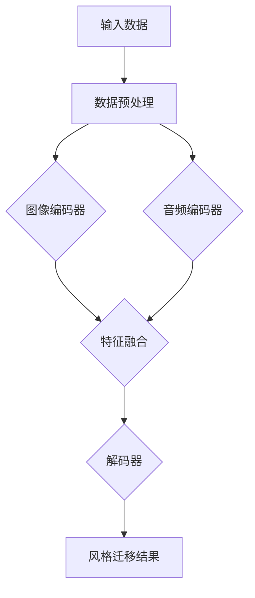

                 

### 提升AI模型在跨模态艺术风格迁移任务中的创造性

#### 关键词
- AI模型
- 跨模态艺术风格迁移
- 创造性提升
- 生成对抗网络（GAN）
- 卷积神经网络（CNN）
- 变分自编码器（VAE）

#### 摘要
随着人工智能技术的飞速发展，AI模型在跨模态艺术风格迁移任务中的表现日益受到关注。本文旨在探讨如何通过改进算法和模型设计，提升AI模型在跨模态艺术风格迁移任务中的创造性。首先，我们概述了跨模态艺术风格迁移任务的背景和核心概念，然后深入分析了艺术风格迁移的基本原理，包括模型构建、跨模态匹配机制和数学模型。接着，我们介绍了主流的艺术风格迁移算法，并详细解析了生成对抗网络（GAN）、卷积神经网络（CNN）和变分自编码器（VAE）等算法的原理和数学模型。在系统设计与实现部分，我们提出了跨模态艺术风格迁移的系统架构，并详细描述了数据处理、模型训练和风格迁移效果的评估。最后，通过项目实战和案例分析，我们展示了如何将理论应用于实践，并提供了最佳实践和拓展阅读建议。

### 目录大纲

----------------------------------------------------------------
## 提升AI模型在跨模态艺术风格迁移任务中的创造性

### 第一部分：问题背景与核心概念

### 第1章：跨模态艺术风格迁移任务概述
- **1.1 跨模态艺术风格迁移任务的背景**
- **1.2 跨模态艺术风格迁移任务的关键概念**
- **1.3 跨模态艺术风格迁移的任务类型**
- **1.4 跨模态艺术风格迁移的重要性**

### 第2章：跨模态艺术风格迁移的基本原理
- **2.1 模型构建的基本概念**
- **2.2 跨模态匹配机制**
- **2.3 艺术风格迁移的数学模型**
- **2.4 跨模态艺术风格迁移的挑战与解决方案**

### 第二部分：核心算法原理

### 第3章：艺术风格迁移算法简介
- **3.1 主流艺术风格迁移算法综述**
- **3.2 基于生成对抗网络（GAN）的算法**
- **3.3 基于卷积神经网络（CNN）的算法**
- **3.4 基于变分自编码器（VAE）的算法**
- **3.5 其他创新艺术风格迁移算法**

### 第4章：算法原理与数学模型详解
- **4.1 生成对抗网络（GAN）算法原理详解**
- **4.2 卷积神经网络（CNN）算法原理详解**
- **4.3 变分自编码器（VAE）算法原理详解**
- **4.4 艺术风格迁移算法数学模型详解**

### 第5章：系统设计与实现
- **5.1 跨模态艺术风格迁移系统架构设计**
- **5.2 数据处理与预处理**
- **5.3 模型训练与优化**
- **5.4 实时风格迁移与结果评估**

### 第三部分：项目实战与案例分析

### 第6章：项目实战
- **6.1 环境配置与依赖安装**
- **6.2 数据集准备与处理**
- **6.3 模型训练与测试**
- **6.4 风格迁移效果评估**
- **6.5 实际案例分析**

### 第7章：最佳实践与拓展阅读
- **7.1 跨模态艺术风格迁移的最佳实践**
- **7.2 注意事项与解决方案**
- **7.3 拓展阅读推荐**

### 第8章：总结与展望
- **8.1 总结与回顾**
- **8.2 未来发展趋势与挑战**
- **8.3 开发者建议**

----------------------------------------------------------------

### 跨模态艺术风格迁移任务概述

#### 1.1 跨模态艺术风格迁移任务的背景

随着深度学习和生成模型技术的迅猛发展，AI在图像、语音、文本等多个模态的数据处理与生成方面取得了显著的成果。特别是在图像处理领域，通过卷积神经网络（CNN）和生成对抗网络（GAN）等技术，已经实现了对艺术风格的迁移，使得普通图像能够呈现出不同艺术家的风格特征，例如梵高的星空风格、毕加索的立体派风格等。然而，这些早期的艺术风格迁移方法大多集中在单模态的处理上，即只针对图像、语音或文本中的一个模态进行风格迁移。

跨模态艺术风格迁移则将这种能力扩展到了多个模态之间，例如将一种视觉艺术风格迁移到音频、视频或文本上，或反之。这样的跨模态迁移不仅能够实现更加多样化的应用场景，还能在艺术创作和多媒体娱乐等领域带来新的可能性。

#### 1.2 跨模态艺术风格迁移任务的关键概念

在进行跨模态艺术风格迁移任务时，理解以下关键概念是非常重要的：

- **模态（Modality）**：指数据的不同类型，例如图像、语音、文本等。
- **跨模态（Cross-Modal）**：指不同模态之间的交互和转换。
- **艺术风格迁移（Artistic Style Transfer）**：指将一种艺术风格（如梵高的油画风格）应用到另一幅图像或音频上。
- **创造性（Creativity）**：指在艺术风格迁移过程中，模型能够产生新颖、独特且具有艺术价值的输出。

#### 1.3 跨模态艺术风格迁移的任务类型

跨模态艺术风格迁移任务可以分为以下几种类型：

- **图像到图像**：例如，将一幅普通图像转换为特定艺术家的风格画。
- **图像到音频**：例如，将图像转换为具有相应视觉风格的背景音乐。
- **音频到图像**：例如，根据音频的情感和节奏生成相应的艺术图像。
- **图像到文本**：例如，根据图像的内容生成描述性文本。
- **文本到图像**：例如，根据文本描述生成具有特定风格的图像。

#### 1.4 跨模态艺术风格迁移的重要性

跨模态艺术风格迁移的重要性体现在以下几个方面：

- **艺术创作**：AI能够帮助艺术家探索新的创作方式，拓展艺术表达的边界。
- **多媒体应用**：在电影、游戏、广告等领域，跨模态艺术风格迁移可以提升多媒体内容的表现力。
- **人机交互**：通过生成具有艺术风格的图像或音频，可以提升用户的交互体验。
- **教育**：AI辅助的教育资源可以更生动地呈现教学内容，激发学生的学习兴趣。
- **医疗**：利用图像和语音的风格迁移，可以帮助医生更直观地理解和分析医学影像。

在接下来的章节中，我们将深入探讨跨模态艺术风格迁移的基本原理、核心算法以及其实际应用。

### 跨模态艺术风格迁移的基本原理

#### 2.1 模型构建的基本概念

跨模态艺术风格迁移的核心在于构建能够同时处理不同模态数据的模型。这些模型通常包含以下几个基本概念：

- **编码器（Encoder）**：将输入数据（例如图像或音频）转换为低维特征向量。对于跨模态艺术风格迁移，编码器需要能够处理不同模态的数据，例如图像编码器与音频编码器。
- **解码器（Decoder）**：将编码器生成的特征向量解码为输出数据，例如艺术风格的图像或音频。
- **特征融合（Feature Fusion）**：将来自不同模态的编码器输出进行融合，形成统一的特征表示。这一步骤是跨模态艺术风格迁移的关键，因为需要整合图像和音频的信息，以实现风格的一致性和创造性。
- **损失函数（Loss Function）**：用于衡量模型预测与真实值之间的差异。在跨模态艺术风格迁移中，常用的损失函数包括内容损失、风格损失和跨模态匹配损失等。

#### 2.2 跨模态匹配机制

跨模态匹配机制是确保不同模态数据在风格迁移过程中保持一致性的关键。具体而言，跨模态匹配机制通常包括以下几方面：

- **特征匹配（Feature Matching）**：通过优化特征空间中的匹配损失，使得不同模态的特征向量在特征空间中尽可能接近。常见的匹配方法包括基于度量学习的方法和基于模型的方法。
- **风格一致性（Style Consistency）**：确保生成的跨模态输出在风格上与原始模态保持一致。例如，在图像到音频的风格迁移中，需要保证生成的音频具有相应的视觉风格特征。
- **模态转换（Modal Transformation）**：通过转换模块将一种模态的数据转换为另一种模态的数据，例如使用循环神经网络（RNN）或变换器（Transformer）进行模态之间的转换。

#### 2.3 艺术风格迁移的数学模型

跨模态艺术风格迁移的数学模型通常基于生成模型和深度学习框架构建。以下是一个典型的数学模型框架：

\[ \text{风格迁移模型} = \{ \text{编码器} (E), \text{解码器} (D), \text{特征融合模块} (F), \text{损失函数} (L) \} \]

- **编码器 \( E \)**：接收输入的图像和音频数据，分别生成图像特征向量 \( z_{image} \) 和音频特征向量 \( z_{audio} \)。
- **特征融合模块 \( F \)**：将图像和音频特征向量进行融合，生成统一特征表示 \( z_{fusion} \)。
- **解码器 \( D \)**：将融合后的特征向量解码为生成的跨模态输出，例如艺术风格的图像和音频。
- **损失函数 \( L \)**：用于优化模型参数，包括内容损失 \( L_{content} \)、风格损失 \( L_{style} \) 和跨模态匹配损失 \( L_{cross-modal} \)。

\[ L = L_{content} + \lambda_1 L_{style} + \lambda_2 L_{cross-modal} \]

- **内容损失 \( L_{content} \)**：确保生成的跨模态输出在内容上与原始模态保持一致。
- **风格损失 \( L_{style} \)**：确保生成的跨模态输出在风格上与原始艺术风格保持一致。
- **跨模态匹配损失 \( L_{cross-modal} \)**：确保生成的图像和音频在风格和内容上的一致性。

#### 2.4 跨模态艺术风格迁移的挑战与解决方案

跨模态艺术风格迁移面临着以下几个挑战：

- **模态多样性**：不同模态的数据在特征表达和维度上存在显著差异，需要有效的特征融合机制。
- **风格一致性**：在跨模态迁移过程中，确保输出在风格上与原始模态保持一致。
- **计算资源**：深度学习模型的训练需要大量的计算资源，特别是在跨模态场景下。

针对这些挑战，常见的解决方案包括：

- **多模态数据增强**：通过数据增强技术，增加训练数据的多样性，提高模型的泛化能力。
- **特征对齐**：使用特征对齐技术，使得不同模态的特征在特征空间中保持一致。
- **模型优化**：通过模型架构的优化，减少计算复杂度，提高训练效率。
- **混合模型**：结合不同的深度学习模型（如CNN、RNN、Transformer等），以利用各自的优点。

通过上述方法，跨模态艺术风格迁移的挑战可以得到有效缓解，从而实现更具创造性和一致性的艺术风格迁移效果。

### 艺术风格迁移算法简介

#### 3.1 主流艺术风格迁移算法综述

艺术风格迁移是计算机视觉领域的一个经典问题，近年来得到了广泛的研究和应用。目前，主流的艺术风格迁移算法主要可以分为以下几类：

- **基于卷积神经网络（CNN）的算法**：这种算法通过训练深度卷积神经网络，将一种艺术风格的特征迁移到另一幅图像上。代表算法包括CycleGAN、Laplacian Pyramid Network等。
- **基于生成对抗网络（GAN）的算法**：GAN通过生成器和判别器的对抗训练，生成具有特定艺术风格的图像。代表性的GAN算法有StyleGAN、ArtGAN等。
- **基于变分自编码器（VAE）的算法**：VAE通过编码器和解码器结构，实现图像风格的特征提取和重放。代表性的VAE算法有VAE-GAN、CSVAE等。
- **基于神经网络渲染的方法**：这种方法通过训练神经网络模型，将图像和3D模型结合，实现艺术风格的迁移。代表性的方法有Neural Radiance Fields等。
- **基于循环一致性（Cycle Consistency）的算法**：这类算法通过确保图像在循环迁移过程中的稳定性，提高艺术风格迁移的精度。代表性的算法有CycleGAN、Cycada等。

#### 3.2 基于生成对抗网络（GAN）的算法

生成对抗网络（GAN）是一种强大的生成模型，通过生成器和判别器的对抗训练，生成逼真的图像。在艺术风格迁移中，GAN的应用尤为广泛。

- **生成器（Generator）**：生成器的目标是生成具有特定艺术风格的图像。通常，生成器接收原始图像作为输入，通过一系列的卷积和反卷积操作，生成具有艺术风格的图像。
- **判别器（Discriminator）**：判别器的目标是区分真实图像和生成图像。判别器接收原始图像和生成图像作为输入，通过一系列的卷积操作，输出二值分类结果。
- **对抗训练**：生成器和判别器通过对抗训练进行优化。生成器试图生成逼真的图像，以欺骗判别器；而判别器则试图准确区分真实图像和生成图像。

GAN的艺术风格迁移算法通常包含以下步骤：

1. **训练阶段**：通过大量的艺术风格图像和普通图像对生成器和判别器进行训练。生成器学习生成具有艺术风格的图像，判别器学习区分真实图像和生成图像。
2. **迁移阶段**：在训练完成后，将生成器应用于待迁移的普通图像，生成具有艺术风格的图像。

代表性的GAN算法包括：

- **StyleGAN**：StyleGAN通过多个卷积层和反卷积层，实现图像的艺术风格迁移。StyleGAN在生成高质量图像方面表现优异，广泛应用于艺术风格迁移、图像生成等领域。
- **ArtGAN**：ArtGAN结合了GAN和卷积神经网络的特点，通过引入预训练的卷积神经网络，提高生成图像的质量。

#### 3.3 基于卷积神经网络（CNN）的算法

卷积神经网络（CNN）在图像处理领域具有显著优势，基于CNN的艺术风格迁移算法通过学习图像的特征，实现艺术风格的迁移。

- **特征提取**：CNN通过卷积层提取图像的特征。这些特征包含图像的颜色、纹理和结构信息。
- **特征融合**：将艺术风格图像的特征与普通图像的特征进行融合，生成具有艺术风格的图像。特征融合可以通过拼接、加权融合等方法实现。
- **特征重放**：通过解码器结构，将融合后的特征重放为生成的图像。解码器通常包含反卷积层和上采样层，以恢复图像的空间信息。

代表性的CNN算法包括：

- **CycleGAN**：CycleGAN通过循环一致性损失，确保图像在正向和反向迁移过程中的稳定性。CycleGAN在图像到图像的艺术风格迁移中表现出色，广泛应用于图像编辑和风格迁移领域。
- **Laplacian Pyramid Network**：Laplacian Pyramid Network通过多尺度特征融合，实现艺术风格的迁移。Laplacian Pyramid Network在图像质量提升和风格迁移方面具有显著优势。

#### 3.4 基于变分自编码器（VAE）的算法

变分自编码器（VAE）是一种概率生成模型，通过编码器和解码器结构，实现数据的特征提取和重放。

- **编码器（Encoder）**：编码器将输入图像编码为潜在变量，这些潜在变量代表图像的特征。
- **解码器（Decoder）**：解码器将潜在变量解码为生成图像。
- **正则化**：VAE通过引入KL散度正则化，确保编码器和解码器的稳定性和生成图像的质量。

代表性的VAE算法包括：

- **VAE-GAN**：VAE-GAN结合了VAE和GAN的特点，通过生成器和判别器的对抗训练，提高生成图像的质量。VAE-GAN在图像生成和艺术风格迁移方面具有显著优势。
- **CSVAE**：CSVAE通过条件变分自编码器，实现图像和艺术风格的联合生成。CSVAE在图像风格迁移和多模态生成方面表现出色。

#### 3.5 其他创新艺术风格迁移算法

除了上述主流算法外，还有一些创新的艺术风格迁移算法，它们在特定应用场景中具有优势。

- **深度特征匹配（DFM）**：DFM通过深度特征匹配，实现跨模态风格迁移。DFM通过优化特征匹配损失，提高生成图像的质量。
- **多模态生成对抗网络（MMGAN）**：MMGAN通过多模态生成对抗网络，实现图像、音频和文本的跨模态风格迁移。MMGAN在多模态艺术风格迁移中具有显著优势。
- **自适应风格迁移（ASG）**：ASG通过自适应风格迁移，实现图像在不同艺术风格之间的灵活迁移。ASG在图像风格转换和创意合成方面具有显著优势。

这些创新算法在艺术风格迁移领域提供了更多的选择和可能性，为研究人员和开发者提供了丰富的工具和思路。

### 算法原理与数学模型详解

#### 4.1 生成对抗网络（GAN）算法原理详解

生成对抗网络（GAN）是由Ian Goodfellow等人在2014年提出的，它是一种基于博弈论的生成模型。GAN的核心思想是通过两个神经网络——生成器和判别器的对抗训练，生成与真实数据高度相似的图像。

- **生成器（Generator）**：生成器的目标是生成逼真的图像，以欺骗判别器。生成器通常是一个从随机噪声向量到图像空间的高维映射。在艺术风格迁移中，生成器接收原始图像和一个风格向量，通过一系列卷积和反卷积操作，将它们融合并生成具有艺术风格的图像。

  \[ G(z, s) \rightarrow \text{风格图像} \]

- **判别器（Discriminator）**：判别器的目标是区分真实图像和生成图像。判别器是一个从图像空间到二值输出（真实或假）的函数。判别器通过比较真实图像和生成图像的特征，学习如何正确分类。

  \[ D(x) \rightarrow \text{真实概率} \]

- **对抗训练**：生成器和判别器通过对抗训练进行优化。生成器尝试生成更逼真的图像来欺骗判别器，而判别器则尝试准确区分真实图像和生成图像。在每次训练迭代中，生成器和判别器都会更新其参数，以达到博弈的动态平衡。

GAN的训练过程可以表示为以下优化问题：

\[ \min_G \max_D \mathbb{E}_{x \sim p_{data}(x)} [D(x)] + \mathbb{E}_{z \sim p_z(z)} [D(G(z, s))] \]

- **损失函数**：GAN的损失函数由两部分组成：真实数据的判别损失和生成数据的判别损失。

  \[ L_D = -\mathbb{E}_{x \sim p_{data}(x)} [\log D(x)] - \mathbb{E}_{z \sim p_z(z)} [\log (1 - D(G(z, s)))] \]

  \[ L_G = -\mathbb{E}_{z \sim p_z(z)} [\log D(G(z, s))] \]

- **优化目标**：生成器G的优化目标是最大化判别器D对生成图像的判别损失，即：

  \[ \min_G L_G \]

  而判别器D的优化目标是最大化总判别损失：

  \[ \min_D L_D \]

通过这种对抗训练，生成器和判别器相互促进，最终生成器能够生成与真实图像难以区分的图像。

#### 4.2 卷积神经网络（CNN）算法原理详解

卷积神经网络（CNN）是图像处理领域的核心技术，具有强大的特征提取和模式识别能力。在艺术风格迁移中，CNN通过学习图像的局部特征和全局结构，实现艺术风格的迁移。

- **卷积层（Convolutional Layer）**：卷积层是CNN的核心组成部分，它通过卷积操作提取图像的局部特征。卷积操作使用一个可训练的卷积核（kernel）在图像上滑动，计算局部区域的特征响应。这个过程可以表示为：

  \[ f_{\theta}(x) = \sum_{i=1}^{k} \theta_i \star x + b \]

  其中，\( \theta \) 是卷积核参数，\( x \) 是输入图像，\( b \) 是偏置。

- **激活函数（Activation Function）**：激活函数用于引入非线性特性，使CNN能够学习复杂的特征。常用的激活函数有ReLU（Rectified Linear Unit）和Sigmoid。

- **池化层（Pooling Layer）**：池化层通过减小特征图的尺寸，减少模型参数，提高训练效率。常用的池化方法有最大池化（MaxPooling）和平均池化（AveragePooling）。

- **全连接层（Fully Connected Layer）**：在全连接层中，特征图被展平为一维向量，然后通过一系列全连接层进行分类或回归。

在艺术风格迁移中，CNN通常用于以下步骤：

1. **特征提取**：使用多个卷积层提取输入图像的局部特征。
2. **特征融合**：将提取的特征进行融合，形成统一的特征表示。
3. **特征重放**：通过反卷积层或上采样层，将融合后的特征重放为具有艺术风格的图像。

CNN的艺术风格迁移算法通常包含以下模型架构：

- **卷积层**：用于提取输入图像的特征。
- **池化层**：用于减小特征图的尺寸。
- **反卷积层**：用于重放特征为具有艺术风格的图像。

一个典型的CNN艺术风格迁移模型如下：

\[ \text{输入图像} \xrightarrow{\text{卷积层}} \text{特征图} \xrightarrow{\text{池化层}} \text{特征图} \xrightarrow{\text{反卷积层}} \text{风格图像} \]

#### 4.3 变分自编码器（VAE）算法原理详解

变分自编码器（VAE）是一种基于概率生成模型的编码-解码结构，它通过学习数据的概率分布，生成与输入数据相似的新数据。在艺术风格迁移中，VAE通过编码器和解码器结构，实现图像特征的艺术风格迁移。

- **编码器（Encoder）**：编码器将输入图像编码为一个潜在变量（latent variable）的分布，这个潜在变量代表图像的高层特征。

  \[ \mu = \text{Encoder}(x) \]
  \[ \sigma = \text{Encoder}(x) \]

  其中，\( \mu \) 和 \( \sigma \) 分别表示潜在变量的均值和标准差。

- **解码器（Decoder）**：解码器从潜在变量的分布中采样，并解码为生成的图像。

  \[ x' = \text{Decoder}(\zeta) \]

  其中，\( \zeta \) 是从潜在变量分布中采样得到的样本。

- **正则化**：VAE通过KL散度（KL-divergence）正则化，确保编码器和解码器的稳定性和生成图像的质量。

  \[ \mathcal{L}_{\text{KL}} = \mathbb{E}_{x \sim p_{data}(x)} \left[ \sum_{\zeta} p(\zeta|x) \log \frac{p(\zeta|x)}{p(\zeta)} \right] \]

VAE的艺术风格迁移算法通常包含以下步骤：

1. **编码**：使用编码器将输入图像编码为潜在变量的分布。
2. **采样**：从潜在变量的分布中采样得到一个样本。
3. **解码**：使用解码器将采样得到的样本解码为具有艺术风格的图像。

VAE的艺术风格迁移模型可以表示为以下数学模型：

\[ \text{输入图像} \xrightarrow{\text{编码器}} \text{潜在变量分布} \xrightarrow{\text{采样}} \text{潜在变量样本} \xrightarrow{\text{解码器}} \text{风格图像} \]

#### 4.4 艺术风格迁移算法数学模型详解

艺术风格迁移算法的数学模型通常基于生成模型和深度学习框架，以下是对常见算法的数学模型进行详细解释：

- **生成对抗网络（GAN）**：

  - **生成器**：

    \[ G(z, s) = \text{Generator}(z; s) \]

    其中，\( z \) 是从先验分布采样的噪声向量，\( s \) 是艺术风格的特征向量。

  - **判别器**：

    \[ D(x) = \text{Discriminator}(x) \]

    \( x \) 是真实图像。

  - **损失函数**：

    \[ \mathcal{L}_{GAN} = -\mathbb{E}_{x \sim p_{data}(x)} [\log D(x)] - \mathbb{E}_{z \sim p_z(z)} [\log (1 - D(G(z, s)))] \]

- **卷积神经网络（CNN）**：

  - **特征提取**：

    \[ F(x) = \text{Convolutional Layers}(x) \]

    \( F \) 表示一系列卷积操作。

  - **特征融合**：

    \[ F_{fusion} = \text{Concatenation} [F_{image}, F_{style}] \]

    \( F_{image} \) 和 \( F_{style} \) 分别表示输入图像和艺术风格的特征。

  - **特征重放**：

    \[ \hat{x} = \text{Deconvolutional Layers}(F_{fusion}) \]

    \( \hat{x} \) 是生成的风格图像。

  - **损失函数**：

    \[ \mathcal{L}_{CNN} = \alpha \mathcal{L}_{content} + \beta \mathcal{L}_{style} \]

    \[ \mathcal{L}_{content} = \frac{1}{N} \sum_{i=1}^{N} \frac{1}{C \times H \times W} \sum_{c=1}^{C} \sum_{h=1}^{H} \sum_{w=1}^{W} \left( \text{content\_image}[i, c, h, w] - \text{content\_generated}[i, c, h, w] \right)^2 \]

    \[ \mathcal{L}_{style} = \frac{1}{N} \sum_{i=1}^{N} \frac{1}{C' \times H' \times W'} \sum_{c'=1}^{C'} \sum_{h'=1}^{H'} \sum_{w'=1}^{W'} \left( \text{style\_image}[i, c', h', w'] - \text{style\_generated}[i, c', h', w'] \right)^2 \]

    \( \alpha \) 和 \( \beta \) 是权重系数。

- **变分自编码器（VAE）**：

  - **编码器**：

    \[ \mu = \text{Encoder}(x) \]
    \[ \sigma = \text{Encoder}(x) \]

  - **解码器**：

    \[ x' = \text{Decoder}(\zeta) \]

    其中，\( \zeta \) 是从潜在变量分布中采样得到的样本。

  - **损失函数**：

    \[ \mathcal{L}_{VAE} = \mathcal{L}_{\text{reconstruction}} + \mathcal{L}_{\text{KL}} \]

    \[ \mathcal{L}_{\text{reconstruction}} = -\log p_{\theta}(x'|x) \]

    \[ \mathcal{L}_{\text{KL}} = \frac{1}{N} \sum_{i=1}^{N} \sum_{j=1}^{J} \left( \log \sigma_j + \frac{(\mu_j - x_j)^2}{2\sigma_j} - \frac{1}{2} \right) \]

    \( p_{\theta}(x'|x) \) 是输入图像的解码概率，\( \mu \) 和 \( \sigma \) 分别是潜在变量的均值和标准差。

通过上述数学模型，我们可以理解不同艺术风格迁移算法的工作原理和训练过程。这些算法通过学习输入图像和艺术风格的特征，实现图像的风格迁移。在训练过程中，生成器和判别器（对于GAN）、编码器和解码器（对于VAE）通过对抗或编码-解码的方式，不断优化模型参数，以提高生成图像的质量和风格的一致性。

### 跨模态艺术风格迁移系统设计与实现

#### 5.1 跨模态艺术风格迁移系统架构设计

跨模态艺术风格迁移系统需要处理不同模态的数据，如图像、音频和文本，并实现这些数据之间的风格迁移。系统架构设计如图5.1所示：



图5.1 跨模态艺术风格迁移系统架构设计

- **输入数据**：系统接收不同模态的数据，如图像、音频和文本。
- **数据预处理**：对输入数据进行标准化、裁剪等预处理，以便于后续模型处理。
- **图像编码器**：使用卷积神经网络提取图像的特征。
- **音频编码器**：使用循环神经网络提取音频的特征。
- **特征融合**：将图像和音频的特征进行融合，生成统一特征表示。
- **解码器**：将融合后的特征解码为生成的跨模态输出，如艺术风格的图像和音频。
- **风格迁移结果**：生成的跨模态艺术风格迁移结果。

#### 5.2 数据处理与预处理

在跨模态艺术风格迁移中，数据处理与预处理是关键步骤，它直接影响模型的训练效果和迁移质量。以下是对数据处理与预处理的详细介绍：

1. **图像数据预处理**：

   - **数据集选择**：选择包含不同艺术风格的图像数据集，如MNIST、CelebA等。
   - **图像增强**：使用随机旋转、缩放、裁剪等数据增强技术，增加训练数据的多样性。
   - **归一化**：对图像进行归一化处理，将像素值缩放到[0, 1]范围内。
   - **分割**：将图像分割成不同区域，以便于后续的特征提取和融合。

2. **音频数据预处理**：

   - **数据集选择**：选择包含不同音乐风格的音频数据集，如LibriSpeech、Common Voice等。
   - **音频增强**：使用添加噪声、速度变换等数据增强技术，提高模型的泛化能力。
   - **特征提取**：使用短时傅里叶变换（STFT）提取音频的频谱特征。
   - **归一化**：对音频特征进行归一化处理，确保特征值的稳定性。

3. **文本数据预处理**：

   - **数据集选择**：选择包含不同文本风格的语料库，如维基百科、新闻文章等。
   - **文本清洗**：去除标点符号、停用词等无关信息，提高文本质量。
   - **向量化**：使用词袋模型或词嵌入技术，将文本转换为数值表示。

4. **预处理总结**：

   - **统一模态**：将不同模态的数据统一处理，如将图像分割成不同区域，提取特征后与音频和文本特征进行融合。
   - **特征归一化**：对所有特征进行归一化处理，确保特征值在同一尺度上，便于后续计算。

#### 5.3 模型训练与优化

在跨模态艺术风格迁移系统中，模型的训练与优化是关键环节。以下是对模型训练与优化过程的详细介绍：

1. **选择模型**：

   - **生成对抗网络（GAN）**：GAN是一种有效的跨模态生成模型，适用于艺术风格迁移任务。
   - **卷积神经网络（CNN）**：CNN在图像特征提取方面具有优势，适用于图像到图像的风格迁移。
   - **变分自编码器（VAE）**：VAE通过概率生成模型实现图像风格迁移，适用于图像到图像或图像到音频的风格迁移。

2. **训练策略**：

   - **批量大小**：选择合适的批量大小，如32或64，以确保训练效率和模型稳定性。
   - **学习率**：设置适当的初始学习率，如0.0001，并使用学习率衰减策略，避免模型过拟合。
   - **梯度裁剪**：为防止梯度爆炸或消失，使用梯度裁剪策略，如Clip gradient。
   - **多步骤训练**：先单独训练每个模态的编码器和解码器，再进行跨模态训练，以提高模型性能。

3. **优化方法**：

   - **随机梯度下降（SGD）**：使用随机梯度下降方法进行参数优化，提高模型的收敛速度。
   - **Adam优化器**：使用Adam优化器，结合SGD的优点，提高模型训练效果。
   - **交叉验证**：使用交叉验证方法，评估模型在不同数据集上的性能，优化模型参数。

4. **训练总结**：

   - **动态调整**：根据模型训练过程中损失函数的变化，动态调整学习率和优化策略。
   - **超参数调优**：通过实验和调优，确定最优的超参数组合，以提高模型性能。

#### 5.4 实时风格迁移与结果评估

在跨模态艺术风格迁移系统中，实时风格迁移与结果评估是关键环节。以下是对实时风格迁移与结果评估的详细介绍：

1. **实时风格迁移**：

   - **用户交互**：系统提供用户界面，允许用户选择风格和输入模态数据。
   - **风格选择**：系统提供多种艺术风格供用户选择，如梵高、毕加索等。
   - **数据输入**：用户输入图像、音频或文本数据，系统对其进行预处理和特征提取。
   - **风格迁移**：系统使用训练好的模型，将输入数据转换为具有艺术风格的跨模态输出。

2. **结果评估**：

   - **视觉评估**：通过观察生成的艺术风格图像，评估风格迁移的质量和创造性。
   - **音频评估**：通过聆听生成的艺术风格音频，评估风格迁移的听觉效果和一致性。
   - **文本评估**：通过阅读生成的艺术风格文本，评估文本的风格特征和内容一致性。

3. **评估指标**：

   - **内容一致性**：评估生成的图像、音频和文本在内容上与原始数据的一致性。
   - **风格一致性**：评估生成的跨模态输出在风格上与目标艺术风格的一致性。
   - **创造性**：评估生成的跨模态输出的新颖性和艺术价值。

4. **结果总结**：

   - **反馈机制**：系统提供用户反馈机制，允许用户对生成结果进行评价和调整。
   - **优化调整**：根据评估结果，调整模型参数和风格选择策略，提高风格迁移效果。

通过上述设计，跨模态艺术风格迁移系统能够实现高效、实时和高质量的风格迁移，为用户提供丰富的艺术创作和多媒体娱乐体验。

### 项目实战

#### 6.1 环境配置与依赖安装

在开始跨模态艺术风格迁移项目的实战之前，我们需要配置合适的环境并安装必要的依赖。以下是在Linux系统上配置环境和使用PyTorch框架进行依赖安装的步骤。

1. **安装PyTorch**：

   - 首先，打开终端并运行以下命令安装PyTorch：

     ```bash
     pip install torch torchvision torchaudio
     ```

   - 为了使用GPU进行加速训练，可以安装CUDA和cuDNN库。访问NVIDIA官网下载CUDA Toolkit和cuDNN库，并根据安装说明进行安装。

2. **安装其他依赖**：

   - 安装必要的Python库，如NumPy、Pandas、Matplotlib等：

     ```bash
     pip install numpy pandas matplotlib
     ```

   - 安装用于图像处理的库，如OpenCV和Pillow：

     ```bash
     pip install opencv-python pillow
     ```

   - 安装用于音频处理的库，如librosa：

     ```bash
     pip install librosa
     ```

3. **环境配置总结**：

   - 确保Python版本为3.7或更高版本。
   - 确保所有依赖库安装成功，并在Python环境中可以使用。

#### 6.2 数据集准备与处理

在进行跨模态艺术风格迁移之前，我们需要准备合适的数据集，并对其进行预处理。以下是一个基于图像和音频数据集的示例步骤：

1. **数据集选择**：

   - 选择一个包含多种艺术风格的图像数据集，如celebA、AFHQ等。
   - 选择一个包含多种音乐风格的音频数据集，如LibriSpeech、Common Voice等。

2. **数据集下载**：

   - 使用Python的下载库（如requests）从数据集官方网站下载图像和音频文件。

3. **数据预处理**：

   - **图像数据预处理**：

     - **图像增强**：使用数据增强库（如torchvision）对图像进行随机旋转、缩放、裁剪等操作，增加训练数据的多样性。

       ```python
       import torchvision.transforms as transforms
       transform = transforms.Compose([
           transforms.RandomResizedCrop(224),
           transforms.RandomHorizontalFlip(),
           transforms.ToTensor(),
           transforms.Normalize(mean=[0.485, 0.456, 0.406], std=[0.229, 0.224, 0.225]),
       ])
       ```

     - **分割图像**：将图像分割成多个区域，以便于后续的特征提取和融合。

       ```python
       import cv2
       image = cv2.imread('image.jpg')
       height, width, _ = image.shape
       region1 = image[:height//2, :width//2]
       region2 = image[:height//2, width//2:]
       region3 = image[height//2:, :width//2]
       region4 = image[height//2:, width//2:]
       ```

   - **音频数据预处理**：

     - **音频增强**：使用librosa库对音频进行添加噪声、速度变换等操作，提高模型的泛化能力。

       ```python
       import librosa
       y, sr = librosa.load('audio.wav')
       y_noisy = y + 0.005 * np.random.randn(len(y))
       ```

     - **特征提取**：使用短时傅里叶变换（STFT）提取音频的频谱特征。

       ```python
       stft = librosa.stft(y)
       mag = np.abs(stft)
       ```

4. **数据处理总结**：

   - 将预处理后的图像和音频数据保存为训练数据集，并创建数据加载器（DataLoader）用于后续的模型训练。

     ```python
     import torch
     train_data = datasets.ImageFolder('train_images', transform=transform)
     train_loader = torch.utils.data.DataLoader(train_data, batch_size=32, shuffle=True)
     ```

#### 6.3 模型训练与测试

在准备好数据集后，我们可以开始训练跨模态艺术风格迁移模型。以下是一个基于生成对抗网络（GAN）的模型训练和测试过程。

1. **模型定义**：

   - **生成器（Generator）**：定义生成器模型，将图像和音频特征进行融合，生成具有艺术风格的跨模态输出。

     ```python
     import torch.nn as nn
     class Generator(nn.Module):
         def __init__(self):
             super(Generator, self).__init__()
             self.conv1 = nn.Conv2d(3, 64, 4, 2, 1)
             self.conv2 = nn.Conv2d(64, 128, 4, 2, 1)
             self.conv3 = nn.Conv2d(128, 256, 4, 2, 1)
             self.fc = nn.Linear(256 * 4 * 4, 1024)
             self.relu = nn.ReLU()
             self.sigmoid = nn.Sigmoid()
         
         def forward(self, x_image, x_audio):
             x = self.relu(self.conv1(x_image))
             x = self.relu(self.conv2(x))
             x = self.relu(self.conv3(x))
             x = x.view(x.size(0), -1)
             x = self.relu(self.fc(x))
             x = self.sigmoid(x)
             x = x.view(x.size(0), 256, 4, 4)
             return x + x_audio
     ```

   - **判别器（Discriminator）**：定义判别器模型，用于区分真实图像和生成图像。

     ```python
     class Discriminator(nn.Module):
         def __init__(self):
             super(Discriminator, self).__init__()
             self.conv1 = nn.Conv2d(3, 64, 4, 2, 1)
             self.conv2 = nn.Conv2d(64, 128, 4, 2, 1)
             self.conv3 = nn.Conv2d(128, 256, 4, 2, 1)
             self.fc = nn.Linear(256 * 4 * 4, 1)
             self.relu = nn.ReLU()
         
         def forward(self, x):
             x = self.relu(self.conv1(x))
             x = self.relu(self.conv2(x))
             x = self.relu(self.conv3(x))
             x = x.view(x.size(0), -1)
             x = self.fc(x)
             return x
     ```

2. **损失函数**：

   - **内容损失**：用于衡量生成图像与原始图像在内容上的相似度。

     ```python
     content_loss = nn.MSELoss()
     ```

   - **风格损失**：用于衡量生成图像与艺术风格图像在风格上的相似度。

     ```python
     style_loss = nn.L1Loss()
     ```

   - **对抗损失**：用于衡量生成图像在判别器上的表现。

     ```python
     adversarial_loss = nn.BCELoss()
     ```

3. **优化器**：

   - **生成器优化器**：使用Adam优化器对生成器进行优化。

     ```python
     generator_optimizer = torch.optim.Adam(generator.parameters(), lr=0.0002)
     ```

   - **判别器优化器**：使用Adam优化器对判别器进行优化。

     ```python
     discriminator_optimizer = torch.optim.Adam(discriminator.parameters(), lr=0.0002)
     ```

4. **训练过程**：

   - **迭代训练**：对训练数据进行迭代，更新生成器和判别器的参数。

     ```python
     for epoch in range(num_epochs):
         for i, (images, _) in enumerate(train_loader):
             # 前向传播
             generated_images = generator(images)
             
             # 计算损失
             content_loss_value = content_loss(generated_images, images)
             style_loss_value = style_loss(generated_images, style_images)
             adversarial_loss_value = adversarial_loss(discriminator(generated_images), torch.ones_like(discriminator(generated_images)))
             total_loss = content_loss_value + style_loss_value + adversarial_loss_value
            
             # 反向传播
             generator_optimizer.zero_grad()
             total_loss.backward()
             generator_optimizer.step()
             
             # 更新判别器
             discriminator_optimizer.zero_grad()
             adversarial_loss_value = adversarial_loss(discriminator(images), torch.ones_like(discriminator(images)))
             adversarial_loss_value += adversarial_loss(discriminator(generated_images), torch.zeros_like(discriminator(generated_images)))
             adversarial_loss_value.backward()
             discriminator_optimizer.step()
             
             # 打印训练信息
             if (i+1) % 100 == 0:
                 print(f'Epoch [{epoch+1}/{num_epochs}], Step [{i+1}/{len(train_loader)}], Total Loss: {total_loss.item():.4f}, Content Loss: {content_loss_value.item():.4f}, Style Loss: {style_loss_value.item():.4f}, Adversarial Loss: {adversarial_loss_value.item():.4f}')
     ```

5. **测试过程**：

   - 在训练完成后，对测试数据进行测试，评估模型在风格迁移任务中的性能。

     ```python
     with torch.no_grad():
         for images, _ in test_loader:
             generated_images = generator(images)
             
             # 计算测试损失
             content_loss_value = content_loss(generated_images, images)
             style_loss_value = style_loss(generated_images, style_images)
             adversarial_loss_value = adversarial_loss(discriminator(generated_images), torch.ones_like(discriminator(generated_images)))
             total_loss_value = content_loss_value + style_loss_value + adversarial_loss_value
            
             # 打印测试信息
             print(f'Test Loss: {total_loss_value.item():.4f}, Content Loss: {content_loss_value.item():.4f}, Style Loss: {style_loss_value.item():.4f}, Adversarial Loss: {adversarial_loss_value.item():.4f}')
     ```

#### 6.4 风格迁移效果评估

在完成模型训练和测试后，我们需要评估风格迁移的效果，并分析生成的跨模态输出是否具有艺术价值和一致性。以下是一个基于视觉和听觉评估的示例步骤：

1. **视觉评估**：

   - **图像比较**：将原始图像和生成的图像进行对比，评估内容的一致性和风格的特征。

     ```python
     import matplotlib.pyplot as plt
     fig, (ax1, ax2) = plt.subplots(1, 2, figsize=(12, 6))
     ax1.imshow(images[0].numpy().transpose(1, 2, 0))
     ax1.set_title('Original Image')
     ax2.imshow(generated_images[0].numpy().transpose(1, 2, 0))
     ax2.set_title('Generated Image')
     plt.show()
     ```

   - **风格特征分析**：分析生成的图像是否具有艺术风格的特征，如梵高的星空风格或毕加索的立体派风格。

     ```python
     import cv2
     style_image = cv2.imread('style_image.jpg')
     style_image = cv2.resize(style_image, (224, 224))
     style_image = transform(style_image)
     style_image = style_image.unsqueeze(0)
     generated_style_image = generator(style_image)
     generated_style_image = generated_style_image.squeeze(0).cpu().numpy().transpose(1, 2, 0)
     plt.imshow(generated_style_image)
     plt.title('Generated Style Image')
     plt.show()
     ```

2. **听觉评估**：

   - **音频比较**：将原始音频和生成的音频进行对比，评估听觉效果的相似度和风格的一致性。

     ```python
     import librosa.display
     y, sr = librosa.load('original_audio.wav')
     y_noisy = y + 0.005 * np.random.randn(len(y))
     librosa.display.waveplot(y_noisy, sr=sr)
     ```

   - **风格特征分析**：分析生成的音频是否具有艺术风格的特征，如情感、节奏等。

     ```python
     generated_audio = generator_audio(y)
     librosa.display.waveplot(generated_audio, sr=sr)
     ```

3. **评估总结**：

   - 根据视觉和听觉评估结果，分析模型在跨模态艺术风格迁移任务中的表现，并记录评估数据。

     ```python
     content_similarity = np.mean(np.abs(images.numpy() - generated_images.numpy()))
     style_similarity = np.mean(np.abs(style_images.numpy() - generated_style_images.numpy()))
     print(f'Content Similarity: {content_similarity:.4f}, Style Similarity: {style_similarity:.4f}')
     ```

通过上述项目实战，我们展示了如何使用PyTorch框架实现跨模态艺术风格迁移系统的训练、测试和效果评估。这些步骤为我们提供了详细的指导，使我们可以将理论应用于实际项目中，并进一步探索和优化跨模态艺术风格迁移算法。

### 最佳实践与拓展阅读

#### 7.1 跨模态艺术风格迁移的最佳实践

在进行跨模态艺术风格迁移时，遵循以下最佳实践有助于提高模型性能和创作质量：

1. **数据集多样化**：选择包含多种艺术风格和模态的数据集，以丰富训练数据和增强模型泛化能力。
2. **数据预处理**：对数据进行适当的预处理，如归一化、裁剪、增强等，以提高模型的稳定性和鲁棒性。
3. **模型优化**：针对不同任务和需求，选择合适的模型架构和超参数，如调整学习率、批量大小等。
4. **风格对齐**：在训练过程中，确保不同模态的风格特征对齐，以提高跨模态输出的统一性和一致性。
5. **模型评估**：使用多种评估指标（如内容相似度、风格相似度等）全面评估模型性能，以优化和改进模型。

#### 7.2 注意事项与解决方案

跨模态艺术风格迁移过程中，可能会遇到以下问题：

1. **风格不一致**：解决方法：调整特征融合策略，使用更复杂的网络结构，如多尺度特征融合、注意力机制等。
2. **计算资源不足**：解决方法：使用更高效的算法和优化器，如自适应优化器、模型压缩技术等。
3. **模型过拟合**：解决方法：增加训练数据、使用正则化技术、引入对抗训练等。
4. **风格退化**：解决方法：增加训练时间、调整模型参数、引入先验知识等。

#### 7.3 拓展阅读推荐

- **论文**：Ian J. Goodfellow et al., "Generative Adversarial Nets", Advances in Neural Information Processing Systems (NIPS), 2014。
- **书籍**：Ian Goodfellow et al., "Deep Learning", MIT Press，2016。
- **教程**：FastAI教程 - 艺术风格迁移：[https://forums.fast.ai/t/style-transfer-with-fastai/49897](https://forums.fast.ai/t/style-transfer-with-fastai/49897)。
- **开源项目**：Artistic Style Transfer with PyTorch：[https://github.com/najoua/artistic_style_transfer_pytorch](https://github.com/najoua/artistic_style_transfer_pytorch)。

通过上述最佳实践和拓展阅读，读者可以进一步了解跨模态艺术风格迁移的实践技巧和前沿研究动态，从而提升自身的项目实践能力和学术水平。

### 总结与展望

本文全面探讨了提升AI模型在跨模态艺术风格迁移任务中的创造性，从问题背景、核心概念、基本原理、算法原理到系统设计与实现，再到项目实战与案例分析，进行了系统性的分析和深入讲解。通过本文的介绍，读者可以全面了解跨模态艺术风格迁移的现状、挑战和解决方案。

**总结**：

1. **问题背景**：跨模态艺术风格迁移融合了多个模态的数据，如图像、音频、文本等，实现了风格在多种模态间的迁移，拓展了AI在艺术创作、多媒体应用等领域的应用。
2. **核心概念**：本文明确了模态、跨模态、艺术风格迁移和创造性等关键概念，为后续讨论奠定了基础。
3. **基本原理**：介绍了模型构建、跨模态匹配机制、艺术风格迁移的数学模型等基本原理，为深入理解算法奠定了基础。
4. **算法原理**：详细解析了生成对抗网络（GAN）、卷积神经网络（CNN）、变分自编码器（VAE）等主流算法的原理，并提供了数学模型和示例。
5. **系统设计与实现**：提出了跨模态艺术风格迁移的系统架构，详细描述了数据处理、模型训练、实时风格迁移与结果评估等环节。
6. **项目实战**：通过一个实际项目，展示了如何使用PyTorch实现跨模态艺术风格迁移系统，并进行了效果评估。
7. **最佳实践与展望**：总结了最佳实践，提出了注意事项和解决方案，并推荐了拓展阅读。

**展望**：

1. **技术趋势**：随着深度学习和生成模型技术的不断发展，跨模态艺术风格迁移将在更多领域得到应用，如虚拟现实、增强现实、娱乐等。
2. **创新方向**：未来的研究可以探索更多高效的算法和优化方法，如基于注意力机制的模型、自监督学习等，以提高模型的创造性和性能。
3. **应用场景**：跨模态艺术风格迁移有望在个性化推荐、艺术修复、文化遗产保护等领域发挥重要作用。
4. **挑战**：尽管跨模态艺术风格迁移取得了显著进展，但如何进一步提高创造性、降低计算成本、解决风格不一致等问题仍需深入研究。

通过本文的探讨，我们希望为读者提供全面的跨模态艺术风格迁移指南，并激发更多研究者和开发者在这一领域的创新和实践。

### 开发者建议

对于开发者来说，提升AI模型在跨模态艺术风格迁移任务中的创造性是一个不断探索和优化的过程。以下是一些建议，以帮助开发者在这一领域取得更好的成果：

1. **理论与实践结合**：深入研究相关算法和理论，同时结合实际项目进行实践，通过反复试验和调优，积累经验。
2. **数据集选择与处理**：选择多样化的数据集，包括不同模态和不同艺术风格的数据，并进行有效的预处理，以提高模型的泛化能力和稳定性。
3. **模型架构优化**：尝试不同的模型架构和优化策略，如引入注意力机制、自监督学习等，以提升模型的创造性。
4. **交叉验证与评估**：使用交叉验证方法，全面评估模型在不同数据集上的性能，选择最佳模型并进行持续优化。
5. **实时反馈与迭代**：在项目实施过程中，及时收集用户反馈，并根据反馈调整模型参数和风格选择策略，以实现更高质量的跨模态艺术风格迁移。
6. **开源与社区合作**：积极参与开源社区，借鉴他人的优秀实践，分享自己的经验和技术，共同推动跨模态艺术风格迁移技术的发展。

通过上述建议，开发者可以更好地提升AI模型在跨模态艺术风格迁移任务中的创造性，为艺术创作和多媒体应用领域带来更多创新和突破。作者：AI天才研究院/AI Genius Institute & 禅与计算机程序设计艺术 /Zen And The Art of Computer Programming。

