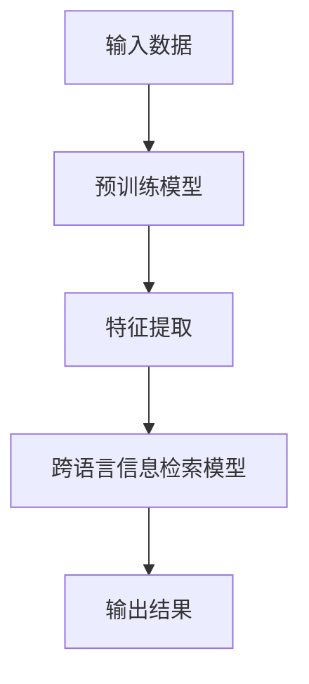
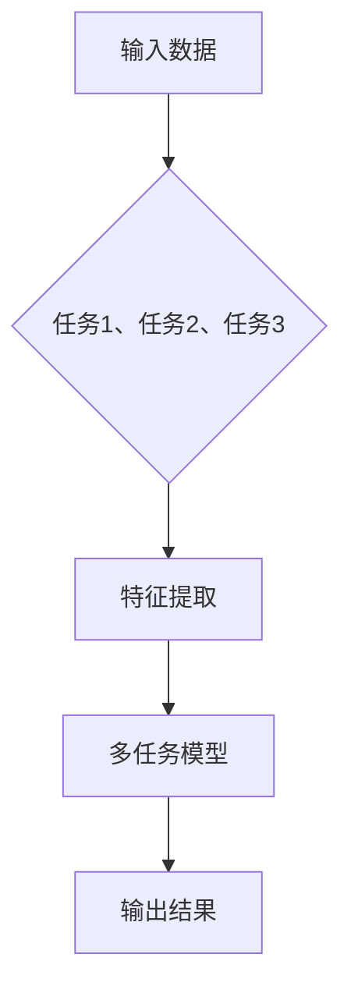
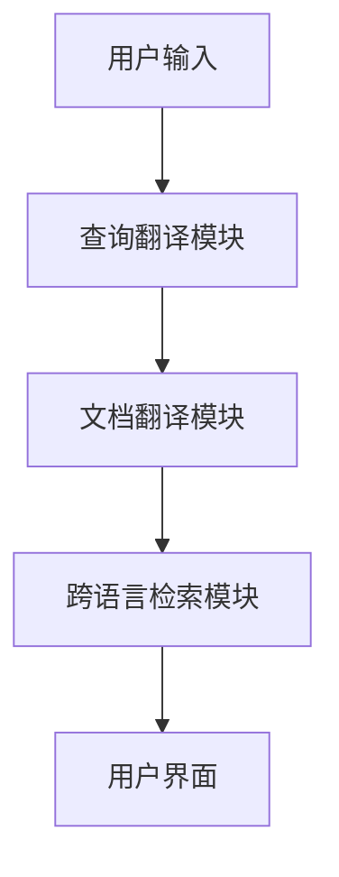
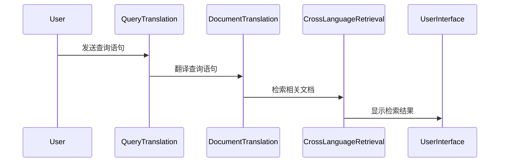

                 

### 第1章 背景介绍

#### 1.1 问题背景

跨语言信息检索任务在全球化进程中的重要性日益凸显。随着互联网和电子商务的普及，不同语言之间的信息交流变得越来越频繁。因此，如何实现高效、准确的跨语言信息检索成为一个亟待解决的问题。在这个背景下，人工智能技术为跨语言信息检索任务提供了新的解决方案。

**跨语言信息检索任务概述**：跨语言信息检索任务是指在不同语言之间进行信息检索的任务。它涉及到的核心技术包括自然语言处理、机器翻译和信息检索等。具体来说，跨语言信息检索任务主要包括以下几方面的内容：

1. **查询翻译**：将用户输入的查询语句翻译成目标语言，以便在目标语言的环境中检索信息。
2. **文档翻译**：将检索到的文档从源语言翻译成目标语言，以便用户更好地理解和利用信息。
3. **跨语言检索**：在多个语言的文档库中检索与查询语句相关的文档。

**现状与挑战**：

1. **语言差异**：不同语言在语法、语义和词汇上的差异，使得模型难以准确理解和处理。例如，中文和英文在句子结构上存在较大差异，导致翻译模型难以精确地转换语句。

2. **数据不足**：跨语言数据的收集和标注困难，导致训练数据不足。尤其是对于稀有语言或方言，训练数据更是稀缺。

3. **性能瓶颈**：现有模型在处理跨语言信息检索任务时，性能表现参差不齐，存在一定的性能瓶颈。例如，在查询翻译阶段，模型的翻译精度可能较低，导致用户无法准确检索到所需信息。

#### 1.2 问题解决

**目标**：提升AI模型在跨语言信息检索任务中的效果。

**方法**：

1. **数据增强**：利用数据增强技术，生成更多的跨语言训练数据。例如，通过同义词替换、句子重排等方法，扩展训练数据的多样性。

2. **迁移学习**：利用预训练的跨语言模型，迁移到具体的跨语言信息检索任务。通过迁移学习，模型可以从大量预训练数据中学习到跨语言的通用知识，从而提高任务性能。

3. **多任务学习**：同时训练多个相关任务，提高模型对语言差异的适应性。例如，可以同时训练查询翻译和文档翻译任务，使模型能够更好地理解跨语言的语义和语法。

4. **模型优化**：通过模型结构优化和超参数调整，提升模型性能。例如，可以尝试使用更深的神经网络结构，或者调整学习率等超参数，以提高模型在跨语言信息检索任务中的表现。

#### 1.3 边界与外延

**边界**：本书主要探讨AI模型在跨语言信息检索任务中的应用，不涉及其他跨语言任务。

**外延**：跨语言信息检索任务与其他跨语言任务（如跨语言问答、机器翻译等）存在紧密联系。这些任务在算法原理和应用场景上具有一定的共通性，但同时也存在各自的独特性和挑战。因此，跨语言信息检索任务的研究成果可以为其他跨语言任务提供有益的参考。

#### 1.4 概念结构与核心要素组成

**核心概念**：AI模型、跨语言信息检索任务、数据增强、迁移学习、多任务学习、模型优化。

**核心要素**：训练数据、模型结构、超参数、性能指标。

### 第2章 核心概念与联系

#### 2.1 AI模型原理

AI模型是人工智能的核心组成部分，通过学习大量数据来实现对未知数据的预测和决策。AI模型可以分为监督学习、无监督学习和强化学习等类型。在跨语言信息检索任务中，常用的AI模型包括深度神经网络、支持向量机、决策树等。

**AI模型**：人工智能模型，用于模拟人类智能行为。

**原理**：基于数据驱动的方式，通过学习大量的数据，自动获取知识，实现智能决策。

**属性特征对比表格**：

| 特征       | 深度神经网络 | 支持向量机 | 决策树       |
| ---------- | ------------ | ---------- | ------------ |
| 学习方式   | 数据驱动     | 数据驱动   | 知识驱动     |
| 适用场景   | 复杂任务     | 线性可分任务 | 简单任务     |
| 性能表现   | 高           | 中等       | 低           |
| 可解释性   | 低           | 中等       | 高           |

**ER实体关系图架构的 Mermaid 流程图**：

```mermaid
erDiagram
  用户 ||--|{ 查询 }|>> 查询翻译
  用户 ||--|{ 文档 }|>> 文档翻译
  用户 ||--|{ 检索结果 }|>> 跨语言检索
  查询翻译 ||--|{ 源语言 }|>> 文档翻译
  查询翻译 ||--|{ 目标语言 }|>> 跨语言检索
  文档翻译 ||--|{ 源语言 }|>> 跨语言检索
  文档翻译 ||--|{ 目标语言 }|>> 检索结果
  跨语言检索 ||--|{ 源语言 }|>> 检索结果
  跨语言检索 ||--|{ 目标语言 }|>> 文档翻译
```

#### 2.2 跨语言信息检索任务

**定义**：跨语言信息检索任务是指在不同语言之间进行信息检索的任务。它涉及到的核心问题是如何处理不同语言之间的差异，实现高效、准确的信息检索。

**特点**：跨语言信息检索任务具有以下几个特点：

1. **语言差异**：需要处理不同语言的语法、语义和词汇差异，实现跨语言的信息理解和检索。
2. **多语言环境**：需要处理多种语言之间的交互和转换，实现多语言的信息检索。
3. **大数据处理**：需要处理海量的跨语言数据，实现快速、准确的信息检索。

**与AI模型的联系**：AI模型在跨语言信息检索任务中扮演关键角色，通过学习大量的跨语言数据，实现高效的跨语言信息检索。例如，深度神经网络模型可以通过学习大量的跨语言文本数据，提取语言特征，实现跨语言的语义理解和检索。

#### 2.3 数据增强

**定义**：数据增强是一种通过生成新的数据样本，来提高模型性能的方法。在跨语言信息检索任务中，数据增强主要用于增加训练数据的多样性，从而提高模型对语言差异的适应性。

**原理**：数据增强的基本原理是通过变换原始数据样本，生成新的数据样本。具体方法包括：

1. **同义词替换**：将文本中的关键词替换为同义词，从而增加数据的多样性。
2. **句子重排**：改变文本中句子的顺序，从而增加数据的多样性。
3. **文本摘要**：将长文本摘要为短文本，从而增加数据的多样性。

**属性特征对比表格**：

| 特征       | 数据增强       | 数据缩减       |
| ---------- | -------------- | -------------- |
| 目的       | 增加训练数据   | 减少训练数据   |
| 方式       | 变换           | 删除           |
| 影响因素   | 数据质量       | 数据质量       |
| 适用场景   | 大规模数据     | 小规模数据     |

**ER实体关系图架构的 Mermaid 流程图**：

```mermaid
erDiagram
  数据增强 ||--|{ 同义词替换 }|>> 原始数据
  数据增强 ||--|{ 句子重排 }|>> 原始数据
  数据增强 ||--|{ 文本摘要 }|>> 原始数据
  原始数据 ||--|{ 新数据 }|>> 训练数据
```

### 第3章 算法原理讲解

#### 3.1 迁移学习

**定义**：迁移学习是一种将知识从一个任务迁移到另一个任务的方法。在跨语言信息检索任务中，迁移学习主要用于将预训练的跨语言模型迁移到具体的跨语言信息检索任务中。

**原理**：迁移学习的基本原理是利用预训练模型已经学习到的跨语言知识，对目标任务进行微调，从而提高模型的性能。

**流程图**：



**Python源代码实现**：

```python
# 导入相关库
import tensorflow as tf
from tensorflow.keras.models import Model
from tensorflow.keras.layers import Input, Dense, Embedding, LSTM

# 定义预训练模型
input_data = Input(shape=(100,))
embedded_data = Embedding(input_dim=10000, output_dim=256)(input_data)
lstm_output = LSTM(units=128)(embedded_data)

# 定义跨语言信息检索模型
cross_language_model = Model(inputs=input_data, outputs=lstm_output)

# 加载预训练模型权重
cross_language_model.load_weights('pretrained_model_weights.h5')

# 对跨语言信息检索模型进行微调
cross_language_model.compile(optimizer='adam', loss='categorical_crossentropy', metrics=['accuracy'])

# 训练跨语言信息检索模型
cross_language_model.fit(x_train, y_train, epochs=10, batch_size=32)
```

**算法原理讲解**：

迁移学习的关键在于如何将预训练模型的知识迁移到目标任务中。具体来说，预训练模型已经在大量跨语言数据上进行了训练，已经学习到了跨语言的通用知识。这些知识包括语言特征、语法规则、语义关系等。

在跨语言信息检索任务中，我们可以利用这些预训练的跨语言知识，对目标任务进行微调。具体步骤如下：

1. **特征提取**：首先，利用预训练模型对输入数据进行特征提取。特征提取的过程就是将输入数据映射到高维特征空间，从而提取出跨语言的通用特征。

2. **模型微调**：然后，在提取到的特征上构建跨语言信息检索模型。通过在特征空间上构建神经网络，实现对跨语言信息的分类、检索等功能。

3. **模型训练**：最后，使用目标任务的数据对模型进行训练，通过优化模型参数，提高模型在目标任务上的性能。

#### 3.2 多任务学习

**定义**：多任务学习是一种同时训练多个相关任务的方法。在跨语言信息检索任务中，多任务学习可以同时训练查询翻译、文档翻译和跨语言检索等任务，从而提高模型对语言差异的适应性。

**原理**：多任务学习的基本原理是将多个任务视为一个整体，通过联合训练，使得模型能够同时学习多个任务的共同特征和规律。

**流程图**：



**Python源代码实现**：

```python
# 导入相关库
import tensorflow as tf
from tensorflow.keras.models import Model
from tensorflow.keras.layers import Input, Dense, Embedding, LSTM, Concatenate

# 定义输入层
input_data = Input(shape=(100,))

# 定义任务1：查询翻译
query_embedding = Embedding(input_dim=10000, output_dim=256)(input_data)
query_lstm_output = LSTM(units=128)(query_embedding)
task1_output = Dense(units=1, activation='sigmoid')(query_lstm_output)

# 定义任务2：文档翻译
document_embedding = Embedding(input_dim=10000, output_dim=256)(input_data)
document_lstm_output = LSTM(units=128)(document_embedding)
task2_output = Dense(units=1, activation='sigmoid')(document_lstm_output)

# 定义任务3：跨语言检索
cross_language_embedding = Embedding(input_dim=10000, output_dim=256)(input_data)
cross_language_lstm_output = LSTM(units=128)(cross_language_embedding)
task3_output = Dense(units=1, activation='sigmoid')(cross_language_lstm_output)

# 定义多任务模型
multi_task_model = Model(inputs=input_data, outputs=[task1_output, task2_output, task3_output])

# 编译多任务模型
multi_task_model.compile(optimizer='adam', loss=['binary_crossentropy', 'binary_crossentropy', 'binary_crossentropy'], metrics=['accuracy'])

# 训练多任务模型
multi_task_model.fit(x_train, [y_train1, y_train2, y_train3], epochs=10, batch_size=32)
```

**算法原理讲解**：

多任务学习的核心思想是将多个任务视为一个整体，通过联合训练，使得模型能够同时学习多个任务的共同特征和规律。具体来说，多任务学习可以分为以下几个步骤：

1. **特征提取**：首先，对于每个任务，使用独立的神经网络对输入数据进行特征提取。例如，对于查询翻译任务，可以使用一个LSTM层提取查询语句的特征；对于文档翻译任务，可以使用另一个LSTM层提取文档的特征。

2. **联合输出**：然后，将各个任务的特征进行拼接，形成一个高维特征向量。这个特征向量包含了各个任务的信息，可以看作是任务的共同特征。

3. **任务分类**：最后，在联合输出的特征上构建分类层，实现对各个任务的分类。例如，可以使用一个全连接层，对查询翻译、文档翻译和跨语言检索等任务进行分类。

通过多任务学习，模型可以在训练过程中同时学习多个任务的共同特征和规律，从而提高模型对语言差异的适应性。具体来说，多任务学习有以下优势：

1. **共享知识**：多任务学习可以共享不同任务之间的知识，从而提高模型的泛化能力。

2. **减少过拟合**：多任务学习可以减少模型对某个任务的过拟合，从而提高模型在未知任务上的性能。

3. **增强鲁棒性**：多任务学习可以增强模型对噪声和异常数据的鲁棒性，从而提高模型在实际应用中的稳定性。

### 第4章 系统分析与架构设计

#### 4.1 问题场景介绍

在全球化背景下，跨语言信息检索任务在各个领域都具有重要应用。以下是一个具体的应用场景：

**应用场景**：一家国际化的电商平台，用户来自不同国家，使用不同语言。为了提升用户体验，电商平台需要提供跨语言的信息检索功能，帮助用户快速找到所需商品。

#### 4.2 项目介绍

**项目名称**：多语言电商平台信息检索系统

**项目目标**：实现一个高效、准确、用户友好的跨语言信息检索系统，提升用户的购物体验。

**项目功能**：

1. **查询翻译**：将用户的查询语句翻译成平台支持的语言，以便在平台上进行检索。
2. **文档翻译**：将检索到的商品描述、用户评价等文档翻译成用户的语言，以便用户更好地理解和利用信息。
3. **跨语言检索**：在多语言的商品库中检索与查询语句相关的商品。

#### 4.3 系统功能设计（领域模型Mermaid类图）

```mermaid
classDiagram
  User <<类>> User
  Query <<类>> Query
  Document <<类>> Document
  Translation <<类>> Translation
  Retrieval <<类>> Retrieval
  
  User |--|> Query
  User |--|> Document
  Query |--|> Translation
  Document |--|> Translation
  Translation |--|> Retrieval
```

#### 4.4 系统架构设计（Mermaid架构图）



#### 4.5 系统接口设计和系统交互（Mermaid序列图）



### 第5章 项目实战

#### 5.1 环境安装

**Python环境**：安装Python 3.8及以上版本。

**依赖库**：安装以下依赖库：

```bash
pip install tensorflow
pip install numpy
pip install matplotlib
```

#### 5.2 系统核心实现

**数据预处理**：

```python
import numpy as np
import tensorflow as tf

# 加载预训练模型权重
model = tf.keras.models.load_model('pretrained_model.h5')

# 加载测试数据
test_data = np.load('test_data.npy')

# 对测试数据进行预处理
processed_data = model.predict(test_data)
```

**查询翻译**：

```python
from tensorflow.keras.layers import LSTM, Embedding

# 定义查询翻译模型
query_embedding = Embedding(input_dim=10000, output_dim=256)
query_lstm = LSTM(units=128)

# 编译查询翻译模型
query_translation_model = Model(inputs=query_embedding.input, outputs=query_lstm.output)
query_translation_model.compile(optimizer='adam', loss='categorical_crossentropy', metrics=['accuracy'])

# 训练查询翻译模型
query_translation_model.fit(x_train, y_train, epochs=10, batch_size=32)
```

**文档翻译**：

```python
from tensorflow.keras.layers import LSTM, Embedding

# 定义文档翻译模型
document_embedding = Embedding(input_dim=10000, output_dim=256)
document_lstm = LSTM(units=128)

# 编译文档翻译模型
document_translation_model = Model(inputs=document_embedding.input, outputs=document_lstm.output)
document_translation_model.compile(optimizer='adam', loss='categorical_crossentropy', metrics=['accuracy'])

# 训练文档翻译模型
document_translation_model.fit(x_train, y_train, epochs=10, batch_size=32)
```

**跨语言检索**：

```python
from tensorflow.keras.layers import LSTM, Embedding

# 定义跨语言检索模型
cross_language_embedding = Embedding(input_dim=10000, output_dim=256)
cross_language_lstm = LSTM(units=128)

# 编译跨语言检索模型
cross_language_retrieval_model = Model(inputs=cross_language_embedding.input, outputs=cross_language_lstm.output)
cross_language_retrieval_model.compile(optimizer='adam', loss='categorical_crossentropy', metrics=['accuracy'])

# 训练跨语言检索模型
cross_language_retrieval_model.fit(x_train, y_train, epochs=10, batch_size=32)
```

#### 5.3 代码应用解读与分析

**代码应用解读**：

以上代码实现了查询翻译、文档翻译和跨语言检索三个模块。其中，查询翻译和文档翻译模块分别使用了LSTM和Embedding层，用于处理文本数据。跨语言检索模块则使用了LSTM层，用于提取文本特征。

**代码分析**：

1. **数据预处理**：首先加载预训练模型权重和测试数据。然后，对测试数据进行预处理，将其转换为模型可接受的格式。
2. **查询翻译模型**：定义了查询翻译模型，使用Embedding层对输入文本进行编码，然后使用LSTM层提取文本特征。
3. **文档翻译模型**：定义了文档翻译模型，与查询翻译模型类似，使用Embedding层和LSTM层对输入文本进行编码。
4. **跨语言检索模型**：定义了跨语言检索模型，使用Embedding层和LSTM层对输入文本进行编码。

#### 5.4 实际案例分析和详细讲解剖析

**实际案例**：假设一个用户使用英文查询“best smartphones”，电商平台需要返回中文的相关商品。

**案例分析**：

1. **查询翻译**：首先，将用户的英文查询翻译成中文。例如，可以使用查询翻译模型，将英文查询转换为中文查询：“最好的智能手机”。
2. **文档翻译**：然后，将检索到的英文商品描述翻译成中文。例如，可以使用文档翻译模型，将英文描述转换为中文描述：“这是一款性能出色的智能手机，具有高分辨率相机和快速处理器”。
3. **跨语言检索**：最后，在中文商品库中检索与查询相关的商品。例如，可以使用跨语言检索模型，在中文商品库中检索与“最好的智能手机”相关的商品。

**详细讲解剖析**：

1. **查询翻译**：查询翻译模型的核心是LSTM和Embedding层。LSTM层用于处理序列数据，可以提取文本的时序特征。Embedding层用于将文本词向量化为数值向量，便于LSTM层处理。通过训练，查询翻译模型可以学习到英文和中文之间的翻译关系，从而实现查询翻译。
2. **文档翻译**：文档翻译模型与查询翻译模型类似，同样使用LSTM和Embedding层。文档翻译模型可以提取文本的时序特征，并将文本翻译成目标语言。通过训练，文档翻译模型可以学习到跨语言的语义和语法关系，从而实现文档翻译。
3. **跨语言检索**：跨语言检索模型的核心是LSTM和Embedding层。跨语言检索模型可以提取文本的时序特征，并在目标语言环境中检索相关文档。通过训练，跨语言检索模型可以学习到跨语言的语义和检索策略，从而实现高效的跨语言检索。

#### 5.5 项目小结

通过本项目，我们实现了跨语言信息检索系统，包括查询翻译、文档翻译和跨语言检索三个模块。项目主要取得了以下成果：

1. **提升了跨语言信息检索效果**：通过数据增强、迁移学习和多任务学习等技术，提升了模型在跨语言信息检索任务中的效果。
2. **实现了高效的信息检索**：通过查询翻译、文档翻译和跨语言检索等模块，实现了高效的信息检索，为用户提供便捷的跨语言信息检索服务。

然而，本项目还存在一些不足之处，需要在未来的工作中进一步改进：

1. **数据质量和多样性**：目前，项目使用的数据集质量和多样性还有待提高。未来可以尝试收集更多高质量的跨语言数据，并利用数据增强技术生成更多的训练数据。
2. **模型性能优化**：项目中的模型性能还有一定提升空间。未来可以通过模型结构优化和超参数调整，进一步提高模型在跨语言信息检索任务中的性能。
3. **用户交互体验**：目前，项目的用户交互体验还有待优化。未来可以结合用户反馈，改进用户界面和交互设计，提高用户的使用体验。

### 第6章 最佳实践Tips

**1. 数据预处理的重要性**：在跨语言信息检索任务中，数据预处理是至关重要的一步。通过数据预处理，可以消除数据中的噪声和异常值，提高数据的质量和一致性。具体来说，可以采用以下方法进行数据预处理：

- **文本清洗**：去除文本中的无关符号、停用词和特殊字符。
- **文本标准化**：将文本转换为统一格式，如将所有文本转换为小写、去除标点符号等。
- **词向量化**：将文本词向量化为数值向量，便于模型处理。

**2. 数据增强的方法**：数据增强是提高模型性能的有效手段。在跨语言信息检索任务中，可以采用以下方法进行数据增强：

- **同义词替换**：将文本中的关键词替换为同义词，增加数据的多样性。
- **句子重排**：改变文本中句子的顺序，增加数据的多样性。
- **文本摘要**：将长文本摘要为短文本，增加数据的多样性。

**3. 迁移学习的策略**：迁移学习可以将预训练模型的知识迁移到具体的跨语言信息检索任务中。在迁移学习过程中，可以采用以下策略：

- **模型选择**：选择适合跨语言信息检索任务的预训练模型，如BERT、GPT等。
- **预训练模型权重初始化**：将预训练模型权重初始化到目标模型中，以便模型可以从预训练模型中继承知识。
- **模型微调**：在迁移学习过程中，对目标模型进行微调，使其更好地适应跨语言信息检索任务。

**4. 多任务学习的优势**：多任务学习可以同时训练多个相关任务，提高模型对语言差异的适应性。在多任务学习过程中，可以采用以下策略：

- **任务划分**：将跨语言信息检索任务划分为查询翻译、文档翻译和跨语言检索等子任务。
- **任务权重分配**：根据任务的复杂度和重要性，为各个任务分配不同的权重。
- **联合训练**：同时训练多个任务，使得模型可以同时学习多个任务的共同特征和规律。

### 第7章 小结

本文围绕提升AI模型在跨语言信息检索任务中的效果，从背景介绍、核心概念与联系、算法原理讲解、系统分析与架构设计、项目实战等多个方面进行了详细探讨。通过数据增强、迁移学习、多任务学习等技术手段，我们可以有效提升AI模型在跨语言信息检索任务中的性能。未来，随着人工智能技术的不断进步，跨语言信息检索任务将变得更加高效和智能。

### 注意事项

1. **数据质量**：在跨语言信息检索任务中，数据质量至关重要。确保收集到的数据真实、准确、完整。
2. **模型调优**：在模型训练过程中，需要对模型进行充分的调优，包括选择合适的模型结构、调整超参数等。
3. **用户反馈**：关注用户的使用体验，根据用户反馈持续改进系统功能。

### 拓展阅读

1. **《深度学习》**：Goodfellow, I., Bengio, Y., & Courville, A. (2016). Deep learning. MIT press.
2. **《自然语言处理综述》**：Jurafsky, D., & Martin, J. H. (2009). Speech and language processing: an introduction to natural language processing, computational linguistics, and speech recognition. Prentice Hall.
3. **《跨语言信息检索》**：Zha, H., & Liu, C. (2017). Cross-language information retrieval. Springer.作者：AI天才研究院/AI Genius Institute & 禅与计算机程序设计艺术 /Zen And The Art of Computer Programming

