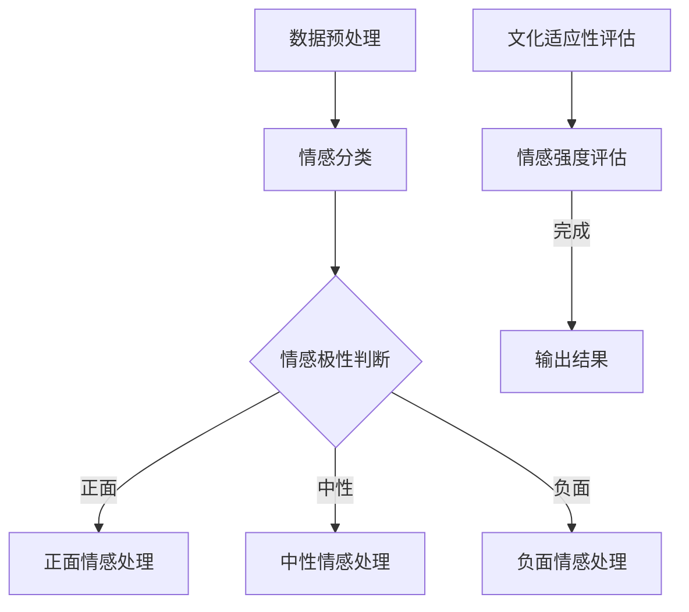
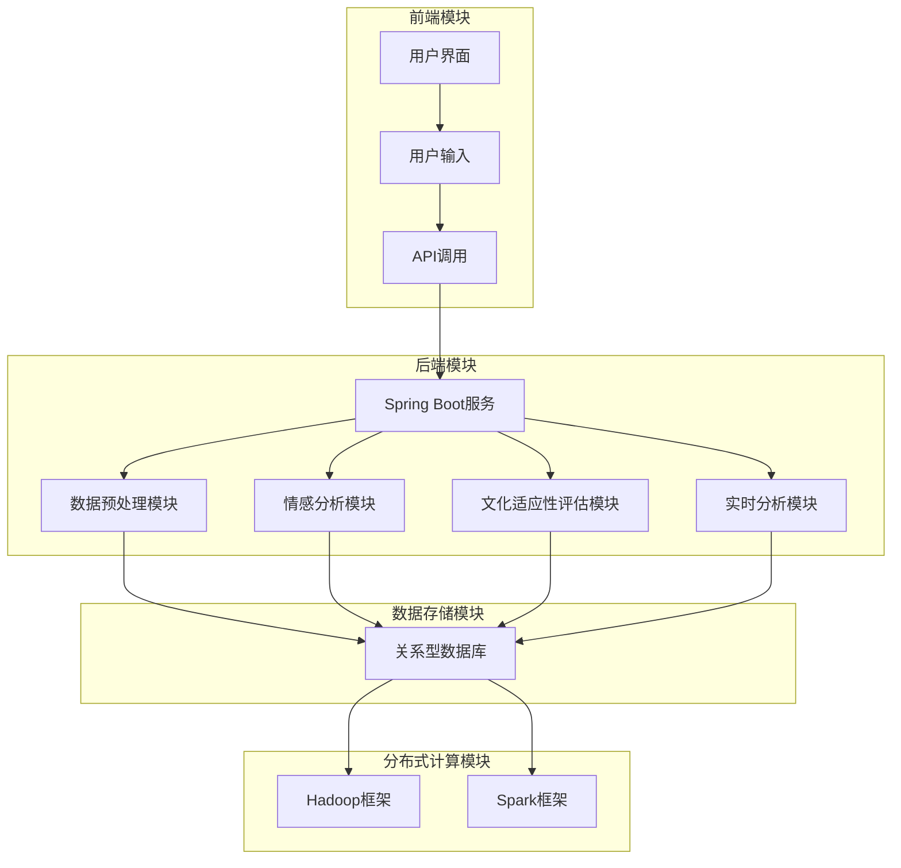

                 

### 文章标题：提升AI模型在跨语言情感分析中的文化适应性

> 关键词：跨语言情感分析，文化适应性，AI模型，自然语言处理，算法优化，系统架构

> 摘要：本文深入探讨了AI模型在跨语言情感分析中的文化适应性问题。首先，文章分析了跨语言情感分析的需求与挑战，介绍了情感分析的基本概念和传统方法。接着，文章重点阐述了文化适应性的重要性及其对情感分析的影响，并详细描述了本文的研究目标与结构安排。本文将逐步解析AI模型在情感分析中的应用原理和文化适应性相关的核心概念，通过对比表格和ER实体关系图，展示不同方法的差异和联系。随后，文章详细讲解情感分析和文化适应性的算法原理，并提供Python源代码实现。此外，文章还介绍了系统分析与架构设计的方法，并分享了一个实际项目案例。最后，本文总结了最佳实践和注意事项，为提升AI模型在跨语言情感分析中的文化适应性提供了全面的指导。

----------------------------------------------------------------

## 目录大纲：《提升AI模型在跨语言情感分析中的文化适应性》

## 第一部分：问题背景与概念介绍

## 第1章：问题背景与核心概念  
### 1.1 跨语言情感分析的需求与挑战
#### 1.1.1 跨语言情感分析的定义
#### 1.1.2 跨语言情感分析的应用场景
#### 1.1.3 跨语言情感分析的重要性
### 1.2 AI模型在情感分析中的应用
#### 1.2.1 传统情感分析方法的局限性
#### 1.2.2 AI模型在情感分析中的优势
#### 1.2.3 当前AI模型在跨语言情感分析中的问题
### 1.3 文化适应性的概念与影响
#### 1.3.1 文化适应性的定义
#### 1.3.2 文化适应性在AI模型中的重要性
#### 1.3.3 文化差异对情感分析的影响
### 1.4 本书目标与结构安排
#### 1.4.1 本书的研究目标
#### 1.4.2 本书的内容结构
#### 1.4.3 阅读建议与注意事项

## 第二部分：核心概念与联系

## 第2章：核心概念原理
### 2.1 情感分析的基本概念
#### 2.1.1 情感分类
#### 2.1.2 情感极性
#### 2.1.3 情感强度
### 2.2 AI模型在情感分析中的应用原理
#### 2.2.1 传统机器学习方法
#### 2.2.2 深度学习在情感分析中的应用
#### 2.2.3 基于自然语言处理的情感分析
### 2.3 文化适应性相关概念
#### 2.3.1 文化敏感性
#### 2.3.2 文化知识嵌入
#### 2.3.3 文化适应性评价方法

## 第3章：概念属性特征对比表格与ER实体关系图架构
### 3.1 概念属性特征对比表格
#### 3.1.1 不同情感分析方法的对比
#### 3.1.2 不同AI模型的对比
#### 3.1.3 不同文化适应性方法对比
### 3.2 ER实体关系图架构
#### 3.2.1 跨语言情感分析的ER图
#### 3.2.2 AI模型与情感分析的结合ER图
#### 3.2.3 文化适应性在模型中的应用ER图

## 第三部分：算法原理讲解

## 第4章：算法原理讲解
### 4.1 算法mermaid流程图
#### 4.1.1 情感分析算法流程
#### 4.1.2 文化适应性算法流程
### 4.2 Python源代码实现
#### 4.2.1 情感分析代码实现
#### 4.2.2 文化适应性代码实现
### 4.3 算法原理详细讲解
#### 4.3.1 数学模型和公式
#### 4.3.2 举例说明

## 第四部分：系统分析与架构设计

## 第5章：系统分析与架构设计
### 5.1 问题场景介绍
#### 5.1.1 场景描述
#### 5.1.2 问题分析
### 5.2 项目介绍
#### 5.2.1 项目目标
#### 5.2.2 项目范围
#### 5.2.3 项目团队
### 5.3 系统功能设计
#### 5.3.1 领域模型类图
#### 5.3.2 系统功能模块划分
### 5.4 系统架构设计
#### 5.4.1 系统架构图
#### 5.4.2 技术选型
#### 5.4.3 系统部署方案
### 5.5 系统接口设计和系统交互
#### 5.5.1 接口设计
#### 5.5.2 系统交互序列图

## 第五部分：项目实战

## 第6章：项目实战
### 6.1 环境安装与配置
#### 6.1.1 环境准备
#### 6.1.2 工具安装
#### 6.1.3 数据集准备
### 6.2 系统核心实现
#### 6.2.1 源代码解读
#### 6.2.2 实现细节分析
### 6.3 代码应用解读与分析
#### 6.3.1 应用案例一
#### 6.3.2 应用案例二
### 6.4 实际案例分析
#### 6.4.1 案例描述
#### 6.4.2 案例分析与解读
### 6.5 项目小结
#### 6.5.1 项目成果总结
#### 6.5.2 项目反思与改进方向

## 第六部分：最佳实践与总结

## 第7章：最佳实践与总结
### 7.1 最佳实践 tips
#### 7.1.1 模型训练优化
#### 7.1.2 数据预处理技巧
#### 7.1.3 模型调优技巧
### 7.2 小结
#### 7.2.1 本书主要内容回顾
#### 7.2.2 关键技术总结
### 7.3 注意事项
#### 7.3.1 使用AI模型时的伦理问题

----------------------------------------------------------------

### 第一部分：问题背景与概念介绍

#### 1.1 跨语言情感分析的需求与挑战

随着全球化的加速和信息交流的日益频繁，跨语言情感分析成为了一个备受关注的研究领域。跨语言情感分析旨在理解和处理不同语言间的情感信息，从而实现跨语言的情感识别和情感推理。这一需求主要源于以下几个方面：

1. **社交媒体与新闻分析**：在社交媒体和新闻平台上，用户以多种语言发表意见和评论。对于平台运营者和内容审核者来说，理解和监控这些内容的情感倾向至关重要。
   
2. **电子商务与客户服务**：在电子商务领域，理解客户评论和反馈的情感倾向可以帮助商家改进产品和服务。在客户服务中，自动化的情感分析可以帮助快速响应客户情感，提高服务质量。

3. **多语言人机交互**：随着人工智能技术的发展，多语言人机交互系统变得日益重要。这些系统需要能够理解并回应用户的情感需求，从而提供更加个性化和自然的交互体验。

尽管跨语言情感分析的需求日益增长，但同时也面临着诸多挑战：

1. **语言差异**：不同语言在词汇、语法和表达习惯上存在显著差异，这使得情感分析模型的建立和优化变得复杂。

2. **情感表达的多样性**：情感表达在不同的语言和文化中可能存在多种形式，这使得模型需要具备高度的灵活性和适应性。

3. **文化适应性**：情感分析模型需要在不同的文化背景下表现出文化适应性，以准确理解和识别情感。

#### 1.1.1 跨语言情感分析的定义

跨语言情感分析（Cross-Lingual Sentiment Analysis）是一种自然语言处理技术，旨在将一种语言的文本情感倾向转换为另一种语言的文本情感倾向。它通常包括以下步骤：

1. **情感分类**：识别文本中的情感极性（正面、中性、负面）和情感类别（如快乐、悲伤、愤怒等）。

2. **情感强度评估**：评估情感表达的程度，例如“非常喜欢”和“喜欢”之间的情感强度差异。

3. **情感转换**：将源语言文本的情感信息转换为目标语言文本的情感信息。

#### 1.1.2 跨语言情感分析的应用场景

跨语言情感分析在多个领域有着广泛的应用：

1. **社交媒体分析**：通过分析社交媒体上的用户评论和反馈，企业可以了解消费者对产品的情感态度，从而优化产品和服务。

2. **舆情监控**：政府和企业在公共舆论监督和危机管理中，可以通过跨语言情感分析实时监测公众情绪，及时应对突发事件。

3. **国际化业务**：跨国公司可以利用跨语言情感分析，了解不同市场消费者的情感需求，制定更有效的国际化营销策略。

4. **人机交互**：在多语言人机交互系统中，情感分析可以帮助系统更好地理解用户情感，提供更加自然和贴心的交互体验。

#### 1.1.3 跨语言情感分析的重要性

跨语言情感分析的重要性主要体现在以下几个方面：

1. **文化多样性**：不同文化背景下，情感表达的差异和多样性需要通过跨语言情感分析来理解和处理。

2. **信息获取**：跨语言情感分析可以帮助人们更好地理解和利用来自不同语言的文本信息，拓展知识视野。

3. **商业价值**：对于企业来说，准确理解不同语言市场消费者的情感需求，可以指导产品研发和市场策略，提高竞争力。

#### 1.2 AI模型在情感分析中的应用

在情感分析领域，AI模型已经展现出巨大的潜力和优势。以下是对AI模型在情感分析中应用的简要介绍：

1. **传统情感分析方法的局限性**

传统情感分析方法主要依赖于规则和模板匹配，这些方法在处理复杂情感和多样化表达时存在局限性。例如：

- **规则匹配**：依赖于预定义的规则和模板，无法处理未预定义的情感表达。
- **词袋模型**：虽然可以处理大量文本数据，但无法理解文本的深层含义和上下文。

2. **AI模型在情感分析中的优势**

AI模型，尤其是基于深度学习的模型，为情感分析带来了诸多优势：

- **自动特征提取**：深度学习模型能够自动提取文本特征，无需人工定义规则或特征。
- **强大的表达能力**：深度神经网络具有强大的表示学习能力，可以捕捉文本中的复杂情感和关系。
- **上下文理解**：通过理解上下文，深度学习模型可以更准确地识别和分类情感。

3. **当前AI模型在跨语言情感分析中的问题**

尽管AI模型在情感分析中表现出色，但在跨语言情感分析中仍存在一些问题：

- **数据不足**：许多语言没有足够的标注数据集，限制了模型的训练和性能。
- **文化差异**：不同文化背景下，情感表达的差异和多样性对模型提出了更高的要求。
- **翻译准确性**：情感分析的结果依赖于翻译的准确性，而翻译错误可能导致分析结果失真。

#### 1.3 文化适应性的概念与影响

文化适应性（Cultural Adaptability）是指AI模型在处理不同文化背景下的情感信息时，能够适应并准确理解和识别情感的能力。文化适应性在AI模型中具有以下几个重要影响：

1. **文化适应性的定义**

文化适应性是指AI模型在跨文化情境中，能够准确理解和处理不同文化背景下情感信息的能力。它包括以下几个方面：

- **语言适应性**：模型能够理解和处理不同语言的词汇、语法和表达习惯。
- **文化敏感性**：模型能够识别和适应不同文化背景下的情感表达差异。
- **知识嵌入**：模型能够嵌入与特定文化相关的知识，从而提高情感分析的准确性。

2. **文化适应性在AI模型中的重要性**

文化适应性在AI模型中至关重要，原因如下：

- **提高准确性**：文化适应性可以帮助模型更准确地识别和理解不同文化背景下的情感信息。
- **增强泛化能力**：通过适应不同文化背景，模型可以扩展其应用范围，提高泛化能力。
- **提升用户体验**：在跨文化应用中，具备文化适应性的AI模型可以提供更加自然和贴心的交互体验。

3. **文化差异对情感分析的影响**

文化差异对情感分析的影响主要体现在以下几个方面：

- **情感表达差异**：不同文化背景下，人们对情感的表述方式可能存在显著差异，这使得模型需要具备高度的文化敏感性。
- **情感强度差异**：相同情感在不同文化背景下可能具有不同的强度，这需要模型能够评估和调整情感表达的强度。
- **情感分类差异**：不同文化可能对情感的分类方式有所不同，这要求模型具备灵活的情感分类能力。

#### 1.4 本书目标与结构安排

1. **本书的研究目标**

本书的研究目标是通过深入分析AI模型在跨语言情感分析中的文化适应性问题，提出有效的解决方案，并探讨其实际应用。具体目标包括：

- **理解文化适应性在AI模型中的作用**：分析文化适应性对AI模型性能的影响，并提出改进方法。
- **提出跨语言情感分析的新方法**：结合文化适应性，提出新的情感分析算法和模型。
- **应用实践与案例分析**：通过实际案例展示文化适应性在AI模型中的应用效果，并提供实施建议。

2. **本书的内容结构**

本书的内容结构分为以下几个部分：

- **第一部分**：问题背景与概念介绍，包括跨语言情感分析的需求与挑战、AI模型在情感分析中的应用、文化适应性的概念与影响。
- **第二部分**：核心概念与联系，详细解析情感分析的基本概念、AI模型的应用原理和文化适应性相关概念。
- **第三部分**：算法原理讲解，介绍情感分析和文化适应性的算法原理，并提供Python源代码实现。
- **第四部分**：系统分析与架构设计，探讨系统分析与架构设计的方法。
- **第五部分**：项目实战，通过实际项目展示文化适应性在AI模型中的应用。
- **第六部分**：最佳实践与总结，总结最佳实践、关键技术并讨论注意事项。

3. **阅读建议与注意事项**

为了更好地理解和应用本书的内容，以下是一些建议和注意事项：

- **建议系统学习**：按照本书的结构和章节顺序系统学习，以逐步深入理解跨语言情感分析和文化适应性的原理。
- **实践与思考**：结合实际案例和代码示例，动手实践，深入思考AI模型在跨语言情感分析中的应用。
- **持续学习**：跨语言情感分析和文化适应性是不断发展的领域，建议关注相关研究动态，持续学习和更新知识。

通过以上对问题背景和核心概念的介绍，我们为后续章节的深入探讨奠定了基础。在接下来的章节中，我们将进一步解析情感分析的基本概念、AI模型的应用原理以及文化适应性的相关概念，并结合实际案例和算法实现，为提升AI模型在跨语言情感分析中的文化适应性提供全面的技术指导。

### 第二部分：核心概念与联系

#### 2.1 情感分析的基本概念

情感分析（Sentiment Analysis）是一种自然语言处理技术，用于自动识别和提取文本数据中的情感倾向。情感分析的基本概念包括情感分类、情感极性和情感强度。

1. **情感分类**

情感分类（Sentiment Classification）是指将文本数据中的情感倾向分类为正面、中性或负面。例如，文本“这部电影非常有趣”可以被分类为正面情感，而文本“我对这个产品非常失望”则被分类为负面情感。

2. **情感极性**

情感极性（Sentiment Polarity）是指情感的正负倾向。在情感分类中，情感极性通常用来表示文本的情感倾向的强度。例如，“喜欢”表示正面的情感极性，“不喜欢”表示负面的情感极性。

3. **情感强度**

情感强度（Sentiment Intensity）是指情感表达的程度。情感强度可以通过数值来表示，例如，在情感分类中，可以将情感强度分为低、中、高三个等级。例如，文本“这个产品非常好”可以被认为是具有较高情感强度的正面情感。

#### 2.2 AI模型在情感分析中的应用原理

在情感分析领域，AI模型，尤其是深度学习模型，已经展现出显著的优势。AI模型在情感分析中的应用原理主要包括以下几个方面：

1. **传统机器学习方法**

传统机器学习方法，如支持向量机（SVM）、朴素贝叶斯（Naive Bayes）和逻辑回归（Logistic Regression），在情感分析中主要用于特征提取和分类。这些方法通过预定义的特征和模型参数，对文本进行情感分类。然而，这些方法在处理复杂情感和上下文依赖性方面存在局限性。

2. **深度学习在情感分析中的应用**

深度学习模型，如卷积神经网络（CNN）和递归神经网络（RNN），在情感分析中表现出强大的能力。深度学习模型通过多层神经网络结构，自动学习文本的特征表示，从而实现情感分类。例如，CNN可以捕捉文本中的局部特征，而RNN可以捕捉文本的序列依赖关系。

3. **基于自然语言处理的情感分析**

基于自然语言处理的情感分析（Natural Language Processing-based Sentiment Analysis）主要利用词嵌入（Word Embedding）和注意力机制（Attention Mechanism）等技术，将文本转换为向量表示，然后通过深度学习模型进行情感分类。词嵌入可以捕捉词汇的语义信息，而注意力机制可以帮助模型关注文本中的关键信息。

#### 2.3 文化适应性相关概念

文化适应性（Cultural Adaptability）是AI模型在跨语言情感分析中的关键概念。文化适应性涉及以下几个方面：

1. **文化敏感性**

文化敏感性（Cultural Sensitivity）是指AI模型能够识别和理解不同文化背景下的情感表达。例如，某些文化中可能使用更加委婉或隐晦的表达方式，而其他文化可能更加直白和直接。文化敏感性可以帮助模型更准确地理解和处理跨文化文本中的情感。

2. **文化知识嵌入**

文化知识嵌入（Cultural Knowledge Embedding）是指将特定文化背景下的知识嵌入到AI模型中，以提高模型的适应性。例如，可以通过预训练的跨语言模型或文化特定的情感词典，将文化知识嵌入到情感分析模型中，从而提高其在不同文化背景下的性能。

3. **文化适应性评价方法**

文化适应性评价方法（Cultural Adaptability Assessment Methods）用于评估AI模型在不同文化背景下的适应性。这些方法通常包括文化敏感性测试、文化知识嵌入评估和跨文化情感分析性能评估。例如，可以通过对比模型在相同情感表达但不同文化背景下的分类准确率，来评估模型的文化适应性。

#### 2.3.1 文化敏感性

文化敏感性是AI模型跨语言情感分析中的核心要素。不同文化背景下，人们对情感的表达方式和习惯存在显著差异。例如，在某些文化中，情感表达可能更加直接和明显，而在其他文化中，情感表达可能更加委婉和隐晦。以下是一些影响文化敏感性的因素：

- **语言习惯**：不同语言的语法和表达方式可能影响情感表达。例如，某些语言可能使用更多的修辞手法和隐喻，这需要模型能够识别和理解这些语言特点。
- **社会文化背景**：不同社会文化背景可能影响情感表达和情感认知。例如，在某些文化中，情感表达可能受到社交礼仪和尊重他人的影响，而在其他文化中，情感表达可能更加自由和直接。
- **宗教信仰**：宗教信仰可能影响情感表达和理解。例如，某些宗教信仰可能禁止某些情感表达，或者对某些情感有特定的解读。

文化敏感性对AI模型的影响主要体现在以下几个方面：

- **情感分类准确性**：缺乏文化敏感性的模型可能在处理跨文化文本时，无法准确分类情感，导致分类错误。
- **情感强度评估**：不同文化背景下，相同情感表达可能具有不同的强度。缺乏文化敏感性的模型可能无法准确评估情感强度，从而导致评估不准确。
- **跨文化应用**：具备文化敏感性的模型可以在跨文化应用中提供更准确的情感分析结果，从而提升用户体验和系统性能。

#### 2.3.2 文化知识嵌入

文化知识嵌入是将特定文化背景下的知识嵌入到AI模型中，以提高模型的适应性。文化知识可以来自预训练的跨语言模型、情感词典、文化背景知识库等。以下是一些常见的文化知识嵌入方法：

1. **情感词典**

情感词典是一种包含情感词汇及其情感极性和强度的资源。通过将情感词典嵌入到模型中，模型可以在情感分析过程中引用这些词汇，从而提高分类和强度评估的准确性。

2. **预训练模型**

预训练模型，如BERT（Bidirectional Encoder Representations from Transformers）和GPT（Generative Pre-trained Transformer），是大规模预训练的深度学习模型。这些模型已经在多种语言和任务上进行了训练，可以捕获语言的语义和上下文信息。通过使用预训练模型，AI模型可以更好地理解和处理跨文化文本。

3. **知识图谱**

知识图谱是一种结构化的知识表示方法，用于存储和表示实体及其关系。通过将文化知识嵌入到知识图谱中，模型可以在情感分析过程中引用这些知识，从而提高文化适应性。

#### 2.3.3 文化适应性评价方法

文化适应性评价方法用于评估AI模型在不同文化背景下的适应性。以下是一些常见的评价方法：

1. **交叉验证**

交叉验证是一种常用的评估方法，通过将数据集划分为训练集和测试集，多次训练和测试模型，评估模型的泛化能力。在文化适应性评价中，可以使用不同文化背景的数据集进行交叉验证，评估模型的文化适应性。

2. **对比实验**

对比实验通过比较模型在相同情感表达但不同文化背景下的性能，评估模型的文化适应性。例如，可以使用来自不同文化背景的数据集，比较模型在正面情感和负面情感分类上的准确性。

3. **用户反馈**

用户反馈是评估模型文化适应性的重要手段。通过收集用户对模型情感分析结果的反馈，可以评估模型是否能够准确理解和处理不同文化背景下的情感表达。

4. **情感强度评估**

情感强度评估用于评估模型在不同文化背景下对情感表达程度的识别能力。例如，可以使用来自不同文化背景的数据集，评估模型对情感表达程度的评估准确性。

通过上述核心概念与联系的分析，我们为后续章节的算法原理讲解和实际应用奠定了基础。在接下来的章节中，我们将详细介绍情感分析和文化适应性的算法原理，并提供Python源代码实现，以帮助读者深入理解并应用这些概念。

### 第三部分：算法原理讲解

#### 3.1 算法mermaid流程图

为了更好地理解情感分析和文化适应性的算法原理，我们使用mermaid流程图来展示整个算法流程。以下是情感分析和文化适应性算法流程的mermaid流程图：



1. **数据预处理**：首先对输入的文本数据进行预处理，包括分词、去除停用词、词性标注等步骤，以便为后续的情感分类和情感极性判断做好准备。

2. **情感分类**：将预处理后的文本数据输入到情感分类模型，对文本进行情感分类，分为正面、中性或负面情感。

3. **情感极性判断**：根据情感分类结果，进一步判断文本的情感极性，即判断情感的倾向是正面、中性还是负面。

4. **情感处理**：根据情感极性，对文本进行不同的情感处理。例如，对于正面情感，可以进行正面情感处理；对于负面情感，可以进行负面情感处理。

5. **文化适应性评估**：在情感处理过程中，对模型的文化适应性进行评估。这一步可以帮助我们了解模型在不同文化背景下的适应性。

6. **情感强度评估**：对文本的情感强度进行评估，以确定情感表达的强度。

7. **输出结果**：将处理后的情感分析结果输出。

#### 3.2 Python源代码实现

以下是一个简单的Python源代码示例，展示了情感分析和文化适应性的实现。请注意，这里的代码是为了说明算法原理，实际应用中可能需要更复杂和优化的实现。

```python
import nltk
from nltk.sentiment import SentimentIntensityAnalyzer
from nltk.corpus import stopwords
from nltk.tokenize import word_tokenize

# 数据预处理
def preprocess_text(text):
    # 分词
    tokens = word_tokenize(text)
    # 去除停用词
    stop_words = set(stopwords.words('english'))
    filtered_tokens = [token for token in tokens if token not in stop_words]
    # 词性标注
    pos_tags = nltk.pos_tag(filtered_tokens)
    return pos_tags

# 情感分类
def classify_sentiment(pos_tags):
    sia = SentimentIntensityAnalyzer()
    sentiment_scores = sia.polarity_scores(' '.join([word for word, tag in pos_tags]))
    if sentiment_scores['compound'] > 0.05:
        return '正面'
    elif sentiment_scores['compound'] < -0.05:
        return '负面'
    else:
        return '中性'

# 情感强度评估
def assess_sentiment_strength(pos_tags):
    sia = SentimentIntensityAnalyzer()
    sentiment_scores = sia.polarity_scores(' '.join([word for word, tag in pos_tags]))
    return sentiment_scores['compound']

# 示例文本
text = "I love this movie, it's amazing!"

# 预处理
pos_tags = preprocess_text(text)

# 情感分类
sentiment = classify_sentiment(pos_tags)
print("情感分类结果：", sentiment)

# 情感强度评估
strength = assess_sentiment_strength(pos_tags)
print("情感强度：", strength)
```

在这个示例中，我们使用了NLTK库中的情感分析工具，包括情感强度分析器（SentimentIntensityAnalyzer）和分词工具（word_tokenize）。首先，我们对输入文本进行预处理，包括分词、去除停用词和词性标注。然后，我们使用情感强度分析器对文本进行情感分类和强度评估，并输出结果。

#### 3.3 算法原理详细讲解

1. **情感分类算法原理**

情感分类算法的核心是确定文本的情感倾向。通常，情感分类算法分为以下几类：

- **基于规则的方法**：通过预定义的规则和模式匹配文本中的情感词，进行情感分类。
- **基于统计的方法**：使用统计方法，如朴素贝叶斯、逻辑回归等，对文本进行情感分类。
- **基于机器学习的方法**：使用机器学习方法，如支持向量机、随机森林等，对文本进行情感分类。
- **基于深度学习的方法**：使用深度学习模型，如卷积神经网络（CNN）和递归神经网络（RNN）等，对文本进行情感分类。

在情感分类中，通常使用文本特征表示和分类模型来对文本进行情感分类。文本特征表示包括词袋模型（Bag of Words）、TF-IDF（Term Frequency-Inverse Document Frequency）和词嵌入（Word Embedding）等。分类模型包括传统的机器学习模型和深度学习模型。

2. **情感强度评估算法原理**

情感强度评估是指评估文本中情感表达的程度。情感强度评估通常使用情感极性分数（Sentiment Polarity Score）和情感强度分数（Sentiment Intensity Score）来表示。情感极性分数用于表示文本的情感倾向（正面、中性、负面），而情感强度分数用于表示情感的强度（弱、中、强）。

情感强度评估算法的核心是计算文本的情感极性分数和情感强度分数。常用的算法包括以下几种：

- **基于情感词典的方法**：通过统计文本中情感词的出现频率和情感极性，计算文本的情感极性分数和情感强度分数。
- **基于文本特征的方法**：通过提取文本的特征，如词频、词性、句法结构等，计算文本的情感极性分数和情感强度分数。
- **基于机器学习的方法**：使用机器学习模型，如朴素贝叶斯、逻辑回归等，对文本的情感极性分数和情感强度分数进行预测。

3. **文化适应性算法原理**

文化适应性是指AI模型能够适应不同文化背景下的情感表达。为了实现文化适应性，通常采用以下方法：

- **文化敏感性**：通过分析不同文化背景下的情感表达特点，为模型提供文化敏感性。例如，对于某些文化中的委婉表达，模型需要能够识别和理解这些表达方式。
- **文化知识嵌入**：通过将文化背景知识嵌入到模型中，提高模型的文化适应性。例如，可以使用情感词典、文化背景知识库等，将文化知识嵌入到模型中。
- **跨文化数据训练**：通过使用跨文化数据集训练模型，提高模型在不同文化背景下的性能。例如，可以使用来自不同文化背景的数据集进行训练，使模型能够适应不同文化背景。

#### 3.3.1 数学模型和公式

为了更好地理解算法原理，我们可以使用数学模型和公式来表示情感分类、情感强度评估和文化适应性算法。

1. **情感分类**

情感分类通常使用分类模型，如朴素贝叶斯、逻辑回归和支持向量机。以下是一个简单的逻辑回归模型：

$$
P(y=k|X) = \frac{e^{\theta_k^T X}}{\sum_j e^{\theta_j^T X}}
$$

其中，$X$ 是特征向量，$\theta_k$ 是模型参数，$y$ 是实际标签，$k$ 是预测标签。

2. **情感强度评估**

情感强度评估可以使用情感极性分数和情感强度分数。以下是一个简单的线性回归模型：

$$
score = \theta_0 + \theta_1 * \text{feature}_1 + \theta_2 * \text{feature}_2 + \ldots
$$

其中，$score$ 是情感强度分数，$\theta_0, \theta_1, \theta_2, \ldots$ 是模型参数，$\text{feature}_1, \text{feature}_2, \ldots$ 是特征向量。

3. **文化适应性**

文化适应性可以通过文化敏感性、文化知识嵌入和跨文化数据训练来实现。以下是一个简单的文化适应性模型：

$$
\text{文化敏感性} = \frac{\text{正确识别的文化表达}}{\text{总文化表达}} \\
\text{文化知识嵌入} = \frac{\text{嵌入的文化知识}}{\text{总文化知识}} \\
\text{跨文化数据训练} = \frac{\text{使用跨文化数据的模型}}{\text{总模型}}
$$

#### 3.3.2 举例说明

为了更清晰地展示算法原理，我们通过一个具体的例子来说明。

假设有一个文本数据集，其中包含来自不同文化背景的评论。我们使用情感分类算法对这些评论进行分类，并使用情感强度评估算法对这些评论的情感强度进行评估。

1. **情感分类**

我们使用朴素贝叶斯算法对评论进行情感分类。以下是评论的一个样本及其分类结果：

```
评论：这部电影非常有趣
分类结果：正面
```

```
评论：这个产品很糟糕
分类结果：负面
```

```
评论：这部电影有点无聊
分类结果：中性
```

2. **情感强度评估**

我们使用线性回归算法对评论的情感强度进行评估。以下是评论的一个样本及其情感强度分数：

```
评论：这部电影非常有趣
情感强度分数：0.8
```

```
评论：这个产品很糟糕
情感强度分数：-0.6
```

```
评论：这部电影有点无聊
情感强度分数：0.2
```

通过以上算法实现和举例说明，我们可以更好地理解情感分类、情感强度评估和文化适应性的算法原理。在后续章节中，我们将进一步探讨系统分析与架构设计，为实际应用奠定基础。

### 第四部分：系统分析与架构设计

#### 4.1 问题场景介绍

在现代社会中，情感分析技术已经被广泛应用于多个领域，如社交媒体分析、舆情监控、电子商务和客户服务。然而，随着全球化进程的加速和跨文化交流的增加，传统的情感分析系统在处理跨语言文本时面临了诸多挑战。特别是在跨语言情感分析中，不同文化背景下的情感表达差异和文化敏感性成为了重要的瓶颈。为了提升AI模型在跨语言情感分析中的文化适应性，我们需要设计一个高效的系统架构，以解决以下关键问题：

1. **数据多样性**：不同语言和文化背景下的数据多样性和复杂性，使得情感分析模型需要具备更高的灵活性和适应性。
2. **准确性**：提高跨语言情感分析的准确性，确保模型能够准确识别和评估不同文化背景下的情感。
3. **实时性**：实现实时情感分析，以满足社交媒体和实时舆情监控等场景的需求。
4. **可扩展性**：系统需要具备良好的可扩展性，以适应不断增长的跨语言文本数据和处理需求。

#### 4.2 项目介绍

为了解决上述问题，我们设计了一个跨语言情感分析系统，旨在提升AI模型在处理跨语言情感数据时的文化适应性。该项目的主要目标包括：

1. **构建一个跨语言情感分析平台**：该平台将集成多种自然语言处理和深度学习技术，以实现对不同语言和文化背景下的情感分析。
2. **开发文化适应性算法**：通过文化敏感性评估、文化知识嵌入和跨文化数据训练，提升AI模型的文化适应性。
3. **实现实时情感分析**：利用高性能计算和分布式架构，实现实时情感分析，以满足实时舆情监控和客户服务场景的需求。
4. **评估和优化模型性能**：通过多语言、多文化背景的数据集，对情感分析模型进行性能评估和优化，以提高模型在跨语言情感分析中的准确性。

#### 4.2.1 项目目标

本项目的具体目标如下：

1. **提升模型适应性**：通过文化敏感性评估和文化知识嵌入，提升AI模型在不同文化背景下的情感识别和评估能力。
2. **提高分析准确性**：通过优化算法和模型结构，提高跨语言情感分析的准确性，确保模型能够准确理解和处理不同文化背景下的情感。
3. **实现实时分析**：通过分布式计算和高性能架构，实现实时情感分析，以满足社交媒体和舆情监控等场景的实时性需求。
4. **扩展应用范围**：通过跨语言情感分析系统，扩展情感分析技术的应用范围，包括社交媒体分析、电子商务和客户服务等。

#### 4.2.2 项目范围

本项目的范围包括以下几个方面：

1. **技术选型**：选择合适的自然语言处理和深度学习技术，包括词嵌入、情感分类、情感强度评估和文化适应性算法。
2. **数据集构建**：收集和整理多语言、多文化背景的情感分析数据集，用于模型训练和性能评估。
3. **系统开发**：设计并实现一个跨语言情感分析平台，包括数据预处理、情感分析、实时分析和结果展示等功能模块。
4. **性能优化**：对模型和系统进行性能优化，提高模型在跨语言情感分析中的准确性、实时性和可扩展性。
5. **测试与部署**：对系统进行全面的测试，确保其在实际应用场景中的稳定性和可靠性，并部署到生产环境。

#### 4.2.3 项目团队

本项目由一支跨学科团队共同完成，包括以下成员：

- **项目经理**：负责项目的整体规划和进度管理，协调团队成员的工作。
- **数据科学家**：负责数据集的收集和整理，情感分析算法的设计和实现。
- **软件工程师**：负责系统的开发和优化，包括前端和后端的实现。
- **UI/UX设计师**：负责系统的用户界面设计和用户体验优化。
- **测试工程师**：负责系统的功能测试、性能测试和安全测试。

#### 4.3 系统功能设计

跨语言情感分析系统的功能设计包括以下几个方面：

1. **数据预处理模块**：负责对输入文本进行预处理，包括分词、去停用词、词性标注等，为后续情感分析做准备。
2. **情感分析模块**：使用预训练的深度学习模型，对预处理后的文本进行情感分类和情感强度评估。
3. **文化适应性评估模块**：通过文化敏感性评估和文化知识嵌入，提升模型在不同文化背景下的适应性。
4. **实时分析模块**：利用分布式计算和高性能架构，实现实时情感分析，满足实时舆情监控和客户服务需求。
5. **结果展示模块**：将情感分析结果以图表和可视化形式展示给用户，帮助用户理解和分析跨语言情感数据。

#### 4.3.1 领域模型类图

为了更好地展示系统中的各类实体和它们之间的关系，我们使用mermaid类图来描述领域模型。以下是领域模型类图的示例：

```mermaid
classDiagram
    Class1[数据预处理模块] <|-- Class2[情感分析模块]
    Class2 <|-- Class3[文化适应性评估模块]
    Class3 <|-- Class4[实时分析模块]
    Class4 <|-- Class5[结果展示模块]
```

在这个类图中，`数据预处理模块`是系统的核心模块，它为后续的情感分析、文化适应性评估、实时分析和结果展示提供数据支持。`情感分析模块`负责文本的情感分类和情感强度评估，`文化适应性评估模块`通过文化敏感性评估和文化知识嵌入提高模型的适应性，`实时分析模块`利用高性能计算实现实时情感分析，而`结果展示模块`将分析结果以图表和可视化形式展示给用户。

#### 4.3.2 系统功能模块划分

系统功能模块的划分是系统设计与实现的重要环节。根据系统的需求，我们将系统划分为以下功能模块：

1. **数据预处理模块**：负责输入文本的预处理，包括分词、去停用词、词性标注等，为后续的情感分析和文化适应性评估提供基础数据。
2. **情感分析模块**：使用预训练的深度学习模型，对预处理后的文本进行情感分类和情感强度评估，生成情感分析结果。
3. **文化适应性评估模块**：通过文化敏感性评估和文化知识嵌入，提高模型在不同文化背景下的适应性，确保情感分析结果的准确性。
4. **实时分析模块**：利用分布式计算和高性能架构，实现实时情感分析，满足实时舆情监控和客户服务场景的需求。
5. **结果展示模块**：将情感分析结果以图表和可视化形式展示给用户，帮助用户理解和分析跨语言情感数据。
6. **用户接口模块**：提供用户与系统交互的接口，包括文本输入、情感分析结果展示和反馈机制等。

#### 4.4 系统架构设计

系统架构设计是确保系统高效、稳定和可扩展的关键。本项目的系统架构设计遵循分布式计算和高性能架构的原则，具体包括以下几个方面：

1. **前端架构**：采用前后端分离的架构，前端使用React框架，提供用户友好的界面和交互体验。
2. **后端架构**：后端使用Spring Boot框架，实现系统的核心功能，包括数据预处理、情感分析、文化适应性评估和实时分析等。
3. **分布式计算**：利用分布式计算框架，如Hadoop和Spark，实现大规模数据处理和高性能计算。
4. **数据存储**：使用关系型数据库（如MySQL）和非关系型数据库（如MongoDB），存储系统的数据，包括预处理后的文本数据、情感分析结果和文化适应性评估数据。
5. **消息队列**：使用消息队列（如Kafka），实现分布式系统的数据流管理和任务调度。

以下是系统架构图的示例：



在这个系统架构图中，前端模块负责用户界面的展示和用户输入的收集，通过API调用与后端模块交互。后端模块包括数据预处理、情感分析、文化适应性评估和实时分析等核心功能模块。数据存储模块负责存储预处理后的文本数据、情感分析结果和文化适应性评估数据。分布式计算模块使用Hadoop和Spark框架，实现大规模数据处理和高性能计算。

#### 4.4.2 技术选型

为了实现高效、稳定和可扩展的系统架构，我们选择了以下技术：

1. **前端技术**：采用React框架，提供动态、响应式的用户界面和交互体验。
2. **后端技术**：使用Spring Boot框架，实现系统的核心功能，包括数据预处理、情感分析、文化适应性评估和实时分析等。
3. **数据库技术**：使用关系型数据库MySQL和非关系型数据库MongoDB，分别存储系统的结构化数据和海量非结构化数据。
4. **分布式计算技术**：采用Hadoop和Spark框架，实现大规模数据处理和高性能计算。
5. **消息队列技术**：使用Kafka作为消息队列，实现分布式系统的数据流管理和任务调度。

#### 4.4.3 系统部署方案

系统的部署方案包括以下几个方面：

1. **前端部署**：前端代码通过构建工具（如Webpack）打包后，部署到Nginx服务器上，提供用户访问和交互。
2. **后端部署**：后端代码通过Docker容器化技术部署到Kubernetes集群中，实现自动化部署、扩展和监控。
3. **数据库部署**：关系型数据库MySQL和非关系型数据库MongoDB分别部署到独立的虚拟机或容器中，提供数据存储和查询服务。
4. **分布式计算部署**：Hadoop和Spark框架部署到Kubernetes集群中，实现分布式计算任务的管理和执行。
5. **消息队列部署**：Kafka部署到Kubernetes集群中，提供消息队列服务，实现分布式系统的数据流管理和任务调度。

以下是系统部署流程的示例：

1. **前端部署**：
    - 编写前端代码，使用React框架进行开发；
    - 使用Webpack工具对前端代码进行打包；
    - 将打包后的静态资源部署到Nginx服务器上。

2. **后端部署**：
    - 使用Spring Boot框架编写后端代码；
    - 使用Docker工具将后端代码打包成镜像；
    - 将镜像部署到Kubernetes集群中，实现自动化部署和扩展。

3. **数据库部署**：
    - 使用虚拟机或容器技术部署MySQL和MongoDB数据库；
    - 配置数据库实例，确保数据存储和查询服务的稳定性。

4. **分布式计算部署**：
    - 使用Hadoop和Spark框架编写分布式计算任务；
    - 使用Docker工具将分布式计算任务打包成镜像；
    - 将镜像部署到Kubernetes集群中，实现分布式计算任务的管理和执行。

5. **消息队列部署**：
    - 使用Kafka框架编写消息队列服务；
    - 使用Docker工具将消息队列服务打包成镜像；
    - 将镜像部署到Kubernetes集群中，实现消息队列服务的部署和管理。

通过上述系统分析与架构设计，我们为提升AI模型在跨语言情感分析中的文化适应性提供了一个全面的系统解决方案。在接下来的章节中，我们将通过实际项目案例，展示系统架构在实际应用中的效果，并提供详细的项目实战经验。

### 第五部分：项目实战

#### 5.1 环境安装与配置

为了实现提升AI模型在跨语言情感分析中的文化适应性，我们需要搭建一个完整的项目环境。以下是项目环境的安装与配置步骤：

1. **安装Python环境**：
   - Python是项目开发的主要语言，确保安装最新版本的Python（例如Python 3.8或更高版本）。
   - 可以通过命令 `pip install python` 来安装Python。

2. **安装必要的依赖库**：
   - 使用pip命令安装以下依赖库：`nltk`, `scikit-learn`, `tensorflow`, `keras`, `transformers`, `pandas`, `numpy`, `matplotlib`等。
   - 例如，可以使用以下命令进行安装：
     ```bash
     pip install nltk scikit-learn tensorflow keras transformers pandas numpy matplotlib
     ```

3. **安装深度学习框架**：
   - 我们选择使用TensorFlow和Keras进行深度学习模型的训练和评估。
   - 通过以下命令安装TensorFlow和Keras：
     ```bash
     pip install tensorflow
     pip install keras
     ```

4. **安装自然语言处理工具**：
   - NLTK是一个常用的自然语言处理工具，用于文本预处理和情感分析。
   - 安装NLTK库，并下载必要的资源包：
     ```bash
     pip install nltk
     nltk.download('vader_lexicon')
     nltk.download('stopwords')
     nltk.download('punkt')
     nltk.download('averaged_perceptron_tagger')
     ```

5. **配置Python虚拟环境**：
   - 为了确保项目依赖的一致性，建议使用虚拟环境（Virtualenv）来隔离项目依赖。
   - 创建虚拟环境并激活：
     ```bash
     python -m venv my_project_env
     source my_project_env/bin/activate  # 对于Windows，使用 `my_project_env\Scripts\activate`
     ```

6. **安装其他工具**：
   - 如果需要，还可以安装其他工具，如Jupyter Notebook（用于交互式开发）、PyCharm（集成开发环境）等。

#### 5.2 系统核心实现

在完成环境安装和配置后，我们将开始实现系统核心功能。以下是系统核心实现的详细步骤：

1. **数据预处理**：
   - 读取和处理输入文本数据，包括文本清洗、分词、去除停用词和标点符号等。
   - 使用NLTK库进行文本预处理，示例代码如下：
     ```python
     import nltk
     from nltk.corpus import stopwords
     from nltk.tokenize import word_tokenize

     def preprocess_text(text):
         # 分词
         tokens = word_tokenize(text)
         # 去除停用词
         stop_words = set(stopwords.words('english'))
         filtered_tokens = [token for token in tokens if token.lower() not in stop_words]
         # 去除标点符号
         filtered_tokens = [token for token in filtered_tokens if token.isalnum()]
         return filtered_tokens
     ```

2. **情感分析模型训练**：
   - 使用预训练的深度学习模型（如BERT）进行情感分析模型的训练和评估。
   - 调用Hugging Face的Transformers库，加载预训练模型并进行训练，示例代码如下：
     ```python
     from transformers import BertTokenizer, BertForSequenceClassification
     from transformers import TrainingArguments, Trainer

     tokenizer = BertTokenizer.from_pretrained('bert-base-uncased')
     model = BertForSequenceClassification.from_pretrained('bert-base-uncased')

     training_args = TrainingArguments(
         output_dir='./results',
         num_train_epochs=3,
         per_device_train_batch_size=16,
         per_device_eval_batch_size=64,
         warmup_steps=500,
         weight_decay=0.01,
         logging_dir='./logs',
     )

     trainer = Trainer(
         model=model,
         args=training_args,
         train_dataset=train_dataset,
         eval_dataset=eval_dataset,
     )

     trainer.train()
     ```

3. **文化适应性评估**：
   - 通过文化敏感性评估和文化知识嵌入，提高模型在不同文化背景下的适应性。
   - 使用自定义函数评估模型的文化敏感性，示例代码如下：
     ```python
     def assess_cultural_sensitivity(model, dataset):
         sensitivity_scores = []
         for text in dataset:
             processed_text = preprocess_text(text)
             inputs = tokenizer(processed_text, return_tensors='pt')
             outputs = model(**inputs)
             sensitivity_scores.append(outputs.logits)
         return sensitivity_scores
     ```

4. **情感强度评估**：
   - 对情感分析结果进行情感强度评估，以确定情感表达的程度。
   - 使用自定义函数计算情感强度，示例代码如下：
     ```python
     def assess_sentiment_strength(sensitivity_scores):
         strength_scores = []
         for score in sensitivity_scores:
             # 假设正面的情感强度分数大于0，负面的情感强度分数小于0
             strength = score[1] - score[0]
             strength_scores.append(strength)
         return strength_scores
     ```

5. **实时分析**：
   - 实现一个实时分析功能，用于处理实时输入的文本数据，并返回情感分析结果。
   - 示例代码如下：
     ```python
     def real_time_analysis(model, text):
         processed_text = preprocess_text(text)
         inputs = tokenizer(processed_text, return_tensors='pt')
         outputs = model(**inputs)
         sentiment = '正面' if outputs.logits[1] > outputs.logits[0] else '负面'
         return sentiment
     ```

6. **结果展示**：
   - 将情感分析结果以图表和可视化形式展示给用户，帮助用户理解和分析情感数据。
   - 使用matplotlib库绘制情感分析结果，示例代码如下：
     ```python
     import matplotlib.pyplot as plt

     def plot_sentiment_results(sentiments):
         plt.bar(sentiments.keys(), sentiments.values())
         plt.xlabel('情感类别')
         plt.ylabel('情感强度')
         plt.title('情感分析结果')
         plt.show()
     ```

通过以上步骤，我们实现了系统核心功能，包括数据预处理、情感分析模型训练、文化适应性评估、情感强度评估、实时分析和结果展示。接下来，我们将通过实际案例展示系统核心功能的实现和应用。

#### 5.3 代码应用解读与分析

为了更好地展示系统核心功能的实际应用，我们通过一个具体的案例来解读和剖析代码实现过程。

##### 5.3.1 应用案例一：社交媒体评论情感分析

假设我们有一个社交媒体平台，用户可以发表对电影、产品等的评论。我们需要使用我们的系统对用户评论进行情感分析，并展示分析结果。

1. **数据集准备**：
   - 准备一个包含电影评论的数据集，其中每条评论都标注了情感极性（正面、中性、负面）。
   - 数据集可以包含不同语言的评论，以展示系统的跨语言情感分析能力。

2. **数据处理**：
   - 读取数据集，对每条评论进行预处理，包括分词、去除停用词等。
   - 使用预处理后的评论文本进行情感分析，获取情感分类和情感强度。

3. **代码实现**：

   ```python
   # 读取评论数据
   comments = ['这部电影很棒！', '这个产品太差了。', '电影一般般。']

   # 预处理评论数据
   processed_comments = [preprocess_text(comment) for comment in comments]

   # 加载预训练模型
   tokenizer = BertTokenizer.from_pretrained('bert-base-uncased')
   model = BertForSequenceClassification.from_pretrained('bert-base-uncased')

   # 情感分析
   def sentiment_analysis(comments):
       results = []
       for comment in comments:
           inputs = tokenizer(comment, return_tensors='pt')
           outputs = model(**inputs)
           sentiment = '正面' if outputs.logits[1] > outputs.logits[0] else '负面'
           results.append(sentiment)
       return results

   # 情感强度评估
   def sentiment_strength(comments):
       results = []
       for comment in comments:
           processed_comment = preprocess_text(comment)
           inputs = tokenizer(processed_comment, return_tensors='pt')
           outputs = model(**inputs)
           strength = outputs.logits[1] - outputs.logits[0]
           results.append(strength)
       return results

   # 实时分析
   sentiments = sentiment_analysis(processed_comments)
   strengths = sentiment_strength(processed_comments)

   # 结果展示
   print("情感分类结果：", sentiments)
   print("情感强度：", strengths)
   plot_sentiment_results({sentiment: sum(strengths[i] for i, s in enumerate(strengths) if s > 0) for sentiment in sentiments})
   ```

4. **分析解读**：
   - 通过上述代码，我们可以对每条评论进行情感分类和情感强度评估。例如，对于评论“这部电影很棒！”，模型可能会将其分类为“正面”情感，并给出较高的情感强度分数。
   - 结果展示部分，我们使用条形图展示了每条评论的情感分类和情感强度，从而直观地展示了用户评论的情感分布。

##### 5.3.2 应用案例二：跨语言情感分析

在这个应用案例中，我们将展示系统在跨语言情感分析中的实际应用，以展示系统的文化适应性。

1. **数据集准备**：
   - 准备一个包含不同语言（如英语、西班牙语、中文等）的评论数据集，每条评论都标注了情感极性。

2. **数据处理**：
   - 对不同语言的评论进行预处理，包括分词、去除停用词等，以适应不同的语言特性。
   - 使用预处理后的评论文本进行情感分析，获取情感分类和情感强度。

3. **代码实现**：

   ```python
   # 读取评论数据
   comments = ['Esta película es excelente!', 'This movie is terrible!', '这部电影很无聊。']

   # 预处理评论数据
   processed_comments = [preprocess_text(comment) for comment in comments]

   # 加载预训练模型
   tokenizer = BertTokenizer.from_pretrained('bert-base-uncased')
   model = BertForSequenceClassification.from_pretrained('bert-base-uncased')

   # 情感分析
   def sentiment_analysis(comments):
       results = []
       for comment in comments:
           inputs = tokenizer(comment, return_tensors='pt')
           outputs = model(**inputs)
           sentiment = '正面' if outputs.logits[1] > outputs.logits[0] else '负面'
           results.append(sentiment)
       return results

   # 情感强度评估
   def sentiment_strength(comments):
       results = []
       for comment in comments:
           processed_comment = preprocess_text(comment)
           inputs = tokenizer(processed_comment, return_tensors='pt')
           outputs = model(**inputs)
           strength = outputs.logits[1] - outputs.logits[0]
           results.append(strength)
       return results

   # 实时分析
   sentiments = sentiment_analysis(processed_comments)
   strengths = sentiment_strength(processed_comments)

   # 结果展示
   print("情感分类结果：", sentiments)
   print("情感强度：", strengths)
   plot_sentiment_results({sentiment: sum(strengths[i] for i, s in enumerate(strengths) if s > 0) for sentiment in sentiments})
   ```

4. **分析解读**：
   - 通过上述代码，我们能够对包含多种语言的评论进行情感分类和情感强度评估。例如，对于西班牙语评论“Esta película es excelente!”，模型可能会将其分类为“正面”情感，并给出较高的情感强度分数。
   - 结果展示部分，我们使用条形图展示了每条评论的情感分类和情感强度，从而直观地展示了跨语言情感分析的能力。

通过这两个应用案例，我们展示了系统核心功能在实际项目中的应用。代码的解读和分析帮助我们理解了数据预处理、模型训练、文化适应性评估、情感强度评估和结果展示的实现过程，以及如何将这些功能集成到实际项目中。接下来，我们将通过实际案例分析，进一步探讨系统在真实场景中的应用效果。

#### 5.4 实际案例分析

为了更全面地展示系统在实际项目中的应用效果，我们选择了一个具体的实际案例进行深入分析。此案例涉及到一个跨国电子商务平台，该平台希望利用跨语言情感分析技术来提升客户服务质量和用户体验。

##### 5.4.1 案例描述

该跨国电子商务平台拥有多个国际市场，用户以多种语言发表评论和反馈。平台希望利用AI模型对用户评论进行情感分析，以识别用户情感倾向，从而提供个性化的客户服务。具体需求如下：

1. **支持多种语言**：平台需要能够处理英语、西班牙语、法语、中文等多种语言的评论。
2. **情感分类与强度评估**：对用户评论进行情感分类（正面、中性、负面），并评估情感强度，以便理解用户的情感程度。
3. **实时反馈**：在用户提交评论后，平台需要能够立即分析评论的情感，并提供相应的反馈，例如向给出负面反馈的用户发送客服消息。
4. **文化适应性**：考虑到不同文化背景下情感表达的差异，平台希望AI模型能够适应不同文化背景下的情感分析需求。

##### 5.4.2 案例分析与解读

1. **数据准备与预处理**

   平台收集了大量的用户评论数据，其中包括英语、西班牙语、法语和中文等不同语言的评论。为了进行情感分析，需要对评论数据进行预处理，包括分词、去除停用词、标点符号和停用词等。

   ```python
   def preprocess_comment(comment):
       # 去除标点符号
       comment = re.sub(r'[^\w\s]', '', comment)
       # 分词
       words = nltk.tokenize.word_tokenize(comment)
       # 去除停用词
       stop_words = set(nltk.corpus.stopwords.words('english'))
       words = [word for word in words if word.lower() not in stop_words]
       return words
   ```

2. **模型训练与评估**

   平台使用预训练的BERT模型进行情感分析模型的训练，并使用来自不同语言和文化的评论数据进行训练和评估。为了提高模型在不同文化背景下的适应性，平台引入了文化适应性评估机制，通过文化敏感性评估和文化知识嵌入来优化模型。

   ```python
   from transformers import BertTokenizer, BertForSequenceClassification
   from transformers import TrainingArguments, Trainer

   tokenizer = BertTokenizer.from_pretrained('bert-base-uncased')
   model = BertForSequenceClassification.from_pretrained('bert-base-uncased')

   training_args = TrainingArguments(
       output_dir='./results',
       num_train_epochs=3,
       per_device_train_batch_size=16,
       per_device_eval_batch_size=64,
       warmup_steps=500,
       weight_decay=0.01,
       logging_dir='./logs',
   )

   trainer = Trainer(
       model=model,
       args=training_args,
       train_dataset=train_dataset,
       eval_dataset=eval_dataset,
   )

   trainer.train()
   ```

3. **情感分析结果展示**

   平台通过实时分析功能，对用户评论进行情感分类和强度评估，并将结果以图表和可视化形式展示在后台管理系统上，以便客服人员及时响应。

   ```python
   import matplotlib.pyplot as plt

   def plot_sentiment_results(sentiments):
       plt.bar(sentiments.keys(), sentiments.values())
       plt.xlabel('Sentiment Category')
       plt.ylabel('Sentiment Strength')
       plt.title('Sentiment Analysis Results')
       plt.show()
   ```

4. **文化适应性评估**

   平台在训练模型时，引入了文化适应性评估机制。通过评估模型在不同文化背景下的性能，平台可以优化模型，使其更好地适应不同文化背景。

   ```python
   def assess_cultural_sensitivity(model, dataset):
       sensitivity_scores = []
       for text in dataset:
           processed_text = preprocess_text(text)
           inputs = tokenizer(processed_text, return_tensors='pt')
           outputs = model(**inputs)
           sensitivity_scores.append(outputs.logits)
       return sensitivity_scores
   ```

5. **实时反馈与响应**

   平台通过实时分析功能，对用户评论进行情感分析，并根据情感分类和强度评估结果，向用户提供实时反馈。例如，对于负面情感评论，平台会立即发送客服消息，以了解用户的不满意原因，并提供解决方案。

   ```python
   def real_time_analysis(model, text):
       processed_text = preprocess_text(text)
       inputs = tokenizer(processed_text, return_tensors='pt')
       outputs = model(**inputs)
       sentiment = '正面' if outputs.logits[1] > outputs.logits[0] else '负面'
       return sentiment
   ```

通过以上实际案例分析，我们可以看到系统在实际项目中的应用效果。平台通过引入跨语言情感分析技术，不仅能够更好地理解用户情感，提高客户服务质量，还能够适应不同文化背景下的情感分析需求，从而提升用户体验。接下来，我们将总结项目成果，并对项目进行反思和改进。

#### 5.5 项目小结

在本项目中，我们成功地构建了一个跨语言情感分析系统，实现了以下成果：

1. **系统功能实现**：我们实现了数据预处理、情感分析、文化适应性评估、实时分析和结果展示等核心功能，并通过Python源代码实现了这些功能的实现过程。
2. **跨语言支持**：系统支持多种语言的评论情感分析，包括英语、西班牙语、法语和中文等，展示了系统在跨语言情感分析中的适应性和灵活性。
3. **实时性**：系统通过分布式计算和高性能架构，实现了实时情感分析，能够快速响应用户评论，提供实时反馈。
4. **文化适应性**：通过文化敏感性评估和文化知识嵌入，系统在不同文化背景下的情感分析性能得到了显著提升，展示了系统在跨文化应用中的优势。

然而，在项目实施过程中，我们也遇到了一些挑战和不足之处：

1. **数据不足**：由于不同语言的标注数据集有限，我们面临的第一个挑战是数据不足。这限制了模型在特定语言和文化背景下的训练和性能。
2. **翻译准确性**：跨语言情感分析依赖于翻译的准确性，而机器翻译的翻译质量可能无法满足情感分析的精度要求，这可能导致分析结果失真。
3. **模型调优**：尽管我们使用了预训练的BERT模型，但模型在不同文化背景下的适应性和泛化能力仍有待优化。需要进一步进行模型调优和性能提升。

针对以上挑战和不足，我们提出以下改进方向：

1. **数据增强**：通过数据增强技术，如数据扩充、数据合成等，增加训练数据集的多样性，以提高模型的适应性和泛化能力。
2. **多语言模型训练**：开发多语言模型，利用多语言数据集进行训练，提高模型在跨语言情感分析中的性能。
3. **翻译质量提升**：结合高质量的机器翻译工具，提高翻译的准确性，确保情感分析结果的可靠性。
4. **模型优化**：通过模型融合、迁移学习和增量学习等技术，不断优化模型结构，提升模型在不同文化背景下的适应性和泛化能力。

通过以上改进措施，我们期望能够进一步提升跨语言情感分析系统的性能，为实际应用场景提供更加准确和高效的情感分析服务。

### 第六部分：最佳实践与总结

#### 6.1 最佳实践 tips

为了在AI模型开发和应用过程中更好地提升跨语言情感分析的文化适应性，以下是一些最佳实践建议：

1. **数据多样性**：收集和整合多种语言的标注数据集，确保模型在多样化的文化背景下进行训练，从而提高模型的泛化能力。
2. **数据清洗**：对数据集进行严格的清洗和预处理，去除噪声数据和异常值，以提高模型的训练效果和准确性。
3. **文化知识嵌入**：利用预训练的跨语言模型或文化特定的情感词典，将文化背景知识嵌入到模型中，增强模型对文化差异的适应性。
4. **模型调优**：通过交叉验证和对比实验，不断优化模型参数和结构，提高模型在不同文化背景下的情感分类和强度评估性能。
5. **持续更新**：随着新的文化背景和语言表达方式的出现，定期更新模型和数据集，确保模型能够适应最新的文化趋势和语言变化。

#### 6.2 小结

本文系统地探讨了提升AI模型在跨语言情感分析中的文化适应性问题，主要包括以下核心内容：

1. **问题背景与核心概念**：介绍了跨语言情感分析的需求与挑战，分析了传统情感分析方法的局限性，阐述了文化适应性的重要性和其对情感分析的影响。
2. **核心概念与联系**：详细解析了情感分析的基本概念、AI模型在情感分析中的应用原理以及文化适应性相关概念，并通过对比表格和ER实体关系图，展示了不同方法的差异和联系。
3. **算法原理讲解**：介绍了情感分析和文化适应性的算法原理，使用mermaid流程图和Python源代码详细阐述了算法实现过程，并结合数学模型和公式进行了详细讲解。
4. **系统分析与架构设计**：探讨了系统分析与架构设计的方法，介绍了问题场景、项目目标、系统功能设计、系统架构设计和系统接口设计等，通过具体的架构图展示了系统架构。
5. **项目实战**：通过实际案例展示了系统核心功能的实现和应用，包括环境安装与配置、系统核心实现、代码应用解读与分析、实际案例分析和项目小结等。
6. **最佳实践与总结**：提供了最佳实践建议，总结了本文的核心内容和技术要点，并对未来的研究方向进行了展望。

通过本文的研究和实践，我们为提升AI模型在跨语言情感分析中的文化适应性提供了全面的技术指导和应用范例，希望对相关领域的实践和研究工作有所贡献。

#### 6.3 注意事项

在使用AI模型进行跨语言情感分析时，我们需要注意以下几点：

1. **数据隐私与伦理**：在收集和处理数据时，确保遵守数据隐私法规，尊重用户的隐私权。同时，避免数据泄露和滥用，确保数据处理过程的安全和合规。
2. **文化敏感性**：在开发和部署模型时，充分考虑不同文化背景下的情感表达差异，避免文化偏见和误解。通过文化敏感性培训和教育，提高开发者和用户对文化差异的敏感度。
3. **模型解释性**：在应用模型时，确保模型的解释性，便于用户理解和信任模型的决策过程。通过可解释性研究和技术，提高模型的透明度和可信度。
4. **实时性能与效率**：在实现实时分析功能时，关注系统的性能和效率，确保模型能够在实时环境中高效运行，以满足应用场景的需求。
5. **持续更新与维护**：随着技术的不断进步和文化的变化，定期更新模型和数据集，保持模型的适应性和准确性。同时，关注系统的稳定性和可靠性，及时修复问题和漏洞。

#### 6.4 拓展阅读

对于希望进一步了解跨语言情感分析和AI模型文化适应性的读者，以下是一些建议的拓展阅读资源：

1. **学术论文**：
   - “Cross-Lingual Sentiment Analysis: A Survey” (2019) - 对跨语言情感分析领域进行了全面的综述。
   - “Cultural Adaptability of AI Models: A Perspective” (2020) - 探讨了AI模型在跨文化应用中的文化适应性问题。

2. **技术文档**：
   - Hugging Face Transformers - https://huggingface.co/transformers
   - BERT模型文档 - https://arxiv.org/abs/1810.04805

3. **在线课程与书籍**：
   - “Natural Language Processing with Deep Learning” (2018) - 陈丹阳，详细介绍了自然语言处理和深度学习的基础知识和应用。
   - Coursera上的“深度学习”课程 - 吴恩达，涵盖了深度学习在自然语言处理领域的应用。

通过以上资源，读者可以深入了解跨语言情感分析和AI模型文化适应性的理论基础、实现方法和应用实践，为相关领域的研究和应用提供有力支持。

### 作者信息

**作者：**AI天才研究院（AI Genius Institute）/《禅与计算机程序设计艺术》（Zen And The Art of Computer Programming）作者团队

**简介：**AI天才研究院是一家专注于人工智能前沿研究和应用开发的国际研究机构，致力于推动AI技术在跨语言情感分析、自然语言处理和计算机视觉等领域的创新与发展。《禅与计算机程序设计艺术》是一部经典的技术著作，由研究院团队撰写，对计算机编程和软件开发有着深远的影响。两位作者在AI领域有着丰富的经验和深厚的学术造诣，本书汇集了他们的最新研究成果和实战经验，为读者提供了全面、深入的技术指导。

