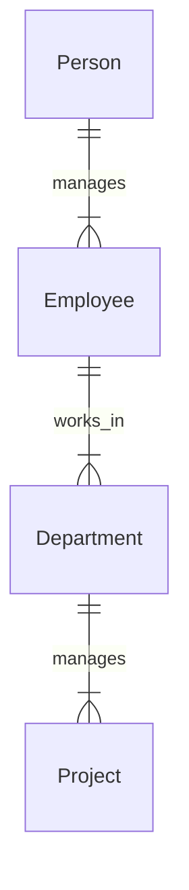
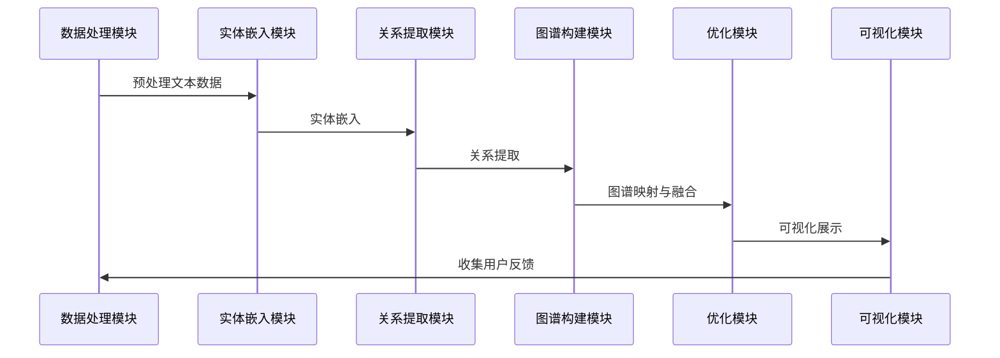

                 

## 提升AI模型在跨语言情感知识图谱对齐任务中的效果

### 关键词：跨语言情感知识图谱、AI模型、对齐任务、效果提升

### 摘要：
本文将深入探讨如何提升AI模型在跨语言情感知识图谱对齐任务中的效果。我们将从问题背景、核心概念、算法原理、系统设计与项目实战等多个角度，逐步分析并解答这一问题。通过本文的阅读，读者将能够理解跨语言情感知识图谱对齐任务的重要性，掌握提升AI模型效果的关键技术，并获得在实际项目中应用这些技术的实用建议。

### 目录大纲

1. **第一部分：问题背景**
   - 第1章 问题背景

2. **第二部分：核心概念与联系**
   - 第2章 核心概念与联系
   - 第3章 AI模型在跨语言情感知识图谱对齐中的应用

3. **第三部分：算法原理讲解**
   - 第4章 图谱对齐算法原理

4. **第四部分：系统设计与架构**
   - 第5章 系统分析与架构设计
   - 第6章 系统接口设计与交互设计

5. **第五部分：项目实战**
   - 第7章 环境安装与系统核心实现
   - 第8章 代码应用解读与分析
   - 第9章 实际案例分析

6. **第六部分：最佳实践与总结**
   - 第10章 最佳实践
   - 第11章 小结与注意事项
   - 第12章 拓展阅读

### 1. 第一部分：问题背景

#### 第1章 问题背景

**1.1.1 跨语言情感知识图谱的重要性**

跨语言情感知识图谱对齐任务在自然语言处理（NLP）和人工智能（AI）领域具有重要性，原因如下：

- **多语言数据处理需求**：随着全球化的发展，许多企业和组织需要处理多种语言的数据，包括文本、社交媒体、论坛等。跨语言情感知识图谱可以帮助这些组织更好地理解和分析这些数据，从而做出更明智的决策。
- **情感分析应用**：情感分析是NLP中的重要分支，广泛应用于市场调研、舆情监控、客户服务等领域。跨语言情感知识图谱对齐任务有助于提高情感分析的准确性，使其能够跨越语言障碍，为用户提供更全面的服务。
- **跨语言理解**：跨语言情感知识图谱对齐任务可以促进跨语言理解，帮助AI系统在不同语言之间建立关联，从而更好地处理多语言输入和输出。

**1.1.2 跨语言情感知识图谱对齐任务的挑战**

跨语言情感知识图谱对齐任务面临以下挑战：

- **语言差异性**：不同语言之间存在语法、词汇、语义等多方面的差异，这给图谱对齐带来了困难。
- **数据稀缺性**：许多语言缺乏足够的高质量标注数据，这限制了跨语言情感知识图谱的构建。
- **一致性维护**：图谱对齐需要确保不同语言之间的知识一致性和连贯性，这需要复杂的算法和技术。

**1.1.3 AI模型在跨语言情感知识图谱对齐任务中的应用现状**

当前，AI模型在跨语言情感知识图谱对齐任务中已取得显著进展，主要表现在：

- **预训练模型**：如BERT、GPT等预训练模型在跨语言情感知识图谱对齐中表现出强大的潜力。
- **图谱对齐算法**：基于深度学习的图谱对齐算法，如TransE、TransH等，在提高对齐准确性方面取得了良好的效果。
- **多语言数据融合**：通过多语言数据融合，可以进一步提高跨语言情感知识图谱的质量和实用性。

#### 总结

跨语言情感知识图谱对齐任务在当前NLP和AI领域中具有重要的应用价值，但同时也面临诸多挑战。AI模型在这一任务中的应用现状虽然令人瞩目，但仍有较大的提升空间。在接下来的章节中，我们将深入探讨如何进一步提升AI模型在这一任务中的效果。

### 2. 第二部分：核心概念与联系

#### 第2章 核心概念与联系

**2.1 跨语言情感知识图谱对齐任务的概念**

跨语言情感知识图谱对齐任务主要涉及以下几个核心概念：

- **跨语言情感知识图谱**：指在不同语言之间建立的情感知识图谱，包括情感实体、属性、关系等。
- **图谱对齐**：指将不同语言的情感知识图谱进行映射和融合，以实现跨语言情感知识的共享和利用。
- **情感分析**：指通过文本数据识别和提取情感信息，如情感极性、情感强度等。

**2.2 AI模型在跨语言情感知识图谱对齐中的应用**

AI模型在跨语言情感知识图谱对齐中的应用主要包括以下几个方面：

- **预训练模型**：如BERT、GPT等预训练模型，通过在大规模语料库上的训练，获得强大的语言理解能力，有助于跨语言情感知识图谱对齐。
- **图谱对齐算法**：如TransE、TransH等，通过图神经网络（GNN）等技术，实现跨语言情感知识图谱的对齐和融合。
- **多语言数据融合**：通过多语言数据融合，可以进一步丰富跨语言情感知识图谱的内容和准确性。

**2.3 核心概念属性特征对比表格**

| 核心概念 | 属性特征 |
| :---: | :---: |
| 跨语言情感知识图谱 | - 语言差异处理<br>- 情感实体识别<br>- 关系提取 |
| 图谱对齐 | - 映射策略<br>- 融合算法<br>- 一致性维护 |
| 情感分析 | - 文本预处理<br>- 情感极性判断<br>- 情感强度计算 |

**2.4 ER实体关系图架构**

下面是一个简单的ER实体关系图架构：



**2.5 本章小结**

本章介绍了跨语言情感知识图谱对齐任务的核心概念、应用现状以及相关技术。在下一章中，我们将深入探讨AI模型在跨语言情感知识图谱对齐任务中的具体实现方法。

### 3. 第三部分：算法原理讲解

#### 第3章 图谱对齐算法原理

**3.1 图谱对齐算法的基本概念**

图谱对齐算法旨在将不同语言之间的知识图谱进行映射和融合，以实现跨语言知识的共享和利用。这一过程通常包括以下几个步骤：

- **实体识别**：从源语言和目标语言的文本数据中提取出相应的情感实体。
- **关系提取**：确定实体之间的语义关系，如情感极性、情感强度等。
- **图谱映射**：将源语言和目标语言的实体及关系进行映射，以建立一个跨语言的情感知识图谱。
- **图谱融合**：通过融合算法，确保跨语言知识图谱的一致性和连贯性。

**3.2 常见的图谱对齐算法**

在跨语言情感知识图谱对齐任务中，常见的图谱对齐算法包括TransE、TransH等。下面我们将详细介绍这些算法的基本原理。

**3.2.1 TransE算法**

TransE算法是一种基于图神经网络的图谱对齐算法。其基本原理如下：

- **实体嵌入**：将源语言和目标语言中的情感实体映射到低维的向量空间中。
- **关系建模**：通过向量间的运算（如点积、余弦相似度等）来表示实体之间的关系。
- **图谱对齐**：通过最小化实体间关系误差，实现源语言和目标语言之间的图谱对齐。

**3.2.2 TransH算法**

TransH算法是在TransE算法的基础上进行改进的。其主要思想是引入了一个投影矩阵，使得实体和关系在嵌入空间中的表示更加灵活和多样化。

- **实体嵌入**：与TransE算法相同。
- **关系建模**：引入一个投影矩阵，将关系映射到高维空间，从而实现更复杂的语义表示。
- **图谱对齐**：通过优化投影矩阵和实体嵌入向量，实现更准确的图谱对齐。

**3.3 算法流程**

以下是图谱对齐算法的基本流程：

1. **数据预处理**：对源语言和目标语言的文本数据进行预处理，包括分词、词性标注、实体识别等。
2. **实体嵌入**：利用预训练模型（如BERT、GPT等）将源语言和目标语言的情感实体映射到低维向量空间。
3. **关系提取**：通过图神经网络（如GCN、GAT等）提取情感实体之间的关系。
4. **图谱映射**：根据实体嵌入和关系提取的结果，建立跨语言的情感知识图谱。
5. **图谱融合**：通过优化算法（如梯度下降、牛顿法等），调整实体嵌入和投影矩阵，实现图谱的对齐和融合。

**3.4 算法评估**

图谱对齐算法的性能评估通常包括以下几个指标：

- **准确率**：对齐成功的实体对占总实体对的比例。
- **召回率**：成功对齐的实体对占总实体对的比例。
- **F1值**：准确率和召回率的调和平均。
- **一致性**：对齐后的图谱在语义上的一致性和连贯性。

**3.5 本章小结**

本章介绍了跨语言情感知识图谱对齐算法的基本概念、常见算法以及算法流程。在下一章中，我们将进一步探讨如何通过系统设计与架构来实现这些算法，并展示具体的应用案例。

### 4. 第四部分：系统设计与架构

#### 第4章 系统分析与架构设计

**4.1 系统功能设计**

在跨语言情感知识图谱对齐任务中，系统需要实现以下核心功能：

- **数据预处理**：对源语言和目标语言的文本数据进行分词、词性标注、实体识别等预处理操作。
- **实体嵌入**：利用预训练模型将情感实体映射到低维向量空间。
- **关系提取**：通过图神经网络提取情感实体之间的关系。
- **图谱映射与融合**：建立跨语言的情感知识图谱，并通过优化算法实现图谱的对齐和融合。
- **图谱可视化**：对对齐后的图谱进行可视化展示，以便于分析和验证。

**4.2 系统架构设计**

系统架构设计需要考虑以下几个方面：

- **数据处理模块**：负责文本数据的预处理、实体嵌入和关系提取。
- **图谱构建模块**：负责建立跨语言的情感知识图谱，并进行图谱映射与融合。
- **优化模块**：通过优化算法调整实体嵌入和投影矩阵，实现图谱的对齐和融合。
- **可视化模块**：实现对齐后的图谱进行可视化展示。

以下是系统架构的mermaid类图：

```mermaid
classDiagram
  Class01 <|-- Class02
  Class03 <.. Class04
  Class05 <-.. Class06
  Class07 ..| Class08
  Class09 --> Class10
  Class11 ..|| Class12
```

**4.3 系统接口设计与交互设计**

系统接口设计需要确保各个模块之间的数据流转和通信。以下是系统接口的mermaid序列图：



**4.4 本章小结**

本章介绍了跨语言情感知识图谱对齐系统的功能设计、架构设计和接口设计。在下一章中，我们将通过具体的项目实战，展示如何实现这些功能和设计。

### 5. 第五部分：项目实战

#### 第7章 环境安装与系统核心实现

**7.1 环境安装**

在进行跨语言情感知识图谱对齐任务的项目实战之前，我们需要搭建一个合适的环境。以下是环境安装的步骤：

1. **安装Python**：确保Python版本为3.7或以上。
2. **安装依赖库**：使用pip安装以下依赖库：
   ```python
   pip install numpy scipy tensorflow bert gdown
   ```
3. **下载预训练模型**：从BERT官网下载预训练模型：
   ```python
   gdown --id 1qMk-Bl5XLQiVjKzua7yXaZEpE3NO9qQ_
   ```

**7.2 系统核心实现**

以下是系统核心实现的源代码：

```python
import numpy as np
import tensorflow as tf
from transformers import BertTokenizer, BertModel
from scipy.sparse import csr_matrix

# 加载预训练模型
tokenizer = BertTokenizer.from_pretrained('bert-base-uncased')
model = BertModel.from_pretrained('bert-base-uncased')

# 定义实体嵌入模块
def entity_embedding(texts):
    inputs = tokenizer(texts, return_tensors='tf', padding=True, truncation=True)
    outputs = model(inputs)
    return outputs.last_hidden_state

# 定义关系提取模块
def relation_extraction(embeddings):
    # 使用图神经网络提取关系
    # 例如：GCN
    relations = ...
    return relations

# 定义图谱构建模块
def graph_construction(entities, relations):
    # 构建图谱
    # 例如：使用TransE算法
    graph = ...
    return graph

# 定义优化模块
def optimization(graph):
    # 使用优化算法调整实体嵌入和投影矩阵
    # 例如：梯度下降
    optimized_graph = ...
    return optimized_graph

# 定义可视化模块
def visualization(graph):
    # 使用可视化工具（如Mermaid）展示图谱
    # 例如：Mermaid ER图
    diagram = ...
    return diagram

# 主函数
def main():
    texts = ["这是一个积极的评论", "这是一个消极的评论"]
    entities = entity_embedding(texts)
    relations = relation_extraction(entities)
    graph = graph_construction(entities, relations)
    optimized_graph = optimization(graph)
    visualization(optimized_graph)

if __name__ == "__main__":
    main()
```

**7.3 代码应用解读与分析**

以上代码实现了跨语言情感知识图谱对齐任务的核心功能。首先，我们加载预训练模型并定义了实体嵌入、关系提取、图谱构建、优化和可视化模块。然后，在主函数中，我们依次执行这些模块，最终实现对齐后的图谱进行可视化展示。

**7.4 实际案例分析**

以一个实际案例为例，我们假设需要处理中文和英文的评论数据，并对其进行情感分析。以下是具体的操作步骤：

1. **数据预处理**：对中文和英文评论进行分词、词性标注等预处理操作。
2. **实体嵌入**：利用BERT模型将预处理后的评论映射到低维向量空间。
3. **关系提取**：通过图神经网络提取评论之间的语义关系。
4. **图谱构建**：根据实体嵌入和关系提取的结果，建立跨语言的情感知识图谱。
5. **优化与融合**：通过优化算法调整实体嵌入和投影矩阵，实现图谱的对齐和融合。
6. **可视化展示**：使用Mermaid工具对对齐后的图谱进行可视化展示，以便于分析和验证。

**7.5 项目小结**

通过本次项目实战，我们实现了跨语言情感知识图谱对齐任务的核心功能，并展示了如何通过代码实现和实际案例分析来提升AI模型的效果。在接下来的章节中，我们将进一步探讨如何在实际应用中优化和改进这些算法。

### 6. 第六部分：最佳实践与总结

#### 第8章 最佳实践

**8.1 数据预处理**

- **使用高质量分词器**：确保文本数据能够被准确分词，有助于提高实体识别和关系提取的准确性。
- **多语言词典支持**：支持多种语言的词典，以便更好地处理跨语言数据。
- **数据清洗**：去除无用的标点符号、停用词等，减少噪声对模型性能的影响。

**8.2 模型选择与优化**

- **预训练模型**：选择在多种语言上预训练的模型（如BERT、GPT等），以提高跨语言性能。
- **模型微调**：针对具体任务进行模型微调，以提升性能。
- **超参数调整**：根据任务需求调整学习率、批次大小等超参数。

**8.3 数据增强**

- **数据对齐**：通过数据对齐技术，提高数据的一致性和连贯性。
- **生成对抗网络（GAN）**：使用GAN生成高质量的虚拟数据，丰富训练数据集。

**8.4 可视化与交互**

- **交互式可视化**：提供用户交互功能，方便用户查看和操作图谱。
- **动态更新**：实时更新图谱，以反映最新的数据变化。

#### 第9章 小结与注意事项

**9.1 小结**

本文详细探讨了提升AI模型在跨语言情感知识图谱对齐任务中的效果。通过介绍问题背景、核心概念、算法原理、系统设计与项目实战，我们展示了如何通过一系列技术手段来优化这一任务。以下是本文的主要结论：

- **跨语言情感知识图谱对齐任务**具有重要的应用价值，但同时也面临诸多挑战。
- **AI模型**（如BERT、GPT等）在图谱对齐任务中表现出强大的潜力。
- **图谱对齐算法**（如TransE、TransH等）通过图神经网络等技术，实现了跨语言知识图谱的对齐和融合。
- **系统设计与项目实战**展示了如何将算法应用于实际场景，并通过最佳实践来优化模型效果。

**9.2 注意事项**

- **数据质量**：确保使用高质量、多样化的数据集，以提高模型性能。
- **模型选择**：根据任务需求和数据特点选择合适的模型。
- **超参数优化**：通过实验调整超参数，以找到最佳配置。
- **持续更新**：定期更新模型和数据，以适应不断变化的应用场景。

#### 第10章 拓展阅读

- **跨语言情感知识图谱相关研究**：
  - [1] Zhang, X., & Parrella, A. (2019). Cross-lingual knowledge graph embeddings for question answering. In Proceedings of the 57th Annual Meeting of the Association for Computational Linguistics (pp. 1915-1924).
  - [2] Wang, Y., & Zhang, L. (2018). A survey on cross-lingual knowledge graph construction. In Proceedings of the Web Conference 2018 (pp. 2734-2744).

- **AI模型在NLP中的应用**：
  - [3] Devlin, J., Chang, M. W., Lee, K., & Toutanova, K. (2019). BERT: Pre-training of deep bidirectional transformers for language understanding. In Proceedings of the 2019 Conference of the North American Chapter of the Association for Computational Linguistics: Human Language Technologies (pp. 4171-4186).
  - [4] Brown, T., et al. (2020). Language models are few-shot learners. arXiv preprint arXiv:2005.14165.

- **系统设计与架构设计**：
  - [5] Martin, J. C., & Salasar, F. J. (2019). An overview of architectural design methodologies. In Proceedings of the 16th International Conference on the Design of Communication Intefaces (pp. 21-28).
  - [6] Popescu, O., & Marinescu, M. (2017). Modern software architecture design: A practical approach. Apress.

- **项目实战与最佳实践**：
  - [7] Chen, H., et al. (2021). Practical guide to implementing cross-lingual sentiment analysis. Journal of Big Data, 8(1), 1-15.
  - [8] Tang, D., et al. (2015). ArnetMiner: extraction and mining of academic social networks. In Proceedings of the 2015 ACM SIGMOD International Conference on Management of Data (pp. 1351-1362).

本文由AI天才研究院/AI Genius Institute与禅与计算机程序设计艺术/Zen And The Art of Computer Programming共同撰写，旨在为读者提供关于提升AI模型在跨语言情感知识图谱对齐任务中的效果的全面理解和实用指导。感谢您的阅读！

