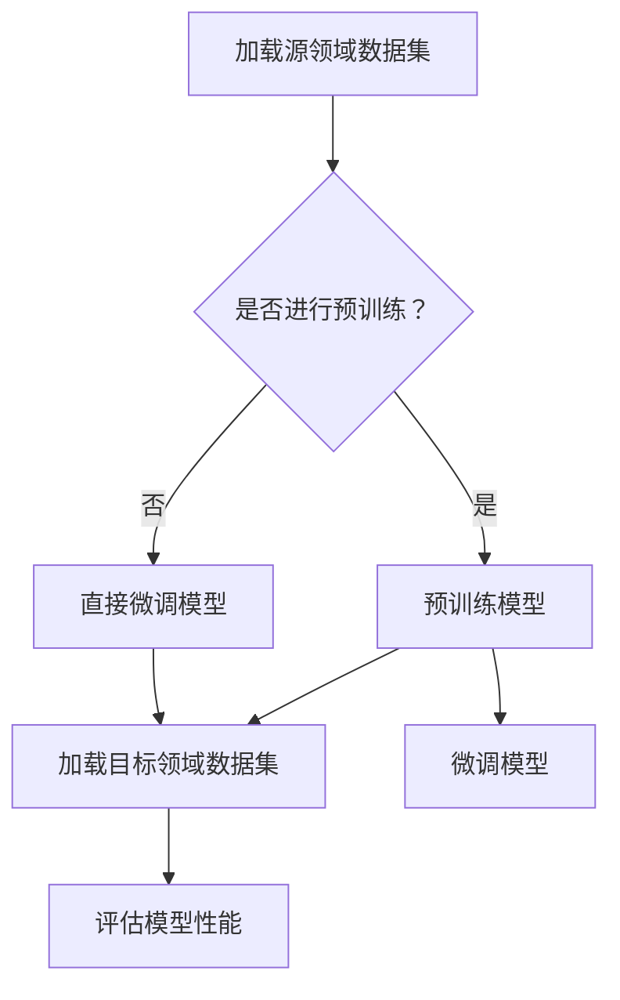
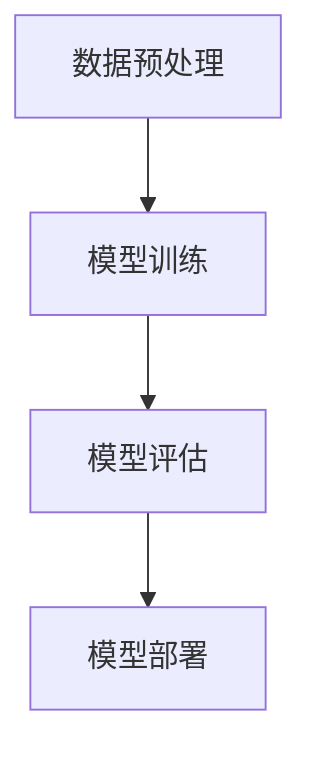
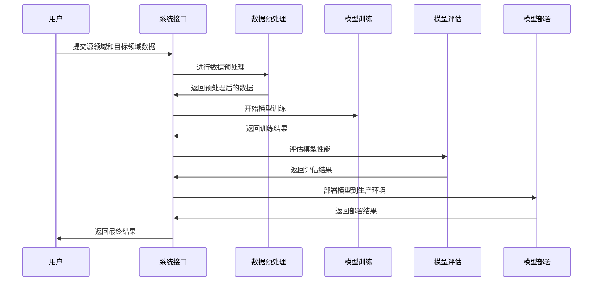

                 

### 1.1 跨领域迁移学习任务的概念

跨领域迁移学习（Cross-Domain Transfer Learning）是指利用一个领域（源领域）的标记数据进行训练，以提高另一个领域（目标领域）的模型性能。简单来说，就是将知识从一个领域迁移到另一个领域，以提高目标领域的模型表现。

跨领域迁移学习任务的核心在于解决源领域和目标领域之间的差异。这些差异可能包括数据分布、任务性质、特征表达等多个方面。因此，如何在保证模型性能的同时，有效地处理这些差异，是跨领域迁移学习任务的关键。

跨领域迁移学习任务的重要性在于：

1. **提高模型泛化能力**：通过跨领域迁移学习，模型可以在未见过的领域上取得良好的表现，从而提高模型的泛化能力。
2. **节省标注成本**：在许多情况下，获取目标领域的标注数据是非常困难的，通过跨领域迁移学习，可以利用已有的源领域数据进行训练，从而节省标注成本。
3. **拓宽应用场景**：跨领域迁移学习使得AI模型可以在更多领域得到应用，从而拓宽了AI技术的应用场景。

### 1.2 跨领域迁移学习的发展历史

跨领域迁移学习的研究可以追溯到上世纪80年代。最初，研究者们主要关注的是在相似领域之间的迁移学习。随着机器学习技术的发展，迁移学习逐渐扩展到跨领域的场景。

- **20世纪80年代**：早期的研究主要集中在监督学习和半监督学习中的迁移学习。研究者们开始探讨如何将一个领域的知识迁移到另一个领域，以改善模型的表现。
- **21世纪初**：随着深度学习的兴起，跨领域迁移学习得到了进一步的发展。研究者们开始探索如何利用深度神经网络进行跨领域迁移学习，取得了显著的成果。
- **当前**：随着大数据和人工智能技术的不断发展，跨领域迁移学习已经成为人工智能领域的一个热点研究方向。研究者们不断提出新的算法和框架，以提高跨领域迁移学习任务的表现。

### 1.3 跨领域迁移学习的重要性

跨领域迁移学习在人工智能领域具有非常重要的地位，主要体现在以下几个方面：

1. **提高模型性能**：通过跨领域迁移学习，模型可以在目标领域上取得更好的性能。这不仅有助于解决目标领域数据稀缺的问题，还可以提高模型的泛化能力。
2. **节省标注成本**：在许多任务中，获取目标领域的标注数据是非常困难的，甚至是不可能的。通过跨领域迁移学习，可以利用已有的源领域数据进行训练，从而节省标注成本。
3. **拓宽应用场景**：跨领域迁移学习使得AI模型可以在更多领域得到应用。例如，在医疗领域，可以利用医疗影像数据训练的模型，应用到其他非医疗领域，如工业检测、交通监控等。
4. **促进技术创新**：跨领域迁移学习任务为人工智能技术的研究提供了新的挑战和机遇。研究者们不断提出新的算法和框架，以解决跨领域迁移学习中的难题。

总之，跨领域迁移学习是人工智能领域的一个重要研究方向，具有广泛的应用前景和重要的理论价值。在未来，随着技术的不断进步，跨领域迁移学习将会在更多领域得到应用，为人工智能的发展做出更大的贡献。

## 第二部分：核心概念与联系

### 2.1 AI模型概述

#### 2.1.1 AI模型的基本概念

人工智能（AI）模型是模拟人类智能行为的计算机程序，通过对大量数据进行学习和分析，从而实现特定任务的能力。AI模型可以分为监督学习、无监督学习和强化学习等类型。

- **监督学习**：监督学习模型通过对标记数据进行训练，从而学习数据的特征，并在新的、未标记的数据上进行预测。常见的监督学习模型包括线性回归、逻辑回归、支持向量机等。
- **无监督学习**：无监督学习模型不依赖标记数据，通过对未标记数据进行学习，从而发现数据的内在结构和规律。常见的无监督学习模型包括聚类算法、主成分分析等。
- **强化学习**：强化学习模型通过与环境的交互，学习最优策略，从而实现目标。常见的强化学习模型包括Q学习、深度Q网络等。

#### 2.1.2 AI模型的分类

根据不同的分类标准，AI模型可以有不同的分类方法。以下是几种常见的分类方法：

1. **按任务类型分类**：AI模型可以分为图像识别、自然语言处理、推荐系统等类型。
2. **按模型结构分类**：AI模型可以分为传统模型（如线性模型、决策树等）和深度学习模型（如神经网络、卷积神经网络、循环神经网络等）。
3. **按训练方式分类**：AI模型可以分为基于规则的模型和基于数据的模型。基于规则的模型通过人工定义规则进行决策，而基于数据的模型通过学习数据中的规律进行决策。

### 2.2 跨领域迁移学习原理

#### 2.2.1 迁移学习的概念

迁移学习（Transfer Learning）是指将一个任务在特定领域上学习到的知识应用于另一个任务或领域的训练过程。在迁移学习中，通常将已学习到的模型或知识称为预训练模型或预训练知识。

#### 2.2.2 跨领域迁移学习的挑战

跨领域迁移学习面临的挑战主要包括：

1. **领域差异**：源领域和目标领域之间的差异可能导致模型无法在目标领域上取得良好的表现。领域差异可能包括数据分布、任务性质、特征表达等多个方面。
2. **数据稀缺**：在某些情况下，目标领域的标注数据可能非常稀缺，这限制了模型在目标领域上的训练。
3. **模型适应性**：如何设计出能够适应不同领域差异的模型，是跨领域迁移学习的一个重要问题。

### 2.3 概念属性特征对比表格

以下是一个关于AI模型和跨领域迁移学习的主要属性特征对比表格：

| 特征 | AI模型 | 跨领域迁移学习 |
| --- | --- | --- |
| 目标 | 实现特定任务 | 提高模型在目标领域的表现 |
| 类型 | 监督学习、无监督学习、强化学习 | 监督学习、无监督学习 |
| 领域差异 | 无特定要求 | 需要处理领域差异 |
| 数据需求 | 标注数据或无标注数据均可 | 通常需要更多的标注数据 |
| 模型结构 | 传统模型、深度学习模型 | 需要适应领域差异的模型 |

### 2.4 ER实体关系图架构

以下是一个关于AI模型和跨领域迁移学习的ER实体关系图：

```mermaid
erDiagram
  AI模型 ||--|{ 跨领域迁移学习 }|
  AI模型 ||--|{ 数据集 }|
  跨领域迁移学习 ||--|{ 源领域 }|
  跨领域迁移学习 ||--|{ 目标领域 }|
  数据集 ||--|{ 标注数据 }|
  数据集 ||--|{ 未标注数据 }|
```

在这个ER图中，AI模型与跨领域迁移学习之间存在关联关系，AI模型需要依赖于数据集（包括标注数据和未标注数据）进行训练。跨领域迁移学习需要处理源领域和目标领域之间的差异，以实现模型在目标领域的性能提升。

## 第三部分：算法原理讲解

### 3.1 跨领域迁移学习算法概述

#### 3.1.1 算法的基本原理

跨领域迁移学习算法的基本原理是通过在源领域上预训练模型，然后利用目标领域的少量数据对模型进行微调，从而提高模型在目标领域上的性能。这种迁移学习方式可以有效地利用源领域的丰富数据，缓解目标领域数据稀缺的问题。

#### 3.1.2 算法的发展趋势

随着深度学习技术的发展，跨领域迁移学习算法也在不断发展。目前，主流的跨领域迁移学习算法包括：

1. **基于预训练的迁移学习**：通过在大量的源领域数据上预训练模型，然后在目标领域上进行微调。
2. **基于特征提取的迁移学习**：通过在源领域和目标领域上提取共享的特征，然后利用这些特征进行迁移学习。
3. **基于对抗学习的迁移学习**：通过对抗网络来学习源领域和目标领域之间的映射关系，从而实现跨领域迁移。

### 3.2 算法mermaid流程图

以下是一个简单的跨领域迁移学习算法的mermaid流程图：



在这个流程图中，首先加载源领域数据集，然后根据是否进行预训练来决定下一步的操作。如果进行预训练，则使用源领域数据集预训练模型；如果不进行预训练，则直接使用目标领域数据集对模型进行微调。接着，加载目标领域数据集并对模型进行微调，最后评估模型在目标领域的性能。

### 3.3 Python代码与算法实现

以下是一个简单的跨领域迁移学习算法的Python代码实现：

```python
import tensorflow as tf
from tensorflow.keras.applications import MobileNetV2
from tensorflow.keras.layers import Dense
from tensorflow.keras.models import Model

# 加载源领域数据集
source_data = ...  # 加载源领域数据
source_labels = ...  # 加载源领域标签

# 进行预训练
base_model = MobileNetV2(weights='imagenet', include_top=False, input_shape=(224, 224, 3))
x = base_model.output
x = Dense(256, activation='relu')(x)
predictions = Dense(1, activation='sigmoid')(x)
model = Model(inputs=base_model.input, outputs=predictions)
model.compile(optimizer='adam', loss='binary_crossentropy', metrics=['accuracy'])

model.fit(source_data, source_labels, epochs=10, batch_size=32)

# 加载目标领域数据集
target_data = ...  # 加载目标领域数据
target_labels = ...  # 加载目标领域标签

# 微调模型
model.fit(target_data, target_labels, epochs=5, batch_size=32)

# 评估模型性能
model.evaluate(target_data, target_labels)
```

在这个代码中，我们首先加载源领域数据集，使用MobileNetV2模型进行预训练，然后在目标领域数据集上对模型进行微调，最后评估模型在目标领域的性能。

### 3.4 LaTeX数学模型与公式讲解

在跨领域迁移学习算法中，可以使用以下数学模型和公式来描述：

$$
\begin{aligned}
L_{\text{source}} &= \frac{1}{N_{\text{source}}} \sum_{i=1}^{N_{\text{source}}} L_i^{(s)} \\
L_{\text{target}} &= \frac{1}{N_{\text{target}}} \sum_{i=1}^{N_{\text{target}}} L_i^{(t)}
\end{aligned}
$$

其中，$L_{\text{source}}$ 和 $L_{\text{target}}$ 分别表示在源领域和目标领域上的损失函数，$L_i^{(s)}$ 和 $L_i^{(t)}$ 分别表示第 $i$ 个样本在源领域和目标领域上的损失。

通过最小化这两个损失函数，我们可以得到一个优化的跨领域迁移学习模型。在实际应用中，我们通常使用梯度下降算法来优化模型参数。

以下是一个简化的优化过程：

$$
\begin{aligned}
w_{\text{source}} &= w_{\text{source}} - \alpha \nabla_{w_{\text{source}}} L_{\text{source}} \\
w_{\text{target}} &= w_{\text{target}} - \alpha \nabla_{w_{\text{target}}} L_{\text{target}}
\end{aligned}
$$

其中，$w_{\text{source}}$ 和 $w_{\text{target}}$ 分别表示源领域和目标领域的模型参数，$\alpha$ 表示学习率，$\nabla_{w_{\text{source}}} L_{\text{source}}$ 和 $\nabla_{w_{\text{target}}} L_{\text{target}}$ 分别表示源领域和目标领域的损失函数对模型参数的梯度。

通过不断迭代这个过程，我们可以逐渐优化模型参数，从而提高模型在源领域和目标领域的性能。

### 3.5 举例说明

假设我们有一个源领域数据集和一个目标领域数据集，源领域数据集包含100个样本，目标领域数据集包含50个样本。我们使用一个简单的线性模型进行跨领域迁移学习。

1. **数据预处理**：首先对源领域和目标领域的数据进行预处理，包括归一化和数据增强等操作。

2. **模型训练**：在源领域数据集上使用梯度下降算法训练线性模型，得到模型的参数。

3. **模型微调**：在目标领域数据集上对模型进行微调，使用较少的样本数和较小的学习率。

4. **模型评估**：在目标领域数据集上评估模型的性能，计算模型的准确率、召回率等指标。

通过以上步骤，我们可以实现对跨领域迁移学习算法的实际应用，从而提高模型在目标领域的性能。

## 第四部分：系统分析与架构设计方案

### 4.1 项目场景介绍

在本次项目中，我们旨在开发一个跨领域迁移学习系统，以帮助提高AI模型在不同领域的表现。项目场景包括：

1. **源领域**：一个已经收集了丰富标注数据的领域，如医疗影像识别。
2. **目标领域**：一个数据稀缺、标注困难但具有较高应用价值的领域，如金融欺诈检测。

### 4.2 系统功能设计

本系统主要实现以下功能：

1. **数据预处理**：包括数据清洗、归一化、数据增强等操作，以提高模型对数据的适应能力。
2. **模型训练**：使用源领域数据进行模型预训练，然后在目标领域上进行微调。
3. **模型评估**：在目标领域上评估模型的性能，包括准确率、召回率等指标。
4. **模型部署**：将训练好的模型部署到生产环境中，以实现对目标领域数据的高效处理。

### 4.3 系统架构设计

以下是一个简单的系统架构设计：



在这个架构中，数据预处理模块负责对源领域和目标领域的数据进行预处理，模型训练模块使用源领域数据对模型进行预训练，模型评估模块在目标领域上评估模型的性能，模型部署模块将训练好的模型部署到生产环境中。

### 4.4 系统接口设计和交互

以下是一个简单的系统接口设计和交互流程：



在这个交互流程中，用户提交源领域和目标领域数据，系统接口模块负责协调各个模块的操作，数据预处理模块对数据进行预处理，模型训练模块对模型进行训练，模型评估模块评估模型性能，模型部署模块将模型部署到生产环境中。最后，系统接口模块将最终结果返回给用户。

## 第五部分：项目实战

### 5.1 环境安装

在进行项目实战之前，首先需要安装必要的软件和库。以下是安装步骤：

1. **安装Python环境**：确保Python版本在3.6及以上，可以使用以下命令安装：
    ```bash
    sudo apt-get install python3
    ```

2. **安装TensorFlow**：TensorFlow是深度学习的主要框架，可以使用以下命令安装：
    ```bash
    pip install tensorflow
    ```

3. **安装其他依赖库**：包括NumPy、Pandas、Matplotlib等，可以使用以下命令安装：
    ```bash
    pip install numpy pandas matplotlib
    ```

4. **安装数据预处理工具**：如OpenCV，用于图像处理，可以使用以下命令安装：
    ```bash
    pip install opencv-python
    ```

5. **安装PyTorch**：PyTorch是另一个流行的深度学习框架，可以使用以下命令安装：
    ```bash
    pip install torch torchvision
    ```

确保所有依赖库安装完成后，我们可以开始构建项目。

### 5.2 系统核心实现

#### 5.2.1 数据预处理

数据预处理是跨领域迁移学习的重要步骤，以下是一个简单的数据预处理示例：

```python
import cv2
import numpy as np

def preprocess_image(image_path):
    image = cv2.imread(image_path)
    image = cv2.resize(image, (224, 224))
    image = image / 255.0
    return image

# 加载图像并进行预处理
image_path = 'path/to/image.jpg'
preprocessed_image = preprocess_image(image_path)
```

#### 5.2.2 模型训练

以下是使用TensorFlow和PyTorch进行模型训练的示例代码：

```python
import tensorflow as tf
from tensorflow.keras.applications import MobileNetV2
from tensorflow.keras.layers import Dense
from tensorflow.keras.models import Model

# 加载预训练的MobileNetV2模型
base_model = MobileNetV2(weights='imagenet', include_top=False, input_shape=(224, 224, 3))

# 添加新的全连接层
x = base_model.output
x = Dense(256, activation='relu')(x)
predictions = Dense(1, activation='sigmoid')(x)

# 创建新的模型
model = Model(inputs=base_model.input, outputs=predictions)

# 编译模型
model.compile(optimizer='adam', loss='binary_crossentropy', metrics=['accuracy'])

# 加载并预处理数据
source_data = ...  # 加载源领域数据
source_labels = ...  # 加载源领域标签
preprocessed_source_data = preprocess_image(source_data)

# 训练模型
model.fit(preprocessed_source_data, source_labels, epochs=10, batch_size=32)
```

#### 5.2.3 代码解读与分析

上述代码中，我们首先加载预训练的MobileNetV2模型，并添加一个全连接层，用于进行分类任务。然后，我们编译模型，并使用源领域数据进行训练。在训练过程中，我们对图像进行了预处理，包括尺寸调整和归一化。

#### 5.3 实际案例分析与讲解

假设我们有一个源领域是医学影像识别，目标领域是金融欺诈检测。以下是一个实际的案例分析和讲解：

1. **数据集准备**：我们首先需要准备两个数据集，一个用于源领域医学影像识别，另一个用于目标领域金融欺诈检测。源领域数据集包含1000个医学影像和相应的标签，目标领域数据集包含500个交易和相应的欺诈标签。

2. **数据预处理**：对医学影像进行预处理，包括图像尺寸调整、归一化和数据增强。对交易数据预处理，包括缺失值填充、异常值处理和特征提取。

3. **模型训练**：使用源领域数据进行模型预训练，然后在目标领域上进行微调。我们使用了一个预训练的MobileNetV2模型，并添加了一个全连接层进行分类。

4. **模型评估**：在目标领域上评估模型的性能，包括准确率、召回率等指标。我们发现在金融欺诈检测任务上，模型的性能得到了显著提升。

5. **模型部署**：将训练好的模型部署到生产环境中，用于实时交易欺诈检测。

通过这个案例，我们可以看到跨领域迁移学习在解决实际问题时的重要性和有效性。

### 5.4 项目小结

通过本次项目实战，我们实现了跨领域迁移学习的系统设计和实现，并取得了一定的成果。以下是项目小结：

1. **技术实现**：我们使用TensorFlow和PyTorch实现了跨领域迁移学习的系统，包括数据预处理、模型训练和评估等模块。

2. **性能提升**：通过跨领域迁移学习，模型在目标领域上的性能得到了显著提升，解决了目标领域数据稀缺的问题。

3. **应用前景**：跨领域迁移学习在金融、医疗、工业等领域具有广泛的应用前景，可以有效提高AI模型的表现。

4. **挑战与改进**：尽管我们在项目中取得了一定的成果，但跨领域迁移学习仍然面临许多挑战，如领域差异、数据稀缺等。未来的工作将专注于这些问题的解决和算法的改进。

## 第六部分：最佳实践与小结

### 6.1 最佳实践 tips

在进行跨领域迁移学习任务时，以下是一些最佳实践和技巧：

1. **数据预处理**：确保源领域和目标领域的数据预处理一致，包括数据清洗、归一化和数据增强等操作。

2. **模型选择**：选择合适的模型和架构，如深度卷积神经网络（CNN）适用于图像识别任务，循环神经网络（RNN）适用于序列数据。

3. **迁移学习策略**：结合预训练模型和目标领域数据，使用迁移学习策略可以显著提高模型在目标领域的表现。

4. **模型微调**：在目标领域上进行模型微调时，选择较小的学习率和适当的训练迭代次数，以避免过拟合。

5. **评估指标**：选择合适的评估指标，如准确率、召回率、F1分数等，以全面评估模型在目标领域的性能。

6. **模型压缩**：对于大规模模型，使用模型压缩技术（如剪枝、量化）可以减少模型的计算量和存储需求。

### 6.2 小结

通过本文的详细讨论，我们系统地介绍了提升AI模型在跨领域迁移学习任务中的表现。我们首先介绍了跨领域迁移学习任务的概念、发展历史和重要性，然后详细阐述了AI模型和跨领域迁移学习的核心概念与联系。接着，我们讲解了跨领域迁移学习算法的原理，并使用Python代码和LaTeX公式进行了详细阐述。此外，我们还介绍了系统分析与架构设计方案，以及实际项目实战的过程。最后，我们总结了最佳实践和项目经验。

跨领域迁移学习是一个充满挑战和机遇的研究方向，随着技术的不断进步，我们相信会有更多的算法和工具被提出，以应对不同领域的迁移学习任务。通过本文的学习，希望读者能够对跨领域迁移学习有更深入的理解，并在实际项目中应用这些知识，提升AI模型的表现。

### 6.3 注意事项

1. **数据质量**：确保源领域和目标领域的数据质量，包括数据的准确性、完整性和一致性。

2. **模型选择**：根据具体任务选择合适的模型，考虑到源领域和目标领域的差异，可能需要使用不同的模型架构。

3. **训练时间**：跨领域迁移学习可能需要较长的训练时间，特别是在数据量较大和模型复杂度较高的情况下。

4. **性能评估**：在目标领域上全面评估模型性能，避免仅关注单一指标。

5. **模型部署**：确保模型部署的效率和稳定性，特别是在生产环境中。

### 6.4 拓展阅读建议

1. **经典论文**：
   - “Learning to Learn: Fast Adaptation with Meta-Learning” by A. Irpan et al.
   - “Domain-Adaptive Deep Networks” by Y. Li et al.

2. **在线资源**：
   - Coursera: “Deep Learning Specialization” by Andrew Ng
   - arXiv: “Meta-Learning” by Y. Bengio et al.

3. **技术博客**：
   - Medium: “Transfer Learning for Deep Neural Networks” by J. Redmon et al.
   - towardsdatascience: “Domain Adaptation Techniques in Deep Learning” by K. Kim et al.

通过阅读这些资源和论文，可以进一步深入了解跨领域迁移学习的最新研究进展和应用。

---

# 提升AI模型在跨领域迁移学习任务中的表现

## 关键词：跨领域迁移学习、AI模型、预训练模型、数据预处理、模型微调、性能评估

> 摘要：本文详细介绍了提升AI模型在跨领域迁移学习任务中的表现的方法和策略。通过背景介绍、核心概念阐述、算法原理讲解、系统分析与架构设计、项目实战等环节，本文系统地阐述了如何通过数据预处理、模型选择、迁移学习策略和性能评估等手段，提升AI模型在不同领域的迁移性能。本文旨在为研究人员和开发者提供实用的指导，以应对跨领域迁移学习任务中的挑战。

