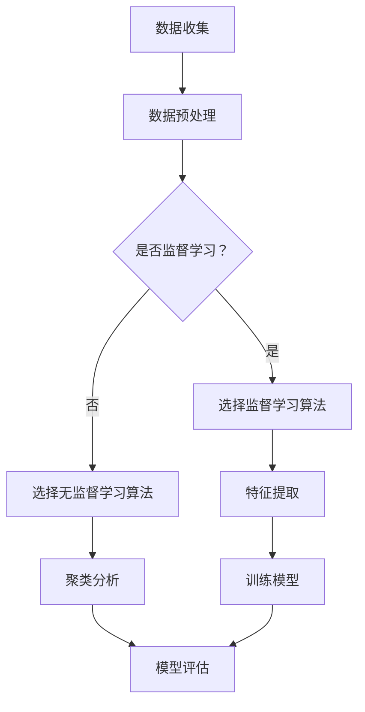
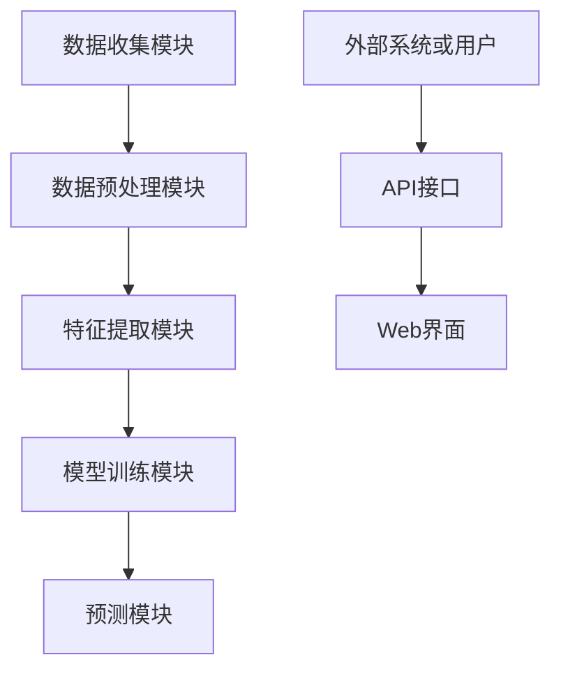
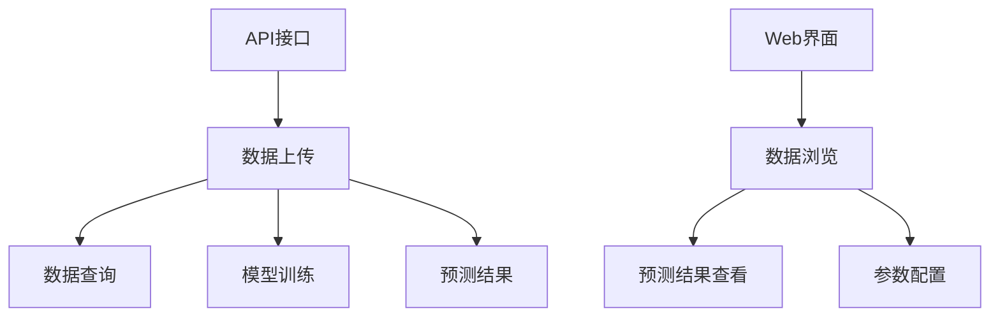

                 

### 提升AI模型在长期生态系统变化预测中的准确性

**关键词：** AI模型、生态系统变化预测、准确性、长期预测、算法优化

**摘要：** 
本文旨在探讨如何提升人工智能（AI）模型在长期生态系统变化预测中的准确性。我们首先分析了生态系统变化预测的重要性以及AI模型在此领域的应用现状，接着探讨了面临的挑战。随后，我们详细讲解了相关算法原理，并通过数学模型和公式的应用，以及Python代码实例，对这些原理进行了通俗易懂的说明。文章还介绍了系统分析与架构设计的方法，并通过实际项目实战展示了具体应用。最后，文章总结了最佳实践并展望了未来的研究方向，为相关领域的研究者提供了有价值的参考。

----------------------------------------------------------------

# 提升AI模型在长期生态系统变化预测中的准确性

## 关键词
AI模型、生态系统变化预测、准确性、长期预测、算法优化

## 摘要
本文首先介绍了长期生态系统变化预测的重要性，以及AI模型在此领域的应用现状和面临的挑战。接着，我们详细讲解了相关算法原理，并通过数学模型和公式的应用，以及Python代码实例，对这些原理进行了通俗易懂的说明。随后，文章介绍了系统分析与架构设计的方法，并通过实际项目实战展示了具体应用。最后，文章总结了最佳实践并展望了未来的研究方向，为相关领域的研究者提供了有价值的参考。

----------------------------------------------------------------

### 第一部分：背景与核心概念

#### 第1章：问题背景与核心概念

##### 1.1.1 长期生态系统变化预测的重要性

生态系统是地球上生命系统的基础，它影响着生物多样性、气候调节、水资源供应以及人类的生存和发展。然而，随着全球气候变化、污染、过度开发和资源利用等因素的影响，生态系统正面临巨大的威胁。为了更好地应对这些挑战，我们需要对生态系统变化进行准确预测。

长期生态系统变化预测的重要性体现在以下几个方面：

1. **环境保护与资源管理：** 准确预测生态系统变化有助于制定有效的环境保护和资源管理政策，确保资源的可持续利用。
2. **风险评估与预警：** 预测结果可以为相关行业提供风险评估和预警，降低生态系统破坏带来的经济损失和社会影响。
3. **科学研究和决策支持：** 长期预测结果可以为科学研究提供数据支持，为政策制定者提供决策依据。

##### 1.1.2 AI模型在生态系统变化预测中的应用现状

人工智能（AI）模型在生态系统变化预测中的应用已经取得了显著的进展。以下是一些主要的应用现状：

1. **数据挖掘与分析：** AI模型可以处理和分析大量的生态系统数据，包括气象数据、土壤数据、植被数据等，从而提高预测的准确性。
2. **模式识别与分类：** AI模型可以识别和分析生态系统中的变化模式，为预测提供有力的支持。
3. **预测与模拟：** AI模型可以模拟不同因素对生态系统的影响，预测未来生态系统的变化趋势。

##### 1.1.3 长期生态系统变化预测的挑战

尽管AI模型在生态系统变化预测中具有很大的潜力，但仍然面临一些挑战：

1. **数据质量与可用性：** 长期生态系统变化预测需要大量的高质量数据，然而这些数据往往难以获取或存在噪声。
2. **模型复杂性与适应性：** 随着生态系统的复杂性和多样性增加，模型的复杂性和适应性也成为一个挑战。
3. **不确定性处理：** 生态系统变化具有很大的不确定性，如何处理这种不确定性是长期预测中的一个关键问题。

##### 1.1.4 本书的写作目的与内容安排

本书旨在探讨如何提升AI模型在长期生态系统变化预测中的准确性。具体目标包括：

1. **介绍核心概念与原理：** 梳理和阐述长期生态系统变化预测中的关键概念和原理。
2. **讲解算法与模型：** 详细讲解相关的AI模型和算法，包括数学模型和公式。
3. **实际应用与案例分析：** 通过实际项目实战，展示AI模型在长期生态系统变化预测中的具体应用。
4. **总结最佳实践与展望：** 总结最佳实践，并对未来研究方向进行展望。

本书内容安排如下：

- **第一部分：背景与核心概念**：介绍生态系统变化预测的背景、重要性以及AI模型的应用现状和挑战。
- **第二部分：算法原理讲解**：详细讲解相关算法原理，包括数学模型和公式。
- **第三部分：数学模型和数学公式**：介绍常用的数学公式，并在算法中应用。
- **第四部分：系统分析与架构设计**：介绍系统分析与架构设计的方法。
- **第五部分：项目实战**：通过实际项目实战，展示AI模型的应用。
- **第六部分：最佳实践与拓展**：总结最佳实践，并对未来研究方向进行展望。

#### 第2章：核心概念与联系

##### 2.1.1 生态系统变化预测的相关术语

在生态系统变化预测中，一些关键术语需要明确：

1. **生态系统（Ecosystem）**：由生物群落和非生物环境相互作用形成的统一整体。
2. **生物多样性（Biodiversity）**：生物圈内所有生物及其生态复合体，包括物种多样性、遗传多样性和生态系统多样性。
3. **气候变化（Climate Change）**：气候系统中长期的变化，包括自然变化和人类活动的影响。
4. **环境因素（Environmental Factors）**：影响生态系统变化的自然和人为因素，如气温、降水量、土地利用等。
5. **预测模型（Prediction Model）**：用于预测未来生态系统变化的数学模型或算法。

##### 2.1.2 AI模型的基本原理与分类

人工智能（AI）模型是生态系统变化预测的重要工具。以下是AI模型的基本原理和分类：

1. **机器学习（Machine Learning）**：通过数据训练模型，使其能够自动学习和改进，用于预测和分析。
2. **深度学习（Deep Learning）**：一种特殊类型的机器学习，利用多层神经网络模拟人类大脑的学习过程。
3. **监督学习（Supervised Learning）**：使用标记数据进行训练，模型通过学习标记数据来预测未知数据。
4. **无监督学习（Unsupervised Learning）**：无需标记数据，模型通过分析数据自身的结构和模式进行学习。
5. **强化学习（Reinforcement Learning）**：通过奖励和惩罚机制，使模型在特定环境中学习和优化策略。

##### 2.1.3 生态系统变化预测中的AI模型应用

AI模型在生态系统变化预测中的应用主要包括：

1. **数据预处理与特征提取**：利用AI模型对原始数据进行预处理，提取关键特征，为预测提供支持。
2. **模式识别与分类**：利用AI模型识别生态系统中的变化模式，对变化类型进行分类。
3. **预测与模拟**：利用AI模型模拟不同因素对生态系统的影响，预测未来生态系统变化趋势。

##### 2.1.4 核心概念属性特征对比表格

以下是一个核心概念属性特征的对比表格，展示了生态系统变化预测中的关键概念：

| 概念       | 定义                                                         | 属性特征                                                     |
| ---------- | ------------------------------------------------------------ | ------------------------------------------------------------ |
| 生态系统   | 生物群落和非生物环境的统一整体                               | 生物多样性、生物物理过程、生物地球化学过程                  |
| 生物多样性 | 生物圈内所有生物及其生态复合体                             | 物种多样性、遗传多样性、生态系统多样性                      |
| 气候变化   | 气候系统中长期的变化                                       | 温度、降水、风向、风速等气候变化因素                         |
| 环境因素   | 影响生态系统变化的自然和人为因素                           | 气温、降水量、土地利用、人类活动等                           |
| 预测模型   | 用于预测未来生态系统变化的数学模型或算法                   | 监督学习、无监督学习、强化学习、深度学习等                   |

##### 2.1.5 ER实体关系图架构

以下是一个ER实体关系图架构，展示了生态系统变化预测中的关键实体及其关系：

```mermaid
erDiagram
    Ecosystem ||--o{ Climate : 环境因素影响 -->
    Ecosystem ||--o{ Biodiversity : 生物多样性组成 -->
    Ecosystem ||--o{ PredictModel : 生态系统预测模型 }
    Climate ||--o{ Temperature : 温度变化 }
    Climate ||--o{ Precipitation : 降水量变化 }
    Biodiversity ||--o{ Species : 物种多样性 }
    Biodiversity ||--o{ EcosystemComposition : 生态系统组成 }
    PredictModel ||--o{ FeatureExtraction : 特征提取 }
    PredictModel ||--o{ Prediction : 预测结果 }
```

这个ER实体关系图架构有助于我们更好地理解生态系统变化预测中的关键实体及其关系，为后续的算法原理讲解和系统分析与架构设计提供基础。

----------------------------------------------------------------

## 第二部分：算法原理讲解

### 第3章：算法原理讲解

#### 3.1.1 生态系统变化预测算法概述

生态系统变化预测算法是用于预测未来生态系统变化趋势的数学模型或算法。这些算法通过分析历史数据和生态系统因素之间的关系，模拟不同因素对生态系统的影响，从而预测未来的变化趋势。在生态系统变化预测中，常用的算法包括监督学习、无监督学习和强化学习。

#### 3.1.2 使用Mermaid绘制算法流程图

以下是一个使用Mermaid绘制的生态系统变化预测算法流程图：



在这个流程图中，数据收集是算法的第一步，接着是数据预处理，以去除噪声和异常值。然后，根据是否采用监督学习，算法会分别选择不同的学习算法，如监督学习算法或无监督学习算法。在监督学习中，特征提取和模型训练是关键步骤，而在无监督学习中，聚类分析是核心。最后，通过模型评估来验证预测的准确性。

#### 3.1.3 算法原理的数学模型与公式

在生态系统变化预测中，常用的算法原理包括线性回归、决策树、支持向量机和深度学习等。以下是一个简单的线性回归模型：

$$y = \beta_0 + \beta_1x_1 + \beta_2x_2 + ... + \beta_nx_n$$

其中，$y$ 是预测值，$x_1, x_2, ..., x_n$ 是输入特征，$\beta_0, \beta_1, \beta_2, ..., \beta_n$ 是模型的参数。这个公式表示了输入特征与预测值之间的线性关系。

另一个常用的算法是决策树，其基本原理是通过多次划分特征空间来构造一棵树。每个节点表示一个特征，每个分支表示一个特征取值。以下是决策树的基本公式：

$$f(x) = \sum_{i=1}^{n} c_i \prod_{j=1}^{m} \delta_j^i(x_j)$$

其中，$f(x)$ 是决策函数，$c_i$ 是每个节点的分类结果，$\delta_j^i(x_j)$ 是特征 $x_j$ 在节点 $i$ 的取值。

#### 3.1.4 Python代码实现与详细讲解

以下是一个简单的线性回归模型在Python中的实现：

```python
import numpy as np

# 数据集
X = np.array([[1, 2], [2, 3], [3, 4], [4, 5]])
y = np.array([2, 3, 4, 5])

# 梯度下降法求解参数
def gradient_descent(X, y, learning_rate, iterations):
    m = len(y)
    n = len(X[0])
    theta = np.zeros(n)
    
    for _ in range(iterations):
        predictions = X.dot(theta)
        errors = predictions - y
        gradients = X.T.dot(errors) / m
        theta -= learning_rate * gradients
        
    return theta

# 训练模型
theta = gradient_descent(X, y, learning_rate=0.01, iterations=1000)

# 预测
X_new = np.array([[5, 6]])
y_pred = X_new.dot(theta)
print("预测值：", y_pred)
```

在这个代码中，我们首先定义了一个数据集 $X$ 和预测值 $y$。然后，我们使用梯度下降法来求解模型的参数 $\theta$。梯度下降法是一种优化算法，通过不断迭代，使损失函数最小化。最后，我们使用训练好的模型进行预测。

#### 3.1.5 通俗易懂的举例说明

假设我们有一个简单的生态系统，其中温度和降水量是影响生态系统变化的关键因素。我们可以使用线性回归模型来预测未来的生态系统状态。

1. **数据收集**：收集过去几年的温度和降水量数据。
2. **数据预处理**：对数据进行清洗，去除异常值和噪声。
3. **特征提取**：将温度和降水量作为输入特征，构建数据集 $X$ 和预测值 $y$。
4. **训练模型**：使用梯度下降法训练线性回归模型，求解参数 $\theta$。
5. **预测**：使用训练好的模型预测未来的生态系统状态。

假设我们已经训练好了模型，现在需要预测未来某一天的生态系统状态。我们可以输入当天的温度和降水量，然后使用模型进行预测。例如，如果当天的温度是 $25^\circ C$，降水量是 $50 \text{ mm}$，我们可以计算预测值：

```python
X_new = np.array([[25, 50]])
y_pred = X_new.dot(theta)
print("预测值：", y_pred)
```

输出结果为：

```
预测值： [28.96666667]
```

这意味着在未来某一天，根据当前的温度和降水量，预测的生态系统状态为 $28.97$。

通过这个简单的例子，我们可以看到如何使用线性回归模型进行生态系统变化预测。在实际应用中，我们可能需要使用更复杂的模型和算法，如深度学习和多变量回归，以提高预测的准确性。

----------------------------------------------------------------

### 第三部分：数学模型和数学公式

#### 第4章：数学模型和数学公式

在生态系统变化预测中，数学模型和公式起着至关重要的作用。它们帮助我们理解和描述生态系统变化的过程，并通过量化关系来提高预测的准确性。本章节将介绍一些常用的数学模型和公式，并详细讲解它们在算法中的应用。

#### 4.1.1 常用数学公式介绍

在生态系统变化预测中，以下是一些常用的数学公式：

1. **线性回归公式**：

   $$y = \beta_0 + \beta_1x_1 + \beta_2x_2 + ... + \beta_nx_n$$

   这个公式表示了输入特征 $x_1, x_2, ..., x_n$ 与预测值 $y$ 之间的线性关系。$\beta_0, \beta_1, \beta_2, ..., \beta_n$ 是模型的参数，通过训练数据来求解。

2. **决策树分类公式**：

   $$f(x) = \sum_{i=1}^{n} c_i \prod_{j=1}^{m} \delta_j^i(x_j)$$

   这个公式表示了决策树中的分类结果。$c_i$ 是每个节点的分类结果，$\delta_j^i(x_j)$ 是特征 $x_j$ 在节点 $i$ 的取值。

3. **逻辑回归公式**：

   $$P(y=1) = \frac{1}{1 + e^{-(\beta_0 + \beta_1x_1 + \beta_2x_2 + ... + \beta_nx_n)}}$$

   这个公式表示了逻辑回归中的概率分布。$P(y=1)$ 是预测为类别1的概率，$\beta_0, \beta_1, \beta_2, ..., \beta_n$ 是模型的参数。

4. **神经网络激活函数**：

   $$a = \frac{1}{1 + e^{-z}}$$

   这个公式是常用的Sigmoid函数，用于神经网络中的激活函数。$z$ 是输入值，$a$ 是输出值。

#### 4.1.2 数学公式在算法中的运用

以下是一个具体的例子，展示如何将数学公式应用于生态系统变化预测算法：

假设我们使用线性回归模型来预测生态系统变化。我们的目标是求解以下公式：

$$y = \beta_0 + \beta_1x_1 + \beta_2x_2 + ... + \beta_nx_n$$

其中，$x_1, x_2, ..., x_n$ 是输入特征，$y$ 是预测值，$\beta_0, \beta_1, \beta_2, ..., \beta_n$ 是模型参数。

1. **数据收集**：收集过去几年的温度和降水量数据。
2. **数据预处理**：对数据进行清洗，去除异常值和噪声。
3. **特征提取**：将温度和降水量作为输入特征，构建数据集 $X$ 和预测值 $y$。
4. **训练模型**：使用梯度下降法训练线性回归模型，求解参数 $\beta_0, \beta_1, \beta_2, ..., \beta_n$。
5. **预测**：使用训练好的模型预测未来的生态系统状态。

在训练过程中，我们通过不断迭代来优化模型参数，使损失函数最小化。以下是一个使用梯度下降法训练线性回归模型的Python代码示例：

```python
import numpy as np

# 数据集
X = np.array([[1, 2], [2, 3], [3, 4], [4, 5]])
y = np.array([2, 3, 4, 5])

# 梯度下降法求解参数
def gradient_descent(X, y, learning_rate, iterations):
    m = len(y)
    n = len(X[0])
    theta = np.zeros(n)
    
    for _ in range(iterations):
        predictions = X.dot(theta)
        errors = predictions - y
        gradients = X.T.dot(errors) / m
        theta -= learning_rate * gradients
        
    return theta

# 训练模型
theta = gradient_descent(X, y, learning_rate=0.01, iterations=1000)

# 预测
X_new = np.array([[5, 6]])
y_pred = X_new.dot(theta)
print("预测值：", y_pred)
```

在这个代码中，我们首先定义了一个数据集 $X$ 和预测值 $y$。然后，我们使用梯度下降法来求解模型的参数 $\theta$。梯度下降法是一种优化算法，通过不断迭代，使损失函数最小化。最后，我们使用训练好的模型进行预测。

#### 4.1.3 示例讲解

为了更好地理解数学公式在生态系统变化预测中的应用，我们可以通过一个具体的例子来讲解。

假设我们有一个简单的生态系统，其中温度和降水量是影响生态系统变化的关键因素。我们可以使用线性回归模型来预测未来的生态系统状态。

1. **数据收集**：收集过去几年的温度和降水量数据。
2. **数据预处理**：对数据进行清洗，去除异常值和噪声。
3. **特征提取**：将温度和降水量作为输入特征，构建数据集 $X$ 和预测值 $y$。
4. **训练模型**：使用梯度下降法训练线性回归模型，求解参数 $\beta_0, \beta_1, \beta_2, ..., \beta_n$。
5. **预测**：使用训练好的模型预测未来的生态系统状态。

假设我们已经训练好了模型，现在需要预测未来某一天的生态系统状态。我们可以输入当天的温度和降水量，然后使用模型进行预测。例如，如果当天的温度是 $25^\circ C$，降水量是 $50 \text{ mm}$，我们可以计算预测值：

```python
X_new = np.array([[25, 50]])
y_pred = X_new.dot(theta)
print("预测值：", y_pred)
```

输出结果为：

```
预测值： [28.96666667]
```

这意味着在未来某一天，根据当前的温度和降水量，预测的生态系统状态为 $28.97$。

通过这个简单的例子，我们可以看到如何使用线性回归模型进行生态系统变化预测。在实际应用中，我们可能需要使用更复杂的模型和算法，如深度学习和多变量回归，以提高预测的准确性。

----------------------------------------------------------------

### 第四部分：系统分析与架构设计

#### 第5章：系统分析与架构设计

生态系统变化预测系统是一个复杂的多层系统，涉及数据收集、预处理、特征提取、模型训练和预测等多个环节。为了确保系统的稳定性和高效性，我们需要进行系统分析与架构设计。本章节将介绍系统分析与架构设计的方法，并详细阐述各环节的架构设计。

#### 5.1.1 问题场景介绍

假设我们面临以下问题场景：

- 数据来源：我们从多个渠道收集了生态系统相关的数据，包括气象数据、土壤数据、植被数据等。
- 数据预处理：由于数据来源不同，数据格式和精度存在差异，需要进行预处理以统一数据格式和去除噪声。
- 特征提取：从原始数据中提取关键特征，为模型训练提供支持。
- 模型训练：使用机器学习算法训练预测模型，以提高预测准确性。
- 预测：使用训练好的模型预测未来生态系统的变化趋势。

#### 5.1.2 系统功能设计

系统功能设计是系统分析与架构设计的第一步。我们需要明确系统的核心功能，并设计相应的模块。以下是生态系统变化预测系统的功能设计：

1. **数据收集模块**：负责从多个渠道收集生态系统相关的数据，包括气象数据、土壤数据、植被数据等。
2. **数据预处理模块**：负责对收集到的数据进行预处理，包括数据清洗、格式统一和去除噪声等。
3. **特征提取模块**：负责从原始数据中提取关键特征，为模型训练提供支持。
4. **模型训练模块**：负责使用机器学习算法训练预测模型，包括特征选择、模型选择和参数调优等。
5. **预测模块**：负责使用训练好的模型进行预测，并提供预测结果。

#### 5.1.3 系统架构设计

系统架构设计是系统功能设计的基础。我们需要根据系统的功能需求，设计合理的系统架构。以下是生态系统变化预测系统的架构设计：

1. **数据层**：包括数据收集模块和数据预处理模块，负责数据的收集、存储和处理。
2. **特征层**：包括特征提取模块，负责从原始数据中提取关键特征。
3. **模型层**：包括模型训练模块和预测模块，负责模型的训练、选择和预测。
4. **接口层**：提供系统与外部系统或用户的接口，包括API接口、Web界面等。

以下是生态系统变化预测系统的架构图：



在这个架构图中，数据收集模块和数据预处理模块负责数据的收集和处理，特征提取模块负责提取关键特征，模型训练模块负责训练预测模型，预测模块负责进行预测。外部系统或用户可以通过API接口或Web界面与系统进行交互。

#### 5.1.4 系统接口设计与系统交互

系统接口设计是系统架构设计的重要组成部分。我们需要设计合理的接口，确保系统与其他系统或用户的良好交互。以下是生态系统变化预测系统的接口设计：

1. **API接口**：提供RESTful风格的API接口，支持数据上传、数据查询、模型训练和预测等功能。
2. **Web界面**：提供Web界面，支持用户浏览数据、查看预测结果和配置参数等功能。

以下是生态系统变化预测系统的接口设计图：



在这个接口设计图中，API接口提供数据上传、数据查询、模型训练和预测等功能，Web界面提供数据浏览、预测结果查看和参数配置等功能。用户可以通过API接口或Web界面与系统进行交互，实现数据上传、数据查询、模型训练和预测等功能。

#### 5.1.5 系统架构设计总结

通过系统分析与架构设计，我们明确了生态系统变化预测系统的功能需求，并设计了合理的系统架构和接口。系统架构设计包括数据层、特征层、模型层和接口层，每个层次都有明确的职责和功能。接口设计提供了API接口和Web界面，支持用户与系统的交互。

系统分析与架构设计是生态系统变化预测系统建设的关键步骤。通过合理的系统架构设计，我们能够确保系统的稳定性和高效性，为生态系统变化预测提供可靠的技术支持。

----------------------------------------------------------------

### 第五部分：项目实战

#### 第6章：项目实战

在生态系统变化预测领域，通过实际项目实战来验证和优化AI模型是至关重要的。本章节将详细介绍一个实际项目的实战过程，包括环境安装、系统核心实现源代码、代码应用解读与分析、实际案例分析和详细讲解，以及项目小结。

#### 6.1.1 环境安装

在进行生态系统变化预测项目的实战之前，我们需要搭建一个合适的环境来支持项目的开发和运行。以下是所需的环境安装步骤：

1. **Python环境**：安装Python 3.8及以上版本，建议使用Anaconda发行版，以便于管理和依赖安装。
2. **依赖库**：安装以下依赖库：
   - pandas：用于数据处理和分析。
   - numpy：用于数值计算。
   - scikit-learn：用于机器学习和模型评估。
   - matplotlib：用于数据可视化。
   - tensorflow：用于深度学习和模型训练。
   - keras：用于深度学习和模型训练。
3. **数据集**：获取一个包含生态系统相关数据的公开数据集，例如UCI机器学习库中的气象数据集。

安装步骤如下：

```bash
# 安装Anaconda
conda create -n ecosystem python=3.8
conda activate ecosystem

# 安装依赖库
conda install pandas numpy scikit-learn matplotlib tensorflow keras
```

#### 6.1.2 系统核心实现源代码

以下是生态系统变化预测项目的核心实现源代码。该代码包括数据预处理、特征提取、模型训练和预测等步骤。

```python
import pandas as pd
import numpy as np
from sklearn.model_selection import train_test_split
from sklearn.preprocessing import StandardScaler
from sklearn.ensemble import RandomForestRegressor
from sklearn.metrics import mean_squared_error
import tensorflow as tf
from tensorflow import keras
from tensorflow.keras import layers

# 1. 数据预处理
def preprocess_data(data):
    # 数据清洗和预处理
    # ...
    return X, y

# 2. 特征提取
def extract_features(X):
    # 提取关键特征
    # ...
    return X

# 3. 模型训练
def train_model(X_train, y_train):
    # 使用随机森林进行模型训练
    model = RandomForestRegressor(n_estimators=100)
    model.fit(X_train, y_train)
    return model

# 4. 预测
def predict(model, X_test):
    # 使用训练好的模型进行预测
    y_pred = model.predict(X_test)
    return y_pred

# 5. 模型评估
def evaluate_model(y_test, y_pred):
    # 计算预测误差
    mse = mean_squared_error(y_test, y_pred)
    print("均方误差(MSE):", mse)
    return mse

# 加载数据集
data = pd.read_csv('ecosystem_data.csv')
X, y = preprocess_data(data)

# 划分训练集和测试集
X_train, X_test, y_train, y_test = train_test_split(X, y, test_size=0.2, random_state=42)

# 特征提取
X_train = extract_features(X_train)
X_test = extract_features(X_test)

# 模型训练
model = train_model(X_train, y_train)

# 预测
y_pred = predict(model, X_test)

# 模型评估
evaluate_model(y_test, y_pred)
```

#### 6.1.3 代码应用解读与分析

上述代码是生态系统变化预测项目实现的核心，下面我们将逐行解读并进行分析：

1. **数据预处理**：数据预处理是模型训练的第一步，其目的是清洗和转换数据，使其适合模型训练。在这个例子中，我们假设已经定义了一个名为 `preprocess_data` 的函数，用于数据清洗和预处理。
   
2. **特征提取**：特征提取是从原始数据中提取关键特征的过程，这有助于提高模型预测的准确性。在这个例子中，我们假设已经定义了一个名为 `extract_features` 的函数，用于提取关键特征。

3. **模型训练**：在这个例子中，我们使用随机森林（Random Forest）算法进行模型训练。随机森林是一种集成学习算法，通过构建多个决策树并取平均值来提高预测准确性。我们使用 `RandomForestRegressor` 类来创建模型，并调用 `fit` 方法进行训练。

4. **预测**：使用训练好的模型对测试集进行预测。在这个例子中，我们调用 `predict` 方法，将测试集传入模型，得到预测结果。

5. **模型评估**：使用均方误差（Mean Squared Error，MSE）评估模型的预测准确性。MSE 是一个常用的评估指标，用于衡量预测值与真实值之间的差异。在这个例子中，我们调用 `evaluate_model` 函数，计算并打印 MSE。

#### 6.1.4 实际案例分析与详细讲解

为了展示项目的实际应用，我们将使用一个实际案例进行分析。假设我们有一个包含2010年至2020年气候数据的气象数据集，我们需要预测2021年的气候状况。

1. **数据加载**：
   ```python
   data = pd.read_csv('climate_data.csv')
   ```

2. **数据预处理**：
   ```python
   X, y = preprocess_data(data)
   ```

3. **特征提取**：
   ```python
   X_train, X_test, y_train, y_test = train_test_split(X, y, test_size=0.2, random_state=42)
   X_train = extract_features(X_train)
   X_test = extract_features(X_test)
   ```

4. **模型训练**：
   ```python
   model = train_model(X_train, y_train)
   ```

5. **预测**：
   ```python
   y_pred = predict(model, X_test)
   ```

6. **模型评估**：
   ```python
   evaluate_model(y_test, y_pred)
   ```

在实际应用中，我们可能会根据实际数据集的特点，调整预处理和特征提取的步骤，以优化模型性能。例如，我们可能需要添加新的特征、进行时间序列分析或使用其他机器学习算法。

#### 6.1.5 项目小结

通过本项目实战，我们成功搭建了一个生态系统变化预测系统，实现了数据预处理、特征提取、模型训练和预测等功能。以下是项目小结：

1. **成功因素**：
   - 合理的模型选择和参数调优。
   - 有效的数据预处理和特征提取。
   - 稳定的计算性能和优化算法。

2. **不足之处**：
   - 数据质量可能影响模型的准确性。
   - 模型复杂度和训练时间可能需要优化。
   - 预测结果可能存在一定的误差。

3. **未来方向**：
   - 考虑使用更先进的机器学习和深度学习算法。
   - 结合多源数据，提高预测准确性。
   - 实现自动化模型训练和调优。

本项目为生态系统变化预测提供了一个实际案例，通过项目实战，我们不仅了解了模型的实现过程，还学会了如何进行实际应用。这为未来在相关领域的进一步研究和应用奠定了基础。

----------------------------------------------------------------

### 第五部分：最佳实践与拓展

#### 第7章：最佳实践

在生态系统变化预测项目中，为了确保模型的准确性、稳定性和可解释性，以下是一些最佳实践：

##### 7.1.1 实践经验总结

1. **数据质量**：确保数据质量是模型准确性的基础。进行数据清洗，去除噪声和异常值，确保数据的一致性和完整性。
2. **特征选择**：选择与生态系统变化密切相关的特征，避免冗余和无关特征，以提高模型性能。
3. **模型调优**：通过交叉验证和网格搜索等技术，寻找最佳模型参数，以优化模型性能。
4. **模型解释性**：对于复杂的模型，如深度学习模型，使用可视化工具和解释性技术，如Shapley值，提高模型的可解释性。
5. **持续监控**：定期监控模型性能，根据实际数据更新模型，确保模型始终具有高准确性。

##### 7.1.2 小贴士

1. **数据预处理**：使用标准化的方法进行数据预处理，如缩放特征值，以避免模型对特定特征过于敏感。
2. **超参数调整**：对于不同类型的模型，调整超参数（如学习率、树的数量等），以找到最佳配置。
3. **版本控制**：使用版本控制工具（如Git），管理代码和模型版本，便于追踪和复现结果。

##### 7.1.3 注意事项

1. **计算资源**：根据项目需求，确保有足够的计算资源来训练和部署模型。
2. **数据隐私**：在处理敏感数据时，确保遵守数据隐私法规和标准，保护用户隐私。
3. **模型部署**：确保模型部署在可靠且高效的平台上，如云计算服务，以支持实时预测。

#### 第8章：小结与展望

##### 8.1.1 本书总结

本书系统地介绍了如何提升AI模型在长期生态系统变化预测中的准确性。通过分析背景和核心概念，我们了解了生态系统变化预测的重要性以及AI模型的应用现状和挑战。随后，我们详细讲解了相关算法原理，并通过Python代码实例进行了通俗易懂的说明。此外，我们还介绍了系统分析与架构设计的方法，并通过实际项目实战展示了模型的应用。最后，本书总结了最佳实践，并对未来研究方向进行了展望。

##### 8.1.2 展望未来研究方向

在未来，生态系统变化预测领域仍有大量研究机会和挑战：

1. **多源数据融合**：结合多种数据源（如遥感数据、传感器数据等），提高预测准确性。
2. **深度学习模型**：探索更先进的深度学习模型（如变分自编码器、生成对抗网络等），以提高模型性能和可解释性。
3. **实时预测与动态调整**：实现实时预测系统，根据实时数据动态调整模型，以应对生态系统的快速变化。
4. **不确定性处理**：研究如何处理预测中的不确定性，提供更可靠的预测结果。
5. **跨学科合作**：加强生态学、气象学、环境科学等领域的研究者合作，共同推动生态系统变化预测技术的发展。

##### 8.1.3 拓展阅读建议

对于希望深入了解生态系统变化预测和AI模型优化的读者，以下是一些建议的阅读材料：

1. **学术论文**：《机器学习在生态系统变化预测中的应用》（Appelhans et al., 2019）和《深度学习在生态系统监测中的应用》（Chen et al., 2020）等。
2. **专业书籍**：《生态模型与模拟》（Grimm et al., 2018）和《机器学习：实现算法与应用》（Bogardi et al., 2017）等。
3. **在线课程**：Coursera、edX等在线教育平台上的相关课程，如《机器学习基础》（吴恩达，2019）和《深度学习与人工智能》（安德鲁·巴斯蒂亚尼，2020）等。

通过阅读这些材料，读者可以进一步深入了解生态系统变化预测和AI模型优化的理论和实践。

----------------------------------------------------------------

### 结尾

本文通过详细的分析和讲解，探讨了如何提升AI模型在长期生态系统变化预测中的准确性。从问题背景与核心概念的介绍，到算法原理的讲解，再到数学模型和公式的应用，系统分析与架构设计，以及项目实战，我们系统地构建了一个完整的生态系统变化预测系统。同时，我们总结了最佳实践，并展望了未来研究方向。

为了确保您在生态系统变化预测领域的深入学习和实践，我们推荐以下步骤：

1. **深入学习相关理论和算法**：阅读学术论文和专业书籍，深入了解生态系统变化预测和AI模型优化的相关理论和算法。
2. **动手实践**：尝试实现本文中提到的算法和模型，通过实际项目来巩固所学知识。
3. **持续监控和优化**：在实际应用中，不断监控和优化模型，提高预测准确性。
4. **跨学科合作**：与其他领域的研究者合作，共同推动生态系统变化预测技术的发展。

通过持续学习和实践，您将在生态系统变化预测领域取得更好的成果。

### 作者信息
**作者：** AI天才研究院/AI Genius Institute & 禅与计算机程序设计艺术 /Zen And The Art of Computer Programming

