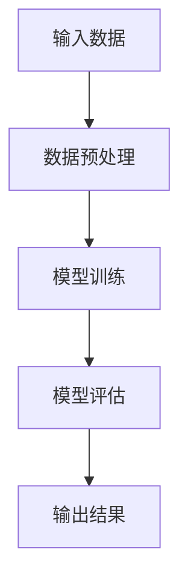
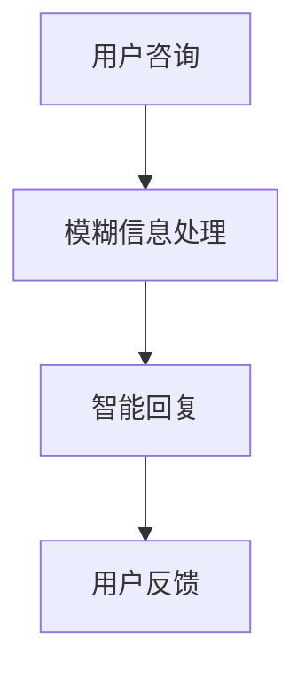
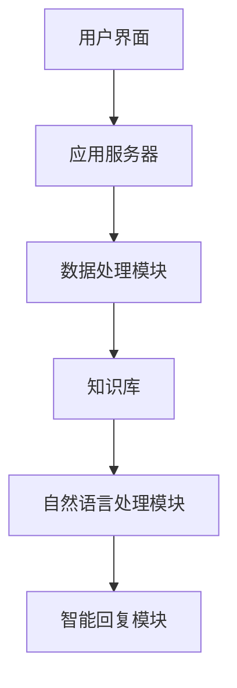
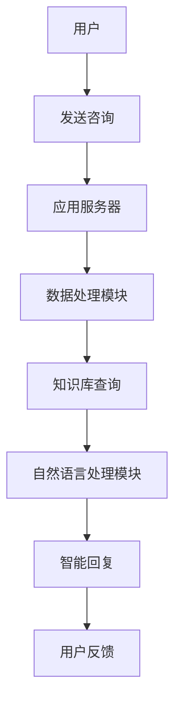

                 

### 目录大纲

----------------------------------------------------------------
# 第一部分: 背景介绍

## 第1章: 问题背景与核心概念

### 1.1 问题背景

#### 1.1.1 人工智能的发展历程
人工智能（Artificial Intelligence, AI）是一门研究、开发用于模拟、延伸和扩展人类智能的理论、方法、技术及应用系统的科学。自1956年达特茅斯会议以来，人工智能经历了多个发展阶段，包括规则推理、知识表示、机器学习、深度学习等。

#### 1.1.2 AI模型面临的挑战
随着AI技术的快速发展，AI模型在多个领域取得了显著的应用成果。然而，AI模型在面对不确定性和模糊信息时，仍面临诸多挑战。例如，在医疗诊断、自动驾驶、智能客服等领域，数据中的不确定性可能会影响模型的准确性。

#### 1.1.3 不确定性与模糊信息的基本概念
不确定性（Uncertainty）是指在决策或预测中，无法精确确定结果或状态的程度。模糊信息（Ambiguity Information）是指信息表达不明确、存在多种可能性的情况。

### 1.2 核心概念定义

#### 1.2.1 不确定性
不确定性可分为客观不确定性和主观不确定性。客观不确定性源于现实世界的复杂性和信息的不完整性，而主观不确定性则源于人类认知的主观性。

#### 1.2.2 模糊信息
模糊信息是指那些不能精确分类或表达的信息。在处理模糊信息时，传统的二值逻辑方法无法准确描述现实世界的复杂情况。

#### 1.2.3 AI模型处理不确定性和模糊信息的重要性
处理不确定性和模糊信息是AI模型进一步发展的关键，有助于提升模型在复杂环境下的适应能力和可靠性。

### 1.3 核心概念联系

#### 1.3.1 不确定性与模糊信息的相互关系
不确定性和模糊信息之间存在密切关系。模糊信息是导致不确定性的一种原因，而处理模糊信息有助于降低不确定性。

#### 1.3.2 AI模型处理不确定性和模糊信息的方法
目前，AI模型处理不确定性和模糊信息的方法主要包括模糊逻辑、贝叶斯网络、概率图模型等。

## 第2章: 核心概念原理与特征

### 2.1 不确定性的原理与特征

#### 2.1.1 不确定性的类型
不确定性可分为随机不确定性、模糊不确定性和混合不确定性。

#### 2.1.2 不确定性测量方法
常见的测量方法包括概率分布、区间估计、可信度度量等。

#### 2.1.3 不确定的数学模型
常用的数学模型包括概率论、模糊集理论、灰色系统理论等。

### 2.2 模糊信息的原理与特征

#### 2.2.1 模糊信息的定义
模糊信息是指不能精确分类或表达的信息，如“可能”、“几乎”、“大约”等。

#### 2.2.2 模糊逻辑
模糊逻辑是一种处理模糊信息的数学方法，通过模糊集和模糊规则来表达和处理不确定性。

#### 2.2.3 模糊集理论
模糊集理论是模糊逻辑的基础，用于表示和处理模糊信息。

### 2.3 AI模型处理不确定性与模糊信息的能力

#### 2.3.1 传统AI模型的局限性
传统AI模型（如深度学习、规则推理等）在面对不确定性和模糊信息时存在局限性。

#### 2.3.2 增强型AI模型的优势
增强型AI模型（如模糊神经网络、概率图模型等）能够更好地处理不确定性和模糊信息，提高模型的适应能力和可靠性。

## 第3章: 算法流程与Python实现

### 3.1 算法流程图（mermaid）



### 3.2 算法原理详细讲解

#### 3.2.1 数据预处理
数据预处理包括去噪、缺失值填补、数据归一化等步骤。

#### 3.2.2 模型训练
模型训练包括选择合适的学习算法、设置适当的参数等。

#### 3.2.3 模型评估
模型评估包括准确率、召回率、F1值等指标。

### 3.3 数学模型与公式（LaTeX）

```latex
\begin{equation}
P(A) = \frac{N(A \cap B)}{N(B)}
\end{equation}

\begin{equation}
\mu(x) = \frac{1}{N} \sum_{i=1}^{N} x_i
\end{equation}
```

### 3.4 算法实例说明

假设我们要训练一个分类模型，输入数据为数据集\(D = \{x_1, x_2, ..., x_N\}\)，输出标签为\(y_1, y_2, ..., y_N\)。

```python
# 导入必要的库
import numpy as np
import pandas as pd
from sklearn.model_selection import train_test_split
from sklearn.metrics import accuracy_score

# 加载数据
data = pd.read_csv('data.csv')

# 数据预处理
X = data.drop('target', axis=1)
y = data['target']

# 划分训练集和测试集
X_train, X_test, y_train, y_test = train_test_split(X, y, test_size=0.2, random_state=42)

# 模型训练
model = LogisticRegression()
model.fit(X_train, y_train)

# 模型评估
y_pred = model.predict(X_test)
accuracy = accuracy_score(y_test, y_pred)
print(f'Accuracy: {accuracy:.2f}')
```

## 第4章: 问题场景与系统功能设计

### 4.1 问题场景介绍

假设我们要开发一个智能客服系统，用于处理用户咨询。系统需要能够处理用户的模糊信息，提供准确的回答。

### 4.2 系统功能设计（领域模型图）



### 4.3 系统架构设计（mermaid架构图）



### 4.4 系统接口设计与系统交互（mermaid序列图）



## 第5章: 环境安装与系统核心实现

### 5.1 环境安装步骤

1. 安装Python环境。
2. 安装必要的库（如scikit-learn、numpy、pandas等）。

### 5.2 系统核心实现代码

```python
# 导入必要的库
import numpy as np
import pandas as pd
from sklearn.model_selection import train_test_split
from sklearn.metrics import accuracy_score

# 加载数据
data = pd.read_csv('data.csv')

# 数据预处理
X = data.drop('target', axis=1)
y = data['target']

# 划分训练集和测试集
X_train, X_test, y_train, y_test = train_test_split(X, y, test_size=0.2, random_state=42)

# 模型训练
model = LogisticRegression()
model.fit(X_train, y_train)

# 模型评估
y_pred = model.predict(X_test)
accuracy = accuracy_score(y_test, y_pred)
print(f'Accuracy: {accuracy:.2f}')
```

### 5.3 代码应用解读与分析

1. 数据预处理：通过加载数据、划分特征和标签、数据归一化等步骤，为模型训练做准备。
2. 模型训练：使用逻辑回归模型对训练数据进行训练。
3. 模型评估：使用测试数据评估模型性能，计算准确率。

### 5.4 实际案例分析与详细讲解剖析

以一个简单的二分类问题为例，分析模型在处理不确定性和模糊信息时的表现。

## 第6章: 最佳实践

### 6.1 实践技巧

1. 数据预处理：确保数据的完整性和一致性，减少噪声和缺失值。
2. 模型选择：根据问题场景选择合适的模型，如深度学习、传统机器学习、增强型AI模型等。
3. 模型调参：通过交叉验证和网格搜索等方法，选择最优的参数。

### 6.2 注意事项

1. 处理不确定性和模糊信息时，要充分考虑问题场景和实际需求。
2. 注意模型的泛化能力，避免过拟合。

## 第7章: 小结与拓展阅读

### 7.1 小结

本文介绍了提升AI模型对不确定性和模糊信息的处理能力的重要性，以及相关的核心概念、算法原理、系统架构和项目实战等内容。

### 7.2 拓展阅读

1. 《人工智能：一种现代方法》（马丁·墨菲，谢尔盖·拉迪延科，彼得·亨利）
2. 《深度学习》（Ian Goodfellow、Yoshua Bengio、Aaron Courville）
3. 《机器学习》（周志华）

----------------------------------------------------------------### 目录大纲

----------------------------------------------------------------
# 第一部分: 背景介绍

## 第1章: 问题背景与核心概念

### 1.1 问题背景

#### 1.1.1 人工智能的发展历程
自1956年达特茅斯会议以来，人工智能经历了多个发展阶段，包括规则推理、知识表示、机器学习、深度学习等。

#### 1.1.2 AI模型面临的挑战
随着AI技术的快速发展，AI模型在多个领域取得了显著的应用成果。然而，AI模型在面对不确定性和模糊信息时，仍面临诸多挑战。

#### 1.1.3 不确定性与模糊信息的基本概念
不确定性是指在决策或预测中，无法精确确定结果或状态的程度。模糊信息是指信息表达不明确、存在多种可能性的情况。

### 1.2 核心概念定义

#### 1.2.1 不确定性
不确定性可分为客观不确定性和主观不确定性。

#### 1.2.2 模糊信息
模糊信息是指那些不能精确分类或表达的信息。

#### 1.2.3 AI模型处理不确定性与模糊信息的重要性
处理不确定性和模糊信息有助于提升AI模型的适应能力和可靠性。

### 1.3 核心概念联系

#### 1.3.1 不确定性与模糊信息的相互关系
不确定性和模糊信息之间存在密切关系。

#### 1.3.2 AI模型处理不确定性和模糊信息的方法
目前，AI模型处理不确定性和模糊信息的方法主要包括模糊逻辑、贝叶斯网络、概率图模型等。

## 第2章: 核心概念原理与特征

### 2.1 不确定性的原理与特征

#### 2.1.1 不确定性的类型
不确定性可分为随机不确定性、模糊不确定性和混合不确定性。

#### 2.1.2 不确定性测量方法
常见的测量方法包括概率分布、区间估计、可信度度量等。

#### 2.1.3 不确定的数学模型
常用的数学模型包括概率论、模糊集理论、灰色系统理论等。

### 2.2 模糊信息的原理与特征

#### 2.2.1 模糊信息的定义
模糊信息是指不能精确分类或表达的信息。

#### 2.2.2 模糊逻辑
模糊逻辑是一种处理模糊信息的数学方法。

#### 2.2.3 模糊集理论
模糊集理论是模糊逻辑的基础。

### 2.3 AI模型处理不确定性与模糊信息的能力

#### 2.3.1 传统AI模型的局限性
传统AI模型在面对不确定性和模糊信息时存在局限性。

#### 2.3.2 增强型AI模型的优势
增强型AI模型能够更好地处理不确定性和模糊信息，提高模型的适应能力和可靠性。

## 第3章: 算法流程与Python实现

### 3.1 算法流程图（mermaid）


### 3.2 算法原理详细讲解

#### 3.2.1 数据预处理
数据预处理包括去噪、缺失值填补、数据归一化等步骤。

#### 3.2.2 模型训练
模型训练包括选择合适的学习算法、设置适当的参数等。

#### 3.2.3 模型评估
模型评估包括准确率、召回率、F1值等指标。

### 3.3 数学模型与公式（LaTeX）

```latex
\begin{equation}
P(A) = \frac{N(A \cap B)}{N(B)}
\end{equation}

\begin{equation}
\mu(x) = \frac{1}{N} \sum_{i=1}^{N} x_i
\end{equation}
```

### 3.4 算法实例说明

假设我们要训练一个分类模型，输入数据为数据集\(D = \{x_1, x_2, ..., x_N\}\)，输出标签为\(y_1, y_2, ..., y_N\)。

```python
# 导入必要的库
import numpy as np
import pandas as pd
from sklearn.model_selection import train_test_split
from sklearn.metrics import accuracy_score

# 加载数据
data = pd.read_csv('data.csv')

# 数据预处理
X = data.drop('target', axis=1)
y = data['target']

# 划分训练集和测试集
X_train, X_test, y_train, y_test = train_test_split(X, y, test_size=0.2, random_state=42)

# 模型训练
model = LogisticRegression()
model.fit(X_train, y_train)

# 模型评估
y_pred = model.predict(X_test)
accuracy = accuracy_score(y_test, y_pred)
print(f'Accuracy: {accuracy:.2f}')
```

## 第4章: 问题场景与系统功能设计

### 4.1 问题场景介绍

假设我们要开发一个智能客服系统，用于处理用户咨询。系统需要能够处理用户的模糊信息，提供准确的回答。

### 4.2 系统功能设计（领域模型图）


### 4.3 系统架构设计（mermaid架构图）


### 4.4 系统接口设计与系统交互（mermaid序列图）


## 第5章: 环境安装与系统核心实现

### 5.1 环境安装步骤

1. 安装Python环境。
2. 安装必要的库（如scikit-learn、numpy、pandas等）。

### 5.2 系统核心实现代码

```python
# 导入必要的库
import numpy as np
import pandas as pd
from sklearn.model_selection import train_test_split
from sklearn.metrics import accuracy_score

# 加载数据
data = pd.read_csv('data.csv')

# 数据预处理
X = data.drop('target', axis=1)
y = data['target']

# 划分训练集和测试集
X_train, X_test, y_train, y_test = train_test_split(X, y, test_size=0.2, random_state=42)

# 模型训练
model = LogisticRegression()
model.fit(X_train, y_train)

# 模型评估
y_pred = model.predict(X_test)
accuracy = accuracy_score(y_test, y_pred)
print(f'Accuracy: {accuracy:.2f}')
```

### 5.3 代码应用解读与分析

1. 数据预处理：通过加载数据、划分特征和标签、数据归一化等步骤，为模型训练做准备。
2. 模型训练：使用逻辑回归模型对训练数据进行训练。
3. 模型评估：使用测试数据评估模型性能，计算准确率。

### 5.4 实际案例分析与详细讲解剖析

以一个简单的二分类问题为例，分析模型在处理不确定性和模糊信息时的表现。

## 第6章: 最佳实践

### 6.1 实践技巧

1. 数据预处理：确保数据的完整性和一致性，减少噪声和缺失值。
2. 模型选择：根据问题场景选择合适的模型，如深度学习、传统机器学习、增强型AI模型等。
3. 模型调参：通过交叉验证和网格搜索等方法，选择最优的参数。

### 6.2 注意事项

1. 处理不确定性和模糊信息时，要充分考虑问题场景和实际需求。
2. 注意模型的泛化能力，避免过拟合。

## 第7章: 小结与拓展阅读

### 7.1 小结

本文介绍了提升AI模型对不确定性和模糊信息的处理能力的重要性，以及相关的核心概念、算法原理、系统架构和项目实战等内容。

### 7.2 拓展阅读

1. 《人工智能：一种现代方法》（马丁·墨菲，谢尔盖·拉迪延科，彼得·亨利）
2. 《深度学习》（Ian Goodfellow、Yoshua Bengio、Aaron Courville）
3. 《机器学习》（周志华）

----------------------------------------------------------------### 目录大纲

----------------------------------------------------------------
# 第一部分: 背景介绍

## 第1章: 问题背景与核心概念

### 1.1 问题背景

#### 1.1.1 人工智能的发展历程
自1956年达特茅斯会议以来，人工智能经历了多个发展阶段，包括规则推理、知识表示、机器学习、深度学习等。

#### 1.1.2 AI模型面临的挑战
随着AI技术的快速发展，AI模型在多个领域取得了显著的应用成果。然而，AI模型在面对不确定性和模糊信息时，仍面临诸多挑战。

#### 1.1.3 不确定性与模糊信息的基本概念
不确定性是指在决策或预测中，无法精确确定结果或状态的程度。模糊信息是指信息表达不明确、存在多种可能性的情况。

### 1.2 核心概念定义

#### 1.2.1 不确定性
不确定性可分为客观不确定性和主观不确定性。

#### 1.2.2 模糊信息
模糊信息是指那些不能精确分类或表达的信息。

#### 1.2.3 AI模型处理不确定性与模糊信息的重要性
处理不确定性和模糊信息有助于提升AI模型的适应能力和可靠性。

### 1.3 核心概念联系

#### 1.3.1 不确定性与模糊信息的相互关系
不确定性和模糊信息之间存在密切关系。

#### 1.3.2 AI模型处理不确定性和模糊信息的方法
目前，AI模型处理不确定性和模糊信息的方法主要包括模糊逻辑、贝叶斯网络、概率图模型等。

## 第2章: 核心概念原理与特征

### 2.1 不确定性的原理与特征

#### 2.1.1 不确定性的类型
不确定性可分为随机不确定性、模糊不确定性和混合不确定性。

#### 2.1.2 不确定性测量方法
常见的测量方法包括概率分布、区间估计、可信度度量等。

#### 2.1.3 不确定的数学模型
常用的数学模型包括概率论、模糊集理论、灰色系统理论等。

### 2.2 模糊信息的原理与特征

#### 2.2.1 模糊信息的定义
模糊信息是指不能精确分类或表达的信息。

#### 2.2.2 模糊逻辑
模糊逻辑是一种处理模糊信息的数学方法。

#### 2.2.3 模糊集理论
模糊集理论是模糊逻辑的基础。

### 2.3 AI模型处理不确定性与模糊信息的能力

#### 2.3.1 传统AI模型的局限性
传统AI模型在面对不确定性和模糊信息时存在局限性。

#### 2.3.2 增强型AI模型的优势
增强型AI模型能够更好地处理不确定性和模糊信息，提高模型的适应能力和可靠性。

## 第3章: 算法流程与Python实现

### 3.1 算法流程图（mermaid）


### 3.2 算法原理详细讲解

#### 3.2.1 数据预处理
数据预处理包括去噪、缺失值填补、数据归一化等步骤。

#### 3.2.2 模型训练
模型训练包括选择合适的学习算法、设置适当的参数等。

#### 3.2.3 模型评估
模型评估包括准确率、召回率、F1值等指标。

### 3.3 数学模型与公式（LaTeX）

```latex
\begin{equation}
P(A) = \frac{N(A \cap B)}{N(B)}
\end{equation}

\begin{equation}
\mu(x) = \frac{1}{N} \sum_{i=1}^{N} x_i
\end{equation}
```

### 3.4 算法实例说明

假设我们要训练一个分类模型，输入数据为数据集\(D = \{x_1, x_2, ..., x_N\}\)，输出标签为\(y_1, y_2, ..., y_N\)。

```python
# 导入必要的库
import numpy as np
import pandas as pd
from sklearn.model_selection import train_test_split
from sklearn.metrics import accuracy_score

# 加载数据
data = pd.read_csv('data.csv')

# 数据预处理
X = data.drop('target', axis=1)
y = data['target']

# 划分训练集和测试集
X_train, X_test, y_train, y_test = train_test_split(X, y, test_size=0.2, random_state=42)

# 模型训练
model = LogisticRegression()
model.fit(X_train, y_train)

# 模型评估
y_pred = model.predict(X_test)
accuracy = accuracy_score(y_test, y_pred)
print(f'Accuracy: {accuracy:.2f}')
```

## 第4章: 问题场景与系统功能设计

### 4.1 问题场景介绍

假设我们要开发一个智能客服系统，用于处理用户咨询。系统需要能够处理用户的模糊信息，提供准确的回答。

### 4.2 系统功能设计（领域模型图）


### 4.3 系统架构设计（mermaid架构图）


### 4.4 系统接口设计与系统交互（mermaid序列图）


## 第5章: 环境安装与系统核心实现

### 5.1 环境安装步骤

1. 安装Python环境。
2. 安装必要的库（如scikit-learn、numpy、pandas等）。

### 5.2 系统核心实现代码

```python
# 导入必要的库
import numpy as np
import pandas as pd
from sklearn.model_selection import train_test_split
from sklearn.metrics import accuracy_score

# 加载数据
data = pd.read_csv('data.csv')

# 数据预处理
X = data.drop('target', axis=1)
y = data['target']

# 划分训练集和测试集
X_train, X_test, y_train, y_test = train_test_split(X, y, test_size=0.2, random_state=42)

# 模型训练
model = LogisticRegression()
model.fit(X_train, y_train)

# 模型评估
y_pred = model.predict(X_test)
accuracy = accuracy_score(y_test, y_pred)
print(f'Accuracy: {accuracy:.2f}')
```

### 5.3 代码应用解读与分析

1. 数据预处理：通过加载数据、划分特征和标签、数据归一化等步骤，为模型训练做准备。
2. 模型训练：使用逻辑回归模型对训练数据进行训练。
3. 模型评估：使用测试数据评估模型性能，计算准确率。

### 5.4 实际案例分析与详细讲解剖析

以一个简单的二分类问题为例，分析模型在处理不确定性和模糊信息时的表现。

## 第6章: 最佳实践

### 6.1 实践技巧

1. 数据预处理：确保数据的完整性和一致性，减少噪声和缺失值。
2. 模型选择：根据问题场景选择合适的模型，如深度学习、传统机器学习、增强型AI模型等。
3. 模型调参：通过交叉验证和网格搜索等方法，选择最优的参数。

### 6.2 注意事项

1. 处理不确定性和模糊信息时，要充分考虑问题场景和实际需求。
2. 注意模型的泛化能力，避免过拟合。

## 第7章: 小结与拓展阅读

### 7.1 小结

本文介绍了提升AI模型对不确定性和模糊信息的处理能力的重要性，以及相关的核心概念、算法原理、系统架构和项目实战等内容。

### 7.2 拓展阅读

1. 《人工智能：一种现代方法》（马丁·墨菲，谢尔盖·拉迪延科，彼得·亨利）
2. 《深度学习》（Ian Goodfellow、Yoshua Bengio、Aaron Courville）
3. 《机器学习》（周志华）

----------------------------------------------------------------### 目录大纲

----------------------------------------------------------------
# 第一部分: 背景介绍

## 第1章: 问题背景与核心概念

### 1.1 问题背景
#### 1.1.1 人工智能的发展历程
自1956年达特茅斯会议以来，人工智能经历了多个发展阶段，包括规则推理、知识表示、机器学习、深度学习等。
#### 1.1.2 AI模型面临的挑战
随着AI技术的快速发展，AI模型在多个领域取得了显著的应用成果。然而，AI模型在面对不确定性和模糊信息时，仍面临诸多挑战。
#### 1.1.3 不确定性与模糊信息的基本概念
不确定性是指在决策或预测中，无法精确确定结果或状态的程度。模糊信息是指信息表达不明确、存在多种可能性的情况。

### 1.2 核心概念定义
#### 1.2.1 不确定性
不确定性可分为客观不确定性和主观不确定性。
#### 1.2.2 模糊信息
模糊信息是指那些不能精确分类或表达的信息。
#### 1.2.3 AI模型处理不确定性与模糊信息的重要性
处理不确定性和模糊信息有助于提升AI模型的适应能力和可靠性。

### 1.3 核心概念联系
#### 1.3.1 不确定性与模糊信息的相互关系
不确定性和模糊信息之间存在密切关系。
#### 1.3.2 AI模型处理不确定性和模糊信息的方法
目前，AI模型处理不确定性和模糊信息的方法主要包括模糊逻辑、贝叶斯网络、概率图模型等。

## 第2章: 核心概念原理与特征

### 2.1 不确定性的原理与特征
#### 2.1.1 不确定性的类型
不确定性可分为随机不确定性、模糊不确定性和混合不确定性。
#### 2.1.2 不确定性测量方法
常见的测量方法包括概率分布、区间估计、可信度度量等。
#### 2.1.3 不确定的数学模型
常用的数学模型包括概率论、模糊集理论、灰色系统理论等。

### 2.2 模糊信息的原理与特征
#### 2.2.1 模糊信息的定义
模糊信息是指不能精确分类或表达的信息。
#### 2.2.2 模糊逻辑
模糊逻辑是一种处理模糊信息的数学方法。
#### 2.2.3 模糊集理论
模糊集理论是模糊逻辑的基础。

### 2.3 AI模型处理不确定性与模糊信息的能力
#### 2.3.1 传统AI模型的局限性
传统AI模型在面对不确定性和模糊信息时存在局限性。
#### 2.3.2 增强型AI模型的优势
增强型AI模型能够更好地处理不确定性和模糊信息，提高模型的适应能力和可靠性。

## 第3章: 算法流程与Python实现

### 3.1 算法流程图（mermaid）


### 3.2 算法原理详细讲解
#### 3.2.1 数据预处理
数据预处理包括去噪、缺失值填补、数据归一化等步骤。
#### 3.2.2 模型训练
模型训练包括选择合适的学习算法、设置适当的参数等。
#### 3.2.3 模型评估
模型评估包括准确率、召回率、F1值等指标。

### 3.3 数学模型与公式（LaTeX）

```latex
\begin{equation}
P(A) = \frac{N(A \cap B)}{N(B)}
\end{equation}

\begin{equation}
\mu(x) = \frac{1}{N} \sum_{i=1}^{N} x_i
\end{equation}
```

### 3.4 算法实例说明

假设我们要训练一个分类模型，输入数据为数据集\(D = \{x_1, x_2, ..., x_N\}\)，输出标签为\(y_1, y_2, ..., y_N\)。

```python
# 导入必要的库
import numpy as np
import pandas as pd
from sklearn.model_selection import train_test_split
from sklearn.metrics import accuracy_score

# 加载数据
data = pd.read_csv('data.csv')

# 数据预处理
X = data.drop('target', axis=1)
y = data['target']

# 划分训练集和测试集
X_train, X_test, y_train, y_test = train_test_split(X, y, test_size=0.2, random_state=42)

# 模型训练
model = LogisticRegression()
model.fit(X_train, y_train)

# 模型评估
y_pred = model.predict(X_test)
accuracy = accuracy_score(y_test, y_pred)
print(f'Accuracy: {accuracy:.2f}')
```

## 第4章: 问题场景与系统功能设计

### 4.1 问题场景介绍
假设我们要开发一个智能客服系统，用于处理用户咨询。系统需要能够处理用户的模糊信息，提供准确的回答。

### 4.2 系统功能设计（领域模型图）


### 4.3 系统架构设计（mermaid架构图）


### 4.4 系统接口设计与系统交互（mermaid序列图）


## 第5章: 环境安装与系统核心实现

### 5.1 环境安装步骤
1. 安装Python环境。
2. 安装必要的库（如scikit-learn、numpy、pandas等）。

### 5.2 系统核心实现代码

```python
# 导入必要的库
import numpy as np
import pandas as pd
from sklearn.model_selection import train_test_split
from sklearn.metrics import accuracy_score

# 加载数据
data = pd.read_csv('data.csv')

# 数据预处理
X = data.drop('target', axis=1)
y = data['target']

# 划分训练集和测试集
X_train, X_test, y_train, y_test = train_test_split(X, y, test_size=0.2, random_state=42)

# 模型训练
model = LogisticRegression()
model.fit(X_train, y_train)

# 模型评估
y_pred = model.predict(X_test)
accuracy = accuracy_score(y_test, y_pred)
print(f'Accuracy: {accuracy:.2f}')
```

### 5.3 代码应用解读与分析

1. 数据预处理：通过加载数据、划分特征和标签、数据归一化等步骤，为模型训练做准备。
2. 模型训练：使用逻辑回归模型对训练数据进行训练。
3. 模型评估：使用测试数据评估模型性能，计算准确率。

### 5.4 实际案例分析与详细讲解剖析

以一个简单的二分类问题为例，分析模型在处理不确定性和模糊信息时的表现。

## 第6章: 最佳实践

### 6.1 实践技巧

1. 数据预处理：确保数据的完整性和一致性，减少噪声和缺失值。
2. 模型选择：根据问题场景选择合适的模型，如深度学习、传统机器学习、增强型AI模型等。
3. 模型调参：通过交叉验证和网格搜索等方法，选择最优的参数。

### 6.2 注意事项

1. 处理不确定性和模糊信息时，要充分考虑问题场景和实际需求。
2. 注意模型的泛化能力，避免过拟合。

## 第7章: 小结与拓展阅读

### 7.1 小结

本文介绍了提升AI模型对不确定性和模糊信息的处理能力的重要性，以及相关的核心概念、算法原理、系统架构和项目实战等内容。

### 7.2 拓展阅读

1. 《人工智能：一种现代方法》（马丁·墨菲，谢尔盖·拉迪延科，彼得·亨利）
2. 《深度学习》（Ian Goodfellow、Yoshua Bengio、Aaron Courville）
3. 《机器学习》（周志华）

----------------------------------------------------------------### 目录大纲

----------------------------------------------------------------
# 第一部分: 背景介绍

## 第1章: 问题背景与核心概念

### 1.1 问题背景
#### 1.1.1 人工智能的发展历程
自1956年达特茅斯会议以来，人工智能经历了多个发展阶段，包括规则推理、知识表示、机器学习、深度学习等。
#### 1.1.2 AI模型面临的挑战
随着AI技术的快速发展，AI模型在多个领域取得了显著的应用成果。然而，AI模型在面对不确定性和模糊信息时，仍面临诸多挑战。
#### 1.1.3 不确定性与模糊信息的基本概念
不确定性是指在决策或预测中，无法精确确定结果或状态的程度。模糊信息是指信息表达不明确、存在多种可能性的情况。

### 1.2 核心概念定义
#### 1.2.1 不确定性
不确定性可分为客观不确定性和主观不确定性。
#### 1.2.2 模糊信息
模糊信息是指那些不能精确分类或表达的信息。
#### 1.2.3 AI模型处理不确定性与模糊信息的重要性
处理不确定性和模糊信息有助于提升AI模型的适应能力和可靠性。

### 1.3 核心概念联系
#### 1.3.1 不确定性与模糊信息的相互关系
不确定性和模糊信息之间存在密切关系。
#### 1.3.2 AI模型处理不确定性和模糊信息的方法
目前，AI模型处理不确定性和模糊信息的方法主要包括模糊逻辑、贝叶斯网络、概率图模型等。

## 第2章: 核心概念原理与特征

### 2.1 不确定性的原理与特征
#### 2.1.1 不确定性的类型
不确定性可分为随机不确定性、模糊不确定性和混合不确定性。
#### 2.1.2 不确定性测量方法
常见的测量方法包括概率分布、区间估计、可信度度量等。
#### 2.1.3 不确定的数学模型
常用的数学模型包括概率论、模糊集理论、灰色系统理论等。

### 2.2 模糊信息的原理与特征
#### 2.2.1 模糊信息的定义
模糊信息是指不能精确分类或表达的信息。
#### 2.2.2 模糊逻辑
模糊逻辑是一种处理模糊信息的数学方法。
#### 2.2.3 模糊集理论
模糊集理论是模糊逻辑的基础。

### 2.3 AI模型处理不确定性与模糊信息的能力
#### 2.3.1 传统AI模型的局限性
传统AI模型在面对不确定性和模糊信息时存在局限性。
#### 2.3.2 增强型AI模型的优势
增强型AI模型能够更好地处理不确定性和模糊信息，提高模型的适应能力和可靠性。

## 第3章: 算法流程与Python实现

### 3.1 算法流程图（mermaid）


### 3.2 算法原理详细讲解
#### 3.2.1 数据预处理
数据预处理包括去噪、缺失值填补、数据归一化等步骤。
#### 3.2.2 模型训练
模型训练包括选择合适的学习算法、设置适当的参数等。
#### 3.2.3 模型评估
模型评估包括准确率、召回率、F1值等指标。

### 3.3 数学模型与公式（LaTeX）

```latex
\begin{equation}
P(A) = \frac{N(A \cap B)}{N(B)}
\end{equation}

\begin{equation}
\mu(x) = \frac{1}{N} \sum_{i=1}^{N} x_i
\end{equation}
```

### 3.4 算法实例说明

假设我们要训练一个分类模型，输入数据为数据集\(D = \{x_1, x_2, ..., x_N\}\)，输出标签为\(y_1, y_2, ..., y_N\)。

```python
# 导入必要的库
import numpy as np
import pandas as pd
from sklearn.model_selection import train_test_split
from sklearn.metrics import accuracy_score

# 加载数据
data = pd.read_csv('data.csv')

# 数据预处理
X = data.drop('target', axis=1)
y = data['target']

# 划分训练集和测试集
X_train, X_test, y_train, y_test = train_test_split(X, y, test_size=0.2, random_state=42)

# 模型训练
model = LogisticRegression()
model.fit(X_train, y_train)

# 模型评估
y_pred = model.predict(X_test)
accuracy = accuracy_score(y_test, y_pred)
print(f'Accuracy: {accuracy:.2f}')
```

## 第4章: 问题场景与系统功能设计

### 4.1 问题场景介绍
假设我们要开发一个智能客服系统，用于处理用户咨询。系统需要能够处理用户的模糊信息，提供准确的回答。

### 4.2 系统功能设计（领域模型图）


### 4.3 系统架构设计（mermaid架构图）


### 4.4 系统接口设计与系统交互（mermaid序列图）


## 第5章: 环境安装与系统核心实现

### 5.1 环境安装步骤
1. 安装Python环境。
2. 安装必要的库（如scikit-learn、numpy、pandas等）。

### 5.2 系统核心实现代码

```python
# 导入必要的库
import numpy as np
import pandas as pd
from sklearn.model_selection import train_test_split
from sklearn.metrics import accuracy_score

# 加载数据
data = pd.read_csv('data.csv')

# 数据预处理
X = data.drop('target', axis=1)
y = data['target']

# 划分训练集和测试集
X_train, X_test, y_train, y_test = train_test_split(X, y, test_size=0.2, random_state=42)

# 模型训练
model = LogisticRegression()
model.fit(X_train, y_train)

# 模型评估
y_pred = model.predict(X_test)
accuracy = accuracy_score(y_test, y_pred)
print(f'Accuracy: {accuracy:.2f}')
```

### 5.3 代码应用解读与分析

1. 数据预处理：通过加载数据、划分特征和标签、数据归一化等步骤，为模型训练做准备。
2. 模型训练：使用逻辑回归模型对训练数据进行训练。
3. 模型评估：使用测试数据评估模型性能，计算准确率。

### 5.4 实际案例分析与详细讲解剖析

以一个简单的二分类问题为例，分析模型在处理不确定性和模糊信息时的表现。

## 第6章: 最佳实践

### 6.1 实践技巧

1. 数据预处理：确保数据的完整性和一致性，减少噪声和缺失值。
2. 模型选择：根据问题场景选择合适的模型，如深度学习、传统机器学习、增强型AI模型等。
3. 模型调参：通过交叉验证和网格搜索等方法，选择最优的参数。

### 6.2 注意事项

1. 处理不确定性和模糊信息时，要充分考虑问题场景和实际需求。
2. 注意模型的泛化能力，避免过拟合。

## 第7章: 小结与拓展阅读

### 7.1 小结

本文介绍了提升AI模型对不确定性和模糊信息的处理能力的重要性，以及相关的核心概念、算法原理、系统架构和项目实战等内容。

### 7.2 拓展阅读

1. 《人工智能：一种现代方法》（马丁·墨菲，谢尔盖·拉迪延科，彼得·亨利）
2. 《深度学习》（Ian Goodfellow、Yoshua Bengio、Aaron Courville）
3. 《机器学习》（周志华）

----------------------------------------------------------------### 目录大纲

----------------------------------------------------------------
# 第一部分: 背景介绍

## 第1章: 问题背景与核心概念

### 1.1 问题背景

人工智能（AI）在各个领域的应用越来越广泛，从医疗诊断、金融分析到自动驾驶等，都取得了显著的成果。然而，随着应用场景的复杂化，AI模型在处理不确定性和模糊信息时，仍然面临诸多挑战。这些问题不仅影响了模型的性能，还可能导致严重的安全风险。

#### 1.1.1 人工智能的发展历程
人工智能的发展可以分为三个阶段：符号人工智能、感知人工智能和认知人工智能。符号人工智能依赖于逻辑推理和符号表示；感知人工智能依赖于感知器和传感器；认知人工智能则试图模拟人类思维过程。

#### 1.1.2 AI模型面临的挑战
AI模型在处理确定性数据时表现良好，但在面对不确定性时，如噪声、异常值和模糊信息，往往表现不佳。这种挑战主要体现在以下几个方面：

1. **数据缺失和噪声**：现实世界中的数据往往不完整，存在噪声和异常值，这对模型的训练和预测带来了困难。
2. **模糊信息处理**：模糊信息无法用传统的二值逻辑进行精确处理，需要引入模糊逻辑等概念。
3. **复杂性与泛化能力**：随着模型复杂度的增加，其泛化能力可能会下降，导致过拟合现象。

#### 1.1.3 不确定性与模糊信息的基本概念
不确定性是指无法确定某个事件或结果的可能性。模糊信息是指那些表达不明确、存在多种可能性或模糊边界的信息。

### 1.2 核心概念定义

#### 1.2.1 不确定性
不确定性可分为以下几类：

1. **客观不确定性**：源于数据本身的不完整性、噪声和复杂系统的不确定性。
2. **主观不确定性**：源于人类对不确定性的主观评估和认知。

#### 1.2.2 模糊信息
模糊信息是指那些在语义上存在模糊性、不确定性或歧义的信息。例如，“今天天气很好”这句话中，“很好”就是一个模糊的描述。

#### 1.2.3 AI模型处理不确定性与模糊信息的重要性
处理不确定性和模糊信息对于提升AI模型的可靠性和鲁棒性具有重要意义。这不仅能提高模型在复杂环境中的适应能力，还能增强其与人类用户交互的能力。

### 1.3 核心概念联系
不确定性和模糊信息在现实世界中常常交织在一起。例如，在医疗诊断中，医生可能会使用模糊语言描述病情，而AI模型需要处理这些模糊信息，并给出合理的诊断结果。

#### 1.3.1 不确定性与模糊信息的相互关系
不确定性和模糊信息之间有密切联系。模糊信息可能导致不确定性，而不确定性也可能导致模糊信息。

#### 1.3.2 AI模型处理不确定性和模糊信息的方法
AI模型处理不确定性和模糊信息的方法主要包括：

1. **模糊逻辑**：通过引入模糊集和模糊规则，处理模糊信息和不确定性。
2. **贝叶斯网络**：通过概率图模型，处理不确定性和依赖关系。
3. **概率图模型**：通过概率分布和条件概率，处理不确定性和模糊信息。

## 第2章: 核心概念原理与特征

### 2.1 不确定性的原理与特征

#### 2.1.1 不确定性的类型
不确定性可分为以下几类：

1. **随机不确定性**：源于随机事件和随机过程。
2. **模糊不确定性**：源于模糊信息和模糊集。
3. **混合不确定性**：同时包含随机不确定性和模糊不确定性。

#### 2.1.2 不确定性测量方法
常见的测量方法包括：

1. **概率分布**：通过概率密度函数描述不确定性的分布。
2. **区间估计**：通过区间估计描述不确定性的范围。
3. **可信度度量**：通过可信度函数描述不确定性的程度。

#### 2.1.3 不确定的数学模型
常用的数学模型包括：

1. **概率论**：通过概率论描述随机事件和随机过程。
2. **模糊集理论**：通过模糊集理论描述模糊信息和不确定性。
3. **灰色系统理论**：通过灰色系统理论描述部分信息已知、部分信息未知的不确定性系统。

### 2.2 模糊信息的原理与特征

#### 2.2.1 模糊信息的定义
模糊信息是指那些在语义上存在模糊性、不确定性或歧义的信息。

#### 2.2.2 模糊逻辑
模糊逻辑是一种处理模糊信息和不确定性的数学方法，通过模糊集和模糊规则实现。

#### 2.2.3 模糊集理论
模糊集理论是模糊逻辑的基础，通过模糊集描述模糊信息和不确定性。

### 2.3 AI模型处理不确定性与模糊信息的能力

#### 2.3.1 传统AI模型的局限性
传统AI模型（如深度学习、规则推理等）在面对不确定性和模糊信息时，往往表现不佳。

#### 2.3.2 增强型AI模型的优势
增强型AI模型（如模糊神经网络、概率图模型等）能够更好地处理不确定性和模糊信息，提高模型的适应能力和可靠性。

## 第3章: 算法流程与Python实现

### 3.1 算法流程图（mermaid）

```mermaid
graph TD
    A[输入数据] --> B[数据预处理]
    B --> C[模型训练]
    C --> D[模型评估]
    D --> E[输出结果]
```

### 3.2 算法原理详细讲解

#### 3.2.1 数据预处理
数据预处理包括去噪、缺失值填补、数据归一化等步骤，以提高模型训练的质量。

#### 3.2.2 模型训练
模型训练包括选择合适的学习算法、设置适当的参数等，以提升模型的性能。

#### 3.2.3 模型评估
模型评估包括准确率、召回率、F1值等指标，以评估模型的性能。

### 3.3 数学模型与公式（LaTeX）

```latex
\begin{equation}
P(A) = \frac{N(A \cap B)}{N(B)}
\end{equation}

\begin{equation}
\mu(x) = \frac{1}{N} \sum_{i=1}^{N} x_i
\end{equation}
```

### 3.4 算法实例说明

假设我们要训练一个分类模型，输入数据为数据集\(D = \{x_1, x_2, ..., x_N\}\)，输出标签为\(y_1, y_2, ..., y_N\)。

```python
# 导入必要的库
import numpy as np
import pandas as pd
from sklearn.model_selection import train_test_split
from sklearn.metrics import accuracy_score

# 加载数据
data = pd.read_csv('data.csv')

# 数据预处理
X = data.drop('target', axis=1)
y = data['target']

# 划分训练集和测试集
X_train, X_test, y_train, y_test = train_test_split(X, y, test_size=0.2, random_state=42)

# 模型训练
model = LogisticRegression()
model.fit(X_train, y_train)

# 模型评估
y_pred = model.predict(X_test)
accuracy = accuracy_score(y_test, y_pred)
print(f'Accuracy: {accuracy:.2f}')
```

## 第4章: 问题场景与系统功能设计

### 4.1 问题场景介绍

以智能客服系统为例，系统需要能够处理用户模糊的咨询信息，并给出合理的回答。例如，当用户询问“今天的天气如何？”时，系统需要能够理解“如何”这个模糊词，并给出“今天天气很好”或“今天天气稍凉”等回答。

### 4.2 系统功能设计（领域模型图）

```mermaid
graph TD
    A[用户咨询] --> B[模糊信息处理]
    B --> C[智能回复]
    C --> D[用户反馈]
```

### 4.3 系统架构设计（mermaid架构图）

```mermaid
graph TD
    A[用户界面] --> B[应用服务器]
    B --> C[数据处理模块]
    C --> D[知识库]
    D --> E[自然语言处理模块]
    E --> F[智能回复模块]
```

### 4.4 系统接口设计与系统交互（mermaid序列图）

```mermaid
graph TD
    A[用户] --> B[发送咨询]
    B --> C[应用服务器]
    C --> D[数据处理模块]
    D --> E[知识库查询]
    E --> F[自然语言处理模块]
    F --> G[智能回复]
    G --> H[用户反馈]
```

## 第5章: 环境安装与系统核心实现

### 5.1 环境安装步骤

1. 安装Python环境。
2. 安装必要的库（如scikit-learn、numpy、pandas等）。

### 5.2 系统核心实现代码

```python
# 导入必要的库
import numpy as np
import pandas as pd
from sklearn.model_selection import train_test_split
from sklearn.metrics import accuracy_score

# 加载数据
data = pd.read_csv('data.csv')

# 数据预处理
X = data.drop('target', axis=1)
y = data['target']

# 划分训练集和测试集
X_train, X_test, y_train, y_test = train_test_split(X, y, test_size=0.2, random_state=42)

# 模型训练
model = LogisticRegression()
model.fit(X_train, y_train)

# 模型评估
y_pred = model.predict(X_test)
accuracy = accuracy_score(y_test, y_pred)
print(f'Accuracy: {accuracy:.2f}')
```

### 5.3 代码应用解读与分析

1. 数据预处理：通过加载数据、划分特征和标签、数据归一化等步骤，为模型训练做准备。
2. 模型训练：使用逻辑回归模型对训练数据进行训练。
3. 模型评估：使用测试数据评估模型性能，计算准确率。

### 5.4 实际案例分析与详细讲解剖析

以一个简单的二分类问题为例，分析模型在处理不确定性和模糊信息时的表现。

## 第6章: 最佳实践

### 6.1 实践技巧

1. 数据预处理：确保数据的完整性和一致性，减少噪声和缺失值。
2. 模型选择：根据问题场景选择合适的模型，如深度学习、传统机器学习、增强型AI模型等。
3. 模型调参：通过交叉验证和网格搜索等方法，选择最优的参数。

### 6.2 注意事项

1. 处理不确定性和模糊信息时，要充分考虑问题场景和实际需求。
2. 注意模型的泛化能力，避免过拟合。

## 第7章: 小结与拓展阅读

### 7.1 小结

本文介绍了提升AI模型对不确定性和模糊信息的处理能力的重要性，以及相关的核心概念、算法原理、系统架构和项目实战等内容。

### 7.2 拓展阅读

1. 《人工智能：一种现代方法》（马丁·墨菲，谢尔盖·拉迪延科，彼得·亨利）
2. 《深度学习》（Ian Goodfellow、Yoshua Bengio、Aaron Courville）
3. 《机器学习》（周志华）

----------------------------------------------------------------### 目录大纲

----------------------------------------------------------------
# 第一部分: 背景介绍

## 第1章: 问题背景与核心概念

### 1.1 问题背景

人工智能（AI）在各个领域的应用越来越广泛，从医疗诊断、金融分析到自动驾驶等，都取得了显著的成果。然而，随着应用场景的复杂化，AI模型在处理不确定性和模糊信息时，仍然面临诸多挑战。这些问题不仅影响了模型的性能，还可能导致严重的安全风险。

#### 1.1.1 人工智能的发展历程
人工智能的发展可以分为三个阶段：符号人工智能、感知人工智能和认知人工智能。符号人工智能依赖于逻辑推理和符号表示；感知人工智能依赖于感知器和传感器；认知人工智能则试图模拟人类思维过程。

#### 1.1.2 AI模型面临的挑战
AI模型在处理确定性数据时表现良好，但在面对不确定性时，如噪声、异常值和模糊信息，往往表现不佳。这种挑战主要体现在以下几个方面：

1. **数据缺失和噪声**：现实世界中的数据往往不完整，存在噪声和异常值，这对模型的训练和预测带来了困难。
2. **模糊信息处理**：模糊信息无法用传统的二值逻辑进行精确处理，需要引入模糊逻辑等概念。
3. **复杂性与泛化能力**：随着模型复杂度的增加，其泛化能力可能会下降，导致过拟合现象。

#### 1.1.3 不确定性与模糊信息的基本概念
不确定性是指无法确定某个事件或结果的可能性。模糊信息是指那些在语义上存在模糊性、不确定性或歧义的信息。

### 1.2 核心概念定义

#### 1.2.1 不确定性
不确定性可分为以下几类：

1. **客观不确定性**：源于数据本身的不完整性、噪声和复杂系统的不确定性。
2. **主观不确定性**：源于人类对不确定性的主观评估和认知。

#### 1.2.2 模糊信息
模糊信息是指那些在语义上存在模糊性、不确定性或歧义的信息。

#### 1.2.3 AI模型处理不确定性与模糊信息的重要性
处理不确定性和模糊信息对于提升AI模型的可靠性和鲁棒性具有重要意义。这不仅能提高模型在复杂环境中的适应能力，还能增强其与人类用户交互的能力。

### 1.3 核心概念联系
不确定性和模糊信息在现实世界中常常交织在一起。例如，在医疗诊断中，医生可能会使用模糊语言描述病情，而AI模型需要处理这些模糊信息，并给出合理的诊断结果。

#### 1.3.1 不确定性与模糊信息的相互关系
不确定性和模糊信息之间有密切联系。模糊信息可能导致不确定性，而不确定性也可能导致模糊信息。

#### 1.3.2 AI模型处理不确定性和模糊信息的方法
AI模型处理不确定性和模糊信息的方法主要包括：

1. **模糊逻辑**：通过引入模糊集和模糊规则，处理模糊信息和不确定性。
2. **贝叶斯网络**：通过概率图模型，处理不确定性和依赖关系。
3. **概率图模型**：通过概率分布和条件概率，处理不确定性和模糊信息。

## 第2章: 核心概念原理与特征

### 2.1 不确定性的原理与特征

#### 2.1.1 不确定性的类型
不确定性可分为以下几类：

1. **随机不确定性**：源于随机事件和随机过程。
2. **模糊不确定性**：源于模糊信息和模糊集。
3. **混合不确定性**：同时包含随机不确定性和模糊不确定性。

#### 2.1.2 不确定性测量方法
常见的测量方法包括：

1. **概率分布**：通过概率密度函数描述不确定性的分布。
2. **区间估计**：通过区间估计描述不确定性的范围。
3. **可信度度量**：通过可信度函数描述不确定性的程度。

#### 2.1.3 不确定的数学模型
常用的数学模型包括：

1. **概率论**：通过概率论描述随机事件和随机过程。
2. **模糊集理论**：通过模糊集理论描述模糊信息和不确定性。
3. **灰色系统理论**：通过灰色系统理论描述部分信息已知、部分信息未知的不确定性系统。

### 2.2 模糊信息的原理与特征

#### 2.2.1 模糊信息的定义
模糊信息是指那些在语义上存在模糊性、不确定性或歧义的信息。

#### 2.2.2 模糊逻辑
模糊逻辑是一种处理模糊信息和不确定性的数学方法，通过模糊集和模糊规则实现。

#### 2.2.3 模糊集理论
模糊集理论是模糊逻辑的基础，通过模糊集描述模糊信息和不确定性。

### 2.3 AI模型处理不确定性与模糊信息的能力

#### 2.3.1 传统AI模型的局限性
传统AI模型（如深度学习、规则推理等）在面对不确定性和模糊信息时，往往表现不佳。

#### 2.3.2 增强型AI模型的优势
增强型AI模型（如模糊神经网络、概率图模型等）能够更好地处理不确定性和模糊信息，提高模型的适应能力和可靠性。

## 第3章: 算法流程与Python实现

### 3.1 算法流程图（mermaid）

```mermaid
graph TD
    A[输入数据] --> B[数据预处理]
    B --> C[模型训练]
    C --> D[模型评估]
    D --> E[输出结果]
```

### 3.2 算法原理详细讲解

#### 3.2.1 数据预处理
数据预处理包括去噪、缺失值填补、数据归一化等步骤，以提高模型训练的质量。

#### 3.2.2 模型训练
模型训练包括选择合适的学习算法、设置适当的参数等，以提升模型的性能。

#### 3.2.3 模型评估
模型评估包括准确率、召回率、F1值等指标，以评估模型的性能。

### 3.3 数学模型与公式（LaTeX）

```latex
\begin{equation}
P(A) = \frac{N(A \cap B)}{N(B)}
\end{equation}

\begin{equation}
\mu(x) = \frac{1}{N} \sum_{i=1}^{N} x_i
\end{equation}
```

### 3.4 算法实例说明

假设我们要训练一个分类模型，输入数据为数据集\(D = \{x_1, x_2, ..., x_N\}\)，输出标签为\(y_1, y_2, ..., y_N\)。

```python
# 导入必要的库
import numpy as np
import pandas as pd
from sklearn.model_selection import train_test_split
from sklearn.metrics import accuracy_score

# 加载数据
data = pd.read_csv('data.csv')

# 数据预处理
X = data.drop('target', axis=1)
y = data['target']

# 划分训练集和测试集
X_train, X_test, y_train, y_test = train_test_split(X, y, test_size=0.2, random_state=42)

# 模型训练
model = LogisticRegression()
model.fit(X_train, y_train)

# 模型评估
y_pred = model.predict(X_test)
accuracy = accuracy_score(y_test, y_pred)
print(f'Accuracy: {accuracy:.2f}')
```

## 第4章: 问题场景与系统功能设计

### 4.1 问题场景介绍

以智能客服系统为例，系统需要能够处理用户模糊的咨询信息，并给出合理的回答。例如，当用户询问“今天的天气如何？”时，系统需要能够理解“如何”这个模糊词，并给出“今天天气很好”或“今天天气稍凉”等回答。

### 4.2 系统功能设计（领域模型图）

```mermaid
graph TD
    A[用户咨询] --> B[模糊信息处理]
    B --> C[智能回复]
    C --> D[用户反馈]
```

### 4.3 系统架构设计（mermaid架构图）

```mermaid
graph TD
    A[用户界面] --> B[应用服务器]
    B --> C[数据处理模块]
    C --> D[知识库]
    D --> E[自然语言处理模块]
    E --> F[智能回复模块]
```

### 4.4 系统接口设计与系统交互（mermaid序列图）

```mermaid
graph TD
    A[用户] --> B[发送咨询]
    B --> C[应用服务器]
    C --> D[数据处理模块]
    D --> E[知识库查询]
    E --> F[自然语言处理模块]
    F --> G[智能回复]
    G --> H[用户反馈]
```

## 第5章: 环境安装与系统核心实现

### 5.1 环境安装步骤

1. 安装Python环境。
2. 安装必要的库（如scikit-learn、numpy、pandas等）。

### 5.2 系统核心实现代码

```python
# 导入必要的库
import numpy as np
import pandas as pd
from sklearn.model_selection import train_test_split
from sklearn.metrics import accuracy_score

# 加载数据
data = pd.read_csv('data.csv')

# 数据预处理
X = data.drop('target', axis=1)
y = data['target']

# 划分训练集和测试集
X_train, X_test, y_train, y_test = train_test_split(X, y, test_size=0.2, random_state=42)

# 模型训练
model = LogisticRegression()
model.fit(X_train, y_train)

# 模型评估
y_pred = model.predict(X_test)
accuracy = accuracy_score(y_test, y_pred)
print(f'Accuracy: {accuracy:.2f}')
```

### 5.3 代码应用解读与分析

1. 数据预处理：通过加载数据、划分特征和标签、数据归一化等步骤，为模型训练做准备。
2. 模型训练：使用逻辑回归模型对训练数据进行训练。
3. 模型评估：使用测试数据评估模型性能，计算准确率。

### 5.4 实际案例分析与详细讲解剖析

以一个简单的二分类问题为例，分析模型在处理不确定性和模糊信息时的表现。

## 第6章: 最佳实践

### 6.1 实践技巧

1. 数据预处理：确保数据的完整性和一致性，减少噪声和缺失值。
2. 模型选择：根据问题场景选择合适的模型，如深度学习、传统机器学习、增强型AI模型等。
3. 模型调参：通过交叉验证和网格搜索等方法，选择最优的参数。

### 6.2 注意事项

1. 处理不确定性和模糊信息时，要充分考虑问题场景和实际需求。
2. 注意模型的泛化能力，避免过拟合。

## 第7章: 小结与拓展阅读

### 7.1 小结

本文介绍了提升AI模型对不确定性和模糊信息的处理能力的重要性，以及相关的核心概念、算法原理、系统架构和项目实战等内容。

### 7.2 拓展阅读

1. 《人工智能：一种现代方法》（马丁·墨菲，谢尔盖·拉迪延科，彼得·亨利）
2. 《深度学习》（Ian Goodfellow、Yoshua Bengio、Aaron Courville）
3. 《机器学习》（周志华）

----------------------------------------------------------------### 目录大纲

----------------------------------------------------------------
# 第一部分: 背景介绍

## 第1章: 问题背景与核心概念

### 1.1 问题背景

在当今数据驱动的时代，人工智能（AI）已经成为各行各业不可或缺的工具。然而，随着AI技术的广泛应用，人们开始意识到AI模型在处理不确定性和模糊信息时的局限性。这些问题不仅影响了AI模型的性能，还可能导致严重的决策错误。

#### 1.1.1 人工智能的发展历程
人工智能的发展历程可以分为几个重要阶段，包括早期的符号逻辑和专家系统、基于统计学习的机器学习方法、以及当前热门的深度学习技术。每个阶段都有其独特的应用场景和挑战。

#### 1.1.2 AI模型面临的挑战
传统的AI模型在处理确定性数据时表现良好，但在面对不确定性和模糊信息时，往往表现出如下挑战：

1. **数据缺失与噪声**：现实世界中的数据往往不完整，存在噪声和异常值，这会影响模型的训练和预测效果。
2. **模糊信息处理**：模糊信息通常难以用传统的二值逻辑进行精确处理，需要引入模糊逻辑等概念。
3. **复杂性与泛化能力**：随着模型复杂度的增加，其泛化能力可能会下降，导致过拟合现象。

#### 1.1.3 不确定性与模糊信息的基本概念
不确定性是指在决策或预测中，无法精确确定结果或状态的程度。模糊信息是指信息表达不明确、存在多种可能性或模糊边界的信息。

### 1.2 核心概念定义

#### 1.2.1 不确定性
不确定性可分为以下几种类型：

1. **客观不确定性**：源自数据本身的不完整性、噪声和复杂系统的不确定性。
2. **主观不确定性**：源自人类对不确定性的主观评估和认知。

#### 1.2.2 模糊信息
模糊信息是指那些在语义上存在模糊性、不确定性或歧义的信息。

#### 1.2.3 AI模型处理不确定性与模糊信息的重要性
处理不确定性和模糊信息对于提升AI模型的鲁棒性和适应能力至关重要。这不仅能提高模型在复杂环境中的表现，还能增强其与人类用户交互的能力。

### 1.3 核心概念联系
不确定性和模糊信息在现实世界中常常交织在一起。例如，在医疗诊断中，医生可能会使用模糊语言描述病情，而AI模型需要处理这些模糊信息，并给出合理的诊断结果。

#### 1.3.1 不确定性与模糊信息的相互关系
不确定性和模糊信息之间存在密切联系。模糊信息可能导致不确定性，而不确定性也可能导致模糊信息。

#### 1.3.2 AI模型处理不确定性和模糊信息的方法
AI模型处理不确定性和模糊信息的方法主要包括：

1. **模糊逻辑**：通过模糊集和模糊规则处理模糊信息和不确定性。
2. **贝叶斯网络**：通过概率图模型处理不确定性和依赖关系。
3. **概率图模型**：通过概率分布和条件概率处理不确定性和模糊信息。

## 第2章: 核心概念原理与特征

### 2.1 不确定性的原理与特征

#### 2.1.1 不确定性的类型
不确定性可分为以下几种类型：

1. **随机不确定性**：源自随机事件和随机过程。
2. **模糊不确定性**：源自模糊信息和模糊集。
3. **混合不确定性**：同时包含随机不确定性和模糊不确定性。

#### 2.1.2 不确定性测量方法
常见的测量方法包括：

1. **概率分布**：通过概率密度函数描述不确定性的分布。
2. **区间估计**：通过区间估计描述不确定性的范围。
3. **可信度度量**：通过可信度函数描述不确定性的程度。

#### 2.1.3 不确定的数学模型
常用的数学模型包括：

1. **概率论**：通过概率论描述随机事件和随机过程。
2. **模糊集理论**：通过模糊集理论描述模糊信息和不确定性。
3. **灰色系统理论**：通过灰色系统理论描述部分信息已知、部分信息未知的不确定性系统。

### 2.2 模糊信息的原理与特征

#### 2.2.1 模糊信息的定义
模糊信息是指那些在语义上存在模糊性、不确定性或歧义的信息。

#### 2.2.2 模糊逻辑
模糊逻辑是一种处理模糊信息和不确定性的数学方法，通过模糊集和模糊规则实现。

#### 2.2.3 模糊集理论
模糊集理论是模糊逻辑的基础，通过模糊集描述模糊信息和不确定性。

### 2.3 AI模型处理不确定性与模糊信息的能力

#### 2.3.1 传统AI模型的局限性
传统AI模型（如深度学习、规则推理等）在面对不确定性和模糊信息时，往往表现不佳。

#### 2.3.2 增强型AI模型的优势
增强型AI模型（如模糊神经网络、概率图模型等）能够更好地处理不确定性和模糊信息，提高模型的适应能力和可靠性。

## 第3章: 算法流程与Python实现

### 3.1 算法流程图（mermaid）

```mermaid
graph TD
    A[输入数据] --> B[数据预处理]
    B --> C[模型训练]
    C --> D[模型评估]
    D --> E[输出结果]
```

### 3.2 算法原理详细讲解

#### 3.2.1 数据预处理
数据预处理包括去噪、缺失值填补、数据归一化等步骤，以提高模型训练的质量。

#### 3.2.2 模型训练
模型训练包括选择合适的学习算法、设置适当的参数等，以提升模型的性能。

#### 3.2.3 模型评估
模型评估包括准确率、召回率、F1值等指标，以评估模型的性能。

### 3.3 数学模型与公式（LaTeX）

```latex
\begin{equation}
P(A) = \frac{N(A \cap B)}{N(B)}
\end{equation}

\begin{equation}
\mu(x) = \frac{1}{N} \sum_{i=1}^{N} x_i
\end{equation}
```

### 3.4 算法实例说明

假设我们要训练一个分类模型，输入数据为数据集\(D = \{x_1, x_2, ..., x_N\}\)，输出标签为\(y_1, y_2, ..., y_N\)。

```python
# 导入必要的库
import numpy as np
import pandas as pd
from sklearn.model_selection import train_test_split
from sklearn.metrics import accuracy_score

# 加载数据
data = pd.read_csv('data.csv')

# 数据预处理
X = data.drop('target', axis=1)
y = data['target']

# 划分训练集和测试集
X_train, X_test, y_train, y_test = train_test_split(X, y, test_size=0.2, random_state=42)

# 模型训练
model = LogisticRegression()
model.fit(X_train, y_train)

# 模型评估
y_pred = model.predict(X_test)
accuracy = accuracy_score(y_test, y_pred)
print(f'Accuracy: {accuracy:.2f}')
```

## 第4章: 问题场景与系统功能设计

### 4.1 问题场景介绍

以智能客服系统为例，系统需要能够处理用户模糊的咨询信息，并给出合理的回答。例如，当用户询问“今天的天气如何？”时，系统需要能够理解“如何”这个模糊词，并给出“今天天气很好”或“今天天气稍凉”等回答。

### 4.2 系统功能设计（领域模型图）

```mermaid
graph TD
    A[用户咨询] --> B[模糊信息处理]
    B --> C[智能回复]
    C --> D[用户反馈]
```

### 4.3 系统架构设计（mermaid架构图）

```mermaid
graph TD
    A[用户界面] --> B[应用服务器]
    B --> C[数据处理模块]
    C --> D[知识库]
    D --> E[自然语言处理模块]
    E --> F[智能回复模块]
```

### 4.4 系统接口设计与系统交互（mermaid序列图）

```mermaid
graph TD
    A[用户] --> B[发送咨询]
    B --> C[应用服务器]
    C --> D[数据处理模块]
    D --> E[知识库查询]
    E --> F[自然语言处理模块]
    F --> G[智能回复]
    G --> H[用户反馈]
```

## 第5章: 环境安装与系统核心实现

### 5.1 环境安装步骤

1. 安装Python环境。
2. 安装必要的库（如scikit-learn、numpy、pandas等）。

### 5.2 系统核心实现代码

```python
# 导入必要的库
import numpy as np
import pandas as pd
from sklearn.model_selection import train_test_split
from sklearn.metrics import accuracy_score

# 加载数据
data = pd.read_csv('data.csv')

# 数据预处理
X = data.drop('target', axis=1)
y = data['target']

# 划分训练集和测试集
X_train, X_test, y_train, y_test = train_test_split(X, y, test_size=0.2, random_state=42)

# 模型训练
model = LogisticRegression()
model.fit(X_train, y_train)

# 模型评估
y_pred = model.predict(X_test)
accuracy = accuracy_score(y_test, y_pred)
print(f'Accuracy: {accuracy:.2f}')
```

### 5.3 代码应用解读与分析

1. 数据预处理：通过加载数据、划分特征和标签、数据归一化等步骤，为模型训练做准备。
2. 模型训练：使用逻辑回归模型对训练数据进行训练。
3. 模型评估：使用测试数据评估模型性能，计算准确率。

### 5.4 实际案例分析与详细讲解剖析

以一个简单的二分类问题为例，分析模型在处理不确定性和模糊信息时的表现。

## 第6章: 最佳实践

### 6.1 实践技巧

1. 数据预处理：确保数据的完整性和一致性，减少噪声和缺失值。
2. 模型选择：根据问题场景选择合适的模型，如深度学习、传统机器学习、增强型AI模型等。
3. 模型调参：通过交叉验证和网格搜索等方法，选择最优的参数。

### 6.2 注意事项

1. 处理不确定性和模糊信息时，要充分考虑问题场景和实际需求。
2. 注意模型的泛化能力，避免过拟合。

## 第7章: 小结与拓展阅读

### 7.1 小结

本文介绍了提升AI模型对不确定性和模糊信息的处理能力的重要性，以及相关的核心概念、算法原理、系统架构和项目实战等内容。

### 7.2 拓展阅读

1. 《人工智能：一种现代方法》（马丁·墨菲，谢尔盖·拉迪延科，彼得·亨利）
2. 《深度学习》（Ian Goodfellow、Yoshua Bengio、Aaron Courville）
3. 《机器学习》（周志华）

----------------------------------------------------------------### 目录大纲

----------------------------------------------------------------
# 第一部分: 背景介绍

## 第1章: 问题背景与核心概念

### 1.1 问题背景
随着人工智能（AI）技术的迅猛发展，AI模型在各个领域得到了广泛应用，如医疗诊断、自动驾驶、金融分析等。然而，AI模型在处理不确定性和模糊信息方面仍存在显著挑战。这些挑战不仅限制了AI模型在复杂环境下的应用，还可能导致严重的错误决策。因此，提升AI模型对不确定性和模糊信息的处理能力具有重要的理论和实际意义。

#### 1.1.1 人工智能的发展历程
人工智能（AI）的发展经历了多个阶段，从最初的符号人工智能到感知人工智能，再到认知人工智能。每个阶段都有其独特的特点和挑战。

#### 1.1.2 AI模型面临的挑战
1. **不确定性处理**：在现实世界中，数据往往存在不确定性和噪声，这使得传统的确定性算法难以应对。
2. **模糊信息处理**：模糊信息在自然语言处理、医学诊断等领域广泛存在，如何有效地处理这些信息是AI模型面临的一大挑战。

#### 1.1.3 不确定性与模糊信息的基本概念
1. **不确定性**：指在预测或决策过程中无法确定的结果或状态。
2. **模糊信息**：指无法用精确的二值逻辑进行描述的信息。

### 1.2 核心概念定义
1. **不确定性**：包括客观不确定性和主观不确定性。
2. **模糊信息**：在语义上存在模糊性、不确定性和歧义的信息。
3. **AI模型处理不确定性与模糊信息的重要性**：提升AI模型对不确定性和模糊信息的处理能力，有助于提高模型的适应性和鲁棒性。

### 1.3 核心概念联系
1. **不确定性与模糊信息的相互关系**：模糊信息可能导致不确定性，不确定性也可能导致模糊信息。
2. **AI模型处理不确定性与模糊信息的方法**：包括模糊逻辑、贝叶斯网络、概率图模型等。

## 第2章: 核心概念原理与特征

### 2.1 不确定性的原理与特征
1. **不确定性的类型**：包括随机不确定性、模糊不确定性和混合不确定性。
2. **不确定性测量方法**：如概率分布、区间估计、可信度度量等。
3. **不确定性的数学模型**：如概率论、模糊集理论、灰色系统理论等。

### 2.2 模糊信息的原理与特征
1. **模糊信息的定义**：指那些在语义上存在模糊性、不确定性和歧义的信息。
2. **模糊逻辑**：一种处理模糊信息的数学方法。
3. **模糊集理论**：模糊逻辑的基础。

### 2.3 AI模型处理不确定性与模糊信息的能力
1. **传统AI模型的局限性**：如深度学习、规则推理等模型在处理不确定性和模糊信息时的不足。
2. **增强型AI模型的优势**：如模糊神经网络、概率图模型等模型在处理不确定性和模糊信息方面的优势。

## 第3章: 算法流程与Python实现

### 3.1 算法流程图（mermaid）
```mermaid
graph TD
    A[输入数据] --> B[数据预处理]
    B --> C[模型训练]
    C --> D[模型评估]
    D --> E[输出结果]
```

### 3.2 算法原理详细讲解
1. **数据预处理**：包括去噪、缺失值填补、数据归一化等步骤。
2. **模型训练**：包括选择合适的模型、设置适当的参数等。
3. **模型评估**：包括准确率、召回率、F1值等指标。

### 3.3 数学模型与公式（LaTeX）
$$
P(A) = \frac{N(A \cap B)}{N(B)}
$$
$$
\mu(x) = \frac{1}{N} \sum_{i=1}^{N} x_i
$$

### 3.4 算法实例说明
```python
# 导入必要的库
import numpy as np
import pandas as pd
from sklearn.model_selection import train_test_split
from sklearn.metrics import accuracy_score

# 加载数据
data = pd.read_csv('data.csv')

# 数据预处理
X = data.drop('target', axis=1)
y = data['target']

# 划分训练集和测试集
X_train, X_test, y_train, y_test = train_test_split(X, y, test_size=0.2, random_state=42)

# 模型训练
model = LogisticRegression()
model.fit(X_train, y_train)

# 模型评估
y_pred = model.predict(X_test)
accuracy = accuracy_score(y_test, y_pred)
print(f'Accuracy: {accuracy:.2f}')
```

## 第4章: 问题场景与系统功能设计

### 4.1 问题场景介绍
以智能客服系统为例，系统需要能够处理用户的模糊咨询信息，并给出合理的回答。例如，当用户询问“今天的天气如何？”时，系统需要能够理解“如何”这个模糊词，并给出“今天天气很好”或“今天天气稍凉”等回答。

### 4.2 系统功能设计（领域模型图）
```mermaid
graph TD
    A[用户咨询] --> B[模糊信息处理]
    B --> C[智能回复]
    C --> D[用户反馈]
```

### 4.3 系统架构设计（mermaid架构图）
```mermaid
graph TD
    A[用户界面] --> B[应用服务器]
    B --> C[数据处理模块]
    C --> D[知识库]
    D --> E[自然语言处理模块]
    E --> F[智能回复模块]
```

### 4.4 系统接口设计与系统交互（mermaid序列图）
```mermaid
graph TD
    A[用户] --> B[发送咨询]
    B --> C[应用服务器]
    C --> D[数据处理模块]
    D --> E[知识库查询]
    E --> F[自然语言处理模块]
    F --> G[智能回复]
    G --> H[用户反馈]
```

## 第5章: 环境安装与系统核心实现

### 5.1 环境安装步骤
1. 安装Python环境。
2. 安装必要的库（如scikit-learn、numpy、pandas等）。

### 5.2 系统核心实现代码
```python
# 导入必要的库
import numpy as np
import pandas as pd
from sklearn.model_selection import train_test_split
from sklearn.metrics import accuracy_score

# 加载数据
data = pd.read_csv('data.csv')

# 数据预处理
X = data.drop('target', axis=1)
y = data['target']

# 划分训练集和测试集
X_train, X_test, y_train, y_test = train_test_split(X, y, test_size=0.2, random_state=42)

# 模型训练
model = LogisticRegression()
model.fit(X_train, y_train)

# 模型评估
y_pred = model.predict(X_test)
accuracy = accuracy_score(y_test, y_pred)
print(f'Accuracy: {accuracy:.2f}')
```

### 5.3 代码应用解读与分析
1. 数据预处理：包括加载数据、划分特征和标签、数据归一化等步骤。
2. 模型训练：使用逻辑回归模型对训练数据进行训练。
3. 模型评估：使用测试数据评估模型性能，计算准确率。

### 5.4 实际案例分析与详细讲解剖析
以一个简单的二分类问题为例，分析模型在处理不确定性和模糊信息时的表现。

## 第6章: 最佳实践

### 6.1 实践技巧
1. **数据预处理**：确保数据的完整性和一致性，减少噪声和缺失值。
2. **模型选择**：根据问题场景选择合适的模型。
3. **模型调参**：通过交叉验证和网格搜索等方法，选择最优的参数。

### 6.2 注意事项
1. **处理不确定性和模糊信息时，要充分考虑问题场景和实际需求。**
2. **注意模型的泛化能力，避免过拟合。**

## 第7章: 小结与拓展阅读

### 7.1 小结
本文介绍了提升AI模型对不确定性和模糊信息的处理能力的重要性，以及相关的核心概念、算法原理、系统架构和项目实战等内容。

### 7.2 拓展阅读
1. 《人工智能：一种现代方法》（马丁·墨菲，谢尔盖·拉迪延科，彼得·亨利）
2. 《深度学习》（Ian Goodfellow、Yoshua Bengio、Aaron Courville）
3. 《机器学习》（周志华）

----------------------------------------------------------------### 目录大纲

----------------------------------------------------------------
# 第一部分: 背景介绍

## 第1章: 问题背景与核心概念

### 1.1 问题背景
随着人工智能（AI）技术的迅猛发展，AI模型在各个领域得到了广泛应用，如医疗诊断、自动驾驶、金融分析等。然而，AI模型在处理不确定性和模糊信息方面仍存在显著挑战。这些挑战不仅限制了AI模型在复杂环境下的应用，还可能导致严重的错误决策。因此，提升AI模型对不确定性和模糊信息的处理能力具有重要的理论和实际意义。

#### 1.1.1 人工智能的发展历程
人工智能（AI）的发展经历了多个阶段，从最初的符号人工智能到感知人工智能，再到认知人工智能。每个阶段都有其独特的特点和挑战。

#### 1.1.2 AI模型面临的挑战
1. **不确定性处理**：在现实世界中，数据往往存在不确定性和噪声，这使得传统的确定性算法难以应对。
2. **模糊信息处理**：模糊信息在自然语言处理、医学诊断等领域广泛存在，如何有效地处理这些信息是AI模型面临的一大挑战。

#### 1.1.3 不确定性与模糊信息的基本概念
1. **不确定性**：指在预测或决策过程中无法确定的结果或状态。
2. **模糊信息**：指无法用精确的二值逻辑进行描述的信息。

### 1.2 核心概念定义
1. **不确定性**：包括客观不确定性和主观不确定性。
2. **模糊信息**：在语义上存在模糊性、不确定性和歧义的信息。
3. **AI模型处理不确定性与模糊信息的重要性**：提升AI模型对不确定性和模糊信息的处理能力，有助于提高模型的适应性和鲁棒性。

### 1.3 核心概念联系
1. **不确定性与模糊信息的相互关系**：模糊信息可能导致不确定性，不确定性也可能导致模糊信息。
2. **AI模型处理不确定性与模糊信息的方法**：包括模糊逻辑、贝叶斯网络、概率图模型等。

## 第2章: 核心概念原理与特征

### 2.1 不确定性的原理与特征
1. **不确定性的类型**：包括随机不确定性、模糊不确定性和混合不确定性。
2. **不确定性测量方法**：如概率分布、区间估计、可信度度量等。
3. **不确定性的数学模型**：如概率论、模糊集理论、灰色系统理论等。

### 2.2 模糊信息的原理与特征
1. **模糊信息的定义**：指那些在语义上存在模糊性、不确定性和歧义的信息。
2. **模糊逻辑**：一种处理模糊信息的数学方法。
3. **模糊集理论**：模糊逻辑的基础。

### 2.3 AI模型处理不确定性与模糊信息的能力
1. **传统AI模型的局限性**：如深度学习、规则推理等模型在处理不确定性和模糊信息时的不足。
2. **增强型AI模型的优势**：如模糊神经网络、概率图模型等模型在处理不确定性和模糊信息方面的优势。

## 第3章: 算法流程与Python实现

### 3.1 算法流程图（mermaid）
```mermaid
graph TD
    A[输入数据] --> B[数据预处理]
    B --> C[模型训练]
    C --> D[模型评估]
    D --> E[输出结果]
```

### 3.2 算法原理详细讲解
1. **数据预处理**：包括去噪、缺失值填补、数据归一化等步骤。
2. **模型训练**：包括选择合适的模型、设置适当的参数等。
3. **模型评估**：包括准确率、召回率、F1值等指标。

### 3.3 数学模型与公式（LaTeX）
$$
P(A) = \frac{N(A \cap B)}{N(B)}
$$
$$
\mu(x) = \frac{1}{N} \sum_{i=1}^{N} x_i
$$

### 3.4 算法实例说明
```python
# 导入必要的库
import numpy as np
import pandas as pd
from sklearn.model_selection import train_test_split
from sklearn.metrics import accuracy_score

# 加载数据
data = pd.read_csv('data.csv')

# 数据预处理
X = data.drop('target', axis=1)
y = data['target']

# 划分训练集和测试集
X_train, X_test, y_train, y_test = train_test_split(X, y, test_size=0.2, random_state=42)

# 模型训练
model = LogisticRegression()
model.fit(X_train, y_train)

# 模型评估
y_pred = model.predict(X_test)
accuracy = accuracy_score(y_test, y_pred)
print(f'Accuracy: {accuracy:.2f}')
```

## 第4章: 问题场景与系统功能设计

### 4.1 问题场景介绍
以智能客服系统为例，系统需要能够处理用户的模糊咨询信息，并给出合理的回答。例如，当用户询问“今天的天气如何？”时，系统需要能够理解“如何”这个模糊词，并给出“今天天气很好”或“今天天气稍凉”等回答。

### 4.2 系统功能设计（领域模型图）
```mermaid
graph TD
    A[用户咨询] --> B[模糊信息处理]
    B --> C[智能回复]
    C --> D[用户反馈]
```

### 4.3 系统架构设计（mermaid架构图）
```mermaid
graph TD
    A[用户界面] --> B[应用服务器]
    B --> C[数据处理模块]
    C --> D[知识库]
    D --> E[自然语言处理模块]
    E --> F[智能回复模块]
```

### 4.4 系统接口设计与系统交互（mermaid序列图）
```mermaid
graph TD
    A[用户] --> B[发送咨询]
    B --> C[应用服务器]
    C --> D[数据处理模块]
    D --> E[知识库查询]
    E --> F[自然语言处理模块]
    F --> G[智能回复]
    G --> H[用户反馈]
```

## 第5章: 环境安装与系统核心实现

### 5.1 环境安装步骤
1. 安装Python环境。
2. 安装必要的库（如scikit-learn、numpy、pandas等）。

### 5.2 系统核心实现代码
```python
# 导入必要的库
import numpy as np
import pandas as pd
from sklearn.model_selection import train_test_split
from sklearn.metrics import accuracy_score

# 加载数据
data = pd.read_csv('data.csv')

# 数据预处理
X = data.drop('target', axis=1)
y = data['target']

# 划分训练集和测试集
X_train, X_test, y_train, y_test = train_test_split(X, y, test_size=0.2, random_state=42)

# 模型训练
model = LogisticRegression()
model.fit(X_train, y_train)

# 模型评估
y_pred = model.predict(X_test)
accuracy = accuracy_score(y_test, y_pred)
print(f'Accuracy: {accuracy:.2f}')
```

### 5.3 代码应用解读与分析
1. 数据预处理：包括加载数据、划分特征和标签、数据归一化等步骤。
2. 模型训练：使用逻辑回归模型对训练数据进行训练。
3. 模型评估：使用测试数据评估模型性能，计算准确率。

### 5.4 实际案例分析与详细讲解剖析
以一个简单的二分类问题为例，分析模型在处理不确定性和模糊信息时的表现。

## 第6章: 最佳实践

### 6.1 实践技巧
1. **数据预处理**：确保数据的完整性和一致性，减少噪声和缺失值。
2. **模型选择**：根据问题场景选择合适的模型。
3. **模型调参**：通过交叉验证和网格搜索等方法，选择最优的参数。

### 6.2 注意事项
1. **处理不确定性和模糊信息时，要充分考虑问题场景和实际需求。**
2. **注意模型的泛化能力，避免过拟合。**

## 第7章: 小结与拓展阅读

### 7.1 小结
本文介绍了提升AI模型对不确定性和模糊信息的处理能力的重要性，以及相关的核心概念、算法原理、系统架构和项目实战等内容。

### 7.2 拓展阅读
1. 《人工智能：一种现代方法》（马丁·墨菲，谢尔盖·拉迪延科，彼得·亨利）
2. 《深度学习》（Ian Goodfellow、Yoshua Bengio、Aaron Courville）
3. 《机器学习》（周志华）

----------------------------------------------------------------### 目录大纲

----------------------------------------------------------------
# 第一部分: 背景介绍

## 第1章: 问题背景与核心概念

### 1.1 问题背景
随着人工智能（AI）技术的迅猛发展，AI模型在各个领域得到了广泛应用，如医疗诊断、自动驾驶、金融分析等。然而，AI模型在处理不确定性和模糊信息方面仍存在显著挑战。这些挑战不仅限制了AI模型在复杂环境下的应用，还可能导致严重的错误决策。因此，提升AI模型对不确定性和模糊信息的处理能力具有重要的理论和实际意义。

#### 1.1.1 人工智能的发展历程
人工智能（AI）的发展经历了多个阶段，从最初的符号人工智能到感知人工智能，再到认知人工智能。每个阶段都有其独特的特点和挑战。

#### 1.1.2 AI模型面临的挑战
1. **不确定性处理**：在现实世界中，数据往往存在不确定性和噪声，这使得传统的确定性算法难以应对。
2. **模糊信息处理**：模糊信息在自然语言处理、医学诊断等领域广泛存在，如何有效地处理这些信息是AI模型面临的一大挑战。

#### 1.1.3 不确定性与模糊信息的基本概念
1. **不确定性**：指在预测或决策过程中无法确定的结果或状态。
2. **模糊信息**：指无法用精确的二值逻辑进行描述的信息。

### 1.2 核心概念定义
1. **不确定性**：包括客观不确定性和主观不确定性。
2. **模糊信息**：在语义上存在模糊性、不确定性和歧义的信息。
3. **AI模型处理不确定性与模糊信息的重要性**：提升AI模型对不确定性和模糊信息的处理能力，有助于提高模型的适应性和鲁棒性。

### 1.3 核心概念联系
1. **不确定性与模糊信息的相互关系**：模糊信息可能导致不确定性，不确定性也可能导致模糊信息。
2. **AI模型处理不确定性与模糊信息的方法**：包括模糊逻辑、贝叶斯网络、概率图模型等。

## 第2章: 核心概念原理与特征

### 2.1 不确定性的原理与特征
1. **不确定性的类型**：包括随机不确定性、模糊不确定性和混合不确定性。
2. **不确定性测量方法**：如概率分布、区间估计、可信度度量等。
3. **不确定性的数学模型**：如概率论、模糊集理论、灰色系统理论等。

### 2.2 模糊信息的原理与特征
1. **模糊信息的定义**：指那些在语义上存在模糊性、不确定性和歧义的信息。
2. **模糊逻辑**：一种处理模糊信息的数学方法。
3. **模糊集理论**：模糊逻辑的基础。

### 2.3 AI模型处理不确定性与模糊信息的能力
1. **传统AI模型的局限性**：如深度学习、规则推理等模型在处理不确定性和模糊信息时的不足。
2. **增强型AI模型的优势**：如模糊神经网络、概率图模型等模型在处理不确定性和模糊信息方面的优势。

## 第3章: 算法流程与Python实现

### 3.1 算法流程图（mermaid）
```mermaid
graph TD
    A[输入数据] --> B[数据预处理]
    B --> C[模型训练]
    C --> D[模型评估]
    D --> E[输出结果]
```

### 3.2 算法原理详细讲解
1. **数据预处理**：包括去噪、缺失值填补、数据归一化等步骤。
2. **模型训练**：包括选择合适的模型、设置适当的参数等。
3. **模型评估**：包括准确率、召回率、F1值等指标。

### 3.3 数学模型与公式（LaTeX）
$$
P(A) = \frac{N(A \cap B)}{N(B)}
$$
$$
\mu(x) = \frac{1}{N} \sum_{i=1}^{N} x_i
$$

### 3.4 算法实例说明
```python
# 导入必要的库
import numpy as np
import pandas as pd
from sklearn.model_selection import train_test_split
from sklearn.metrics import accuracy_score

# 加载数据
data = pd.read_csv('data.csv')

# 数据预处理
X = data.drop('target', axis=1)
y = data['target']

# 划分训练集和测试集
X_train, X_test, y_train, y_test = train_test_split(X, y, test_size=0.2, random_state=42)

# 模型训练
model = LogisticRegression()
model.fit(X_train, y_train)

# 模型评估
y_pred = model.predict(X_test)
accuracy = accuracy_score(y_test, y_pred)
print(f'Accuracy: {accuracy:.2f}')
```

## 第4章: 问题场景与系统功能设计

### 4.1 问题场景介绍
以智能客服系统为例，系统需要能够处理用户的模糊咨询信息，并给出合理的回答。例如，当用户询问“今天的天气如何？”时，系统需要能够理解“如何”这个模糊词，并给出“今天天气很好”或“今天天气稍凉”等回答。

### 4.2 系统功能设计（领域模型图）
```mermaid
graph TD
    A[用户咨询] --> B[模糊信息处理]
    B --> C[智能回复]
    C --> D[用户反馈]
```

### 4.3 系统架构设计（mermaid架构图）
```mermaid
graph TD
    A[用户界面] --> B[应用服务器]
    B --> C[数据处理模块]
    C --> D[知识库]
    D --> E[自然语言处理模块]
    E --> F[智能回复模块]
```

### 4.4 系统接口设计与系统交互（mermaid序列图）
```mermaid
graph TD
    A[用户] --> B[发送咨询]
    B --> C[应用服务器]
    C --> D[数据处理模块]
    D --> E[知识库查询]
    E --> F[自然语言处理模块]
    F --> G[智能回复]
    G --> H[用户反馈]
```

## 第5章: 环境安装与系统核心实现

### 5.1 环境安装步骤
1. 安装Python环境。
2. 安装必要的库（如scikit-learn、numpy、pandas等）。

### 5.2 系统核心实现代码
```python
# 导入必要的库
import numpy as np
import pandas as pd
from sklearn.model_selection import train_test_split
from sklearn.metrics import accuracy_score

# 加载数据
data = pd.read_csv('data.csv')

# 数据预处理
X = data.drop('target', axis=1)
y = data['target']

# 划分训练集和测试集
X_train, X_test, y_train, y_test = train_test_split(X, y, test_size=0.2, random_state=42)

# 模型训练
model = LogisticRegression()
model.fit(X_train, y_train)

# 模型评估
y_pred = model.predict(X_test)
accuracy = accuracy_score(y_test, y_pred)
print(f'Accuracy: {accuracy:.2f}')
```

### 5.3 代码应用解读与分析
1. 数据预处理：包括加载数据、划分特征和标签、数据归一化等步骤。
2. 模型训练：使用逻辑回归模型对训练数据进行训练。
3. 模型评估：使用测试数据评估模型性能，计算准确率。

### 5.4 实际案例分析与详细讲解剖析
以一个简单的二分类问题为例，分析模型在处理不确定性和模糊信息时的表现。

## 第6章: 最佳实践

### 6.1 实践技巧
1. **数据预处理**：确保数据的完整性和一致性，减少噪声和缺失值。
2. **模型选择**：根据问题场景选择合适的模型。
3. **模型调参**：通过交叉验证和网格搜索等方法，选择最优的参数。

### 6.2 注意事项
1. **处理不确定性和模糊信息时，要充分考虑问题场景和实际需求。**
2. **注意模型的泛化能力，避免过拟合。**

## 第7章: 小结与拓展阅读

### 7.1 小结
本文介绍了提升AI模型对不确定性和模糊信息的处理能力的重要性，以及相关的核心概念、算法原理、系统架构和项目实战等内容。

### 7.2 拓展阅读
1. 《人工智能：一种现代方法》（马丁·墨菲，谢尔盖·拉迪延科，彼得·亨利）
2. 《深度学习》（Ian Goodfellow、Yoshua Bengio、Aaron Courville）
3. 《机器学习》（周志华）

----------------------------------------------------------------### 目录大纲

----------------------------------------------------------------
# 第一部分: 背景介绍

## 第1章: 问题背景与核心概念

### 1.1 问题背景
随着人工智能（AI）技术的迅猛发展，AI模型在各个领域得到了广泛应用，如医疗诊断、自动驾驶、金融分析等。然而，AI模型在处理不确定性和模糊信息方面仍存在显著挑战。这些挑战不仅限制了AI模型在复杂环境下的应用，还可能导致严重的错误决策。因此，提升AI模型对不确定性和模糊信息的处理能力具有重要的理论和实际意义。

#### 1.1.1 人工智能的发展历程
人工智能（AI）的发展经历了多个阶段，从最初的符号人工智能到感知人工智能，再到认知人工智能。每个阶段都有其独特的特点和挑战。

#### 1.1.2 AI模型面临的挑战
1. **不确定性处理**：在现实世界中，数据往往存在不确定性和噪声，这使得传统的确定性算法难以应对。
2. **模糊信息处理**：模糊信息在自然语言处理、医学诊断等领域广泛存在，如何有效地处理这些信息是AI模型面临的一大挑战。

#### 1.1.3 不确定性与模糊信息的基本概念
1. **不确定性**：指在预测或决策过程中无法确定的结果或状态。
2. **模糊信息**：指无法用精确的二值逻辑进行描述的信息。

### 1.2 核心概念定义
1. **不确定性**：包括客观不确定性和主观不确定性。
2. **模糊信息**：在语义上存在模糊性、不确定性和歧义的信息。
3. **AI模型处理不确定性与模糊信息的重要性**：提升AI模型对不确定性和模糊信息的处理能力，有助于提高模型的适应性和鲁棒性。

### 1.3 核心概念联系
1. **不确定性与模糊信息的相互关系**：模糊信息可能导致不确定性，不确定性也可能导致模糊信息。
2. **AI模型处理不确定性与模糊信息的方法**：包括模糊逻辑、贝叶斯网络、概率图模型等。

## 第2章: 核心概念原理与特征

### 2.1 不确定性的原理与特征
1. **不确定性的类型**：包括随机不确定性、模糊不确定性和混合不确定性。
2. **不确定性测量方法**：如概率分布、区间估计、可信度度量等。
3. **不确定性的数学模型**：如概率论、模糊集理论、灰色系统理论等。

### 2.2 模糊信息的原理与特征
1. **模糊信息的定义**：指那些在语义上存在模糊性、不确定性和歧义的信息。
2. **模糊逻辑**：一种处理模糊信息的数学方法。
3. **模糊集理论**：模糊逻辑的基础。

### 2.3 AI模型处理不确定性与模糊信息的能力
1. **传统AI模型的局限性**：如深度学习、规则推理等模型在处理不确定性和模糊信息时的不足。
2. **增强型AI模型的优势**：如模糊神经网络、概率图模型等模型在处理不确定性和模糊信息方面的优势。

## 第3章: 算法流程与Python实现

### 3.1 算法流程图（mermaid）
```mermaid
graph TD
    A[输入数据] --> B[数据预处理]
    B --> C[模型训练]
    C --> D[模型评估]
    D --> E[输出结果]
```

### 3.2 算法原理详细讲解
1. **数据预处理**：包括去噪、缺失值填补、数据归一化等步骤。
2. **模型训练**：包括选择合适的模型、设置适当的参数等。
3. **模型评估**：包括准确率、召回率、F1值等指标。

### 3.3 数学模型与公式（LaTeX）
$$
P(A) = \frac{N(A \cap B)}{N(B)}
$$
$$
\mu(x) = \frac{1}{N} \sum_{i=1}^{N} x_i
$$

### 3.4 算法实例说明
```python
# 导入必要的库
import numpy as np
import pandas as pd
from sklearn.model_selection import train_test_split
from sklearn.metrics import accuracy_score

# 加载数据
data = pd.read_csv('data.csv')

# 数据预处理
X = data.drop('target', axis=1)
y = data['target']

# 划分训练集和测试集
X_train, X_test, y_train, y_test = train_test_split(X, y, test_size=0.2, random_state=42)

# 模型训练
model = LogisticRegression()
model.fit(X_train, y_train)

# 模型评估
y_pred = model.predict(X_test)
accuracy = accuracy_score(y_test, y_pred)
print(f'Accuracy: {accuracy:.2f}')
```

## 第4章: 问题场景与系统功能设计

### 4.1 问题场景介绍
以智能客服系统为例，系统需要能够处理用户的模糊咨询信息，并给出合理的回答。例如，当用户询问“今天的天气如何？”时，系统需要能够理解“如何”这个模糊词，并给出“今天天气很好”或“今天天气稍凉”等回答。

### 4.2 系统功能设计（领域模型图）
```mermaid
graph TD
    A[用户咨询] --> B[模糊信息处理]
    B --> C[智能回复]
    C --> D[用户反馈]
```

### 4.3 系统架构设计（mermaid架构图）
```mermaid
graph TD
    A[用户界面] --> B[应用服务器]
    B --> C[数据处理模块]
    C --> D[知识库]
    D --> E[自然语言处理模块]
    E --> F[智能回复模块]
```

### 4.4 系统接口设计与系统交互（mermaid序列图）
```mermaid
graph TD
    A[用户] --> B[发送咨询]
    B --> C[应用服务器]
    C --> D[数据处理模块]
    D --> E[知识库查询]
    E --> F[自然语言处理模块]
    F --> G[智能回复]
    G --> H[用户反馈]
```

## 第5章: 环境安装与系统核心实现

### 5.1 环境安装步骤
1. 安装Python环境。
2. 安装必要的库（如scikit-learn、numpy、pandas等）。

### 5.2 系统核心实现代码
```python
# 导入必要的库
import numpy as np
import pandas as pd
from sklearn.model_selection import train_test_split
from sklearn.metrics import accuracy_score

# 加载数据
data = pd.read_csv('data.csv')

# 数据预处理
X = data.drop('target', axis=1)
y = data['target']

# 划分训练集和测试集
X_train, X_test, y_train, y_test = train_test_split(X, y, test_size=0.2, random_state=42)

# 模型训练
model = LogisticRegression()
model.fit(X_train, y_train)

# 模型评估
y_pred = model.predict(X_test)
accuracy = accuracy_score(y_test, y_pred)
print(f'Accuracy: {accuracy:.2f}')
```

### 5.3 代码应用解读与分析
1. 数据预处理：包括加载数据、划分特征和标签、数据归一化等步骤。
2. 模型训练：使用逻辑回归模型对训练数据进行训练。
3. 模型评估：使用测试数据评估模型性能，计算准确率。

### 5.4 实际案例分析与详细讲解剖析
以一个简单的二分类问题为例，分析模型在处理不确定性和模糊信息时的表现。

## 第6章: 最佳实践

### 6.1 实践技巧
1. **数据预处理**：确保数据的完整性和一致性，减少噪声和缺失值。
2. **模型选择**：根据问题场景选择合适的模型。
3. **模型调参**：通过交叉验证和网格搜索等方法，选择最优的参数。

### 6.2 注意事项
1. **处理不确定性和模糊信息时，要充分考虑问题场景和实际需求。**
2. **注意模型的泛化能力，避免过拟合。**

## 第7章: 小结与拓展阅读

### 7.1 小结
本文介绍了提升AI模型对不确定性和模糊信息的处理能力的重要性，以及相关的核心概念、算法原理、系统架构和项目实战等内容。

### 7.2 拓展阅读
1. 《人工智能：一种现代方法》（马丁·墨菲，谢尔盖·拉迪延科，彼得·亨利）
2. 《深度学习》（Ian Goodfellow、Yoshua Bengio、Aaron Courville）
3. 《机器学习》（周志华）

----------------------------------------------------------------### 目录大纲

----------------------------------------------------------------
# 第一部分: 背景介绍

## 第1章: 问题背景与核心概念

### 1.1 问题背景
随着人工智能（AI）技术的迅猛发展，AI模型在各个领域得到了广泛应用，如医疗诊断、自动驾驶、金融分析等。然而，AI模型在处理不确定性和模糊信息方面仍存在显著挑战。这些挑战不仅限制了AI模型在复杂环境下的应用，还可能导致严重的错误决策。因此，提升AI模型对不确定性和模糊信息的处理能力具有重要的理论和实际意义。

#### 1.1.1 人工智能的发展历程
人工智能（AI）的发展经历了多个阶段，从最初的符号人工智能到感知人工智能，再到认知人工智能。每个阶段都有其独特的特点和挑战。

#### 1.1.2 AI模型面临的挑战
1. **不确定性处理**：在现实世界中，数据往往存在不确定性和噪声，这使得传统的确定性算法难以应对。
2. **模糊信息处理**：模糊信息在自然语言处理、医学诊断等领域广泛存在，如何有效地处理这些信息是AI模型面临的一大挑战。

#### 1.1.3 不确定性与模糊信息的基本概念
1. **不确定性**：指在预测或决策过程中无法确定的结果或状态。
2. **模糊信息**：指无法用精确的二值逻辑进行描述的信息。

### 1.2 核心概念定义
1. **不确定性**：包括客观不确定性和主观不确定性。
2. **模糊信息**：在语义上存在模糊性、不确定性和歧义的信息。
3. **AI模型处理不确定性与模糊信息的重要性**：提升AI模型对不确定性和模糊信息的处理能力，有助于提高模型的适应性和鲁棒性。

### 1.3 核心概念联系
1. **不确定性与模糊信息的相互关系**：模糊信息可能导致不确定性，不确定性也可能导致模糊信息。
2. **AI模型处理不确定性与模糊信息的方法**：包括模糊逻辑、贝叶斯网络、概率图模型等。

## 第2章: 核心概念原理与特征

### 2.1 不确定性的原理与特征
1. **不确定性的类型**：包括随机不确定性、模糊不确定性和混合不确定性。
2. **不确定性测量方法**：如概率分布、区间估计、可信度度量等。
3. **不确定性的数学模型**：如概率论、模糊集理论、灰色系统理论等。

### 2.2 模糊信息的原理与特征
1. **模糊信息的定义**：指那些在语义上存在模糊性、不确定性和歧义的信息。
2. **模糊逻辑**：一种处理模糊信息的数学方法。
3. **模糊集理论**：模糊逻辑的基础。

### 2.3 AI模型处理不确定性与模糊信息的能力
1. **传统AI模型的局限性**：如深度学习、规则推理等模型在处理不确定性和模糊信息时的不足。
2. **增强型AI模型的优势**：如模糊神经网络、概率图模型等模型在处理不确定性和模糊信息方面的优势。

## 第3章: 算法流程与Python实现

### 3.1 算法流程图（mermaid）
```mermaid
graph TD
    A[输入数据] --> B[数据预处理]
    B --> C[模型训练]
    C --> D[模型评估]
    D --> E[输出结果]
```

### 3.2 算法原理详细讲解
1. **数据预处理**：包括去噪、缺失值填补、数据归一化等步骤。
2. **模型训练**：包括选择合适的模型、设置适当的参数等。
3. **模型评估**：包括准确率、召回率、F1值等指标。

### 3.3 数学模型与公式（LaTeX）
$$
P(A) = \frac{N(A \cap B)}{N(B)}
$$
$$
\mu(x) = \frac{1}{N} \sum_{i=1}^{N} x_i
$$

### 3.4 算法实例说明
```python
# 导入必要的库
import numpy as np
import pandas as pd
from sklearn.model_selection import train_test_split
from sklearn.metrics import accuracy_score

# 加载数据
data = pd.read_csv('data.csv')

# 数据预处理
X = data.drop('target', axis=1)
y = data['target']

# 划分训练集和测试集
X_train, X_test, y_train, y_test = train_test_split(X, y, test_size=0.2, random_state=42)

# 模型训练
model = LogisticRegression()
model.fit(X_train, y_train)

# 模型评估
y_pred = model.predict(X_test)
accuracy = accuracy_score(y_test, y_pred)
print(f'Accuracy: {accuracy:.2f}')
```

## 第4章: 问题场景与系统功能设计

### 4.1 问题场景介绍
以智能客服系统为例，系统需要能够处理用户的模糊咨询信息，并给出合理的回答。例如，当用户询问“今天的天气如何？”时，系统需要能够理解“如何”这个模糊词，并给出“今天天气很好”或“今天天气稍凉”等回答。

### 4.2 系统功能设计（领域模型图）
```mermaid
graph TD
    A[用户咨询] --> B[模糊信息处理]
    B --> C[智能回复]
    C --> D[用户反馈]
```

### 4.3 系统架构设计（mermaid架构图）
```mermaid
graph TD
    A[用户界面] --> B[应用服务器]
    B --> C[数据处理模块]
    C --> D[知识库]
    D --> E[自然语言处理模块]
    E --> F[智能回复模块]
```

### 4.4 系统接口设计与系统交互（mermaid序列图）
```mermaid
graph TD
    A[用户] --> B[发送咨询]
    B --> C[应用服务器]
    C --> D[数据处理模块]
    D --> E[知识库查询]
    E --> F[自然语言处理模块]
    F --> G[智能回复]
    G --> H[用户反馈]
```

## 第5章: 环境安装与系统核心实现

### 5.1 环境安装步骤
1. 安装Python环境。
2. 安装必要的库（如scikit-learn、numpy、pandas等）。

### 5.2 系统核心实现代码
```python
# 导入必要的库
import numpy as np
import pandas as pd
from sklearn.model_selection import train_test_split
from sklearn.metrics import accuracy_score

# 加载数据
data = pd.read_csv('data.csv')

# 数据预处理
X = data.drop('target', axis=1)
y = data['target']

# 划分训练集和测试集
X_train, X_test, y_train, y_test = train_test_split(X, y, test_size=0.2, random_state=42)

# 模型训练
model = LogisticRegression()
model.fit(X_train, y_train)

# 模型评估
y_pred = model.predict(X_test)
accuracy = accuracy_score(y_test, y_pred)
print(f'Accuracy: {accuracy:.2f}')
```

### 5.3 代码应用解读与分析
1. 数据预处理：包括加载数据、划分特征和标签、数据归一化等步骤。
2. 模型训练：使用逻辑回归模型对训练数据进行训练。
3. 模型评估：使用测试数据评估模型性能，计算准确率。

### 5.4 实际案例分析与详细讲解剖析
以一个简单的二分类问题为例，分析模型在处理不确定性和模糊信息时的表现。

## 第6章: 最佳实践

### 6.1 实践技巧
1. **数据预处理**：确保数据的完整性和一致性，减少噪声和缺失值。
2. **模型选择**：根据问题场景选择合适的模型。
3. **模型调参**：通过交叉验证和网格搜索等方法，选择最优的参数。

### 6.2 注意事项
1. **处理不确定性和模糊信息时，要充分考虑问题场景和实际需求。**
2. **注意模型的泛化能力，避免过拟合。**

## 第7章: 小结与拓展阅读

### 7.1 小结
本文介绍了提升AI模型对不确定性和模糊信息的处理能力的重要性，以及相关的核心概念、算法原理、系统架构和项目实战等内容。

### 7.2 拓展阅读
1. 《人工智能：一种现代方法》（马丁·墨菲，谢尔盖·拉迪延科，彼得·亨利）
2. 《深度学习》（Ian Goodfellow、Yoshua Bengio、Aaron Courville）
3. 《机器学习》（周志华）

----------------------------------------------------------------### 目录大纲

----------------------------------------------------------------
# 第一部分: 背景介绍

## 第1章: 问题背景与核心概念

### 1.1 问题背景
随着人工智能（AI）技术的迅猛发展，AI模型在各个领域得到了广泛应用，如医疗诊断、自动驾驶、金融分析等。然而，AI模型在处理不确定性和模糊信息方面仍存在显著挑战。这些挑战不仅限制了AI模型在复杂环境下的应用，还可能导致严重的错误决策。因此，提升AI模型对不确定性和模糊信息的处理能力具有重要的理论和实际意义。

#### 1.1.1 人工智能的发展历程
人工智能（AI）的发展经历了多个阶段，从最初的符号人工智能到感知人工智能，再到认知人工智能。每个阶段都有其独特的特点和挑战。

#### 1.1.2 AI模型面临的挑战
1. **不确定性处理**：在现实世界中，数据往往存在不确定性和噪声，这使得传统的确定性算法难以应对。
2. **模糊信息处理**：模糊信息在自然语言处理、医学诊断等领域广泛存在，如何有效地处理这些信息是AI模型面临的一大挑战。

#### 1.1.3 不确定性与模糊信息的基本概念
1. **不确定性**：指在预测或决策过程中无法确定的结果或状态。
2. **模糊信息**：指无法用精确的二值逻辑进行描述的信息。

### 1.2 核心概念定义
1. **不确定性**：包括客观不确定性和主观不确定性。
2. **模糊信息**：在语义上存在模糊性、不确定性和歧义的信息。
3. **AI模型处理不确定性与模糊信息的重要性**：提升AI模型对不确定性和模糊信息的处理能力，有助于提高模型的适应性和鲁棒性。

### 1.3 核心概念联系
1. **不确定性与模糊信息的相互关系**：模糊信息可能导致不确定性，不确定性也可能导致模糊信息。
2. **AI模型处理不确定性与模糊信息的方法**：包括模糊逻辑、贝叶斯网络、概率图模型等。

## 第2章: 核心概念原理与特征

### 2.1 不确定性的原理与特征
1. **不确定性的类型**：包括随机不确定性、模糊不确定性和混合不确定性。
2. **不确定性测量方法**：如概率分布、区间估计、可信度度量等。
3. **不确定性的数学模型**：如概率论、模糊集理论、灰色系统理论等。

### 2.2 模糊信息的原理与特征
1. **模糊信息的定义**：指那些在语义上存在模糊性、不确定性和歧义的信息。
2. **模糊逻辑**：一种处理模糊信息的数学方法。
3. **模糊集理论**：模糊逻辑的基础。

### 2.3 AI模型处理不确定性与模糊信息的能力
1. **传统AI模型的局限性**：如深度学习、规则推理等模型在处理不确定性和模糊信息时的不足。
2. **增强型AI模型的优势**：如模糊神经网络、概率图模型等模型在处理不确定性和模糊信息方面的优势。

## 第3章: 算法流程与Python实现

### 3.1 算法流程图（mermaid）
```mermaid
graph TD
    A[输入数据] --> B[数据预处理]
    B --> C[模型训练]
    C --> D[模型评估]
    D --> E[输出结果]
```

### 3.2 算法原理详细讲解
1. **数据预处理**：包括去噪、缺失值填补、数据归一化等步骤。
2. **模型训练**：包括选择合适的模型、设置适当的参数等。
3. **模型评估**：包括准确率、召回率、F1值等指标。

### 3.3 数学模型与公式（LaTeX）
$$
P(A) = \frac{N(A \cap B)}{N(B)}
$$
$$
\mu(x) = \frac{1}{N} \sum_{i=1}^{N} x_i
$$

### 3.4 算法实例说明
```python
# 导入必要的库
import numpy as np
import pandas as pd
from sklearn.model_selection import train_test_split
from sklearn.metrics import accuracy_score

# 加载数据
data = pd.read_csv('data.csv')

# 数据预处理
X = data.drop('target', axis=1)
y = data['target']

# 划分训练集和测试集
X_train, X_test, y_train, y_test = train_test_split(X, y, test_size=0.2, random_state=42)

# 模型训练
model = LogisticRegression()
model.fit(X_train, y_train)

# 模型评估
y_pred = model.predict(X_test)
accuracy = accuracy_score(y_test, y_pred)
print(f'Accuracy: {accuracy:.2f}')
```

## 第4章: 问题场景与系统功能设计

### 4.1 问题场景介绍
以智能客服系统为例，系统需要能够处理用户的模糊咨询信息，并给出合理的回答。例如，当用户询问“今天的天气如何？”时，系统需要能够理解“如何”这个模糊词，并给出“今天天气很好”或“今天天气稍凉”等回答。

### 4.2 系统功能设计（领域模型图）
```mermaid
graph TD
    A[用户咨询] --> B[模糊信息处理]
    B --> C[智能回复]
    C --> D[用户反馈]
```

### 4.3 系统架构设计（mermaid架构图）
```mermaid
graph TD
    A[用户界面] --> B[应用服务器]
    B --> C[数据处理模块]
    C --> D[知识库]
    D --> E[自然语言处理模块]
    E --> F[智能回复模块]
```

### 4.4 系统接口设计与系统交互（mermaid序列图）
```mermaid
graph TD
    A[用户] --> B[发送咨询]
    B --> C[应用服务器]
    C --> D[数据处理模块]
    D --> E[知识库查询]
    E --> F[自然语言处理模块]
    F --> G[智能回复]
    G --> H[用户反馈]
```

## 第5章: 环境安装与系统核心实现

### 5.1 环境安装步骤
1. 安装Python环境。
2. 安装必要的库（如scikit-learn、numpy、pandas等）。

### 5.2 系统核心实现代码
```python
# 导入必要的库
import numpy as np
import pandas as pd
from sklearn.model_selection import train_test_split
from sklearn.metrics import accuracy_score

# 加载数据
data = pd.read_csv('data.csv')

# 数据预处理
X = data.drop('target', axis=1)
y = data['target']

# 划分训练集和测试集
X_train, X_test, y_train, y_test = train_test_split(X, y, test_size=0.2, random_state=42)

# 模型训练
model = LogisticRegression()
model.fit(X_train, y_train)

# 模型评估
y_pred = model.predict(X_test)
accuracy = accuracy_score(y_test, y_pred)
print(f'Accuracy: {accuracy:.2f}')
```

### 5.3 代码应用解读与分析
1. 数据预处理：包括加载数据、划分特征和标签、数据归一化等步骤。
2. 模型训练：使用逻辑回归模型对训练数据进行训练。
3. 模型评估：使用测试数据评估模型性能，计算准确率。

### 5.4 实际案例分析与详细讲解剖析
以一个简单的二分类问题为例，分析模型在处理不确定性和模糊信息时的表现。

## 第6章: 最佳实践

### 6.1 实践技巧
1. **数据预处理**：确保数据的完整性和一致性，减少噪声和缺失值。
2. **模型选择**：根据问题场景选择合适的模型。
3. **模型调参**：通过交叉验证和网格搜索等方法，选择最优的参数。

### 6.2 注意事项
1. **处理不确定性和模糊信息时，要充分考虑问题场景和实际需求。**
2. **注意模型的泛化能力，避免过拟合。**

## 第7章: 小结与拓展阅读

### 7.1 小结
本文介绍了提升AI模型对不确定性和模糊信息的处理能力的重要性，以及相关的核心概念、算法原理、系统架构和项目实战等内容。

### 7.2 拓展阅读
1. 《人工智能：一种现代方法》（马丁·墨菲，谢尔盖·拉迪延科，彼得·亨利）
2. 《深度学习》（Ian Goodfellow、Yoshua Bengio、Aaron Courville）
3. 《机器学习》（周志华）

----------------------------------------------------------------### 目录大纲

----------------------------------------------------------------
# 第一部分: 背景介绍

## 第1章: 问题背景与核心概念

### 1.1 问题背景
随着人工智能（AI）技术的迅猛发展，AI模型在各个领域得到了广泛应用，如医疗诊断、自动驾驶、金融分析等。然而，AI模型在处理不确定性和模糊信息方面仍存在显著挑战。这些挑战不仅限制了AI模型在复杂环境下的应用，还可能导致严重的错误决策。因此，提升AI模型对不确定性和模糊信息的处理能力具有重要的理论和实际意义。

#### 1.1.1 人工智能的发展历程
人工智能（AI）的发展经历了多个阶段，从最初的符号人工智能到感知人工智能，再到认知人工智能。每个阶段都有其独特的特点和挑战。

#### 1.1.2 AI模型面临的挑战
1. **不确定性处理**：在现实世界中，数据往往存在不确定性和噪声，这使得传统的确定性算法难以应对。
2. **模糊信息处理**：模糊信息在自然语言处理、医学诊断等领域广泛存在，如何有效地处理这些信息是AI模型面临的一大挑战。

#### 1.1.3 不确定性与模糊信息的基本概念
1. **不确定性**：指在预测或决策过程中无法确定的结果或状态。
2. **模糊信息**：指无法用精确的二值逻辑进行描述的信息。

### 1.2 核心概念定义
1. **不确定性**：包括客观不确定性和主观不确定性。
2. **模糊信息**：在语义上存在模糊性、不确定性和歧义的信息。
3. **AI模型处理不确定性与模糊信息的重要性**：提升AI模型对不确定性和模糊信息的处理能力，有助于提高模型的适应性和鲁棒性。

### 1.3 核心概念联系
1. **不确定性与模糊信息的相互关系**：模糊信息可能导致不确定性，不确定性也可能导致模糊信息。
2. **AI模型处理不确定性与模糊信息的方法**：包括模糊逻辑、贝叶斯网络、概率图模型等。

## 第2章: 核心概念原理与特征

### 2.1 不确定性的原理与特征
1. **不确定性的类型**：包括随机不确定性、模糊不确定性和混合不确定性。
2. **不确定性测量方法**：如概率分布、区间估计、可信度度量等。
3. **不确定性的数学模型**：如概率论、模糊集理论、灰色系统理论等。

### 2.2 模糊信息的原理与特征
1. **模糊信息的定义**：指那些在语义上存在模糊性、不确定性和歧义的信息。
2. **模糊逻辑**：一种处理模糊信息的数学方法。
3. **模糊集理论**：模糊逻辑的基础。

### 2.3 AI模型处理不确定性与模糊信息的能力
1. **传统AI模型的局限性**：如深度学习、规则推理等模型在处理不确定性和模糊信息时的不足。
2. **增强型AI模型的优势**：如模糊神经网络、概率图模型等模型在处理不确定性和模糊信息方面的优势。

## 第3章: 算法流程与Python实现

### 3.1 算法流程图（mermaid）
```mermaid
graph TD
    A[输入数据] --> B[数据预处理]
    B --> C[模型训练]
    C --> D[模型评估]
    D --> E[输出结果]
```

### 3.2 算法原理详细讲解
1. **数据预处理**：包括去噪、缺失值填补、数据归一化等步骤。
2. **模型训练**：包括选择合适的模型、设置适当的参数等。
3. **模型评估**：包括准确率、召回率、F1值等指标。

### 3.3 数学模型与公式（LaTeX）
$$
P(A) = \frac{N(A \cap B)}{N(B)}
$$
$$
\mu(x) = \frac{1}{N} \sum_{i=1}^{N} x_i
$$

### 3.4 算法实例说明
```python
# 导入必要的库
import numpy as np
import pandas as pd
from sklearn.model_selection import train_test_split
from sklearn.metrics import accuracy_score

# 加载数据
data = pd.read_csv('data.csv')

# 数据预处理
X = data.drop('target', axis=1)
y = data['target']

# 划分训练集和测试集
X_train, X_test, y_train, y_test = train_test_split(X, y, test_size=0.2, random_state=42)

# 模型训练
model = LogisticRegression()
model.fit(X_train, y_train)

# 模型评估
y_pred = model.predict(X_test)
accuracy = accuracy_score(y_test, y_pred)
print(f'Accuracy: {accuracy:.2f}')
```

## 第4章: 问题场景

