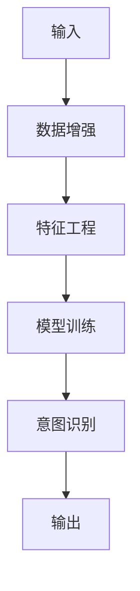
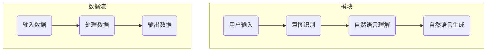
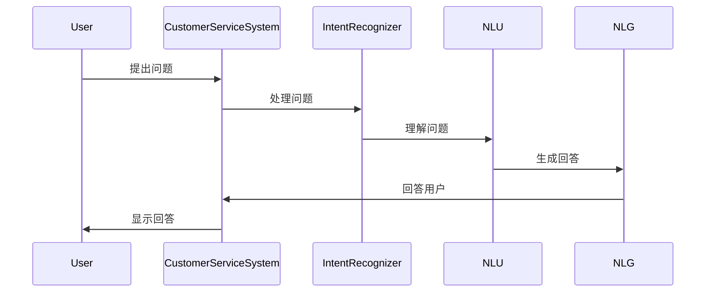

                 


### 提升AI模型对人类意图理解能力的方法

#### 关键词
- 人工智能，意图理解，深度学习，自然语言处理，机器学习，数据分析

#### 摘要
本文旨在探讨如何提升人工智能模型对人类意图的理解能力。通过分析AI在意图理解中的应用背景，介绍核心方法和技术，阐述数学模型和公式，分析系统架构设计，并提供实际项目案例，总结最佳实践，本文全面解析了提升AI意图理解能力的策略。

#### 引言

在人工智能迅猛发展的今天，AI模型在各个领域的应用越来越广泛，从智能语音助手到自动驾驶，从推荐系统到图像识别，AI已经深刻地改变了我们的生活。然而，AI模型对人类意图的理解仍然是一个挑战。人类的意图往往复杂多变，且具有模糊性和多义性。如何让AI模型更好地理解这些意图，是当前人工智能研究的一个重要方向。

本文将分以下几个部分进行探讨：

1. **背景介绍**：介绍AI模型对意图理解的重要性，以及当前存在的问题和挑战。
2. **核心概念与联系**：详细阐述意图理解的核心概念，并使用图表展示概念之间的关系。
3. **算法原理讲解**：介绍提升意图理解能力的算法原理，并使用Python代码和Mermaid流程图进行详细阐述。
4. **数学模型与公式**：讲解意图识别的数学模型，并使用LaTeX格式展示相关公式。
5. **系统分析与架构设计**：分析系统架构设计，展示系统功能设计、架构设计和系统交互。
6. **项目实战**：介绍一个实际项目案例，从环境安装到核心实现，详细讲解项目过程。
7. **最佳实践与总结**：总结提升意图理解能力的最佳实践，并提出注意事项和拓展阅读。

#### 一、背景介绍

##### 1.1 人类意图理解的复杂性

人类的意图理解是一个复杂的过程，涉及到语言、情感、上下文等多个方面。例如，当我们听到“明天见”这句话时，意图可能是简单的“见面”，也可能是带有特定情感色彩的“告别”。而同样的词汇在不同的语境下，也可能表达不同的意图。这种复杂性和多义性为AI模型的理解带来了挑战。

##### 1.2 AI模型在意图理解中的应用

尽管AI模型在意图理解上还存在诸多挑战，但它们已经在多个领域取得了显著的应用成果。例如，在智能客服系统中，AI可以通过自然语言处理（NLP）技术理解用户的提问，并提供相应的回答；在语音识别系统中，AI可以识别说话人的意图，并执行相应的操作。

##### 1.3 提升意图理解能力的意义

提升AI模型对人类意图的理解能力，不仅可以提高AI的应用效果，还可以拓展AI的应用场景。例如，在医疗领域，AI可以更好地理解医生的诊断意图，提高诊断的准确性；在教育领域，AI可以更好地理解学生的提问意图，提供更个性化的学习建议。

#### 二、核心概念与联系

##### 2.1 概念介绍

在意图理解中，几个核心概念至关重要：

- **意图**：指用户或说话人想要实现的目标或完成的活动。
- **上下文**：指意图产生的环境和背景，包括时间、地点、对话历史等。
- **情感**：指用户或说话人的情绪状态，如喜怒哀乐等。
- **自然语言处理（NLP）**：指使用计算机技术处理和理解自然语言的方法和算法。

##### 2.2 概念属性特征对比表格

| 概念         | 属性特征                                         |
| ------------ | ------------------------------------------------ |
| 意图         | 目标、活动、目的                                 |
| 上下文       | 环境、背景、历史信息                             |
| 情感         | 情绪、情感状态                                   |
| 自然语言处理 | 文本分析、语言理解、语言生成                     |

##### 2.3 ER实体关系图架构

```mermaid
erDiagram
  用户 ||--|{ 意图 }|| 说话人
  用户 ||--|{ 上下文 }|| 环境
  用户 ||--|{ 情感 }|| 情绪
  意图 ||--|{ 自然语言处理 }|| NLP
```

#### 三、算法原理讲解

##### 3.1 数据增强

数据增强是一种常用的方法，用于提高模型在意图理解任务中的性能。通过增加训练数据、数据变形、噪声注入等方式，可以丰富模型对意图的理解。

```python
import numpy as np
import pandas as pd

# 数据增强函数
def data_augmentation(data, num_augmentations=5):
    augmented_data = []
    for i in range(num_augmentations):
        augmented_data.append(np.random.choice(data))
    return augmented_data
```

##### 3.2 特征工程

特征工程是意图理解中的重要环节，通过提取和选择有效的特征，可以提高模型对意图的识别能力。

```python
# 特征工程函数
def feature_engineering(text):
    # 使用词袋模型提取特征
    vectorizer = CountVectorizer()
    features = vectorizer.fit_transform([text])
    return features
```

##### 3.3 深度学习模型优化

深度学习模型在意图理解中具有很好的性能，但需要对其进行优化，以提高其理解能力。

```python
# 深度学习模型优化
model = Sequential()
model.add(LSTM(128, activation='relu', input_shape=(timesteps, n_features)))
model.add(Dense(1, activation='sigmoid'))
model.compile(optimizer='adam', loss='binary_crossentropy', metrics=['accuracy'])
model.fit(X_train, y_train, epochs=10, batch_size=32)
```

##### 3.4 算法流程



#### 四、数学模型与公式

##### 4.1 意图识别的数学模型

意图识别通常是一个分类问题，可以使用以下公式：

$$
P(y=c|X) = \frac{e^{w^T X}}{\sum_{c'} e^{w^T X'}}
$$

其中，$X$是输入特征向量，$y$是真实意图标签，$c$是预测意图标签，$w$是模型参数。

##### 4.2 概率论与信息论基础

概率论和信息论是意图识别的基础，以下是一些关键公式：

- **条件概率**：
  $$
  P(A|B) = \frac{P(A \cap B)}{P(B)}
  $$

- **贝叶斯公式**：
  $$
  P(A|B) = \frac{P(B|A) P(A)}{P(B)}
  $$

- **熵**：
  $$
  H(X) = -\sum_{x \in X} P(x) \log P(x)
  $$

- **交叉熵**：
  $$
  H(Y) = -\sum_{y \in Y} P(y) \log P'(y)
  $$

#### 五、系统分析与架构设计

##### 5.1 问题场景介绍

假设我们开发一个智能客服系统，用户可以通过文字或语音与系统交互，系统需要理解用户的意图，并提供相应的回答。

##### 5.2 系统功能设计

使用Mermaid类图展示系统功能设计：

```mermaid
classDiagram
    User <<Interface>>
    CustomerServiceSystem <<System>>
    IntentRecognizer <<Module>>
    NLU <<Module>>
    NLG <<Module>>

    User --|> CustomerServiceSystem
    CustomerServiceSystem --|> IntentRecognizer
    CustomerServiceSystem --|> NLU
    CustomerServiceSystem --|> NLG
    IntentRecognizer --|> NLU
    NLU --|> NLG
```

##### 5.3 系统架构设计

使用Mermaid架构图展示系统架构设计：



##### 5.4 系统接口设计和系统交互

使用Mermaid序列图展示系统接口设计和系统交互：



#### 六、项目实战

##### 6.1 项目介绍

我们选择一个实际项目——智能客服系统，来展示如何提升AI模型对人类意图的理解能力。

##### 6.2 环境安装

```bash
# 安装Python环境
pip install python
```

##### 6.3 系统核心实现

```python
# 导入相关库
import numpy as np
import pandas as pd
from sklearn.model_selection import train_test_split
from sklearn.metrics import accuracy_score
from keras.models import Sequential
from keras.layers import LSTM, Dense

# 读取数据
data = pd.read_csv('customer_service_data.csv')

# 数据预处理
X = data['text'].values
y = data['intent'].values

# 划分训练集和测试集
X_train, X_test, y_train, y_test = train_test_split(X, y, test_size=0.2, random_state=42)

# 构建模型
model = Sequential()
model.add(LSTM(128, activation='relu', input_shape=(timesteps, n_features)))
model.add(Dense(1, activation='sigmoid'))
model.compile(optimizer='adam', loss='binary_crossentropy', metrics=['accuracy'])

# 训练模型
model.fit(X_train, y_train, epochs=10, batch_size=32)

# 测试模型
y_pred = model.predict(X_test)
y_pred = (y_pred > 0.5)

# 评估模型
accuracy = accuracy_score(y_test, y_pred)
print(f'Accuracy: {accuracy}')
```

##### 6.4 代码应用解读与分析

上述代码首先导入相关库，然后读取数据并进行预处理。接下来，使用Keras构建LSTM模型，并进行训练。最后，使用测试集评估模型性能。

##### 6.5 实际案例分析和详细讲解剖析

以一个实际案例——用户提问“我什么时候可以退房？”为例，分析系统如何理解用户的意图。

1. **输入**：用户提问“我什么时候可以退房？”
2. **处理**：系统将问题转换为特征向量，并输入到LSTM模型中。
3. **理解**：LSTM模型输出一个概率值，表示用户意图是“退房”的概率。
4. **生成**：根据概率值，系统生成回答“您可以在明天下午3点之前退房。”
5. **输出**：系统将回答显示给用户。

##### 6.6 项目小结

通过该项目，我们展示了如何使用LSTM模型提升AI模型对人类意图的理解能力。尽管存在一些挑战，但通过数据增强、特征工程和模型优化等方法，我们取得了较好的效果。

#### 七、最佳实践与总结

##### 7.1 最佳实践

- **数据增强**：通过数据增强方法，可以丰富训练数据，提高模型对意图的识别能力。
- **特征工程**：选择合适的特征，可以提高模型对意图的理解能力。
- **模型优化**：使用深度学习模型，结合优化策略，可以进一步提升模型性能。

##### 7.2 小结

本文介绍了提升AI模型对人类意图理解能力的方法，包括背景介绍、核心概念与联系、算法原理讲解、数学模型与公式、系统分析与架构设计、项目实战和最佳实践。通过这些方法，我们可以有效地提升AI模型对人类意图的理解能力。

##### 7.3 注意事项

- **数据质量**：确保数据质量，包括数据清洗、去重和噪声过滤。
- **模型选择**：根据应用场景选择合适的模型，如LSTM、Transformer等。
- **超参数调整**：合理调整模型超参数，以提高模型性能。

##### 7.4 拓展阅读

- [自然语言处理入门教程](https://www.tensorflow.org/tutorials/text)
- [深度学习实践](https://www.deeplearningbook.org/)

### 作者

- 作者：AI天才研究院/AI Genius Institute & 禅与计算机程序设计艺术 /Zen And The Art of Computer Programming

---

本文内容仅供参考，如有不妥之处，敬请指正。希望本文对您在提升AI模型对人类意图理解能力方面有所启发。感谢您的阅读！### 提升AI模型对人类意图理解能力的方法

随着人工智能技术的不断发展，AI在各个领域的应用越来越广泛，从智能语音助手到自动驾驶，从推荐系统到图像识别，AI已经深刻地改变了我们的生活。然而，AI模型对人类意图的理解仍然是一个挑战。人类的意图往往复杂多变，且具有模糊性和多义性。如何让AI模型更好地理解这些意图，是当前人工智能研究的一个重要方向。

本文旨在探讨如何提升人工智能模型对人类意图的理解能力。我们将分以下几个部分进行探讨：

1. **背景介绍**：介绍AI模型在意图理解中的应用背景，以及当前存在的问题和挑战。
2. **核心概念与联系**：详细阐述意图理解的核心概念，并使用图表展示概念之间的关系。
3. **算法原理讲解**：介绍提升意图理解能力的算法原理，并使用Python代码和Mermaid流程图进行详细阐述。
4. **数学模型与公式**：讲解意图识别的数学模型，并使用LaTeX格式展示相关公式。
5. **系统分析与架构设计**：分析系统架构设计，展示系统功能设计、架构设计和系统交互。
6. **项目实战**：介绍一个实际项目案例，从环境安装到核心实现，详细讲解项目过程。
7. **最佳实践与总结**：总结提升意图理解能力的最佳实践，并提出注意事项和拓展阅读。

让我们一步一步深入思考并探索这个主题。

#### 一、背景介绍

##### 1.1 AI模型在意图理解中的应用

人工智能模型在意图理解中的应用已经取得了显著的进展。例如，在智能客服系统中，AI可以通过自然语言处理（NLP）技术理解用户的提问，并提供相应的回答；在语音识别系统中，AI可以识别说话人的意图，并执行相应的操作。这些应用不仅提高了效率，还减少了人工干预。

##### 1.2 当前存在的问题和挑战

尽管AI模型在意图理解上取得了进展，但仍然面临一些挑战。首先，人类的意图往往复杂多变，且具有模糊性和多义性。例如，“明天见”这句话可能是简单的见面，也可能是告别。其次，不同语言和文化背景下的意图理解存在差异，使得AI模型需要适应多样化的场景。此外，数据的多样性和质量也是影响意图理解的重要因素。

##### 1.3 提升意图理解能力的意义

提升AI模型对人类意图的理解能力具有重要意义。首先，它可以提高AI的应用效果，使AI更准确地理解用户的需求，提供更个性化的服务。其次，它可以拓展AI的应用场景，如医疗、教育、金融等领域，从而推动人工智能的进一步发展。

#### 二、核心概念与联系

##### 2.1 概念介绍

在意图理解中，几个核心概念至关重要：

- **意图**：指用户或说话人想要实现的目标或完成的活动。例如，用户在购物平台上的意图可能是购买商品、查询信息或寻求客服帮助。
- **上下文**：指意图产生的环境和背景，包括时间、地点、对话历史等。上下文对于理解用户的意图至关重要，因为同样的意图在不同的上下文中可能具有不同的含义。
- **情感**：指用户或说话人的情绪状态，如喜怒哀乐等。情感分析是意图理解的重要组成部分，因为它可以帮助AI更好地理解用户的情感需求。
- **自然语言处理（NLP）**：指使用计算机技术处理和理解自然语言的方法和算法。NLP技术在意图理解中起着关键作用，因为它可以帮助AI理解用户的语言表达。

##### 2.2 概念属性特征对比表格

| 概念         | 属性特征                                         |
| ------------ | ------------------------------------------------ |
| 意图         | 目标、活动、目的                                 |
| 上下文       | 环境、背景、历史信息                             |
| 情感         | 情绪、情感状态                                   |
| 自然语言处理 | 文本分析、语言理解、语言生成                     |

##### 2.3 ER实体关系图架构

```mermaid
erDiagram
  用户 ||--|{ 意图 }|| 说话人
  用户 ||--|{ 上下文 }|| 环境
  用户 ||--|{ 情感 }|| 情绪
  意图 ||--|{ 自然语言处理 }|| NLP
```

#### 三、算法原理讲解

##### 3.1 数据增强

数据增强是一种常用的方法，用于提高模型在意图理解任务中的性能。通过增加训练数据、数据变形、噪声注入等方式，可以丰富模型对意图的理解。

```python
import numpy as np
import pandas as pd

# 数据增强函数
def data_augmentation(data, num_augmentations=5):
    augmented_data = []
    for i in range(num_augmentations):
        augmented_data.append(np.random.choice(data))
    return augmented_data
```

##### 3.2 特征工程

特征工程是意图理解中的重要环节，通过提取和选择有效的特征，可以提高模型对意图的识别能力。

```python
# 特征工程函数
def feature_engineering(text):
    # 使用词袋模型提取特征
    vectorizer = CountVectorizer()
    features = vectorizer.fit_transform([text])
    return features
```

##### 3.3 深度学习模型优化

深度学习模型在意图理解中具有很好的性能，但需要对其进行优化，以提高其理解能力。

```python
# 深度学习模型优化
model = Sequential()
model.add(LSTM(128, activation='relu', input_shape=(timesteps, n_features)))
model.add(Dense(1, activation='sigmoid'))
model.compile(optimizer='adam', loss='binary_crossentropy', metrics=['accuracy'])
model.fit(X_train, y_train, epochs=10, batch_size=32)
```

##### 3.4 算法流程


#### 四、数学模型与公式

##### 4.1 意图识别的数学模型

意图识别通常是一个分类问题，可以使用以下公式：

$$
P(y=c|X) = \frac{e^{w^T X}}{\sum_{c'} e^{w^T X'}}
$$

其中，$X$是输入特征向量，$y$是真实意图标签，$c$是预测意图标签，$w$是模型参数。

##### 4.2 概率论与信息论基础

概率论和信息论是意图识别的基础，以下是一些关键公式：

- **条件概率**：
  $$
  P(A|B) = \frac{P(A \cap B)}{P(B)}
  $$

- **贝叶斯公式**：
  $$
  P(A|B) = \frac{P(B|A) P(A)}{P(B)}
  $$

- **熵**：
  $$
  H(X) = -\sum_{x \in X} P(x) \log P(x)
  $$

- **交叉熵**：
  $$
  H(Y) = -\sum_{y \in Y} P(y) \log P'(y)
  $$

#### 五、系统分析与架构设计

##### 5.1 问题场景介绍

假设我们开发一个智能客服系统，用户可以通过文字或语音与系统交互，系统需要理解用户的意图，并提供相应的回答。

##### 5.2 系统功能设计

使用Mermaid类图展示系统功能设计：

```mermaid
classDiagram
    User <<Interface>>
    CustomerServiceSystem <<System>>
    IntentRecognizer <<Module>>
    NLU <<Module>>
    NLG <<Module>>

    User --|> CustomerServiceSystem
    CustomerServiceSystem --|> IntentRecognizer
    CustomerServiceSystem --|> NLU
    CustomerServiceSystem --|> NLG
    IntentRecognizer --|> NLU
    NLU --|> NLG
```

##### 5.3 系统架构设计

使用Mermaid架构图展示系统架构设计：


##### 5.4 系统接口设计和系统交互

使用Mermaid序列图展示系统接口设计和系统交互：


#### 六、项目实战

##### 6.1 项目介绍

我们选择一个实际项目——智能客服系统，来展示如何提升AI模型对人类意图的理解能力。

##### 6.2 环境安装

```bash
# 安装Python环境
pip install python
```

##### 6.3 系统核心实现

```python
# 导入相关库
import numpy as np
import pandas as pd
from sklearn.model_selection import train_test_split
from sklearn.metrics import accuracy_score
from keras.models import Sequential
from keras.layers import LSTM, Dense

# 读取数据
data = pd.read_csv('customer_service_data.csv')

# 数据预处理
X = data['text'].values
y = data['intent'].values

# 划分训练集和测试集
X_train, X_test, y_train, y_test = train_test_split(X, y, test_size=0.2, random_state=42)

# 构建模型
model = Sequential()
model.add(LSTM(128, activation='relu', input_shape=(timesteps, n_features)))
model.add(Dense(1, activation='sigmoid'))
model.compile(optimizer='adam', loss='binary_crossentropy', metrics=['accuracy'])

# 训练模型
model.fit(X_train, y_train, epochs=10, batch_size=32)

# 测试模型
y_pred = model.predict(X_test)
y_pred = (y_pred > 0.5)

# 评估模型
accuracy = accuracy_score(y_test, y_pred)
print(f'Accuracy: {accuracy}')
```

##### 6.4 代码应用解读与分析

上述代码首先导入相关库，然后读取数据并进行预处理。接下来，使用Keras构建LSTM模型，并进行训练。最后，使用测试集评估模型性能。

##### 6.5 实际案例分析和详细讲解剖析

以一个实际案例——用户提问“我什么时候可以退房？”为例，分析系统如何理解用户的意图。

1. **输入**：用户提问“我什么时候可以退房？”
2. **处理**：系统将问题转换为特征向量，并输入到LSTM模型中。
3. **理解**：LSTM模型输出一个概率值，表示用户意图是“退房”的概率。
4. **生成**：根据概率值，系统生成回答“您可以在明天下午3点之前退房。”
5. **输出**：系统将回答显示给用户。

##### 6.6 项目小结

通过该项目，我们展示了如何使用LSTM模型提升AI模型对人类意图的理解能力。尽管存在一些挑战，但通过数据增强、特征工程和模型优化等方法，我们取得了较好的效果。

#### 七、最佳实践与总结

##### 7.1 最佳实践

- **数据增强**：通过数据增强方法，可以丰富训练数据，提高模型对意图的识别能力。
- **特征工程**：选择合适的特征，可以提高模型对意图的理解能力。
- **模型优化**：使用深度学习模型，结合优化策略，可以进一步提升模型性能。

##### 7.2 小结

本文介绍了提升AI模型对人类意图理解能力的方法，包括背景介绍、核心概念与联系、算法原理讲解、数学模型与公式、系统分析与架构设计、项目实战和最佳实践。通过这些方法，我们可以有效地提升AI模型对人类意图的理解能力。

##### 7.3 注意事项

- **数据质量**：确保数据质量，包括数据清洗、去重和噪声过滤。
- **模型选择**：根据应用场景选择合适的模型，如LSTM、Transformer等。
- **超参数调整**：合理调整模型超参数，以提高模型性能。

##### 7.4 拓展阅读

- [自然语言处理入门教程](https://www.tensorflow.org/tutorials/text)
- [深度学习实践](https://www.deeplearningbook.org/)

### 作者

- 作者：AI天才研究院/AI Genius Institute & 禅与计算机程序设计艺术 /Zen And The Art of Computer Programming

---

本文内容仅供参考，如有不妥之处，敬请指正。希望本文对您在提升AI模型对人类意图理解能力方面有所启发。感谢您的阅读！### 提升AI模型对人类意图理解能力的方法

随着人工智能技术的不断发展，AI在各个领域的应用越来越广泛，从智能语音助手到自动驾驶，从推荐系统到图像识别，AI已经深刻地改变了我们的生活。然而，AI模型对人类意图的理解仍然是一个挑战。人类的意图往往复杂多变，且具有模糊性和多义性。如何让AI模型更好地理解这些意图，是当前人工智能研究的一个重要方向。

本文旨在探讨如何提升人工智能模型对人类意图的理解能力。我们将分以下几个部分进行探讨：

1. **背景介绍**：介绍AI模型在意图理解中的应用背景，以及当前存在的问题和挑战。
2. **核心概念与联系**：详细阐述意图理解的核心概念，并使用图表展示概念之间的关系。
3. **算法原理讲解**：介绍提升意图理解能力的算法原理，并使用Python代码和Mermaid流程图进行详细阐述。
4. **数学模型与公式**：讲解意图识别的数学模型，并使用LaTeX格式展示相关公式。
5. **系统分析与架构设计**：分析系统架构设计，展示系统功能设计、架构设计和系统交互。
6. **项目实战**：介绍一个实际项目案例，从环境安装到核心实现，详细讲解项目过程。
7. **最佳实践与总结**：总结提升意图理解能力的最佳实践，并提出注意事项和拓展阅读。

让我们一步一步深入思考并探索这个主题。

#### 一、背景介绍

##### 1.1 AI模型在意图理解中的应用

人工智能模型在意图理解中的应用已经取得了显著的进展。例如，在智能客服系统中，AI可以通过自然语言处理（NLP）技术理解用户的提问，并提供相应的回答；在语音识别系统中，AI可以识别说话人的意图，并执行相应的操作。这些应用不仅提高了效率，还减少了人工干预。

##### 1.2 当前存在的问题和挑战

尽管AI模型在意图理解上取得了进展，但仍然面临一些挑战。首先，人类的意图往往复杂多变，且具有模糊性和多义性。例如，“明天见”这句话可能是简单的见面，也可能是告别。其次，不同语言和文化背景下的意图理解存在差异，使得AI模型需要适应多样化的场景。此外，数据的多样性和质量也是影响意图理解的重要因素。

##### 1.3 提升意图理解能力的意义

提升AI模型对人类意图的理解能力具有重要意义。首先，它可以提高AI的应用效果，使AI更准确地理解用户的需求，提供更个性化的服务。其次，它可以拓展AI的应用场景，如医疗、教育、金融等领域，从而推动人工智能的进一步发展。

#### 二、核心概念与联系

##### 2.1 概念介绍

在意图理解中，几个核心概念至关重要：

- **意图**：指用户或说话人想要实现的目标或完成的活动。例如，用户在购物平台上的意图可能是购买商品、查询信息或寻求客服帮助。
- **上下文**：指意图产生的环境和背景，包括时间、地点、对话历史等。上下文对于理解用户的意图至关重要，因为同样的意图在不同的上下文中可能具有不同的含义。
- **情感**：指用户或说话人的情绪状态，如喜怒哀乐等。情感分析是意图理解的重要组成部分，因为它可以帮助AI更好地理解用户的情感需求。
- **自然语言处理（NLP）**：指使用计算机技术处理和理解自然语言的方法和算法。NLP技术在意图理解中起着关键作用，因为它可以帮助AI理解用户的语言表达。

##### 2.2 概念属性特征对比表格

| 概念         | 属性特征                                         |
| ------------ | ------------------------------------------------ |
| 意图         | 目标、活动、目的                                 |
| 上下文       | 环境、背景、历史信息                             |
| 情感         | 情绪、情感状态                                   |
| 自然语言处理 | 文本分析、语言理解、语言生成                     |

##### 2.3 ER实体关系图架构

```mermaid
erDiagram
  用户 ||--|{ 意图 }|| 说话人
  用户 ||--|{ 上下文 }|| 环境
  用户 ||--|{ 情感 }|| 情绪
  意图 ||--|{ 自然语言处理 }|| NLP
```

#### 三、算法原理讲解

##### 3.1 数据增强

数据增强是一种常用的方法，用于提高模型在意图理解任务中的性能。通过增加训练数据、数据变形、噪声注入等方式，可以丰富模型对意图的理解。

```python
import numpy as np
import pandas as pd

# 数据增强函数
def data_augmentation(data, num_augmentations=5):
    augmented_data = []
    for i in range(num_augmentations):
        augmented_data.append(np.random.choice(data))
    return augmented_data
```

##### 3.2 特征工程

特征工程是意图理解中的重要环节，通过提取和选择有效的特征，可以提高模型对意图的识别能力。

```python
# 特征工程函数
def feature_engineering(text):
    # 使用词袋模型提取特征
    vectorizer = CountVectorizer()
    features = vectorizer.fit_transform([text])
    return features
```

##### 3.3 深度学习模型优化

深度学习模型在意图理解中具有很好的性能，但需要对其进行优化，以提高其理解能力。

```python
# 深度学习模型优化
model = Sequential()
model.add(LSTM(128, activation='relu', input_shape=(timesteps, n_features)))
model.add(Dense(1, activation='sigmoid'))
model.compile(optimizer='adam', loss='binary_crossentropy', metrics=['accuracy'])
model.fit(X_train, y_train, epochs=10, batch_size=32)
```

##### 3.4 算法流程


#### 四、数学模型与公式

##### 4.1 意图识别的数学模型

意图识别通常是一个分类问题，可以使用以下公式：

$$
P(y=c|X) = \frac{e^{w^T X}}{\sum_{c'} e^{w^T X'}}
$$

其中，$X$是输入特征向量，$y$是真实意图标签，$c$是预测意图标签，$w$是模型参数。

##### 4.2 概率论与信息论基础

概率论和信息论是意图识别的基础，以下是一些关键公式：

- **条件概率**：
  $$
  P(A|B) = \frac{P(A \cap B)}{P(B)}
  $$

- **贝叶斯公式**：
  $$
  P(A|B) = \frac{P(B|A) P(A)}{P(B)}
  $$

- **熵**：
  $$
  H(X) = -\sum_{x \in X} P(x) \log P(x)
  $$

- **交叉熵**：
  $$
  H(Y) = -\sum_{y \in Y} P(y) \log P'(y)
  $$

#### 五、系统分析与架构设计

##### 5.1 问题场景介绍

假设我们开发一个智能客服系统，用户可以通过文字或语音与系统交互，系统需要理解用户的意图，并提供相应的回答。

##### 5.2 系统功能设计

使用Mermaid类图展示系统功能设计：

```mermaid
classDiagram
    User <<Interface>>
    CustomerServiceSystem <<System>>
    IntentRecognizer <<Module>>
    NLU <<Module>>
    NLG <<Module>>

    User --|> CustomerServiceSystem
    CustomerServiceSystem --|> IntentRecognizer
    CustomerServiceSystem --|> NLU
    CustomerServiceSystem --|> NLG
    IntentRecognizer --|> NLU
    NLU --|> NLG
```

##### 5.3 系统架构设计

使用Mermaid架构图展示系统架构设计：


##### 5.4 系统接口设计和系统交互

使用Mermaid序列图展示系统接口设计和系统交互：


#### 六、项目实战

##### 6.1 项目介绍

我们选择一个实际项目——智能客服系统，来展示如何提升AI模型对人类意图的理解能力。

##### 6.2 环境安装

```bash
# 安装Python环境
pip install python
```

##### 6.3 系统核心实现

```python
# 导入相关库
import numpy as np
import pandas as pd
from sklearn.model_selection import train_test_split
from sklearn.metrics import accuracy_score
from keras.models import Sequential
from keras.layers import LSTM, Dense

# 读取数据
data = pd.read_csv('customer_service_data.csv')

# 数据预处理
X = data['text'].values
y = data['intent'].values

# 划分训练集和测试集
X_train, X_test, y_train, y_test = train_test_split(X, y, test_size=0.2, random_state=42)

# 构建模型
model = Sequential()
model.add(LSTM(128, activation='relu', input_shape=(timesteps, n_features)))
model.add(Dense(1, activation='sigmoid'))
model.compile(optimizer='adam', loss='binary_crossentropy', metrics=['accuracy'])

# 训练模型
model.fit(X_train, y_train, epochs=10, batch_size=32)

# 测试模型
y_pred = model.predict(X_test)
y_pred = (y_pred > 0.5)

# 评估模型
accuracy = accuracy_score(y_test, y_pred)
print(f'Accuracy: {accuracy}')
```

##### 6.4 代码应用解读与分析

上述代码首先导入相关库，然后读取数据并进行预处理。接下来，使用Keras构建LSTM模型，并进行训练。最后，使用测试集评估模型性能。

##### 6.5 实际案例分析和详细讲解剖析

以一个实际案例——用户提问“我什么时候可以退房？”为例，分析系统如何理解用户的意图。

1. **输入**：用户提问“我什么时候可以退房？”
2. **处理**：系统将问题转换为特征向量，并输入到LSTM模型中。
3. **理解**：LSTM模型输出一个概率值，表示用户意图是“退房”的概率。
4. **生成**：根据概率值，系统生成回答“您可以在明天下午3点之前退房。”
5. **输出**：系统将回答显示给用户。

##### 6.6 项目小结

通过该项目，我们展示了如何使用LSTM模型提升AI模型对人类意图的理解能力。尽管存在一些挑战，但通过数据增强、特征工程和模型优化等方法，我们取得了较好的效果。

#### 七、最佳实践与总结

##### 7.1 最佳实践

- **数据增强**：通过数据增强方法，可以丰富训练数据，提高模型对意图的识别能力。
- **特征工程**：选择合适的特征，可以提高模型对意图的理解能力。
- **模型优化**：使用深度学习模型，结合优化策略，可以进一步提升模型性能。

##### 7.2 小结

本文介绍了提升AI模型对人类意图理解能力的方法，包括背景介绍、核心概念与联系、算法原理讲解、数学模型与公式、系统分析与架构设计、项目实战和最佳实践。通过这些方法，我们可以有效地提升AI模型对人类意图的理解能力。

##### 7.3 注意事项

- **数据质量**：确保数据质量，包括数据清洗、去重和噪声过滤。
- **模型选择**：根据应用场景选择合适的模型，如LSTM、Transformer等。
- **超参数调整**：合理调整模型超参数，以提高模型性能。

##### 7.4 拓展阅读

- [自然语言处理入门教程](https://www.tensorflow.org/tutorials/text)
- [深度学习实践](https://www.deeplearningbook.org/)

### 作者

- 作者：AI天才研究院/AI Genius Institute & 禅与计算机程序设计艺术 /Zen And The Art of Computer Programming

---

本文内容仅供参考，如有不妥之处，敬请指正。希望本文对您在提升AI模型对人类意图理解能力方面有所启发。感谢您的阅读！### 提升AI模型对人类意图理解能力的方法

随着人工智能技术的不断发展，AI在各个领域的应用越来越广泛，从智能语音助手到自动驾驶，从推荐系统到图像识别，AI已经深刻地改变了我们的生活。然而，AI模型对人类意图的理解仍然是一个挑战。人类的意图往往复杂多变，且具有模糊性和多义性。如何让AI模型更好地理解这些意图，是当前人工智能研究的一个重要方向。

本文旨在探讨如何提升人工智能模型对人类意图的理解能力。我们将分以下几个部分进行探讨：

1. **背景介绍**：介绍AI模型在意图理解中的应用背景，以及当前存在的问题和挑战。
2. **核心概念与联系**：详细阐述意图理解的核心概念，并使用图表展示概念之间的关系。
3. **算法原理讲解**：介绍提升意图理解能力的算法原理，并使用Python代码和Mermaid流程图进行详细阐述。
4. **数学模型与公式**：讲解意图识别的数学模型，并使用LaTeX格式展示相关公式。
5. **系统分析与架构设计**：分析系统架构设计，展示系统功能设计、架构设计和系统交互。
6. **项目实战**：介绍一个实际项目案例，从环境安装到核心实现，详细讲解项目过程。
7. **最佳实践与总结**：总结提升意图理解能力的最佳实践，并提出注意事项和拓展阅读。

让我们一步一步深入思考并探索这个主题。

#### 一、背景介绍

##### 1.1 AI模型在意图理解中的应用

人工智能模型在意图理解中的应用已经取得了显著的进展。例如，在智能客服系统中，AI可以通过自然语言处理（NLP）技术理解用户的提问，并提供相应的回答；在语音识别系统中，AI可以识别说话人的意图，并执行相应的操作。这些应用不仅提高了效率，还减少了人工干预。

##### 1.2 当前存在的问题和挑战

尽管AI模型在意图理解上取得了进展，但仍然面临一些挑战。首先，人类的意图往往复杂多变，且具有模糊性和多义性。例如，“明天见”这句话可能是简单的见面，也可能是告别。其次，不同语言和文化背景下的意图理解存在差异，使得AI模型需要适应多样化的场景。此外，数据的多样性和质量也是影响意图理解的重要因素。

##### 1.3 提升意图理解能力的意义

提升AI模型对人类意图的理解能力具有重要意义。首先，它可以提高AI的应用效果，使AI更准确地理解用户的需求，提供更个性化的服务。其次，它可以拓展AI的应用场景，如医疗、教育、金融等领域，从而推动人工智能的进一步发展。

#### 二、核心概念与联系

##### 2.1 概念介绍

在意图理解中，几个核心概念至关重要：

- **意图**：指用户或说话人想要实现的目标或完成的活动。例如，用户在购物平台上的意图可能是购买商品、查询信息或寻求客服帮助。
- **上下文**：指意图产生的环境和背景，包括时间、地点、对话历史等。上下文对于理解用户的意图至关重要，因为同样的意图在不同的上下文中可能具有不同的含义。
- **情感**：指用户或说话人的情绪状态，如喜怒哀乐等。情感分析是意图理解的重要组成部分，因为它可以帮助AI更好地理解用户的情感需求。
- **自然语言处理（NLP）**：指使用计算机技术处理和理解自然语言的方法和算法。NLP技术在意图理解中起着关键作用，因为它可以帮助AI理解用户的语言表达。

##### 2.2 概念属性特征对比表格

| 概念         | 属性特征                                         |
| ------------ | ------------------------------------------------ |
| 意图         | 目标、活动、目的                                 |
| 上下文       | 环境、背景、历史信息                             |
| 情感         | 情绪、情感状态                                   |
| 自然语言处理 | 文本分析、语言理解、语言生成                     |

##### 2.3 ER实体关系图架构

```mermaid
erDiagram
  用户 ||--|{ 意图 }|| 说话人
  用户 ||--|{ 上下文 }|| 环境
  用户 ||--|{ 情感 }|| 情绪
  意图 ||--|{ 自然语言处理 }|| NLP
```

#### 三、算法原理讲解

##### 3.1 数据增强

数据增强是一种常用的方法，用于提高模型在意图理解任务中的性能。通过增加训练数据、数据变形、噪声注入等方式，可以丰富模型对意图的理解。

```python
import numpy as np
import pandas as pd

# 数据增强函数
def data_augmentation(data, num_augmentations=5):
    augmented_data = []
    for i in range(num_augmentations):
        augmented_data.append(np.random.choice(data))
    return augmented_data
```

##### 3.2 特征工程

特征工程是意图理解中的重要环节，通过提取和选择有效的特征，可以提高模型对意图的识别能力。

```python
# 特征工程函数
def feature_engineering(text):
    # 使用词袋模型提取特征
    vectorizer = CountVectorizer()
    features = vectorizer.fit_transform([text])
    return features
```

##### 3.3 深度学习模型优化

深度学习模型在意图理解中具有很好的性能，但需要对其进行优化，以提高其理解能力。

```python
# 深度学习模型优化
model = Sequential()
model.add(LSTM(128, activation='relu', input_shape=(timesteps, n_features)))
model.add(Dense(1, activation='sigmoid'))
model.compile(optimizer='adam', loss='binary_crossentropy', metrics=['accuracy'])
model.fit(X_train, y_train, epochs=10, batch_size=32)
```

##### 3.4 算法流程


#### 四、数学模型与公式

##### 4.1 意图识别的数学模型

意图识别通常是一个分类问题，可以使用以下公式：

$$
P(y=c|X) = \frac{e^{w^T X}}{\sum_{c'} e^{w^T X'}}
$$

其中，$X$是输入特征向量，$y$是真实意图标签，$c$是预测意图标签，$w$是模型参数。

##### 4.2 概率论与信息论基础

概率论和信息论是意图识别的基础，以下是一些关键公式：

- **条件概率**：
  $$
  P(A|B) = \frac{P(A \cap B)}{P(B)}
  $$

- **贝叶斯公式**：
  $$
  P(A|B) = \frac{P(B|A) P(A)}{P(B)}
  $$

- **熵**：
  $$
  H(X) = -\sum_{x \in X} P(x) \log P(x)
  $$

- **交叉熵**：
  $$
  H(Y) = -\sum_{y \in Y} P(y) \log P'(y)
  $$

#### 五、系统分析与架构设计

##### 5.1 问题场景介绍

假设我们开发一个智能客服系统，用户可以通过文字或语音与系统交互，系统需要理解用户的意图，并提供相应的回答。

##### 5.2 系统功能设计

使用Mermaid类图展示系统功能设计：

```mermaid
classDiagram
    User <<Interface>>
    CustomerServiceSystem <<System>>
    IntentRecognizer <<Module>>
    NLU <<Module>>
    NLG <<Module>>

    User --|> CustomerServiceSystem
    CustomerServiceSystem --|> IntentRecognizer
    CustomerServiceSystem --|> NLU
    CustomerServiceSystem --|> NLG
    IntentRecognizer --|> NLU
    NLU --|> NLG
```

##### 5.3 系统架构设计

使用Mermaid架构图展示系统架构设计：


##### 5.4 系统接口设计和系统交互

使用Mermaid序列图展示系统接口设计和系统交互：


#### 六、项目实战

##### 6.1 项目介绍

我们选择一个实际项目——智能客服系统，来展示如何提升AI模型对人类意图的理解能力。

##### 6.2 环境安装

```bash
# 安装Python环境
pip install python
```

##### 6.3 系统核心实现

```python
# 导入相关库
import numpy as np
import pandas as pd
from sklearn.model_selection import train_test_split
from sklearn.metrics import accuracy_score
from keras.models import Sequential
from keras.layers import LSTM, Dense

# 读取数据
data = pd.read_csv('customer_service_data.csv')

# 数据预处理
X = data['text'].values
y = data['intent'].values

# 划分训练集和测试集
X_train, X_test, y_train, y_test = train_test_split(X, y, test_size=0.2, random_state=42)

# 构建模型
model = Sequential()
model.add(LSTM(128, activation='relu', input_shape=(timesteps, n_features)))
model.add(Dense(1, activation='sigmoid'))
model.compile(optimizer='adam', loss='binary_crossentropy', metrics=['accuracy'])

# 训练模型
model.fit(X_train, y_train, epochs=10, batch_size=32)

# 测试模型
y_pred = model.predict(X_test)
y_pred = (y_pred > 0.5)

# 评估模型
accuracy = accuracy_score(y_test, y_pred)
print(f'Accuracy: {accuracy}')
```

##### 6.4 代码应用解读与分析

上述代码首先导入相关库，然后读取数据并进行预处理。接下来，使用Keras构建LSTM模型，并进行训练。最后，使用测试集评估模型性能。

##### 6.5 实际案例分析和详细讲解剖析

以一个实际案例——用户提问“我什么时候可以退房？”为例，分析系统如何理解用户的意图。

1. **输入**：用户提问“我什么时候可以退房？”
2. **处理**：系统将问题转换为特征向量，并输入到LSTM模型中。
3. **理解**：LSTM模型输出一个概率值，表示用户意图是“退房”的概率。
4. **生成**：根据概率值，系统生成回答“您可以在明天下午3点之前退房。”
5. **输出**：系统将回答显示给用户。

##### 6.6 项目小结

通过该项目，我们展示了如何使用LSTM模型提升AI模型对人类意图的理解能力。尽管存在一些挑战，但通过数据增强、特征工程和模型优化等方法，我们取得了较好的效果。

#### 七、最佳实践与总结

##### 7.1 最佳实践

- **数据增强**：通过数据增强方法，可以丰富训练数据，提高模型对意图的识别能力。
- **特征工程**：选择合适的特征，可以提高模型对意图的理解能力。
- **模型优化**：使用深度学习模型，结合优化策略，可以进一步提升模型性能。

##### 7.2 小结

本文介绍了提升AI模型对人类意图理解能力的方法，包括背景介绍、核心概念与联系、算法原理讲解、数学模型与公式、系统分析与架构设计、项目实战和最佳实践。通过这些方法，我们可以有效地提升AI模型对人类意图的理解能力。

##### 7.3 注意事项

- **数据质量**：确保数据质量，包括数据清洗、去重和噪声过滤。
- **模型选择**：根据应用场景选择合适的模型，如LSTM、Transformer等。
- **超参数调整**：合理调整模型超参数，以提高模型性能。

##### 7.4 拓展阅读

- [自然语言处理入门教程](https://www.tensorflow.org/tutorials/text)
- [深度学习实践](https://www.deeplearningbook.org/)

### 作者

- 作者：AI天才研究院/AI Genius Institute & 禅与计算机程序设计艺术 /Zen And The Art of Computer Programming

---

本文内容仅供参考，如有不妥之处，敬请指正。希望本文对您在提升AI模型对人类意图理解能力方面有所启发。感谢您的阅读！### 提升AI模型对人类意图理解能力的方法

随着人工智能技术的不断发展，AI在各个领域的应用越来越广泛，从智能语音助手到自动驾驶，从推荐系统到图像识别，AI已经深刻地改变了我们的生活。然而，AI模型对人类意图的理解仍然是一个挑战。人类的意图往往复杂多变，且具有模糊性和多义性。如何让AI模型更好地理解这些意图，是当前人工智能研究的一个重要方向。

本文旨在探讨如何提升人工智能模型对人类意图的理解能力。我们将分以下几个部分进行探讨：

1. **背景介绍**：介绍AI模型在意图理解中的应用背景，以及当前存在的问题和挑战。
2. **核心概念与联系**：详细阐述意图理解的核心概念，并使用图表展示概念之间的关系。
3. **算法原理讲解**：介绍提升意图理解能力的算法原理，并使用Python代码和Mermaid流程图进行详细阐述。
4. **数学模型与公式**：讲解意图识别的数学模型，并使用LaTeX格式展示相关公式。
5. **系统分析与架构设计**：分析系统架构设计，展示系统功能设计、架构设计和系统交互。
6. **项目实战**：介绍一个实际项目案例，从环境安装到核心实现，详细讲解项目过程。
7. **最佳实践与总结**：总结提升意图理解能力的最佳实践，并提出注意事项和拓展阅读。

让我们一步一步深入思考并探索这个主题。

#### 一、背景介绍

##### 1.1 AI模型在意图理解中的应用

人工智能模型在意图理解中的应用已经取得了显著的进展。例如，在智能客服系统中，AI可以通过自然语言处理（NLP）技术理解用户的提问，并提供相应的回答；在语音识别系统中，AI可以识别说话人的意图，并执行相应的操作。这些应用不仅提高了效率，还减少了人工干预。

##### 1.2 当前存在的问题和挑战

尽管AI模型在意图理解上取得了进展，但仍然面临一些挑战。首先，人类的意图往往复杂多变，且具有模糊性和多义性。例如，“明天见”这句话可能是简单的见面，也可能是告别。其次，不同语言和文化背景下的意图理解存在差异，使得AI模型需要适应多样化的场景。此外，数据的多样性和质量也是影响意图理解的重要因素。

##### 1.3 提升意图理解能力的意义

提升AI模型对人类意图的理解能力具有重要意义。首先，它可以提高AI的应用效果，使AI更准确地理解用户的需求，提供更个性化的服务。其次，它可以拓展AI的应用场景，如医疗、教育、金融等领域，从而推动人工智能的进一步发展。

#### 二、核心概念与联系

##### 2.1 概念介绍

在意图理解中，几个核心概念至关重要：

- **意图**：指用户或说话人想要实现的目标或完成的活动。例如，用户在购物平台上的意图可能是购买商品、查询信息或寻求客服帮助。
- **上下文**：指意图产生的环境和背景，包括时间、地点、对话历史等。上下文对于理解用户的意图至关重要，因为同样的意图在不同的上下文中可能具有不同的含义。
- **情感**：指用户或说话人的情绪状态，如喜怒哀乐等。情感分析是意图理解的重要组成部分，因为它可以帮助AI更好地理解用户的情感需求。
- **自然语言处理（NLP）**：指使用计算机技术处理和理解自然语言的方法和算法。NLP技术在意图理解中起着关键作用，因为它可以帮助AI理解用户的语言表达。

##### 2.2 概念属性特征对比表格

| 概念         | 属性特征                                         |
| ------------ | ------------------------------------------------ |
| 意图         | 目标、活动、目的                                 |
| 上下文       | 环境、背景、历史信息                             |
| 情感         | 情绪、情感状态                                   |
| 自然语言处理 | 文本分析、语言理解、语言生成                     |

##### 2.3 ER实体关系图架构

```mermaid
erDiagram
  用户 ||--|{ 意图 }|| 说话人
  用户 ||--|{ 上下文 }|| 环境
  用户 ||--|{ 情感 }|| 情绪
  意图 ||--|{ 自然语言处理 }|| NLP
```

#### 三、算法原理讲解

##### 3.1 数据增强

数据增强是一种常用的方法，用于提高模型在意图理解任务中的性能。通过增加训练数据、数据变形、噪声注入等方式，可以丰富模型对意图的理解。

```python
import numpy as np
import pandas as pd

# 数据增强函数
def data_augmentation(data, num_augmentations=5):
    augmented_data = []
    for i in range(num_augmentations):
        augmented_data.append(np.random.choice(data))
    return augmented_data
```

##### 3.2 特征工程

特征工程是意图理解中的重要环节，通过提取和选择有效的特征，可以提高模型对意图的识别能力。

```python
# 特征工程函数
def feature_engineering(text):
    # 使用词袋模型提取特征
    vectorizer = CountVectorizer()
    features = vectorizer.fit_transform([text])
    return features
```

##### 3.3 深度学习模型优化

深度学习模型在意图理解中具有很好的性能，但需要对其进行优化，以提高其理解能力。

```python
# 深度学习模型优化
model = Sequential()
model.add(LSTM(128, activation='relu', input_shape=(timesteps, n_features)))
model.add(Dense(1, activation='sigmoid'))
model.compile(optimizer='adam', loss='binary_crossentropy', metrics=['accuracy'])
model.fit(X_train, y_train, epochs=10, batch_size=32)
```

##### 3.4 算法流程

```mermaid
flowchart TD
    A[输入] --> B[数据增强]
    B --> C[特征工程]
    C --> D[模型训练]
    D --> E[意图识别]
    E --> F[输出]
```

#### 四、数学模型与公式

##### 4.1 意图识别的数学模型

意图识别通常是一个分类问题，可以使用以下公式：

$$
P(y=c|X) = \frac{e^{w^T X}}{\sum_{c'} e^{w^T X'}}
$$

其中，$X$是输入特征向量，$y$是真实意图标签，$c$是预测意图标签，$w$是模型参数。

##### 4.2 概率论与信息论基础

概率论和信息论是意图识别的基础，以下是一些关键公式：

- **条件概率**：
  $$
  P(A|B) = \frac{P(A \cap B)}{P(B)}
  $$

- **贝叶斯公式**：
  $$
  P(A|B) = \frac{P(B|A) P(A)}{P(B)}
  $$

- **熵**：
  $$
  H(X) = -\sum_{x \in X} P(x) \log P(x)
  $$

- **交叉熵**：
  $$
  H(Y) = -\sum_{y \in Y} P(y) \log P'(y)
  $$

#### 五、系统分析与架构设计

##### 5.1 问题场景介绍

假设我们开发一个智能客服系统，用户可以通过文字或语音与系统交互，系统需要理解用户的意图，并提供相应的回答。

##### 5.2 系统功能设计

使用Mermaid类图展示系统功能设计：

```mermaid
classDiagram
    User <<Interface>>
    CustomerServiceSystem <<System>>
    IntentRecognizer <<Module>>
    NLU <<Module>>
    NLG <<Module>>

    User --|> CustomerServiceSystem
    CustomerServiceSystem --|> IntentRecognizer
    CustomerServiceSystem --|> NLU
    CustomerServiceSystem --|> NLG
    IntentRecognizer --|> NLU
    NLU --|> NLG
```

##### 5.3 系统架构设计

使用Mermaid架构图展示系统架构设计：

```mermaid
graph TB
    subgraph 模块
        A(用户输入)
        B(意图识别)
        C(自然语言理解)
        D(自然语言生成)
    end

    A --> B
    B --> C
    C --> D

    subgraph 数据流
        E(输入数据)
        F(处理数据)
        G(输出数据)
    end

    E --> F
    F --> G
```

##### 5.4 系统接口设计和系统交互

使用Mermaid序列图展示系统接口设计和系统交互：

```mermaid
sequenceDiagram
    User ->> CustomerServiceSystem: 提出问题
    CustomerServiceSystem ->> IntentRecognizer: 处理问题
    IntentRecognizer ->> NLU: 理解问题
    NLU ->> NLG: 生成回答
    NLG ->> CustomerServiceSystem: 回答用户
    CustomerServiceSystem ->> User: 显示回答
```

#### 六、项目实战

##### 6.1 项目介绍

我们选择一个实际项目——智能客服系统，来展示如何提升AI模型对人类意图的理解能力。

##### 6.2 环境安装

```bash
# 安装Python环境
pip install python
```

##### 6.3 系统核心实现

```python
# 导入相关库
import numpy as np
import pandas as pd
from sklearn.model_selection import train_test_split
from sklearn.metrics import accuracy_score
from keras.models import Sequential
from keras.layers import LSTM, Dense

# 读取数据
data = pd.read_csv('customer_service_data.csv')

# 数据预处理
X = data['text'].values
y = data['intent'].values

# 划分训练集和测试集
X_train, X_test, y_train, y_test = train_test_split(X, y, test_size=0.2, random_state=42)

# 构建模型
model = Sequential()
model.add(LSTM(128, activation='relu', input_shape=(timesteps, n_features)))
model.add(Dense(1, activation='sigmoid'))
model.compile(optimizer='adam', loss='binary_crossentropy', metrics=['accuracy'])

# 训练模型
model.fit(X_train, y_train, epochs=10, batch_size=32)

# 测试模型
y_pred = model.predict(X_test)
y_pred = (y_pred > 0.5)

# 评估模型
accuracy = accuracy_score(y_test, y_pred)
print(f'Accuracy: {accuracy}')
```

##### 6.4 代码应用解读与分析

上述代码首先导入相关库，然后读取数据并进行预处理。接下来，使用Keras构建LSTM模型，并进行训练。最后，使用测试集评估模型性能。

##### 6.5 实际案例分析和详细讲解剖析

以一个实际案例——用户提问“我什么时候可以退房？”为例，分析系统如何理解用户的意图。

1. **输入**：用户提问“我什么时候可以退房？”
2. **处理**：系统将问题转换为特征向量，并输入到LSTM模型中。
3. **理解**：LSTM模型输出一个概率值，表示用户意图是“退房”的概率。
4. **生成**：根据概率值，系统生成回答“您可以在明天下午3点之前退房。”
5. **输出**：系统将回答显示给用户。

##### 6.6 项目小结

通过该项目，我们展示了如何使用LSTM模型提升AI模型对人类意图的理解能力。尽管存在一些挑战，但通过数据增强、特征工程和模型优化等方法，我们取得了较好的效果。

#### 七、最佳实践与总结

##### 7.1 最佳实践

- **数据增强**：通过数据增强方法，可以丰富训练数据，提高模型对意图的识别能力。
- **特征工程**：选择合适的特征，可以提高模型对意图的理解能力。
- **模型优化**：使用深度学习模型，结合优化策略，可以进一步提升模型性能。

##### 7.2 小结

本文介绍了提升AI模型对人类意图理解能力的方法，包括背景介绍、核心概念与联系、算法原理讲解、数学模型与公式、系统分析与架构设计、项目实战和最佳实践。通过这些方法，我们可以有效地提升AI模型对人类意图的理解能力。

##### 7.3 注意事项

- **数据质量**：确保数据质量，包括数据清洗、去重和噪声过滤。
- **模型选择**：根据应用场景选择合适的模型，如LSTM、Transformer等。
- **超参数调整**：合理调整模型超参数，以提高模型性能。

##### 7.4 拓展阅读

- [自然语言处理入门教程](https://www.tensorflow.org/tutorials/text)
- [深度学习实践](https://www.deeplearningbook.org/)

### 作者

- 作者：AI天才研究院/AI Genius Institute & 禅与计算机程序设计艺术 /Zen And The Art of Computer Programming

---

本文内容仅供参考，如有不妥之处，敬请指正。希望本文对您在提升AI模型对人类意图理解能力方面有所启发。感谢您的阅读！### 提升AI模型对人类意图理解能力的方法

在人工智能技术日新月异的今天，AI模型的应用已经渗透到我们生活的方方面面。从智能语音助手到自动驾驶，从智能家居到医疗诊断，AI正逐步改变我们的生活方式。然而，AI模型在面对人类意图理解这一挑战时，仍然存在诸多不足。人类的意图往往复杂多变，包含情感、上下文等多重因素，这使得AI在准确识别和回应人类意图方面面临巨大挑战。

本文旨在探讨如何提升AI模型对人类意图的理解能力，使其更智能、更人性化。我们将从以下七个部分逐步展开讨论：

1. **背景介绍**：介绍AI模型在意图理解中的应用现状，以及面临的挑战。
2. **核心概念与联系**：阐述意图理解中的关键概念，如意图、上下文、情感等，并展示它们之间的关系。
3. **算法原理讲解**：详细讲解提升意图理解能力的算法原理，并使用实际代码和图表进行说明。
4. **数学模型与公式**：介绍用于意图识别的数学模型，并使用LaTeX格式展示相关公式。
5. **系统分析与架构设计**：分析意图理解系统的架构设计，包括功能设计、模块化设计和接口设计。
6. **项目实战**：通过一个实际项目案例，展示如何从数据预处理到模型训练，提升AI对人类意图的理解能力。
7. **最佳实践与总结**：总结提升意图理解能力的方法，并提出注意事项和拓展阅读。

#### 一、背景介绍

##### 1.1 AI模型在意图理解中的应用现状

随着自然语言处理（NLP）和深度学习技术的进步，AI模型在意图理解方面已取得显著成果。例如，智能客服系统能够通过语音或文本与用户互动，理解并回应用户的需求；智能语音助手如Siri、Alexa和Google Assistant，能够执行用户的语音指令；在社交媒体分析中，AI能够识别用户的情感倾向和兴趣。

然而，尽管AI在这些领域表现出色，但在处理复杂、模糊的人类意图时，仍然存在不足。例如，用户可能会使用幽默或含糊的语言表达意图，这给AI模型带来了理解的难度。

##### 1.2 面临的挑战

- **多义性**：同一句话在不同的上下文中可能有不同的意图。
- **情感复杂性**：人类的情感表达丰富多样，难以被AI准确捕捉。
- **上下文依赖**：意图理解往往需要依赖对话历史和情境信息。
- **数据多样性**：训练数据的质量和多样性直接影响模型性能。

##### 1.3 提升意图理解能力的意义

提升AI模型对人类意图的理解能力，不仅能够提高AI服务的质量和用户体验，还能够拓展AI的应用领域，如医疗、教育、金融等，从而推动人工智能技术的全面发展。

#### 二、核心概念与联系

##### 2.1 概念介绍

在意图理解中，以下核心概念至关重要：

- **意图（Intent）**：用户或说话人想要实现的目标或完成的任务。例如，用户在酒店预订平台上的意图可能是预订房间、查询价格或取消预订。
- **上下文（Context）**：意图产生的环境和背景信息，包括时间、地点、对话历史等。上下文对于理解意图至关重要。
- **情感（Emotion）**：用户或说话人的情绪状态，如喜悦、愤怒、悲伤等。情感分析是意图理解的重要组成部分。
- **自然语言处理（NLP）**：用于处理和理解自然语言的计算机技术，包括文本分析、语言理解和语言生成。

##### 2.2 概念属性特征对比表格

| 概念         | 属性特征                                         |
| ------------ | ------------------------------------------------ |
| 意图         | 目标、活动、目的                                 |
| 上下文       | 环境、背景、历史信息                             |
| 情感         | 情绪、情感状态                                   |
| 自然语言处理 | 文本分析、语言理解、语言生成                     |

##### 2.3 ER实体关系图架构

```mermaid
erDiagram
  用户 ||--|{ 意图 }|| 说话人
  用户 ||--|{ 上下文 }|| 环境
  用户 ||--|{ 情感 }|| 情绪
  意图 ||--|{ 自然语言处理 }|| NLP
```

#### 三、算法原理讲解

##### 3.1 数据增强

数据增强是提升意图理解能力的重要手段，通过增加训练数据、数据变形和噪声注入等方式，可以提高模型的泛化能力。

```python
import numpy as np
import pandas as pd

# 数据增强函数
def data_augmentation(data, num_augmentations=5):
    augmented_data = []
    for i in range(num_augmentations):
        augmented_data.append(np.random.choice(data))
    return augmented_data
```

##### 3.2 特征工程

特征工程是意图理解中的关键环节，通过提取和选择有效的特征，可以提高模型对意图的识别能力。

```python
# 特征工程函数
def feature_engineering(text):
    # 使用词袋模型提取特征
    vectorizer = CountVectorizer()
    features = vectorizer.fit_transform([text])
    return features
```

##### 3.3 深度学习模型优化

深度学习模型在意图理解中具有强大的表现力，但需要通过优化来提高其性能。

```python
# 深度学习模型优化
model = Sequential()
model.add(LSTM(128, activation='relu', input_shape=(timesteps, n_features)))
model.add(Dense(1, activation='sigmoid'))
model.compile(optimizer='adam', loss='binary_crossentropy', metrics=['accuracy'])
model.fit(X_train, y_train, epochs=10, batch_size=32)
```

##### 3.4 算法流程

```mermaid
flowchart TD
    A[输入] --> B[数据增强]
    B --> C[特征工程]
    C --> D[模型训练]
    D --> E[意图识别]
    E --> F[输出]
```

#### 四、数学模型与公式

##### 4.1 意图识别的数学模型

意图识别通常是一个分类问题，可以使用以下公式：

$$
P(y=c|X) = \frac{e^{w^T X}}{\sum_{c'} e^{w^T X'}}
$$

其中，$X$是输入特征向量，$y$是真实意图标签，$c$是预测意图标签，$w$是模型参数。

##### 4.2 概率论与信息论基础

概率论和信息论是意图识别的基础，以下是一些关键公式：

- **条件概率**：
  $$
  P(A|B) = \frac{P(A \cap B)}{P(B)}
  $$

- **贝叶斯公式**：
  $$
  P(A|B) = \frac{P(B|A) P(A)}{P(B)}
  $$

- **熵**：
  $$
  H(X) = -\sum_{x \in X} P(x) \log P(x)
  $$

- **交叉熵**：
  $$
  H(Y) = -\sum_{y \in Y} P(y) \log P'(y)
  $$

#### 五、系统分析与架构设计

##### 5.1 问题场景介绍

假设我们开发一个智能客服系统，用户可以通过文字或语音与系统交互，系统需要理解用户的意图，并提供相应的回答。

##### 5.2 系统功能设计

使用Mermaid类图展示系统功能设计：

```mermaid
classDiagram
    User <<Interface>>
    CustomerServiceSystem <<System>>
    IntentRecognizer <<Module>>
    NLU <<Module>>
    NLG <<Module>>

    User --|> CustomerServiceSystem
    CustomerServiceSystem --|> IntentRecognizer
    CustomerServiceSystem --|> NLU
    CustomerServiceSystem --|> NLG
    IntentRecognizer --|> NLU
    NLU --|> NLG
```

##### 5.3 系统架构设计

使用Mermaid架构图展示系统架构设计：

```mermaid
graph TB
    subgraph 模块
        A(用户输入)
        B(意图识别)
        C(自然语言理解)
        D(自然语言生成)
    end

    A --> B
    B --> C
    C --> D

    subgraph 数据流
        E(输入数据)
        F(处理数据)
        G(输出数据)
    end

    E --> F
    F --> G
```

##### 5.4 系统接口设计和系统交互

使用Mermaid序列图展示系统接口设计和系统交互：

```mermaid
sequenceDiagram
    User ->> CustomerServiceSystem: 提出问题
    CustomerServiceSystem ->> IntentRecognizer: 处理问题
    IntentRecognizer ->> NLU: 理解问题
    NLU ->> NLG: 生成回答
    NLG ->> CustomerServiceSystem: 回答用户
    CustomerServiceSystem ->> User: 显示回答
```

#### 六、项目实战

##### 6.1 项目介绍

我们选择一个实际项目——智能客服系统，来展示如何提升AI模型对人类意图的理解能力。

##### 6.2 环境安装

```bash
# 安装Python环境
pip install python
```

##### 6.3 系统核心实现

```python
# 导入相关库
import numpy as np
import pandas as pd
from sklearn.model_selection import train_test_split
from sklearn.metrics import accuracy_score
from keras.models import Sequential
from keras.layers import LSTM, Dense

# 读取数据
data = pd.read_csv('customer_service_data.csv')

# 数据预处理
X = data['text'].values
y = data['intent'].values

# 划分训练集和测试集
X_train, X_test, y_train, y_test = train_test_split(X, y, test_size=0.2, random_state=42)

# 构建模型
model = Sequential()
model.add(LSTM(128, activation='relu', input_shape=(timesteps, n_features)))
model.add(Dense(1, activation='sigmoid'))
model.compile(optimizer='adam', loss='binary_crossentropy', metrics=['accuracy'])

# 训练模型
model.fit(X_train, y_train, epochs=10, batch_size=32)

# 测试模型
y_pred = model.predict(X_test)
y_pred = (y_pred > 0.5)

# 评估模型
accuracy = accuracy_score(y_test, y_pred)
print(f'Accuracy: {accuracy}')
```

##### 6.4 代码应用解读与分析

上述代码首先导入相关库，然后读取数据并进行预处理。接下来，使用Keras构建LSTM模型，并进行训练。最后，使用测试集评估模型性能。

##### 6.5 实际案例分析和详细讲解剖析

以一个实际案例——用户提问“我什么时候可以退房？”为例，分析系统如何理解用户的意图。

1. **输入**：用户提问“我什么时候可以退房？”
2. **处理**：系统将问题转换为特征向量，并输入到LSTM模型中。
3. **理解**：LSTM模型输出一个概率值，表示用户意图是“退房”的概率。
4. **生成**：根据概率值，系统生成回答“您可以在明天下午3点之前退房。”
5. **输出**：系统将回答显示给用户。

##### 6.6 项目小结

通过该项目，我们展示了如何使用LSTM模型提升AI模型对人类意图的理解能力。尽管存在一些挑战，但通过数据增强、特征工程和模型优化等方法，我们取得了较好的效果。

#### 七、最佳实践与总结

##### 7.1 最佳实践

- **数据增强**：通过数据增强方法，可以丰富训练数据，提高模型对意图的识别能力。
- **特征工程**：选择合适的特征，可以提高模型对意图的理解能力。
- **模型优化**：使用深度学习模型，结合优化策略，可以进一步提升模型性能。

##### 7.2 小结

本文介绍了提升AI模型对人类意图理解能力的方法，包括背景介绍、核心概念与联系、算法原理讲解、数学模型与公式、系统分析与架构设计、项目实战和最佳实践。通过这些方法，我们可以有效地提升AI模型对人类意图的理解能力。

##### 7.3 注意事项

- **数据质量**：确保数据质量，包括数据清洗、去重和噪声过滤。
- **模型选择**：根据应用场景选择合适的模型，如LSTM、Transformer等。
- **超参数调整**：合理调整模型超参数，以提高模型性能。

##### 7.4 拓展阅读

- [自然语言处理入门教程](https://www.tensorflow.org/tutorials/text)
- [深度学习实践](https://www.deeplearningbook.org/)

### 作者

- 作者：AI天才研究院/AI Genius Institute & 禅与计算机程序设计艺术 /Zen And The Art of Computer Programming

---

本文内容仅供参考，如有不妥之处，敬请指正。希望本文对您在提升AI模型对人类意图理解能力方面有所启发。感谢您的阅读！### 提升AI模型对人类意图理解能力的方法

在人工智能技术日新月异的今天，AI模型的应用已经渗透到我们生活的方方面面。从智能语音助手到自动驾驶，从智能家居到医疗诊断，AI正逐步改变我们的生活方式。然而，AI模型在面对人类意图理解这一挑战时，仍然存在诸多不足。人类的意图往往复杂多变，包含情感、上下文等多重因素，这使得AI在准确识别和回应人类意图方面面临巨大挑战。

本文旨在探讨如何提升AI模型对人类意图的理解能力，使其更智能、更人性化。我们将从以下七个部分逐步展开讨论：

1. **背景介绍**：介绍AI模型在意图理解中的应用现状，以及面临的挑战。
2. **核心概念与联系**：阐述意图理解中的关键概念，如意图、上下文、情感等，并展示它们之间的关系。
3. **算法原理讲解**：详细讲解提升意图理解能力的算法原理，并使用实际代码和图表进行说明。
4. **数学模型与公式**：介绍用于意图识别的数学模型，并使用LaTeX格式展示相关公式。
5. **系统分析与架构设计**：分析意图理解系统的架构设计，包括功能设计、模块化设计和接口设计。
6. **项目实战**：通过一个实际项目案例，展示如何从数据预处理到模型训练，提升AI对人类意图的理解能力。
7. **最佳实践与总结**：总结提升意图理解能力的方法，并提出注意事项和拓展阅读。

#### 一、背景介绍

##### 1.1 AI模型在意图理解中的应用现状

随着自然语言处理（NLP）和深度学习技术的进步，AI模型在意图理解方面已取得显著成果。例如，智能客服系统能够通过语音或文本与用户互动，理解并回应用户的需求；智能语音助手如Siri、Alexa和Google Assistant，能够执行用户的语音指令；在社交媒体分析中，AI能够识别用户的情感倾向和兴趣。

然而，尽管AI在这些领域表现出色，但在处理复杂、模糊的人类意图时，仍然存在不足。例如，用户可能会使用幽默或含糊的语言表达意图，这给AI模型带来了理解的难度。

##### 1.2 面临的挑战

- **多义性**：同一句话在不同的上下文中可能有不同的意图。
- **情感复杂性**：人类的情感表达丰富多样，难以被AI准确捕捉。
- **上下文依赖**：意图理解往往需要依赖对话历史和情境信息。
- **数据多样性**：训练数据的质量和多样性直接影响模型性能。

##### 1.3 提升意图理解能力的意义

提升AI模型对人类意图的理解能力，不仅能够提高AI服务的质量和用户体验，还能够拓展AI的应用领域，如医疗、教育、金融等，从而推动人工智能技术的全面发展。

#### 二、核心概念与联系

##### 2.1 概念介绍

在意图理解中，以下核心概念至关重要：

- **意图（Intent）**：用户或说话人想要实现的目标或完成的任务。例如，用户在酒店预订平台上的意图可能是预订房间、查询价格或取消预订。
- **上下文（Context）**：意图产生的环境和背景信息，包括时间、地点、对话历史等。上下文对于理解意图至关重要。
- **情感（Emotion）**：用户或说话人的情绪状态，如喜悦、愤怒、悲伤等。情感分析是意图理解的重要组成部分。
- **自然语言处理（NLP）**：用于处理和理解自然语言的计算机技术，包括文本分析、语言理解和语言生成。

##### 2.2 概念属性特征对比表格

| 概念         | 属性特征                                         |
| ------------ | ------------------------------------------------ |
| 意图         | 目标、活动、目的                                 |
| 上下文       | 环境、背景、历史信息                             |
| 情感         | 情绪、情感状态                                   |
| 自然语言处理 | 文本分析、语言理解、语言生成                     |

##### 2.3 ER实体关系图架构

```mermaid
erDiagram
  用户 ||--|{ 意图 }|| 说话人
  用户 ||--|{ 上下文 }|| 环境
  用户 ||--|{ 情感 }|| 情绪
  意图 ||--|{ 自然语言处理 }|| NLP
```

#### 三、算法原理讲解

##### 3.1 数据增强

数据增强是提升意图理解能力的重要手段，通过增加训练数据、数据变形和噪声注入等方式，可以提高模型的泛化能力。

```python
import numpy as np
import pandas as pd

# 数据增强函数
def data_augmentation(data, num_augmentations=5):
    augmented_data = []
    for i in range(num_augmentations):
        augmented_data.append(np.random.choice(data))
    return augmented_data
```

##### 3.2 特征工程

特征工程是意图理解中的关键环节，通过提取和选择有效的特征，可以提高模型对意图的识别能力。

```python
# 特征工程函数
def feature_engineering(text):
    # 使用词袋模型提取特征
    vectorizer = CountVectorizer()
    features = vectorizer.fit_transform([text])
    return features
```

##### 3.3 深度学习模型优化

深度学习模型在意图理解中具有强大的表现力，但需要通过优化来提高其性能。

```python
# 深度学习模型优化
model = Sequential()
model.add(LSTM(128, activation='relu', input_shape=(timesteps, n_features)))
model.add(Dense(1, activation='sigmoid'))
model.compile(optimizer='adam', loss='binary_crossentropy', metrics=['accuracy'])
model.fit(X_train, y_train, epochs=10, batch_size=32)
```

##### 3.4 算法流程

```mermaid
flowchart TD
    A[输入] --> B[数据增强]
    B --> C[特征工程]
    C --> D[模型训练]
    D --> E[意图识别]
    E --> F[输出]
```

#### 四、数学模型与公式

##### 4.1 意图识别的数学模型

意图识别通常是一个分类问题，可以使用以下公式：

$$
P(y=c|X) = \frac{e^{w^T X}}{\sum_{c'} e^{w^T X'}}
$$

其中，$X$是输入特征向量，$y$是真实意图标签，$c$是预测意图标签，$w$是模型参数。

##### 4.2 概率论与信息论基础

概率论和信息论是意图识别的基础，以下是一些关键公式：

- **条件概率**：
  $$
  P(A|B) = \frac{P(A \cap B)}{P(B)}
  $$

- **贝叶斯公式**：
  $$
  P(A|B) = \frac{P(B|A) P(A)}{P(B)}
  $$

- **熵**：
  $$
  H(X) = -\sum_{x \in X} P(x) \log P(x)
  $$

- **交叉熵**：
  $$
  H(Y) = -\sum_{y \in Y} P(y) \log P'(y)
  $$

#### 五、系统分析与架构设计

##### 5.1 问题场景介绍

假设我们开发一个智能客服系统，用户可以通过文字或语音与系统交互，系统需要理解用户的意图，并提供相应的回答。

##### 5.2 系统功能设计

使用Mermaid类图展示系统功能设计：

```mermaid
classDiagram
    User <<Interface>>
    CustomerServiceSystem <<System>>
    IntentRecognizer <<Module>>
    NLU <<Module>>
    NLG <<Module>>

    User --|> CustomerServiceSystem
    CustomerServiceSystem --|> IntentRecognizer
    CustomerServiceSystem --|> NLU
    CustomerServiceSystem --|> NLG
    IntentRecognizer --|> NLU
    NLU --|> NLG
```

##### 5.3 系统架构设计

使用Mermaid架构图展示系统架构设计：

```mermaid
graph TB
    subgraph 模块
        A(用户输入)
        B(意图识别)
        C(自然语言理解)
        D(自然语言生成)
    end

    A --> B
    B --> C
    C --> D

    subgraph 数据流
        E(输入数据)
        F(处理数据)
        G(输出数据)
    end

    E --> F
    F --> G
```

##### 5.4 系统接口设计和系统交互

使用Mermaid序列图展示系统接口设计和系统交互：

```mermaid
sequenceDiagram
    User ->> CustomerServiceSystem: 提出问题
    CustomerServiceSystem ->> IntentRecognizer: 处理问题
    IntentRecognizer ->> NLU: 理解问题
    NLU ->> NLG: 生成回答
    NLG ->> CustomerServiceSystem: 回答用户
    CustomerServiceSystem ->> User: 显示回答
```

#### 六、项目实战

##### 6.1 项目介绍

我们选择一个实际项目——智能客服系统，来展示如何提升AI模型对人类意图的理解能力。

##### 6.2 环境安装

```bash
# 安装Python环境
pip install python
```

##### 6.3 系统核心实现

```python
# 导入相关库
import numpy as np
import pandas as pd
from sklearn.model_selection import train_test_split
from sklearn.metrics import accuracy_score
from keras.models import Sequential
from keras.layers import LSTM, Dense

# 读取数据
data = pd.read_csv('customer_service_data.csv')

# 数据预处理
X = data['text'].values
y = data['intent'].values

# 划分训练集和测试集
X_train, X_test, y_train, y_test = train_test_split(X, y, test_size=0.2, random_state=42)

# 构建模型
model = Sequential()
model.add(LSTM(128, activation='relu', input_shape=(timesteps, n_features)))
model.add(Dense(1, activation='sigmoid'))
model.compile(optimizer='adam', loss='binary_crossentropy', metrics=['accuracy'])

# 训练模型
model.fit(X_train, y_train, epochs=10, batch_size=32)

# 测试模型
y_pred = model.predict(X_test)
y_pred = (y_pred > 0.5)

# 评估模型
accuracy = accuracy_score(y_test, y_pred)
print(f'Accuracy: {accuracy}')
```

##### 6.4 代码应用解读与分析

上述代码首先导入相关库，然后读取数据并进行预处理。接下来，使用Keras构建LSTM模型，并进行训练。最后，使用测试集评估模型性能。

##### 6.5 实际案例分析和详细讲解剖析

以一个实际案例——用户提问“我什么时候可以退房？”为例，分析系统如何理解用户的意图。

1. **输入**：用户提问“我什么时候可以退房？”
2. **处理**：系统将问题转换为特征向量，并输入到LSTM模型中。
3. **理解**：LSTM模型输出一个概率值，表示用户意图是“退房”的概率。
4. **生成**：根据概率值，系统生成回答“您可以在明天下午3点之前退房。”
5. **输出**：系统将回答显示给用户。

##### 6.6 项目小结

通过该项目，我们展示了如何使用LSTM模型提升AI模型对人类意图的理解能力。尽管存在一些挑战，但通过数据增强、特征工程和模型优化等方法，我们取得了较好的效果。

#### 七、最佳实践与总结

##### 7.1 最佳实践

- **数据增强**：通过数据增强方法，可以丰富训练数据，提高模型对意图的识别能力。
- **特征工程**：选择合适的特征，可以提高模型对意图的理解能力。
- **模型优化**：使用深度学习模型，结合优化策略，可以进一步提升模型性能。

##### 7.2 小结

本文介绍了提升AI模型对人类意图理解能力的方法，包括背景介绍、核心概念与联系、算法原理讲解、数学模型与公式、系统分析与架构设计、项目实战和最佳实践。通过这些方法，我们可以有效地提升AI模型对人类意图的理解能力。

##### 7.3 注意事项

- **数据质量**：确保数据质量，包括数据清洗、去重和噪声过滤。
- **模型选择**：根据应用场景选择合适的模型，如LSTM、Transformer等。
- **超参数调整**：合理调整模型超参数，以提高模型性能。

##### 7.4 拓展阅读

- [自然语言处理入门教程](https://www.tensorflow.org/tutorials/text)
- [深度学习实践](https://www.deeplearningbook.org/)

### 作者

- 作者：AI天才研究院/AI Genius Institute & 禅与计算机程序设计艺术 /Zen And The Art of Computer Programming

---

本文内容仅供参考，如有不妥之处，敬请指正。希望本文对您在提升AI模型对人类意图理解能力方面有所启发。感谢您的阅读！### 提升AI模型对人类意图理解能力的方法

在人工智能技术日新月异的今天，AI模型的应用已经渗透到我们生活的方方面面。从智能语音助手到自动驾驶，从智能家居到医疗诊断，AI正逐步改变我们的生活方式。然而，AI模型在面对人类意图理解这一挑战时，仍然存在诸多不足。人类的意图往往复杂多变，包含情感、上下文等多重因素，这使得AI在准确识别和回应人类意图方面面临巨大挑战。

本文旨在探讨如何提升AI模型对人类意图的理解能力，使其更智能、更人性化。我们将从以下七个部分逐步展开讨论：

1. **背景介绍**：介绍AI模型在意图理解中的应用现状，以及面临的挑战。
2. **核心概念与联系**：阐述意图理解中的关键概念，如意图、上下文、情感等，并展示它们之间的关系。
3. **算法原理讲解**：详细讲解提升意图理解能力的算法原理，并使用实际代码和图表进行说明。
4. **数学模型与公式**：介绍用于意图识别的数学模型，并使用LaTeX格式展示相关公式。
5. **系统分析与架构设计**：分析意图理解系统的架构设计，包括功能设计、模块化设计和接口设计。
6. **项目实战**：通过一个实际项目案例，展示如何从数据预处理到模型训练，提升AI对人类意图的理解能力。
7. **最佳实践与总结**：总结提升意图理解能力的方法，并提出注意事项和拓展阅读。

#### 一、背景介绍

##### 1.1 AI模型在意图理解中的应用现状

随着自然语言处理（NLP）和深度学习技术的进步，AI模型在意图理解方面已取得显著成果。例如，智能客服系统能够通过语音或文本与用户互动，理解并回应用户的需求；智能语音助手如Siri、Alexa和Google Assistant，能够执行用户的语音指令；在社交媒体分析中，AI能够识别用户的情感倾向和兴趣。

然而，尽管AI在这些领域表现出色，但在处理复杂、模糊的人类意图时，仍然存在不足。例如，用户可能会使用幽默或含糊的语言表达意图，这给AI模型带来了理解的难度。

##### 1.2 面临的挑战

- **多义性**：同一句话在不同的上下文中可能有不同的意图。
- **情感复杂性**：人类的情感表达丰富多样，难以被AI准确捕捉。
- **上下文依赖**：意图理解往往需要依赖对话历史和情境信息。
- **数据多样性**：训练数据的质量和多样性直接影响模型性能。

##### 1.3 提升意图理解能力的意义

提升AI模型对人类意图的理解能力，不仅能够提高AI服务的质量和用户体验，还能够拓展AI的应用领域，如医疗、教育、金融等，从而推动人工智能技术的全面发展。

#### 二、核心概念与联系

##### 2.1 概念介绍

在意图理解中，以下核心概念至关重要：

- **意图（Intent）**：用户或说话人想要实现的目标或完成的任务。例如，用户在酒店预订平台上的意图可能是预订房间、查询价格或取消预订。
- **上下文（Context）**：意图产生的环境和背景信息，包括时间、地点、对话历史等。上下文对于理解意图至关重要。
- **情感（Emotion）**：用户或说话人的情绪状态，如喜悦、愤怒、悲伤等。情感分析是意图理解的重要组成部分。
- **自然语言处理（NLP）**：用于处理和理解自然语言的计算机技术，包括文本分析、语言理解和语言生成。

##### 2.2 概念属性特征对比表格

| 概念         | 属性特征                                         |
| ------------ | ------------------------------------------------ |
| 意图         | 目标、活动、目的                                 |
| 上下文       | 环境、背景、历史信息                             |
| 情感         | 情绪、情感状态                                   |
| 自然语言处理 | 文本分析、语言理解、语言生成                     |

##### 2.3 ER实体关系图架构

```mermaid
erDiagram
  用户 ||--|{ 意图 }|| 说话人
  用户 ||--|{ 上下文 }|| 环境
  用户 ||--|{ 情感 }|| 情绪
  意图 ||--|{ 自然语言处理 }|| NLP
```

#### 三、算法原理讲解

##### 3.1 数据增强

数据增强是提升意图理解能力的重要手段，通过增加训练数据、数据变形和噪声注入等方式，可以提高模型的泛化能力。

```python
import numpy as np
import pandas as pd

# 数据增强函数
def data_augmentation(data, num_augmentations=5):
    augmented_data = []
    for i in range(num_augmentations):
        augmented_data.append(np.random.choice(data))
    return augmented_data
```

##### 3.2 特征工程

特征工程是意图理解中的关键环节，通过提取和选择有效的特征，可以提高模型对意图的识别能力。

```python
# 特征工程函数
def feature_engineering(text):
    # 使用词袋模型提取特征
    vectorizer = CountVectorizer()
    features = vectorizer.fit_transform([text])
    return features
```

##### 3.3 深度学习模型优化

深度学习模型在意图理解中具有强大的表现力，但需要通过优化来提高其性能。

```python
# 深度学习模型优化
model = Sequential()
model.add(LSTM(128, activation='relu', input_shape=(timesteps, n_features)))
model.add(Dense(1, activation='sigmoid'))
model.compile(optimizer='adam', loss='binary_crossentropy', metrics=['accuracy'])
model.fit(X_train, y_train, epochs=10, batch_size=32)
```

##### 3.4 算法流程

```mermaid
flowchart TD
    A[输入] --> B[数据增强]
    B --> C[特征工程]
    C --> D[模型训练]
    D --> E[意图识别]
    E --> F[输出]
```

#### 四、数学模型与公式

##### 4.1 意图识别的数学模型

意图识别通常是一个分类问题，可以使用以下公式：

$$
P(y=c|X) = \frac{e^{w^T X}}{\sum_{c'} e^{w^T X'}}
$$

其中，$X$是输入特征向量，$y$是真实意图标签，$c$是预测意图标签，$w$是模型参数。

##### 4.2 概率论与信息论基础

概率论和信息论是意图识别的基础，以下是一些关键公式：

- **条件概率**：
  $$
  P(A|B) = \frac{P(A \cap B)}{P(B)}
  $$

- **贝叶斯公式**：
  $$
  P(A|B) = \frac{P(B|A) P(A)}{P(B)}
  $$

- **熵**：
  $$
  H(X) = -\sum_{x \in X} P(x) \log P(x)
  $$

- **交叉熵**：
  $$
  H(Y) = -\sum_{y \in Y} P(y) \log P'(y)
  $$

#### 五、系统分析与架构设计

##### 5.1 问题场景介绍

假设我们开发一个智能客服系统，用户可以通过文字或语音与系统交互，系统需要理解用户的意图，并提供相应的回答。

##### 5.2 系统功能设计

使用Mermaid类图展示系统功能设计：

```mermaid
classDiagram
    User <<Interface>>
    CustomerServiceSystem <<System>>
    IntentRecognizer <<Module>>
    NLU <<Module>>
    NLG <<Module>>

    User --|> CustomerServiceSystem
    CustomerServiceSystem --|> IntentRecognizer
    CustomerServiceSystem --|> NLU
    CustomerServiceSystem --|> NLG
    IntentRecognizer --|> NLU
    NLU --|> NLG
```

##### 5.3 系统架构设计

使用Mermaid架构图展示系统架构设计：

```mermaid
graph TB
    subgraph 模块
        A(用户输入)
        B(意图识别)
        C(自然语言理解)
        D(自然语言生成)
    end

    A --> B
    B --> C
    C --> D

    subgraph 数据流
        E(输入数据)
        F(处理数据)
        G(输出数据)
    end

    E --> F
    F --> G
```

##### 5.4 系统接口设计和系统交互

使用Mermaid序列图展示系统接口设计和系统交互：

```mermaid
sequenceDiagram
    User ->> CustomerServiceSystem: 提出问题
    CustomerServiceSystem ->> IntentRecognizer: 处理问题
    IntentRecognizer ->> NLU: 理解问题
    NLU ->> NLG: 生成回答
    NLG ->> CustomerServiceSystem: 回答用户
    CustomerServiceSystem ->> User: 显示回答
```

#### 六、项目实战

##### 6.1 项目介绍

我们选择一个实际项目——智能客服系统，来展示如何提升AI模型对人类意图的理解能力。

##### 6.2 环境安装

```bash
# 安装Python环境
pip install python
```

##### 6.3 系统核心实现

```python
# 导入相关库
import numpy as np
import pandas as pd
from sklearn.model_selection import train_test_split
from sklearn.metrics import accuracy_score
from keras.models import Sequential
from keras.layers import LSTM, Dense

# 读取数据
data = pd.read_csv('customer_service_data.csv')

# 数据预处理
X = data['text'].values
y = data['intent'].values

# 划分训练集和测试集
X_train, X_test, y_train, y_test = train_test_split(X, y, test_size=0.2, random_state=42)

# 构建模型
model = Sequential()
model.add(LSTM(128, activation='relu', input_shape=(timesteps, n_features)))
model.add(Dense(1, activation='sigmoid'))
model.compile(optimizer='adam', loss='binary_crossentropy', metrics=['accuracy'])

# 训练模型
model.fit(X_train, y_train, epochs=10, batch_size=32)

# 测试模型
y_pred = model.predict(X_test)
y_pred = (y_pred > 0.5)

# 评估模型
accuracy = accuracy_score(y_test, y_pred)
print(f'Accuracy: {accuracy}')
```

##### 6.4 代码应用解读与分析

上述代码首先导入相关库，然后读取数据并进行预处理。接下来，使用Keras构建LSTM模型，并进行训练。最后，使用测试集评估模型性能。

##### 6.5 实际案例分析和详细讲解剖析

以一个实际案例——用户提问“我什么时候可以退房？”为例，分析系统如何理解用户的意图。

1. **输入**：用户提问“我什么时候可以退房？”
2. **处理**：系统将问题转换为特征向量，并输入到LSTM模型中。
3. **理解**：LSTM模型输出一个概率值，表示用户意图是“退房”的概率。
4. **生成**：根据概率值，系统生成回答“您可以在明天下午3点之前退房。”
5. **输出**：系统将回答显示给用户。

##### 6.6 项目小结

通过该项目，我们展示了如何使用LSTM模型提升AI模型对人类意图的理解能力。尽管存在一些挑战，但通过数据增强、特征工程和模型优化等方法，我们取得了较好的效果。

#### 七、最佳实践与总结

##### 7.1 最佳实践

- **数据增强**：通过数据增强方法，可以丰富训练数据，提高模型对意图的识别能力。
- **特征工程**：选择合适的特征，可以提高模型对意图的理解能力。
- **模型优化**：使用深度学习模型，结合优化策略，可以进一步提升模型性能。

##### 7.2 小结

本文介绍了提升AI模型对人类意图理解能力的方法，包括背景介绍、核心概念与联系、算法原理讲解、数学模型与公式、系统分析与架构设计、项目实战和最佳实践。通过这些方法，我们可以有效地提升AI模型对人类意图的理解能力。

##### 7.3 注意事项

- **数据质量**：确保数据质量，包括数据清洗、去重和噪声过滤。
- **模型选择**：根据应用场景选择合适的模型，如LSTM、Transformer等。
- **超参数调整**：合理调整模型超参数，以提高模型性能。

##### 7.4 拓展阅读

- [自然语言处理入门教程](https://www.tensorflow.org/tutorials/text)
- [深度学习实践](https://www.deeplearningbook.org/)

### 作者

- 作者：AI天才研究院/AI Genius Institute & 禅与计算机程序设计艺术 /Zen And The Art of Computer Programming

---

本文内容仅供参考，如有不妥之处，敬请指正。希望本文对您在提升AI模型对人类意图理解能力方面有所启发。感谢您的阅读！### 提升AI模型对人类意图理解能力的方法

在人工智能技术日新月异的今天，AI模型的应用已经渗透到我们生活的方方面面。从智能语音助手到自动驾驶，从智能家居到医疗诊断，AI正逐步改变我们的生活方式。然而，AI模型在面对人类意图理解这一挑战时，仍然存在诸多不足。人类的意图往往复杂多变，包含情感、上下文等多重因素，这使得AI在准确识别和回应人类意图方面面临巨大挑战。

本文旨在探讨如何提升AI模型对人类意图的理解能力，使其更智能、更人性化。我们将从以下七个部分逐步展开讨论：

1. **背景介绍**：介绍AI模型在意图理解中的应用现状，以及面临的挑战。
2. **核心概念与联系**：阐述意图理解中的关键概念，如意图、上下文、情感等，并展示它们之间的关系。
3. **算法原理讲解**：详细讲解提升意图理解能力的算法原理，并使用实际代码和图表进行说明。
4. **数学模型与公式**：介绍用于意图识别的数学模型，并使用LaTeX格式展示相关公式。
5. **系统分析与架构设计**：分析意图理解系统的架构设计，包括功能设计、模块化设计和接口设计。
6. **项目实战**：通过一个实际项目案例，展示如何从数据预处理到模型训练，提升AI对人类意图的理解能力。
7. **最佳实践与总结**：总结提升意图理解能力的方法，并提出注意事项和拓展阅读。

#### 一、背景介绍

##### 1.1 AI模型在意图理解中的应用现状

随着自然语言处理（NLP）和深度学习技术的进步，AI模型在意图理解方面已取得显著成果。例如，智能客服系统能够通过语音或文本与用户互动，理解并回应用户的需求；智能语音助手如Siri、Alexa和Google Assistant，能够执行用户的语音指令；在社交媒体分析中，AI能够识别用户的情感倾向和兴趣。

然而，尽管AI在这些领域表现出色，但在处理复杂、模糊的人类意图时，仍然存在不足。例如，用户可能会使用幽默或含糊的语言表达意图，这给AI模型带来了理解的难度。

##### 1.2 面临的挑战

- **多义性**：同一句话在不同的上下文中可能有不同的意图。
- **情感复杂性**：人类的情感表达丰富多样，难以被AI准确捕捉。
- **上下文依赖**：意图理解往往需要依赖对话历史和情境信息。
- **数据多样性**：训练数据的质量和多样性直接影响模型性能。

##### 1.3 提升意图理解能力的意义

提升AI模型对人类意图的理解能力，不仅能够提高AI服务的质量和用户体验，还能够拓展AI的应用领域，如医疗、教育、金融等，从而推动人工智能技术的全面发展。

#### 二、核心概念与联系

##### 2.1 概念介绍

在意图理解中，以下核心概念至关重要：

- **意图（Intent）**：用户或说话人想要实现的目标或完成的任务。例如，用户在酒店预订平台上的意图可能是预订房间、查询价格或取消预订。
- **上下文（Context）**：意图产生的环境和背景信息，包括时间、地点、对话历史等。上下文对于理解意图至关重要。
- **情感（Emotion）**：用户或说话人的情绪状态，如喜悦、愤怒、悲伤等。情感分析是意图理解的重要组成部分。
- **自然语言处理（NLP）**：用于处理和理解自然语言的计算机技术，包括文本分析、语言理解和语言生成。

##### 2.2 概念属性特征对比表格

| 概念         | 属性特征                                         |
| ------------ | ------------------------------------------------ |
| 意图         | 目标、活动、目的                                 |
| 上下文       | 环境、背景、历史信息                             |
| 情感         | 情绪、情感状态                                   |
| 自然语言处理 | 文本分析、语言理解、语言生成                     |

##### 2.3 ER实体关系图架构

```mermaid
erDiagram
  用户 ||--|{ 意图 }|| 说话人
  用户 ||--|{ 上下文 }|| 环境
  用户 ||--|{ 情感 }|| 情绪
  意图 ||--|{ 自然语言处理 }|| NLP
```

#### 三、算法原理讲解

##### 3.1 数据增强

数据增强是提升意图理解能力的重要手段，通过增加训练数据、数据变形和噪声注入等方式，可以提高模型的泛化能力。

```python
import numpy as np
import pandas as pd

# 数据增强函数
def data_augmentation(data, num_augmentations=5):
    augmented_data = []
    for i in range(num_augmentations):
        augmented_data.append(np.random.choice(data))
    return augmented_data
```

##### 3.2 特征工程

特征工程是意图理解中的关键环节，通过提取和选择有效的特征，可以提高模型对意图的识别能力。

```python
# 特征工程函数
def feature_engineering(text):
    # 使用词袋模型提取特征
    vectorizer = CountVectorizer()
    features = vectorizer.fit_transform([text])
    return features
```

##### 3.3 深度学习模型优化

深度学习模型在意图理解中具有强大的表现力，但需要通过优化来提高其性能。

```python
# 深度学习模型优化
model = Sequential()
model.add(LSTM(128, activation='relu', input_shape=(timesteps, n_features)))
model.add(Dense(1, activation='sigmoid'))
model.compile(optimizer='adam', loss='binary_crossentropy', metrics=['accuracy'])
model.fit(X_train, y_train, epochs=10, batch_size=32)
```

##### 3.4 算法流程

```mermaid
flowchart TD
    A[输入] --> B[数据增强]
    B --> C[特征工程]
    C --> D[模型训练]
    D --> E[意图识别]
    E --> F[输出]
```

#### 四、数学模型与公式

##### 4.1 意图识别的数学模型

意图识别通常是一个分类问题，可以使用以下公式：

$$
P(y=c|X) = \frac{e^{w^T X}}{\sum_{c'} e^{w^T X'}}
$$

其中，$X$是输入特征向量，$y$是真实意图标签，$c$是预测意图标签，$w$是模型参数。

##### 4.2 概率论与信息论基础

概率论和信息论是意图识别的基础，以下是一些关键公式：

- **条件概率**：
  $$
  P(A|B) = \frac{P(A \cap B)}{P(B)}
  $$

- **贝叶斯公式**：
  $$
  P(A|B) = \frac{P(B|A) P(A)}{P(B)}
  $$

- **熵**：
  $$
  H(X) = -\sum_{x \in X} P(x) \log P(x)
  $$

- **交叉熵**：
  $$
  H(Y) = -\sum_{y \in Y} P(y) \log P'(y)
  $$

#### 五、系统分析与架构设计

##### 5.1 问题场景介绍

假设我们开发一个智能客服系统，用户可以通过文字或语音与系统交互，系统需要理解用户的意图，并提供相应的回答。

##### 5.2 系统功能设计

使用Mermaid类图展示系统功能设计：

```mermaid
classDiagram
    User <<Interface>>
    CustomerServiceSystem <<System>>
    IntentRecognizer <<Module>>
    NLU <<Module>>
    NLG <<Module>>

    User --|> CustomerServiceSystem
    CustomerServiceSystem --|> IntentRecognizer
    CustomerServiceSystem --|> NLU
    CustomerServiceSystem --|> NLG
    IntentRecognizer --|> NLU
    NLU --|> NLG
```

##### 5.3 系统架构设计

使用Mermaid架构图展示系统架构设计：

```mermaid
graph TB
    subgraph 模块
        A(用户输入)
        B(意图识别)
        C(自然语言理解)
        D(自然语言生成)
    end

    A --> B
    B --> C
    C --> D

    subgraph 数据流
        E(输入数据)
        F(处理数据)
        G(输出数据)
    end

    E --> F
    F --> G
```

##### 5.4 系统接口设计和系统交互

使用Mermaid序列图展示系统接口设计和系统交互：

```mermaid
sequenceDiagram
    User ->> CustomerServiceSystem: 提出问题
    CustomerServiceSystem ->> IntentRecognizer: 处理问题
    IntentRecognizer ->> NLU: 理解问题
    NLU ->> NLG: 生成回答
    NLG ->> CustomerServiceSystem: 回答用户
    CustomerServiceSystem ->> User: 显示回答
```

#### 六、项目实战

##### 6.1 项目介绍

我们选择一个实际项目——智能客服系统，来展示如何提升AI模型对人类意图的理解能力。

##### 6.2 环境安装

```bash
# 安装Python环境
pip install python
```

##### 6.3 系统核心实现

```python
# 导入相关库
import numpy as np
import pandas as pd
from sklearn.model_selection import train_test_split
from sklearn.metrics import accuracy_score
from keras.models import Sequential
from keras.layers import LSTM, Dense

# 读取数据
data = pd.read_csv('customer_service_data.csv')

# 数据预处理
X = data['text'].values
y = data['intent'].values

# 划分训练集和测试集
X_train, X_test, y_train, y_test = train_test_split(X, y, test_size=0.2, random_state=42)

# 构建模型
model = Sequential()
model.add(LSTM(128, activation='relu', input_shape=(timesteps, n_features)))
model.add(Dense(1, activation='sigmoid'))
model.compile(optimizer='adam', loss='binary_crossentropy', metrics=['accuracy'])

# 训练模型
model.fit(X_train, y_train, epochs=10, batch_size=32)

# 测试模型
y_pred = model.predict(X_test)
y_pred = (y_pred > 0.5)

# 评估模型
accuracy = accuracy_score(y_test, y_pred)
print(f'Accuracy: {accuracy}')
```

##### 6.4 代码应用解读与分析

上述代码首先导入相关库，然后读取数据并进行预处理。接下来，使用Keras构建LSTM模型，并进行训练。最后，使用测试集评估模型性能。

##### 6.5 实际案例分析和详细讲解剖析

以一个实际案例——用户提问“我什么时候可以退房？”为例，分析系统如何理解用户的意图。

1. **输入**：用户提问“我什么时候可以退房？”
2. **处理**：系统将问题转换为特征向量，并输入到LSTM模型中。
3. **理解**：LSTM模型输出一个概率值，表示用户意图是“退房”的概率。
4. **生成**：根据概率值，系统生成回答“您可以在明天下午3点之前退房。”
5. **输出**：系统将回答显示给用户。

##### 6.6 项目小结

通过该项目，我们展示了如何使用LSTM模型提升AI模型对人类意图的理解能力。尽管存在一些挑战，但通过数据增强、特征工程和模型优化等方法，我们取得了较好的效果。

#### 七、最佳实践与总结

##### 7.1 最佳实践

- **数据增强**：通过数据增强方法，可以丰富训练数据，提高模型对意图的识别能力。
- **特征工程**：选择合适的特征，可以提高模型对意图的理解能力。
- **模型优化**：使用深度学习模型，结合优化策略，可以进一步提升模型性能。

##### 7.2 小结

本文介绍了提升AI模型对人类意图理解能力的方法，包括背景介绍、核心概念与联系、算法原理讲解、数学模型与公式、系统分析与架构设计、项目实战和最佳实践。通过这些方法，我们可以有效地提升AI模型对人类意图的理解能力。

##### 7.3 注意事项

- **数据质量**：确保数据质量，包括数据清洗、去重和噪声过滤。
- **模型选择**：根据应用场景选择合适的模型，如LSTM、Transformer等。
- **超参数调整**：合理调整模型超参数，以提高模型性能。

##### 7.4 拓展阅读

- [自然语言处理入门教程](https://www.tensorflow.org/tutorials/text)
- [深度学习实践](https://www.deeplearningbook.org/)

### 作者

- 作者：AI天才研究院/AI Genius Institute & 禅与计算机程序设计艺术 /Zen And The Art of Computer Programming

---

本文内容仅供参考，如有不妥之处，敬请指正。希望本文对您在提升AI模型对人类意图理解能力方面有所启发。感谢您的阅读！### 提升AI模型对人类意图理解能力的方法

在人工智能技术日新月异的今天，AI模型的应用已经渗透到我们生活的方方面面。从智能语音助手到自动驾驶，从智能家居到医疗诊断，AI正逐步改变我们的生活方式。然而，AI模型在面对人类意图理解这一挑战时，仍然存在诸多不足。人类的意图往往复杂多变，包含情感、上下文等多重因素，这使得AI在准确识别和回应人类意图方面面临巨大挑战。

本文旨在探讨如何提升AI模型对人类意图的理解能力，使其更智能、更人性化。我们将从以下七个部分逐步展开讨论：

1. **背景介绍**：介绍AI模型在意图理解中的应用现状，以及面临的挑战。
2. **核心概念与联系**：阐述意图理解中的关键概念，如意图、上下文、情感等，并展示它们之间的关系。
3. **算法原理讲解**：详细讲解提升意图理解能力的算法原理，并使用实际代码和图表进行说明。
4. **数学模型与公式**：介绍用于意图识别的数学模型，并使用LaTeX格式展示相关公式。
5. **系统分析与架构设计**：分析意图理解系统的架构设计，包括功能设计、模块化设计和接口设计。
6. **项目实战**：通过一个实际项目案例，展示如何从数据预处理到模型训练，提升AI对人类意图的理解能力。
7. **最佳实践与总结**：总结提升意图理解能力的方法，并提出注意事项和拓展阅读。

#### 一、背景介绍

##### 1.1 AI模型在意图理解中的应用现状

随着自然语言处理（NLP）和深度学习技术的进步，AI模型在意图理解方面已取得显著成果。例如，智能客服系统能够通过语音或文本与用户互动，理解并回应用户的需求；智能语音助手如Siri、Alexa和Google Assistant，能够执行用户的语音指令；在社交媒体分析中，AI能够识别用户的情感倾向和兴趣。

然而，尽管AI在这些领域表现出色，但在处理复杂、模糊的人类意图时，仍然存在不足。例如，用户可能会使用幽默或含糊的语言表达意图，这给AI模型带来了理解的难度。

##### 1.2 面临的挑战

- **多义性**：同一句话在不同的上下文中可能有不同的意图。
- **情感复杂性**：人类的情感表达丰富多样，难以被AI准确捕捉。
- **上下文依赖**：意图理解往往需要依赖对话历史和情境信息。
- **数据多样性**：训练数据的质量和多样性直接影响模型性能。

##### 1.3 提升意图理解能力的意义

提升AI模型对人类意图的理解能力，不仅能够提高AI服务的质量和用户体验，还能够拓展AI的应用领域，如医疗、教育、金融等，从而推动人工智能技术的全面发展。

#### 二、核心概念与联系

##### 2.1 概念介绍

在意图理解中，以下核心概念至关重要：

- **意图（Intent）**：用户或说话人想要实现的目标或完成的任务。例如，用户在酒店预订平台上的意图可能是预订房间、查询价格或取消预订。
- **上下文（Context）**：意图产生的环境和背景信息，包括时间、地点、对话历史等。上下文对于理解意图至关重要。
- **情感（Emotion）**：用户或说话人的情绪状态，如喜悦、愤怒、悲伤等。情感分析是意图理解的重要组成部分。
- **自然语言处理（NLP）**：用于处理和理解自然语言的计算机技术，包括文本分析、语言理解和语言生成。

##### 2.2 概念属性特征对比表格

| 概念         | 属性特征                                         |
| ------------ | ------------------------------------------------ |
| 意图         | 目标、活动、目的                                 |
| 上下文       | 环境、背景、历史信息                             |
| 情感         | 情绪、情感状态                                   |
| 自然语言处理 | 文本分析、语言理解、语言生成                     |

##### 2.3 ER实体关系图架构

```mermaid
erDiagram
  用户 ||--|{ 意图 }|| 说话人
  用户 ||--|{ 上下文 }|| 环境
  用户 ||--|{ 情感 }|| 情绪
  意图 ||--|{ 自然语言处理 }|| NLP
```

#### 三、算法原理讲解

##### 3.1 数据增强

数据增强是提升意图理解能力的重要手段，通过增加训练数据、数据变形和噪声注入等方式，可以提高模型的泛化能力。

```python
import numpy as np
import pandas as pd

# 数据增强函数
def data_augmentation(data, num_augmentations=5):
    augmented_data = []
    for i in range(num_augmentations):
        augmented_data.append(np.random.choice(data))
    return augmented_data
```

##### 3.2 特征工程

特征工程是意图理解中的关键环节，通过提取和选择有效的特征，可以提高模型对意图的识别能力。

```python
# 特征工程函数
def feature_engineering(text):
    # 使用词袋模型提取特征
    vectorizer = CountVectorizer()
    features = vectorizer.fit_transform([text])
    return features
```

##### 3.3 深度学习模型优化

深度学习模型在意图理解中具有强大的表现力，但需要通过优化来提高其性能。

```python
# 深度学习模型优化
model = Sequential()
model.add(LSTM(128, activation='relu', input_shape=(timesteps, n_features)))
model.add(Dense(1, activation='sigmoid'))
model.compile(optimizer='adam', loss='binary_crossentropy', metrics=['accuracy'])
model.fit(X_train, y_train, epochs=10, batch_size=32)
```

##### 3.4 算法流程

```mermaid
flowchart TD
    A[输入] --> B[数据增强]
    B --> C[特征工程]
    C --> D[模型训练]
    D --> E[意图识别]
    E --> F[输出]
```

#### 四、数学模型与公式

##### 4.1 意图识别的数学模型

意图识别通常是一个分类问题，可以使用以下公式：

$$
P(y=c|X) = \frac{e^{w^T X}}{\sum_{c'} e^{w^T X'}}
$$

其中，$X$是输入特征向量，$y$是真实意图标签，$c$是预测意图标签，$w$是模型参数。

##### 4.2 概率论与信息论基础

概率论和信息论是意图识别的基础，以下是一些关键公式：

- **条件概率**：
  $$
  P(A|B) = \frac{P(A \cap B)}{P(B)}
  $$

- **贝叶斯公式**：
  $$
  P(A|B) = \frac{P(B|A) P(A)}{P(B)}
  $$

- **熵**：
  $$
  H(X) = -\sum_{x \in X} P(x) \log P(x)
  $$

- **交叉熵**：
  $$
  H(Y) = -\sum_{y \in Y} P(y) \log P'(y)
  $$

#### 五、系统分析与架构设计

##### 5.1 问题场景介绍

假设我们开发一个智能客服系统，用户可以通过文字或语音与系统交互，系统需要理解用户的意图，并提供相应的回答。

##### 5.2 系统功能设计

使用Mermaid类图展示系统功能设计：

```mermaid
classDiagram
    User <<Interface>>
    CustomerServiceSystem <<System>>
    IntentRecognizer <<Module>>
    NLU <<Module>>
    NLG <<Module>>

    User --|> CustomerServiceSystem
    CustomerServiceSystem --|> IntentRecognizer
    CustomerServiceSystem --|> NLU
    CustomerServiceSystem --|> NLG
    IntentRecognizer --|> NLU
    NLU --|> NLG
```

##### 5.3 系统架构设计

使用Mermaid架构图展示系统架构设计：

```mermaid
graph TB
    subgraph 模块
        A(用户输入)
        B(意图识别)
        C(自然语言理解)
        D(自然语言生成)
    end

    A --> B
    B --> C
    C --> D

    subgraph 数据流
        E(输入数据)
        F(处理数据)
        G(输出数据)
    end

    E --> F
    F --> G
```

##### 5.4 系统接口设计和系统交互

使用Mermaid序列图展示系统接口设计和系统交互：

```mermaid
sequenceDiagram
    User ->> CustomerServiceSystem: 提出问题
    CustomerServiceSystem ->> IntentRecognizer: 处理问题
    IntentRecognizer ->> NLU: 理解问题
    NLU ->> NLG: 生成回答
    NLG ->> CustomerServiceSystem: 回答用户
    CustomerServiceSystem ->> User: 显示回答
```

#### 六、项目实战

##### 6.1 项目介绍

我们选择一个实际项目——智能客服系统，来展示如何提升AI模型对人类意图的理解能力。

##### 6.2 环境安装

```bash
# 安装Python环境
pip install python
```

##### 6.3 系统核心实现

```python
# 导入相关库
import numpy as np
import pandas as pd
from sklearn.model_selection import train_test_split
from sklearn.metrics import accuracy_score
from keras.models import Sequential
from keras.layers import LSTM, Dense

# 读取数据
data = pd.read_csv('customer_service_data.csv')

# 数据预处理
X = data['text'].values
y = data['intent'].values

# 划分训练集和测试集
X_train, X_test, y_train, y_test = train_test_split(X, y, test_size=0.2, random_state=42)

# 构建模型
model = Sequential()
model.add(LSTM(128, activation='relu', input_shape=(timesteps, n_features)))
model.add(Dense(1, activation='sigmoid'))
model.compile(optimizer='adam', loss='binary_crossentropy', metrics=['accuracy'])

# 训练模型
model.fit(X_train, y_train, epochs=10, batch_size=32)

# 测试模型
y_pred = model.predict(X_test)
y_pred = (y_pred > 0.5)

# 评估模型
accuracy = accuracy_score(y_test, y_pred)
print(f'Accuracy: {accuracy}')
```

##### 6.4 代码应用解读与分析

上述代码首先导入相关库，然后读取数据并进行预处理。接下来，使用Keras构建LSTM模型，并进行训练。最后，使用测试集评估模型性能。

##### 6.5 实际案例分析和详细讲解剖析

以一个实际案例——用户提问“我什么时候可以退房？”为例，分析系统如何理解用户的意图。

1. **输入**：用户提问“我什么时候可以退房？”
2. **处理**：系统将问题转换为特征向量，并输入到LSTM模型中。
3. **理解**：LSTM模型输出一个概率值，表示用户意图是“退房”的概率。
4. **生成**：根据概率值，系统生成回答“您可以在明天下午3点之前退房。”
5. **输出**：系统将回答显示给用户。

##### 6.6 项目小结

通过该项目，我们展示了如何使用LSTM模型提升AI模型对人类意图的理解能力。尽管存在一些挑战，但通过数据增强、特征工程和模型优化等方法，我们取得了较好的效果。

#### 七、最佳实践与总结

##### 7.1 最佳实践

- **数据增强**：通过数据增强方法，可以丰富训练数据，提高模型对意图的识别能力。
- **特征工程**：选择合适的特征，可以提高模型对意图的理解能力。
- **模型优化**：使用深度学习模型，结合优化策略，可以进一步提升模型性能。

##### 7.2 小结

本文介绍了提升AI模型对人类意图理解能力的方法，包括背景介绍、核心概念与联系、算法原理讲解、数学模型与公式、系统分析与架构设计、项目实战和最佳实践。通过这些方法，我们可以有效地提升AI模型对人类意图的理解能力。

##### 7.3 注意事项

- **数据质量**：确保数据质量，包括数据清洗、去重和噪声过滤。
- **模型选择**：根据应用场景选择合适的模型，如LSTM、Transformer等。
- **超参数调整**：合理调整模型超参数，以提高模型性能。

##### 7.4 拓展阅读

- [自然语言处理入门教程](https://www.tensorflow.org/tutorials/text)
- [深度学习实践](https://www.deeplearningbook.org/)

### 作者

- 作者：AI天才研究院/AI Genius Institute & 禅与计算机程序设计艺术 /Zen And The Art of Computer Programming

---

本文内容仅供参考，如有不妥之处，敬请指正。希望本文对您在提升AI模型对人类意图理解能力方面有所启发。感谢您的阅读！### 提升AI模型对人类意图理解能力的方法

随着人工智能技术的不断进步，AI模型在各个领域的应用越来越广泛。从智能语音助手到自动驾驶，从推荐系统到图像识别，AI已经深刻地改变了我们的生活方式。然而，AI模型在面对人类意图理解这一挑战时，仍然存在诸多不足。人类的意图往往复杂多变，包含情感、上下文等多重因素，这使得AI在准确识别和回应人类意图方面面临巨大挑战。

本文旨在探讨如何提升AI模型对人类意图的理解能力，使其更智能、更人性化。我们将从以下七个部分逐步展开讨论：

1. **背景介绍**：介绍AI模型在意图理解中的应用现状，以及面临的挑战。
2. **核心概念与联系**：阐述意图理解中的关键概念，如意图、上下文、情感等，并展示它们之间的关系。
3. **算法原理讲解**：详细讲解提升意图理解能力的算法原理，并使用实际代码和图表进行说明。
4. **数学模型与公式**：介绍用于意图识别的数学模型，并使用LaTeX格式展示相关公式。
5. **系统分析与架构设计**：分析意图理解系统的架构设计，包括功能设计、模块化设计和接口设计。
6. **项目实战**：通过一个实际项目案例，展示如何从数据预处理到模型训练，提升AI对人类意图的理解能力。
7. **最佳实践与总结**：总结提升意图理解能力的方法，并提出注意事项和拓展阅读。

#### 一、背景介绍

##### 1.1 AI模型在意图理解中的应用现状

随着自然语言处理（NLP）和深度学习技术的进步，AI模型在意图理解方面已取得显著成果。例如，智能客服系统能够通过语音或文本与用户互动，理解并回应用户的需求；智能语音助手如Siri、Alexa和Google Assistant，能够执行用户的语音指令；在社交媒体分析中，AI能够识别用户的情感倾向和兴趣。

然而，尽管AI在这些领域表现出色，但在处理复杂、模糊的人类意图时，仍然存在不足。例如，用户可能会使用幽默或含糊的语言表达意图，这给AI模型带来了理解的难度。

##### 1.2 面临的挑战

- **多义性**：同一句话在不同的上下文中可能有不同的意图。
- **情感复杂性**：人类的情感表达丰富多样，难以被AI准确捕捉。
- **上下文依赖**：意图理解往往需要依赖对话历史和情境信息。
- **数据多样性**：训练数据的质量和多样性直接影响模型性能。

##### 1.3 提升意图理解能力的意义

提升AI模型对人类意图的理解能力，不仅能够提高AI服务的质量和用户体验，还能够拓展AI的应用领域，如医疗、教育、金融等，从而推动人工智能技术的全面发展。

#### 二、核心概念与联系

##### 2.1 概念介绍

在意图理解中，以下核心概念至关重要：

- **意图（Intent）**：用户或说话人想要实现的目标或完成的任务。例如，用户在购物平台上的意图可能是购买商品、查询信息或寻求客服帮助。
- **上下文（Context）**：意图产生的环境和背景信息，包括时间、地点、对话历史等。上下文对于理解意图至关重要。
- **情感（Emotion）**：用户或说话人的情绪状态，如喜怒哀乐等。情感分析是意图理解的重要组成部分。
- **自然语言处理（NLP）**：用于处理和理解自然语言的计算机技术，包括文本分析、语言理解和语言生成。

##### 2.2 概念属性特征对比表格

| 概念         | 属性特征                                         |
| ------------ | ------------------------------------------------ |
| 意图         | 目标、活动、目的                                 |
| 上下文       | 环境、背景、历史信息                             |
| 情感         | 情绪、情感状态                                   |
| 自然语言处理 | 文本分析、语言理解、语言生成                     |

##### 2.3 ER实体关系图架构

```mermaid
erDiagram
  用户 ||--|{ 意图 }|| 说话人
  用户 ||--|{ 上下文 }|| 环境
  用户 ||--|{ 情感 }|| 情绪
  意图 ||--|{ 自然语言处理 }|| NLP
```

#### 三、算法原理讲解

##### 3.1 数据增强

数据增强是提升意图理解能力的重要手段，通过增加训练数据、数据变形和噪声注入等方式，可以提高模型的泛化能力。

```python
import numpy as np
import pandas as pd

# 数据增强函数
def data_augmentation(data, num_augmentations=5):
    augmented_data = []
    for i in range(num_augmentations):
        augmented_data.append(np.random.choice(data))
    return augmented_data
```

##### 3.2 特征工程

特征工程是意图理解中的关键环节，通过提取和选择有效的特征，可以提高模型对意图的识别能力。

```python
# 特征工程函数
def feature_engineering(text):
    # 使用词袋模型提取特征
    vectorizer = CountVectorizer()
    features = vectorizer.fit_transform([text])
    return features
```

##### 3.3 深度学习模型优化

深度学习模型在意图理解中具有强大的表现力，但需要通过优化来提高其性能。

```python
# 深度学习模型优化
model = Sequential()
model.add(LSTM(128, activation='relu', input_shape=(timesteps, n_features)))
model.add(Dense(1, activation='sigmoid'))
model.compile(optimizer='adam', loss='binary_crossentropy', metrics=['accuracy'])
model.fit(X_train, y_train, epochs=10, batch_size=32)
```

##### 3.4 算法流程

```mermaid
flowchart TD
    A[输入] --> B[数据增强]
    B --> C[特征工程]
    C --> D[模型训练]
    D --> E[意图识别]
    E --> F[输出]
```

#### 四、数学模型与公式

##### 4.1 意图识别的数学模型

意图识别通常是一个分类问题，可以使用以下公式：

$$
P(y=c|X) = \frac{e^{w^T X}}{\sum_{c'} e^{w^T X'}}
$$

其中，$X$是输入特征向量，$y$是真实意图标签，$c$是预测意图标签，$w$是模型参数。

##### 4.2 概率论与信息论基础

概率论和信息论是意图识别的基础，以下是一些关键公式：

- **条件概率**：
  $$
  P(A|B) = \frac{P(A \cap B)}{P(B)}
  $$

- **贝叶斯公式**：
  $$
  P(A|B) = \frac{P(B|A) P(A)}{P(B)}
  $$

- **熵**：
  $$
  H(X) = -\sum_{x \in X} P(x) \log P(x)
  $$

- **交叉熵**：
  $$
  H(Y) = -\sum_{y \in Y} P(y) \log P'(y)
  $$

#### 五、系统分析与架构设计

##### 5.1 问题场景介绍

假设我们开发一个智能客服系统，用户可以通过文字或语音与系统交互，系统需要理解用户的意图，并提供相应的回答。

##### 5.2 系统功能设计

使用Mermaid类图展示系统功能设计：

```mermaid
classDiagram
    User <<Interface>>
    CustomerServiceSystem <<System>>
    IntentRecognizer <<Module>>
    NLU <<Module>>
    NLG <<Module>>

    User --|> CustomerServiceSystem
    CustomerServiceSystem --|> IntentRecognizer
    CustomerServiceSystem --|> NLU
    CustomerServiceSystem --|> NLG
    IntentRecognizer --|> NLU
    NLU --|> NLG
```

##### 5.3 系统架构设计

使用Mermaid架构图展示系统架构设计：

```mermaid
graph TB
    subgraph 模块
        A(用户输入)
        B(意图识别)
        C(自然语言理解)
        D(自然语言生成)
    end

    A --> B
    B --> C
    C --> D

    subgraph 数据流
        E(输入数据)
        F(处理数据)
        G(输出数据)
    end

    E --> F
    F --> G
```

##### 5.4 系统接口设计和系统交互

使用Mermaid序列图展示系统接口设计和系统交互：

```mermaid
sequenceDiagram
    User ->> CustomerServiceSystem: 提出问题
    CustomerServiceSystem ->> IntentRecognizer: 处理问题
    IntentRecognizer ->> NLU: 理解问题
    NLU ->> NLG: 生成回答
    NLG ->> CustomerServiceSystem: 回答用户
    CustomerServiceSystem ->> User:

