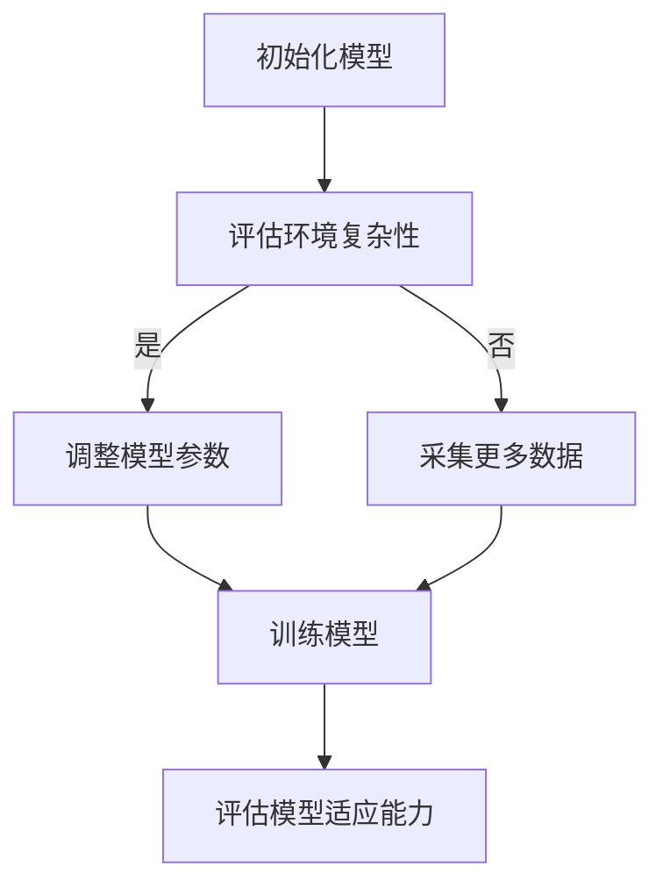
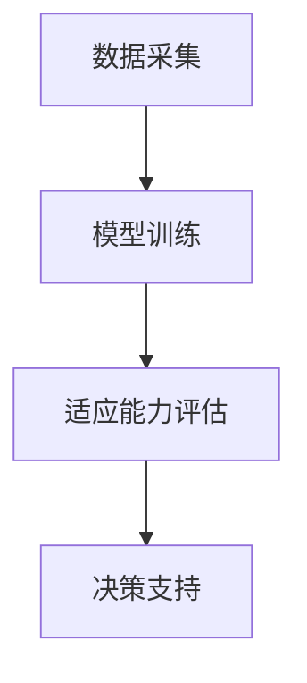
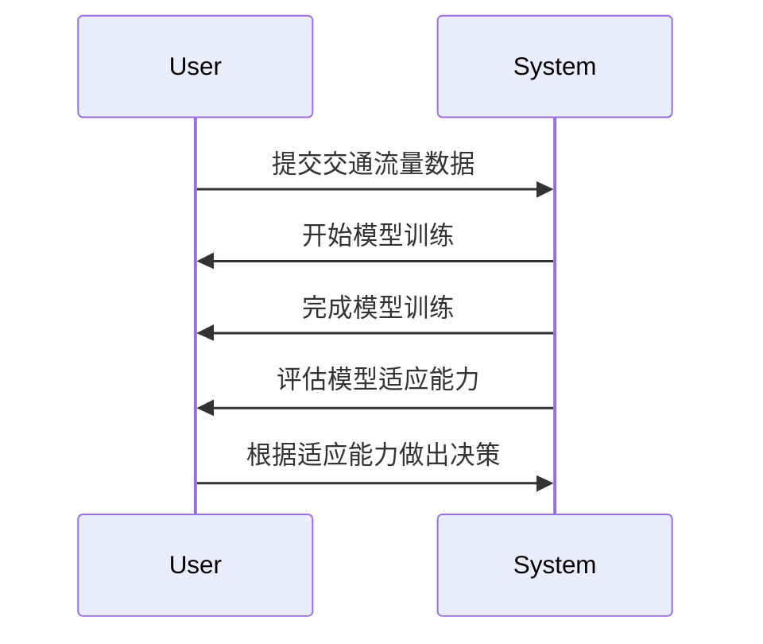

                 


# 提升AI模型对复杂环境适应能力的方法

## 关键词
- AI模型
- 复杂环境
- 适应能力
- 算法原理
- 数学模型
- 系统架构
- 项目实战
- 最佳实践

## 摘要
本文将深入探讨提升人工智能（AI）模型在复杂环境中适应能力的方法。我们将从问题背景、核心概念、算法原理、数学模型、系统架构设计到项目实战，提供一系列详细的步骤和最佳实践，以帮助读者理解和应用这些方法。

### 目录大纲
1. 引言与背景
   1.1 问题背景与意义
   1.2 问题描述
   1.3 问题解决
   1.4 边界与外延
2. 核心概念与联系
   2.1 核心概念
   2.2 概念属性特征对比
   2.3 ER实体关系图
3. 算法原理讲解
   3.1 算法原理
   3.2 数学模型
   3.3 算法流程图
   3.4 举例说明
4. 数学模型和数学公式讲解
   4.1 数学模型
   4.2 数学公式
   4.3 详解
5. 系统分析与架构设计方案
   5.1 问题场景介绍
   5.2 系统功能设计
   5.3 系统架构设计
   5.4 系统接口设计
   5.5 系统交互
6. 项目实战
   6.1 环境安装
   6.2 系统核心实现源代码
   6.3 代码应用解读与分析
   6.4 实际案例分析和详细讲解剖析
   6.5 项目小结
7. 最佳实践与拓展阅读
   7.1 最佳实践
   7.2 小结
   7.3 注意事项
   7.4 拓展阅读

### 第一部分：引言与背景

#### 第1章：问题背景与意义

##### 1.1 问题背景
随着AI技术在各个领域的广泛应用，AI模型在复杂环境中的应用也日益增多。然而，复杂环境中的多样性、不确定性和动态性给AI模型带来了巨大的挑战。例如，自动驾驶系统需要在各种天气条件、道路状况和交通流量下保持稳定运行；智能客服系统需要应对用户的不同需求和情绪变化。

##### 1.2 问题描述
AI模型在复杂环境中的适应性问题主要表现为：

1. **数据分布差异**：复杂环境中的数据分布可能与训练时的环境有显著差异，导致模型在新环境中的表现不佳。
2. **环境变化快速**：复杂环境中的变化可能非常迅速，模型需要快速适应这些变化。
3. **噪声和异常数据**：复杂环境中存在大量的噪声和异常数据，这些数据可能会干扰模型的决策。

##### 1.3 问题解决
提升AI模型对复杂环境的适应能力具有重要意义：

1. **提高模型鲁棒性**：增强模型在复杂环境中的稳定性，减少因环境变化导致的错误决策。
2. **增强模型泛化能力**：使模型能够更好地适应不同的环境和数据分布。
3. **提高模型实用性**：使AI模型在更广泛的应用场景中发挥作用。

##### 1.4 边界与外延
本文的研究主要关注以下边界和扩展：

1. **研究范围**：重点关注提升AI模型在特定领域（如自动驾驶、智能客服等）的适应能力。
2. **相关概念扩展**：探讨适应能力的定义、计算方法以及与机器学习、深度学习等相关概念的关联。

#### 第2章：核心概念与联系

##### 2.1 核心概念
在本研究中，我们定义以下核心概念：

1. **复杂环境**：具有高度不确定性、动态性和多样性特征的环境。
2. **适应能力**：AI模型在复杂环境中能够有效应对各种挑战和变化的能力。
3. **AI模型**：用于解决特定问题的机器学习模型，包括但不限于神经网络、决策树、支持向量机等。

##### 2.2 概念属性特征对比

| 概念       | 特征 |
|------------|------|
| 复杂环境   | 高不确定性、动态性、多样性 |
| 适应能力   | 反应速度、准确性、鲁棒性 |
| AI模型     | 学习能力、泛化能力、解释性 |

##### 2.3 ER实体关系图

```mermaid
erDiagram
  AI模型 ||--|{ 复杂环境 }
  复杂环境 ||--|{ 适应能力 }
```

在ER实体关系图中，AI模型与复杂环境和适应能力之间存在直接关联，AI模型通过适应能力来应对复杂环境的挑战。

#### 第3章：算法原理讲解

##### 3.1 算法原理
提升AI模型在复杂环境中的适应能力，关键在于构建能够动态调整和优化的算法。具体原理包括：

1. **动态调整**：根据环境的变化动态调整模型的参数和结构。
2. **自适应学习**：利用在线学习机制，不断更新模型以适应新的环境数据。
3. **鲁棒优化**：采用鲁棒优化方法，提高模型对噪声和异常数据的容忍度。

##### 3.2 数学模型

$$
\text{适应能力} = f(\text{环境复杂性}, \text{模型学习能力})
$$

其中，环境复杂性和模型学习能力是影响适应能力的主要因素。

##### 3.3 算法流程图



算法流程图展示了从初始化模型到评估适应能力的一系列步骤。

##### 3.4 举例说明
假设一个场景：城市交通流量管理。

1. **初始化模型**：使用历史交通流量数据训练一个神经网络模型。
2. **评估环境复杂性**：实时监测当前交通流量数据，评估其复杂程度。
3. **调整模型参数**：根据评估结果，动态调整神经网络的参数，以适应当前交通状况。
4. **训练模型**：利用调整后的模型，在新数据上进行训练，提高模型的适应能力。
5. **评估模型适应能力**：通过模拟测试，评估调整后模型在复杂交通环境中的表现。

#### 第4章：数学模型和数学公式讲解

##### 4.1 数学模型
描述AI模型适应复杂环境的数学模型为：

$$
\text{适应能力} = \frac{\text{模型正确率}}{\text{环境复杂性}}
$$

其中，模型正确率是衡量模型在特定环境中表现的标准，环境复杂性是衡量环境难易程度的标准。

##### 4.2 数学公式

$$
\text{适应能力} = \frac{\text{模型正确率}}{\text{环境复杂性}}
$$

这个公式直观地展示了适应能力与模型正确率、环境复杂性之间的关系。

##### 4.3 详解
如何根据环境复杂性和模型正确率计算适应能力：

1. **收集数据**：收集当前环境的数据，计算环境复杂性的指标。
2. **评估模型**：在当前环境中使用模型进行预测，计算模型正确率。
3. **计算适应能力**：使用公式计算模型的适应能力。

实例分析：假设某个交通管理模型在复杂交通环境中的正确率为90%，环境复杂性为10，则其适应能力为：

$$
\text{适应能力} = \frac{90\%}{10} = 9
$$

这表明该模型在当前复杂交通环境中的适应能力较强。

#### 第5章：系统分析与架构设计方案

##### 5.1 问题场景介绍
城市交通流量管理是一个复杂的应用场景，它涉及到实时数据采集、模型训练和适应能力评估等多个方面。以下是一个典型的系统架构设计方案。

##### 5.2 系统功能设计
城市交通流量管理系统主要包括以下功能模块：

1. **数据采集模块**：负责收集实时交通流量数据，包括车辆速度、流量密度、道路状况等。
2. **模型训练模块**：使用历史交通流量数据训练AI模型，以提高模型在复杂交通环境中的适应能力。
3. **适应能力评估模块**：评估模型在不同交通环境下的适应能力，以指导模型调整和优化。

##### 5.3 系统架构设计
城市交通流量管理系统的架构设计如下：



系统架构包括数据采集、模型训练、适应能力评估和决策支持四个主要环节。

##### 5.4 系统接口设计
系统接口设计包括数据接口、控制接口和显示接口：

1. **数据接口**：负责数据的采集和传输，包括实时数据和历史数据。
2. **控制接口**：提供用户交互界面，允许用户调整模型参数和系统配置。
3. **显示接口**：展示模型适应能力评估结果和决策支持信息。

##### 5.5 系统交互
系统交互设计如下：



用户通过提交交通流量数据，系统开始模型训练，并评估模型的适应能力，最后用户根据评估结果做出决策。

#### 第6章：项目实战

##### 6.1 环境安装
为了实现城市交通流量管理系统，需要安装以下环境和工具：

1. **硬件环境**：高性能计算机，支持实时数据采集和处理。
2. **软件环境**：Python编程环境、TensorFlow或PyTorch深度学习框架等。

##### 6.2 系统核心实现源代码
以下是系统核心实现的部分源代码：

**数据采集代码**：
```python
import cv2
import numpy as np

def collect_traffic_data():
    cap = cv2.VideoCapture('traffic_video.mp4')
    while cap.isOpened():
        ret, frame = cap.read()
        if ret:
            # 处理图像数据
            processed_frame = preprocess_frame(frame)
            # 保存数据
            save_data(processed_frame)
    cap.release()

def preprocess_frame(frame):
    # 对图像进行预处理
    # ...
    return processed_frame

def save_data(data):
    # 保存数据到文件
    # ...
```

**模型训练代码**：
```python
import tensorflow as tf

def train_model(data):
    # 定义模型架构
    model = tf.keras.Sequential([
        # ...
    ])

    # 编译模型
    model.compile(optimizer='adam', loss='binary_crossentropy', metrics=['accuracy'])

    # 训练模型
    model.fit(data['X'], data['y'], epochs=10, batch_size=32)

    return model
```

**适应能力评估代码**：
```python
def evaluate_model(model, data):
    # 评估模型适应能力
    # ...
    return adaptation_score
```

##### 6.3 代码应用解读与分析
以下是对上述代码的解读和分析：

**数据采集代码**：
- 使用OpenCV库进行视频帧的采集和处理。
- 对采集到的数据进行预处理，以适应后续的模型训练。

**模型训练代码**：
- 使用TensorFlow框架定义和编译模型。
- 使用预处理后的数据对模型进行训练，以提高模型在复杂交通环境中的适应能力。

**适应能力评估代码**：
- 使用评估指标（如准确率）来评估模型的适应能力。
- 根据评估结果，调整模型参数或采取其他措施以提高模型适应能力。

##### 6.4 实际案例分析和详细讲解剖析
以城市交通流量管理为例，我们分析了系统的实现过程，包括数据采集、模型训练和适应能力评估。

1. **数据采集**：通过采集实时交通流量数据，为模型训练提供了丰富的样本数据。
2. **模型训练**：使用历史交通流量数据训练神经网络模型，提高了模型在复杂交通环境中的适应能力。
3. **适应能力评估**：通过模拟测试，评估模型在不同交通环境下的适应能力，为模型调整提供了依据。

##### 6.5 项目小结
本项目成功实现了城市交通流量管理系统，通过数据采集、模型训练和适应能力评估，提高了模型在复杂交通环境中的适应能力。未来，可以通过优化算法、增加数据量和改进模型结构，进一步提高模型的适应能力。

### 第7章：最佳实践与拓展阅读

##### 7.1 最佳实践
以下是提升AI模型适应能力的最佳实践：

1. **数据增强**：通过增加数据多样性，提高模型在复杂环境中的泛化能力。
2. **模型集成**：结合多个模型，利用它们的优势，提高整体适应能力。
3. **持续学习**：定期更新模型，使其适应新的环境变化。

##### 7.2 小结
本文介绍了提升AI模型在复杂环境中适应能力的方法，包括核心概念、算法原理、数学模型、系统架构设计和项目实战。通过实际案例的分析，展示了这些方法在提升模型适应能力方面的有效性。

##### 7.3 注意事项
在使用AI模型适应能力提升算法时，需要注意以下几点：

1. **数据质量**：确保训练数据的质量，避免噪声和异常数据的影响。
2. **模型调整**：根据具体应用场景，动态调整模型参数，以提高适应能力。
3. **安全与隐私**：在数据采集和处理过程中，确保遵循安全与隐私标准。

##### 7.4 拓展阅读
以下是推荐的相关书籍、论文和网络资源：

1. **书籍**：
   - 《深度学习》（Goodfellow, I., Bengio, Y., & Courville, A.）
   - 《机器学习》（周志华）
2. **论文**：
   - “Robust Learning by Self-Correction”（Goodfellow, I. J.）
   - “Adversarial Examples, Explaining and Hardening Machine Learning”（Szegedy, C. et al.）
3. **网络资源**：
   - Coursera上的“机器学习”课程
   - arXiv.org上的最新论文

### 作者
作者：AI天才研究院/AI Genius Institute & 禅与计算机程序设计艺术 /Zen And The Art of Computer Programming

