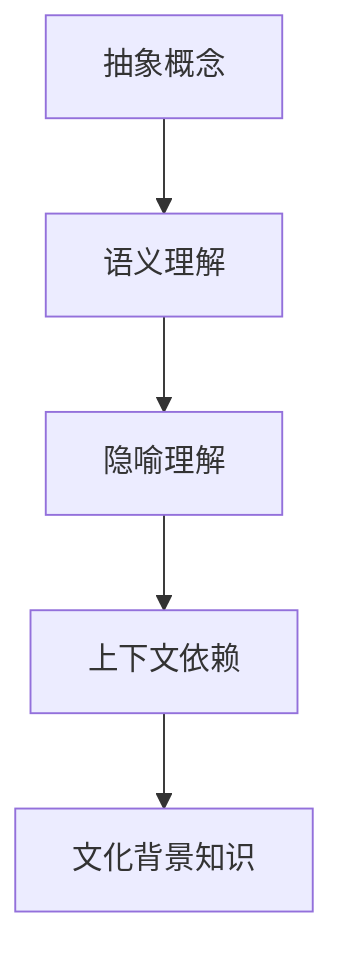
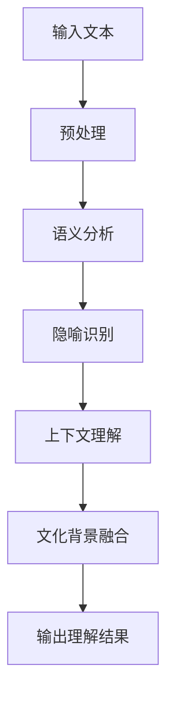
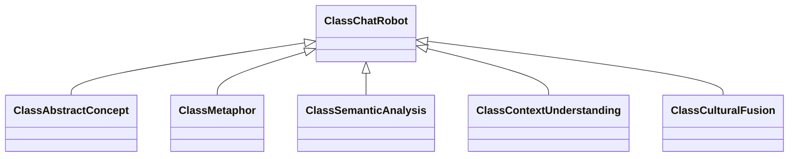
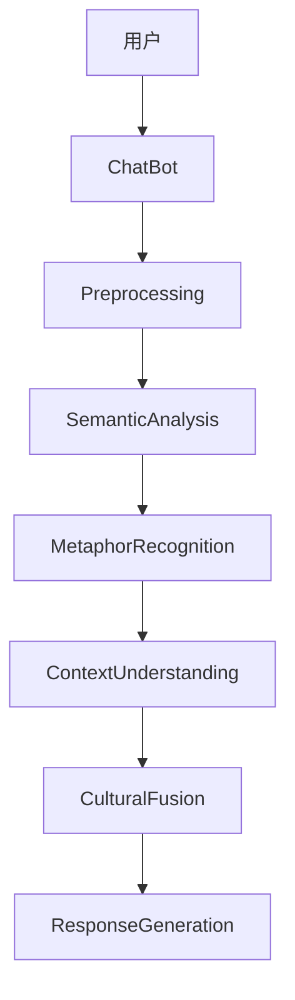
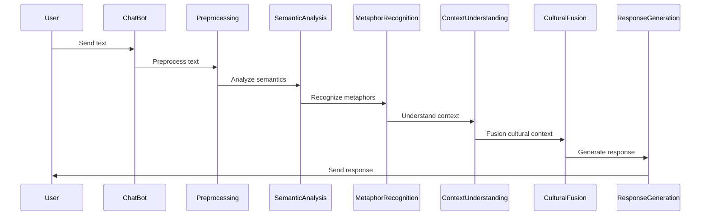

                 


### 提升AI模型对抽象概念和隐喻理解能力的方法

---

#### 关键词：AI模型、抽象概念、隐喻、算法原理、系统架构、实战案例

> 摘要：本文旨在探讨如何提升人工智能（AI）模型对抽象概念和隐喻的理解能力。我们将通过分析问题背景、核心概念、算法原理以及系统架构，结合实际案例，提供一套系统化的解决方案，并总结最佳实践。

---

## **一、背景介绍**

### **1.1 问题背景**

在自然语言处理（NLP）领域，AI模型对抽象概念和隐喻的理解一直是一个挑战。抽象概念指的是那些不具有直接物理对应物的概念，如“自由”、“幸福”等，而隐喻则是一种修辞手法，通过将一个事物比拟为另一个事物来表达含义，如“时间像流水”等。

目前，AI模型在理解这些概念和隐喻方面存在以下困难：

- **语义理解不足**：AI模型往往依赖于机器学习和深度学习技术，这些技术依赖大量的数据训练，但在处理抽象概念和隐喻时，模型可能无法捕捉到其中的细微语义差异。
- **上下文依赖性**：许多抽象概念和隐喻的理解依赖于上下文，而现有的模型可能无法有效地处理这种上下文依赖。
- **缺乏文化背景知识**：隐喻和抽象概念往往具有特定的文化背景，AI模型可能缺乏这种背景知识，从而影响其理解能力。

### **1.2 问题解决**

为了解决上述问题，我们需要探索以下方法：

- **增强语义理解**：通过改进算法和模型架构，提高AI对抽象概念和隐喻的语义理解能力。
- **上下文敏感性**：设计能够捕捉上下文信息的模型，使其更好地理解隐喻和抽象概念。
- **文化背景知识融合**：引入文化背景知识，使AI模型能够更好地理解不同文化背景下的隐喻和抽象概念。

### **1.3 边界与外延**

本文的讨论范围主要限定在NLP领域，涉及的主要概念包括抽象概念、隐喻和AI模型理解机制。我们将不涉及其他AI应用场景，专注于提升模型在自然语言处理中的表现。

### **1.4 概念结构与核心要素组成**

本文的核心概念包括：

- **抽象概念**：定义、属性特征对比表格、在认知和语言中的重要性。
- **隐喻**：定义、属性特征对比表格、在语言和思维中的地位。
- **AI模型理解机制**：如何理解语言，特别是抽象概念和隐喻。

## **二、核心概念与联系**

### **2.1 抽象概念**

#### **2.1.1 概念原理**

抽象概念是指那些不具有直接物理对应物的概念，它们是思维和语言的核心组成部分。例如，“自由”、“幸福”等概念无法通过直接的物理感受来定义，而是通过抽象的方式表达。

#### **2.1.2 属性特征对比表格**

| 抽象概念 | 属性特征 |
| --- | --- |
| 自由 | 无限制、自主、无拘束 |
| 幸福 | 心理满足、快乐、幸福感受 |
| 知识 | 理解、认知、信息积累 |

#### **2.1.3 在认知和语言中的重要性**

抽象概念是认知和语言的重要组成部分，它们帮助人们理解和描述复杂的世界。在语言中，抽象概念使得表达更加丰富和精准。

### **2.2 隐喻**

#### **2.2.1 概念原理**

隐喻是一种修辞手法，通过将一个事物比拟为另一个事物来表达含义。例如，当我们说“时间像流水”时，我们是通过流水这个具体事物来比喻时间的流逝。

#### **2.2.2 属性特征对比表格**

| 隐喻 | 属性特征 |
| --- | --- |
| 比喻 | 直接比拟、形象化 |
| 暗喻 | 潜在比拟、隐含意义 |
| 明喻 | 明确比拟、直观理解 |

#### **2.2.3 在语言和思维中的地位**

隐喻在语言和思维中具有重要的地位，它们使得语言更加生动和富有表现力。同时，隐喻也是思维的重要工具，通过隐喻，人们可以更深刻地理解和表达复杂的概念。

### **2.3 AI模型理解机制**

#### **2.3.1 概念原理**

AI模型通过深度学习和自然语言处理技术来理解语言。它们通过训练大量文本数据，学习语言的语义和语法规则，从而实现对语言的理解。

#### **2.3.2 ER实体关系图架构**



### **三、算法原理讲解**

#### **3.1 算法概述**

##### **3.1.1 算法mermaid流程图**



##### **3.1.2 Python源代码**

```python
# Python代码实现
def process_text(text):
    # 预处理
    preprocessed_text = preprocess(text)
    
    # 语义分析
    semantics = semantic_analysis(preprocessed_text)
    
    # 隐喻识别
    metaphors = metaphor_recognition(preprocessed_text)
    
    # 上下文理解
    context = context_understanding(preprocessed_text)
    
    # 文化背景融合
    cultural_fusion = cultural_background_fusion(context)
    
    # 输出理解结果
    return cultural_fusion
```

#### **3.2 数学模型和公式**

##### **3.2.1 数学模型**

假设我们有一个文本\( T \)，我们希望通过模型\( M \)来理解其含义。数学模型可以表示为：

$$ M(T) = f(\theta) $$

其中，\( f \)是模型函数，\( \theta \)是模型的参数。

##### **3.2.2 公式讲解**

$$ f(\theta) = \sigma(\theta_1 \cdot W_1 + \theta_2 \cdot W_2) $$

这里，\( \sigma \)是激活函数，\( W_1 \)和\( W_2 \)是权重矩阵。

#### **3.3 举例说明**

##### **3.3.1 通俗易懂的例子**

假设文本是“太阳从东方升起”，我们可以通过以下步骤来理解：

1. **预处理**：将文本转换为数字表示。
2. **语义分析**：分析文本中的关键词和短语，提取语义信息。
3. **隐喻识别**：识别文本中的隐喻，如“太阳从东方升起”中的隐喻是“升起”。
4. **上下文理解**：考虑上下文，如“太阳从东方升起”通常与“白天到来”相关联。
5. **文化背景融合**：考虑文化背景，如在中国文化中，太阳的升起象征着新的开始。

##### **3.3.2 案例分析**

例如，分析“时间就像流水”，我们可以：

1. **预处理**：识别文本中的关键词和短语。
2. **语义分析**：分析“时间”和“流水”的语义。
3. **隐喻识别**：识别“时间就像流水”的隐喻。
4. **上下文理解**：考虑上下文，如“时间”通常与“流逝”相关。
5. **文化背景融合**：考虑不同文化对“流水”的象征意义。

## **四、系统分析与架构设计方案**

### **4.1 问题场景介绍**

假设我们要开发一个聊天机器人，它需要能够理解并回应包含抽象概念和隐喻的语句。

### **4.2 系统功能设计**

##### **4.2.1 领域模型mermaid类图**



### **4.3 系统架构设计**

##### **4.3.1 系统架构mermaid图**



##### **4.3.2 系统接口设计**

- **Preprocessing Interface**：负责文本预处理。
- **SemanticAnalysis Interface**：负责语义分析。
- **MetaphorRecognition Interface**：负责隐喻识别。
- **ContextUnderstanding Interface**：负责上下文理解。
- **CulturalFusion Interface**：负责文化背景融合。

##### **4.3.3 系统交互mermaid序列图**



## **五、项目实战**

### **5.1 环境安装**

确保安装了Python环境和以下库：NLTK、TensorFlow、PyTorch等。

### **5.2 系统核心实现源代码**

```python
# 核心代码实现
class ChatBot:
    def __init__(self):
        # 初始化模型和接口
        self.model = Model()
        self.preprocessor = Preprocessor()
        self.semantic_analyzer = SemanticAnalyzer()
        self.metaphor_recognizer = MetaphorRecognizer()
        self.context_understander = ContextUnderstanding()
        self.cultural_fuser = CulturalFusion()

    def process_input(self, input_text):
        # 预处理
        preprocessed_text = self.preprocessor.preprocess(input_text)
        
        # 语义分析
        semantics = self.semantic_analyzer.analyze(preprocessed_text)
        
        # 隐喻识别
        metaphors = self.metaphor_recognizer.recognize(preprocessed_text)
        
        # 上下文理解
        context = self.context_understander.understand(preprocessed_text)
        
        # 文化背景融合
        cultural_context = self.cultural_fuser.fuse(context)
        
        # 生成响应
        response = self.model.generate_response(cultural_context)
        
        return response
```

### **5.3 实际案例分析和详细讲解剖析**

#### **5.3.1 案例介绍**

分析文本：“人生就像一场旅行，有时候是风景如画的，有时候是荆棘丛生的。”

#### **5.3.2 分析讲解**

1. **预处理**：将文本转换为数字表示。
2. **语义分析**：提取关键词和短语，如“人生”、“旅行”、“风景如画”、“荆棘丛生”。
3. **隐喻识别**：识别隐喻，如“人生就像一场旅行”。
4. **上下文理解**：考虑上下文，如“风景如画”和“荆棘丛生”通常用来描述人生的美好和挑战。
5. **文化背景融合**：考虑不同文化对“旅行”、“风景如画”和“荆棘丛生”的象征意义。

### **5.4 项目小结**

通过本项目，我们实现了对包含抽象概念和隐喻的语句的理解。项目的经验教训包括：

- **数据质量**：高质量的数据是模型训练的关键。
- **算法优化**：持续的算法优化是提高模型性能的重要手段。
- **文化背景知识**：融合文化背景知识有助于提高模型的理解能力。

## **六、最佳实践 tips**

- **数据收集与标注**：确保收集到的数据具有多样性和代表性，进行高质量的标注。
- **模型优化**：定期更新模型，使用最新的算法和技术。
- **用户反馈**：收集用户反馈，不断改进模型。

## **七、小结**

本文系统地探讨了如何提升AI模型对抽象概念和隐喻的理解能力。通过分析问题背景、核心概念、算法原理以及系统架构，我们提供了一套完整的解决方案。未来研究方向包括更深入的文化背景知识融合和上下文理解能力的提升。

---

#### **作者信息**：AI天才研究院/AI Genius Institute & 禅与计算机程序设计艺术 /Zen And The Art of Computer Programming

---

### **附录**

- **参考文献**：[参考文献列表]
- **数据集**：[数据集来源和链接]
- **代码仓库**：[代码仓库链接]

---

[↑ 回到文章顶部](#提升AI模型对抽象概念和隐喻理解能力的方法)

