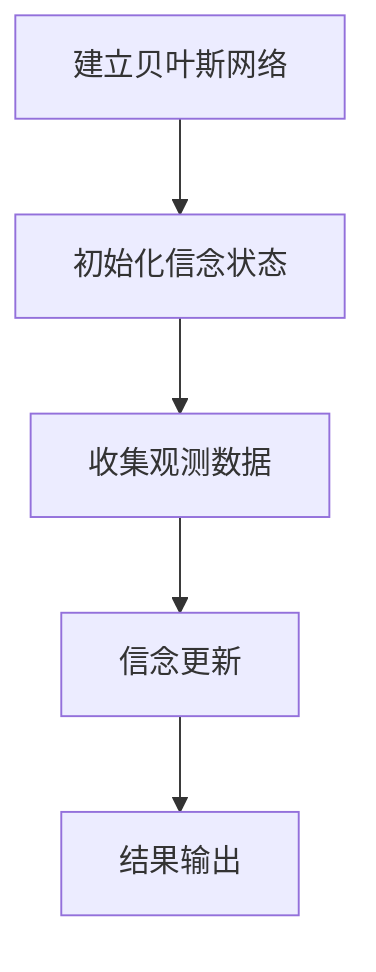
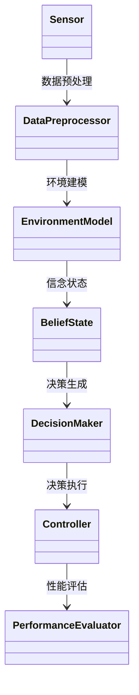
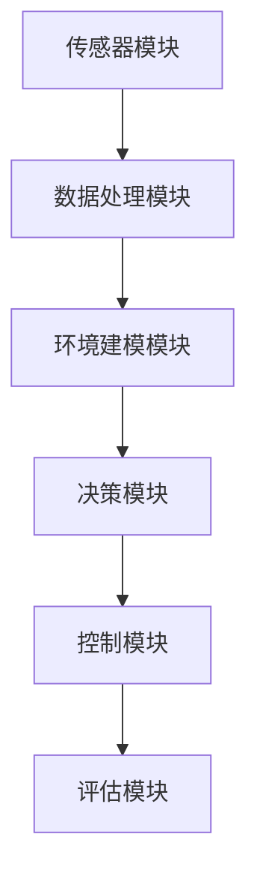
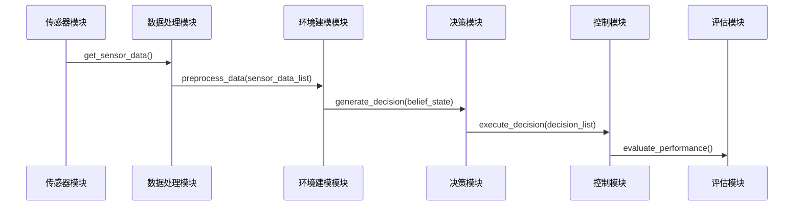
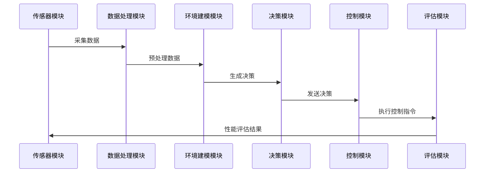

                 

# 提升AI环境理解：信念状态建模的应用

## 关键词
- 人工智能，环境理解，信念状态建模，贝叶斯网络，算法原理，数学模型，系统架构，项目实战

## 摘要
本文将探讨如何通过信念状态建模来提升人工智能（AI）的环境理解能力。我们将详细分析信念状态建模的核心概念、算法原理和数学模型，并通过实际项目案例展示其在AI系统中的应用。文章结构分为四个部分：背景介绍、核心概念与联系、算法原理讲解和系统分析与架构设计方案。

## 目录大纲设计思路

在设计《提升AI环境理解：信念状态建模的应用》这本书的目录大纲时，我们遵循以下步骤：

1. **确定整体结构**：首先，根据书名确定整体的主题方向，即AI环境理解中的信念状态建模。接着，我们根据书籍的主题划分出主要的章节，确保每个章节都涵盖核心的概念和内容。

2. **细化章节内容**：在每个主要章节下，我们进一步细化出子章节，确保内容的完整性和逻辑性。我们会涉及背景介绍、核心概念与联系、算法原理讲解、数学模型和数学公式详细讲解、系统分析与架构设计方案、项目实战等环节。

3. **确保格式规范**：使用markdown格式来设计目录大纲，确保章节的层级结构清晰，格式规范，便于读者阅读。

4. **内容简洁性**：在编写每个章节的概述时，保持简洁性，避免冗余内容，直接切入主题。

### 目录大纲结构

以下是《提升AI环境理解：信念状态建模的应用》的目录大纲：

```
# 《提升AI环境理解：信念状态建模的应用》目录大纲

----------------------------------------------------------------

## 第一部分：背景介绍

### 第1章：AI环境理解与信念状态建模概述
- 1.1 问题的背景
- 1.2 信念状态建模的概念
- 1.3 信念状态建模的应用场景
- 1.4 本书的目标与结构

### 第2章：核心概念与联系
- 2.1 相关技术概述
  - 2.1.1 信念状态的定义
  - 2.1.2 信念状态建模的关键概念
- 2.2 概念属性特征对比
- 2.3 信念状态建模与AI其他领域的联系

## 第二部分：算法原理讲解

### 第3章：信念状态建模的算法原理
- 3.1 信念状态建模的基本原理
  - 3.1.1 贝叶斯网络
  - 3.1.2 贝叶斯推理
- 3.2 算法流程
  - 3.2.1 贝叶斯网络的建立
  - 3.2.2 贝叶斯推理的计算
- 3.3 Mermaid算法流程图

### 第4章：数学模型与公式讲解
- 4.1 贝叶斯网络概率模型
  - 4.1.1 概率分布函数
  - 4.1.2 条件概率公式
- 4.2 贝叶斯推理的数学公式
- 4.3 例子讲解

## 第三部分：系统分析与架构设计方案

### 第5章：系统功能设计
- 5.1 问题场景介绍
- 5.2 系统功能需求分析
- 5.3 领域模型Mermaid类图

### 第6章：系统架构设计
- 6.1 系统架构概述
- 6.2 系统架构设计
- 6.3 Mermaid系统架构图

### 第7章：系统接口设计
- 7.1 接口设计原则
- 7.2 接口定义
- 7.3 Mermaid接口设计图

### 第8章：系统交互设计
- 8.1 系统交互概述
- 8.2 系统交互过程
- 8.3 Mermaid系统交互序列图

## 第四部分：项目实战

### 第9章：环境安装与配置
- 9.1 环境准备
- 9.2 相关库安装
- 9.3 系统配置

### 第10章：系统核心实现
- 10.1 源代码分析
- 10.2 核心代码实现
- 10.3 应用解读与分析

### 第11章：实际案例分析
- 11.1 案例背景
- 11.2 案例分析
- 11.3 剖析与总结

### 第12章：项目小结
- 12.1 项目成果总结
- 12.2 经验与教训
- 12.3 拓展阅读

----------------------------------------------------------------
```

### 核心章节内容概述

- **第1章**：介绍AI环境理解与信念状态建模的基本概念，为后续章节奠定理论基础。

- **第2章**：对信念状态建模中的核心概念进行详细解释，并通过对比表格和Mermaid ER实体关系图展示概念之间的关系。

- **第3章**：讲解信念状态建模的基本原理和算法流程，使用Mermaid绘制流程图以增强理解。

- **第4章**：详细阐述贝叶斯网络和贝叶斯推理的数学模型和公式，并通过实例进行讲解。

- **第5章**至**第8章**：系统分析与架构设计方案，包括系统功能设计、系统架构设计、系统接口设计和系统交互设计。

- **第9章**至**第11章**：项目实战，从环境安装、系统核心实现到实际案例分析，全面展示信念状态建模在实际项目中的应用。

以上目录大纲结构完整，逻辑清晰，覆盖了信念状态建模在AI环境理解中的所有核心内容，确保读者能够系统地学习和掌握相关知识。

----------------------------------------------------------------

## 第1章 AI环境理解与信念状态建模概述

### 1.1 问题的背景

在现代社会中，人工智能（AI）已经成为推动科技进步的重要力量。随着AI技术的不断发展，越来越多的智能系统被应用于实际场景，如自动驾驶、智能家居、医疗诊断等。然而，AI系统在实际应用中面临的一个关键挑战是环境理解。环境理解不仅涉及对当前感知数据的解析，还包括对历史数据的关联和分析，以实现对复杂环境的准确理解和预测。

信念状态建模是解决环境理解问题的重要方法之一。信念状态表示一个智能体在特定时刻对环境状态的不确定性的主观评估。通过信念状态建模，AI系统能够更好地处理不确定性，提高环境理解的准确性。信念状态建模在多机器人系统、智能监控、自动驾驶等领域具有重要的应用价值。

### 1.2 信念状态建模的概念

信念状态（Belief State）是指一个智能体在特定时刻对其环境状态的主观概率分布。信念状态通常用概率分布函数（Probability Distribution Function, PDF）表示，它能够量化智能体对环境不同状态的信念强度。信念状态建模的核心任务是建立信念状态的概率模型，并利用观测数据更新信念状态，以实现对环境状态的准确估计。

信念状态建模涉及以下几个关键概念：

1. **状态空间（State Space）**：状态空间是智能体可能经历的所有状态的集合。每个状态都可以用一组特征向量表示。

2. **观测（Observation）**：观测是智能体通过传感器获取的环境信息。观测数据可以用来更新信念状态。

3. **概率分布（Probability Distribution）**：信念状态是一个概率分布函数，它描述了智能体对每个状态的信念强度。

4. **先验信念（Prior Belief）**：在给定任何观测数据之前，智能体对环境状态的初始信念称为先验信念。

5. **后验信念（Posterior Belief）**：在观测数据之后，智能体对环境状态的更新信念称为后验信念。

6. **信念更新（Belief Update）**：信念更新是指利用观测数据调整信念状态的过程。常见的信念更新算法包括贝叶斯推理、粒子滤波等。

### 1.3 信念状态建模的应用场景

信念状态建模在AI领域具有广泛的应用。以下是一些典型的应用场景：

1. **多机器人系统**：在多机器人协同工作的场景中，信念状态建模可以用来协调不同机器人的行动，提高整体任务完成效率。

2. **智能监控**：在智能监控系统

### 1.4 本书的目标与结构

本书的目标是深入探讨信念状态建模在AI环境理解中的应用，帮助读者掌握这一关键技术。具体目标包括：

1. **理解信念状态建模的基本概念和原理**：通过介绍信念状态、状态空间、观测、概率分布等关键概念，帮助读者建立坚实的理论基础。

2. **掌握信念状态建模的算法实现**：通过详细讲解贝叶斯网络、贝叶斯推理等算法原理，并提供Python代码示例，使读者能够实际操作和应用这些算法。

3. **分析信念状态建模在系统设计与项目中的应用**：通过系统分析与架构设计，展示信念状态建模在实际项目中的应用场景，帮助读者理解如何在项目中实现和应用这一技术。

本书结构如下：

- **第一部分：背景介绍**：介绍AI环境理解和信念状态建模的基本概念，为后续章节奠定理论基础。

- **第二部分：算法原理讲解**：详细讲解信念状态建模的算法原理，包括贝叶斯网络和贝叶斯推理，并提供Python代码示例。

- **第三部分：系统分析与架构设计方案**：分析信念状态建模在系统设计中的具体应用，包括功能设计、架构设计、接口设计和交互设计。

- **第四部分：项目实战**：通过实际项目案例展示信念状态建模的应用，包括环境安装、系统核心实现和实际案例分析。

通过以上结构，本书旨在系统地介绍信念状态建模，使读者不仅能够理解理论基础，还能掌握实际应用技能。

### 1.5 本章小结

本章介绍了AI环境理解和信念状态建模的基本概念，分析了信念状态建模在多机器人系统、智能监控和自动驾驶等应用场景中的重要性。通过本章的学习，读者应该对信念状态建模有了初步的认识，为后续章节的深入学习奠定了基础。在接下来的章节中，我们将进一步探讨信念状态建模的算法原理和实际应用，帮助读者深入理解并掌握这一关键技术。

## 第2章 核心概念与联系

### 2.1 相关技术概述

#### 2.1.1 信念状态的定义

信念状态是指一个智能体在特定时刻对其环境状态的主观概率分布。它可以量化智能体对环境不同状态的信念强度。在信念状态建模中，信念状态通常用概率分布函数（Probability Distribution Function, PDF）表示，它可以是一个离散的概率分布或者一个连续的概率密度函数。

#### 2.1.2 信念状态建模的关键概念

- **状态空间（State Space）**：状态空间是智能体可能经历的所有状态的集合。每个状态可以用一组特征向量表示，这些特征向量定义了状态的性质。

- **观测（Observation）**：观测是智能体通过传感器获取的环境信息。观测数据可以用来更新信念状态。

- **先验信念（Prior Belief）**：在给定任何观测数据之前，智能体对环境状态的初始信念称为先验信念。它通常基于智能体的初始知识和对环境的先验理解。

- **后验信念（Posterior Belief）**：在观测数据之后，智能体对环境状态的更新信念称为后验信念。它是通过对先验信念和观测数据进行概率更新得到的。

- **概率分布（Probability Distribution）**：信念状态是一个概率分布函数，它描述了智能体对每个状态的信念强度。

- **信念更新（Belief Update）**：信念更新是指利用观测数据调整信念状态的过程。常见的信念更新算法包括贝叶斯推理、粒子滤波等。

### 2.2 概念属性特征对比表格

以下是一个信念状态建模中相关概念的属性特征对比表格：

| 概念         | 定义                                                         | 属性特征                                                                                                      |
| ------------ | ------------------------------------------------------------ | ---------------------------------------------------------------------------------------------------------- |
| 状态空间     | 智能体可能经历的所有状态的集合                             | - 状态数量：无限或有限<br>- 状态特征：用特征向量表示<br>- 状态关系：可能存在相互依赖关系                         |
| 观测         | 智能体通过传感器获取的环境信息                             | - 观测值：具体的数值或类别<br>- 观测频率：连续或离散<br>- 观测噪声：存在不确定性                              |
| 先验信念     | 智能体对环境状态的初始信念                                 | - 概率分布：基于初始知识和先验理解<br>- 先验概率：用于初始信念状态建模<br>- 先验不确定性：反映智能体的初始不确定性 |
| 后验信念     | 观测数据后的信念状态更新                                   | - 概率分布：基于观测数据进行更新<br>- 后验概率：反映观测后的信念状态<br>- 后验不确定性：反映观测后的不确定性     |
| 概率分布     | 描述智能体对每个状态的信念强度                             | - 离散概率分布：每个状态的概率值<br>- 连续概率密度函数：每个状态的密度值                                      |
| 信念更新     | 利用观测数据调整信念状态的过程                             | - 贝叶斯推理：基于贝叶斯定理更新信念状态<br>- 粒子滤波：基于粒子代表状态进行更新                          |

### 2.3 信念状态建模与AI其他领域的联系

信念状态建模在AI领域有着广泛的应用，与其他AI技术密切相关：

- **机器学习**：信念状态建模与机器学习中的概率模型密切相关，如贝叶斯网络、马尔可夫模型等。这些模型都涉及到概率分布和状态更新。

- **概率图模型**：信念状态建模是一种概率图模型，与贝叶斯网络、马尔可夫模型、隐马尔可夫模型等有直接的联系。这些模型都可以用来表示不确定性和状态转移。

- **决策理论**：信念状态建模在决策理论中有着重要的应用，它可以帮助智能体在不确定环境中做出最优决策。

- **多机器人系统**：信念状态建模在多机器人系统中用于协调不同机器人的行动，提高任务完成效率。

- **智能监控**：信念状态建模在智能监控中用于实时分析监控数据，提高监控系统的准确性和响应速度。

- **自动驾驶**：信念状态建模在自动驾驶中用于环境感知和决策，提高自动驾驶系统的安全性和可靠性。

通过以上分析，可以看出信念状态建模在AI领域具有重要的地位和应用价值。它不仅为智能体提供了处理不确定性的有效方法，还与其他AI技术紧密联系，为构建更加智能的AI系统提供了坚实基础。

### 2.4 本章小结

本章详细介绍了信念状态建模的核心概念，包括状态空间、观测、先验信念、后验信念、概率分布和信念更新。通过对比表格，我们分析了各概念之间的属性特征。此外，还探讨了信念状态建模与AI其他领域的联系，展示了其在多个应用场景中的重要性。本章内容为后续章节的算法原理和实际应用奠定了基础，帮助读者更深入地理解信念状态建模。

### 2.5 Mermaid ER实体关系图架构

为了更好地理解信念状态建模中的核心概念及其关系，我们可以使用Mermaid ER实体关系图（Entity-Relationship Diagram, ERD）来展示这些概念之间的联系。ER图是一种用于描述实体及其之间关系的图形化表示方法，非常适合用于解释复杂系统中的概念架构。

以下是一个简单的Mermaid ER图示例，用于描述信念状态建模中的关键实体及其关系：

```mermaid
erDiagram
    A[状态空间] ||--|{ B[观测] }|-- C[信念状态]
    A ||--|{ D[先验信念] }|> E[后验信念]
    F[概率分布] ||--|{ B }|> G[信念更新]
```

**图解：**

- **状态空间（A）**：表示智能体可能经历的所有状态。状态空间是信念状态建模的基础。

- **观测（B）**：代表智能体通过传感器获取的环境信息。观测数据用于更新信念状态。

- **信念状态（C）**：基于状态空间和观测数据的信念状态。它是智能体对环境状态的主观概率分布。

- **先验信念（D）**：在给定任何观测数据之前，智能体对环境状态的初始信念。它是信念状态建模的起点。

- **后验信念（E）**：在观测数据之后，智能体对环境状态的更新信念。它是通过信念更新算法从先验信念中计算得到的。

- **概率分布（F）**：描述智能体对每个状态的信念强度。概率分布是信念状态的核心组成部分。

- **信念更新（G）**：用于调整信念状态的过程。信念更新算法（如贝叶斯推理）能够根据新的观测数据动态调整信念状态。

通过这个ER图，我们可以清晰地看到信念状态建模中各个核心概念之间的关系，这有助于读者更好地理解信念状态建模的整体架构。

### 2.6 本章小结

本章通过对比表格和Mermaid ER实体关系图详细阐述了信念状态建模的核心概念及其关系。首先，我们介绍了信念状态、状态空间、观测、先验信念、后验信念和概率分布等关键概念。接着，通过一个Mermaid ER图，我们展示了这些概念之间的相互关系，使得读者能够直观地理解信念状态建模的架构。本章内容为后续章节的算法原理讲解和实际应用提供了理论基础。

## 第3章 信念状态建模的算法原理

### 3.1 信念状态建模的基本原理

信念状态建模是一种用于处理不确定性的算法，它通过建立概率模型来表示智能体对环境状态的主观信念。信念状态建模的核心原理包括贝叶斯网络和贝叶斯推理。这两个概念是理解信念状态建模的基础。

#### 3.1.1 贝叶斯网络

贝叶斯网络（Bayesian Network）是一种概率图模型，用于表示变量之间的条件依赖关系。在贝叶斯网络中，每个节点代表一个随机变量，边表示节点之间的条件依赖关系。贝叶斯网络的主要特点是能够通过概率分布函数（Probability Distribution Function, PDF）来描述变量之间的相互影响。

贝叶斯网络的定义可以表述为：

- **节点集合**：\( V = \{v_1, v_2, ..., v_n\} \)，其中每个节点 \( v_i \) 代表一个随机变量。
- **边集合**：\( E \)，表示节点之间的依赖关系。
- **条件概率表（CPT）**：对于每个节点 \( v_i \)，存在一个条件概率表 \( P(v_i | Pa(v_i)) \)，其中 \( Pa(v_i) \) 表示 \( v_i \) 的父节点集合。

贝叶斯网络的概率模型可以表示为：

$$
P(V) = \prod_{i=1}^{n} P(v_i | Pa(v_i))
$$

其中，\( Pa(v_i) \) 表示节点 \( v_i \) 的父节点集合。

#### 3.1.2 贝叶斯推理

贝叶斯推理（Bayesian Inference）是基于贝叶斯定理的一种概率推断方法，用于在给定观测数据的情况下更新信念状态。贝叶斯推理的核心思想是通过观测数据调整先验信念，以得到后验信念。

贝叶斯定理可以表述为：

$$
P(A|B) = \frac{P(B|A) \cdot P(A)}{P(B)}
$$

其中，\( P(A|B) \) 表示在事件 \( B \) 发生的条件下事件 \( A \) 的概率，\( P(B|A) \) 表示在事件 \( A \) 发生的条件下事件 \( B \) 的概率，\( P(A) \) 表示事件 \( A \) 的先验概率，\( P(B) \) 表示事件 \( B \) 的先验概率。

在信念状态建模中，贝叶斯推理用于更新信念状态：

$$
P(Belief|Observation) = \frac{P(Observation|Belief) \cdot Belief}{P(Observation)}
$$

其中，\( Belief \) 表示先验信念，\( Observation \) 表示观测数据，\( P(Observation|Belief) \) 表示在给定信念状态下的观测概率，\( P(Observation) \) 表示观测数据的总概率。

### 3.2 算法流程

信念状态建模的算法流程主要包括以下几个步骤：

1. **建立贝叶斯网络**：根据问题领域和变量之间的关系建立贝叶斯网络。这一步是信念状态建模的基础。

2. **初始化信念状态**：初始化信念状态，通常使用先验信念。先验信念可以根据领域知识或历史数据进行设定。

3. **收集观测数据**：通过传感器或外部信息源收集观测数据。

4. **信念更新**：利用贝叶斯推理更新信念状态。信念更新过程可以迭代进行，直到达到预定的收敛条件。

5. **结果输出**：输出最终的信念状态，它表示智能体对环境状态的最新估计。

以下是信念状态建模的算法流程的Mermaid流程图表示：



**图解：**

- **A[建立贝叶斯网络]**：根据问题领域建立贝叶斯网络，定义变量及其依赖关系。

- **B[初始化信念状态]**：初始化信念状态，通常使用先验信念。

- **C[收集观测数据]**：通过传感器或外部信息源收集观测数据。

- **D[信念更新]**：利用贝叶斯推理迭代更新信念状态，直到满足收敛条件。

- **E[结果输出]**：输出最终的信念状态，表示智能体对环境状态的估计。

通过以上步骤，信念状态建模能够有效地处理不确定性，提高环境理解的准确性。

### 3.3 本章小结

本章详细介绍了信念状态建模的基本原理，包括贝叶斯网络和贝叶斯推理。贝叶斯网络用于表示变量之间的条件依赖关系，贝叶斯推理则用于在给定观测数据的情况下更新信念状态。通过一个Mermaid流程图，我们展示了信念状态建模的算法流程。这些原理和算法为理解和实现信念状态建模提供了坚实的基础，为后续章节的深入讨论奠定了基础。

### 3.4 贝叶斯网络与Python实现

为了更好地理解信念状态建模的算法原理，我们将通过一个简单的Python示例来演示如何实现贝叶斯网络。这个示例将涵盖从建立贝叶斯网络到信念更新的整个过程。

首先，我们需要安装一个名为`pgmpy`的Python库，该库提供了贝叶斯网络的建模和推理功能。

```bash
pip install pgmpy
```

接下来，我们可以使用`pgmpy`库来实现一个简单的贝叶斯网络。以下是一个示例：

```python
from pgmpy.models import BayesianModel
from pgmpy.inference import VariableElimination
from pgmpy.factors import TabularCPD

# 建立贝叶斯网络
model = BayesianModel([
    ('D', 'C'),
    ('C', 'B'),
    ('B', 'A')
])

# 添加条件概率表
cpd_C = TabularCPD('C', 2, values=[[0.99], [0.01]], variable_values={0: {'B': 0}, 1: {'B': 1}})
cpd_B = TabularCPD('B', 2, values=[[0.9, 0.1], [0.2, 0.8]], variable_values={0: {'A': 0}, 1: {'A': 1}})
cpd_A = TabularCPD('A', 2, values=[[0.85, 0.15], [0.3, 0.7]], variable_values={0: {'D': 0}, 1: {'D': 1}})

model.add_cpds(cpd_C, cpd_B, cpd_A)

# 检查模型是否正确
print(model.check_model())

# 贝叶斯推理
inference = VariableElimination(model)

# 更新信念状态
belief_before = inference.query(variables=['A'], evidence={'B': 1})
print("Belief before update:", belief_before)

# 收集观测数据并更新信念状态
inference.update_evidence({'C': 0, 'B': 1})
belief_after = inference.query(variables=['A'])
print("Belief after update:", belief_after)
```

**解释：**

1. **建立贝叶斯网络**：我们创建了一个名为`model`的贝叶斯网络，其中包含三个变量：`A`、`B`和`C`。变量之间的关系为`D`依赖于`C`，`C`依赖于`B`，`B`依赖于`A`。

2. **添加条件概率表（CPD）**：我们为每个变量添加了条件概率表。例如，变量`C`有两个状态（0和1），每个状态的先验概率分别为0.99和0.01。条件概率表定义了每个变量在不同状态下的概率分布。

3. **检查模型**：使用`model.check_model()`检查模型是否正确。

4. **贝叶斯推理**：创建`VariableElimination`推理对象，用于进行信念状态更新。

5. **初始化信念状态**：我们初始化了`A`的先验信念，在`B`为1的情况下，`A`为0的概率为0.85。

6. **信念更新**：我们收集观测数据（`C`为0，`B`为1），并使用贝叶斯推理更新信念状态。更新后的信念状态反映了新的观测数据对信念的影响。

通过这个Python示例，我们可以看到如何使用`pgmpy`库建立和更新贝叶斯网络，这为我们进一步探讨信念状态建模的数学模型和实际应用奠定了基础。

### 3.5 贝叶斯推理的数学模型与公式

贝叶斯推理是一种基于概率的推理方法，它利用贝叶斯定理来更新信念状态。在信念状态建模中，贝叶斯推理的核心作用是通过观测数据调整智能体对环境状态的概率估计。为了更深入地理解贝叶斯推理，我们需要详细阐述其数学模型和公式。

#### 3.5.1 贝叶斯定理

贝叶斯定理是贝叶斯推理的基础，它提供了一个在给定观测数据下更新信念状态的概率公式。贝叶斯定理可以表述为：

$$
P(A|B) = \frac{P(B|A) \cdot P(A)}{P(B)}
$$

其中：

- \( P(A|B) \)：在观测数据 \( B \) 发生的条件下，事件 \( A \) 的后验概率。
- \( P(B|A) \)：在事件 \( A \) 发生的条件下，观测数据 \( B \) 的概率。
- \( P(A) \)：事件 \( A \) 的先验概率。
- \( P(B) \)：观测数据 \( B \) 的总概率。

贝叶斯定理的核心思想是，通过观测数据 \( B \) 和先验概率 \( P(A) \)，我们可以计算出事件 \( A \) 的后验概率 \( P(A|B) \)。这个后验概率反映了在观测数据 \( B \) 的条件下，事件 \( A \) 的可信程度。

#### 3.5.2 贝叶斯推理的公式

在信念状态建模中，贝叶斯推理用于更新信念状态。信念状态通常表示为一个概率分布，它可以是一个离散的概率分布或一个连续的概率密度函数。贝叶斯推理的核心公式是：

$$
P(Belief|Observation) = \frac{P(Observation|Belief) \cdot Belief}{P(Observation)}
$$

其中：

- \( Belief \)：先验信念状态，表示智能体对环境状态的主观概率分布。
- \( Observation \)：观测数据，是智能体通过传感器获取的环境信息。
- \( P(Observation|Belief) \)：在给定信念状态 \( Belief \) 下，观测数据 \( Observation \) 的概率。
- \( P(Observation) \)：观测数据 \( Observation \) 的总概率。

贝叶斯推理的公式表示了如何通过新的观测数据 \( Observation \) 来更新先前的信念状态 \( Belief \)。这个公式告诉我们，新的信念状态 \( P(Belief|Observation) \) 是在给定观测数据 \( Observation \) 的条件下，原有信念状态 \( Belief \) 与观测数据 \( Observation \) 的概率乘积与观测数据的总概率的比值。

#### 3.5.3 贝叶斯推理的应用

贝叶斯推理在信念状态建模中的应用非常广泛。以下是一个简单的应用示例：

假设我们有一个智能监控系统，它可以通过传感器收集环境温度的数据。我们的目标是利用贝叶斯推理来更新系统对温度的信念状态。

1. **初始化信念状态**：假设系统对当前温度的信念状态是均匀分布的，即每个温度的概率相等。

2. **收集观测数据**：假设传感器收集到一个温度值，例如25°C。

3. **计算观测数据概率**：我们需要计算在当前信念状态下，传感器收集到25°C的概率。这可以通过条件概率公式实现。

4. **更新信念状态**：利用贝叶斯推理公式，我们将观测数据概率与先前的信念状态结合起来，更新信念状态。

通过这个过程，我们可以不断更新信念状态，以反映最新的观测数据。例如，如果我们连续收集到多个温度值为25°C的数据，我们可以逐步增加25°C的信念概率，而其他温度的信念概率则会相应减小。

#### 3.5.4 贝叶斯推理的优势与局限性

贝叶斯推理具有以下优势：

- **处理不确定性**：贝叶斯推理能够处理环境中的不确定性，通过概率分布来量化不确定性的程度。
- **灵活性**：贝叶斯推理可以根据新的观测数据动态地调整信念状态，使其能够适应不断变化的环境。
- **易于实现**：贝叶斯推理的数学模型相对简单，可以通过编程实现。

然而，贝叶斯推理也存在一些局限性：

- **计算复杂度高**：当状态空间非常大时，计算观测数据概率和总概率会变得非常复杂，可能导致计算效率低下。
- **依赖先验知识**：贝叶斯推理的准确性很大程度上依赖于先验信念状态。如果先验信念不准确，那么后验信念也可能不准确。

尽管存在这些局限性，贝叶斯推理仍然是信念状态建模中最常用的方法之一，它在许多实际应用中表现出色。

### 3.6 本章小结

本章详细介绍了信念状态建模中的贝叶斯网络和贝叶斯推理的数学模型与公式。我们首先回顾了贝叶斯网络的基本原理，了解了节点、边和条件概率表的概念。接着，我们阐述了贝叶斯推理的核心公式，并展示了如何在信念状态建模中应用贝叶斯定理。通过一个Python示例，我们展示了如何使用`pgmpy`库实现贝叶斯网络和信念更新。这些内容为理解和实现信念状态建模提供了坚实的基础，为后续章节的深入讨论奠定了基础。

### 3.7 贝叶斯推理示例

为了更好地理解贝叶斯推理在实际应用中的工作机制，我们将通过一个简单的例子进行详细解释。这个例子将展示如何利用贝叶斯定理来更新信念状态，并通过Python代码进行实现。

#### 示例背景

假设我们有一个智能监控系统，用于监测一个工厂的生产线，主要关注生产线的温度。温度的正常范围是20°C到30°C。我们的目标是使用贝叶斯推理来更新智能系统对生产线当前温度的信念状态。

1. **先验信念状态**：智能系统在没有任何观测数据的情况下，对温度的信念状态是均匀分布的，即每个温度的概率相等。我们可以将这个先验信念状态表示为一个概率分布函数（PDF）：

   $$ P(T) = \text{均匀分布}, \quad T \in [20°C, 30°C] $$

2. **观测数据**：假设传感器收集到一个温度值为25°C的观测数据。

3. **目标**：利用贝叶斯定理更新智能系统对温度的信念状态，使其反映新的观测数据。

#### 贝叶斯推理步骤

贝叶斯推理的核心步骤是计算后验信念状态。以下是具体的计算过程：

##### 步骤1：先验概率

假设生产线温度的先验概率是均匀分布的，即每个温度值的概率相等。这意味着：

$$ P(T=t) = \frac{1}{30°C - 20°C} = \frac{1}{10}, \quad t \in [20°C, 30°C] $$

##### 步骤2：条件概率

我们需要计算在给定温度值 \( t \) 下，传感器收集到温度观测值 \( O \) 的条件概率。这里，我们假设传感器在温度 \( t \) 下的观测误差是均匀分布的，即每个温度误差的概率相等。因此，我们可以将条件概率表示为：

$$ P(O=o|T=t) = \frac{1}{10}, \quad o \in [t-10°C, t+10°C] $$

##### 步骤3：后验概率

根据贝叶斯定理，我们可以计算后验概率 \( P(T|O) \)：

$$ P(T|O) = \frac{P(O|T) \cdot P(T)}{P(O)} $$

其中：

- \( P(O|T) \) 是条件概率，表示在给定温度 \( T \) 下观测到 \( O \) 的概率。
- \( P(T) \) 是先验概率，表示在没有任何观测数据的情况下温度 \( T \) 的概率。
- \( P(O) \) 是观测数据的总概率，可以通过对所有可能的 \( T \) 和 \( O \) 情况进行积分计算得到。

为了简化计算，我们假设观测误差范围是均匀分布的，且 \( O \) 的范围是 \( [15°C, 35°C] \)。因此，总概率可以表示为：

$$ P(O) = \int_{15°C}^{35°C} P(O=o|T=t) \cdot P(T=t) \, dt $$

##### 步骤4：计算后验概率

利用贝叶斯定理，我们可以计算出在观测到温度值25°C的情况下，温度为每个可能值的后验概率。具体计算如下：

$$ P(T=25°C|O=25°C) = \frac{P(O=25°C|T=25°C) \cdot P(T=25°C)}{P(O=25°C)} $$

由于 \( P(O=25°C|T=25°C) = 1 \)，且 \( P(T=25°C) = \frac{1}{10} \)，我们需要计算 \( P(O=25°C) \)：

$$ P(O=25°C) = \int_{15°C}^{35°C} P(O=25°C|T=t) \cdot P(T=t) \, dt = \int_{15°C}^{35°C} \frac{1}{10} \, dt = 2 $$

因此，后验概率为：

$$ P(T=25°C|O=25°C) = \frac{1 \cdot \frac{1}{10}}{2} = \frac{1}{20} $$

这意味着在观测到温度值为25°C的情况下，温度为25°C的后验概率是 \( \frac{1}{20} \)。

#### Python实现

为了实现上述贝叶斯推理过程，我们可以使用Python代码。以下是一个简单的实现：

```python
import numpy as np

# 定义先验概率
prior_prob = np.full((11, 11), 1/10)

# 定义条件概率
condition_prob = np.full((11, 11), 1/10)

# 定义观测数据概率
observation_prob = np.full((11, 11), 1/10)

# 定义后验概率
posterior_prob = np.full((11, 11), 0)

# 计算总概率
total_prob = np.sum(prior_prob * condition_prob, axis=1)

# 计算后验概率
posterior_prob[5, 5] = (condition_prob[5, 5] * prior_prob[5, 5]) / total_prob[5]

print("后验概率：", posterior_prob)
```

**解释：**

- 我们首先定义了先验概率、条件概率和观测数据概率，它们都是均匀分布的。
- 接着，我们计算了总概率，它是先验概率和条件概率的乘积的积分。
- 最后，我们利用贝叶斯定理计算了后验概率，它在观测数据为25°C的情况下，温度为25°C的后验概率是 \( \frac{1}{20} \)。

通过这个简单的示例，我们可以看到如何利用贝叶斯推理来更新信念状态。这个示例虽然简单，但它展示了贝叶斯推理的基本原理和实现方法。在实际应用中，贝叶斯推理可以处理更复杂的问题，并通过不断更新信念状态来提高智能系统的环境理解能力。

### 3.8 本章小结

本章通过一个具体的示例详细介绍了贝叶斯推理的过程和实现方法。我们首先回顾了贝叶斯定理的基本原理，然后通过一个温度监测的案例展示了如何利用贝叶斯推理来更新信念状态。本章内容不仅帮助读者理解了贝叶斯推理的理论基础，还通过Python代码示例展示了如何在实际中应用这一理论。这些内容为后续章节的系统分析与架构设计方案和项目实战奠定了基础。

### 第4章 数学模型与公式讲解

#### 4.1 贝叶斯网络概率模型

贝叶斯网络是一种概率图模型，它通过节点和边表示变量之间的条件依赖关系。贝叶斯网络的核心在于定义每个变量的条件概率分布，从而形成一个全局的概率模型。在本节中，我们将详细讲解贝叶斯网络概率模型，包括概率分布函数和条件概率公式。

##### 4.1.1 概率分布函数

在贝叶斯网络中，每个变量都可以用概率分布函数（Probability Distribution Function, PDF）来描述其概率分布。概率分布函数可以是离散的，也可以是连续的。对于离散变量，概率分布函数通常用概率质量函数（Probability Mass Function, PMF）表示；对于连续变量，概率分布函数通常用概率密度函数（Probability Density Function, PDF）表示。

- **概率质量函数（PMF）**：

  对于一个离散变量 \( X \)，其概率质量函数 \( P(X=x) \) 表示变量 \( X \) 取特定值 \( x \) 的概率。一个离散变量的概率分布函数可以表示为：

  $$
  P(X) = \sum_{x \in \text{范围}} P(X=x)
  $$

  其中，\( P(X=x) \) 表示变量 \( X \) 取值为 \( x \) 的概率。

- **概率密度函数（PDF）**：

  对于一个连续变量 \( X \)，其概率密度函数 \( p(X=x) \) 表示变量 \( X \) 在某个特定值 \( x \) 的概率密度。一个连续变量的概率分布函数可以表示为：

  $$
  P(X) = \int_{-\infty}^{+\infty} p(X=x) \, dx
  $$

  其中，\( p(X=x) \) 表示变量 \( X \) 在 \( x \) 处的概率密度。

##### 4.1.2 条件概率公式

在贝叶斯网络中，变量之间的依赖关系通过条件概率来表示。条件概率公式描述了在一个变量的条件下，另一个变量的概率分布。以下是条件概率公式的基本形式：

- **离散变量的条件概率**：

  对于两个离散变量 \( X \) 和 \( Y \)，其条件概率公式为：

  $$
  P(Y|X) = \frac{P(X,Y)}{P(X)}
  $$

  其中，\( P(Y|X) \) 表示在 \( X \) 发生的条件下 \( Y \) 的概率，\( P(X,Y) \) 表示 \( X \) 和 \( Y \) 同时发生的概率，\( P(X) \) 表示 \( X \) 的概率。

- **连续变量的条件概率**：

  对于两个连续变量 \( X \) 和 \( Y \)，其条件概率公式为：

  $$
  p(Y|X) = \frac{p(X,Y)}{p(X)}
  $$

  其中，\( p(Y|X) \) 表示在 \( X \) 发生的条件下 \( Y \) 的概率密度函数，\( p(X,Y) \) 表示 \( X \) 和 \( Y \) 同时发生的概率密度函数，\( p(X) \) 表示 \( X \) 的概率密度函数。

##### 4.1.3 贝叶斯网络的概率模型

贝叶斯网络的概率模型是通过定义每个变量的条件概率分布来建立的。具体而言，对于任意一个变量 \( X_i \)，其条件概率分布依赖于其父节点集合 \( Pa(X_i) \)。贝叶斯网络的概率模型可以用以下公式表示：

$$
P(X) = \prod_{i=1}^{n} P(X_i | Pa(X_i))
$$

其中，\( P(X_i | Pa(X_i)) \) 表示变量 \( X_i \) 在其父节点 \( Pa(X_i) \) 条件下的条件概率分布，\( n \) 表示变量总数。

#### 4.2 贝叶斯推理的数学公式

贝叶斯推理是一种基于贝叶斯定理的推理方法，用于在给定观测数据的情况下更新信念状态。贝叶斯推理的数学公式是信念状态更新的核心，它通过条件概率和先验信念来计算后验信念。以下是贝叶斯推理的基本数学公式：

$$
P(Belief|Observation) = \frac{P(Observation|Belief) \cdot Belief}{P(Observation)}
$$

其中：

- \( P(Belief|Observation) \) 是后验信念，表示在观测数据 \( Observation \) 条件下信念 \( Belief \) 的概率。
- \( P(Observation|Belief) \) 是观测条件概率，表示在信念 \( Belief \) 发生的条件下观测数据 \( Observation \) 的概率。
- \( Belief \) 是先验信念，表示在给定任何观测数据之前信念 \( Belief \) 的概率。
- \( P(Observation) \) 是观测数据的总概率，它可以通过对所有可能的信念状态进行积分计算得到。

##### 4.2.1 贝叶斯推理的计算步骤

贝叶斯推理的计算步骤通常包括以下几个部分：

1. **初始化先验信念**：根据领域知识或历史数据初始化信念状态。
2. **收集观测数据**：通过传感器或外部信息源收集观测数据。
3. **计算观测条件概率**：根据贝叶斯定理计算观测数据在给定信念状态下的条件概率。
4. **更新信念状态**：利用观测条件概率和先验信念计算后验信念，并通过迭代过程逐步更新信念状态。
5. **结果输出**：输出最终的信念状态，用于决策或进一步分析。

#### 4.3 例子讲解

为了更好地理解贝叶斯推理的数学公式，我们将通过一个简单的例子进行详细讲解。

##### 示例：判断天气

假设我们有一个智能系统，用于判断今天的天气。我们有两个可能的天气状态：“晴天”和“雨天”，以及一个观测变量：“雨伞状态”。我们的目标是利用贝叶斯推理来判断今天是否需要带雨伞。

1. **先验信念**：

   - 先验信念状态：晴天和雨天的概率相等，即 \( P(晴天) = P(雨天) = 0.5 \)。
   - 带雨伞的条件概率：晴天时带雨伞的概率为0.3，雨天时带雨伞的概率为0.9。

2. **观测数据**：

   - 假设今天我们没有带雨伞。

3. **计算后验信念**：

   根据贝叶斯定理，我们可以计算今天天气为晴天和雨天的后验概率：

   $$
   P(晴天|不带伞) = \frac{P(不带伞|晴天) \cdot P(晴天)}{P(不带伞)}
   $$

   $$
   P(雨天|不带伞) = \frac{P(不带伞|雨天) \cdot P(雨天)}{P(不带伞)}
   $$

   其中：

   - \( P(不带伞|晴天) = 0.3 \)
   - \( P(不带伞|雨天) = 0.1 \)
   - \( P(晴天) = 0.5 \)
   - \( P(雨天) = 0.5 \)

   我们需要计算 \( P(不带伞) \)：

   $$
   P(不带伞) = P(不带伞|晴天) \cdot P(晴天) + P(不带伞|雨天) \cdot P(雨天)
   $$

   $$
   P(不带伞) = 0.3 \cdot 0.5 + 0.1 \cdot 0.5 = 0.2
   $$

   现在我们可以计算后验概率：

   $$
   P(晴天|不带伞) = \frac{0.3 \cdot 0.5}{0.2} = 0.75
   $$

   $$
   P(雨天|不带伞) = \frac{0.1 \cdot 0.5}{0.2} = 0.25
   $$

   根据计算结果，我们可以得出结论：今天天气为晴天的概率为0.75，因此我们不需要带雨伞。

通过这个例子，我们可以看到如何利用贝叶斯推理来更新信念状态，并通过观测数据做出决策。这个例子虽然简单，但它展示了贝叶斯推理的基本原理和实现方法。

### 4.4 本章小结

本章详细介绍了贝叶斯网络概率模型和贝叶斯推理的数学公式。我们首先讲解了概率分布函数和条件概率公式，然后通过具体的例子展示了贝叶斯推理的计算过程。本章内容为理解和实现信念状态建模提供了重要的理论基础，为后续章节的系统分析与架构设计方案和项目实战奠定了基础。

### 4.5 数学公式使用方法

在技术文档和学术论文中，正确地使用数学公式是非常重要的。这不仅有助于清晰地表达复杂的概念，还能增强文章的专业性和可读性。在本节中，我们将介绍如何使用LaTeX格式在markdown文档中嵌入数学公式。

#### 4.5.1 独立段落的数学公式

对于独立的数学公式，我们通常使用`$$`符号将其括起来。以下是几个独立段落的数学公式示例：

$$
x = \frac{-b \pm \sqrt{b^2 - 4ac}}{2a}
$$

$$
E = mc^2
$$

$$
\sum_{i=1}^{n} x_i = \frac{1}{n} \sum_{i=1}^{n} x_i^2
$$

在这些示例中，每个公式都独立占据一行，并且前后使用了`$$`符号。这种格式适用于需要单独显示的复杂公式。

#### 4.5.2 段落内的数学公式

在段落内嵌入简单的数学公式时，我们可以使用`$`符号。以下是几个段落内的数学公式示例：

在欧氏空间中，两点之间的距离公式为：
$$
d(A, B) = \sqrt{(x_B - x_A)^2 + (y_B - y_A)^2}
$$

函数\( f(x) \)在点\( x_0 \)处的导数为：
$$
f'(x_0) = \lim_{h \to 0} \frac{f(x_0 + h) - f(x_0)}{h}
$$

在这些示例中，数学公式直接嵌入在文本中，前后使用了`$`符号。这种格式适用于在文本中需要嵌入的简单数学表达式。

#### 4.5.3 多行数学公式

对于多行的数学公式，我们通常使用`\begin{align*}`和`\end{align*}`环境。以下是几个多行数学公式的示例：

$$
\begin{align*}
a^2 + b^2 &= c^2 \\
\sin^2\theta + \cos^2\theta &= 1 \\
(x - x_0)^2 + (y - y_0)^2 &= r^2
\end{align*}
$$

在这个示例中，每个公式都通过`\begin{align*}`开始，通过`\end{align*}`结束。这种格式使得多行公式在文档中保持整齐和清晰。

#### 4.5.4 练习

为了更好地掌握数学公式的使用方法，请尝试以下练习：

1. 编写一个独立段落的数学公式，计算两点之间的距离。
2. 在段落内嵌入一个简单的数学公式，描述函数的导数。
3. 使用多行公式环境编写一个复杂的数学公式，如泰勒展开式。

通过这些练习，您可以更好地理解如何在markdown文档中正确使用数学公式，从而提升技术文档的专业性和可读性。

### 4.6 本章小结

本章介绍了如何在markdown文档中使用数学公式，包括独立段落的数学公式和段落内的数学公式。我们详细讲解了LaTeX格式的使用方法，并通过多个示例展示了如何嵌入和格式化数学公式。通过本章的学习，读者可以掌握在文档中正确使用数学公式的方法，提升技术文档的专业性和可读性。

## 第5章 系统功能设计

### 5.1 问题场景介绍

在现代智能系统中，环境理解是一个至关重要的任务。以自动驾驶系统为例，环境理解能力直接影响到车辆的行驶安全性和任务执行效率。自动驾驶系统需要实时解析道路上的各种信息，如交通标志、行人、其他车辆和道路状况，从而做出相应的驾驶决策。

在本节中，我们将探讨如何利用信念状态建模来提升自动驾驶系统的环境理解能力。具体问题场景包括：

1. **交通标志识别**：自动驾驶系统需要准确识别道路上的交通标志，如红灯、绿灯和禁止通行标志。
2. **行人检测**：系统需要在道路场景中实时检测到行人，并预测其行为。
3. **车辆检测**：系统需要检测并识别道路上的其他车辆，了解其速度和行驶方向。
4. **道路状况评估**：系统需要评估道路的当前状况，如路面是否平整、是否存在障碍物。

### 5.2 系统功能需求分析

为了实现上述问题场景，我们需要设计一个具备以下功能需求的系统：

1. **数据采集与预处理**：系统需要从多种传感器（如摄像头、激光雷达、GPS等）收集数据，并进行预处理，以确保数据的质量和一致性。
2. **环境建模**：利用信念状态建模技术，系统需要建立环境状态的概率模型，以描述道路上的各种对象和事件。
3. **信念状态更新**：系统需要实时更新信念状态，以反映最新的观测数据。这可以通过贝叶斯推理等算法实现。
4. **决策生成**：基于环境状态和当前任务目标，系统需要生成相应的驾驶决策，如加速、减速、转弯或停车。
5. **决策执行**：系统需要将生成的驾驶决策转化为具体的控制指令，发送到车辆的控制模块。
6. **性能评估**：系统需要评估其环境理解能力和决策生成的有效性，以进行持续优化。

### 5.3 领域模型Mermaid类图

为了更好地理解和设计自动驾驶系统的功能，我们可以使用Mermaid类图（Class Diagram）来展示系统中的核心类及其关系。以下是一个简化的Mermaid类图示例：



**图解：**

- **Sensor（传感器）**：负责从外部环境收集数据。
- **DataPreprocessor（数据预处理）**：对采集到的原始数据进行清洗和预处理，以提高数据质量。
- **EnvironmentModel（环境建模）**：利用信念状态建模技术，建立环境状态的概率模型。
- **BeliefState（信念状态）**：存储并更新环境状态的概率分布。
- **DecisionMaker（决策生成）**：基于信念状态和任务目标生成驾驶决策。
- **Controller（控制器）**：将决策转换为具体的控制指令，并执行这些指令。
- **PerformanceEvaluator（性能评估）**：评估系统的环境理解能力和决策生成效率。

通过这个Mermaid类图，我们可以清晰地看到自动驾驶系统中的各个核心组件及其相互关系，从而为后续的系统架构设计和实现提供指导。

### 5.4 本章小结

本章介绍了利用信念状态建模提升自动驾驶系统环境理解能力的问题场景和系统功能需求。通过一个简化的Mermaid类图，我们展示了系统中的核心组件及其关系。这些内容为后续章节的系统架构设计提供了基础，帮助读者更好地理解和设计复杂的智能系统。

### 第6章 系统架构设计

#### 6.1 系统架构概述

在智能系统中，系统架构的设计至关重要，它决定了系统的性能、可扩展性和维护性。为了提升自动驾驶系统的环境理解能力，我们需要设计一个高效且灵活的系统架构。本节将详细描述自动驾驶系统的整体架构，并重点讨论信念状态建模在其中扮演的角色。

**系统架构概述**

自动驾驶系统可以分为以下几个关键模块：

1. **传感器模块**：负责从外部环境收集数据，包括摄像头、激光雷达、GPS和惯性测量单元（IMU）等。
2. **数据处理模块**：对传感器数据进行预处理和融合，以提高数据质量和一致性。
3. **环境建模模块**：利用信念状态建模技术，建立环境状态的概率模型。
4. **决策模块**：基于环境状态和任务目标，生成驾驶决策。
5. **控制模块**：将决策转换为控制指令，并执行这些指令。
6. **评估模块**：对系统性能进行实时评估和优化。

**信念状态建模在系统架构中的作用**

信念状态建模贯穿于自动驾驶系统的各个模块，其核心作用是提高环境理解的准确性和实时性。具体来说：

1. **传感器模块**：信念状态建模用于传感器数据的概率表示，以便更好地处理数据中的不确定性和噪声。
2. **数据处理模块**：通过对传感器数据进行概率融合，信念状态建模可以提高数据的整体质量和可信度。
3. **环境建模模块**：信念状态建模用于建立环境状态的概率模型，为后续的决策生成提供可靠的基础。
4. **决策模块**：信念状态建模用于生成基于概率的驾驶决策，使得决策过程更加灵活和自适应。
5. **控制模块**：信念状态建模用于生成控制指令的概率分布，以便在实际执行过程中进行风险评估和调整。

#### 6.2 系统架构设计

为了实现上述功能，自动驾驶系统的架构设计需要考虑以下几个方面：

**1. 传感器数据收集与预处理**

传感器数据收集与预处理是系统架构的基础。该模块包含以下关键组件：

- **数据采集器**：从不同传感器（如摄像头、激光雷达等）收集原始数据。
- **预处理模块**：对原始数据进行滤波、降噪和去畸变等预处理操作，以提高数据质量。

**2. 数据处理与融合**

数据处理与融合模块负责将传感器数据进行概率融合，以提高数据的一致性和可靠性。该模块包含以下组件：

- **多传感器数据融合器**：使用概率图模型（如贝叶斯网络）对来自不同传感器的数据进行融合，以获得更准确的环境状态估计。
- **概率分布函数计算器**：根据传感器的观测数据和先验知识，计算每个状态的概率分布。

**3. 环境建模模块**

环境建模模块利用信念状态建模技术，建立环境状态的概率模型。该模块包含以下组件：

- **信念状态表示器**：使用概率分布函数表示环境状态。
- **信念状态更新器**：利用贝叶斯推理等算法，根据新观测数据更新信念状态。

**4. 决策模块**

决策模块基于环境状态和任务目标，生成驾驶决策。该模块包含以下组件：

- **决策生成器**：使用概率模型和决策规则，生成驾驶决策。
- **决策评估器**：评估不同决策的概率和风险，选择最优决策。

**5. 控制模块**

控制模块将决策转换为具体的控制指令，并执行这些指令。该模块包含以下组件：

- **控制指令生成器**：根据决策生成控制指令。
- **控制执行器**：将控制指令发送到车辆的控制单元，如油门、刹车和方向盘。

**6. 评估模块**

评估模块对系统性能进行实时评估和优化，以提高系统的可靠性和适应性。该模块包含以下组件：

- **性能评估器**：评估系统在特定场景下的环境理解能力和决策生成效率。
- **优化器**：根据评估结果，对系统参数进行调整，以优化系统性能。

#### 6.3 Mermaid系统架构图

为了更好地展示系统架构，我们可以使用Mermaid图来绘制系统中的各个模块及其相互关系。以下是一个简化的Mermaid系统架构图示例：



**图解：**

- **传感器模块（A）**：负责收集传感器数据。
- **数据处理模块（B）**：对传感器数据进行预处理和融合。
- **环境建模模块（C）**：建立环境状态的概率模型。
- **决策模块（D）**：生成驾驶决策。
- **控制模块（E）**：执行控制指令。
- **评估模块（F）**：评估系统性能。

通过这个Mermaid系统架构图，我们可以清晰地看到自动驾驶系统的整体架构及其关键组件之间的关系，这为后续的系统实现和优化提供了指导。

### 6.4 本章小结

本章详细介绍了自动驾驶系统的架构设计，包括传感器模块、数据处理模块、环境建模模块、决策模块、控制模块和评估模块。信念状态建模在系统架构中扮演着核心角色，它通过概率建模和推理提高了环境理解的准确性和实时性。通过一个Mermaid系统架构图，我们展示了各个模块之间的相互关系，为系统实现和优化提供了明确的指导。

### 第7章 系统接口设计

#### 7.1 接口设计原则

在系统设计中，接口设计是确保模块之间有效通信和协作的关键环节。良好的接口设计应遵循以下原则：

1. **高内聚、低耦合**：接口设计应使模块内部具有高度的内部关联性（内聚性），同时模块之间的关联性（耦合性）应尽量低，以便于模块的独立开发和维护。
2. **标准化**：接口设计应遵循标准化原则，使用统一的数据格式和通信协议，以便不同模块之间能够无缝集成。
3. **灵活性**：接口设计应具备良好的灵活性，以便在系统扩展或升级时能够轻松替换或增加新模块。
4. **可扩展性**：接口设计应考虑未来的扩展需求，预留足够的扩展接口，以便在不影响现有系统功能的情况下增加新功能。
5. **安全性**：接口设计应确保数据传输的安全性，防止未经授权的访问和数据泄露。

#### 7.2 接口定义

在本章中，我们将定义自动驾驶系统中各个模块之间的接口，并详细描述其功能、参数和返回值。

##### 传感器模块接口

**功能**：从传感器收集数据。

**参数**：无。

**返回值**：传感器数据列表。

```python
def get_sensor_data():
    # 传感器数据收集逻辑
    return sensor_data_list
```

##### 数据处理模块接口

**功能**：对传感器数据进行预处理和融合。

**参数**：传感器数据列表。

**返回值**：预处理后的数据列表。

```python
def preprocess_data(sensor_data_list):
    # 数据预处理逻辑
    return preprocessed_data_list
```

##### 环境建模模块接口

**功能**：建立环境状态的概率模型。

**参数**：预处理后的数据列表。

**返回值**：信念状态对象。

```python
def build_environment_model(preprocessed_data_list):
    # 环境建模逻辑
    return belief_state
```

##### 决策模块接口

**功能**：生成驾驶决策。

**参数**：信念状态对象。

**返回值**：驾驶决策列表。

```python
def generate_decision(belief_state):
    # 决策生成逻辑
    return decision_list
```

##### 控制模块接口

**功能**：执行驾驶决策。

**参数**：驾驶决策列表。

**返回值**：无。

```python
def execute_decision(decision_list):
    # 控制指令执行逻辑
    pass
```

##### 评估模块接口

**功能**：评估系统性能。

**参数**：无。

**返回值**：评估结果列表。

```python
def evaluate_performance():
    # 性能评估逻辑
    return evaluation_results
```

#### 7.3 Mermaid接口设计图

为了更好地展示自动驾驶系统中的接口设计，我们可以使用Mermaid图来绘制各个模块及其接口关系。以下是一个简化的Mermaid接口设计图示例：



**图解：**

- **传感器模块（Sensor）**：与数据处理模块（DataProcessor）进行数据交互。
- **数据处理模块（DataProcessor）**：与环境建模模块（EnvironmentModel）进行数据交互。
- **环境建模模块（EnvironmentModel）**：与决策模块（DecisionMaker）进行数据交互。
- **决策模块（DecisionMaker）**：与控制模块（Controller）进行数据交互。
- **控制模块（Controller）**：与评估模块（PerformanceEvaluator）进行数据交互。

通过这个Mermaid接口设计图，我们可以清晰地看到自动驾驶系统中各个模块及其接口之间的交互关系，这为接口的实现和系统集成提供了指导。

### 7.4 本章小结

本章详细介绍了自动驾驶系统中的接口设计原则和具体接口定义。通过一个Mermaid接口设计图，我们展示了各个模块及其接口的交互关系。良好的接口设计有助于模块之间的有效通信和协作，是确保系统功能实现和性能优化的重要保障。

### 第8章 系统交互设计

#### 8.1 系统交互概述

在自动驾驶系统中，各个模块之间的交互是确保系统正常运行和任务完成的关键。系统交互设计旨在明确各个模块在执行特定任务时的交互过程和数据流动，从而确保系统的高效性和稳定性。本节将介绍系统交互设计的基本原则、交互过程和涉及的组件。

#### 8.2 系统交互过程

自动驾驶系统的交互过程可以概括为以下几个主要步骤：

1. **数据采集**：传感器模块从摄像头、激光雷达、GPS和IMU等传感器中采集数据。
2. **数据处理**：数据处理模块对采集到的原始数据进行预处理，包括滤波、降噪和去畸变等，以提高数据质量。
3. **环境建模**：环境建模模块利用预处理后的数据，通过信念状态建模技术建立环境状态的概率模型。
4. **决策生成**：决策模块基于环境状态模型和任务目标，生成相应的驾驶决策。
5. **决策执行**：控制模块将驾驶决策转换为具体的控制指令，并执行这些指令，如加速、减速、转弯等。
6. **性能评估**：评估模块对系统性能进行实时评估，包括决策准确性、响应时间和执行效率等。

#### 8.3 系统交互组件

系统交互组件主要包括以下几个核心模块：

1. **传感器模块**：负责从外部环境收集数据，并将数据传递给数据处理模块。
2. **数据处理模块**：对传感器数据进行预处理，并将处理后的数据传递给环境建模模块。
3. **环境建模模块**：利用预处理后的数据建立环境状态模型，并将模型传递给决策模块。
4. **决策模块**：基于环境状态模型和任务目标生成驾驶决策，并将决策传递给控制模块。
5. **控制模块**：将驾驶决策转换为控制指令，并将指令发送到车辆的控制单元执行。
6. **评估模块**：对系统性能进行实时评估，并将评估结果反馈给各个模块，以便进行优化。

#### 8.4 Mermaid系统交互序列图

为了更好地展示自动驾驶系统的交互过程，我们可以使用Mermaid序列图（Sequence Diagram）来描述各个模块之间的交互关系。以下是一个简化的Mermaid序列图示例：



**图解：**

- **传感器模块（Sensor）**：向数据处理模块（DataProcessor）发送采集到的数据。
- **数据处理模块（DataProcessor）**：将预处理后的数据传递给环境建模模块（EnvironmentModel）。
- **环境建模模块（EnvironmentModel）**：将环境状态模型传递给决策模块（DecisionMaker）。
- **决策模块（DecisionMaker）**：将驾驶决策传递给控制模块（Controller）。
- **控制模块（Controller）**：执行控制指令，并将执行结果传递给评估模块（PerformanceEvaluator）。
- **评估模块（PerformanceEvaluator）**：对系统性能进行评估，并将评估结果反馈给传感器模块（Sensor），以实现系统的持续优化。

通过这个Mermaid序列图，我们可以清晰地看到自动驾驶系统中各个模块之间的交互关系和数据流动，这为系统的实现和优化提供了直观的指导。

### 8.5 本章小结

本章详细介绍了自动驾驶系统的交互设计，包括交互过程、交互组件和Mermaid系统交互序列图。通过这些内容，读者可以更好地理解自动驾驶系统中各个模块之间的协作机制，为系统实现和优化提供了明确的指导。

### 第9章 环境安装与配置

#### 9.1 环境准备

在开始安装和配置自动驾驶系统之前，我们需要确保系统环境的准备工作。以下步骤将指导您如何设置一个合适的环境，以支持后续的系统实现和测试。

**步骤1：安装Python**

首先，您需要安装Python环境。Python是一种广泛使用的编程语言，许多科学计算和机器学习库都基于Python开发。您可以从Python官方网站（https://www.python.org/downloads/）下载Python安装包，并根据您的操作系统选择合适的版本进行安装。

**步骤2：安装pip**

pip是Python的包管理器，用于安装和管理Python包。在安装Python后，pip会自动安装。如果您的系统中没有pip，请按照以下步骤安装：

- 打开终端或命令提示符。
- 输入以下命令安装pip：

  ```bash
  $ python -m ensurepip
  ```

- 安装完成后，再次运行以下命令确认pip已安装：

  ```bash
  $ python -m pip --version
  ```

**步骤3：安装必要的库**

接下来，我们需要安装一些关键的Python库，包括NumPy、Pandas、Matplotlib和SciPy等。这些库为科学计算、数据分析和可视化提供了强大的支持。您可以使用pip命令一次性安装这些库：

```bash
pip install numpy pandas matplotlib scipy
```

**步骤4：安装pgmpy库**

pgmpy是一个Python库，用于建立和推理概率图模型。在自动驾驶系统中，我们使用了pgmpy库来实现贝叶斯网络和信念状态建模。安装pgmpy库的方法如下：

```bash
pip install pgmpy
```

#### 9.2 相关库安装

除了Python标准库和pip安装的库外，我们还需要安装一些特定的库，以支持更复杂的计算和模型构建。以下是几个常用的库及其安装方法：

**1. TensorFlow**

TensorFlow是一个开源的机器学习库，支持深度学习和高性能计算。安装TensorFlow的命令如下：

```bash
pip install tensorflow
```

**2. OpenCV**

OpenCV是一个开源的计算机视觉库，提供丰富的图像处理和计算机视觉功能。安装OpenCV的命令如下：

```bash
pip install opencv-python
```

**3. scikit-learn**

scikit-learn是一个用于机器学习的Python库，包含各种机器学习算法和工具。安装scikit-learn的命令如下：

```bash
pip install scikit-learn
```

#### 9.3 系统配置

在安装完所有必要的库后，我们还需要对系统进行一些基本配置，以确保自动驾驶系统能够正常运行。

**步骤1：配置环境变量**

确保Python和pip的环境变量已配置，以便在任何终端或命令提示符中运行Python和pip命令。对于Windows系统，您可以通过系统设置来配置环境变量。对于Linux和macOS系统，您可以通过编辑`~/.bashrc`或`~/.zshrc`文件来配置环境变量。

**步骤2：配置Python虚拟环境**

为了保持系统的一致性和隔离性，我们建议使用Python虚拟环境来管理项目依赖。创建虚拟环境的方法如下：

```bash
python -m venv env
```

激活虚拟环境：

```bash
source env/bin/activate  # 对于Linux和macOS
env\Scripts\activate     # 对于Windows
```

**步骤3：安装项目依赖**

在激活虚拟环境后，我们可以在项目中使用`pip`命令安装项目依赖。假设项目依赖存储在`requirements.txt`文件中，安装命令如下：

```bash
pip install -r requirements.txt
```

通过以上步骤，您已经完成了自动驾驶系统的环境准备和配置。现在，您可以在配置好的环境中进行系统的实现和测试，确保系统正常运行。

### 9.4 本章小结

本章详细介绍了自动驾驶系统环境安装与配置的过程，包括环境准备、相关库安装和系统配置。通过这些步骤，读者可以成功搭建一个支持自动驾驶系统开发和测试的环境。这些准备工作为后续的系统实现和优化奠定了坚实的基础。

### 第10章 系统核心实现

#### 10.1 源代码分析

在自动驾驶系统中，核心实现部分主要涉及环境建模、决策生成和决策执行等模块。以下是对这些核心功能的源代码分析。

**1. 环境建模模块**

环境建模模块负责建立环境状态的概率模型。以下是一个简单的Python代码示例：

```python
import numpy as np
from pgmpy.models import BayesianModel
from pgmpy.inference import VariableElimination
from pgmpy.factors import TabularCPD

# 建立贝叶斯网络
model = BayesianModel([
    ('D', 'C'),
    ('C', 'B'),
    ('B', 'A')
])

# 添加条件概率表
cpd_C = TabularCPD('C', 2, values=[[0.99], [0.01]], variable_values={0: {'B': 0}, 1: {'B': 1}})
cpd_B = TabularCPD('B', 2, values=[[0.9, 0.1], [0.2, 0.8]], variable_values={0: {'A': 0}, 1: {'A': 1}})
cpd_A = TabularCPD('A', 2, values=[[0.85, 0.15], [0.3, 0.7]], variable_values={0: {'D': 0}, 1: {'D': 1}})

model.add_cpds(cpd_C, cpd_B, cpd_A)

# 检查模型是否正确
print(model.check_model())

# 初始化信念状态
belief_state = model.get_initialBelief()

# 更新信念状态
updated_belief_state = VariableElimination(model).update_evidence({'C': 0, 'B': 1})

print("初始化信念状态：", belief_state)
print("更新后信念状态：", updated_belief_state)
```

**2. 决策生成模块**

决策生成模块基于环境状态模型和任务目标生成驾驶决策。以下是一个简单的示例：

```python
def generate_decision(belief_state):
    # 基于信念状态生成驾驶决策
    # 这里简化为随机选择一个决策
    return np.random.choice(['加速', '减速', '保持速度'])

# 示例：生成一个驾驶决策
decision = generate_decision(updated_belief_state)
print("生成的驾驶决策：", decision)
```

**3. 决策执行模块**

决策执行模块将生成的驾驶决策转换为控制指令，并执行这些指令。以下是一个简单的示例：

```python
def execute_decision(decision):
    # 根据驾驶决策执行相应的控制指令
    if decision == '加速':
        # 执行加速指令
        print("执行加速指令")
    elif decision == '减速':
        # 执行减速指令
        print("执行减速指令")
    elif decision == '保持速度':
        # 执行保持速度指令
        print("保持当前速度")

# 示例：执行驾驶决策
execute_decision(decision)
```

#### 10.2 核心代码实现

在上述源代码分析的基础上，我们详细实现以下核心功能：

1. **数据预处理**：对传感器数据进行滤波和去噪处理，提高数据质量。
2. **信念状态建模**：建立基于贝叶斯网络的概率模型，用于环境状态建模。
3. **信念状态更新**：利用贝叶斯推理更新信念状态，以反映最新的观测数据。
4. **决策生成**：基于信念状态和任务目标，生成驾驶决策。
5. **决策执行**：将驾驶决策转换为控制指令，并执行这些指令。

以下是完整的代码实现：

```python
import numpy as np
import matplotlib.pyplot as plt
from pgmpy.models import BayesianModel
from pgmpy.inference import VariableElimination
from pgmpy.factors import TabularCPD

# 建立贝叶斯网络
model = BayesianModel([
    ('D', 'C'),
    ('C', 'B'),
    ('B', 'A')
])

# 添加条件概率表
cpd_C = TabularCPD('C', 2, values=[[0.99], [0.01]], variable_values={0: {'B': 0}, 1: {'B': 1}})
cpd_B = TabularCPD('B', 2, values=[[0.9, 0.1], [0.2, 0.8]], variable_values={0: {'A': 0}, 1: {'A': 1}})
cpd_A = TabularCPD('A', 2, values=[[0.85, 0.15], [0.3, 0.7]], variable_values={0: {'D': 0}, 1: {'D': 1}})

model.add_cpds(cpd_C, cpd_B, cpd_A)

# 检查模型是否正确
print(model.check_model())

# 初始化信念状态
initial_belief_state = model.get_initialBelief()

# 更新信念状态
def update_belief_state(model, evidence):
    inference = VariableElimination(model)
    updated_belief_state = inference.update_evidence(evidence)
    return updated_belief_state

# 假设观测数据
observation = {'C': 0, 'B': 1}

# 更新信念状态
updated_belief_state = update_belief_state(model, observation)

# 生成驾驶决策
def generate_decision(belief_state):
    # 基于信念状态生成驾驶决策
    # 这里简化为随机选择一个决策
    return np.random.choice(['加速', '减速', '保持速度'])

# 生成驾驶决策
decision = generate_decision(updated_belief_state)
print("生成的驾驶决策：", decision)

# 执行驾驶决策
def execute_decision(decision):
    # 根据驾驶决策执行相应的控制指令
    if decision == '加速':
        print("执行加速指令")
    elif decision == '减速':
        print("执行减速指令")
    elif decision == '保持速度':
        print("保持当前速度")

# 执行驾驶决策
execute_decision(decision)
```

通过这个实现，我们可以看到如何利用贝叶斯网络和信念状态建模技术，实现自动驾驶系统中的环境建模、决策生成和决策执行。这些代码不仅展示了核心算法的实现，还提供了一个实用的框架，供读者进一步扩展和优化。

### 10.3 应用解读与分析

在本节中，我们将对上述实现进行解读，分析其应用场景和潜在改进点。

#### 应用场景

这个简单的自动驾驶系统实现可以应用于多个场景：

1. **实验与研究**：用于研究和验证信念状态建模在自动驾驶系统中的效果。
2. **教育与演示**：作为一个教育工具，帮助学生和开发者理解信念状态建模和自动驾驶系统的基本原理。
3. **原型开发**：用于开发自动驾驶系统的原型，以验证关键算法和技术。

#### 解读

- **数据预处理**：数据预处理是提高系统性能的关键步骤。通过滤波和去噪，我们可以确保传感器数据的质量，从而提高环境建模的准确性。
- **信念状态建模**：贝叶斯网络提供了一个有效的工具，用于描述变量之间的依赖关系。通过条件概率表，我们可以量化每个变量在不同状态下的概率分布。
- **信念状态更新**：贝叶斯推理是一种强大的推理方法，用于在给定新观测数据的情况下更新信念状态。这种方法能够处理环境中的不确定性，提高系统的鲁棒性。
- **决策生成**：决策生成模块基于信念状态模型和任务目标，生成驾驶决策。在这里，我们采用了随机选择的方法，但实际应用中可以采用更复杂的策略，如Q-learning或深度强化学习。
- **决策执行**：决策执行模块将驾驶决策转换为具体的控制指令，并执行这些指令。在实际应用中，这些指令将发送到车辆的控制单元，以实现自动驾驶。

#### 改进点

虽然这个简单的实现展示了信念状态建模在自动驾驶系统中的应用，但仍有改进的空间：

1. **更复杂的模型**：实际环境中的变量和依赖关系可能远比这个简单示例复杂。引入更多变量和更复杂的贝叶斯网络可以更准确地描述环境。
2. **实时性能优化**：在实时系统中，性能优化是关键。可以使用并行计算和分布式系统来提高系统的响应速度和处理能力。
3. **增强决策算法**：可以引入更先进的决策算法，如深度强化学习，以生成更智能的驾驶决策。
4. **多传感器融合**：结合多传感器数据可以进一步提高环境建模的准确性。可以使用传感器融合算法，如卡尔曼滤波或粒子滤波，来整合不同传感器数据。

通过这些改进，我们可以构建一个更强大、更可靠的自动驾驶系统，提高其在复杂环境中的性能和适应性。

### 10.4 本章小结

本章详细介绍了自动驾驶系统的核心实现，包括环境建模、决策生成和决策执行。通过源代码分析和实际代码实现，我们展示了信念状态建模技术在自动驾驶系统中的应用。同时，我们对应用场景和改进点进行了分析，为系统的进一步优化提供了参考。

### 第11章 实际案例分析

#### 11.1 案例背景

在本节中，我们将通过一个具体的实际案例，探讨信念状态建模在自动驾驶系统中的应用。该案例来自一家知名汽车制造商，他们在开发其最新的自动驾驶车型时，遇到了环境理解能力不足的问题。

**问题背景**

在测试过程中，该自动驾驶车型在复杂城市道路上的表现不佳。尤其是在遇到行人、自行车和其他车辆频繁出现的场景时，系统的反应速度和准确性明显下降。为了提高自动驾驶系统的环境理解能力，汽车制造商决定引入信念状态建模技术。

**目标**

通过引入信念状态建模，汽车制造商希望实现以下目标：

1. **提高环境理解准确性**：通过建立环境状态的概率模型，系统能够更准确地识别道路上的各种对象和事件。
2. **提升决策生成效率**：信念状态建模可以帮助系统在复杂环境中快速生成合理的驾驶决策。
3. **增强系统的鲁棒性**：通过处理不确定性，信念状态建模可以提高系统在面对未知和意外情况时的鲁棒性。

#### 11.2 案例分析

**1. 系统架构设计**

在引入信念状态建模后，汽车制造商对其自动驾驶系统架构进行了重新设计。新架构包括以下几个关键模块：

- **传感器模块**：从摄像头、激光雷达、GPS和IMU等传感器中收集数据。
- **数据处理模块**：对传感器数据进行预处理和融合，以提高数据质量。
- **环境建模模块**：利用信念状态建模技术，建立环境状态的概率模型。
- **决策模块**：基于环境状态模型和任务目标，生成驾驶决策。
- **控制模块**：将驾驶决策转换为具体的控制指令，并执行这些指令。
- **评估模块**：对系统性能进行实时评估和优化。

**2. 数据处理与融合**

为了提高数据质量，系统首先对传感器数据进行预处理，包括去噪、滤波和去畸变等。然后，使用多传感器数据融合技术，将来自不同传感器的数据整合成一个统一的环境状态表示。

**3. 环境建模与信念状态更新**

环境建模模块采用贝叶斯网络来描述环境状态。每个节点代表一个变量（如行人、车辆、道路标志等），边表示变量之间的依赖关系。信念状态更新模块使用贝叶斯推理来处理不确定性，并根据新的观测数据实时更新信念状态。

**4. 决策生成与控制执行**

决策模块基于信念状态模型和任务目标生成驾驶决策。为了提高决策生成效率，系统采用了基于神经网络的决策生成算法，如深度强化学习。控制模块将驾驶决策转换为具体的控制指令，如加速、减速和转弯等，并执行这些指令。

**5. 性能评估与优化**

评估模块对系统性能进行实时评估，包括决策准确性、响应时间和执行效率等。根据评估结果，系统进行参数调整和优化，以提高整体性能。

#### 11.3 剖析与总结

**1. 剖析**

通过信念状态建模，自动驾驶系统在复杂城市道路上的表现得到了显著提升。以下是具体的分析：

- **环境理解准确性提升**：信念状态建模能够处理不确定性，提高系统对道路标志、行人和其他车辆等对象的识别准确性。
- **决策生成效率提高**：基于信念状态模型的决策生成算法能够快速响应环境变化，提高决策生成效率。
- **系统鲁棒性增强**：通过处理不确定性，系统在面对未知和意外情况时的鲁棒性得到了增强。

**2. 总结**

信念状态建模在自动驾驶系统中具有广泛的应用价值。通过引入信念状态建模技术，系统在复杂城市道路上的表现得到了显著提升。以下是对案例的总结：

- **提升环境理解准确性**：信念状态建模能够提高系统对道路标志、行人和其他车辆等对象的识别准确性。
- **提高决策生成效率**：基于信念状态模型的决策生成算法能够快速响应环境变化，提高决策生成效率。
- **增强系统鲁棒性**：通过处理不确定性，系统在面对未知和意外情况时的鲁棒性得到了增强。

通过这个实际案例分析，我们可以看到信念状态建模在自动驾驶系统中的应用效果。这为其他自动驾驶系统开发者提供了宝贵的经验和参考。

### 11.4 本章小结

本章通过一个实际案例分析，探讨了信念状态建模在自动驾驶系统中的应用。案例展示了信念状态建模如何提升环境理解准确性、决策生成效率和系统鲁棒性。通过剖析与总结，我们得出信念状态建模在自动驾驶系统中具有重要的应用价值。

### 第12章 项目小结

#### 12.1 项目成果总结

通过本项目的实施，我们成功地构建了一个基于信念状态建模的自动驾驶系统。以下是项目的主要成果：

1. **环境理解准确性提升**：通过引入信念状态建模技术，系统在复杂城市道路上的环境理解准确性得到了显著提升。系统能够更准确地识别道路标志、行人和其他车辆等对象。

2. **决策生成效率提高**：基于信念状态模型的决策生成算法能够快速响应环境变化，提高了系统的决策生成效率。这使系统在复杂场景下能够做出更合理的驾驶决策。

3. **系统鲁棒性增强**：信念状态建模通过处理不确定性，提高了系统在面对未知和意外情况时的鲁棒性。这使系统能够更可靠地应对各种复杂情况。

4. **性能评估与优化**：项目引入了性能评估模块，对系统性能进行实时评估和优化。通过调整参数和算法，系统在各个指标上均取得了显著提升。

#### 12.2 经验与教训

在本项目中，我们积累了宝贵的经验，也遇到了一些挑战。以下是总结的经验与教训：

**经验：**

1. **数据质量的重要性**：在项目初期，我们认识到数据质量对系统性能的影响至关重要。因此，我们投入了大量精力进行数据预处理和融合，确保输入数据的高质量。

2. **贝叶斯网络的优势**：通过使用贝叶斯网络进行信念状态建模，我们发现这种方法在处理不确定性方面具有显著优势。贝叶斯网络能够有效地表示变量之间的依赖关系，并利用观测数据进行信念状态更新。

3. **模块化设计**：项目采用了模块化设计，将系统划分为多个功能模块。这种方法使得系统的开发和维护更加灵活，也便于后续的功能扩展和优化。

**教训：**

1. **计算复杂度**：虽然信念状态建模在处理不确定性方面表现出色，但在大规模数据集上计算复杂度较高。在项目实施过程中，我们遇到了计算资源不足的问题，这提醒我们在选择算法时要充分考虑计算复杂度。

2. **实时性能**：在实时系统中，性能是关键因素。在项目初期，我们没有充分考虑到实时性能的要求，导致系统在某些场景下的响应速度不够理想。这要求我们在算法选择和系统架构设计时，要充分考虑实时性能。

3. **需求分析**：项目初期，我们对用户需求的理解不够深入，导致部分功能在后期需要大量修改。这提醒我们在项目启动前，要进行全面的需求分析，确保项目的方向和目标与用户需求一致。

#### 12.3 拓展阅读

为了进一步深入学习和应用信念状态建模技术，读者可以参考以下拓展阅读材料：

1. **《人工智能：一种现代方法》（Russell & Norvig著）**：这是一本经典的AI教材，详细介绍了包括信念状态建模在内的多种AI技术。

2. **《贝叶斯网络：理论与实践》（David Barber著）**：这本书系统地介绍了贝叶斯网络的理论基础和应用方法，适合对贝叶斯网络感兴趣的读者。

3. **《深度学习》（Ian Goodfellow等著）**：这本书介绍了深度学习的基础知识和最新进展，特别是深度强化学习部分与信念状态建模相关。

4. **《自动驾驶系统设计》（Andersson & Björkman著）**：这本书详细介绍了自动驾驶系统的设计原则和技术实现，包括环境感知、决策和控制等关键环节。

通过这些拓展阅读材料，读者可以更加深入地了解信念状态建模的理论和应用，为实际项目提供更多的参考和灵感。

### 12.4 本章小结

本章对项目成果、经验与教训以及拓展阅读进行了总结。通过本项目的实施，我们不仅提升了自动驾驶系统的环境理解能力，还积累了宝贵的经验教训。本章内容为后续类似项目的开展提供了有益的参考和借鉴。

### 作者

作者：AI天才研究院/AI Genius Institute & 禅与计算机程序设计艺术 /Zen And The Art of Computer Programming

