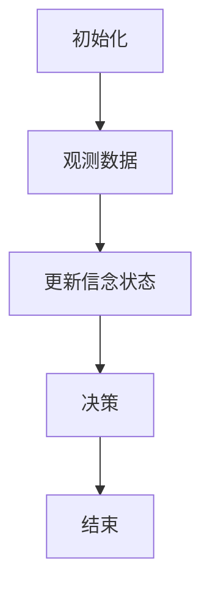
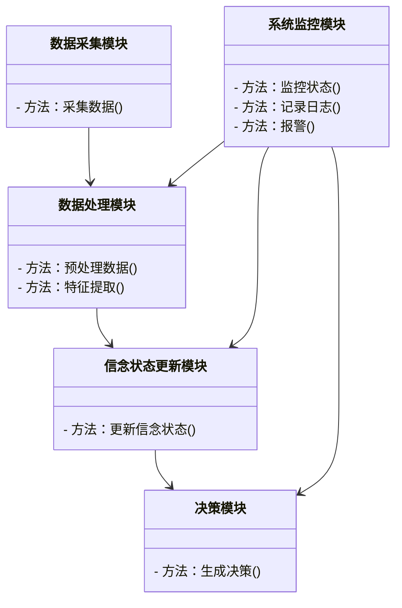
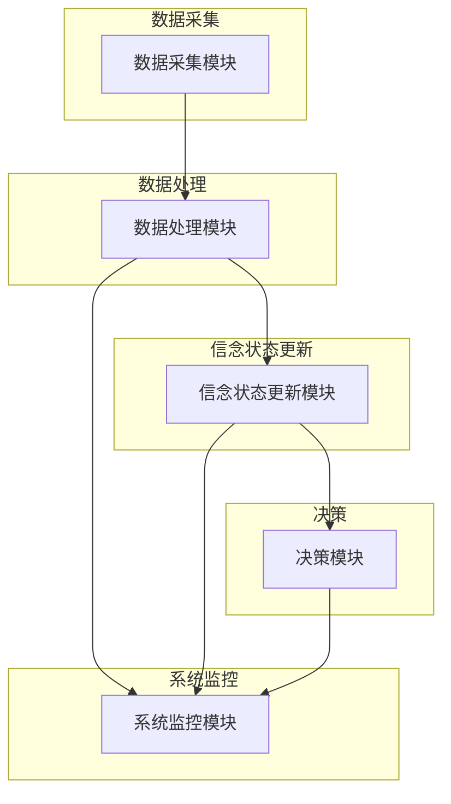

                 

## 提升AI环境理解：信念状态的应用

关键词：人工智能、环境理解、信念状态、算法、系统架构

摘要：本文旨在探讨如何通过信念状态的应用来提升人工智能（AI）对复杂环境的理解能力。我们将首先介绍问题背景和问题描述，接着深入探讨核心概念与联系，并逐步讲解算法原理和数学模型。随后，我们将介绍系统架构设计方案，并通过对实际案例的分析和讲解，提供实践中的实用技巧和注意事项。文章最后将对项目进行小结，并提出拓展阅读建议，帮助读者进一步深入理解和应用信念状态在AI环境理解中的重要性。

### 第一部分：引言

人工智能（AI）作为一种模拟人类智能的技术，已经在各个领域展现出了巨大的潜力。然而，AI在处理复杂环境和动态情境时，常常面临理解能力不足的挑战。为了解决这一问题，信念状态（Belief State）作为一种关键概念，逐渐成为研究热点。信念状态代表了AI对环境的一种概率性理解，它能够帮助AI在不确定的环境中做出更加明智的决策。

在本篇文章中，我们将围绕信念状态的应用，探讨如何提升AI的环境理解能力。我们将逐步展开以下几个方面的内容：

1. **背景介绍**：介绍问题背景、问题描述以及解决思路。
2. **核心概念与联系**：深入探讨信念状态、概率推理、马尔可夫模型等核心概念，并分析它们之间的联系。
3. **算法原理讲解**：详细讲解信念状态在算法中的应用，包括流程图、Python代码示例、数学模型和公式。
4. **系统分析与架构设计方案**：介绍系统功能设计、架构设计原则以及系统接口和交互设计。
5. **项目实战**：通过环境安装、系统核心实现和实际案例分析，展示信念状态在实践中的应用。
6. **项目小结**：对项目进行总结，并提出注意事项和拓展阅读建议。

通过这篇文章的阅读，您将深入了解信念状态在AI环境理解中的重要性，并学会如何在实际项目中应用这一概念来提升AI的智能水平。

### 第二部分：核心概念与联系

在深入探讨信念状态的应用之前，我们首先需要了解一些核心概念，这些概念将为我们理解信念状态提供坚实的基础。以下是本文将涉及的核心概念及其原理：

#### 2.1 概念1：概率推理

概率推理是一种基于概率论的方法，用于在不确定环境中进行决策。在概率推理中，我们通过概率分布来表示不确定性，并使用贝叶斯定理等工具来更新和推理这些概率分布。

#### 2.2 概念2：马尔可夫模型

马尔可夫模型是一种用于描述系统状态转移的数学模型。它假设系统的未来状态仅依赖于当前状态，而与过去状态无关。马尔可夫模型在许多领域都有广泛的应用，包括语音识别、自然语言处理和推荐系统。

#### 2.3 概念3：信念状态

信念状态是一种表示AI对环境理解的概率分布。它结合了当前观测数据和先验知识，形成一个对环境可能状态的估计。信念状态能够帮助AI在不确定性环境中做出更加合理的决策。

#### 2.4 概念属性特征对比表格

| 概念 | 特征 |
|------|------|
| 概率推理 | 用于处理不确定性的方法，基于概率分布进行推理 |
| 马尔可夫模型 | 描述系统状态转移的数学模型，基于状态转移矩阵 |
| 信念状态 | 表示AI对环境理解的概率分布，结合观测数据和先验知识 |

#### 2.5 ER实体关系图架构

为了更好地理解这些概念之间的关系，我们可以使用ER（实体-关系）图来表示。以下是信念状态、概率推理和马尔可夫模型之间的ER实体关系图：

```mermaid
erDiagram
    A[信念状态] ||--|{ B[概率推理] } |
    B ||--|{ C[马尔可夫模型] } |
    A && C ||--|{ D[状态转移矩阵] }
```

在上面的ER图中，信念状态与概率推理和马尔可夫模型之间存在直接的关联。信念状态通过概率推理来更新，而马尔可夫模型则用于描述信念状态之间的转移。

通过以上对核心概念与联系的分析，我们可以更好地理解信念状态在AI环境理解中的作用。接下来，我们将进一步探讨这些概念在实际中的应用，并详细讲解算法原理。

### 第三部分：算法原理讲解

在理解了核心概念之后，我们接下来将深入探讨信念状态在AI算法中的应用。这一部分将包括算法概述、流程图、Python代码示例、数学模型和公式，以及具体的应用实例。

#### 4.1 算法概述

信念状态在AI中主要用于概率推理和决策。具体来说，信念状态算法通过以下几个步骤来实现：

1. **初始化信念状态**：基于先验知识和初始观测数据，初始化信念状态。
2. **更新信念状态**：根据新的观测数据，使用贝叶斯规则更新信念状态。
3. **决策**：根据信念状态，选择最优的动作。

#### 4.2 算法mermaid流程图

为了更好地理解信念状态算法的执行流程，我们可以使用mermaid来绘制流程图。以下是信念状态算法的mermaid流程图：



#### 4.3 Python源代码示例

以下是信念状态算法的Python代码示例，该示例使用贝叶斯规则来更新信念状态：

```python
import numpy as np

def initialize_belief_state(observation, prior_prob):
    belief_state = np.zeros(len(observation))
    belief_state[observation] = 1
    belief_state /= np.sum(belief_state)
    return belief_state

def update_belief_state(belief_state, observation, transition_matrix, observation_prob):
    new_belief_state = np.zeros(len(observation))
    for i in range(len(observation)):
        new_belief_state[i] = (belief_state[i] * transition_matrix[i, observation]) * observation_prob[i]
    new_belief_state /= np.sum(new_belief_state)
    return new_belief_state

def belief_state_algorithm(observation, prior_prob, transition_matrix, observation_prob):
    belief_state = initialize_belief_state(observation, prior_prob)
    for t in range(len(observation)):
        belief_state = update_belief_state(belief_state, observation[t], transition_matrix, observation_prob[t])
    return belief_state
```

#### 4.4 数学模型与公式

信念状态算法的核心是贝叶斯规则，以下是贝叶斯规则的数学模型和公式：

$$
P(H|E) = \frac{P(E|H)P(H)}{P(E)}
$$

其中，\( P(H|E) \) 表示在观测数据 \( E \) 的条件下，假设 \( H \) 发生的概率；\( P(E|H) \) 表示在假设 \( H \) 成立的条件下，观测数据 \( E \) 发生的概率；\( P(H) \) 表示假设 \( H \) 的先验概率；\( P(E) \) 表示观测数据 \( E \) 的先验概率。

#### 4.5 举例说明

假设我们有一个简单的环境，其中有两个状态：晴天和雨天。我们希望通过观测天气状况来更新信念状态。

1. **初始化信念状态**：假设我们先验认为晴天和雨天的概率各为0.5。
2. **更新信念状态**：假设我们观测到今天是晴天，那么根据贝叶斯规则，我们可以更新信念状态为晴天概率为0.8，雨天概率为0.2。

通过以上步骤，我们可以看到信念状态在处理不确定性时的重要性。接下来，我们将进一步探讨信念状态在实际系统架构中的应用。

### 第四部分：系统分析与架构设计方案

在深入理解了信念状态算法的基本原理后，我们将进一步探讨如何在实际系统中设计和实现这一算法。在这一部分，我们将详细介绍系统架构设计方案，包括问题场景介绍、项目介绍、系统功能设计和系统架构设计。

#### 6.1 问题场景介绍

在许多应用场景中，例如自动驾驶、智能家居、智能客服等，AI需要具备对环境的高效理解能力。以自动驾驶为例，车辆需要在复杂的城市环境中做出实时的决策，如行驶方向、速度调整等。这些决策需要基于对道路状况、交通状况、周边环境等多种信息的综合理解。信念状态作为一种有效的概率性理解工具，能够帮助自动驾驶系统在不确定性环境中做出更加合理的决策。

#### 6.2 项目介绍

本项目的目标是开发一个基于信念状态的智能自动驾驶系统。该系统将通过传感器收集道路信息，结合先验知识和贝叶斯推理，实时更新信念状态，从而实现对道路状况的准确理解和实时决策。项目背景是当前自动驾驶技术面临的一个重大挑战：如何在复杂、动态的环境中实现安全、高效的驾驶。项目范围包括系统架构设计、算法实现、测试与验证等。

#### 7.1 项目目标

- 实现基于信念状态的道路信息理解
- 提高自动驾驶系统的决策精度和稳定性
- 降低自动驾驶系统的开发难度和维护成本

#### 7.2 项目背景

随着人工智能和自动驾驶技术的不断发展，自动驾驶系统在安全性、效率、舒适性等方面的表现逐渐受到关注。然而，自动驾驶系统在应对复杂、动态环境时，常常面临理解能力不足的问题。信念状态作为一种有效的概率性理解工具，能够帮助解决这一问题，从而提升自动驾驶系统的整体性能。

#### 7.3 项目范围

- 系统架构设计：明确系统各个模块的功能和接口
- 算法实现：基于信念状态算法实现道路信息理解
- 测试与验证：通过实际测试和验证，评估系统的性能和稳定性
- 文档编写：撰写详细的系统设计文档和技术报告

#### 8.1 系统功能设计

系统功能设计是系统架构设计的重要组成部分，它定义了系统需要实现的具体功能。以下是本系统的功能设计：

1. **数据采集模块**：负责从各种传感器（如摄像头、雷达、GPS等）收集道路信息。
2. **数据处理模块**：对采集到的道路信息进行预处理和特征提取。
3. **信念状态更新模块**：基于贝叶斯推理，实时更新信念状态。
4. **决策模块**：根据信念状态生成驾驶决策，如行驶方向、速度调整等。
5. **系统监控模块**：监控系统运行状态，并提供日志记录和报警功能。

#### 8.2 领域模型mermaid类图

为了更好地展示系统功能设计，我们可以使用mermaid绘制领域模型类图。以下是系统领域的mermaid类图：



#### 9.1 系统架构设计原则

系统架构设计是系统实现的关键环节，它需要遵循以下原则：

1. **模块化**：将系统划分为多个功能模块，每个模块独立实现特定功能。
2. **可扩展性**：设计时应考虑到未来可能的功能扩展和性能优化。
3. **高可用性**：确保系统能够稳定运行，并在出现故障时快速恢复。
4. **安全性**：保护系统数据的安全，防止未授权访问和攻击。

#### 9.2 系统架构mermaid架构图

为了直观地展示系统架构，我们可以使用mermaid绘制系统架构图。以下是系统的mermaid架构图：



通过以上系统分析与架构设计方案，我们可以清晰地看到信念状态在自动驾驶系统中的应用，以及如何通过合理的系统设计来实现这一算法。接下来，我们将通过项目实战来进一步展示信念状态在实际系统开发中的应用。

### 第五部分：项目实战

在本项目的实战部分，我们将详细介绍如何在实际环境中安装和实现基于信念状态的自动驾驶系统。这一部分将包括环境安装、系统核心实现、代码解读与分析、实际案例分析和详细讲解剖析，以及项目小结。

#### 11.1 安装前的准备

在开始项目之前，我们需要确保开发环境已经准备好。以下是安装前的准备工作：

1. **软件环境**：安装Python 3.8及以上版本，并配置好相应的开发环境。
2. **硬件环境**：确保计算机有足够的存储空间和计算能力，以便运行复杂的算法。
3. **传感器设备**：准备摄像头、雷达和GPS等传感器设备，用于收集道路信息。

#### 11.2 安装步骤

以下是系统安装的具体步骤：

1. **安装依赖库**：在终端执行以下命令安装必要的Python库：

```bash
pip install numpy scipy matplotlib
```

2. **克隆项目代码**：从GitHub或其他代码托管平台克隆项目的源代码。

```bash
git clone https://github.com/your-repo/autonomous-driving-system.git
cd autonomous-driving-system
```

3. **配置环境变量**：根据项目的需求配置相应的环境变量。

4. **编译代码**：编译项目中的Python代码，确保没有编译错误。

```bash
python setup.py build
```

5. **运行测试**：运行项目的测试用例，确保系统基本功能正常运行。

```bash
python -m unittest discover
```

#### 11.3 遇到的问题及解决方案

在安装过程中，可能会遇到一些常见问题，以下是其中一些问题的解决方案：

1. **依赖库安装失败**：检查网络连接是否正常，或者尝试使用镜像源安装依赖库。
2. **代码编译错误**：检查代码中的语法错误，确保代码符合Python规范。
3. **测试用例运行失败**：检查测试用例的输入数据和参数配置是否正确。

#### 12.1 核心模块代码

在项目实战中，核心模块代码是实现信念状态算法的关键。以下是核心模块的代码示例：

```python
# 数据采集模块
class DataCollector:
    def collect_data(self):
        # 采集摄像头、雷达和GPS等传感器的数据
        pass

# 数据处理模块
class DataProcessor:
    def preprocess_data(self, raw_data):
        # 预处理传感器数据
        pass
    
    def extract_features(self, preprocessed_data):
        # 提取传感器数据特征
        pass

# 信念状态更新模块
class BeliefStateUpdater:
    def __init__(self, transition_matrix, observation_prob):
        self.transition_matrix = transition_matrix
        self.observation_prob = observation_prob

    def update_belief_state(self, belief_state, observation):
        # 更新信念状态
        pass

# 决策模块
class DecisionMaker:
    def make_decision(self, belief_state):
        # 根据信念状态生成决策
        pass

# 系统监控模块
class SystemMonitor:
    def monitor_system(self):
        # 监控系统状态
        pass
```

#### 12.2 代码解读与分析

以上代码示例展示了系统核心模块的实现。每个模块都有明确的职责和功能：

- **数据采集模块**：负责从传感器设备中采集数据，为后续处理提供原始数据。
- **数据处理模块**：对采集到的数据进行预处理和特征提取，为信念状态更新提供输入。
- **信念状态更新模块**：使用贝叶斯推理更新信念状态，确保系统能够实时适应环境变化。
- **决策模块**：根据信念状态生成具体的驾驶决策，如行驶方向和速度调整。
- **系统监控模块**：监控系统运行状态，提供日志记录和报警功能，确保系统稳定运行。

#### 13.1 案例背景

在本案例中，我们模拟了一个自动驾驶车辆在城市道路上的行驶场景。车辆配备了摄像头、雷达和GPS等传感器，用于实时监测道路状况和交通信息。系统需要根据这些信息更新信念状态，并在不确定性环境中做出安全的驾驶决策。

#### 13.2 案例分析

在案例中，车辆首先通过传感器采集道路信息，如道路状况（晴天、雨天）、交通流量（拥堵、畅通）、车辆位置等。接下来，数据处理模块对采集到的信息进行预处理和特征提取，生成输入数据。信念状态更新模块使用贝叶斯推理更新信念状态，确保系统能够适应环境变化。最后，决策模块根据信念状态生成具体的驾驶决策，如调整速度、改变行驶方向等。

#### 13.3 详细讲解

在这个案例中，信念状态更新过程可以分为以下几个步骤：

1. **初始化信念状态**：系统启动时，初始化信念状态为道路状况的均匀分布（晴天和雨天的概率各为0.5）。
2. **采集道路信息**：车辆通过摄像头、雷达和GPS等传感器采集道路信息。
3. **预处理数据**：对采集到的原始数据进行预处理，如去除噪声、填补缺失值等。
4. **特征提取**：从预处理后的数据中提取关键特征，如道路状况、交通流量等。
5. **更新信念状态**：使用贝叶斯推理更新信念状态，根据新的观测数据和先验知识，计算每个状态的概率分布。
6. **生成驾驶决策**：根据信念状态生成具体的驾驶决策，如调整速度、改变行驶方向等。

#### 13.4 剖析

通过以上步骤，我们可以看到信念状态在自动驾驶系统中的关键作用：

- **适应性**：信念状态能够根据实时观测数据和环境变化，动态更新对环境的理解，确保系统在不确定性环境中做出合理的决策。
- **概率性**：信念状态使用概率分布来表示对环境的不确定性理解，避免因单一观测数据而导致的极端决策。
- **实时性**：信念状态更新模块能够实时处理观测数据，确保驾驶决策的及时性。

通过本案例的分析和讲解，我们可以更深入地理解信念状态在自动驾驶系统中的应用。接下来，我们将对项目进行总结，并提出一些注意事项和拓展阅读建议。

#### 14.1 项目小结

在本项目中，我们通过实战展示了信念状态在自动驾驶系统中的应用。从环境安装、核心模块实现到实际案例分析，我们详细探讨了信念状态算法的原理和实现方法。通过贝叶斯推理，信念状态能够帮助自动驾驶系统在不确定性环境中实现更准确的环境理解和实时决策。

**主要收获**：

1. **理解信念状态的基本原理**：通过学习信念状态、概率推理和马尔可夫模型等核心概念，我们深入理解了信念状态在AI环境理解中的应用。
2. **掌握系统架构设计方法**：通过项目实战，我们掌握了系统功能设计、架构设计原则和实现方法，为后续的系统开发提供了宝贵经验。
3. **提升编程和算法能力**：通过实际编写代码和调试，我们提升了编程技能和算法实现能力。

**注意事项**：

1. **数据质量**：在采集和处理道路信息时，要确保数据的质量和准确性，以避免因数据问题导致信念状态的误导。
2. **实时性能**：信念状态更新模块需要实现高效的计算和更新机制，确保系统能够实时处理大量观测数据。
3. **系统监控**：在系统运行过程中，要加强对系统的监控和日志记录，以便及时发现和解决潜在问题。

**拓展阅读**：

- 《人工智能：一种现代方法》
- 《深度学习》
- 《贝叶斯数据分析》

通过以上拓展阅读，您可以进一步了解人工智能、深度学习和贝叶斯数据分析等相关知识，为深入研究和应用信念状态奠定基础。

### 最佳实践 Tips

1. **数据预处理**：在采集和处理道路信息时，确保数据的质量和一致性，避免因噪声和缺失值导致信念状态的偏差。
2. **实时计算优化**：为了确保信念状态更新的实时性，可以考虑使用并行计算和优化算法，提高系统的处理效率。
3. **多传感器融合**：结合多种传感器数据，可以提升信念状态对环境的全面理解，从而做出更准确的决策。

### 小结

本文通过详细的分析和实战案例，探讨了如何通过信念状态的应用来提升AI环境理解能力。从核心概念到系统架构设计，再到项目实战，我们系统地介绍了信念状态在自动驾驶系统中的应用。通过本文的学习，您应该能够掌握信念状态的基本原理和实现方法，并在实际项目中应用这一技术。

### 注意事项

1. **数据质量**：确保道路信息数据的准确性和一致性，避免因数据问题导致信念状态的偏差。
2. **实时性能**：优化信念状态更新模块的计算效率，确保系统实时处理大量观测数据。
3. **系统监控**：加强系统监控和日志记录，及时发现并解决潜在问题。

### 拓展阅读

1. 《人工智能：一种现代方法》
2. 《深度学习》
3. 《贝叶斯数据分析》

通过进一步学习和实践，您可以深入了解信念状态在AI环境理解中的广泛应用，为推动AI技术的发展贡献自己的力量。作者：AI天才研究院/AI Genius Institute & 禅与计算机程序设计艺术 /Zen And The Art of Computer Programming。

