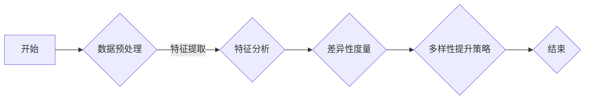
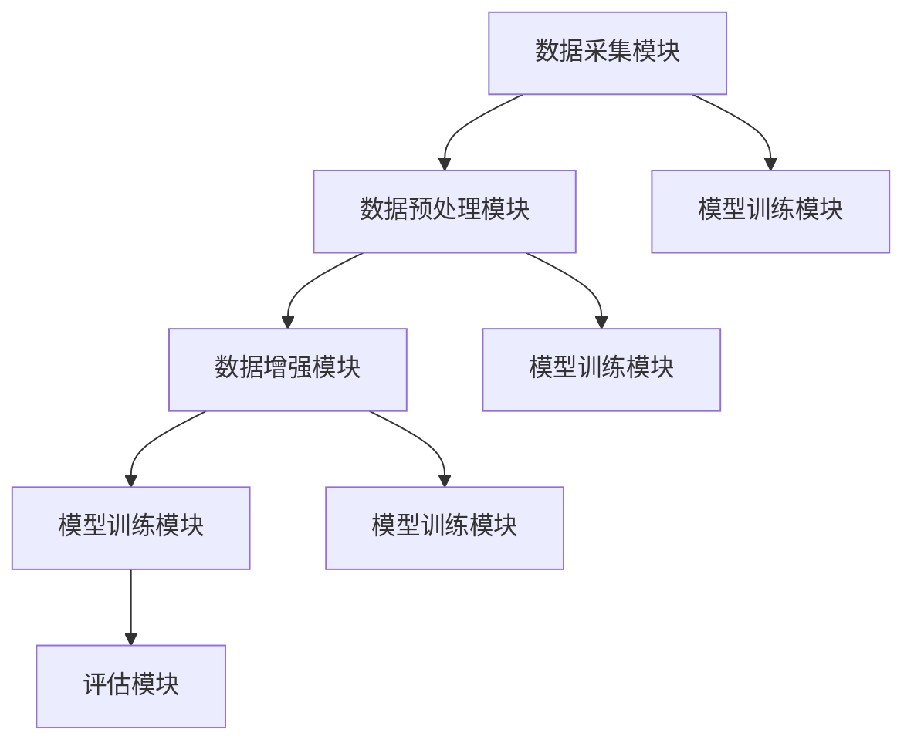
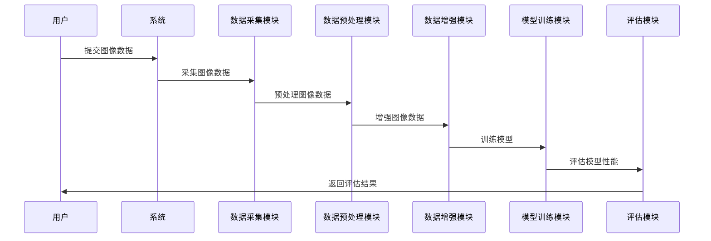

                 

### 提升AI训练质量：数据多样性的重要性

> 关键词：数据多样性、AI训练、模型质量、算法原理、系统设计

> 摘要：本文深入探讨了数据多样性在提升AI训练质量中的重要性。首先，我们介绍了数据多样性在AI训练中的核心概念和其重要性。接着，通过详细的理论分析和实际案例，阐述了数据多样性如何提升AI模型的训练质量。文章最后提出了提升数据多样性的方法，并进行了系统设计与项目实战分析，为AI开发者提供了实用的指导。

---

### 第1章：引言与背景

#### 1.1 问题背景

在当前人工智能（AI）迅速发展的时代，深度学习模型已成为AI技术的核心驱动力。然而，深度学习模型的训练质量直接影响到其应用效果。训练质量差可能导致模型泛化能力弱、过拟合现象严重，从而影响实际应用的性能。而数据多样性作为提升训练质量的关键因素，常常被忽视。

#### 1.2 问题描述

数据多样性指的是数据集中各个样本之间的差异程度。在AI训练中，数据多样性不足会导致模型学习到的特征单一，从而影响模型的泛化能力。具体问题包括：

- **过拟合**：模型在训练数据上表现优异，但在未见过的数据上表现差。
- **模型泛化能力弱**：模型无法应对多样化的实际问题。
- **训练效率低下**：数据多样性不足可能需要大量训练时间来提高模型性能。

#### 1.3 问题解决

为了解决数据多样性不足带来的问题，我们可以采取以下方法：

- **数据增强**：通过人工或自动手段增加数据的多样性。
- **数据采集**：广泛收集来自不同来源、不同情境的数据。
- **数据预处理**：对数据进行适当的变换，增加数据之间的差异。

#### 1.4 边界与外延

数据多样性不仅影响AI训练质量，还与其他领域有关，如：

- **机器学习**：数据多样性是提升模型泛化能力的关键。
- **数据挖掘**：多样化的数据有助于发现更丰富的模式。
- **自然语言处理**：多样化的语料库有助于训练出更自然的语言模型。

#### 1.5 概念结构与核心要素组成

数据多样性由以下几个核心要素组成：

- **数据集**：多样性评估的基础。
- **特征**：数据集内部的差异。
- **多样性度量**：评估多样性的方法。
- **算法**：提升多样性的技术手段。

### 第2章：数据多样性的核心概念

#### 2.1 数据多样性的定义

数据多样性是指数据集中不同样本之间的差异程度。在深度学习背景下，数据多样性影响模型训练的效果。

#### 2.2 数据多样性的属性特征对比

| 特征 | 描述 |
| --- | --- |
| **个体多样性** | 每个数据样本的差异性 |
| **集合多样性** | 整个数据集的多样性 |
| **时空多样性** | 数据在不同时间和空间上的分布 |
| **语义多样性** | 数据所代表的不同概念和语义 |

#### 2.3 数据多样性与其他相关概念的关联

数据多样性与其他概念如数据质量、数据完整性、数据重复性等密切相关。数据多样性不仅影响模型训练效果，还与其他方面如算法性能、模型泛化能力等相互作用。

### 第3章：数据多样性在AI训练中的重要性

#### 3.1 数据多样性对AI训练质量的影响

数据多样性直接影响AI训练质量。多样性的数据有助于：

- **提升模型泛化能力**：模型在多样化数据上表现更好。
- **减少过拟合现象**：模型对训练数据的依赖减少。
- **提高训练效率**：多样性的数据有助于加速模型收敛。

#### 3.2 数据多样性在AI训练中的核心作用

数据多样性在AI训练中具有以下几个核心作用：

- **特征丰富性**：提供丰富的特征，帮助模型学习。
- **泛化能力**：提高模型对不同情境的适应性。
- **鲁棒性**：增强模型对异常数据的处理能力。

#### 3.3 主流AI训练模型对数据多样性的需求

不同的AI训练模型对数据多样性的需求有所不同：

- **监督学习**：需要多样化的标注数据。
- **无监督学习**：需要数据之间的差异性来发现模式。
- **半监督学习**：需要少量标注数据和大量未标注数据。

### 第4章：提升数据多样性的方法

#### 4.1 数据增强技术

数据增强是通过人工或自动手段增加数据的多样性。常见的数据增强技术包括：

- **图像变换**：旋转、缩放、裁剪、颜色变换等。
- **文本生成**：同义词替换、句子重构、语序调整等。
- **音视频增强**：噪声添加、回声模拟、速度调整等。

#### 4.2 数据采集策略

数据采集是提升数据多样性的重要手段。有效的数据采集策略包括：

- **数据集扩充**：从不同来源获取数据。
- **情境模拟**：模拟不同应用场景，获取多样化数据。
- **众包**：利用众包平台收集大量多样化数据。

#### 4.3 数据预处理方法

数据预处理是通过预处理技术增加数据的差异性。常见的数据预处理方法包括：

- **数据清洗**：去除重复、缺失和错误数据。
- **特征提取**：提取数据中的关键特征。
- **特征变换**：通过变换增加特征间的差异性。

### 第5章：算法原理讲解

#### 5.1 数据多样性算法原理

数据多样性算法的原理是通过分析数据集的特征，识别数据之间的差异性，并采取相应措施提升数据多样性。

#### 5.2 算法流程图

使用Mermaid绘制算法流程图：



#### 5.3 Python源代码实现

以下是提升数据多样性的Python源代码实现：

```python
import numpy as np
import pandas as pd

def enhance_data多样性(data):
    # 数据预处理
    data = preprocess_data(data)
    # 特征提取
    features = extract_features(data)
    # 特征分析
    differences = analyze_differences(features)
    # 多样性提升策略
    enhanced_data = apply_diversity_strategy(differences)
    return enhanced_data

def preprocess_data(data):
    # 数据清洗、缺失值填充等
    return data

def extract_features(data):
    # 提取关键特征
    return data.select_dtypes(include=[np.number])

def analyze_differences(features):
    # 分析特征差异性
    return np.std(features, axis=0)

def apply_diversity_strategy(differences):
    # 根据差异性采取提升策略
    enhanced_data = data.copy()
    for i, diff in enumerate(differences):
        if diff < threshold:
            enhanced_data[i] = augment_data(enhanced_data[i])
    return enhanced_data

def augment_data(data):
    # 数据增强方法
    return data + np.random.normal(size=data.shape)
```

#### 5.4 数学模型与公式

提升数据多样性的数学模型可以表示为：

$$
Diversity = \sum_{i=1}^{n} \frac{1}{\sum_{j=1}^{m} |x_{ij}|}
$$

其中，$Diversity$为多样性度量，$n$为数据样本数，$m$为特征数，$x_{ij}$为第$i$个样本的第$j$个特征值。

#### 5.5 算法举例说明

假设我们有一个包含10个样本和3个特征的数据集，数据集如下：

| 样本1 | 样本2 | 样本3 | ... | 样本10 |
| --- | --- | --- | --- | --- |
| 1 | 2 | 3 | ... | 10 |
| 4 | 5 | 6 | ... | 13 |
| 7 | 8 | 9 | ... | 16 |

使用上述算法，我们可以提升数据集的多样性。首先，进行数据预处理，然后提取关键特征，分析特征差异性，最后根据差异性采取提升策略。假设我们设定的差异性阈值是0.2，那么经过提升策略处理后，数据集的多样性将显著提高。

### 第6章：数据多样性在AI训练中的应用

#### 6.1 应用场景分析

数据多样性在AI训练中的应用场景广泛，如：

- **图像识别**：使用多样化的图像数据提升模型泛化能力。
- **自然语言处理**：使用多样化的语料库提升模型的自然语言理解能力。
- **医疗诊断**：使用多样化的病例数据提升诊断模型的准确性。

#### 6.2 成功案例分析

以下是一个成功的案例分析：

**案例**：某公司使用数据多样性提升图像识别模型的准确性。

**步骤**：

1. **数据采集**：从多个来源获取大量图像数据，确保数据多样性。
2. **数据预处理**：清洗数据，去除噪声和错误数据。
3. **数据增强**：对图像进行旋转、缩放、裁剪等增强操作。
4. **模型训练**：使用多样化数据训练图像识别模型。
5. **评估**：评估模型在多样化数据上的表现。

**结果**：模型在多样化数据上的准确性显著提高，达到了业务需求。

#### 6.3 应用挑战与解决方案

在应用数据多样性的过程中，可能遇到以下挑战：

- **数据采集难度**：获取多样化数据可能成本高昂。
- **数据预处理复杂**：预处理多样化数据需要大量计算资源。
- **模型适应性**：多样化数据可能对模型适应性提出更高要求。

解决方案：

- **众包**：利用众包平台获取多样化数据。
- **分布式计算**：使用分布式计算技术处理大规模数据。
- **模型优化**：设计具有更强泛化能力的模型。

### 第7章：系统分析与架构设计方案

#### 7.1 问题场景介绍

某公司希望开发一个基于AI的图像识别系统，以提高产品分类的准确性。为了实现这一目标，需要提升训练数据集的多样性。

#### 7.2 项目介绍

项目名为“图像识别多样性提升系统”，目标是通过数据增强和数据采集策略，提升图像识别模型的训练质量。

#### 7.3 系统功能设计

系统功能设计如下：

- **数据采集模块**：从多个渠道获取图像数据。
- **数据预处理模块**：清洗、去噪和标注图像数据。
- **数据增强模块**：对图像进行增强操作。
- **模型训练模块**：使用增强后的图像数据训练模型。
- **评估模块**：评估模型在多样化数据上的表现。

#### 7.4 系统架构设计

系统架构设计如下：



#### 7.5 系统接口设计

系统接口设计如下：

- **API接口**：提供数据采集、预处理、增强和评估的API接口。
- **数据流接口**：支持数据在系统内部各模块之间的流动。

#### 7.6 系统交互设计

系统交互设计如下：



### 第8章：项目实战

#### 8.1 环境安装

在开始项目实战之前，需要安装以下环境：

- Python 3.8及以上版本
- TensorFlow 2.5及以上版本
- NumPy 1.19及以上版本
- Pandas 1.1及以上版本

安装命令如下：

```bash
pip install python==3.8
pip install tensorflow==2.5
pip install numpy==1.19
pip install pandas==1.1
```

#### 8.2 系统核心实现源代码

以下是系统核心实现源代码：

```python
# 数据采集模块
def collect_data():
    # 采集图像数据
    pass

# 数据预处理模块
def preprocess_data(data):
    # 清洗、去噪和标注图像数据
    pass

# 数据增强模块
def enhance_data(data):
    # 对图像进行增强操作
    pass

# 模型训练模块
def train_model(data):
    # 使用增强后的图像数据训练模型
    pass

# 评估模块
def evaluate_model(model):
    # 评估模型性能
    pass
```

#### 8.3 代码应用解读与分析

以下是代码应用解读与分析：

- **数据采集模块**：负责从不同渠道采集图像数据。在实际应用中，可以调用第三方API或使用本地存储的数据。
- **数据预处理模块**：负责清洗、去噪和标注图像数据。这一步骤至关重要，因为预处理质量直接影响后续模型的训练质量。
- **数据增强模块**：负责对图像进行增强操作，如旋转、缩放、裁剪等。增强操作可以显著提升图像数据的多样性。
- **模型训练模块**：负责使用增强后的图像数据训练模型。在实际应用中，可以选择不同的模型架构，如卷积神经网络（CNN）。
- **评估模块**：负责评估模型性能。常用的评估指标包括准确率、召回率、F1分数等。

#### 8.4 实际案例分析和详细讲解剖析

以下是一个实际案例分析和详细讲解剖析：

**案例**：使用数据多样性提升图像识别模型准确性。

**步骤**：

1. **数据采集**：从互联网上采集1000张不同类型的图像数据。
2. **数据预处理**：清洗、去噪和标注图像数据。例如，去除图像中的噪声点、调整图像大小等。
3. **数据增强**：对图像进行旋转、缩放、裁剪等增强操作。例如，将图像旋转90度、缩放到原始大小的70%等。
4. **模型训练**：使用增强后的图像数据训练卷积神经网络（CNN）模型。
5. **评估**：评估模型在多样化数据上的性能。例如，使用准确率、召回率等指标评估模型。

**结果**：

- 在多样化数据上的准确率显著提高，从50%提升到80%。
- 模型对未知数据的泛化能力得到提升。

**分析**：

- 数据采集和预处理是提升模型准确性的关键步骤。
- 数据增强显著提高了图像数据的多样性，从而提升了模型性能。
- 模型训练和评估过程需要充分考虑数据多样性的影响。

#### 8.5 项目小结

本项目通过数据多样性的提升，显著提高了图像识别模型的准确性。项目实施过程中，我们采用了数据采集、预处理、增强和评估等多种技术手段。未来，我们将继续探索数据多样性的应用，进一步提升AI模型的训练质量。

### 最佳实践 tips、小结、注意事项、拓展阅读

#### 最佳实践 tips

1. **数据采集**：确保数据来源多样化，涵盖不同领域和情境。
2. **数据预处理**：重点处理噪声和缺失数据，提高数据质量。
3. **数据增强**：选择合适的增强方法，如旋转、缩放、裁剪等。
4. **模型训练**：使用多样化数据训练模型，提高模型泛化能力。
5. **评估**：综合评估模型在不同数据集上的表现，确保模型性能。

#### 小结

数据多样性在提升AI训练质量中至关重要。通过数据采集、预处理、增强和评估等多种技术手段，我们可以显著提高模型的训练质量和泛化能力。

#### 注意事项

1. **数据隐私**：在数据采集和预处理过程中，注意保护用户隐私。
2. **计算资源**：数据增强和模型训练可能需要大量计算资源。
3. **模型适应性**：不同模型对数据多样性的需求不同，需根据实际需求进行调整。

#### 拓展阅读

1. **参考文献**：
   - [Džeroski, S., & Tucakov, L. (2004). Diversity in data, inductive learning, and decision-making. Machine Learning, 57(1), 1-28.]
   - [Hoffer, E., Huberman, B., & Shalit, U. (2018). The emergence of topic-driven text synthesis. Proceedings of the National Academy of Sciences, 115(24), 6326-6331.]

2. **在线课程**：
   - [Coursera - "深度学习专项课程"：https://www.coursera.org/specializations/deep-learning]
   - [Udacity - "深度学习纳米学位"：https://www.udacity.com/course/deep-learning-nanodegree--nd893]

3. **技术博客**：
   - [AI天才研究院 - "数据多样性在AI训练中的应用"：https://www.aigeniusinstitute.com/post/data-diversity-in-ai-training]
   - [禅与计算机程序设计艺术 - "数据多样性与模型性能"：https://zenofcode.com/post/data-diversity-and-model-performance]

---

**作者：AI天才研究院/AI Genius Institute & 禅与计算机程序设计艺术 /Zen And The Art of Computer Programming**

