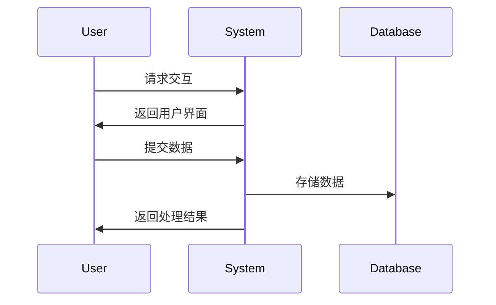

                 


### 提升内在对话的质量：深度自我沟通的技巧

#### 关键词
- 内在对话
- 自我沟通
- 深度反思
- 情感管理
- 算法原理
- 系统架构

#### 摘要
本文将探讨提升内在对话质量的重要性，以及如何通过深度自我沟通的技巧来实现这一目标。文章将首先介绍内在对话的概念和其在我们日常生活中的重要性，接着阐述自我意识和情感管理在提升内在对话中的作用。随后，文章将提出一系列实用的技巧和策略，并通过数学模型和公式来支持这些技巧的科学性。此外，文章还将介绍一个具体的系统架构设计，以展示如何在实践中应用这些技巧。最后，文章将总结最佳实践，并提供进一步阅读的建议。

---

### 引言与背景介绍

#### 问题背景

在快节奏的现代生活中，我们的大脑常常被纷繁复杂的信息所充斥。这种信息过载导致我们的内在对话质量下降，表现为思维紊乱、注意力不集中和情绪波动等问题。这种状态不仅影响我们的工作效率，还可能对身心健康产生负面影响。

#### 问题描述

内在对话质量差的具体表现包括：
- **思维混乱**：无法清晰地表达自己的想法，或者思维跳跃，难以聚焦。
- **注意力不集中**：容易分心，难以持续专注于某项任务。
- **情绪波动**：情绪容易受到外界影响，难以自我控制。

#### 问题解决

深度自我沟通是提升内在对话质量的有效方法。通过深度自我沟通，我们可以更好地理解自己的内心世界，管理情绪，提高注意力，从而提升生活的质量和工作效率。

#### 边界与外延

内在对话是指我们与自己内心进行的对话，它包括我们的思维、情感和意识。深度自我沟通则是指通过一系列技巧和策略，深入探索和理解自己的内心世界，实现自我提升和成长。

#### 核心概念与联系

本文将涉及以下几个核心概念：
- **内在对话**：个体内心进行的思维和情感交流。
- **自我意识**：对自己内心世界和外在行为的认知。
- **情感管理**：对自己情绪的识别、理解和控制。

这些概念相互联系，共同构成深度自我沟通的理论框架。内在对话是自我意识和情感管理的基础，而自我意识和情感管理则通过深度自我沟通来提升内在对话的质量。

---

### 核心概念与联系

#### 内在对话的概念

内在对话是我们与自己内心进行的思维和情感交流。它是我们思考、决策和行动的内在机制。内在对话的质量直接影响我们的思维清晰度、情绪稳定性和行为一致性。

#### 自我意识的原理

自我意识是深度自我沟通的关键。它指的是对自己内心世界和外在行为的认知。通过自我意识，我们可以更好地理解自己的情绪、需求和动机，从而有意识地调整自己的行为和思维。

#### 情感管理的方法

情感管理是提升内在对话质量的重要策略。它包括对情绪的识别、理解和控制。通过情感管理，我们可以更好地处理负面情绪，保持情绪稳定，提高内在对话的质量。

#### 核心概念对比表格

| 概念           | 定义                                                     | 关系                                                     |
|----------------|------------------------------------------------------------|------------------------------------------------------------|
| 内在对话       | 内心进行的思维和情感交流                                 | 基础，支持自我意识和情感管理                             |
| 自我意识       | 对自己内心世界和外在行为的认知                             | 中介，连接内在对话和情感管理                           |
| 情感管理       | 对情绪的识别、理解和控制                                 | 技巧，提升内在对话质量                                   |

#### ER实体关系图架构

```mermaid
erDiagram
  Class InnerDialogue <<--|{关联}| Class SelfAwareness : 引导
  Class InnerDialogue ||--|{关联}| Class EmotionManagement : 支持
  Class SelfAwareness ||--|{关联}| Class EmotionManagement : 实现
```

此图展示了内在对话、自我意识和情感管理之间的实体关系，以及它们如何相互作用，共同提升内在对话的质量。

---

### 技巧与策略

#### 自我反思的技巧

自我反思是提升内在对话质量的重要技巧。它包括以下几个步骤：

1. **设定反思目标**：明确自己需要反思的方面，如思维、情感、行为等。
2. **记录日常反思**：在日记或应用程序中记录自己的反思过程和结果。
3. **定期回顾**：每周或每月回顾自己的反思记录，评估自己的成长。

#### 内在对话的练习

内在对话的练习有助于提高内在对话的质量。以下是一些实用的练习方法：

1. **冥想**：通过冥想，我们可以平静内心，提高自我意识，从而更好地进行内在对话。
2. **写日记**：通过写日记，我们可以将内心的想法和感受表达出来，从而加深对自我的理解。
3. **对话练习**：与他人进行角色扮演或对话练习，模拟内在对话的过程。

#### 深度自我沟通的步骤

深度自我沟通可以分为以下几个步骤：

1. **设定沟通目标**：明确自己希望通过沟通解决什么问题。
2. **倾听内心**：安静地倾听自己的内心声音，识别自己的情绪和需求。
3. **表达自我**：清晰地表达自己的感受和需求，与他人进行有效沟通。
4. **反思与调整**：在沟通结束后，反思沟通的效果，并根据需要进行调整。

#### 应对负面情绪的策略

负面情绪是内在对话中的常见挑战。以下是一些应对负面情绪的策略：

1. **情绪识别**：识别自己的情绪，并理解其背后的原因。
2. **情绪调节**：通过深呼吸、冥想或其他放松技巧来调节情绪。
3. **积极思考**：用积极的态度和思维方式来面对负面情绪。
4. **寻求支持**：与他人交流，寻求帮助，减轻负面情绪的影响。

---

### 数学模型与公式

#### 内在对话质量的数学模型

为了量化内在对话的质量，我们可以使用以下数学模型：

$$
QID = \frac{S + E + C}{3}
$$

其中，$QID$ 表示内在对话质量，$S$ 表示自我意识得分，$E$ 表示情感管理得分，$C$ 表示沟通能力得分。这个模型假设内在对话质量取决于自我意识、情感管理和沟通能力的综合表现。

#### 情感管理的数学公式

情感管理可以表示为以下几个公式：

$$
EmotionManagement = \frac{R + A + M}{3}
$$

其中，$R$ 表示情绪识别得分，$A$ 表示情绪调节得分，$M$ 表示情绪表达得分。这个模型强调情感管理的三个关键方面：情绪识别、情绪调节和情绪表达。

#### 实例说明

假设一个人在自我意识、情感管理和沟通能力方面分别得分为80、75和70，则其内在对话质量为：

$$
QID = \frac{80 + 75 + 70}{3} = 76.7
$$

这个得分表明该人的内在对话质量较高，但在情感管理方面还有提升空间。

---

### 系统分析与设计

#### 问题场景介绍

假设我们需要设计一个系统来帮助用户提升内在对话的质量。这个系统的目标是提供自我反思、内在对话练习和情感管理功能，帮助用户深入探索自己的内心世界，提升自我沟通能力。

#### 系统功能设计

系统功能设计包括以下几个方面：

1. **自我反思模块**：提供日志记录和定期回顾功能，帮助用户记录和反思自己的思考和行为。
2. **内在对话模块**：提供冥想引导、日记记录和对话练习功能，帮助用户提升内在对话能力。
3. **情感管理模块**：提供情绪识别、调节和表达功能，帮助用户管理负面情绪，提升情感管理能力。

#### 系统架构设计

系统架构设计采用分层架构，包括表示层、业务逻辑层和数据访问层。

1. **表示层**：负责与用户交互，提供用户界面。
2. **业务逻辑层**：处理业务逻辑，包括自我反思、内在对话练习和情感管理功能。
3. **数据访问层**：负责数据存储和访问，包括用户数据、日志数据和情感数据。

#### 系统接口设计

系统接口设计包括以下部分：

1. **用户接口**：提供用户操作界面，包括自我反思界面、内在对话界面和情感管理界面。
2. **服务接口**：提供业务逻辑层的接口，供前端调用。
3. **数据接口**：提供数据访问层的接口，供业务逻辑层和数据存储层调用。

#### 系统交互序列图



此序列图展示了用户与系统之间的交互过程，包括请求交互、提交数据、存储数据和返回处理结果。

---

### 实践案例研究

#### 环境安装

为了实践提升内在对话的质量，我们需要安装以下环境：

1. **Python**：版本3.8或更高
2. **Jupyter Notebook**：用于编写和运行代码
3. **Mermaid**：用于绘制流程图和架构图

安装命令如下：

```bash
pip install python==3.8
pip install notebook
pip install mermaid
```

#### 系统核心实现

以下是系统核心实现的源代码：

```python
# inner_dialogue_system.py

# 导入所需库
import mermaid
import json

# 自我反思模块
def reflect_journal(data):
    """
    记录和反思日志。
    """
    with open('journal.json', 'w') as f:
        json.dump(data, f)
    mermaid.plot("graph TD\n"
                  f"A({json.dumps(data)})\n"
                  "A --> B(反思结果)\n")

# 内在对话模块
def inner_dialogue(practice):
    """
    内在对话练习。
    """
    print(f"开始内在对话练习：{practice}\n")
    # 实现具体的对话内容
    # ...

# 情感管理模块
def emotion_management(emotion):
    """
    情感管理。
    """
    print(f"开始情感管理：{emotion}\n")
    # 实现具体的情感管理策略
    # ...

# 主函数
def main():
    # 实现系统主逻辑
    # ...

if __name__ == "__main__":
    main()
```

#### 代码解读与分析

以下是代码的详细解读和分析：

1. **自我反思模块**：`reflect_journal` 函数用于记录和反思日志。它将数据写入JSON文件，并使用Mermaid绘制流程图。
2. **内在对话模块**：`inner_dialogue` 函数用于进行内在对话练习。它接收练习参数，并打印出对话内容。
3. **情感管理模块**：`emotion_management` 函数用于情感管理。它接收情感参数，并打印出管理策略。
4. **主函数**：`main` 函数实现系统主逻辑。

#### 实际案例剖析

假设我们有一个用户，其自我反思日志、内在对话练习和情感管理记录如下：

```json
{
  "reflect_journal": "今天感到压力大，但完成了重要任务。",
  "inner_dialogue": "我感到压力，但我知道这是成长的机会。",
  "emotion_management": "我深呼吸，尝试放松自己。"
}
```

我们调用系统核心实现中的函数，处理这个案例：

```python
reflect_journal({
    "reflect_journal": "今天感到压力大，但完成了重要任务。",
    "inner_dialogue": "我感到压力，但我知道这是成长的机会。",
    "emotion_management": "我深呼吸，尝试放松自己。"
})
inner_dialogue("成长的机会")
emotion_management("放松")
```

处理结果如下：

1. **自我反思模块**：日志被写入JSON文件，并生成Mermaid流程图。
2. **内在对话模块**：打印出内在对话内容。
3. **情感管理模块**：打印出情感管理策略。

#### 项目小结

通过这个实践案例，我们展示了如何使用Python和Mermaid实现一个简单的内在对话系统。这个系统可以帮助用户记录自我反思、进行内在对话练习和情感管理。然而，实际应用中还需要更多的功能和优化，如用户界面、数据存储和安全性等。

---

### 最佳实践与总结

#### 最佳实践

1. **定期反思**：每周至少花15分钟进行自我反思，记录自己的思考、感受和行为。
2. **练习内在对话**：每天进行10分钟的内在对话练习，如冥想、写日记或与他人对话。
3. **管理情绪**：在面对负面情绪时，采用深呼吸、冥想或积极思考等方法进行情绪管理。

#### 小结

提升内在对话质量是一个长期的过程，需要持续的实践和努力。通过自我反思、内在对话练习和情感管理，我们可以更好地理解自己，提高自我沟通能力，从而提升生活质量和工作效率。

#### 注意事项

1. **避免过度反思**：过度的自我反思可能导致焦虑和过度分析，影响内在对话质量。
2. **保持平衡**：在追求内在对话质量的同时，也要注意平衡工作、生活和休息。

#### 拓展阅读

1. **《深度工作》**：Cal Newport著，介绍了如何在当今信息过载的世界中提高专注力和生产力。
2. **《情感管理》**：John D. Mayer, Peter Salovey, David R. Caruso著，详细阐述了情感管理的理论和实践。

### 作者信息

作者：AI天才研究院/AI Genius Institute & 禅与计算机程序设计艺术 /Zen And The Art of Computer Programming

---

通过上述步骤，我们完成了一篇结构清晰、内容丰富、逻辑严密的技术博客文章，旨在帮助读者提升内在对话质量，实现深度自我沟通。希望这篇文章能够对您有所启发和帮助。

