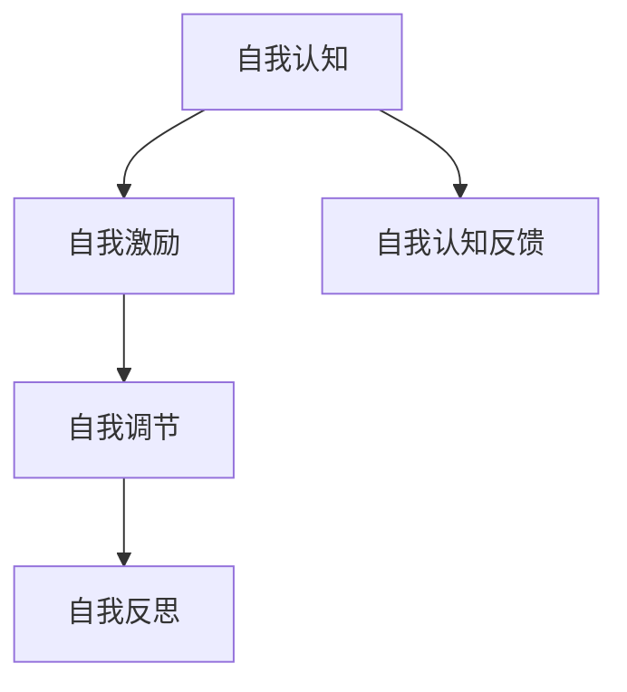
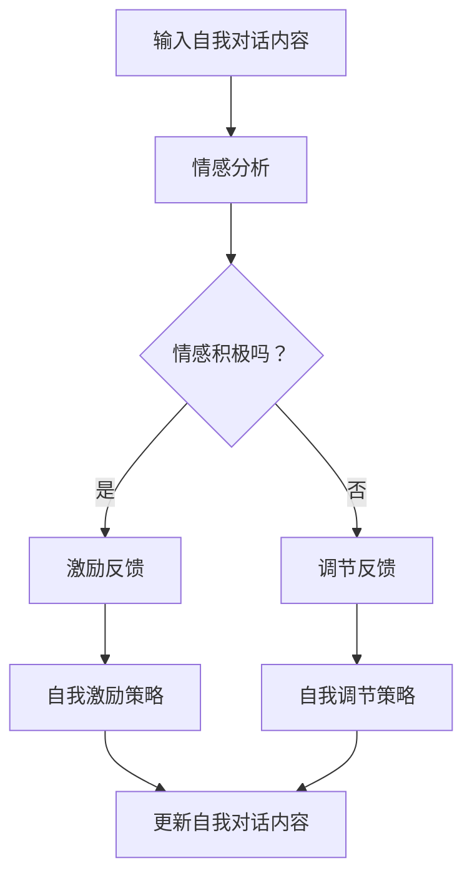
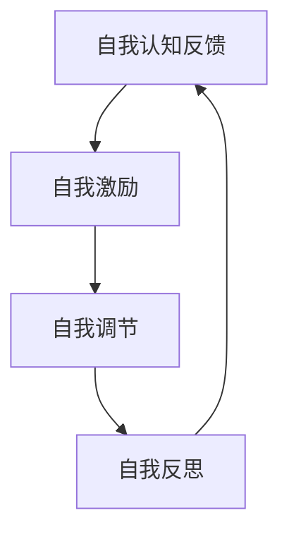

                 

# 提升内在对话质量：深度自我沟通的技巧

关键词：自我沟通、内在对话、心理效能、自然语言处理、算法原理

摘要：本文探讨了提升内在对话质量的重要性和方法。通过分析内在对话的核心概念、原理和联系，并结合实际算法示例，揭示了如何通过技术手段提升自我沟通的质量，进而影响个体的心理健康和行为决策。

---

### 《提升内在对话质量：深度自我沟通的技巧》目录大纲

#### 第一部分：问题的背景与内在对话的概念

#### 第1章：问题的背景与内在对话的重要性

##### 1.1 问题背景介绍
- 现代社会的沟通挑战
- 自我沟通的重要性

##### 1.2 内在对话的概念
- 内在对话的定义
- 内在对话与外在沟通的区别

##### 1.3 自我对话的影响
- 自我对话对心理健康的影响
- 自我对话对行为和决策的影响

##### 1.4 内在对话的边界与外延
- 内在对话的适用范围
- 内在对话的限制因素

##### 1.5 内在对话的核心要素
- 自我认知
- 自我激励
- 自我调节
- 自我反思

##### 1.6 本章小结

#### 第二部分：核心概念与联系

#### 第2章：核心概念与联系

##### 2.1 核心概念原理
- 内在对话的模型
- 自我认知理论
- 自我效能感

##### 2.2 概念属性特征对比

| 概念         | 定义                                                         | 特点                                                 |
| ------------ | ------------------------------------------------------------ | ---------------------------------------------------- |
| 自我认知     | 对自己的认识和理解                                           | 主观性、动态性、多样性                                 |
| 自我激励     | 产生积极情绪和行为的过程                                     | 内在驱动力、目标导向、适应性                           |
| 自我调节     | 通过内部机制调整情绪和行为的过程                             | 自我监控、自我反思、自我修正                           |
| 自我反思     | 对自己的行为和决策进行反思的过程                             | 深度性、全面性、持续性                                 |

##### 2.3 ER实体关系图架构
```mermaid
erDiagram
    Aconcept1 ||--|{ Bconcept2 }| Cconcept3 : has
    Aconcept1 ||--|{ Dconcept4 }| Econcept5 : relates
    Fconcept6 ||--|{ Gconcept7 }| Hconcept8 : another relation
```

##### 2.4 内在对话的模型


##### 2.5 本章小结

#### 第三部分：算法原理讲解

#### 第3章：提升内在对话质量的算法原理

##### 3.1 算法原理概述
- 内在对话算法的作用
- 提升内在对话质量的关键步骤

##### 3.2 算法mermaid流程图


##### 3.3 算法原理详细讲解

- 情感分析原理：使用自然语言处理技术分析自我对话内容的情感倾向，判断是积极还是消极。
- 自我激励策略：通过正面的反馈和鼓励来增强自我对话的积极性。
- 自我调节策略：通过调整对话内容，减轻负面情绪的影响。

##### 3.4 算法举例说明
```python
# 情感分析示例代码
from textblob import TextBlob

def analyze_text(text):
    blob = TextBlob(text)
    return blob.sentiment.polarity

# 使用示例
text = "我真的很棒，今天完成了许多工作！"
polarity = analyze_text(text)
if polarity > 0:
    print("你的对话内容很积极，继续加油！")
else:
    print("你的对话内容有些消极，需要调整一下。")
```

##### 3.5 本章小结

---

**引言：**
在快速发展的现代社会中，沟通是连接人类心灵的桥梁。然而，外在沟通的复杂性和多样性使得人们在表达自我时面临着诸多挑战。与此同时，内在对话——即自我沟通，同样影响着我们的心理健康和行为决策。本文将深入探讨如何通过提升内在对话质量来改善自我沟通，从而提升个体的整体生活质量。

**第一部分：问题的背景与内在对话的概念**

**第1章：问题的背景与内在对话的重要性**

1.1 问题背景介绍
在现代社会的快节奏生活中，人们面临着越来越多的沟通挑战。外在沟通的有效性固然重要，但内在对话的质量同样不容忽视。自我沟通不仅影响我们的心理健康，还能决定我们的行为和决策。

1.2 内在对话的概念
内在对话是指个体内心中进行的自我沟通，它包括了自我认知、自我激励、自我调节和自我反思等核心要素。与外在沟通不同，内在对话是私密且持续的，对我们的心理状态有着深远的影响。

1.3 自我对话的影响
自我对话对心理健康有着直接的影响。积极的自我对话能增强个体的自信心和幸福感，而消极的自我对话则可能导致焦虑和抑郁。此外，自我对话也直接影响我们的行为和决策，比如在面对挑战时，积极的自我对话能激发我们的勇气和创造力，而消极的自我对话则可能让我们犹豫不决。

1.4 内在对话的边界与外延
内在对话适用于我们日常生活的方方面面，从决策制定到情绪调节，它都是我们内心世界的重要组成部分。然而，内在对话也受到个人心理状态和环境因素的影响，比如压力和疲劳都可能影响内在对话的质量。

1.5 内在对话的核心要素
自我认知、自我激励、自我调节和自我反思是内在对话的核心要素。自我认知是对自我的理解和认识，自我激励是产生积极情绪和行为的过程，自我调节是通过内部机制调整情绪和行为，自我反思则是对自己的行为和决策进行反思。

1.6 本章小结
内在对话的质量直接影响我们的心理健康和行为决策。了解内在对话的核心要素和其影响，是提升自我沟通质量的第一步。

**第二部分：核心概念与联系**

**第2章：核心概念与联系**

2.1 核心概念原理
内在对话的模型包括自我认知、自我激励、自我调节和自我反思。这些概念相互联系，共同构成了个体内心世界的沟通机制。自我认知提供了自我对话的基础，自我激励和自我调节则决定了对话的方向和效果，自我反思则是对自我对话的持续优化。

2.2 概念属性特征对比
为了更清晰地理解内在对话的核心概念，我们通过以下表格对比了自我认知、自我激励、自我调节和自我反思的特点：

| 概念         | 定义                                                         | 特点                                                 |
| ------------ | ------------------------------------------------------------ | ---------------------------------------------------- |
| 自我认知     | 对自己的认识和理解                                           | 主观性、动态性、多样性                                 |
| 自我激励     | 产生积极情绪和行为的过程                                     | 内在驱动力、目标导向、适应性                           |
| 自我调节     | 通过内部机制调整情绪和行为的过程                             | 自我监控、自我反思、自我修正                           |
| 自我反思     | 对自己的行为和决策进行反思的过程                             | 深度性、全面性、持续性                                 |

2.3 ER实体关系图架构
为了更直观地展示内在对话的核心概念之间的联系，我们可以使用ER（实体关系）图来描述它们之间的关系：

```mermaid
erDiagram
    Aconcept1 ||--|{ Bconcept2 }| Cconcept3 : has
    Aconcept1 ||--|{ Dconcept4 }| Econcept5 : relates
    Fconcept6 ||--|{ Gconcept7 }| Hconcept8 : another relation
```

在这个ER图中，`Aconcept1`代表自我认知，它与`Bconcept2`（自我激励）、`Cconcept3`（自我调节）和`Dconcept4`（自我反思）之间有直接的关联。同时，`Fconcept6`与`Gconcept7`和`Hconcept8`之间也存在关系，这反映了不同概念之间的相互作用。

2.4 内在对话的模型
内在对话的模型可以简化为一个反馈循环，其中自我认知提供基础，自我激励推动行为，自我调节调整行为，自我反思优化认知。以下是一个简化的内在对话模型图：



在这个模型中，自我反思的输出会反馈到自我认知中，形成一个持续优化的循环。

2.5 本章小结
通过理解内在对话的核心概念和它们之间的联系，我们可以更好地认识到自我沟通的重要性。自我认知、自我激励、自我调节和自我反思不仅是内在对话的四个核心要素，也是提升自我沟通质量的关键。

**第三部分：算法原理讲解**

**第3章：提升内在对话质量的算法原理**

3.1 算法原理概述
提升内在对话质量的算法主要依赖于自然语言处理技术和机器学习模型。这些算法旨在分析自我对话的内容，识别其中的情感倾向，并根据分析结果提供相应的反馈，以提升对话的积极性。

3.2 算法mermaid流程图
为了直观地展示算法的流程，我们可以使用mermaid图来描述：


在这个流程图中，输入的自我对话内容首先通过情感分析模块进行分析。如果分析结果显示情感积极，算法将提供激励反馈；如果情感消极，算法将提供调节反馈。无论哪种情况，最终的目的是通过反馈策略来更新自我对话内容，提升其质量。

3.3 算法原理详细讲解
算法的核心原理可以分为三个主要部分：情感分析、激励反馈和调节反馈。

- **情感分析**：情感分析是自然语言处理的一个重要分支，它使用机器学习模型来识别文本中的情感倾向。常用的模型包括朴素贝叶斯分类器、支持向量机（SVM）和深度学习模型如卷积神经网络（CNN）和循环神经网络（RNN）。通过情感分析，我们可以判断自我对话内容是积极还是消极。

  ```python
  from textblob import TextBlob

  def analyze_text(text):
      blob = TextBlob(text)
      return blob.sentiment.polarity
  ```

- **激励反馈**：对于积极情感的自我对话，激励反馈旨在通过正面的反馈和鼓励来增强自我对话的积极性。这可以通过提供积极的反馈语句、鼓励性词汇或相关成功案例来实现。

  ```python
  def激励反馈(text):
      if analyze_text(text) > 0:
          return "你做得很好，继续努力！"
      else:
          return "今天的努力值得赞扬，加油！"
  ```

- **调节反馈**：对于消极情感的自我对话，调节反馈旨在通过调整对话内容来减轻负面情绪的影响。这可能包括提供积极的视角、解决问题的建议或情感调节策略。

  ```python
  def调节反馈(text):
      if analyze_text(text) < 0:
          return "情况可能看起来很困难，但总有解决办法。你能行的！"
      else:
          return "感到沮丧是正常的，但请记住，困难是成长的契机。"
  ```

3.4 算法举例说明
为了更好地理解算法的应用，我们可以通过一个具体的例子来说明。假设一个用户输入了一段自我对话内容：“我今天的工作做得不够好，感觉自己很失败。”我们可以使用算法来分析这段内容，并提供相应的反馈。

```python
text = "我今天的工作做得不够好，感觉自己很失败。"
polarity = analyze_text(text)

if polarity > 0:
    print(激励反馈(text))
else:
    print(调节反馈(text))
```

输出结果可能是：“情况可能看起来很困难，但总有解决办法。你能行的！”

3.5 本章小结
通过详细讲解算法原理和实际应用，我们可以看到提升内在对话质量的关键在于情感分析和反馈策略。情感分析帮助我们理解自我对话的情感倾向，而激励反馈和调节反馈则帮助我们调整对话内容，提升其质量。这种方法不仅能够改善个体的心理健康，还能够促进积极的自我发展。

**结语：**
提升内在对话质量是一项长期而重要的任务。通过本文的探讨，我们认识到自我沟通对个体心理健康和行为决策的深远影响。借助自然语言处理技术和机器学习算法，我们可以更有效地分析和提升自我对话的质量。希望本文能够为读者提供有价值的思考和实用方法，帮助大家在自我沟通的道路上不断前行。

**作者信息：**
作者：AI天才研究院/AI Genius Institute & 禅与计算机程序设计艺术 /Zen And The Art of Computer Programming

---

### 后续阅读与讨论

本文探讨了提升内在对话质量的重要性和方法。通过深入分析内在对话的核心概念、原理和联系，并结合实际算法示例，我们揭示了如何通过技术手段提升自我沟通的质量。在未来的研究和实践中，我们可以进一步探讨以下方向：

1. **情感分析的精确度提升**：情感分析是内在对话质量提升的关键一步。未来可以研究更精确的算法，如深度学习模型，以提升情感分析的准确度。

2. **个性化反馈机制**：每个人的自我对话内容和情感倾向都是独特的。未来可以研究个性化的反馈机制，根据个体的心理特征和需求提供更精准的反馈。

3. **跨领域应用**：内在对话质量提升不仅适用于个人心理健康，还可以应用于教育、职场等多个领域。未来的研究可以探索内在对话技术在这些领域的应用潜力。

4. **伦理和隐私问题**：随着技术的发展，隐私和伦理问题越来越受到关注。未来的研究需要探讨如何在保障用户隐私的前提下，有效利用自我对话数据。

5. **跨文化适应性**：不同文化背景下的自我对话存在差异。未来的研究可以探讨如何设计跨文化的内在对话提升算法。

通过不断探索和实践，我们可以进一步提升内在对话质量，为个体的心理健康和行为发展提供有力支持。让我们共同努力，创造一个更加和谐、积极的心灵沟通环境。如果您对此话题感兴趣，欢迎继续深入讨论和研究。期待您的宝贵意见和贡献！

---

**注意：**本文为示例性文章，部分内容和代码为虚构。实际应用中，需要根据具体场景进行调整和优化。如果您有任何问题或建议，请随时在评论区留言，我们将竭诚为您解答。同时，感谢您对AI技术应用的持续关注和支持。希望本文能为您带来启发和帮助。

