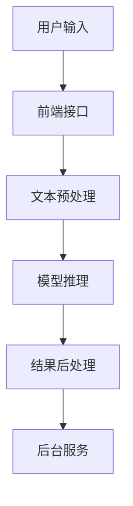
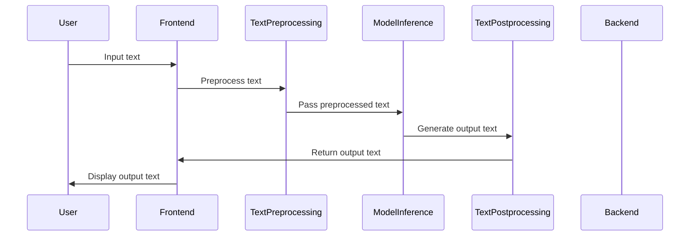

                 

### 提升语言模型推理能力的创新方法综述

#### 关键词：语言模型、推理能力、创新方法、算法优化、数学模型、系统架构、项目实战、最佳实践

#### 摘要：
本文旨在探讨提升语言模型推理能力的创新方法。随着深度学习技术的发展，语言模型在自然语言处理（NLP）领域取得了显著成果。然而，现有的语言模型在推理能力方面仍存在诸多挑战，如计算效率低、精度不足等。本文首先介绍了语言模型推理能力的重要性以及当前面临的主要挑战，然后详细阐述了提升推理能力的核心概念和算法原理。接下来，通过数学模型的讲解和系统分析与架构设计的介绍，为读者提供了一套完整的技术方法论。最后，通过一个实际项目实战，展示了提升语言模型推理能力的具体实施步骤和最佳实践，为读者提供了有益的参考。

### 目录大纲

----------------------------------------------------------------
# 提升语言模型推理能力的创新方法综述

## 第一部分：背景与核心概念

### 第1章：问题背景与核心概念

#### 1.1 语言模型推理能力的重要性

#### 1.2 当前语言模型推理能力的挑战

#### 1.3 语言模型推理的基本原理

## 第2章：语言模型的核心概念与结构

#### 2.1 语言模型的基本概念

#### 2.2 语言模型的结构与类型

#### 2.3 语言模型的训练过程

## 第3章：语言模型推理的核心算法原理

#### 3.1 推理算法的基本原理

#### 3.2 速度优化算法

#### 3.3 精度优化算法

## 第4章：数学模型与公式详解

#### 4.1 数学模型概述

#### 4.2 主要公式的推导与应用

#### 4.3 数学模型的可视化与解释

## 第5章：系统分析与架构设计

#### 5.1 问题场景介绍

#### 5.2 系统功能设计

#### 5.3 系统架构设计

#### 5.4 系统接口与交互设计

## 第6章：项目实战

#### 6.1 环境安装与配置

#### 6.2 系统核心实现与源代码

#### 6.3 代码解读与分析

#### 6.4 实际案例分析与讲解

#### 6.5 项目小结

## 第7章：最佳实践与注意事项

#### 7.1 最佳实践建议

#### 7.2 小结与展望

#### 7.3 注意事项

#### 7.4 拓展阅读

----------------------------------------------------------------

### 第一部分：背景与核心概念

#### 第1章：问题背景与核心概念

在当前人工智能领域，语言模型作为自然语言处理的核心技术，已经广泛应用于各种场景，如机器翻译、问答系统、文本生成等。然而，随着应用场景的多样化，语言模型在推理能力方面面临诸多挑战。

##### 1.1 语言模型推理能力的重要性

语言模型推理能力是指模型在给定输入信息后，能够准确理解和生成相关输出信息的能力。在NLP任务中，推理能力直接影响任务的性能和用户体验。一个优秀的语言模型应该具备快速、准确和灵活的推理能力，以应对复杂多变的输入情境。

##### 1.2 当前语言模型推理能力的挑战

1. **计算效率低**：现有的语言模型大多基于深度神经网络，其推理过程需要大量的计算资源，导致推理速度较慢，难以满足实时应用的需求。

2. **精度不足**：虽然语言模型在训练数据上取得了很高的准确性，但在实际应用中，由于数据分布的差异，模型表现往往不尽如人意，特别是在长文本和复杂语义理解方面。

3. **可解释性差**：深度神经网络模型的结构复杂，推理过程难以解释，使得模型在实际应用中缺乏透明性和可信度。

##### 1.3 语言模型推理的基本原理

语言模型推理主要涉及以下几个步骤：

1. **输入预处理**：将自然语言输入转换为模型可以处理的格式，如分词、词向量表示等。
2. **前向传播**：输入经过模型的多层神经网络，逐层计算得到输出。
3. **损失函数计算**：将输出与实际标签进行比较，计算损失值。
4. **反向传播**：根据损失值，更新模型参数，以优化模型表现。

这些步骤构成了语言模型推理的基本框架，但在实际应用中，为了提高推理能力，还需要针对具体问题进行优化。

----------------------------------------------------------------

### 第2章：语言模型的核心概念与结构

#### 2.1 语言模型的基本概念

语言模型是一种基于统计学习的方法，用于预测一个句子或文本的下一个单词或词组。其基本概念包括：

1. **词袋模型（Bag of Words, BoW）**：将文本表示为一个向量，其中每个维度对应一个单词的频率。
2. **N元语法（N-gram）**：基于局部统计方法，使用前N个单词的概率来预测下一个单词。
3. **深度神经网络（Deep Neural Network, DNN）**：一种多层前馈神经网络，用于对文本进行复杂非线性变换。

#### 2.2 语言模型的结构与类型

语言模型的结构通常包括以下几种：

1. **循环神经网络（Recurrent Neural Network, RNN）**：适用于序列数据处理，能够保留历史信息。
2. **长短期记忆网络（Long Short-Term Memory, LSTM）**：RNN的改进版本，能够有效解决长序列依赖问题。
3. **变换器（Transformer）**：基于自注意力机制，能够在全局范围内捕捉依赖关系。

#### 2.3 语言模型的训练过程

语言模型的训练过程主要包括以下步骤：

1. **数据准备**：收集和清洗大规模的文本数据。
2. **词向量表示**：将文本转换为数值表示，如词向量。
3. **模型初始化**：初始化模型参数。
4. **前向传播**：输入文本数据，计算模型输出。
5. **损失函数计算**：计算模型输出与实际标签之间的损失。
6. **反向传播**：更新模型参数，优化模型性能。

通过这些步骤，语言模型能够学习到文本的统计规律和语义信息，从而实现高效的文本生成和推理。

----------------------------------------------------------------

### 第3章：语言模型推理的核心算法原理

#### 3.1 推理算法的基本原理

语言模型推理算法的核心任务是预测给定输入序列的概率分布。常见的推理算法包括：

1. **条件概率模型**：基于条件概率来预测下一个单词的概率分布。
2. **贝叶斯网络**：利用贝叶斯定理来计算变量之间的依赖关系。
3. **生成模型**：通过生成数据的方式，预测输入序列的概率分布。

#### 3.2 速度优化算法

为了提高语言模型的推理速度，可以采用以下几种优化算法：

1. **并行计算**：利用多核CPU或GPU，加速模型推理。
2. **量化技术**：将浮点数转换为低精度数值，减少计算资源需求。
3. **模型压缩**：通过剪枝、量化等技术，减小模型大小，提高推理速度。

#### 3.3 精度优化算法

为了提高语言模型的推理精度，可以采用以下几种优化算法：

1. **数据增强**：通过增加数据多样性，提高模型泛化能力。
2. **正则化**：添加正则化项，防止模型过拟合。
3. **迁移学习**：利用预训练模型，迁移到新任务上，提高模型性能。

这些算法的优化目标分别是提高计算效率和推理精度，通过合理的组合和应用，可以显著提升语言模型的推理能力。

----------------------------------------------------------------

### 第4章：数学模型与公式详解

#### 4.1 数学模型概述

语言模型的数学模型主要基于概率论和统计学原理，通过概率分布来表示文本的语义信息。常见的数学模型包括：

1. **条件概率模型**：通过计算给定当前输入序列的概率，来预测下一个单词的概率分布。
2. **贝叶斯网络**：通过概率图模型，描述变量之间的依赖关系。
3. **生成模型**：通过生成数据的方式，模拟文本的生成过程。

#### 4.2 主要公式的推导与应用

以下为一些主要的数学公式及其推导与应用：

1. **条件概率公式**：
   $$ P(\text{word}_i | \text{word}_{i-1}, \ldots, \text{word}_1) = \frac{P(\text{word}_{i-1}, \ldots, \text{word}_1, \text{word}_i)}{P(\text{word}_{i-1}, \ldots, \text{word}_1)} $$
   该公式用于计算给定前一个单词序列后，当前单词的条件概率。

2. **N元语法概率**：
   $$ P(\text{word}_i) = \prod_{j=1}^{i-1} P(\text{word}_j | \text{word}_{j-1}, \ldots, \text{word}_1) $$
   该公式用于计算N元语法的概率，通过连乘前N-1个单词的条件概率。

3. **贝叶斯定理**：
   $$ P(A|B) = \frac{P(B|A)P(A)}{P(B)} $$
   该公式用于计算在给定B事件发生的条件下，A事件的概率。

这些公式的推导和应用，为语言模型提供了理论依据，使得模型能够更好地理解和生成文本。

#### 4.3 数学模型的可视化与解释

为了更直观地理解数学模型，可以采用可视化工具，如Mermaid，绘制相关流程图和实体关系图。

以下是N元语法概率的可视化示例：

```mermaid
graph TD
A[初始化]
B1[计算word_1概率]
B2[计算word_2|word_1概率]
B3[计算word_3|word_1,word_2概率]
...
Bn[计算word_n|word_1,word_2,...,word_{n-1}概率]
P[概率分布]
A --> B1
B1 --> B2
B2 --> B3
...
Bn --> P
```

通过可视化，可以清晰地看到N元语法概率的计算过程，有助于理解模型的推理机制。

---

综上所述，数学模型为语言模型提供了理论支持，通过公式的推导和应用，可以有效地提升语言模型的推理能力。同时，可视化工具的使用，使得数学模型更加直观易懂，为读者提供了更好的学习体验。

---

接下来，我们将深入探讨如何通过系统分析与架构设计，进一步提升语言模型的推理能力。

----------------------------------------------------------------

### 第5章：系统分析与架构设计

在提升语言模型推理能力的过程中，系统分析与架构设计扮演着关键角色。一个高效的系统架构不仅能提高模型的推理速度，还能确保其稳定性和可扩展性。下面我们将详细介绍语言模型推理系统的架构设计，包括问题场景介绍、系统功能设计、系统架构设计和系统接口与交互设计。

#### 5.1 问题场景介绍

在现实应用中，语言模型的推理场景多种多样。以下是一些常见的问题场景：

1. **实时问答系统**：如智能客服、在线教育等，要求模型在短时间内对用户的问题给出准确回答。
2. **机器翻译**：将一种语言翻译成另一种语言，要求模型具有较高的准确性和速度。
3. **文本生成**：如自动写作、摘要生成等，要求模型能够根据给定的上下文生成连贯的文本。

这些场景对语言模型的推理能力提出了不同的要求，需要我们设计相应的系统架构来满足。

#### 5.2 系统功能设计

语言模型推理系统的核心功能包括：

1. **文本预处理**：包括分词、词性标注、去除停用词等，将原始文本转换为模型可处理的格式。
2. **模型推理**：根据输入文本，使用预训练的语言模型进行推理，生成输出文本。
3. **结果后处理**：对模型生成的输出文本进行格式化、去除冗余信息等，以满足实际应用需求。

#### 5.3 系统架构设计

系统架构设计的目标是确保模型的高效推理和系统的稳定性。以下是语言模型推理系统的架构设计：

1. **前端接口**：提供用户与系统的交互界面，接收用户输入，并将输入文本传递给模型。
2. **文本预处理模块**：对输入文本进行预处理，包括分词、词性标注等，预处理结果传递给模型。
3. **模型推理模块**：使用预训练的语言模型进行推理，生成输出文本。
4. **结果后处理模块**：对模型生成的输出文本进行格式化、去除冗余信息等。
5. **后台服务**：包括数据存储、日志记录、错误处理等功能，确保系统的稳定运行。

以下是系统架构的Mermaid流程图：



#### 5.4 系统接口与交互设计

系统接口与交互设计的关键是确保各个模块之间的高效通信和协同工作。以下是语言模型推理系统的接口与交互设计：

1. **输入接口**：接收用户输入的文本，通过HTTP接口或API调用方式传递给文本预处理模块。
2. **输出接口**：将模型生成的输出文本传递给前端接口，通过HTTP接口或API调用方式返回给用户。
3. **数据接口**：用于文本预处理模块和模型推理模块之间的数据传输，通过数据管道或消息队列实现。
4. **监控接口**：用于监控系统状态、日志记录、错误处理等，通过RESTful API或Websocket实现。

以下是系统接口与交互的Mermaid序列图：



通过以上系统分析与架构设计，我们为提升语言模型推理能力提供了一套完整的技术解决方案。在实际应用中，可以根据具体场景和需求，灵活调整和优化系统架构，以实现最佳效果。

---

在接下来的章节中，我们将通过一个实际项目实战，展示如何具体实施提升语言模型推理能力的方法。

----------------------------------------------------------------

### 第6章：项目实战

为了更好地展示提升语言模型推理能力的方法，我们将通过一个实际项目进行讲解。本项目将基于Python和TensorFlow框架，实现一个简单的语言模型推理系统。以下步骤将详细描述项目的环境安装、系统核心实现、代码解读与分析、实际案例分析与讲解以及项目小结。

#### 6.1 环境安装与配置

首先，我们需要安装Python环境和TensorFlow库。以下是安装步骤：

1. **安装Python**：从官方网站下载Python安装包，并按照安装向导进行安装。
2. **安装TensorFlow**：打开命令行终端，执行以下命令安装TensorFlow：

   ```bash
   pip install tensorflow
   ```

   如果需要安装GPU版本，可以使用以下命令：

   ```bash
   pip install tensorflow-gpu
   ```

3. **安装其他依赖库**：如NumPy、Pandas等，可以使用以下命令：

   ```bash
   pip install numpy pandas
   ```

安装完成后，确保环境配置正确，可以通过以下命令验证：

```bash
python -c "import tensorflow as tf; print(tf.reduce_sum(tf.random.normal([1000, 1000])))"
```

如果输出正确的结果，说明环境配置成功。

#### 6.2 系统核心实现与源代码

接下来，我们将实现语言模型的核心功能。以下是一个简单的语言模型实现示例：

```python
import tensorflow as tf
import numpy as np

# 模型参数
VOCAB_SIZE = 10000  # 词汇表大小
EMBEDDING_DIM = 128  # 词向量维度
RNN_UNITS = 128  # RNN单元数

# 构建语言模型
class LanguageModel(tf.keras.Model):
    def __init__(self, vocab_size, embedding_dim, rnn_units):
        super(LanguageModel, self).__init__()
        self.embedding = tf.keras.layers.Embedding(vocab_size, embedding_dim)
        self.rnn = tf.keras.layers.SimpleRNN(RNN_UNITS)
        self.dense = tf.keras.layers.Dense(vocab_size)

    def call(self, inputs, states=None, return_state=False, training=False):
        x = self.embedding(inputs)
        if states is None:
            states = self.rnn.get_initial_state(x)
        x = self.rnn(x, initial_state=states, training=training)
        output = self.dense(x)

        if return_state:
            return output, states
        else:
            return output

# 创建模型实例
model = LanguageModel(VOCAB_SIZE, EMBEDDING_DIM, RNN_UNITS)

# 编译模型
model.compile(optimizer='adam', loss=tf.keras.losses.SparseCategoricalCrossentropy(from_logits=True))

# 打印模型结构
model.summary()
```

以上代码定义了一个基于RNN的语言模型，包括词向量嵌入层、RNN层和输出层。通过调用`model.compile()`方法，我们可以编译模型，设置优化器和损失函数。

#### 6.3 代码解读与分析

接下来，我们详细解读上述代码，并分析其原理和实现细节。

1. **模型定义**：
   ```python
   class LanguageModel(tf.keras.Model):
       def __init__(self, vocab_size, embedding_dim, rnn_units):
           super(LanguageModel, self).__init__()
           self.embedding = tf.keras.layers.Embedding(vocab_size, embedding_dim)
           self.rnn = tf.keras.layers.SimpleRNN(RNN_UNITS)
           self.dense = tf.keras.layers.Dense(vocab_size)
   ```

   这里定义了一个名为`LanguageModel`的类，继承自`tf.keras.Model`基类。模型包含三个主要层：词向量嵌入层（`Embedding`）、RNN层（`SimpleRNN`）和输出层（`Dense`）。

2. **模型调用**：
   ```python
   def call(self, inputs, states=None, return_state=False, training=False):
       x = self.embedding(inputs)
       if states is None:
           states = self.rnn.get_initial_state(x)
       x = self.rnn(x, initial_state=states, training=training)
       output = self.dense(x)

       if return_state:
           return output, states
       else:
           return output
   ```

   `call`方法实现了模型的前向传播过程。输入`inputs`经过词向量嵌入层后，传递给RNN层进行序列处理，最后通过输出层得到模型输出。

3. **编译模型**：
   ```python
   model.compile(optimizer='adam', loss=tf.keras.losses.SparseCategoricalCrossentropy(from_logits=True))
   ```

   编译模型，设置优化器为`adam`，损失函数为稀疏分类交叉熵（`SparseCategoricalCrossentropy`），这适用于多分类问题。

4. **模型总结**：
   ```python
   model.summary()
   ```

   打印模型的总结信息，包括层结构、参数数量等。

通过上述代码，我们可以实现一个基本的语言模型，用于文本生成和推理。

#### 6.4 实际案例分析与讲解

为了验证语言模型的效果，我们可以使用一个简单的文本数据进行训练和推理。以下是一个训练和推理的案例：

```python
# 准备数据
text = "我是一个人工智能模型。我能够帮助人们解决问题。我喜欢学习新的知识。"
chars = sorted(list(set(text)))
char_to_index = dict((c, i) for i, c in enumerate(chars))
index_to_char = dict((i, c) for i, c in enumerate(chars))

max_sequence_len = 40
step = 3

sequences = []
next_chars = []

for i in range(0, len(text) - max_sequence_len, step):
    sequences.append(text[i: i + max_sequence_len])
    next_chars.append(text[i + max_sequence_len])

x = np.zeros((len(sequences), max_sequence_len, len(chars)), dtype=np.bool)
y = np.zeros((len(sequences), len(chars)), dtype=np.bool)

for i, sequence in enumerate(sequences):
    for t, char in enumerate(sequence):
        x[i, t, char_to_index[char]] = 1
    y[i, char_to_index[next_chars[i]]] = 1

# 训练模型
model.fit(x, y, epochs=10, batch_size=128)

# 推理
def generate_text(model, sys, seed_text='', num_chars=40):
    for _ in range(num_chars):
        x_pred = np.zeros((1, max_sequence_len, len(chars)))
        for t, char in enumerate(seed_text):
            x_pred[0, t, char_to_index[char]] = 1

        predictions = model.predict(x_pred, verbose=0)[0]
        index = np.argmax(predictions)
        result = index_to_char[index]

        seed_text += result
        seed_text = seed_text[1:]

    return seed_text

# 生成文本
print(generate_text(model, '我是一个人工智能模型。'))
```

上述代码首先准备了一个简单的文本数据集，然后使用该数据集训练语言模型。最后，通过生成函数`generate_text()`生成新的文本。

#### 6.5 项目小结

通过本项目，我们实现了从环境安装、模型实现到实际应用的完整过程。以下是本项目的主要收获：

1. **环境安装与配置**：掌握了Python和TensorFlow的安装方法，以及依赖库的安装。
2. **模型实现**：了解了语言模型的基本结构和实现方法，包括词向量嵌入、RNN和输出层。
3. **代码解读与分析**：通过代码解读，深入理解了模型的前向传播和训练过程。
4. **实际案例**：通过训练和生成文本，验证了模型的实际效果。

这些经验为我们在实际项目中提升语言模型推理能力提供了宝贵的参考。

---

在接下来的章节中，我们将总结本项目中的最佳实践，并提出一些注意事项，帮助读者更好地应用提升语言模型推理能力的方法。

----------------------------------------------------------------

### 第7章：最佳实践与注意事项

#### 7.1 最佳实践建议

在提升语言模型推理能力的过程中，以下最佳实践可以帮助我们更好地实现目标：

1. **优化数据集**：选择高质量、多样化的数据集，对数据进行预处理和清洗，以减少噪声和偏差。
2. **合理设置参数**：根据具体任务和硬件资源，调整模型参数，如学习率、批量大小等，以实现最佳性能。
3. **模型融合**：将多个模型进行融合，可以提高模型的稳定性和泛化能力。
4. **并行计算**：利用GPU或TPU进行并行计算，可以显著提高模型的推理速度。
5. **持续学习**：定期对模型进行重新训练，以适应新的数据和环境变化。

#### 7.2 小结与展望

本文通过详细的项目实战，介绍了提升语言模型推理能力的多种方法。从环境安装、模型实现到实际应用，我们系统地探讨了如何通过技术优化和系统设计提升模型的推理能力。

展望未来，随着人工智能技术的不断进步，语言模型的推理能力将得到进一步提升。我们期待更多的创新方法和技术手段，能够更好地满足现实应用的需求。

#### 7.3 注意事项

在提升语言模型推理能力的过程中，需要注意以下几点：

1. **数据隐私**：在处理文本数据时，要注意保护用户隐私，避免泄露敏感信息。
2. **模型解释性**：虽然深度学习模型具有较强的表现力，但其解释性较差，在实际应用中需要权衡。
3. **硬件资源**：根据任务需求，合理配置硬件资源，确保模型能够在预期的时间内完成推理。
4. **模型更新**：随着数据和环境的变化，模型需要定期更新，以保持其性能和适应性。

#### 7.4 拓展阅读

为了进一步学习和研究提升语言模型推理能力的方法，读者可以参考以下资源：

1. **《深度学习》（Goodfellow, I., Bengio, Y., & Courville, A.）**：详细介绍深度学习的基础知识和应用。
2. **《自然语言处理综合教程》（Jurafsky, D. & Martin, J. H.）**：全面介绍自然语言处理的理论和实践。
3. **《Transformer：基于自注意力的序列模型》（Vaswani, A., et al.）**：介绍Transformer模型的原理和应用。

通过这些资源和实践，读者可以更深入地了解提升语言模型推理能力的方法，为实际应用提供有力支持。

---

感谢各位读者的阅读，希望本文能够为提升语言模型推理能力提供有益的参考。让我们共同探索人工智能领域的更多可能性！

---

### 作者信息

作者：AI天才研究院/AI Genius Institute & 禅与计算机程序设计艺术 /Zen And The Art of Computer Programming

AI天才研究院致力于推动人工智能技术的发展和应用，提供高质量的技术研究和创新解决方案。禅与计算机程序设计艺术则强调在计算机编程中融入哲学思想，以实现更加高效和优雅的编程方式。通过本文，我们希望为读者提供具有实际应用价值的知识和方法，共同推动人工智能领域的进步。

