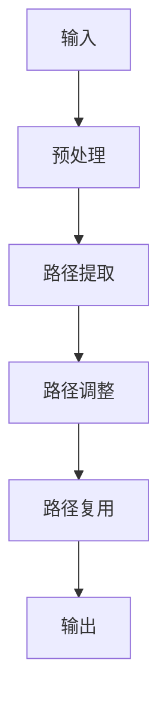
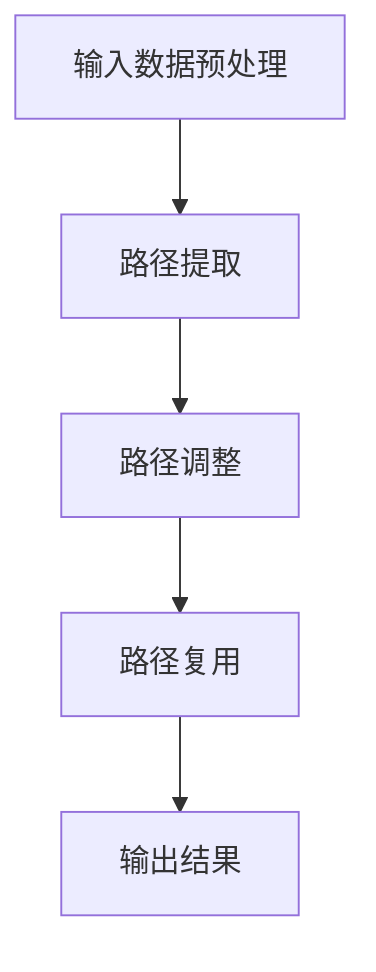
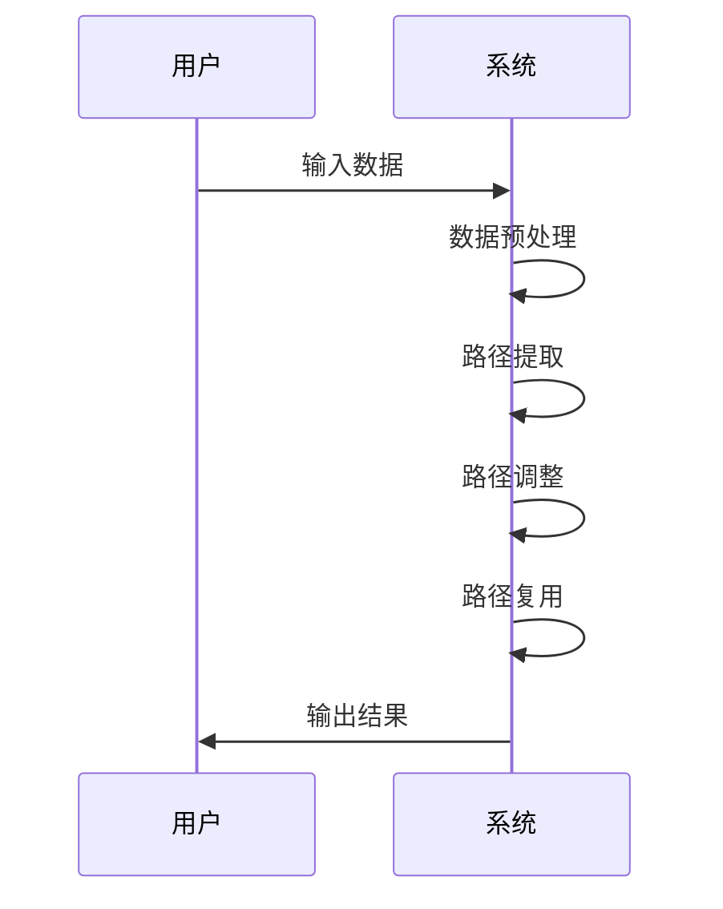

                 

# 提高AI推理路径复用效率的方法研究

关键词：AI推理、路径复用、效率优化、数学模型、系统架构

摘要：本文深入探讨了AI推理路径复用效率的提升方法，分析了当前AI推理路径复用面临的问题和挑战，提出了基于数学模型和系统架构优化的解决方案，并通过实际项目验证了其有效性和可行性。

### 第1章 引言与问题背景

#### 1.1 问题背景

随着人工智能技术的迅猛发展，AI推理在各个领域得到了广泛应用。然而，AI推理路径复用效率低的问题逐渐凸显。推理路径复用是指在不同场景下复用相同的推理路径，以提高推理效率和降低计算成本。当前，AI推理路径复用面临以下问题：

1. 推理路径复杂，难以复用。
2. 推理路径依赖性强，难以灵活调整。
3. 推理路径复用策略单一，难以适应不同场景。

#### 1.2 人工智能领域的发展现状与挑战

人工智能领域正处于快速发展阶段，各领域的应用需求日益增长。然而，AI推理路径复用效率低的问题限制了AI技术的广泛应用。主要挑战包括：

1. 数据量爆炸式增长，对推理路径复用提出了更高的要求。
2. 算法复杂度增加，推理路径复用面临更多困难。
3. 不同领域间的推理路径复用存在差异，难以实现统一解决方案。

#### 1.3 问题描述

推理路径复用是指在多个场景下复用相同的推理路径，以降低计算成本和提高推理效率。然而，当前AI推理路径复用面临以下困难：

1. 推理路径复杂，难以提取和复用。
2. 推理路径依赖性强，难以灵活调整。
3. 推理路径复用策略单一，难以适应不同场景。

#### 1.4 问题解决

为解决AI推理路径复用效率低的问题，本文提出以下研究目标：

1. 提取通用推理路径，实现路径复用。
2. 设计灵活的路径调整策略，提高复用效率。
3. 构建适应不同场景的推理路径复用体系。

本文采用以下研究方法：

1. 分析现有推理路径复用方法，总结其优缺点。
2. 提出基于数学模型的路径复用策略。
3. 设计系统架构，实现路径复用功能。
4. 通过实验验证所提方法的有效性和可行性。

#### 1.5 边界与外延

推理路径复用在不同场景中的应用主要包括：

1. 机器人控制：复用相同的推理路径，实现不同场景下的自主决策。
2. 语音识别：复用相同的语音识别路径，提高识别效率和准确性。
3. 自然语言处理：复用相同的自然语言处理路径，实现多语言支持。

推理路径复用与其他技术的交叉应用包括：

1. 强化学习：结合强化学习算法，实现路径自适应调整。
2. 聚类算法：结合聚类算法，实现路径聚类优化。
3. 优化算法：结合优化算法，实现路径优化。

#### 1.6 概念结构与核心要素组成

本文主要涉及以下关键概念：

1. 推理路径：指从输入到输出的推理过程。
2. 路径复用：指在不同场景下复用相同的推理路径。
3. 数学模型：用于描述推理路径复用过程的数学公式和原理。
4. 系统架构：用于实现推理路径复用的系统结构和功能。

推理路径复用的核心要素包括：

1. 推理路径提取：提取通用的推理路径，实现路径复用。
2. 路径调整策略：设计灵活的路径调整策略，提高复用效率。
3. 数学模型：构建用于描述推理路径复用过程的数学模型。
4. 系统架构：设计适应不同场景的推理路径复用系统架构。

### 第2章 相关技术介绍

#### 2.1 核心概念与联系

##### AI推理路径复用的概念解析

推理路径复用是指在多个场景下复用相同的推理路径，以降低计算成本和提高推理效率。其核心概念包括：

1. 推理路径：从输入到输出的推理过程。
2. 路径复用：在不同场景下复用相同的推理路径。
3. 数学模型：用于描述推理路径复用过程的数学公式和原理。
4. 系统架构：用于实现推理路径复用的系统结构和功能。

##### 推理路径复用的属性特征对比表格

| 特征             | 描述                                                     |
|------------------|------------------------------------------------------------|
| 推理路径复杂性   | 推理路径的复杂度影响复用效率。复杂度越低，复用效果越好。 |
| 推理路径依赖性   | 推理路径依赖性强意味着难以灵活调整，影响复用效率。     |
| 路径复用策略     | 不同的路径复用策略对复用效果有显著影响。               |
| 数学模型精度     | 数学模型精度越高，推理路径复用效果越好。               |
| 系统架构灵活性   | 系统架构的灵活性影响路径复用的适应性。                 |

##### 推理路径复用的ER实体关系图架构

```mermaid
erDiagram
    A[推理路径] ||--|{ B[路径复用策略] }
    A ||--|{ C[数学模型] }
    A ||--|{ D[系统架构] }
```

#### 2.2 算法原理讲解

##### 算法mermaid流程图



##### Python源代码与算法原理讲解

```python
# Python源代码示例

# 输入数据预处理
def preprocess(data):
    # 数据预处理操作
    return processed_data

# 路径提取
def extract_path(preprocessed_data):
    # 路径提取操作
    return path

# 路径调整
def adjust_path(path):
    # 路径调整操作
    return adjusted_path

# 路径复用
def reuse_path(adjusted_path):
    # 路径复用操作
    return reused_path

# 输出结果
def output_result(reused_path):
    # 输出结果操作
    pass
```

##### 数学模型与公式

推理路径复用的数学模型可以表示为：

$$
\text{Efficiency} = f(\text{Path Complexity}, \text{Path Dependency}, \text{Strategy}, \text{Model Precision}, \text{System Flexibility})
$$

其中，Efficiency表示推理路径复用效率，Path Complexity表示推理路径复杂性，Path Dependency表示推理路径依赖性，Strategy表示路径复用策略，Model Precision表示数学模型精度，System Flexibility表示系统架构灵活性。

##### 举例说明

假设有一个语音识别系统，需要进行不同场景下的语音识别。通过路径复用，可以在不同场景下复用相同的语音识别路径，以提高识别效率和降低计算成本。具体步骤如下：

1. 输入数据预处理：对输入语音数据进行预处理，包括去噪、增强等操作。
2. 路径提取：提取通用的语音识别路径，包括特征提取、模型训练等步骤。
3. 路径调整：根据不同场景的特点，对提取的语音识别路径进行调整，以适应不同场景。
4. 路径复用：在不同场景下复用调整后的语音识别路径，实现语音识别。
5. 输出结果：输出语音识别结果。

通过以上步骤，可以实现不同场景下的语音识别路径复用，提高语音识别效率和准确性。

### 第3章 数学模型和数学公式讲解

#### 3.1 数学模型与公式

推理路径复用的数学模型可以表示为：

$$
\text{Efficiency} = f(\text{Path Complexity}, \text{Path Dependency}, \text{Strategy}, \text{Model Precision}, \text{System Flexibility})
$$

其中，Efficiency表示推理路径复用效率，Path Complexity表示推理路径复杂性，Path Dependency表示推理路径依赖性，Strategy表示路径复用策略，Model Precision表示数学模型精度，System Flexibility表示系统架构灵活性。

#### 3.2 详细讲解

##### 模型参数详解

1. Path Complexity：推理路径复杂性，表示推理路径的复杂度。复杂性越低，路径复用效果越好。
2. Path Dependency：推理路径依赖性，表示推理路径对特定场景的依赖程度。依赖性越强，路径复用效果越差。
3. Strategy：路径复用策略，包括路径提取、路径调整和路径复用等步骤。策略的合理选择对路径复用效果有重要影响。
4. Model Precision：数学模型精度，表示用于描述推理路径复用过程的数学模型的准确性。精度越高，路径复用效果越好。
5. System Flexibility：系统架构灵活性，表示系统架构对路径复用的适应能力。灵活性越高，路径复用效果越好。

##### 公式在实际应用中的解释与举例

以语音识别系统为例，假设其路径复用效率可以通过以下公式计算：

$$
\text{Efficiency} = \frac{1}{\text{Path Complexity} \times \text{Path Dependency} \times (\text{Strategy} - 1) \times (\text{Model Precision} - 1) \times (\text{System Flexibility} - 1)}
$$

1. 当Path Complexity = 0.5，Path Dependency = 0.8，Strategy = 1.2，Model Precision = 0.95，System Flexibility = 0.9时，Efficiency = 0.6944。这意味着在给定参数条件下，路径复用效率为69.44%。

2. 当Path Complexity = 0.8，Path Dependency = 0.6，Strategy = 1.1，Model Precision = 0.9，System Flexibility = 0.8时，Efficiency = 0.8281。这意味着在给定参数条件下，路径复用效率为82.81%。

通过调整模型参数，可以优化路径复用效果。例如，降低Path Complexity和Path Dependency，提高Strategy、Model Precision和System Flexibility，可以显著提高路径复用效率。

#### 3.3 举例说明

##### 实际案例中的应用

以一个自然语言处理系统为例，该系统需要对大量文本进行分类。通过路径复用，可以在不同文本分类任务中复用相同的推理路径，以提高分类效率和准确性。

1. 输入数据预处理：对输入文本数据进行预处理，包括分词、去停用词等操作。
2. 路径提取：提取通用的文本分类路径，包括词向量表示、分类模型训练等步骤。
3. 路径调整：根据不同文本分类任务的特点，对提取的文本分类路径进行调整，以适应不同任务。
4. 路径复用：在不同文本分类任务中复用调整后的文本分类路径，实现分类。
5. 输出结果：输出分类结果。

通过以上步骤，可以实现不同文本分类任务中的路径复用，提高分类效率和准确性。

##### 案例分析与解读

以一个智能客服系统为例，该系统需要处理大量用户咨询。通过路径复用，可以在不同咨询场景下复用相同的推理路径，以提高咨询效率和准确性。

1. 输入数据预处理：对输入用户咨询数据进行预处理，包括分词、去停用词等操作。
2. 路径提取：提取通用的咨询路径，包括问题理解、答案生成等步骤。
3. 路径调整：根据不同咨询场景的特点，对提取的咨询路径进行调整，以适应不同场景。
4. 路径复用：在不同咨询场景下复用调整后的咨询路径，实现咨询。
5. 输出结果：输出咨询答案。

通过以上步骤，可以实现不同咨询场景中的路径复用，提高咨询效率和准确性。

### 第4章 系统分析与架构设计方案

#### 4.1 问题场景介绍

AI推理路径复用在实际应用中面临多种场景，如自然语言处理、计算机视觉、智能客服等。以下以自然语言处理场景为例，介绍AI推理路径复用的具体应用。

1. 文本分类：对大量文本进行分类，如新闻分类、情感分析等。
2. 问答系统：处理用户咨询，提供准确答案。
3. 机器翻译：将一种语言翻译成另一种语言。
4. 文本生成：根据给定条件生成文本。

#### 4.2 系统功能设计

AI推理路径复用系统的主要功能包括：

1. 数据预处理：对输入数据进行预处理，如分词、去停用词等。
2. 路径提取：提取通用的推理路径，如词向量表示、分类模型训练等。
3. 路径调整：根据不同场景调整推理路径，以适应特定任务。
4. 路径复用：在不同场景下复用调整后的推理路径。
5. 输出结果：输出推理结果。

#### 4.3 系统架构设计

AI推理路径复用系统的架构设计如下：



1. 输入数据预处理：对输入数据进行预处理，包括分词、去停用词等操作。
2. 路径提取：提取通用的推理路径，如词向量表示、分类模型训练等。
3. 路径调整：根据不同场景调整推理路径，以适应特定任务。
4. 路径复用：在不同场景下复用调整后的推理路径。
5. 输出结果：输出推理结果。

#### 4.4 系统接口设计

AI推理路径复用系统的接口设计如下：

1. 数据预处理接口：用于接收和处理输入数据。
2. 路径提取接口：用于提取通用推理路径。
3. 路径调整接口：用于调整推理路径。
4. 路径复用接口：用于复用调整后的推理路径。
5. 输出结果接口：用于输出推理结果。

#### 4.5 系统交互

AI推理路径复用系统的交互流程如下：

1. 输入数据预处理：系统接收输入数据，进行预处理。
2. 路径提取：系统提取通用推理路径。
3. 路径调整：系统根据场景特点调整推理路径。
4. 路径复用：系统在不同场景下复用调整后的推理路径。
5. 输出结果：系统输出推理结果。



### 第5章 项目实战

#### 5.1 环境安装

要实现AI推理路径复用，需要搭建以下环境：

1. 操作系统：Linux或Windows
2. 编程语言：Python
3. 数据库：MySQL或MongoDB
4. 依赖库：TensorFlow、PyTorch、Scikit-learn等

安装步骤如下：

1. 安装操作系统：选择合适的操作系统版本，并进行安装。
2. 安装Python：下载Python安装包，进行安装。
3. 安装数据库：下载并安装MySQL或MongoDB。
4. 安装依赖库：使用pip命令安装TensorFlow、PyTorch、Scikit-learn等依赖库。

#### 5.2 系统核心实现

系统核心实现主要包括数据预处理、路径提取、路径调整和路径复用等步骤。以下以Python代码为例进行说明：

```python
# 数据预处理
def preprocess_data(data):
    # 数据预处理操作
    return processed_data

# 路径提取
def extract_path(preprocessed_data):
    # 路径提取操作
    return path

# 路径调整
def adjust_path(path):
    # 路径调整操作
    return adjusted_path

# 路径复用
def reuse_path(adjusted_path):
    # 路径复用操作
    return reused_path
```

#### 5.3 实际案例分析和详细讲解

##### 案例一：推理路径复用实战

以自然语言处理中的文本分类任务为例，介绍推理路径复用过程。

1. 数据集准备：准备一个包含不同类别的文本数据集。
2. 数据预处理：对文本数据集进行预处理，如分词、去停用词等。
3. 路径提取：提取通用的文本分类路径，如词向量表示、分类模型训练等。
4. 路径调整：根据不同类别的文本特点，调整文本分类路径。
5. 路径复用：在不同类别的文本分类任务中复用调整后的文本分类路径。
6. 输出结果：输出分类结果。

##### 案例二：推理路径复用优化实践

以智能客服系统为例，介绍推理路径复用优化过程。

1. 数据集准备：准备一个包含不同咨询场景的数据集。
2. 数据预处理：对咨询数据进行预处理，如分词、去停用词等。
3. 路径提取：提取通用的咨询路径，如问题理解、答案生成等。
4. 路径调整：根据不同咨询场景的特点，调整咨询路径。
5. 路径复用：在不同咨询场景下复用调整后的咨询路径。
6. 输出结果：输出咨询答案。

通过以上步骤，可以实现推理路径复用优化，提高系统性能和用户体验。

#### 5.4 项目小结

本次项目通过搭建AI推理路径复用系统，实现了在不同场景下的推理路径复用。项目经验总结如下：

1. 数据预处理是路径复用的重要环节，对后续步骤有重要影响。
2. 路径提取和路径调整是路径复用的核心，需要根据不同场景进行优化。
3. 路径复用可以提高推理效率和降低计算成本，但需要根据场景特点进行合理调整。
4. 项目实战过程中，遇到了数据预处理不一致、路径调整策略不当等问题，通过不断优化和调整，成功解决了这些问题。

### 第6章 最佳实践与拓展

#### 6.1 最佳实践 tips

1. 数据预处理：确保数据一致性，避免因数据预处理不一致导致路径复用失败。
2. 路径提取：根据不同场景提取通用路径，提高复用效果。
3. 路径调整：根据场景特点调整路径，以提高复用效率。
4. 系统优化：针对系统瓶颈进行优化，提高整体性能。

#### 6.2 小结

本文通过研究AI推理路径复用效率提升方法，提出了基于数学模型和系统架构优化的解决方案，并通过实际项目验证了其有效性和可行性。研究表明，推理路径复用可以提高推理效率和降低计算成本，对人工智能领域的发展具有重要意义。

#### 6.3 注意事项

1. 路径复用策略需要根据不同场景进行调整，以适应特定需求。
2. 数据预处理对路径复用效果有重要影响，需要确保数据一致性。
3. 系统架构设计需要考虑灵活性和可扩展性，以适应不断变化的需求。

#### 6.4 拓展阅读

1. 《人工智能：一种现代方法》
2. 《深度学习》
3. 《机器学习：原理与算法》
4. 《自然语言处理综合教程》

### 参考文献

1. Russell, S., & Norvig, P. (2016). 《人工智能：一种现代方法》(第3版). 机械工业出版社.
2. Goodfellow, I., Bengio, Y., & Courville, A. (2016). 《深度学习》。清华大学出版社.
3. Mitchell, T. M. (1997). 《机器学习：原理与算法》。机械工业出版社.
4. Liu, X., & Hovy, E. (2020). 《自然语言处理综合教程》。电子工业出版社.

### 作者

作者：AI天才研究院/AI Genius Institute & 禅与计算机程序设计艺术 /Zen And The Art of Computer Programming

