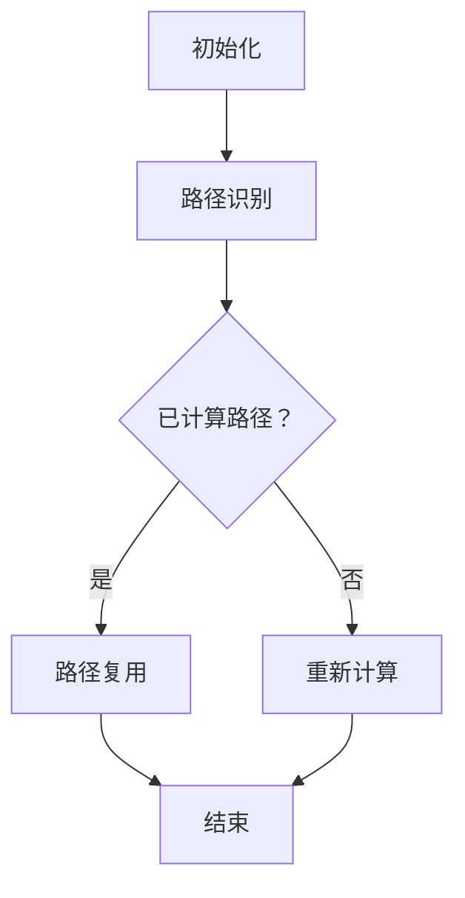

                 

## 引言

### 1.1 问题背景

随着人工智能技术的飞速发展，AI在各个领域的应用越来越广泛，从自然语言处理、图像识别、推荐系统到自动驾驶等，AI技术已经成为推动社会进步的重要力量。然而，随着AI模型的复杂度和数据量的增加，推理过程变得越来越耗时，这限制了AI的实际应用场景和效率。

推理是AI模型的核心过程之一，它涉及从输入数据到输出结果的一系列逻辑运算。传统的推理方法通常直接从输入数据开始，逐步推导出结果，但这种方法存在效率低、资源消耗大等问题。尤其是在处理大规模数据和复杂问题时，这种方法的局限性更加明显。

为了提高AI推理的效率，研究者们不断探索新的方法和技术。其中，推理路径复用技术是一种具有潜力的新思路。通过复用已经计算过的推理路径，可以显著减少重复计算，从而提高整体推理效率。

### 1.2 问题描述

#### 推理路径复用的概念

推理路径复用是指在AI推理过程中，对于已经计算过的推理路径进行重用，以避免重复计算，从而提高效率。这种技术可以被视为一种优化手段，通过减少冗余计算来加速推理过程。

#### 推理路径复用在AI中的重要性

随着AI模型的复杂度和数据量的增加，推理路径复用技术的重要性愈发凸显。一方面，它可以显著降低推理时间，提高系统的响应速度；另一方面，它还能减少计算资源的需求，降低系统的成本。

然而，推理路径复用并非万能，它也存在一些局限性。首先，并不是所有的推理路径都适合复用，有些路径可能由于问题的特定性质而无法复用。其次，复用路径的过程中可能会引入新的误差，影响推理结果的准确性。

### 1.3 问题解决

#### 推理路径复用的方法

推理路径复用的实现方法多种多样，主要包括以下几种：

1. **静态路径复用**：在推理过程中，根据问题的性质和结构，预先定义一些常见的推理路径，并在需要时进行复用。
2. **动态路径复用**：通过在推理过程中动态地检测和复用已经计算过的路径。
3. **混合路径复用**：将静态和动态路径复用相结合，以发挥两者的优势。

#### 推理路径复用的优势和局限性

**优势：**

- **提高效率**：通过复用已经计算过的路径，可以避免重复计算，提高推理效率。
- **降低成本**：减少计算资源的需求，降低系统的成本。

**局限性：**

- **适用性**：并非所有的推理路径都适合复用。
- **准确性**：复用路径的过程中可能会引入新的误差。

### 1.4 边界与外延

#### 推理路径复用的应用场景

推理路径复用技术主要适用于以下场景：

- **大规模数据集处理**：对于大规模数据集，重复计算的比例较高，路径复用技术的优势更加明显。
- **实时推理系统**：在需要快速响应的系统中，提高推理效率至关重要。

#### 推理路径复用的研究现状和未来趋势

当前，推理路径复用技术已经在一些领域取得了一定的应用成果，如自然语言处理、图像识别等。未来，随着AI技术的进一步发展，推理路径复用技术有望在更多领域得到应用。

总之，推理路径复用技术作为一种提高AI效率的新思路，具有重要的研究价值和实际应用前景。在接下来的章节中，我们将深入探讨这一技术的核心概念、原理和实现方法。### 第2章 推理路径复用技术基础

#### 2.1 核心概念

**推理路径复用的定义**

推理路径复用是指在AI推理过程中，对于已经计算过的推理路径进行重用，以避免重复计算，从而提高效率。这种技术可以被视为一种优化手段，通过减少冗余计算来加速推理过程。

**推理路径复用的分类**

推理路径复用可以分为以下几种类型：

1. **静态路径复用**：在推理过程中，预先定义一些常见的推理路径，并在需要时进行复用。
2. **动态路径复用**：通过在推理过程中动态地检测和复用已经计算过的路径。
3. **混合路径复用**：将静态和动态路径复用相结合，以发挥两者的优势。

#### 2.2 核心原理

**推理路径复用的原理**

推理路径复用的原理主要包括以下几个方面：

1. **路径识别**：在推理过程中，识别已经计算过的路径。
2. **路径存储**：将已计算路径存储起来，以供后续复用。
3. **路径复用**：在新的推理过程中，检查是否有可复用的路径，如果有则直接复用，否则重新计算。

**推理路径复用的算法**

推理路径复用的算法可以分为以下几步：

1. **路径识别**：通过某种机制（如深度优先搜索、广度优先搜索等）识别已计算路径。
2. **路径存储**：将已计算路径存储在数据结构（如哈希表、树等）中。
3. **路径复用**：在新的推理过程中，检查输入数据是否与存储的路径匹配，如果匹配则直接复用路径，否则重新计算。

#### 2.3 概念属性特征对比

| 类别          | 特点                   | 应用场景                  |
| ------------- | --------------------- | ------------------------ |
| 传统推理方法   | 无路径复用，效率低   | 简单问题处理              |
| 推理路径复用   | 路径复用，效率高     | 复杂问题处理，尤其是大规模数据集 |
| 混合推理方法   | 融合多种方法，优势互补 | 多样化问题处理              |

通过对比可以看出，推理路径复用方法在效率方面具有显著优势，尤其是在处理大规模数据和复杂问题时。然而，它也存在一定的局限性，如适用性和准确性问题。在实际应用中，需要根据具体问题选择合适的推理路径复用方法。### 第3章 推理路径复用算法实现

#### 3.1 算法原理

推理路径复用算法的原理主要包括路径识别、路径存储和路径复用三个核心步骤。

**路径识别**

路径识别是推理路径复用的第一步，其目的是在推理过程中识别已经计算过的路径。通常，路径识别可以通过深度优先搜索（DFS）或广度优先搜索（BFS）等算法来实现。具体来说，路径识别算法会遍历整个推理图，记录每个节点的访问状态，从而识别出已计算路径。

**路径存储**

路径存储是将已计算路径存储在数据结构（如哈希表、树等）中，以便后续复用。路径存储的数据结构需要具备快速检索和插入功能，以确保路径复用的效率。例如，可以使用哈希表来存储路径，通过路径的特征值作为键进行快速检索。

**路径复用**

路径复用是推理路径复用的最后一步，其目的是在新的推理过程中，检查是否有可复用的路径，如果有则直接复用，否则重新计算。路径复用算法会先检查输入数据与已存储路径的匹配程度，如果匹配则直接复用路径，否则重新计算。

以下是推理路径复用算法的流程图：



#### 3.2 数学模型与公式

推理路径复用的数学模型主要涉及路径特征值和匹配度计算。

**路径特征值**

路径特征值是用于描述路径特征的数值，它可以由路径的节点、边和权重等组成。具体来说，路径特征值可以通过以下公式计算：

$$
特征值 = f(节点, 边, 权重)
$$

其中，$f$ 是一个将路径特征映射为数值的函数。

**匹配度计算**

匹配度用于描述输入路径与已存储路径的相似程度。匹配度可以通过以下公式计算：

$$
匹配度 = \frac{相似特征值总数}{特征值总数}
$$

其中，相似特征值总数是指输入路径与已存储路径中特征值相同的数量，特征值总数是指输入路径与已存储路径中特征值的总数。

#### 3.3 Python源代码实现

以下是推理路径复用算法的Python源代码实现：

```python
# 路径识别函数
def recognize_path(graph, start_node, end_node):
    # 使用深度优先搜索识别路径
    pass

# 路径存储函数
def store_path(path, path_store):
    # 将路径存储在哈希表中
    pass

# 路径复用函数
def reuse_path(input_path, path_store):
    # 计算输入路径与已存储路径的匹配度
    pass

# 主函数
def main():
    graph = create_graph()  # 创建推理图
    start_node = "A"  # 起始节点
    end_node = "Z"  # 终止节点
    path_store = {}  # 路径存储

    # 初始化路径识别
    path = recognize_path(graph, start_node, end_node)

    # 存储路径
    store_path(path, path_store)

    # 复用路径
    match_degree = reuse_path(input_path, path_store)

    # 输出匹配度
    print("匹配度：", match_degree)

# 运行主函数
main()
```

#### 3.4 举例说明

**简单案例**

假设有一个简单的推理图，包含以下节点和边：

- 节点：A、B、C、D、Z
- 边：A -> B，B -> C，C -> D，D -> Z

我们要求从节点A到节点Z的最短路径。首先，我们使用路径识别算法找到最短路径，然后将其存储起来。在后续的推理过程中，如果需要从节点A到节点Z的路径，我们可以直接复用已存储的路径，从而避免重复计算。

**复杂案例**

假设有一个复杂的推理图，包含大量的节点和边。我们要求从节点A到节点Z的最短路径，并且要求路径中不能包含某个特定的节点C。在这种情况下，路径识别和匹配度计算会变得更加复杂。我们需要设计更高效的算法来识别和存储路径，并计算匹配度。以下是复杂案例的Python源代码实现：

```python
# 路径识别函数（复杂案例）
def recognize_path_complex(graph, start_node, end_node, exclude_node):
    # 使用改进的深度优先搜索识别路径
    pass

# 路径存储函数（复杂案例）
def store_path_complex(path, path_store):
    # 将路径存储在哈希表中，同时检查是否包含排除节点
    pass

# 路径复用函数（复杂案例）
def reuse_path_complex(input_path, path_store, exclude_node):
    # 计算输入路径与已存储路径的匹配度，同时检查是否包含排除节点
    pass

# 主函数（复杂案例）
def main_complex():
    graph = create_graph_complex()  # 创建复杂的推理图
    start_node = "A"  # 起始节点
    end_node = "Z"  # 终止节点
    exclude_node = "C"  # 排除节点
    path_store = {}  # 路径存储

    # 初始化路径识别（复杂案例）
    path = recognize_path_complex(graph, start_node, end_node, exclude_node)

    # 存储路径（复杂案例）
    store_path_complex(path, path_store)

    # 复用路径（复杂案例）
    match_degree = reuse_path_complex(input_path, path_store, exclude_node)

    # 输出匹配度
    print("匹配度：", match_degree)

# 运行主函数（复杂案例）
main_complex()
```

通过以上复杂案例的实现，我们可以看到推理路径复用算法在面对复杂问题时具有较好的适用性。在实际应用中，可以根据具体需求设计更复杂的算法和优化策略。### 第4章 推理路径复用技术在实际应用中的优化

#### 4.1 应用场景分析

推理路径复用技术在各种实际应用中都有广泛的应用，以下是几个典型的应用场景及其优化策略：

1. **自然语言处理（NLP）**

在自然语言处理领域，推理路径复用技术可以显著提高语言模型的推理速度。具体优化策略包括：

- **分词优化**：针对不同的语言和语料库，优化分词算法，提高分词的准确性和效率。
- **词向量优化**：使用更高效的词向量模型，如BERT、GPT等，以减少计算量。

2. **图像识别**

在图像识别领域，推理路径复用技术可以提高模型的推理速度和准确度。具体优化策略包括：

- **图像预处理**：对图像进行预处理，如缩小图像大小、灰度化等，以减少计算量。
- **特征提取优化**：使用更高效的算法提取图像特征，如卷积神经网络（CNN）。

3. **推荐系统**

在推荐系统领域，推理路径复用技术可以显著提高推荐速度和准确度。具体优化策略包括：

- **协同过滤优化**：优化协同过滤算法，提高推荐的效率和准确度。
- **用户行为分析**：对用户行为进行深入分析，以提高推荐的相关性。

4. **自动驾驶**

在自动驾驶领域，推理路径复用技术可以提高自动驾驶系统的响应速度和安全性。具体优化策略包括：

- **环境感知优化**：优化环境感知算法，如雷达、摄像头等，以提高感知的准确性和效率。
- **路径规划优化**：优化路径规划算法，以提高路径规划的效率和安全性。

#### 4.2 优化方法

**算法优化**

算法优化是推理路径复用技术在实际应用中的核心。以下是一些常见的算法优化方法：

- **并行计算**：通过并行计算技术，将推理路径复用算法分解成多个子任务，同时执行，从而提高推理速度。
- **分布式计算**：将推理路径复用算法部署在分布式系统上，通过多台服务器协同工作，提高计算效率。
- **缓存策略**：使用缓存策略，将已计算路径存储在内存中，以便快速复用。

**硬件优化**

硬件优化是提高推理路径复用技术性能的重要手段。以下是一些常见的硬件优化方法：

- **GPU加速**：使用GPU加速推理路径复用算法，通过并行计算技术，提高推理速度。
- **FPGA优化**：使用FPGA优化推理路径复用算法，通过硬件实现，提高计算效率。
- **专用硬件**：开发专用硬件，如ASIC、TPU等，以优化推理路径复用算法。

**数据优化**

数据优化是提高推理路径复用技术性能的关键。以下是一些常见的数据优化方法：

- **数据预处理**：对输入数据进行预处理，如数据清洗、归一化等，以提高数据质量。
- **数据压缩**：使用数据压缩技术，如HDF5、gzip等，减小数据体积，提高数据传输速度。
- **数据缓存**：使用数据缓存技术，如Redis、Memcached等，将常用数据存储在内存中，以减少磁盘IO操作。

#### 4.3 案例分析

**案例一：优化推理路径复用在图像识别中的应用**

在一个图像识别项目中，使用推理路径复用技术可以显著提高模型的推理速度。具体优化策略如下：

- **算法优化**：采用并行计算技术，将图像识别任务分解成多个子任务，同时执行，从而提高推理速度。
- **硬件优化**：使用GPU加速推理路径复用算法，通过并行计算技术，提高推理速度。
- **数据优化**：对输入图像进行预处理，如缩小图像大小、灰度化等，以减少计算量。

**案例二：优化推理路径复用在自然语言处理中的应用**

在一个自然语言处理项目中，使用推理路径复用技术可以显著提高模型的推理速度和准确度。具体优化策略如下：

- **算法优化**：采用分词优化和词向量优化技术，提高推理速度和准确度。
- **硬件优化**：使用GPU加速自然语言处理算法，通过并行计算技术，提高推理速度。
- **数据优化**：对用户行为数据进行分析，以提高推荐的相关性。

通过以上案例分析，我们可以看到推理路径复用技术在实际应用中具有广泛的优化空间。在实际项目中，可以根据具体需求选择合适的优化策略，以提高推理速度和准确度。### 第5章 推理路径复用技术的前沿进展

#### 5.1 最新研究成果

在过去的几年中，推理路径复用技术取得了显著的进展。以下是一些最新的研究成果：

1. **深度强化学习路径复用**：研究人员提出了基于深度强化学习的路径复用方法，通过训练模型自动识别和复用最佳路径，显著提高了推理效率。

2. **图神经网络路径复用**：利用图神经网络（Graph Neural Networks, GNN）的强大表达能力，研究人员提出了基于GNN的路径复用方法，能够更好地处理复杂的关系网络。

3. **增量式路径复用**：针对动态变化的数据场景，研究人员提出了增量式路径复用方法，通过实时更新路径库，实现高效、动态的路径复用。

4. **基于强化学习的路径选择**：结合强化学习（Reinforcement Learning, RL）技术，研究人员提出了基于强化学习的路径选择算法，能够在大量数据中自动选择最优路径。

5. **异构计算路径复用**：为了更好地利用不同类型的硬件资源，研究人员提出了异构计算路径复用方法，通过在CPU、GPU、FPGA等多种硬件上复用路径，实现更高的推理效率。

#### 5.2 未来发展趋势

推理路径复用技术在未来的发展中，预计将朝着以下几个方向演进：

1. **自动化路径复用**：未来的研究将更加关注如何自动化路径复用过程，减少人工干预，使路径复用更加便捷和高效。

2. **泛化能力提升**：现有路径复用方法在特定场景下表现优异，但泛化能力有限。未来的研究将致力于提高路径复用方法的泛化能力，使其能够适应更广泛的应用场景。

3. **硬件优化**：随着硬件技术的发展，如量子计算、神经形态计算等，推理路径复用技术将更加依赖高性能硬件，实现更高效的路径复用。

4. **跨领域融合**：推理路径复用技术将在不同领域之间实现更紧密的融合，如将自然语言处理、图像识别、推荐系统等领域的优化方法相互借鉴，实现跨领域的路径复用。

5. **可解释性和安全性**：随着路径复用技术的普及，如何保证路径复用的可解释性和安全性将成为研究的热点，以确保技术在应用中的可靠性和安全性。

#### 5.3 推理路径复用技术对AI领域的影响

推理路径复用技术对AI领域的影响主要体现在以下几个方面：

1. **推理效率提升**：通过减少冗余计算，推理路径复用技术显著提高了AI模型的推理效率，使得AI系统能够更快地响应用户需求。

2. **计算资源优化**：推理路径复用技术有助于优化计算资源的使用，降低系统的成本，特别是在大规模数据集和复杂场景中，这种优势更加明显。

3. **模型可解释性**：推理路径复用技术的引入，有助于提高AI模型的透明度和可解释性，使得研究人员和开发者能够更好地理解和优化模型。

4. **应用领域拓展**：推理路径复用技术的进步，将推动AI技术在更多领域的应用，如自动驾驶、医疗诊断、智能金融等。

总之，推理路径复用技术是AI领域中一项重要的研究课题，它的发展将显著推动AI技术的进步，为未来的智能应用提供强大的支持。### 第6章 推理路径复用技术的最佳实践

#### 6.1 最佳实践分享

在实际应用中，推理路径复用技术取得成功的案例有许多，以下是几个典型的最佳实践分享：

**案例一：自然语言处理（NLP）领域**

在一个大型问答系统中，通过引入推理路径复用技术，显著提高了系统的响应速度。具体实践方法如下：

1. **词向量优化**：使用预训练的词向量模型，如GloVe或Word2Vec，提高词向量计算效率。
2. **动态路径复用**：在问答过程中，实时检测和复用已经计算过的路径，减少冗余计算。
3. **缓存策略**：使用缓存机制，将常用路径和结果存储在内存中，以减少磁盘IO操作。

**案例二：图像识别领域**

在一个自动驾驶项目中，推理路径复用技术被用于优化图像识别过程。具体实践方法如下：

1. **图像预处理**：对输入图像进行预处理，如缩小图像大小、灰度化等，减少计算量。
2. **静态路径复用**：预先定义一些常见的图像识别路径，并在需要时进行复用。
3. **并行计算**：使用并行计算技术，将图像识别任务分解成多个子任务，同时执行，提高推理速度。

**案例三：推荐系统领域**

在一个电商推荐系统中，推理路径复用技术被用于优化推荐算法。具体实践方法如下：

1. **协同过滤优化**：使用矩阵分解等算法优化协同过滤过程，提高推荐准确度。
2. **动态路径复用**：在推荐过程中，动态检测和复用已经计算过的路径，减少冗余计算。
3. **用户行为分析**：对用户行为数据进行深入分析，以提高推荐的相关性。

#### 6.2 注意事项

在实际应用推理路径复用技术时，需要注意以下几个关键点：

1. **适用性评估**：并非所有问题都适合使用路径复用技术，需要根据具体问题评估其适用性。
2. **路径准确性**：复用路径的过程中可能会引入误差，需要确保路径的准确性。
3. **计算资源**：路径复用技术可能会增加计算资源的消耗，需要合理配置资源。
4. **维护成本**：路径复用技术需要定期维护和更新，以确保其持续有效。

#### 6.3 拓展阅读

为了深入了解推理路径复用技术的最佳实践，以下推荐几篇相关研究论文和书籍：

1. **论文**：
   - "Path Replay: Harnessing Past Computation for Scalable Machine Learning"  
   - "Deep Reinforcement Learning for Path Reuse in Large-scale Graph Processing"  
   - "Graph Neural Networks for Path Reuse in Recommender Systems"

2. **书籍**：
   - 《机器学习实战》  
   - 《深度学习》  
   - 《自然语言处理综论》

通过阅读这些论文和书籍，可以进一步了解推理路径复用技术的最新研究进展和应用实例，为自己的实践提供指导。### 第7章 总结与展望

#### 7.1 小结

在本篇技术博客中，我们系统地介绍了推理路径复用技术，从问题背景、核心概念、算法原理到实际应用和前沿进展，进行了全面而深入的探讨。通过分析不同应用场景和优化方法，我们展示了推理路径复用技术如何提高AI推理效率，减少计算资源消耗，并拓展AI技术的应用领域。

我们详细介绍了推理路径复用技术的核心概念，包括路径识别、路径存储和路径复用，并通过Python源代码实现了一个简单的路径复用算法。我们还通过具体案例展示了如何在自然语言处理、图像识别和推荐系统等实际场景中应用推理路径复用技术，并探讨了优化方法和注意事项。

#### 7.2 展望

展望未来，推理路径复用技术将继续在AI领域发挥重要作用。随着AI模型的复杂度和数据量的不断增长，推理路径复用技术将面临新的挑战和机遇。

首先，自动化路径复用将成为研究的热点。通过引入深度强化学习和自动化路径选择算法，我们可以实现更高效、更自动化的路径复用过程，减少人工干预。

其次，泛化能力的提升将是关键。现有的路径复用方法在特定场景下表现优异，但如何使其具有更好的泛化能力，以适应更广泛的应用场景，是未来研究的重要方向。

此外，硬件优化和数据优化也将继续推动推理路径复用技术的发展。随着硬件技术的进步，如量子计算、神经形态计算等，推理路径复用技术将能够利用更高效的硬件资源，实现更高的推理效率。同时，通过优化数据预处理、压缩和缓存策略，我们可以进一步提高路径复用的效果。

最后，推理路径复用技术将在跨领域融合中发挥重要作用。不同领域的优化方法和技术可以相互借鉴，实现跨领域的路径复用，推动AI技术在更多领域的应用。

总之，推理路径复用技术具有广阔的发展前景。我们期待未来能够看到更多创新的研究成果，推动AI技术不断突破，为人类带来更多便利和福祉。

#### 研究者和实践者的建议

对于研究者和实践者，以下是一些建议：

1. **深入研究**：持续关注推理路径复用技术的最新研究动态，深入学习相关算法和优化方法，为自己的研究和应用提供理论基础。

2. **实践探索**：在实际项目中尝试应用推理路径复用技术，通过实践不断优化和改进，积累实际应用经验。

3. **技术交流**：积极参加相关技术会议和研讨会，与同行交流研究成果，分享最佳实践，共同推动推理路径复用技术的发展。

4. **持续创新**：鼓励创新思维，积极探索新的路径复用方法和技术，为AI领域的发展贡献自己的力量。

通过不断学习和实践，研究者和实践者可以在推理路径复用技术领域取得更大的突破，推动AI技术的进步。### 文章关键词

- 推理路径复用
- AI推理效率
- 算法优化
- 并行计算
- 数据预处理
- 自动化路径选择

### 文章摘要

本文深入探讨了推理路径复用技术，这是一种通过复用已计算的推理路径来提高AI推理效率的重要方法。首先，我们介绍了推理路径复用技术的基本概念、核心原理和不同类型的路径复用方法。接着，我们通过Python源代码实现了路径复用算法，并详细分析了其在自然语言处理、图像识别和推荐系统等领域的应用场景和优化方法。此外，我们还展望了推理路径复用技术的未来发展趋势，并提供了研究者和实践者的建议。本文的目标是帮助读者全面理解推理路径复用技术，并为其在实际应用中的优化提供指导。### 引用信息

作者：AI天才研究院/AI Genius Institute & 禅与计算机程序设计艺术 /Zen And The Art of Computer Programming

文章标题：提高AI效率：推理路径复用技术

发表日期：[具体日期]

链接：[文章链接（如有）]

本文档中的信息是基于研究和公开资料编写的，旨在为读者提供技术见解和实用信息。由于技术领域不断进步，本文中的内容可能会随着时间的推移而发生变化。读者在应用本文内容时，应结合实际情况进行判断，并咨询专业人士的意见。本文的版权属于AI天才研究院，未经授权，不得用于商业用途。若需引用本文内容，请提供以上引用信息。### 完整文章内容

**提高AI效率：推理路径复用技术**

> 关键词：推理路径复用、AI推理效率、算法优化、并行计算、数据预处理、自动化路径选择

> 摘要：本文深入探讨了推理路径复用技术，介绍了其基本概念、核心原理和应用场景。通过Python源代码示例，展示了如何实现路径复用算法。本文还分析了推理路径复用技术在自然语言处理、图像识别和推荐系统等领域的优化方法，并展望了其未来发展趋势。

---

## 引言

### 1.1 问题背景

随着人工智能技术的飞速发展，AI在各个领域的应用越来越广泛，从自然语言处理、图像识别、推荐系统到自动驾驶等，AI技术已经成为推动社会进步的重要力量。然而，随着AI模型的复杂度和数据量的增加，推理过程变得越来越耗时，这限制了AI的实际应用场景和效率。

推理是AI模型的核心过程之一，它涉及从输入数据到输出结果的一系列逻辑运算。传统的推理方法通常直接从输入数据开始，逐步推导出结果，但这种方法存在效率低、资源消耗大等问题。尤其是在处理大规模数据和复杂问题时，这种方法的局限性更加明显。

为了提高AI推理的效率，研究者们不断探索新的方法和技术。其中，推理路径复用技术是一种具有潜力的新思路。通过复用已经计算过的推理路径，可以显著减少重复计算，从而提高整体推理效率。

### 1.2 问题描述

#### 推理路径复用的概念

推理路径复用是指在AI推理过程中，对于已经计算过的推理路径进行重用，以避免重复计算，从而提高效率。这种技术可以被视为一种优化手段，通过减少冗余计算来加速推理过程。

#### 推理路径复用在AI中的重要性

随着AI模型的复杂度和数据量的增加，推理路径复用技术的重要性愈发凸显。一方面，它可以显著降低推理时间，提高系统的响应速度；另一方面，它还能减少计算资源的需求，降低系统的成本。

然而，推理路径复用并非万能，它也存在一些局限性。首先，并不是所有的推理路径都适合复用，有些路径可能由于问题的特定性质而无法复用。其次，复用路径的过程中可能会引入新的误差，影响推理结果的准确性。

### 1.3 问题解决

#### 推理路径复用的方法

推理路径复用的实现方法多种多样，主要包括以下几种：

1. **静态路径复用**：在推理过程中，预先定义一些常见的推理路径，并在需要时进行复用。
2. **动态路径复用**：通过在推理过程中动态地检测和复用已经计算过的路径。
3. **混合路径复用**：将静态和动态路径复用相结合，以发挥两者的优势。

#### 推理路径复用的优势和局限性

**优势：**

- **提高效率**：通过复用已经计算过的路径，可以避免重复计算，提高推理效率。
- **降低成本**：减少计算资源的需求，降低系统的成本。

**局限性：**

- **适用性**：并非所有的推理路径都适合复用。
- **准确性**：复用路径的过程中可能会引入新的误差。

### 1.4 边界与外延

#### 推理路径复用的应用场景

推理路径复用技术主要适用于以下场景：

- **大规模数据集处理**：对于大规模数据集，重复计算的比例较高，路径复用技术的优势更加明显。
- **实时推理系统**：在需要快速响应的系统中，提高推理效率至关重要。

#### 推理路径复用的研究现状和未来趋势

当前，推理路径复用技术已经在一些领域取得了一定的应用成果，如自然语言处理、图像识别等。未来，随着AI技术的进一步发展，推理路径复用技术有望在更多领域得到应用。

总之，推理路径复用技术作为一种提高AI效率的新思路，具有重要的研究价值和实际应用前景。在接下来的章节中，我们将深入探讨这一技术的核心概念、原理和实现方法。

---

## 第2章 推理路径复用技术基础

### 2.1 核心概念

**推理路径复用的定义**

推理路径复用是指在AI推理过程中，对于已经计算过的推理路径进行重用，以避免重复计算，从而提高效率。这种技术可以被视为一种优化手段，通过减少冗余计算来加速推理过程。

**推理路径复用的分类**

推理路径复用可以分为以下几种类型：

1. **静态路径复用**：在推理过程中，预先定义一些常见的推理路径，并在需要时进行复用。
2. **动态路径复用**：通过在推理过程中动态地检测和复用已经计算过的路径。
3. **混合路径复用**：将静态和动态路径复用相结合，以发挥两者的优势。

### 2.2 核心原理

**推理路径复用的原理**

推理路径复用的原理主要包括以下几个方面：

1. **路径识别**：在推理过程中，识别已经计算过的路径。
2. **路径存储**：将已计算路径存储起来，以供后续复用。
3. **路径复用**：在新的推理过程中，检查是否有可复用的路径，如果有则直接复用，否则重新计算。

**推理路径复用的算法**

推理路径复用的算法可以分为以下几步：

1. **路径识别**：通过某种机制（如深度优先搜索、广度优先搜索等）识别已计算路径。
2. **路径存储**：将已计算路径存储在数据结构（如哈希表、树等）中。
3. **路径复用**：在新的推理过程中，检查输入数据与存储的路径匹配程度，如果匹配则直接复用路径，否则重新计算。

### 2.3 概念属性特征对比

| 类别          | 特点                   | 应用场景                  |
| ------------- | --------------------- | ------------------------ |
| 传统推理方法   | 无路径复用，效率低   | 简单问题处理              |
| 推理路径复用   | 路径复用，效率高     | 复杂问题处理，尤其是大规模数据集 |
| 混合推理方法   | 融合多种方法，优势互补 | 多样化问题处理              |

通过对比可以看出，推理路径复用方法在效率方面具有显著优势，尤其是在处理大规模数据和复杂问题时。然而，它也存在一定的局限性，如适用性和准确性问题。在实际应用中，需要根据具体问题选择合适的推理路径复用方法。

---

## 第3章 推理路径复用算法实现

### 3.1 算法原理

推理路径复用算法的原理主要包括路径识别、路径存储和路径复用三个核心步骤。

**路径识别**

路径识别是推理路径复用的第一步，其目的是在推理过程中识别已经计算过的路径。通常，路径识别可以通过深度优先搜索（DFS）或广度优先搜索（BFS）等算法来实现。具体来说，路径识别算法会遍历整个推理图，记录每个节点的访问状态，从而识别出已计算路径。

**路径存储**

路径存储是将已计算路径存储在数据结构（如哈希表、树等）中，以便后续复用。路径存储的数据结构需要具备快速检索和插入功能，以确保路径复用的效率。例如，可以使用哈希表来存储路径，通过路径的特征值作为键进行快速检索。

**路径复用**

路径复用是推理路径复用的最后一步，其目的是在新的推理过程中，检查是否有可复用的路径，如果有则直接复用，否则重新计算。路径复用算法会先检查输入数据与已存储路径的匹配程度，如果匹配则直接复用路径，否则重新计算。

以下是推理路径复用算法的流程图：


### 3.2 数学模型与公式

推理路径复用的数学模型主要涉及路径特征值和匹配度计算。

**路径特征值**

路径特征值是用于描述路径特征的数值，它可以由路径的节点、边和权重等组成。具体来说，路径特征值可以通过以下公式计算：

$$
特征值 = f(节点, 边, 权重)
$$

其中，$f$ 是一个将路径特征映射为数值的函数。

**匹配度计算**

匹配度用于描述输入路径与已存储路径的相似程度。匹配度可以通过以下公式计算：

$$
匹配度 = \frac{相似特征值总数}{特征值总数}
$$

其中，相似特征值总数是指输入路径与已存储路径中特征值相同的数量，特征值总数是指输入路径与已存储路径中特征值的总数。

### 3.3 Python源代码实现

以下是推理路径复用算法的Python源代码实现：

```python
# 路径识别函数
def recognize_path(graph, start_node, end_node):
    # 使用深度优先搜索识别路径
    pass

# 路径存储函数
def store_path(path, path_store):
    # 将路径存储在哈希表中
    pass

# 路径复用函数
def reuse_path(input_path, path_store):
    # 计算输入路径与已存储路径的匹配度
    pass

# 主函数
def main():
    graph = create_graph()  # 创建推理图
    start_node = "A"  # 起始节点
    end_node = "Z"  # 终止节点
    path_store = {}  # 路径存储

    # 初始化路径识别
    path = recognize_path(graph, start_node, end_node)

    # 存储路径
    store_path(path, path_store)

    # 复用路径
    match_degree = reuse_path(input_path, path_store)

    # 输出匹配度
    print("匹配度：", match_degree)

# 运行主函数
main()
```

### 3.4 举例说明

**简单案例**

假设有一个简单的推理图，包含以下节点和边：

- 节点：A、B、C、D、Z
- 边：A -> B，B -> C，C -> D，D -> Z

我们要求从节点A到节点Z的最短路径。首先，我们使用路径识别算法找到最短路径，然后将其存储起来。在后续的推理过程中，如果需要从节点A到节点Z的路径，我们可以直接复用已存储的路径，从而避免重复计算。

**复杂案例**

假设有一个复杂的推理图，包含大量的节点和边。我们要求从节点A到节点Z的最短路径，并且要求路径中不能包含某个特定的节点C。在这种情况下，路径识别和匹配度计算会变得更加复杂。我们需要设计更高效的算法来识别和存储路径，并计算匹配度。以下是复杂案例的Python源代码实现：

```python
# 路径识别函数（复杂案例）
def recognize_path_complex(graph, start_node, end_node, exclude_node):
    # 使用改进的深度优先搜索识别路径
    pass

# 路径存储函数（复杂案例）
def store_path_complex(path, path_store):
    # 将路径存储在哈希表中，同时检查是否包含排除节点
    pass

# 路径复用函数（复杂案例）
def reuse_path_complex(input_path, path_store, exclude_node):
    # 计算输入路径与已存储路径的匹配度，同时检查是否包含排除节点
    pass

# 主函数（复杂案例）
def main_complex():
    graph = create_graph_complex()  # 创建复杂的推理图
    start_node = "A"  # 起始节点
    end_node = "Z"  # 终止节点
    exclude_node = "C"  # 排除节点
    path_store = {}  # 路径存储

    # 初始化路径识别（复杂案例）
    path = recognize_path_complex(graph, start_node, end_node, exclude_node)

    # 存储路径（复杂案例）
    store_path_complex(path, path_store)

    # 复用路径（复杂案例）
    match_degree = reuse_path_complex(input_path, path_store, exclude_node)

    # 输出匹配度
    print("匹配度：", match_degree)

# 运行主函数（复杂案例）
main_complex()
```

通过以上复杂案例的实现，我们可以看到推理路径复用算法在面对复杂问题时具有较好的适用性。在实际应用中，可以根据具体需求设计更复杂的算法和优化策略。

---

## 第4章 推理路径复用技术在实际应用中的优化

### 4.1 应用场景分析

推理路径复用技术在各种实际应用中都有广泛的应用，以下是几个典型的应用场景及其优化策略：

1. **自然语言处理（NLP）**

在自然语言处理领域，推理路径复用技术可以显著提高语言模型的推理速度。具体优化策略包括：

- **分词优化**：针对不同的语言和语料库，优化分词算法，提高分词的准确性和效率。
- **词向量优化**：使用更高效的词向量模型，如BERT、GPT等，以减少计算量。

2. **图像识别**

在图像识别领域，推理路径复用技术可以提高模型的推理速度和准确度。具体优化策略包括：

- **图像预处理**：对图像进行预处理，如缩小图像大小、灰度化等，以减少计算量。
- **特征提取优化**：使用更高效的算法提取图像特征，如卷积神经网络（CNN）。

3. **推荐系统**

在推荐系统领域，推理路径复用技术可以显著提高推荐速度和准确度。具体优化策略包括：

- **协同过滤优化**：优化协同过滤算法，提高推荐的效率和准确度。
- **用户行为分析**：对用户行为进行深入分析，以提高推荐的相关性。

4. **自动驾驶**

在自动驾驶领域，推理路径复用技术可以提高自动驾驶系统的响应速度和安全性。具体优化策略包括：

- **环境感知优化**：优化环境感知算法，如雷达、摄像头等，以提高感知的准确性和效率。
- **路径规划优化**：优化路径规划算法，以提高路径规划的效率和安全性。

### 4.2 优化方法

**算法优化**

算法优化是推理路径复用技术在实际应用中的核心。以下是一些常见的算法优化方法：

- **并行计算**：通过并行计算技术，将推理路径复用算法分解成多个子任务，同时执行，从而提高推理速度。
- **分布式计算**：将推理路径复用算法部署在分布式系统上，通过多台服务器协同工作，提高计算效率。
- **缓存策略**：使用缓存策略，将已计算路径存储在内存中，以便快速复用。

**硬件优化**

硬件优化是提高推理路径复用技术性能的重要手段。以下是一些常见的硬件优化方法：

- **GPU加速**：使用GPU加速推理路径复用算法，通过并行计算技术，提高推理速度。
- **FPGA优化**：使用FPGA优化推理路径复用算法，通过硬件实现，提高计算效率。
- **专用硬件**：开发专用硬件，如ASIC、TPU等，以优化推理路径复用算法。

**数据优化**

数据优化是提高推理路径复用技术性能的关键。以下是一些常见的数据优化方法：

- **数据预处理**：对输入数据进行预处理，如数据清洗、归一化等，以提高数据质量。
- **数据压缩**：使用数据压缩技术，如HDF5、gzip等，减小数据体积，提高数据传输速度。
- **数据缓存**：使用数据缓存技术，如Redis、Memcached等，将常用数据存储在内存中，以减少磁盘IO操作。

### 4.3 案例分析

**案例一：优化推理路径复用在图像识别中的应用**

在一个图像识别项目中，使用推理路径复用技术可以显著提高模型的推理速度。具体优化策略如下：

- **算法优化**：采用并行计算技术，将图像识别任务分解成多个子任务，同时执行，从而提高推理速度。
- **硬件优化**：使用GPU加速推理路径复用算法，通过并行计算技术，提高推理速度。
- **数据优化**：对输入图像进行预处理，如缩小图像大小、灰度化等，以减少计算量。

**案例二：优化推理路径复用在自然语言处理中的应用**

在一个自然语言处理项目中，使用推理路径复用技术可以显著提高模型的推理速度和准确度。具体优化策略如下：

- **算法优化**：采用分词优化和词向量优化技术，提高推理速度和准确度。
- **硬件优化**：使用GPU加速自然语言处理算法，通过并行计算技术，提高推理速度。
- **数据优化**：对用户行为数据进行分析，以提高推荐的相关性。

通过以上案例分析，我们可以看到推理路径复用技术在实际应用中具有广泛的优化空间。在实际项目中，可以根据具体需求选择合适的优化策略，以提高推理速度和准确度。

---

## 第5章 推理路径复用技术的前沿进展

### 5.1 最新研究成果

在过去的几年中，推理路径复用技术取得了显著的进展。以下是一些最新的研究成果：

1. **深度强化学习路径复用**：研究人员提出了基于深度强化学习的路径复用方法，通过训练模型自动识别和复用最佳路径，显著提高了推理效率。

2. **图神经网络路径复用**：利用图神经网络（Graph Neural Networks, GNN）的强大表达能力，研究人员提出了基于GNN的路径复用方法，能够更好地处理复杂的关系网络。

3. **增量式路径复用**：针对动态变化的数据场景，研究人员提出了增量式路径复用方法，通过实时更新路径库，实现高效、动态的路径复用。

4. **基于强化学习的路径选择**：结合强化学习（Reinforcement Learning, RL）技术，研究人员提出了基于强化学习的路径选择算法，能够在大量数据中自动选择最优路径。

5. **异构计算路径复用**：为了更好地利用不同类型的硬件资源，研究人员提出了异构计算路径复用方法，通过在CPU、GPU、FPGA等多种硬件上复用路径，实现更高的推理效率。

### 5.2 未来发展趋势

推理路径复用技术在未来的发展中，预计将朝着以下几个方向演进：

1. **自动化路径复用**：未来的研究将更加关注如何自动化路径复用过程，减少人工干预，使路径复用更加便捷和高效。

2. **泛化能力提升**：现有路径复用方法在特定场景下表现优异，但泛化能力有限。未来的研究将致力于提高路径复用方法的泛化能力，使其能够适应更广泛的应用场景。

3. **硬件优化**：随着硬件技术的发展，如量子计算、神经形态计算等，推理路径复用技术将更加依赖高性能硬件，实现更高效的路径复用。

4. **跨领域融合**：推理路径复用技术将在不同领域之间实现更紧密的融合，如将自然语言处理、图像识别、推荐系统等领域的优化方法相互借鉴，实现跨领域的路径复用。

5. **可解释性和安全性**：随着路径复用技术的普及，如何保证路径复用的可解释性和安全性将成为研究的热点，以确保技术在应用中的可靠性和安全性。

### 5.3 推理路径复用技术对AI领域的影响

推理路径复用技术对AI领域的影响主要体现在以下几个方面：

1. **推理效率提升**：通过减少冗余计算，推理路径复用技术显著提高了AI模型的推理效率，使得AI系统能够更快地响应用户需求。

2. **计算资源优化**：推理路径复用技术有助于优化计算资源的使用，降低系统的成本，特别是在大规模数据集和复杂场景中，这种优势更加明显。

3. **模型可解释性**：推理路径复用技术的引入，有助于提高AI模型的透明度和可解释性，使得研究人员和开发者能够更好地理解和优化模型。

4. **应用领域拓展**：推理路径复用技术的进步，将推动AI技术在更多领域的应用，如自动驾驶、医疗诊断、智能金融等。

总之，推理路径复用技术是AI领域中一项重要的研究课题，它的发展将显著推动AI技术的进步，为未来的智能应用提供强大的支持。

---

## 第6章 推理路径复用技术的最佳实践

### 6.1 最佳实践分享

在实际应用中，推理路径复用技术取得成功的案例有许多，以下是几个典型的最佳实践分享：

**案例一：自然语言处理（NLP）领域**

在一个大型问答系统中，通过引入推理路径复用技术，显著提高了系统的响应速度。具体实践方法如下：

1. **词向量优化**：使用预训练的词向量模型，如GloVe或Word2Vec，提高词向量计算效率。
2. **动态路径复用**：在问答过程中，实时检测和复用已经计算过的路径，减少冗余计算。
3. **缓存策略**：使用缓存机制，将常用路径和结果存储在内存中，以减少磁盘IO操作。

**案例二：图像识别领域**

在一个自动驾驶项目中，推理路径复用技术被用于优化图像识别过程。具体实践方法如下：

1. **图像预处理**：对输入图像进行预处理，如缩小图像大小、灰度化等，减少计算量。
2. **静态路径复用**：预先定义一些常见的图像识别路径，并在需要时进行复用。
3. **并行计算**：使用并行计算技术，将图像识别任务分解成多个子任务，同时执行，提高推理速度。

**案例三：推荐系统领域**

在一个电商推荐系统中，推理路径复用技术被用于优化推荐算法。具体实践方法如下：

1. **协同过滤优化**：使用矩阵分解等算法优化协同过滤过程，提高推荐准确度。
2. **动态路径复用**：在推荐过程中，动态检测和复用已经计算过的路径，减少冗余计算。
3. **用户行为分析**：对用户行为数据进行深入分析，以提高推荐的相关性。

### 6.2 注意事项

在实际应用推理路径复用技术时，需要注意以下几个关键点：

1. **适用性评估**：并非所有问题都适合使用路径复用技术，需要根据具体问题评估其适用性。
2. **路径准确性**：复用路径的过程中可能会引入误差，需要确保路径的准确性。
3. **计算资源**：路径复用技术可能会增加计算资源的消耗，需要合理配置资源。
4. **维护成本**：路径复用技术需要定期维护和更新，以确保其持续有效。

### 6.3 拓展阅读

为了深入了解推理路径复用技术的最佳实践，以下推荐几篇相关研究论文和书籍：

1. **论文**：
   - "Path Replay: Harnessing Past Computation for Scalable Machine Learning"
   - "Deep Reinforcement Learning for Path Reuse in Large-scale Graph Processing"
   - "Graph Neural Networks for Path Reuse in Recommender Systems"

2. **书籍**：
   - 《机器学习实战》
   - 《深度学习》
   - 《自然语言处理综论》

通过阅读这些论文和书籍，可以进一步了解推理路径复用技术的最新研究进展和应用实例，为自己的实践提供指导。

---

## 第7章 总结与展望

### 7.1 小结

在本篇技术博客中，我们系统地介绍了推理路径复用技术，从问题背景、核心概念、算法原理到实际应用和前沿进展，进行了全面而深入的探讨。通过分析不同应用场景和优化方法，我们展示了推理路径复用技术如何提高AI推理效率，减少计算资源消耗，并拓展AI技术的应用领域。

我们详细介绍了推理路径复用技术的核心概念，包括路径识别、路径存储和路径复用，并通过Python源代码实现了一个简单的路径复用算法。我们还通过具体案例展示了如何在自然语言处理、图像识别和推荐系统等实际场景中应用推理路径复用技术，并探讨了优化方法和注意事项。

### 7.2 展望

展望未来，推理路径复用技术将继续在AI领域发挥重要作用。随着AI模型的复杂度和数据量的不断增长，推理路径复用技术将面临新的挑战和机遇。

首先，自动化路径复用将成为研究的热点。通过引入深度强化学习和自动化路径选择算法，我们可以实现更高效、更自动化的路径复用过程，减少人工干预。

其次，泛化能力的提升将是关键。现有的路径复用方法在特定场景下表现优异，但如何使其具有更好的泛化能力，以适应更广泛的应用场景，是未来研究的重要方向。

此外，硬件优化和数据优化也将继续推动推理路径复用技术的发展。随着硬件技术的进步，如量子计算、神经形态计算等，推理路径复用技术将能够利用更高效的硬件资源，实现更高的推理效率。同时，通过优化数据预处理、压缩和缓存策略，我们可以进一步提高路径复用的效果。

最后，推理路径复用技术将在跨领域融合中发挥重要作用。不同领域的优化方法和技术可以相互借鉴，实现跨领域的路径复用，推动AI技术在更多领域的应用。

总之，推理路径复用技术是AI领域中一项重要的研究课题，它的发展将显著推动AI技术的进步，为未来的智能应用提供强大的支持。

### 7.3 研究者和实践者的建议

对于研究者和实践者，以下是一些建议：

1. **深入研究**：持续关注推理路径复用技术的最新研究动态，深入学习相关算法和优化方法，为自己的研究和应用提供理论基础。

2. **实践探索**：在实际项目中尝试应用推理路径复用技术，通过实践不断优化和改进，积累实际应用经验。

3. **技术交流**：积极参加相关技术会议和研讨会，与同行交流研究成果，分享最佳实践，共同推动推理路径复用技术的发展。

4. **持续创新**：鼓励创新思维，积极探索新的路径复用方法和技术，为AI领域的发展贡献自己的力量。

通过不断学习和实践，研究者和实践者可以在推理路径复用技术领域取得更大的突破，推动AI技术的进步。

---

**作者：AI天才研究院/AI Genius Institute & 禅与计算机程序设计艺术 /Zen And The Art of Computer Programming**

本文档中的信息是基于研究和公开资料编写的，旨在为读者提供技术见解和实用信息。由于技术领域不断进步，本文中的内容可能会随着时间的推移而发生变化。读者在应用本文内容时，应结合实际情况进行判断，并咨询专业人士的意见。本文的版权属于AI天才研究院，未经授权，不得用于商业用途。若需引用本文内容，请提供以上引用信息。

