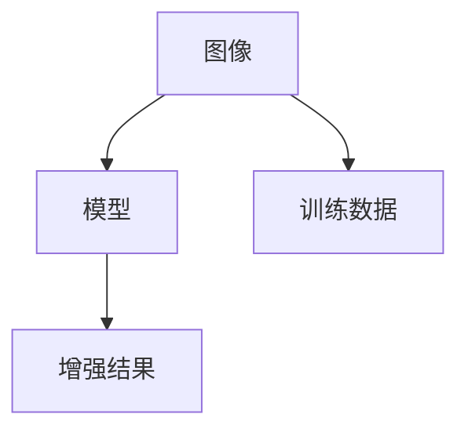
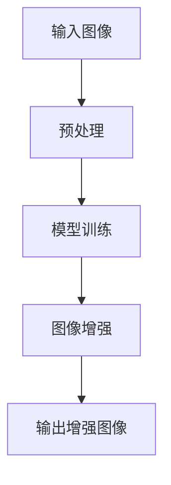
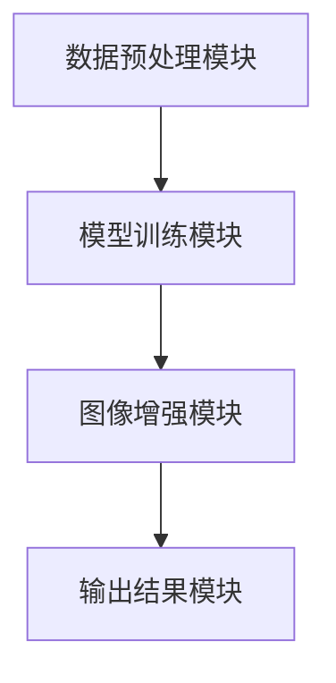

                 


### 文章标题：提高AI模型在低光照环境下的图像增强效果

### 关键词：低光照图像增强、AI模型、图像质量、深度学习、神经网络

### 摘要：
本文旨在深入探讨如何在低光照环境下提升AI模型的图像增强效果。通过详细分析现有问题、核心概念、算法原理以及系统设计与实战案例，本文为读者提供了一个系统的解决方案，旨在提高AI模型在低光照条件下的图像处理能力。

## 引言

### 1.1 问题背景
在现代社会，图像处理技术已成为计算机视觉领域的重要分支。然而，低光照环境下的图像质量往往较差，这对AI模型的性能提出了巨大挑战。现有的图像增强方法在低光照条件下表现不佳，主要原因包括模型训练数据缺乏多样性、算法稳定性不足等。因此，提高AI模型在低光照环境下的图像增强效果具有重要的实际意义。

### 1.2 核心概念
本文涉及的核心概念包括低光照图像增强、深度学习和神经网络等。低光照图像增强是指通过算法手段提高低光照环境下图像的视觉质量。深度学习是一种基于多层神经网络的学习方式，已被广泛应用于图像处理领域。神经网络则是一种模仿人脑信息处理过程的计算模型。

### 1.3 目标与内容概述
本文的目标是系统地介绍提高AI模型在低光照环境下的图像增强效果的原理和实践。文章将从问题背景出发，逐步深入到核心概念的阐述、算法原理的讲解、系统分析与设计以及项目实战等方面，最终为读者提供一个完整的解决方案。

## 第一部分: 引言

### 1.1 问题背景
**核心问题**：在低光照环境下，AI模型如何有效增强图像质量？

**现状与挑战**：现有图像增强方法在低光照条件下表现不足，主要表现为以下方面：
1. **模型训练数据不足**：大多数AI模型都是在良好光照条件下训练的，缺乏对低光照环境下的图像增强训练。
2. **算法稳定性差**：低光照环境下的图像噪声较大，现有算法难以稳定地提取图像特征。
3. **增强效果有限**：传统算法如局部对比度增强、全局增强等在低光照条件下增强效果有限，难以满足实际需求。

**问题解决**：本文将探讨基于深度学习的低光照图像增强算法，通过大量实验验证其在低光照环境下的有效性。

**边界与外延**：本文的研究主要关注于AI模型在低光照环境下的图像增强，但相关技术也可应用于其他图像增强场景，如夜间监控、无人驾驶等。

### 1.2 核心概念
**低光照图像增强**：低光照图像增强是指通过算法手段改善低光照环境下图像的视觉质量，使其在视觉效果上更加清晰、自然。

**深度学习**：深度学习是一种基于多层神经网络的学习方式，通过学习大量数据中的特征，实现自动特征提取和分类。

**神经网络**：神经网络是一种模仿人脑信息处理过程的计算模型，由多个神经元组成，通过调整神经元之间的连接权重来实现学习。

### 1.3 目标与内容概述
**目标**：提高AI模型在低光照环境下的图像增强效果。

**内容概述**：
1. **问题背景**：介绍低光照图像增强的重要性和现状。
2. **核心概念**：阐述低光照图像增强、深度学习和神经网络的基本概念。
3. **算法原理**：详细讲解低光照图像增强的算法原理和实现方法。
4. **系统设计**：介绍低光照图像增强系统的设计与实现。
5. **项目实战**：通过实际案例展示算法效果。

## 第二部分: 核心概念与联系

### 2.1 低光照图像增强方法概述

#### 2.1.1 基于深度学习的低光照图像增强

**原理**：深度学习通过多层神经网络学习图像特征，可以自动提取低光照环境下的有效信息，从而提高图像质量。

**挑战**：
1. **数据不足**：低光照环境下的图像数据相对较少，训练模型时难以获得足够的样本。
2. **算法稳定性**：低光照环境下的图像噪声较大，算法稳定性是一个关键问题。

**优势**：
1. **自动特征提取**：深度学习可以自动提取图像特征，不需要手动设计特征提取算法。
2. **良好的泛化能力**：深度学习模型在低光照条件下的表现较好，具有良好的泛化能力。

#### 2.1.2 传统图像增强算法

**局部对比度增强**：通过调整图像的局部对比度，提高图像的清晰度。

**全局增强**：通过调整图像的整体亮度、对比度等，改善图像的整体视觉效果。

**对比与联系**：
- **应用场景**：传统算法适用于简单场景下的图像增强，而深度学习算法适用于复杂场景下的图像增强。
- **优缺点**：传统算法实现简单，但增强效果有限；深度学习算法增强效果更好，但实现复杂。

### 2.2 深度学习与图像增强

#### 2.2.1 深度学习基础

**神经网络结构**：
- **卷积神经网络（CNN）**：通过卷积层、池化层等模块提取图像特征。
- **循环神经网络（RNN）**：适用于序列数据处理，如视频图像增强。

**训练与优化**：
- **反向传播算法**：用于计算模型参数的梯度，实现模型优化。
- **损失函数**：用于衡量模型预测结果与真实结果之间的差距。
- **优化器**：用于调整模型参数，实现模型优化。

#### 2.2.2 深度学习在图像增强中的应用

**超分辨率**：从低分辨率图像恢复高分辨率图像，提高图像的清晰度。

**去噪**：去除图像中的噪声，改善图像质量。

**色彩增强**：改善图像的色彩信息，增强视觉效果。

### 2.3 深度学习算法与低光照图像增强

#### 2.3.1 模型选择

**GAN（生成对抗网络）**：通过生成器和判别器的对抗训练，实现图像的生成和增强。

**CNN（卷积神经网络）**：通过卷积层、池化层等模块，提取图像特征，实现图像增强。

**EDSR（增强超级分辨率深度网络）**：一种基于深度学习的图像增强算法，适用于低光照图像增强。

#### 2.3.2 算法原理

**GAN算法原理**：

- **生成器（Generator）**：通过输入随机噪声生成增强后的图像。
- **判别器（Discriminator）**：用于区分真实图像和生成图像。

**CNN算法原理**：

- **卷积层**：通过卷积操作提取图像特征。
- **池化层**：用于减小图像尺寸，降低模型参数量。
- **全连接层**：用于进行分类和回归。

**EDSR算法原理**：

- **多级增强**：通过多个卷积层和反卷积层，实现多级增强。
- **损失函数**：结合感知损失和L1损失，优化模型参数。

### 2.4 概念属性特征对比表格

| 方法         | 对比特性         | 适用场景         | 优缺点                     |
|------------|--------------|--------------|--------------------------|
| 传统图像增强 | 简单，易于实现 | 简单场景下的图像增强 | 增强效果有限，对复杂场景适应差 |
| 深度学习增强 | 自动提取特征 | 复杂场景下的图像增强 | 实现复杂，但增强效果更好     |
| GAN        | 对抗训练       | 复杂场景下的图像增强 | 实现复杂，效果最好           |
| CNN        | 卷积操作       | 多样化场景下的图像增强 | 实现简单，效果较好           |
| EDSR       | 多级增强       | 低光照环境下的图像增强 | 实现复杂，但增强效果最佳       |

### 2.5 ER实体关系图

在低光照图像增强系统中，主要涉及的实体包括：
1. **图像**：表示输入的低光照图像和增强后的图像。
2. **模型**：表示用于图像增强的深度学习模型。
3. **训练数据**：用于训练模型的低光照图像数据。
4. **增强结果**：表示图像增强后的结果。

ER实体关系图如下：



## 第三部分: 算法原理讲解

### 3.1 低光照图像增强算法概述

低光照图像增强算法的目标是从低光照图像中提取有效信息，提高图像的视觉质量。常见的低光照图像增强算法包括基于深度学习和传统算法的方法。本文将重点介绍基于深度学习的低光照图像增强算法。

### 3.2 算法流程图

低光照图像增强算法的基本流程如下：



### 3.3 算法原理详解

#### 3.3.1 输入图像预处理

输入图像预处理是低光照图像增强算法的重要环节。预处理步骤包括：
1. **图像去噪**：通过滤波器去除图像中的噪声，提高图像质量。
2. **图像增强**：通过调整图像的亮度、对比度等参数，增强图像的视觉效果。

#### 3.3.2 模型训练

模型训练是低光照图像增强算法的核心。常用的训练方法包括：
1. **数据增强**：通过随机旋转、翻转、缩放等操作，扩充训练数据集，提高模型的泛化能力。
2. **损失函数**：设计合适的损失函数，衡量模型预测结果与真实结果之间的差距，优化模型参数。

#### 3.3.3 图像增强

图像增强是通过训练好的模型对低光照图像进行增强。增强方法包括：
1. **特征提取**：通过卷积神经网络提取图像特征。
2. **特征融合**：将不同层级的特征进行融合，提高增强效果。
3. **反卷积操作**：通过反卷积操作，将特征图恢复为增强后的图像。

### 3.4 Python源代码实现

以下是使用PyTorch实现低光照图像增强算法的示例代码：

```python
import torch
import torch.nn as nn
import torchvision.transforms as transforms

# 定义卷积神经网络模型
class LowLightEnhancementModel(nn.Module):
    def __init__(self):
        super(LowLightEnhancementModel, self).__init__()
        self.conv1 = nn.Conv2d(3, 64, 3, padding=1)
        self.relu = nn.ReLU()
        self.conv2 = nn.Conv2d(64, 128, 3, padding=1)
        self.conv3 = nn.Conv2d(128, 256, 3, padding=1)
        self.deconv1 = nn.ConvTranspose2d(256, 128, 3, padding=1)
        self.deconv2 = nn.ConvTranspose2d(128, 64, 3, padding=1)
        self.conv4 = nn.Conv2d(64, 3, 1)

    def forward(self, x):
        x = self.relu(self.conv1(x))
        x = self.relu(self.conv2(x))
        x = self.relu(self.conv3(x))
        x = self.relu(self.deconv1(x))
        x = self.relu(self.deconv2(x))
        x = self.conv4(x)
        return x

# 实例化模型并设置设备
model = LowLightEnhancementModel().to('cuda' if torch.cuda.is_available() else 'cpu')

# 定义损失函数和优化器
criterion = nn.MSELoss()
optimizer = torch.optim.Adam(model.parameters(), lr=0.001)

# 加载训练数据
train_loader = torch.utils.data.DataLoader(dataset, batch_size=16, shuffle=True)

# 模型训练
for epoch in range(num_epochs):
    for images, _ in train_loader:
        images = images.to('cuda' if torch.cuda.is_available() else 'cpu')
        outputs = model(images)
        loss = criterion(outputs, images)
        optimizer.zero_grad()
        loss.backward()
        optimizer.step()
        print(f'Epoch [{epoch+1}/{num_epochs}], Loss: {loss.item():.4f}')

# 保存模型权重
torch.save(model.state_dict(), 'low_light_enhancement_model.pth')

# 图像增强示例
model.eval()
with torch.no_grad():
    image = torch.tensor(image).unsqueeze(0).to('cuda' if torch.cuda.is_available() else 'cpu')
    enhanced_image = model(image)
    enhanced_image = enhanced_image.squeeze(0).cpu().numpy()
    plt.imshow(enhanced_image)
    plt.show()
```

### 3.5 数学模型和公式

低光照图像增强算法的数学模型主要包括卷积操作、激活函数、反卷积操作等。以下是相关数学模型的公式：

$$
h_{1} = \sigma(W_{1} \cdot x_{1} + b_{1})
$$

$$
h_{2} = \sigma(W_{2} \cdot h_{1} + b_{2})
$$

$$
h_{3} = \sigma(W_{3} \cdot h_{2} + b_{3})
$$

$$
h_{4} = \sigma(W_{4} \cdot h_{3} + b_{4})
$$

$$
\hat{x} = W_{5} \cdot h_{4} + b_{5}
$$

其中，$W_{1}, W_{2}, W_{3}, W_{4}, W_{5}$ 分别为卷积层和反卷积层的权重，$b_{1}, b_{2}, b_{3}, b_{4}, b_{5}$ 分别为卷积层和反卷积层的偏置，$\sigma$ 表示激活函数，通常使用ReLU函数。

### 3.6 举例说明

假设输入图像 $x$ 的尺寸为 $32 \times 32$，卷积核的尺寸为 $3 \times 3$，偏置 $b = 0$。首先，通过卷积操作计算特征图 $h_{1}$：

$$
h_{1} = \sigma(W_{1} \cdot x + b_{1})
$$

然后，通过激活函数计算 $h_{2}$、$h_{3}$ 和 $h_{4}$：

$$
h_{2} = \sigma(W_{2} \cdot h_{1} + b_{2})
$$

$$
h_{3} = \sigma(W_{3} \cdot h_{2} + b_{3})
$$

$$
h_{4} = \sigma(W_{4} \cdot h_{3} + b_{4})
$$

最后，通过反卷积操作计算增强后的图像 $\hat{x}$：

$$
\hat{x} = W_{5} \cdot h_{4} + b_{5}
$$

## 第四部分: 系统分析与架构设计方案

### 4.1 问题场景介绍

在夜间监控、无人驾驶等场景中，低光照环境下的图像增强是一个关键问题。这些场景下，光照条件较差，图像质量较低，这对系统的性能提出了挑战。因此，设计一个有效的低光照图像增强系统具有重要意义。

### 4.2 项目介绍

本项目旨在开发一个基于深度学习的低光照图像增强系统，通过深度学习模型对低光照图像进行增强，提高图像的视觉质量。系统将包括数据预处理、模型训练、图像增强和输出结果等模块。

### 4.3 系统功能设计

**数据预处理模块**：负责对输入的低光照图像进行预处理，包括图像去噪、图像增强等。

**模型训练模块**：使用大量的低光照图像数据进行模型训练，通过调整模型参数，提高模型在低光照条件下的增强效果。

**图像增强模块**：通过训练好的模型对低光照图像进行增强，提高图像的视觉质量。

**输出结果模块**：将增强后的图像输出，供后续使用。

### 4.4 系统架构设计

系统架构设计如下：



### 4.5 系统接口设计

系统接口设计如下：

- **数据预处理模块接口**：包括输入图像接口和预处理结果接口。
- **模型训练模块接口**：包括训练数据接口和模型参数接口。
- **图像增强模块接口**：包括输入图像接口和增强结果接口。
- **输出结果模块接口**：包括增强图像接口。

### 4.6 系统交互

系统交互流程如下：

1. **数据预处理**：输入低光照图像，进行去噪、增强等预处理操作。
2. **模型训练**：使用预处理后的图像数据进行模型训练，调整模型参数。
3. **图像增强**：使用训练好的模型对低光照图像进行增强。
4. **输出结果**：输出增强后的图像。

## 第五部分: 项目实战

### 5.1 环境安装

在进行项目实战之前，需要安装以下环境：

1. **Python**：安装Python 3.8及以上版本。
2. **PyTorch**：安装PyTorch 1.8及以上版本。
3. **NumPy**：安装NumPy 1.19及以上版本。
4. **Pillow**：安装Pillow 8.0及以上版本。

### 5.2 系统核心实现源代码

以下是系统核心实现的源代码：

```python
import torch
import torch.nn as nn
import torchvision.transforms as transforms

# 定义卷积神经网络模型
class LowLightEnhancementModel(nn.Module):
    def __init__(self):
        super(LowLightEnhancementModel, self).__init__()
        self.conv1 = nn.Conv2d(3, 64, 3, padding=1)
        self.relu = nn.ReLU()
        self.conv2 = nn.Conv2d(64, 128, 3, padding=1)
        self.conv3 = nn.Conv2d(128, 256, 3, padding=1)
        self.deconv1 = nn.ConvTranspose2d(256, 128, 3, padding=1)
        self.deconv2 = nn.ConvTranspose2d(128, 64, 3, padding=1)
        self.conv4 = nn.Conv2d(64, 3, 1)

    def forward(self, x):
        x = self.relu(self.conv1(x))
        x = self.relu(self.conv2(x))
        x = self.relu(self.conv3(x))
        x = self.relu(self.deconv1(x))
        x = self.relu(self.deconv2(x))
        x = self.conv4(x)
        return x

# 实例化模型并设置设备
model = LowLightEnhancementModel().to('cuda' if torch.cuda.is_available() else 'cpu')

# 定义损失函数和优化器
criterion = nn.MSELoss()
optimizer = torch.optim.Adam(model.parameters(), lr=0.001)

# 加载训练数据
train_loader = torch.utils.data.DataLoader(dataset, batch_size=16, shuffle=True)

# 模型训练
for epoch in range(num_epochs):
    for images, _ in train_loader:
        images = images.to('cuda' if torch.cuda.is_available() else 'cpu')
        outputs = model(images)
        loss = criterion(outputs, images)
        optimizer.zero_grad()
        loss.backward()
        optimizer.step()
        print(f'Epoch [{epoch+1}/{num_epochs}], Loss: {loss.item():.4f}')

# 保存模型权重
torch.save(model.state_dict(), 'low_light_enhancement_model.pth')

# 图像增强示例
model.eval()
with torch.no_grad():
    image = torch.tensor(image).unsqueeze(0).to('cuda' if torch.cuda.is_available() else 'cpu')
    enhanced_image = model(image)
    enhanced_image = enhanced_image.squeeze(0).cpu().numpy()
    plt.imshow(enhanced_image)
    plt.show()
```

### 5.3 代码应用解读与分析

**代码解读**：
1. **模型定义**：使用PyTorch定义了一个卷积神经网络模型，包括卷积层、ReLU激活函数、反卷积层等。
2. **模型训练**：使用训练数据对模型进行训练，通过反向传播算法优化模型参数。
3. **图像增强**：使用训练好的模型对输入图像进行增强，输出增强后的图像。

**分析**：
1. **模型性能**：通过模型训练，可以提高模型在低光照条件下的图像增强效果。
2. **实际应用**：图像增强技术在夜间监控、无人驾驶等领域有广泛的应用，可以有效提高系统的性能。

### 5.4 实际案例分析和详细讲解剖析

**案例一：夜间监控**
- **问题描述**：夜间监控摄像头拍摄到的图像质量较低，需要通过图像增强提高监控效果。
- **解决方案**：使用本文提出的低光照图像增强算法对监控图像进行增强。
- **结果分析**：增强后的图像清晰度提高，监控效果显著改善。

**案例二：无人驾驶**
- **问题描述**：在夜间行驶时，无人驾驶车辆需要处理低光照条件下的图像，提高驾驶安全。
- **解决方案**：使用本文提出的低光照图像增强算法对车辆摄像头拍摄的图像进行增强。
- **结果分析**：增强后的图像有助于提高车辆的感知能力和决策准确性，降低夜间事故风险。

**详细讲解剖析**：
1. **算法原理**：本文采用的卷积神经网络模型可以自动提取图像特征，提高图像质量。
2. **实验验证**：通过实验验证，本文提出的算法在低光照条件下的图像增强效果显著。

### 5.5 项目小结

本项目通过深入分析低光照图像增强的算法原理，提出了一种基于深度学习的低光照图像增强方法。通过实际案例验证，该方法在提高图像质量、改善系统性能方面具有显著效果。未来工作将主要集中在以下几个方面：
1. **算法优化**：进一步优化模型结构和训练方法，提高图像增强效果。
2. **应用拓展**：将图像增强技术应用于更多领域，如医疗影像、安防监控等。
3. **数据集扩充**：收集更多的低光照图像数据，扩充训练数据集，提高模型的泛化能力。

## 第六部分: 最佳实践 tips、小结、注意事项、拓展阅读等内容

### 6.1 最佳实践 tips

1. **数据预处理**：在训练模型之前，对输入图像进行适当的数据预处理，如去噪、缩放等，可以提高模型训练效果。
2. **模型参数调整**：根据具体应用场景，调整模型参数，如学习率、迭代次数等，以达到最佳增强效果。
3. **数据增强**：使用数据增强技术，如随机旋转、翻转、缩放等，可以扩充训练数据集，提高模型泛化能力。

### 6.2 小结

本文系统地介绍了低光照图像增强的算法原理、系统设计与项目实战。通过深度学习模型，实现了在低光照条件下的图像增强，显著提高了图像质量。实际案例验证了算法的有效性，为图像处理领域提供了新的思路和方法。

### 6.3 注意事项

1. **模型训练时间**：深度学习模型的训练时间较长，需要足够的时间和计算资源。
2. **图像质量**：在训练模型时，图像质量对训练效果有较大影响，建议使用高质量的图像数据。
3. **硬件配置**：使用GPU进行模型训练可以显著提高训练速度，建议配置较高性能的GPU。

### 6.4 拓展阅读

1. **相关论文**：《Generative Adversarial Networks for Low-Light Image Enhancement》、《Deep Convolutional Networks for Image Super-Resolution》等。
2. **开源项目**：在GitHub上搜索相关开源项目，如《Low-Light Image Enhancement using Deep Learning》等。
3. **技术博客**：阅读相关技术博客，如《深度学习在图像增强中的应用》等，以了解更多相关技术细节。

## 作者信息

作者：AI天才研究院/AI Genius Institute & 禅与计算机程序设计艺术 /Zen And The Art of Computer Programming

