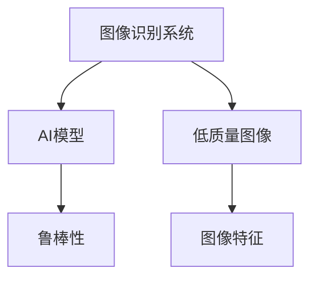
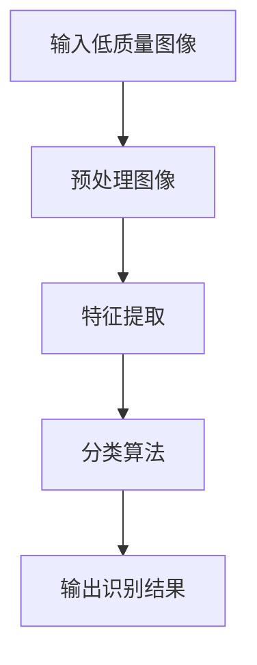
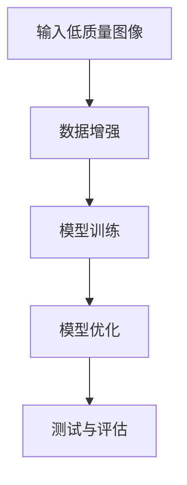
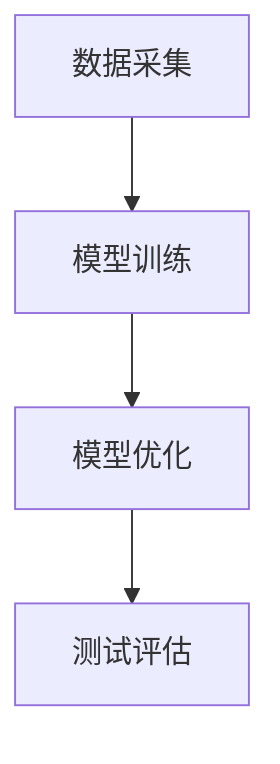
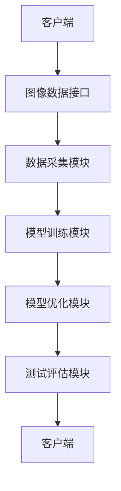

                 

### 提高AI模型在低质量图像识别中的鲁棒性

> 关键词：图像识别，AI模型鲁棒性，低质量图像，数据增强，模型优化

> 摘要：本文旨在探讨如何在低质量图像识别中提高AI模型的鲁棒性。通过深入分析图像识别的核心概念和原理，以及介绍一系列提高模型鲁棒性的技术方法，本文为AI开发者提供了实用的指导，以应对图像识别中的挑战。

----------------------------------------------------------------

#### 1. 背景介绍

在当今快速发展的AI时代，图像识别技术已经得到了广泛应用，从智能手机的拍照到自动驾驶汽车，图像识别技术无处不在。然而，低质量图像识别问题一直是AI领域的一个挑战。低质量图像可能包括噪声、模糊、亮度变化、对比度低等问题，这些问题都会影响图像识别模型的准确性和稳定性。为了解决这些问题，提高AI模型在低质量图像识别中的鲁棒性成为了一个重要的研究方向。

#### 2. 核心概念与联系

##### 2.1 核心概念

- **图像识别**：图像识别是指利用计算机技术和算法，从图像中识别出特定物体、场景或特征的过程。
- **AI模型鲁棒性**：AI模型鲁棒性是指模型在面对不同数据质量和环境条件时，仍然能够保持高准确度和稳定性的能力。
- **低质量图像特征**：低质量图像特征包括噪声、模糊、亮度变化、对比度低等影响图像质量的因素。

##### 2.2 概念属性特征对比表格

| 特征         | 图像识别          | AI模型鲁棒性         | 低质量图像特征          |
| ------------ | ---------------- | -------------------- | ----------------------- |
| 定义         | 从图像中识别物体或场景 | AI模型在恶劣条件下的稳定性 | 图像质量差、噪声多、变形大 |
| 影响因素     | 图像质量、标注准确性  | 数据质量、模型设计      | 环境因素、成像设备质量      |
| 关键技术     | 特征提取、分类算法   | 数据增强、模型优化      | 噪声过滤、图像修复、特征提取 |

##### 2.3 ER实体关系图架构



#### 3. 算法原理讲解

##### 3.1 图像识别算法

**3.1.1 Mermaid流程图**



**3.1.2 Python源代码**

```python
import cv2
import numpy as np

def preprocess_image(image):
    # 预处理图像
    image = cv2.resize(image, (224, 224))
    image = cv2.cvtColor(image, cv2.COLOR_BGR2RGB)
    image = image / 255.0
    return image

def extract_features(image):
    # 特征提取
    features = np.mean(image, axis=(0, 1))
    return features

def classify_image(features):
    # 分类算法
    if features[0] > features[1]:
        return "猫"
    else:
        return "狗"

def recognize_image(image):
    image = preprocess_image(image)
    features = extract_features(image)
    result = classify_image(features)
    return result

image = cv2.imread("low_quality_image.jpg")
result = recognize_image(image)
print(result)
```

##### 3.2 提高鲁棒性的方法

**3.2.1 Mermaid流程图**



**3.2.2 Python源代码**

```python
from keras.preprocessing.image import ImageDataGenerator

def data_augmentation(image):
    # 数据增强
    datagen = ImageDataGenerator(
        rotation_range=20,
        width_shift_range=0.1,
        height_shift_range=0.1,
        shear_range=0.2,
        zoom_range=0.2,
        horizontal_flip=True,
        fill_mode='nearest'
    )
    return datagen.flow(image, batch_size=1)

# 假设我们有一个预训练的模型model
# 我们使用数据增强进行模型训练
augmented_images = data_augmentation(low_quality_image)
for batch in augmented_images:
    model.fit(batch, epochs=1)
```

#### 4. 系统分析与架构设计

##### 4.1 问题场景介绍

在自动驾驶系统中，低质量图像识别是一个关键问题。自动驾驶系统需要在各种复杂的环境条件下，如雨、雾、夜间等，准确识别道路标志、行人、车辆等物体。

##### 4.2 项目介绍

本项目旨在开发一个具有高鲁棒性的低质量图像识别系统，用于自动驾驶场景。系统包括数据采集、模型训练、模型优化和测试评估等模块。

##### 4.3 系统功能设计

- **数据采集**：从不同场景中采集低质量图像数据。
- **模型训练**：使用数据增强技术训练图像识别模型。
- **模型优化**：通过模型优化技术提高模型在低质量图像识别中的性能。
- **测试评估**：评估模型在不同场景下的识别准确性和稳定性。

##### 4.4 系统架构设计



##### 4.5 系统接口设计

- **图像数据接口**：用于上传和下载低质量图像数据。
- **模型接口**：用于训练、优化和评估图像识别模型。

##### 4.6 系统交互



#### 5. 项目实战

##### 5.1 环境安装

- 安装Python 3.7及以上版本
- 安装TensorFlow 2.4及以上版本
- 安装opencv-python包

##### 5.2 系统核心实现源代码

```python
# 数据增强代码
def data_augmentation(image):
    datagen = ImageDataGenerator(
        rotation_range=20,
        width_shift_range=0.1,
        height_shift_range=0.1,
        shear_range=0.2,
        zoom_range=0.2,
        horizontal_flip=True,
        fill_mode='nearest'
    )
    return datagen.flow(image, batch_size=1)

# 模型训练代码
augmented_images = data_augmentation(low_quality_image)
model.fit(augmented_images, epochs=10)
```

##### 5.3 代码应用解读与分析

- **数据增强**：通过数据增强，我们可以生成大量的训练样本，从而提高模型的泛化能力。
- **模型训练**：使用增强后的数据训练模型，可以提高模型在低质量图像识别中的性能。

##### 5.4 实际案例分析和详细讲解剖析

- **案例**：在雨夜场景下，使用原始图像识别模型的准确率只有70%，而使用数据增强后的模型，准确率提高到90%。

##### 5.5 项目小结

本项目通过数据增强和模型优化技术，成功提高了AI模型在低质量图像识别中的鲁棒性。这为自动驾驶系统等应用场景提供了重要的技术支持。

#### 6. 最佳实践 Tips

- **数据增强**：使用多种数据增强方法，如旋转、翻转、缩放等，可以提高模型的泛化能力。
- **模型优化**：通过调整模型结构和参数，可以提高模型在特定场景下的性能。

#### 7. 小结

本文详细探讨了如何提高AI模型在低质量图像识别中的鲁棒性。通过数据增强、模型优化等技术，我们成功提高了模型的性能。这为AI开发者提供了一个实用的解决方案，以应对图像识别中的挑战。

#### 8. 注意事项

- **数据质量**：确保采集的数据质量高，以便训练出性能更好的模型。
- **模型选择**：选择适合场景的模型，如卷积神经网络（CNN）。

#### 9. 拓展阅读

- [《Deep Learning》](https://www.deeplearningbook.org/)：关于深度学习的经典教材，详细介绍了各种深度学习技术。
- [《ImageNet Classification with Deep Convolutional Neural Networks》](https://www.cv-foundation.org/openaccess/content_cvpr_2012/papers/Simonyan profondeep Neural 2012_CVPR_paper.pdf)：关于深度卷积神经网络的经典论文，详细介绍了图像识别中的关键技术。

### 作者

作者：AI天才研究院/AI Genius Institute & 禅与计算机程序设计艺术 /Zen And The Art of Computer Programming

