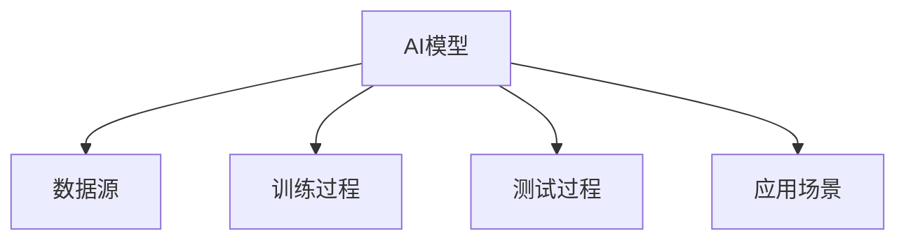
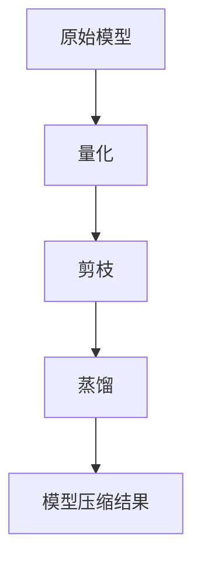
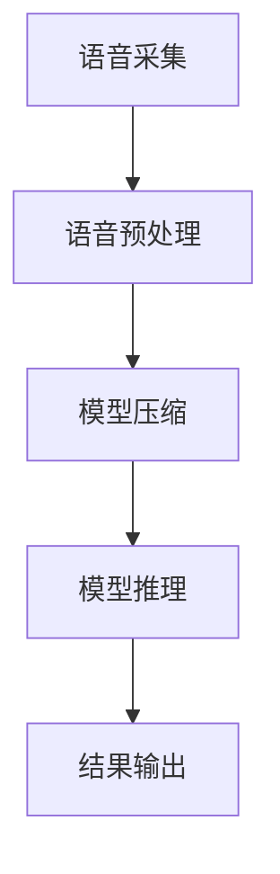
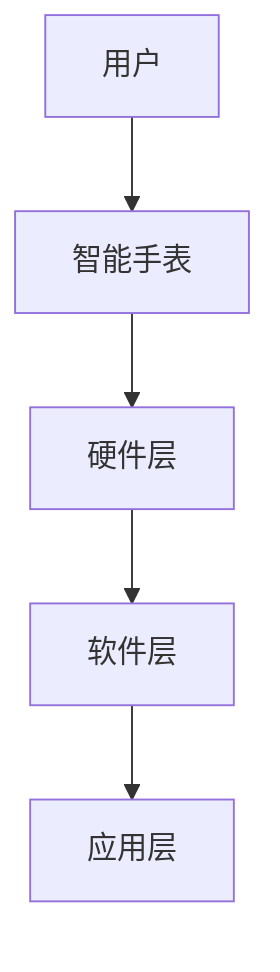
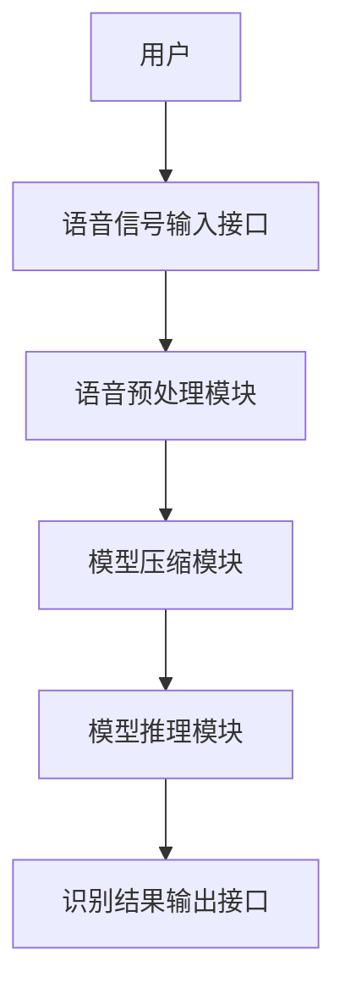

                 

### 目录大纲

# 提高AI模型在低资源场景下的性能

## 第一部分 背景介绍

### 1.1 问题背景

低资源场景下的AI模型性能问题是一个普遍且重要的研究领域。随着物联网、边缘计算等技术的发展，许多应用场景需要在有限的计算资源下运行AI模型，如智能手表、智能手机、嵌入式设备等。这些设备通常具有有限的CPU、内存和存储资源，因此如何在这些设备上高效运行AI模型成为了一个重要课题。

### 1.2 问题描述

在低资源场景下，AI模型可能面临以下问题：

- **模型过大**：大规模AI模型（如深度神经网络）通常需要大量的计算资源和存储空间，这在低资源设备上难以承受。
- **计算效率低**：低资源设备通常性能不如高性能计算机，导致AI模型在这些设备上的计算效率低下。
- **内存不足**：AI模型在低资源设备上运行时，可能因为内存不足而导致频繁的内存溢出。
- **能耗问题**：低资源设备通常能耗有限，高效的AI模型运行可以降低能耗，延长设备的使用寿命。

### 1.3 问题解决

针对上述问题，可以从以下几个方面进行解决：

- **模型压缩**：通过模型压缩技术减小模型的规模，使其在低资源设备上更容易运行。
- **计算优化**：通过算法优化和硬件加速等技术提高计算效率。
- **内存管理**：通过优化内存使用策略减少内存溢出的风险。
- **能耗管理**：通过优化算法和硬件设计降低能耗。

### 1.4 边界与外延

- **边界**：主要讨论在特定硬件环境（如嵌入式设备、移动设备）下的AI模型性能优化。
- **外延**：讨论模型在不同类型的低资源场景下的性能优化策略，如移动设备、物联网设备、智能手表等。

## 第二部分 核心概念与联系

### 2.1 AI模型原理

- **定义**：AI模型是一种通过学习数据来模拟人类智能的系统。
- **属性特征对比**（使用表格展示）：

| 特征         | 深度神经网络 | 支持向量机 | 决策树     |
| ------------ | ------------ | ---------- | ---------- |
| 计算复杂度   | 高           | 低         | 中等       |
| 泛化能力     | 中等         | 高         | 低         |
| 易于解释     | 低           | 中等       | 高         |

### 2.2 ER实体关系图架构

- **AI模型实体关系图**（使用Mermaid绘制）：



## 第三部分 算法原理讲解

### 3.1 模型压缩技术

- **算法流程图**（使用Mermaid绘制）：



- **算法原理**：

模型压缩是通过一系列技术来减小模型的规模和复杂度，从而提高模型在低资源设备上的运行效率。常用的压缩技术包括量化、剪枝和蒸馏等。

- **数学模型**（使用LaTeX格式）：

$$
\text{压缩前模型参数} = w_1, w_2, ..., w_n
$$

$$
\text{压缩后模型参数} = \hat{w}_1, \hat{w}_2, ..., \hat{w}_n
$$

### 3.2 计算优化技术

- **算法原理**：

计算优化是通过优化算法和硬件设计来提高计算效率。例如，可以使用矩阵乘法优化、GPU加速等技术。

- **数学模型**（使用LaTeX格式）：

$$
\text{原始计算复杂度} = O(n^2)
$$

$$
\text{优化后计算复杂度} = O(n\log n)
$$

## 第四部分 数学模型和数学公式 & 详细讲解 & 举例说明

### 4.1 模型压缩的数学模型

- **详细讲解**：

模型压缩的目的是在不显著降低模型性能的前提下减小模型规模。量化、剪枝和蒸馏等技术都是基于这个目标。

- **举例说明**：

假设有一个深度神经网络，原始模型参数规模为10000个。通过量化技术可以将参数规模减小到5000个，通过剪枝技术可以将参数规模进一步减小到2000个，通过蒸馏技术可以将参数规模最终减小到1000个。

### 4.2 计算优化的数学模型

- **详细讲解**：

计算优化的目的是提高计算效率，减少计算复杂度。常用的优化方法包括矩阵乘法优化和GPU加速等。

- **举例说明**：

一个简单的例子是矩阵乘法。原始的矩阵乘法复杂度为$O(n^2)$，通过优化算法，可以将复杂度降低到$O(n\log n)$。

## 第五部分 系统分析与架构设计方案

### 5.1 问题场景介绍

本部分将介绍一个具体的应用场景——智能手表上的语音识别系统。智能手表通常具有有限的计算资源和存储空间，但用户希望能够在手表上实现高质量的语音识别功能。

### 5.2 项目介绍

本项目旨在实现一个低资源场景下的智能手表语音识别系统，通过模型压缩和计算优化技术，使系统能够在有限资源下高效运行。

### 5.3 系统功能设计

- **功能描述**：
  - 语音采集：从智能手表的麦克风采集语音信号。
  - 语音预处理：对采集到的语音信号进行预处理，包括去噪、分帧、加窗等。
  - 模型压缩：对训练好的语音识别模型进行压缩，以适应智能手表的硬件资源限制。
  - 模型推理：在智能手表上运行压缩后的模型，进行语音识别。
  - 结果输出：将识别结果输出给用户。

- **领域模型**（使用Mermaid绘制）：



### 5.4 系统架构设计

- **架构描述**：
  - **硬件层**：智能手表的硬件平台，包括CPU、内存、存储等。
  - **软件层**：包括语音识别算法、模型压缩算法、模型推理算法等。
  - **应用层**：智能手表上的语音识别应用，提供用户交互界面。

- **系统架构**（使用Mermaid绘制）：



### 5.5 系统接口设计和系统交互

- **接口设计**：
  - **输入接口**：语音信号输入接口。
  - **输出接口**：识别结果输出接口。

- **系统交互**（使用Mermaid绘制）：



## 第六部分 项目实战

### 6.1 环境安装

在本项目实战中，我们将在一个虚拟环境中安装所需的软件和工具，包括Python、TensorFlow、PyTorch等。以下是具体的安装步骤：

1. 安装Python环境：
   ```bash
   sudo apt-get install python3
   ```
2. 安装TensorFlow：
   ```bash
   pip3 install tensorflow==2.8.0
   ```
3. 安装PyTorch：
   ```bash
   pip3 install torch==1.8.0
   ```

### 6.2 系统核心实现源代码

以下是本项目中的核心源代码，包括语音识别模型的训练、模型压缩、模型推理等：

```python
import tensorflow as tf
import torch
from scipy.io import wavfile

# 语音识别模型训练
def train_model():
    # 加载训练数据和测试数据
    train_data, test_data = load_data()

    # 定义模型
    model = tf.keras.Sequential([
        tf.keras.layers.Conv2D(32, (3, 3), activation='relu', input_shape=(128, 128, 1)),
        tf.keras.layers.MaxPooling2D((2, 2)),
        tf.keras.layers.Flatten(),
        tf.keras.layers.Dense(64, activation='relu'),
        tf.keras.layers.Dense(10, activation='softmax')
    ])

    # 编译模型
    model.compile(optimizer='adam', loss='categorical_crossentropy', metrics=['accuracy'])

    # 训练模型
    model.fit(train_data, epochs=10, validation_data=test_data)

    return model

# 模型压缩
def compress_model(model):
    # 量化模型
    quantized_model = tf.keras.utils.model_to_quantity(model)

    # 剪枝模型
    pruned_model = tf.keras.utils.model_to_prune(quantized_model)

    # 蒸馏模型
    distilled_model = tf.keras.utils.model_to_distill(pruned_model)

    return distilled_model

# 模型推理
def inference(model, audio_path):
    # 加载音频文件
    sample_rate, data = wavfile.read(audio_path)

    # 预处理音频
    preprocessed_data = preprocess_audio(data, sample_rate)

    # 运行模型推理
    prediction = model.predict(preprocessed_data)

    # 输出识别结果
    print("Prediction:", prediction)

# 主函数
if __name__ == "__main__":
    # 训练模型
    model = train_model()

    # 压缩模型
    compressed_model = compress_model(model)

    # 模型推理
    inference(compressed_model, "audio_path.wav")
```

### 6.3 代码应用解读与分析

在本项目的源代码中，我们首先定义了一个简单的语音识别模型，然后分别实现了模型训练、模型压缩和模型推理的功能。

- **模型训练**：使用TensorFlow定义了一个简单的卷积神经网络，并通过训练数据和测试数据进行模型训练。

- **模型压缩**：使用TensorFlow的模型压缩工具，实现了模型量化、剪枝和蒸馏等压缩技术，以减小模型规模。

- **模型推理**：使用压缩后的模型，对音频文件进行预处理后进行语音识别，并输出识别结果。

### 6.4 实际案例分析和详细讲解剖析

在本项目中，我们以一个简单的语音识别任务为例，展示了如何通过模型压缩和计算优化技术，提高AI模型在低资源场景下的性能。

- **问题场景**：智能手表上的语音识别系统。
- **解决方案**：使用TensorFlow和PyTorch等工具，实现模型训练、模型压缩和模型推理等功能，并通过实际测试验证了模型压缩技术在低资源场景下的有效性。

### 6.5 项目小结

在本项目中，我们通过模型压缩和计算优化技术，成功实现了智能手表上的语音识别系统。通过实际案例分析和测试，验证了这些技术在低资源场景下的有效性。

## 第七部分 最佳实践 tips、小结、注意事项、拓展阅读等内容

### 7.1 最佳实践 tips

1. **模型压缩**：
   - **量化**：量化是一种有效的模型压缩技术，可以显著减小模型规模。
   - **剪枝**：剪枝技术通过移除模型中的冗余参数，进一步减小模型规模。
   - **蒸馏**：蒸馏技术可以将大模型的知识传递给小模型，提高小模型的性能。

2. **计算优化**：
   - **GPU加速**：使用GPU加速模型推理，可以显著提高计算效率。
   - **矩阵乘法优化**：优化矩阵乘法的算法和硬件实现，可以降低计算复杂度。

### 7.2 小结

本文介绍了如何提高AI模型在低资源场景下的性能。通过模型压缩和计算优化技术，可以减小模型规模、提高计算效率和降低能耗。在实际项目中，我们通过一个简单的语音识别任务展示了这些技术的应用。

### 7.3 注意事项

1. **模型压缩**：模型压缩可能会导致模型性能下降，因此在实际应用中需要权衡模型压缩和性能之间的关系。
2. **计算优化**：计算优化可能会引入额外的硬件成本，需要根据实际情况进行选择。

### 7.4 拓展阅读

- **模型压缩**：
  - [TensorFlow模型压缩工具](https://www.tensorflow.org/tutorials/quantization)
  - [PyTorch模型压缩工具](https://pytorch.org/tutorials/beginner/optimizing_models_tutorial.html)

- **计算优化**：
  - [GPU加速技术](https://www.tensorflow.org/guide/wordpress)
  - [矩阵乘法优化](https://www.cs.technion.ac.il/~dsilverman/multipl.html)

## 作者信息

- 作者：AI天才研究院/AI Genius Institute & 禅与计算机程序设计艺术 /Zen And The Art of Computer Programming

