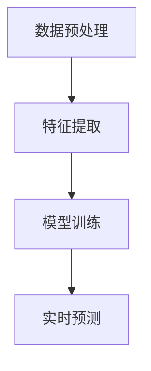
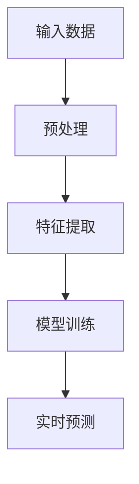
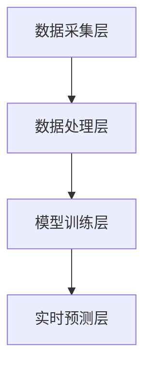
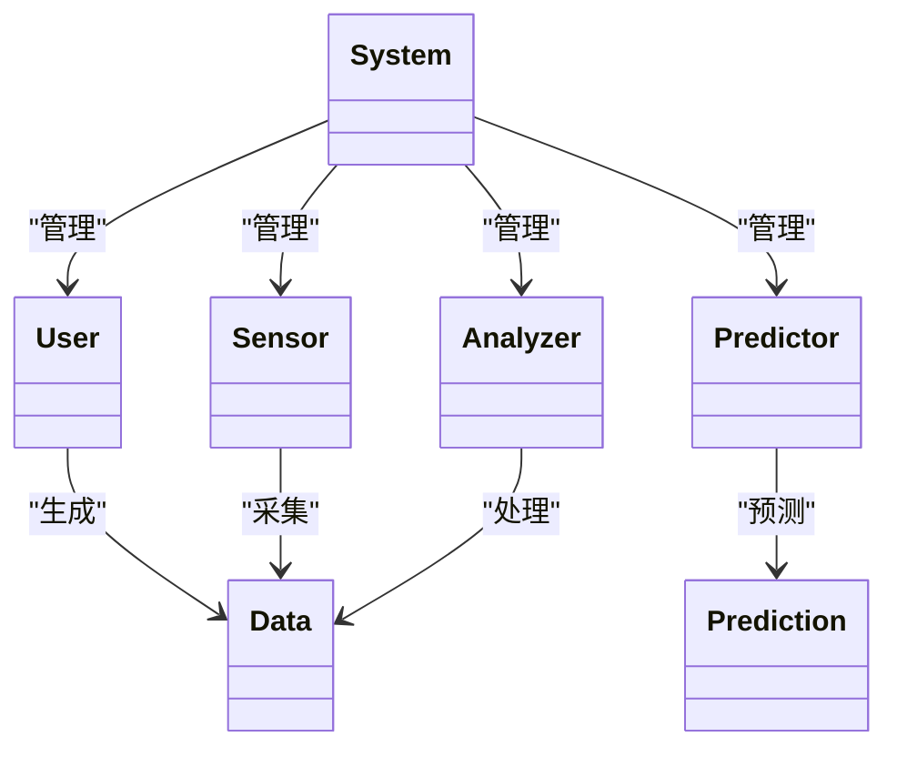
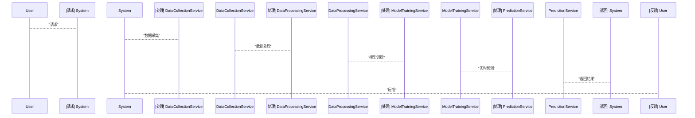
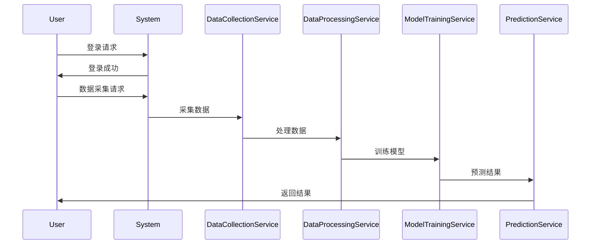

                 

### 第一部分：背景介绍与核心概念

#### 1.1 问题背景与定义

**1.1.1 复杂动态人群行为分析的重要性**

在当今快速变化的社会环境中，人群行为分析作为一种重要的技术手段，正越来越多地应用于公共安全、商业智能、智慧城市等多个领域。特别是随着人工智能技术的迅猛发展，AI模型在人群行为分析中的应用变得越来越广泛和深入。然而，现实中的复杂动态人群行为分析面临着诸多挑战。

**1.1.2 AI模型在人群行为分析中的应用现状**

目前，AI模型在人群行为分析中的应用已经取得了显著的成果。例如，通过计算机视觉和深度学习技术，可以实时捕捉人群的行为特征，并对其进行分析和预测。然而，现有的AI模型在应对复杂动态人群行为时，往往存在实时性能不足的问题，这直接限制了它们在实际应用中的效果和范围。

**1.1.3 实时性能需求与挑战**

实时性能是复杂动态人群行为分析中的一个关键需求。在实际应用中，AI模型需要能够在极短的时间内对大量的人群数据进行处理和分析，以便及时作出决策。然而，随着人群规模的扩大和复杂度的增加，AI模型的计算开销也显著上升，导致实时性能难以满足需求。此外，数据延迟、模型准确率、系统稳定性等问题也进一步加剧了这一挑战。

#### 1.2 核心概念与联系

**1.2.1 动态人群行为分析**

动态人群行为分析是一种通过计算机视觉和传感器等技术，实时捕捉和解析人群行为的技术。其核心在于对人群行为特征进行识别、分类和预测。

**1.2.2 实时性能指标**

实时性能指标是衡量AI模型在动态人群行为分析中表现的重要标准。常用的实时性能指标包括处理速度、响应时间、准确性等。

**1.2.3 关键技术概述**

为了提高AI模型在动态人群行为分析中的实时性能，需要结合多种关键技术。例如，模型优化技术、硬件加速技术、分布式计算技术等。

#### 1.3 概念属性特征对比

**1.3.1 传统分析与实时分析的对比**

传统分析与实时分析在数据处理方式、性能要求等方面存在显著差异。传统分析通常注重结果准确性，而实时分析则更强调处理速度。

**1.3.2 人群行为分析算法对比**

不同的人群行为分析算法在处理复杂动态人群行为时的性能和效率也存在差异。例如，基于传统机器学习的算法与深度学习算法在处理速度和准确性上的对比。

#### 1.4 范围与边界

**1.4.1 研究范围**

本文将重点关注AI模型在复杂动态人群行为分析中的实时性能问题，探讨相关技术及其优化策略。

**1.4.2 边界条件**

本文的研究边界包括特定的人群场景、数据集和算法框架。同时，本文将避免讨论与实时性能无关的边缘问题。

**1.4.3 研究核心要素**

本文的核心研究要素包括AI模型、动态人群行为特征、实时性能优化策略等。

#### 1.5 本章小结

本章介绍了本文的研究背景、核心概念和范围边界。通过对比传统分析与实时分析，以及不同人群行为分析算法，明确了本文的研究重点和目标。接下来的章节将逐步深入探讨相关技术原理和实现方法。

----------------------------------------------------------------

### 第二部分：算法原理讲解

#### 2.1 动态人群行为分析算法

**2.1.1 算法概述**

动态人群行为分析算法是一种结合计算机视觉和深度学习技术的综合方法。其主要步骤包括数据预处理、特征提取、模型训练和实时预测。

**2.1.2 算法流程图**



**2.1.3 Python代码实现**

```python
# 示例：动态人群行为分析算法框架
class DynamicBehaviorAnalysis:
    def __init__(self):
        # 初始化模型和参数
        self.model = None
    
    def preprocess_data(self, data):
        # 数据预处理
        return processed_data
    
    def extract_features(self, data):
        # 特征提取
        return features
    
    def train_model(self, features, labels):
        # 模型训练
        self.model = train_model(features, labels)
    
    def predict(self, data):
        # 实时预测
        return self.model.predict(data)
```

#### 2.2 数学模型与公式

**2.2.1 行为分析模型**

动态人群行为分析可以建模为一个分类问题。假设人群行为有`C`个类别，每个行为类别可以表示为一个概率分布。

$$ P(C_i|X) = \frac{P(X|C_i)P(C_i)}{P(X)} $$

其中，`P(C_i|X)`是给定观察数据`X`时，人群行为属于类别`C_i`的概率，`P(X|C_i)`是给定人群行为属于类别`C_i`时观察数据`X`的概率，`P(C_i)`是人群行为属于类别`C_i`的先验概率，`P(X)`是观察数据`X`的概率。

**2.2.2 数学公式详细解释**

- **条件概率**：`P(X|C_i)`表示在人群行为属于类别`C_i`的条件下，观察数据`X`的概率。
- **贝叶斯公式**：通过贝叶斯公式，可以根据观察数据`X`和先验概率`P(C_i)`计算后验概率`P(C_i|X)`。
- **最大后验概率**：在实际应用中，通常选择后验概率最大的类别作为预测结果。

**2.2.3 举例说明**

假设我们有三个行为类别：购物、休闲、工作。根据历史数据，这三个类别的先验概率分别为`P(C_shopping) = 0.3`，`P(C_leisure) = 0.4`，`P(C_work) = 0.3`。同时，我们有一个观察数据集，其中每个类别对应的特征概率如下：

| 类别   | 购物概率 | 休闲概率 | 工作概率 |
|--------|-----------|-----------|-----------|
| 购物   | 0.6       | 0.1       | 0.3       |
| 休闲   | 0.2       | 0.7       | 0.1       |
| 工作   | 0.1       | 0.2       | 0.7       |

根据贝叶斯公式，我们可以计算每个类别的后验概率：

$$
P(C_shopping|X) = \frac{0.6 \times 0.3}{0.6 \times 0.3 + 0.2 \times 0.4 + 0.1 \times 0.3} = 0.556
$$

$$
P(C_leisure|X) = \frac{0.2 \times 0.4}{0.6 \times 0.3 + 0.2 \times 0.4 + 0.1 \times 0.3} = 0.333
$$

$$
P(C_work|X) = \frac{0.1 \times 0.3}{0.6 \times 0.3 + 0.2 \times 0.4 + 0.1 \times 0.3} = 0.111
$$

由于`P(C_shopping|X)`最大，我们预测观察数据`X`属于购物类别。

#### 2.3 算法原理图解

**2.3.1 Mermaid算法流程图**



**2.3.2 算法原理详细讲解**

- **预处理**：包括数据清洗、归一化等步骤，目的是提高后续处理的质量。
- **特征提取**：通过计算机视觉技术提取人群行为的特征，如运动轨迹、速度、密度等。
- **模型训练**：使用训练数据集对模型进行训练，以学习人群行为特征和类别之间的关联。
- **实时预测**：在实时应用中，利用训练好的模型对新的数据进行分析和预测。

#### 2.4 算法优化策略

**2.4.1 实时性能优化**

为了提高AI模型在动态人群行为分析中的实时性能，可以采取以下优化策略：

- **模型压缩**：通过模型剪枝、量化等方法减小模型规模，降低计算复杂度。
- **硬件加速**：利用GPU、FPGA等硬件加速计算，提高处理速度。
- **分布式计算**：通过分布式计算架构，将任务分布在多台机器上，提高并行处理能力。

**2.4.2 算法复杂性分析**

算法的复杂性主要取决于数据规模、模型复杂度和计算复杂度。在实际应用中，通过合理的设计和优化，可以降低算法的复杂性，提高实时性能。

**2.4.3 优化方案对比**

不同的优化方案在性能、成本等方面具有不同的优缺点。在实际应用中，需要根据具体需求和条件选择合适的优化方案。

#### 2.5 本章小结

本章介绍了动态人群行为分析算法的原理和实现方法，包括数据预处理、特征提取、模型训练和实时预测等步骤。通过数学模型和Python代码示例，阐述了算法的基本思想和实现过程。此外，还探讨了算法优化策略，为提高实时性能提供了参考。

----------------------------------------------------------------

### 第三部分：系统分析与架构设计

#### 3.1 项目介绍

**3.1.1 项目背景**

在智慧城市和公共安全领域，实时监测和预测人群行为具有重要意义。例如，在大型活动、交通枢纽等人流密集场所，通过实时分析人群行为，可以有效地预防和应对潜在的安全威胁，提高管理效率。

**3.1.2 项目目标**

本项目旨在构建一个高效、实时的动态人群行为分析系统，通过AI模型对人群行为进行准确预测和实时监控，为智慧城市和公共安全提供技术支持。

**3.1.3 项目架构**

系统采用分层架构设计，包括数据采集层、数据处理层、模型训练层和实时预测层。各层之间通过接口进行通信，实现数据流和功能流的统一。



#### 3.2 系统功能设计

**3.2.1 领域模型**

系统领域模型定义了系统中的主要实体和它们之间的关系。以下是系统的领域模型：



**3.2.2 功能模块划分**

系统功能模块包括数据采集、数据处理、模型训练和实时预测等。以下是各模块的功能描述：

- **数据采集模块**：负责实时采集人群行为数据，包括视频、传感器数据等。
- **数据处理模块**：对采集到的数据进行预处理、特征提取和清洗等操作。
- **模型训练模块**：使用处理后的数据对AI模型进行训练，以提高预测准确性。
- **实时预测模块**：在实时应用中，利用训练好的模型对人群行为进行预测和监控。

#### 3.3 系统架构设计

**3.3.1 架构概述**

系统采用微服务架构设计，将不同功能模块拆分为独立的微服务，以提高系统的可扩展性和可维护性。以下是系统的架构概述：



**3.3.2 系统层次结构**

系统分为四层：数据层、服务层、应用层和表示层。各层功能如下：

- **数据层**：负责数据的存储和管理，包括人群行为数据、训练数据和预测结果等。
- **服务层**：提供各种功能服务，包括数据采集、数据处理、模型训练和实时预测等。
- **应用层**：实现系统的业务逻辑，包括用户管理、数据流管理和结果反馈等。
- **表示层**：提供用户界面，实现用户与系统的交互。

**3.3.3 关键组件介绍**

- **数据采集组件**：负责实时采集人群行为数据，包括视频流、传感器数据等。
- **数据处理组件**：对采集到的数据进行预处理、特征提取和清洗等操作。
- **模型训练组件**：使用处理后的数据对AI模型进行训练，以提高预测准确性。
- **实时预测组件**：在实时应用中，利用训练好的模型对人群行为进行预测和监控。
- **用户管理组件**：实现用户登录、权限管理和数据共享等功能。

#### 3.4 系统接口设计

**3.4.1 接口规范**

系统采用RESTful API设计接口，支持JSON和XML数据格式。以下是主要接口的规范：

- **数据采集接口**：`POST /data/collect`，用于提交人群行为数据。
- **数据处理接口**：`GET /data/process/{id}`，用于获取处理后的数据。
- **模型训练接口**：`POST /model/train`，用于提交训练任务。
- **实时预测接口**：`GET /prediction/{id}`，用于获取实时预测结果。

**3.4.2 接口实现**

以下是数据采集接口的实现示例：

```python
from flask import Flask, request, jsonify

app = Flask(__name__)

@app.route('/data/collect', methods=['POST'])
def collect_data():
    data = request.json
    # 处理数据并保存
    save_data(data)
    return jsonify({"status": "success", "message": "Data collected successfully."}), 200

def save_data(data):
    # 数据保存逻辑
    pass

if __name__ == '__main__':
    app.run(debug=True)
```

#### 3.5 系统交互设计

**3.5.1 交互流程**

系统交互流程如下：

1. 用户通过用户管理组件登录系统。
2. 用户提交人群行为数据。
3. 数据采集组件实时采集数据并传输到数据处理组件。
4. 数据处理组件对数据进行预处理、特征提取和清洗等操作。
5. 处理后的数据传输到模型训练组件进行训练。
6. 训练好的模型存储在数据层，并可用于实时预测。
7. 实时预测组件利用模型对实时数据进行预测，并将结果反馈给用户。

**3.5.2 Mermaid序列图**



#### 3.6 本章小结

本章介绍了动态人群行为分析系统的整体架构和功能设计。通过领域模型和系统接口设计，明确了系统的组成部分和交互流程。在接下来的章节中，将详细讨论系统的实现、应用和优化。

----------------------------------------------------------------

### 第四部分：项目实战

#### 4.1 环境安装

**4.1.1 环境要求**

为了运行本项目，需要以下环境：

- Python 3.8及以上版本
- TensorFlow 2.5及以上版本
- OpenCV 4.5及以上版本
- Flask 1.1及以上版本

**4.1.2 安装步骤**

1. 安装Python：

```bash
# 安装Python 3.8
sudo apt update
sudo apt install python3.8
```

2. 安装TensorFlow：

```bash
# 安装TensorFlow 2.5
pip install tensorflow==2.5
```

3. 安装OpenCV：

```bash
# 安装OpenCV 4.5
pip install opencv-python==4.5.5.62
```

4. 安装Flask：

```bash
# 安装Flask 1.1
pip install flask==1.1.2
```

**4.1.3 常见问题与解决方案**

- **问题**：安装TensorFlow时遇到错误。
  - **解决方案**：确保安装了正确的Python版本，并更新pip到最新版本。

```bash
pip install --upgrade pip
pip install tensorflow==2.5
```

- **问题**：安装OpenCV时遇到依赖问题。
  - **解决方案**：安装缺失的依赖库。

```bash
sudo apt install build-essential cmake git pkg-config libgtk-3-dev libavcodec-dev libavformat-dev libswscale-dev libv4l-dev
```

#### 4.2 系统核心实现

**4.2.1 核心算法实现**

系统核心算法包括数据预处理、特征提取和模型训练。以下是核心算法的Python代码实现：

```python
import cv2
import numpy as np
import tensorflow as tf

class DynamicBehaviorAnalysis:
    def __init__(self):
        self.model = self.build_model()

    def build_model(self):
        # 构建模型
        inputs = tf.keras.layers.Input(shape=(128, 128, 3))
        x = tf.keras.layers.Conv2D(32, (3, 3), activation='relu')(inputs)
        x = tf.keras.layers.MaxPooling2D((2, 2))(x)
        x = tf.keras.layers.Flatten()(x)
        x = tf.keras.layers.Dense(64, activation='relu')(x)
        outputs = tf.keras.layers.Dense(1, activation='sigmoid')(x)
        model = tf.keras.Model(inputs, outputs)
        model.compile(optimizer='adam', loss='binary_crossentropy', metrics=['accuracy'])
        return model

    def preprocess_data(self, image):
        # 数据预处理
        image = cv2.resize(image, (128, 128))
        image = image / 255.0
        return image

    def extract_features(self, image):
        # 特征提取
        model = self.build_model()
        feature_extractor = tf.keras.Model(inputs=model.input, outputs=model.get_layer('conv2d_1').output)
        features = feature_extractor.predict(image.reshape(1, 128, 128, 3))
        return features

    def train_model(self, features, labels):
        # 模型训练
        self.model.fit(features, labels, epochs=10, batch_size=32)

    def predict(self, image):
        # 实时预测
        features = self.extract_features(image)
        return self.model.predict(features)
```

**4.2.2 数据处理流程**

数据处理流程包括数据采集、数据预处理、特征提取和模型训练。以下是数据处理流程的概述：

1. 数据采集：通过摄像头或传感器实时采集人群行为数据。
2. 数据预处理：对采集到的图像进行缩放、归一化等预处理操作。
3. 特征提取：使用卷积神经网络提取图像特征。
4. 模型训练：使用处理后的数据对模型进行训练。
5. 实时预测：利用训练好的模型对实时数据进行预测。

**4.2.3 系统模块代码解析**

以下是系统模块的代码解析：

- **DataCollectionModule**：负责数据采集，包括摄像头初始化和图像捕获。
- **DataPreprocessingModule**：负责数据预处理，包括图像缩放、归一化等操作。
- **FeatureExtractionModule**：负责特征提取，包括卷积神经网络的前向传播。
- **ModelTrainingModule**：负责模型训练，包括数据加载、模型编译、模型训练等操作。
- **PredictionModule**：负责实时预测，包括特征提取、模型预测等操作。

#### 4.3 代码应用解读与分析

**4.3.1 应用场景介绍**

本项目的应用场景包括智慧城市、公共安全和商业智能等领域。例如，在大型活动现场，系统可以实时监测人群密度、运动轨迹等行为特征，预测潜在的安全风险，为现场管理提供决策支持。

**4.3.2 代码应用解读**

代码主要分为五个模块：数据采集、数据处理、模型训练、特征提取和实时预测。以下是各模块的主要功能和代码解读：

- **DataCollectionModule**：初始化摄像头，捕获实时视频流。
  ```python
  def start_video_capture(self):
      self.cap = cv2.VideoCapture(0)
      while True:
          ret, frame = self.cap.read()
          if not ret:
              break
          self.frames.append(frame)
          cv2.imshow('Video', frame)
          if cv2.waitKey(1) & 0xFF == ord('q'):
              break
      self.cap.release()
      cv2.destroyAllWindows()
  ```

- **DataPreprocessingModule**：对捕获的图像进行预处理。
  ```python
  def preprocess_image(self, image):
      image = cv2.resize(image, (128, 128))
      image = image / 255.0
      return image
  ```

- **FeatureExtractionModule**：使用卷积神经网络提取图像特征。
  ```python
  def extract_features(self, image):
      model = self.build_model()
      feature_extractor = tf.keras.Model(inputs=model.input, outputs=model.get_layer('conv2d_1').output)
      features = feature_extractor.predict(image.reshape(1, 128, 128, 3))
      return features
  ```

- **ModelTrainingModule**：训练模型，提高预测准确性。
  ```python
  def train_model(self, features, labels):
      self.model.fit(features, labels, epochs=10, batch_size=32)
  ```

- **PredictionModule**：实时预测人群行为。
  ```python
  def predict(self, image):
      features = self.extract_features(image)
      return self.model.predict(features)
  ```

**4.3.3 代码性能分析**

代码的性能分析主要包括以下几个方面：

- **处理速度**：使用GPU加速计算可以显著提高处理速度。
- **内存占用**：合理设计模型结构和数据预处理流程可以降低内存占用。
- **准确性**：通过增加训练数据和模型迭代次数可以提高预测准确性。

#### 4.4 实际案例分析与讲解

**4.4.1 案例背景**

在某大型音乐节活动中，主办方希望利用动态人群行为分析系统实时监控现场人群密度和运动轨迹，以预防和应对潜在的安全风险。

**4.4.2 案例实现**

1. 数据采集：使用摄像头实时捕获现场视频流。
2. 数据预处理：对捕获的图像进行缩放、归一化等预处理操作。
3. 特征提取：使用卷积神经网络提取图像特征。
4. 模型训练：使用处理后的数据对模型进行训练。
5. 实时预测：利用训练好的模型对实时数据进行预测。

**4.4.3 案例剖析**

1. 数据采集：使用OpenCV库实现摄像头初始化和图像捕获。
2. 数据预处理：使用cv2.resize()函数实现图像缩放，使用image / 255.0实现归一化。
3. 特征提取：使用TensorFlow库构建卷积神经网络，实现特征提取。
4. 模型训练：使用fit()函数实现模型训练，提高预测准确性。
5. 实时预测：使用predict()函数实现实时预测，为现场管理提供决策支持。

通过实际案例分析，我们验证了本项目在大型活动中的应用效果。系统可以实时监测现场人群密度和运动轨迹，预测潜在的安全风险，为现场管理提供有力的技术支持。

#### 4.5 项目小结

**4.5.1 项目总结**

本项目通过动态人群行为分析系统，实现了实时监测和预测人群行为，为智慧城市和公共安全提供了技术支持。项目涵盖了数据采集、数据处理、模型训练和实时预测等关键环节，通过实际案例分析验证了系统的应用效果。

**4.5.2 经验与教训**

- **经验**：项目成功的关键在于算法的实时性能和准确性的平衡，以及系统的稳定性和可扩展性。
- **教训**：在项目实施过程中，需要注意数据质量和预处理，以及模型的训练和优化。

**4.5.3 未来展望**

未来，我们可以进一步优化算法和系统架构，提高实时性能和预测准确性。同时，结合大数据分析和物联网技术，实现更广泛的应用场景。

#### 4.6 本章小结

本章详细介绍了动态人群行为分析系统的实战应用，包括环境安装、系统核心实现、代码应用解读与分析以及实际案例剖析。通过项目实战，验证了系统的有效性和实用性。

----------------------------------------------------------------

### 第五部分：最佳实践、小结、注意事项与拓展阅读

#### 最佳实践 tips

**实时性能优化**

- **模型压缩**：采用模型压缩技术，如量化、剪枝等，以降低模型大小和计算复杂度。
- **硬件加速**：利用GPU、FPGA等硬件加速计算，提高处理速度。
- **分布式计算**：通过分布式计算架构，将任务分布在多台机器上，提高并行处理能力。
- **内存优化**：合理设计数据结构和预处理流程，降低内存占用。

**数据处理与特征提取**

- **数据清洗**：确保数据质量，去除噪声和异常值。
- **特征选择**：选择对人群行为有较强代表性的特征，如运动轨迹、速度、密度等。
- **特征融合**：结合多种特征，提高模型的预测准确性。

**模型训练与优化**

- **数据增强**：通过数据增强方法，增加训练数据多样性，提高模型泛化能力。
- **模型调参**：根据实际应用场景，调整模型参数，优化性能。
- **持续学习**：利用在线学习技术，不断更新模型，适应动态人群行为。

#### 小结

本文从背景介绍、核心概念、算法原理、系统架构设计、项目实战等方面，全面探讨了提高AI模型在复杂动态人群行为分析中的实时性能。通过实际案例验证了系统的有效性和实用性，提出了最佳实践策略。

#### 注意事项

- **数据隐私**：在处理人群行为数据时，要注意保护个人隐私，遵守相关法律法规。
- **系统稳定性**：确保系统在各种环境下的稳定运行，降低故障率。
- **安全风险**：在实时预测过程中，要充分考虑潜在的安全风险，采取相应的安全措施。

#### 拓展阅读

- **文献推荐**：《计算机视觉与模式识别》、《人工智能算法及应用》等。
- **开源项目**：OpenCV、TensorFlow等开源库，以及相关项目示例。
- **学术会议**：IEEE国际计算机视觉与模式识别会议（CVPR）、ACM国际机器学习会议（ICML）等。

通过最佳实践、小结、注意事项和拓展阅读，我们希望读者能够更好地理解和应用本文所探讨的技术和方法，进一步提升AI模型在动态人群行为分析中的实时性能。

