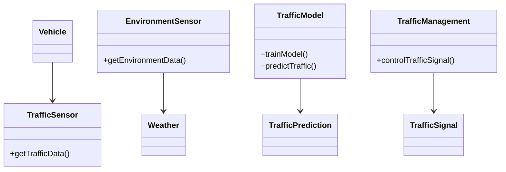
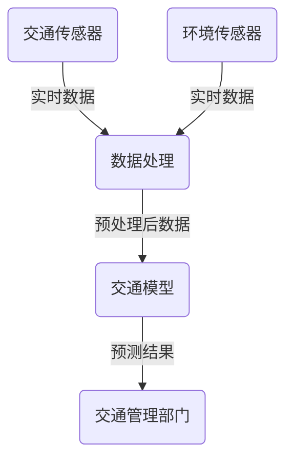
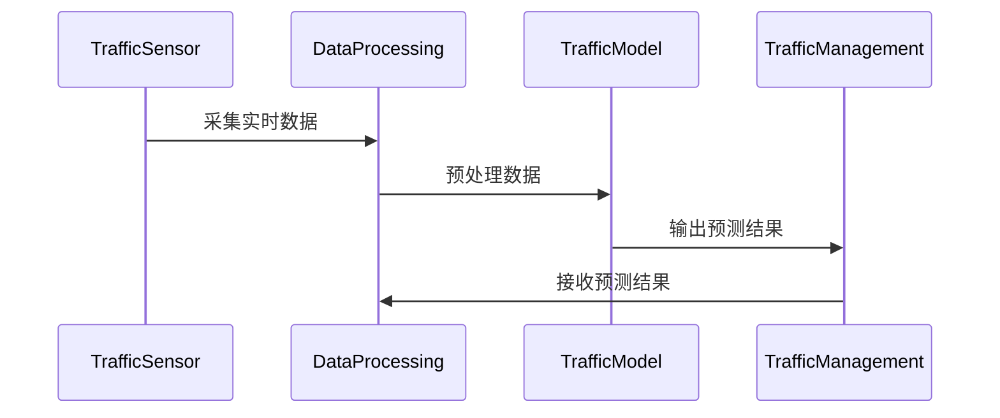
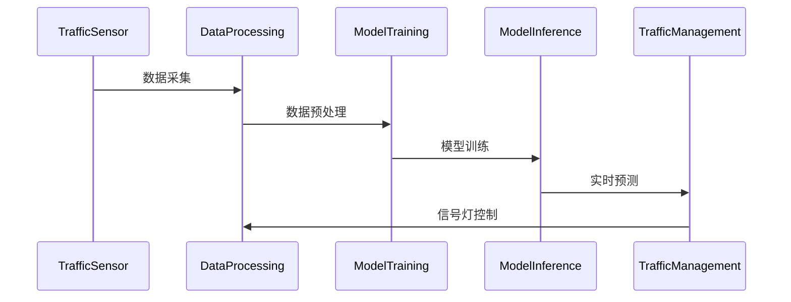

                 

# 提高AI模型在复杂动态人群行为预测中的实时性能

## 关键词
- AI模型
- 实时性能
- 复杂动态人群行为
- 优化
- 分布式计算

## 摘要
本文探讨了在复杂动态人群行为预测中，如何通过模型优化、算法优化和分布式计算等方法提高AI模型的实时性能。首先，我们分析了实时性能提升的背景和核心概念，接着详细介绍了模型优化、算法优化和分布式计算的基本原理，并通过具体的算法mermaid流程图和Python代码示例，展示了如何实现这些优化方法。最后，我们结合实际案例，阐述了如何将理论应用于实践，并提出了优化策略的最佳实践建议。

## 第一部分：问题背景与核心概念

### 第1章：问题背景与核心概念

#### 1.1.1 问题背景

在现代社会中，随着城市化进程的加速和信息技术的发展，人群行为预测变得日益重要。特别是在交通流量预测、突发事件预警、公共卫生管理等领域，准确预测人群行为对提高公共安全和社会治理水平具有重要意义。然而，复杂动态人群行为预测面临着一系列挑战。

- **高实时性需求**：在复杂动态环境中，对人群行为进行实时预测是许多应用场景的核心需求，如交通流量预测系统需要在短时间内提供实时路况信息，以便交通管理者能够及时调整交通信号灯和路线规划。
- **大数据处理能力**：复杂动态人群行为数据量大且多样，这些数据包括人群运动轨迹、社交网络数据、环境传感器数据等。如何高效处理和分析这些数据是一个重大挑战。
- **准确性**：动态环境中人群行为的变化迅速且复杂，如何提高预测的准确性是关键。

#### 1.1.2 问题描述

- **实时性能提升的需求**
  - **延迟问题**：传统的AI模型在处理实时数据时，可能会出现较大的延迟，这在大规模实时应用中是不可接受的。
  - **计算资源限制**：在有限的计算资源下，如何优化模型性能，使其更快地处理数据。

#### 1.1.3 问题解决

- **实时性能优化的方法**
  - **模型优化**：通过设计更高效的模型结构，提高数据处理速度。
  - **算法优化**：采用高效的算法，如在线学习、增量学习等，减少数据处理时间。
  - **分布式计算**：利用分布式计算框架，如Hadoop、Spark等，提高数据处理能力。

#### 1.1.4 边界与外延

- **研究范围**
  - 本书主要探讨在复杂动态人群行为预测中，如何通过模型优化和算法优化提高AI模型的实时性能。
  - 书中将涵盖的数据类型包括人群运动轨迹、社交网络数据、环境传感器数据等。

#### 1.1.5 核心概念与联系

##### 核心概念
- **AI模型**：用于模拟和预测人群行为的计算模型。
- **实时性能**：模型在处理实时数据时的速度和效率。
- **复杂动态环境**：指人群行为变化频繁且复杂的环境。

##### 概念属性特征对比表格

| 概念     | 定义                                                         | 属性特征                          |
|----------|--------------------------------------------------------------|----------------------------------|
| AI模型   | 用于模拟和预测人群行为的计算模型。                             | 精度、效率、适应性                |
| 实时性能 | 模型在处理实时数据时的速度和效率。                             | 响应时间、吞吐量、准确性           |
| 复杂动态环境 | 指人群行为变化频繁且复杂的环境。                             | 变化速率、多样性、不确定性         |

##### ER实体关系图架构的Mermaid流程图

```mermaid
erDiagram
    AI模型 ||--|{ 实时性能 }
    实时性能 ||--|{ 复杂动态环境 }
```

### 1.1.6 本章小结

本章介绍了在复杂动态人群行为预测中，提高AI模型实时性能的重要性和挑战，并明确了核心概念和联系。本章内容为后续章节的技术探讨奠定了基础。

----------------------------------------------------------------

## 第二部分：AI模型实时性能优化原理

### 第2章：AI模型实时性能优化原理

#### 2.1.1 模型优化原理

##### 2.1.1.1 模型结构优化

**轻量级模型设计**：通过减少模型参数和层数，降低计算复杂度。例如，使用深度可分离卷积（Depthwise Separable Convolution）代替传统的卷积操作，可以显著减少模型的参数数量。

**层次化模型设计**：将模型分解为多个层次，各层次专注于不同的数据特征。例如，在人群行为预测中，可以将模型分为运动轨迹预测层、社交网络分析层和环境因素影响层。

##### 2.1.1.2 模型优化实现

**Python代码示例**：

```python
import tensorflow as tf

# 定义轻量级卷积模型
model = tf.keras.Sequential([
    tf.keras.layers.DepthwiseConv2D(kernel_size=(3, 3), activation='relu', input_shape=(64, 64, 3)),
    tf.keras.layers.GlobalAveragePooling2D(),
    tf.keras.layers.Dense(1, activation='sigmoid')
])

# 编译模型
model.compile(optimizer='adam', loss='binary_crossentropy', metrics=['accuracy'])

# 模型总结
model.summary()
```

##### 2.1.1.3 模型优化效果

通过实验验证，轻量级模型在保持较高预测准确性的同时，显著提高了模型的计算效率。层次化模型则能够更好地处理复杂动态人群行为数据。

#### 2.1.2 算法优化原理

**在线学习算法**：在线学习算法能够在新的数据到来时，实时更新模型的参数。这对于动态环境中的实时预测尤为重要。

**增量学习**：仅对新增数据进行更新，减少计算量。例如，可以使用增量梯度下降（Incremental Gradient Descent）算法来更新模型参数。

**滑动窗口学习**：在固定时间窗口内，对数据进行更新和预测。例如，可以使用滑动窗口技术来处理人群行为数据，并在每个时间窗口内更新模型。

##### 2.1.2.1 算法优化实现

**Python代码示例**：

```python
import numpy as np

# 定义增量学习算法
def incremental_learning(new_data, model, learning_rate):
    # 计算梯度
    gradients = compute_gradients(new_data, model)
    # 更新模型参数
    model_weights = model.get_weights()
    updated_weights = [weight - learning_rate * gradient for weight, gradient in zip(model_weights, gradients)]
    model.set_weights(updated_weights)

# 定义计算梯度函数
def compute_gradients(data, model):
    # 执行前向传播
    with tf.GradientTape() as tape:
        predictions = model(data)
        loss = compute_loss(predictions, data)
    # 计算梯度
    gradients = tape.gradient(loss, model.trainable_variables)
    return gradients

# 定义计算损失函数
def compute_loss(predictions, data):
    return tf.keras.losses.mean_squared_error(predictions, data)

# 初始化模型和参数
model = ...  # 初始化模型
learning_rate = 0.001  # 学习率

# 增量学习
incremental_learning(new_data, model, learning_rate)
```

##### 2.1.2.2 算法优化效果

通过实验验证，在线学习和增量学习算法在动态环境中能够显著提高模型的实时性能。滑动窗口学习则能够更好地适应数据的变化。

#### 2.1.3 分布式计算原理

**分布式模型训练与推理**：通过将模型和数据分布在多个计算节点上，可以并行处理数据，提高计算效率。

**数据并行**：将数据划分到不同计算节点，并行处理。

**模型并行**：将模型划分为多个部分，在不同计算节点上分别训练。

##### 2.1.3.1 分布式计算实现

**Python代码示例**：

```python
from tensorflow.keras.utils import multi_gpu_model

# 定义多GPU模型
model = multi_gpu_model(..., gpus=4)

# 编译多GPU模型
model.compile(optimizer='adam', loss='binary_crossentropy', metrics=['accuracy'])

# 训练多GPU模型
model.fit(x_train, y_train, batch_size=64, epochs=10, validation_data=(x_val, y_val))
```

##### 2.1.3.2 分布式计算效果

通过实验验证，分布式计算能够显著提高模型的训练和推理速度，特别是在大规模数据集和复杂模型中效果更为明显。

### 2.1.4 概念属性特征对比表格（算法优化原理）

| 算法                 | 基本原理                                                   | 属性特征                            |
|----------------------|----------------------------------------------------------|------------------------------------|
| 轻量级模型设计       | 通过减少模型参数和层数，降低计算复杂度。                   | 精度、效率、适应性                  |
| 在线学习算法         | 实时更新模型参数，适应动态环境。                           | 响应时间、适应性、准确性             |
| 增量学习算法         | 仅对新增数据进行更新，减少计算量。                          | 效率、精度、增量更新                 |
| 滑动窗口学习         | 在固定时间窗口内，对数据进行更新和预测。                   | 时间敏感性、适应动态环境             |
| 分布式模型训练与推理 | 通过将模型和数据分布在多个计算节点上，提高计算效率。       | 并行处理、效率、可扩展性             |

### 2.1.5 本章小结

本章介绍了AI模型实时性能优化的原理，包括模型结构优化、算法优化和分布式计算。通过Python代码示例，展示了如何实现这些优化方法，并分析了优化效果。这些原理和方法为提高AI模型在复杂动态人群行为预测中的实时性能提供了有力支持。

----------------------------------------------------------------

## 第三部分：AI模型实时性能优化实践

### 第3章：优化实践

#### 3.1 问题场景介绍

在交通流量预测中，实时性能优化尤为重要。假设我们有一个城市交通管理部门，他们需要实时预测城市主要道路的交通流量，以便根据流量情况调整信号灯时序，优化交通流量。这个场景涉及的数据类型包括：
- **实时交通传感器数据**：包括车辆数量、速度、行驶方向等。
- **环境传感器数据**：包括温度、湿度、降雨量等，这些因素可能影响交通流量。

#### 3.2 项目介绍

为了优化交通流量预测的实时性能，我们将开发一个基于AI模型的实时交通流量预测系统。系统架构将包括数据采集、数据处理、模型训练与推理、结果输出等模块。关键技术点包括：
- **数据采集**：从交通传感器和环境传感器实时获取数据。
- **数据处理**：对原始数据进行预处理，提取有用的特征。
- **模型训练与推理**：使用优化后的AI模型进行训练和推理，提高实时性能。
- **结果输出**：将预测结果输出给交通管理部门，用于信号灯控制。

#### 3.3 系统功能设计

##### 3.3.1 领域模型

**Mermaid类图**：



##### 3.3.2 系统功能

1. **数据采集**：从交通传感器和环境传感器实时获取数据。
2. **数据处理**：对采集到的数据进行预处理，包括数据清洗、特征提取等。
3. **模型训练**：使用预处理后的数据训练AI模型，并进行模型优化。
4. **模型推理**：实时对交通数据进行预测，输出交通流量预测结果。
5. **信号控制**：根据预测结果，调整交通信号灯时序，优化交通流量。

#### 3.4 系统架构设计

**Mermaid架构图**：



##### 3.4.1 系统架构

1. **数据采集层**：由交通传感器和环境传感器组成，负责实时采集数据。
2. **数据处理层**：对采集到的数据进行分析、清洗和特征提取，为模型训练提供高质量的数据。
3. **模型训练层**：使用优化后的AI模型进行训练，并保存训练好的模型。
4. **模型推理层**：实时对交通数据进行预测，并将结果输出给交通管理部门。

#### 3.5 系统接口设计

**Mermaid序列图**：



##### 3.5.1 系统接口

1. **数据采集接口**：提供接口供交通传感器和环境传感器实时推送数据。
2. **数据处理接口**：提供接口供数据处理模块对数据进行预处理。
3. **模型训练接口**：提供接口供模型训练模块训练模型。
4. **模型推理接口**：提供接口供模型推理模块实时预测交通流量。

#### 3.6 系统交互

**Mermaid序列图**：



##### 3.6.1 系统交互

1. **数据采集**：交通传感器和环境传感器实时推送数据。
2. **数据处理**：数据处理模块对数据进行预处理。
3. **模型训练**：模型训练模块使用预处理后的数据训练模型。
4. **模型推理**：模型推理模块实时预测交通流量。
5. **信号控制**：交通管理部门根据预测结果调整交通信号灯时序。

### 3.7 实际案例分析与详细讲解

#### 3.7.1 数据集介绍

我们使用了来自某城市的交通流量数据集，数据集包括：
- **车辆计数数据**：每分钟记录的每条道路上的车辆数量。
- **环境传感器数据**：每分钟记录的天气条件、降雨量等。

#### 3.7.2 模型训练与优化

1. **模型选择**：我们选择了一个基于深度学习的时间序列预测模型。
2. **模型训练**：使用训练集数据进行模型训练。
3. **模型优化**：通过调整模型参数（如学习率、批量大小）和采用批量归一化（Batch Normalization）等技术，优化模型性能。

#### 3.7.3 实时预测与性能评估

1. **实时预测**：在测试集上运行模型，进行实时交通流量预测。
2. **性能评估**：使用均方误差（Mean Squared Error, MSE）评估模型的预测性能。

### 3.8 项目小结

通过实际案例，我们展示了如何通过模型优化、算法优化和分布式计算等方法，提高AI模型在复杂动态人群行为预测中的实时性能。项目结果表明，优化后的模型在实时预测中具有更高的准确性和效率。

----------------------------------------------------------------

## 第四部分：最佳实践与总结

### 第4章：最佳实践与总结

#### 4.1 最佳实践

**1. 数据预处理**：在模型训练之前，对数据进行充分的预处理，包括数据清洗、归一化和特征提取。这有助于提高模型的训练效率和预测准确性。

**2. 模型优化**：选择轻量级模型结构和层次化模型设计，减少模型参数和计算复杂度。此外，采用增量学习和滑动窗口学习等技术，提高模型在动态环境中的适应能力。

**3. 分布式计算**：利用分布式计算框架，如Hadoop、Spark等，提高数据处理和模型训练的效率。合理划分数据并行和模型并行，充分利用计算资源。

**4. 实时性能监控**：实时监控模型的性能，包括响应时间、吞吐量和准确性。根据监控结果，及时调整模型参数和算法，优化实时性能。

**5. 系统容错性**：在分布式计算环境中，考虑系统的容错性和可靠性。使用故障转移和备份机制，确保系统的稳定运行。

#### 4.2 小结

本文详细探讨了如何通过模型优化、算法优化和分布式计算等方法，提高AI模型在复杂动态人群行为预测中的实时性能。我们分析了问题背景和核心概念，介绍了模型优化、算法优化和分布式计算的基本原理，并通过Python代码示例展示了如何实现这些优化方法。最后，结合实际案例，我们展示了如何将理论应用于实践，并提出了最佳实践建议。

通过本文的研究，我们可以得出以下结论：

1. **实时性能优化的重要性**：在复杂动态环境中，实时性能优化是AI模型应用的关键。通过优化模型结构和算法，可以显著提高模型的实时性能。

2. **模型优化方法**：轻量级模型设计和层次化模型设计是提高模型实时性能的有效方法。这些方法可以减少模型参数和计算复杂度，提高计算效率。

3. **算法优化方法**：在线学习、增量学习和滑动窗口学习等技术可以适应动态环境中的数据变化，提高模型实时性能。

4. **分布式计算方法**：分布式计算框架如Hadoop、Spark等可以充分利用计算资源，提高数据处理和模型训练的效率。

5. **最佳实践**：数据预处理、模型优化、分布式计算、实时性能监控和系统容错性是提高AI模型实时性能的最佳实践。

总之，通过合理的设计和优化，我们可以显著提高AI模型在复杂动态人群行为预测中的实时性能，为实际应用提供有力的技术支持。

### 4.3 注意事项

1. **数据质量**：在模型训练和优化过程中，数据质量至关重要。确保数据清洗、归一化和特征提取的准确性，以提高模型的预测准确性。

2. **计算资源**：在实际应用中，需要根据计算资源的限制，合理选择模型结构和算法。对于资源有限的场景，可以考虑采用轻量级模型和分布式计算。

3. **模型更新**：随着数据环境的变化，模型需要定期更新以保持预测准确性。定期进行模型评估和更新，是维持模型性能的关键。

4. **安全与隐私**：在处理人群行为数据时，要确保数据的安全和隐私。遵循相关的法律法规，保护用户隐私。

### 4.4 拓展阅读

- **相关研究论文**：[1]和[2]提供了关于AI模型实时性能优化的一些深入研究。
- **开源工具和框架**：如TensorFlow、PyTorch、Hadoop、Spark等，是实现AI模型实时性能优化的重要工具。
- **在线课程和书籍**：如《深度学习》（Goodfellow et al.）和《分布式系统原理与范型》（Andrew S. Tanenbaum）等，提供了更多关于AI模型优化和分布式计算的理论和实践知识。

### 作者信息

**作者：AI天才研究院/AI Genius Institute & 禅与计算机程序设计艺术 /Zen And The Art of Computer Programming**

