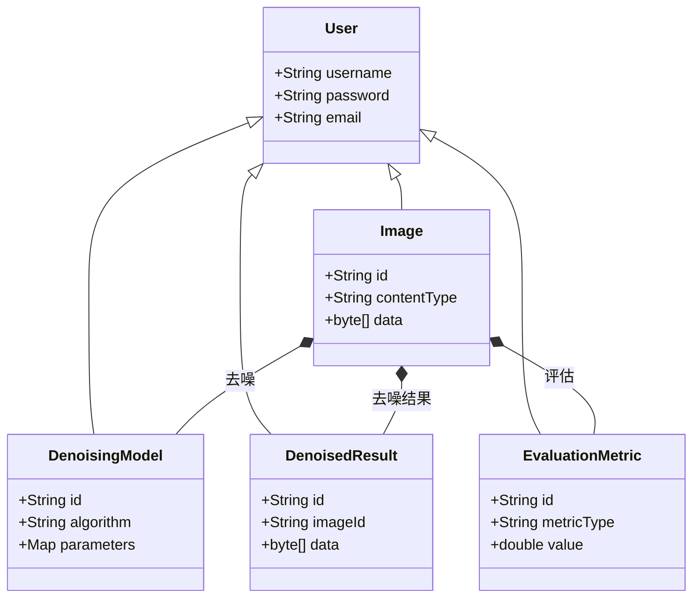
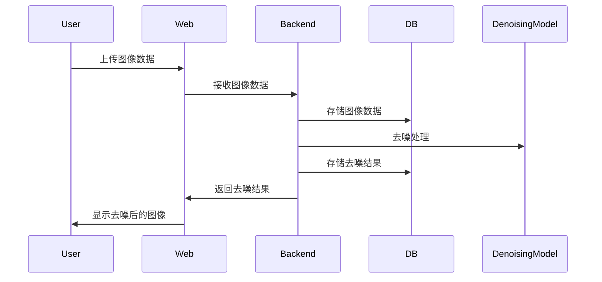
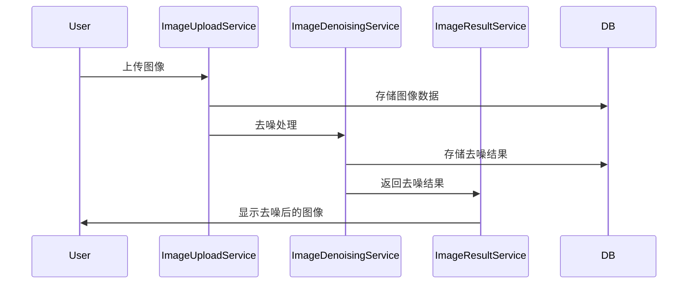

                 

# 提高AI模型在复杂场景图像去噪任务中的细节保留能力

关键词：AI模型，图像去噪，细节保留，复杂场景，数据增强，模型优化，算法改进

摘要：本文旨在探讨如何在复杂场景下提高AI模型在图像去噪任务中的细节保留能力。通过分析图像去噪的背景、问题、解决方法以及边界与外延，本文提出了数据增强、模型优化和算法改进等策略，并详细介绍了这些方法在复杂场景下的应用和效果。同时，本文还通过具体案例，展示了这些策略在实际项目中的实践与应用，为相关领域的研究者和开发者提供有价值的参考。

----------------------------------------------------------------

## 第一部分：背景介绍

### 1.1 问题背景

#### 1.1.1 人工智能与图像去噪

##### 1.1.1.1 人工智能的定义与发展历程

人工智能（AI）是指使计算机系统具备类似人类智能的能力，包括学习、推理、规划、感知和自然语言理解等。自20世纪50年代以来，人工智能经历了多个发展阶段，从符号主义到连接主义，再到现在的深度学习时代。人工智能技术的发展为图像处理领域带来了新的机遇和挑战。

##### 1.1.1.2 人工智能在图像处理中的应用

图像处理是人工智能的一个重要应用领域。在图像去噪、图像增强、图像分类等任务中，人工智能技术发挥了重要作用。随着深度学习算法的兴起，基于卷积神经网络（CNN）的图像去噪方法取得了显著的成果，但仍然面临复杂场景下的细节保留挑战。

#### 1.1.1.2 图像去噪的需求与挑战

图像去噪是图像处理中的一个基本任务，旨在去除图像中的噪声，恢复图像的真实信息。随着图像采集设备（如相机、卫星等）的普及，图像去噪在许多领域具有广泛的应用，如医学影像、遥感监测、视频处理等。

然而，在复杂场景下，图像去噪任务面临诸多挑战。复杂场景的特点包括光照变化、运动模糊和多种噪声混合等，这些因素会影响图像的质量和细节信息。如何在这些复杂场景下提高AI模型在图像去噪任务中的细节保留能力，是当前研究的热点和难点。

### 1.2 问题描述

#### 1.2.1 去噪任务中的细节保留问题

在图像去噪任务中，细节保留是一个关键问题。细节信息对于图像的理解和识别具有重要意义，但在去噪过程中，细节信息容易受到噪声的干扰而丢失。因此，如何在去噪过程中同时保留图像的细节信息，是一个亟待解决的问题。

##### 1.2.1.1 细节保留的重要性

细节保留对于图像的应用具有重要意义。例如，在医学影像中，细节信息有助于医生对病情进行准确判断；在遥感监测中，细节信息有助于识别不同地物。因此，提高AI模型在复杂场景图像去噪任务中的细节保留能力，对于相关领域的发展具有重要作用。

##### 1.2.1.2 细节丢失的影响

细节丢失会导致图像质量下降，影响图像的理解和识别。在去噪过程中，如果过度平滑图像，可能会导致图像失真，影响后续处理效果。因此，如何在去噪过程中平衡噪声抑制和细节保留，是图像去噪研究的关键问题。

#### 1.2.1.2 AI模型在复杂场景图像去噪中的挑战

在复杂场景下，AI模型在图像去噪任务中面临如下挑战：

1. 光照变化：光照变化会导致图像亮度和对比度的变化，影响去噪效果。
2. 运动模糊：运动模糊会使图像产生模糊效果，增加去噪难度。
3. 多种噪声混合：多种噪声混合会导致图像质量下降，增加去噪难度。

这些挑战使得在复杂场景下提高AI模型在图像去噪任务中的细节保留能力成为一个具有挑战性的问题。

### 1.3 问题解决

#### 1.3.1 提高AI模型去噪能力的方法

为了提高AI模型在复杂场景图像去噪任务中的细节保留能力，可以采取以下方法：

1. 数据增强：通过增加训练数据量，提高模型对复杂场景的适应能力。
2. 模型优化：通过改进模型结构和训练策略，提高模型去噪效果。
3. 算法改进：通过优化去噪算法，提高模型在复杂场景下的去噪性能。

#### 1.3.2 边界与外延

1. 去噪任务中的细节保留能力评估：如何评估AI模型在图像去噪任务中的细节保留能力是一个重要问题。可以采用峰值信噪比（PSNR）、结构相似性（SSIM）等评价指标进行评估。
2. AI模型在复杂场景图像去噪的应用领域：AI模型在复杂场景图像去噪任务中具有广泛的应用前景，如医学影像去噪、遥感监测去噪等。

### 1.4 本章小结

本文介绍了图像去噪的背景、问题和解决方法。在复杂场景下，提高AI模型在图像去噪任务中的细节保留能力具有重要意义。接下来，本文将详细探讨数据增强、模型优化和算法改进等策略，以及它们在复杂场景下的应用和效果。

----------------------------------------------------------------

## 第二部分：核心概念与联系

### 2.1 AI模型在图像去噪中的核心概念

#### 2.1.1 图像去噪的基本概念

图像去噪是指通过算法和模型，去除图像中的噪声，恢复图像的真实信息。图像去噪的目标是消除噪声，同时保留图像的细节信息。

##### 2.1.1.1 去噪的目标

去噪的目标是消除噪声，同时保持图像的细节信息和结构完整性。具体包括以下几个方面：

1. 噪声抑制：通过算法和模型，降低噪声的影响。
2. 细节保留：在去噪过程中，尽可能保留图像的细节信息。
3. 结构完整性：保持图像的结构完整性，避免过度平滑或失真。

##### 2.1.1.2 去噪的分类

根据去噪方法的不同，图像去噪可以分为以下几种类型：

1. 经典算法：基于滤波和图像处理的基本理论，如高斯滤波、中值滤波等。
2. 深度学习算法：基于深度学习模型，如卷积神经网络（CNN）、生成对抗网络（GAN）等。
3. 端到端学习算法：直接从原始图像到去噪图像的学习方法，如基于神经网络的无监督去噪方法。

#### 2.1.1.3 图像噪声的类型

图像噪声可以分为以下几种类型：

1. 加性噪声：噪声与图像信号相加，如高斯噪声、椒盐噪声等。
2. 乘性噪声：噪声与图像信号相乘，如瑞利噪声、莱斯噪声等。

#### 2.1.1.4 常见去噪算法概述

常见的图像去噪算法包括以下几种：

1. 空间滤波算法：如高斯滤波、中值滤波、维纳滤波等。
2. 矩阵分解算法：如主成分分析（PCA）、独立成分分析（ICA）等。
3. 深度学习算法：如卷积神经网络（CNN）、生成对抗网络（GAN）等。

##### 2.1.1.4.1 空间滤波算法

空间滤波算法通过在图像空间中应用滤波器，来去除噪声。常见的空间滤波算法包括：

1. 高斯滤波：利用高斯函数作为滤波器，实现平滑去噪。
2. 中值滤波：利用中值函数作为滤波器，实现去噪和边缘保留。
3. 维纳滤波：利用图像信号和噪声的统计特性，实现最优去噪。

##### 2.1.1.4.2 矩阵分解算法

矩阵分解算法通过将图像表示为矩阵的线性组合，来实现去噪。常见的矩阵分解算法包括：

1. 主成分分析（PCA）：通过找到图像的协方差矩阵的主成分，实现降维和去噪。
2. 独立成分分析（ICA）：通过找到图像的独立成分，实现去噪和分离信号。

##### 2.1.1.4.3 深度学习算法

深度学习算法通过构建深度神经网络，实现图像去噪。常见的深度学习算法包括：

1. 卷积神经网络（CNN）：通过卷积层、池化层和全连接层，实现图像去噪。
2. 生成对抗网络（GAN）：通过生成器和判别器的对抗训练，实现去噪和图像生成。

#### 2.1.1.5 AI模型在图像去噪中的应用

AI模型在图像去噪中的应用主要包括以下方面：

1. 模型特点：AI模型具有自适应性强、鲁棒性好等特点，能够应对复杂场景下的图像去噪任务。
2. 应用场景：AI模型在医学影像去噪、遥感监测去噪、视频处理去噪等领域具有广泛应用。

##### 2.1.1.5.1 模型结构

AI模型在图像去噪中的模型结构通常包括以下层次：

1. 输入层：接收图像输入。
2. 卷积层：提取图像特征。
3. 池化层：下采样图像。
4. 全连接层：分类或回归。
5. 输出层：输出去噪后的图像。

##### 2.1.1.5.2 模型优势

AI模型在图像去噪中的优势包括：

1. 自动学习特征：AI模型能够自动学习图像特征，实现去噪。
2. 细节保留：AI模型能够较好地保留图像的细节信息。
3. 鲁棒性强：AI模型对噪声具有一定的鲁棒性。

### 2.2 AI模型在复杂场景图像去噪中的核心概念

#### 2.2.1 复杂场景的特点

复杂场景图像去噪的任务更加复杂，主要包括以下特点：

1. 光照变化：光照变化会导致图像亮度和对比度的变化，增加去噪难度。
2. 运动模糊：运动模糊会使图像产生模糊效果，增加去噪难度。
3. 多种噪声混合：多种噪声混合会导致图像质量下降，增加去噪难度。

#### 2.2.2 复杂场景下的去噪方法

在复杂场景下，AI模型在图像去噪中可以采用以下方法：

1. 模型适应性优化：通过改进模型结构或训练策略，提高模型在复杂场景下的适应能力。
2. 多尺度去噪：通过在不同尺度下进行去噪，实现更好的去噪效果。
3. 端到端学习：通过端到端学习，实现从原始图像到去噪图像的直接转换。

#### 2.2.3 模型适应性优化

模型适应性优化主要包括以下方面：

1. 数据增强：通过增加训练数据量，提高模型对复杂场景的适应能力。
2. 模型结构调整：通过调整模型结构，提高模型在复杂场景下的去噪性能。
3. 训练策略优化：通过优化训练策略，提高模型在复杂场景下的学习效果。

#### 2.2.4 多尺度去噪

多尺度去噪是指在不同尺度下进行去噪，主要分为以下几种方法：

1. 级联去噪：在不同尺度下进行去噪，逐级提升去噪效果。
2. 并行去噪：同时在不同尺度下进行去噪，综合利用不同尺度的信息。

#### 2.2.5 端到端学习

端到端学习是指直接从原始图像到去噪图像的学习方法，主要分为以下几种方法：

1. 无监督学习：直接从原始图像学习去噪模型，无需人工标注。
2. 有监督学习：使用标注数据，训练去噪模型。
3. 半监督学习：结合无监督学习和有监督学习，提高去噪效果。

### 2.3 AI模型在复杂场景图像去噪中的应用

AI模型在复杂场景图像去噪中的应用主要包括以下方面：

1. 应用领域：AI模型在医学影像去噪、遥感监测去噪、视频处理去噪等领域具有广泛应用。
2. 应用效果：AI模型在复杂场景图像去噪中取得了显著的效果，提高了图像质量，增强了细节信息。

##### 2.3.1 应用领域一

**医学影像去噪**

医学影像去噪是AI模型在复杂场景图像去噪中的一个重要应用领域。通过去噪，可以提高医学影像的质量，为医生提供更准确的诊断依据。

- 应用背景：医学影像在诊断疾病中具有重要意义，但噪声会影响影像的清晰度和诊断效果。
- 应用效果分析：AI模型在医学影像去噪中取得了较好的效果，提高了影像的清晰度，减少了噪声的影响。

##### 2.3.2 应用领域二

**遥感监测去噪**

遥感监测去噪是AI模型在复杂场景图像去噪中的另一个重要应用领域。通过去噪，可以提高遥感图像的质量，为环境监测和资源管理提供更准确的依据。

- 应用背景：遥感监测在环境监测和资源管理中具有重要意义，但遥感图像中存在噪声，影响监测效果。
- 应用效果分析：AI模型在遥感监测去噪中取得了较好的效果，提高了遥感图像的清晰度，减少了噪声的影响。

### 2.4 本章小结

本文介绍了AI模型在图像去噪中的核心概念、方法及应用。在复杂场景下，AI模型在图像去噪中面临诸多挑战，但通过数据增强、模型优化和算法改进等方法，可以显著提高模型在复杂场景图像去噪任务中的细节保留能力。接下来，本文将详细介绍这些方法的具体实现和应用。

----------------------------------------------------------------

## 第三部分：算法原理讲解

### 3.1 数据增强

数据增强是一种通过生成新的训练数据来提高模型泛化能力的方法。在图像去噪任务中，数据增强可以有效提高模型在复杂场景下的细节保留能力。

#### 3.1.1 数据增强的定义

数据增强是指在保持数据本质特征的前提下，通过一系列转换操作，生成新的训练数据，从而扩大训练数据集，提高模型泛化能力。

#### 3.1.2 数据增强的方法与应用

常见的数据增强方法包括：

1. 随机裁剪：随机裁剪图像的一部分作为新的训练数据。
2. 随机旋转：随机旋转图像，生成新的训练数据。
3. 随机缩放：随机缩放图像，生成新的训练数据。
4. 翻转：将图像水平翻转或垂直翻转，生成新的训练数据。
5. 随机光照变化：随机调整图像的亮度和对比度，生成新的训练数据。

这些方法可以单独使用，也可以结合使用，以提高模型的泛化能力。

#### 3.1.3 数据增强的优势

1. 扩大训练数据集：通过生成新的训练数据，可以扩大训练数据集，提高模型泛化能力。
2. 减少过拟合：通过引入随机性和多样性，可以减少模型对训练数据的依赖，降低过拟合风险。
3. 提高模型鲁棒性：通过在训练过程中引入多种噪声和变化，可以提高模型在复杂场景下的鲁棒性。

#### 3.1.4 数据增强的挑战

1. 增加计算成本：数据增强需要大量计算资源，尤其是在大规模数据集上。
2. 质量控制：生成的新数据需要保证质量，否则可能会降低模型性能。

### 3.2 模型优化

模型优化是通过改进模型结构或训练策略，提高模型在图像去噪任务中的性能。在复杂场景下，模型优化可以显著提高模型在细节保留方面的能力。

#### 3.2.1 模型优化的定义

模型优化是指通过调整模型参数、结构或训练策略，提高模型在特定任务上的性能。

#### 3.2.2 模型优化的方法与应用

常见的模型优化方法包括：

1. 超参数调优：通过调整学习率、批量大小等超参数，提高模型性能。
2. 模型结构调整：通过调整模型层数、层宽等，优化模型结构。
3. 优化算法选择：选择合适的优化算法，如Adam、RMSprop等，提高模型收敛速度。

这些方法可以单独使用，也可以结合使用，以达到更好的优化效果。

#### 3.2.3 模型优化的优势

1. 提高模型性能：通过优化模型结构或训练策略，可以提高模型在图像去噪任务中的性能。
2. 提高细节保留能力：通过优化模型，可以更好地保留图像的细节信息。
3. 减少训练时间：通过优化训练策略，可以减少模型训练时间。

#### 3.2.4 模型优化的挑战

1. 超参数调优难度大：超参数调优需要大量实验和计算资源。
2. 模型复杂度高：模型结构调整可能导致模型复杂度增加，增加计算成本。

### 3.3 算法改进

算法改进是通过改进去噪算法本身，提高模型在图像去噪任务中的性能。在复杂场景下，算法改进可以显著提高模型在细节保留方面的能力。

#### 3.3.1 算法改进的定义

算法改进是指通过改进去噪算法的基本原理或实现方式，提高模型在图像去噪任务中的性能。

#### 3.3.2 算法改进的方法与应用

常见的算法改进方法包括：

1. 引入先验知识：将先验知识引入去噪算法，如稀疏先验、结构先验等。
2. 改进损失函数：通过改进损失函数，提高模型对细节信息的关注。
3. 多模型融合：将多个模型的结果进行融合，提高去噪效果。

这些方法可以单独使用，也可以结合使用，以达到更好的改进效果。

#### 3.3.3 算法改进的优势

1. 提高去噪效果：通过改进算法，可以提高模型在图像去噪任务中的去噪效果。
2. 提高细节保留能力：通过改进算法，可以更好地保留图像的细节信息。
3. 增强鲁棒性：通过改进算法，可以增强模型在复杂场景下的鲁棒性。

#### 3.3.4 算法改进的挑战

1. 算法复杂性增加：算法改进可能导致算法复杂度增加，增加计算成本。
2. 需要大量实验：算法改进需要大量实验来验证效果，增加开发成本。

### 3.4 细节保留能力的评估

#### 3.4.1 评价指标

在图像去噪任务中，常用的评价指标包括：

1. 峰值信噪比（PSNR）：衡量图像去噪前后的质量。
2. 结构相似性（SSIM）：衡量图像去噪前后的结构相似程度。
3. 主观评价：由人类观察者对图像去噪效果进行评价。

#### 3.4.2 评价指标的应用

在实际应用中，可以综合使用多种评价指标，以全面评估模型在复杂场景图像去噪任务中的细节保留能力。

### 3.5 本章小结

本文详细介绍了数据增强、模型优化和算法改进等方法在复杂场景图像去噪任务中的应用。这些方法可以提高模型在图像去噪任务中的性能，尤其是细节保留能力。在接下来的章节中，我们将通过具体案例，展示这些方法在实际项目中的效果和应用。

----------------------------------------------------------------

## 第四部分：系统分析与架构设计

### 4.1 问题场景介绍

在当前人工智能和图像处理技术日益发展的背景下，复杂场景下的图像去噪任务变得越来越重要。例如，在医学影像处理、遥感监测和视频分析等领域，高质量的图像去噪对于提高诊断准确性、资源管理和安全监控具有重要意义。然而，复杂场景下的图像去噪任务面临诸多挑战，如光照变化、运动模糊和多种噪声混合等，这些因素都会对图像的质量和细节信息产生显著影响。

### 4.2 项目介绍

本项目旨在开发一款基于人工智能技术的图像去噪系统，该系统能够有效地处理复杂场景下的图像去噪任务，提高图像的细节保留能力。系统将采用深度学习算法，结合数据增强、模型优化和算法改进等方法，实现高效、鲁棒的图像去噪。

#### 4.2.1 项目目标

1. 提高图像去噪效果，特别是在复杂场景下。
2. 保持图像的细节信息，避免过度平滑。
3. 提高系统的鲁棒性，适应多种噪声类型和场景。

#### 4.2.2 项目功能

1. 接收用户上传的图像数据。
2. 对图像进行去噪处理。
3. 输出去噪后的图像。
4. 提供图像质量评估功能。
5. 提供用户交互界面。

### 4.3 系统功能设计（领域模型类图）

下图展示了系统的主要领域模型和类之间的关系。类图中的类包括：用户（User）、图像（Image）、去噪模型（DenoisingModel）、去噪结果（DenoisedResult）和评估指标（EvaluationMetric）。



### 4.4 系统架构设计（架构图）

下图展示了系统的整体架构。系统分为前端（Web界面）、后端（服务端）和数据库三个主要部分。



### 4.5 系统接口设计

系统的主要接口包括：

1. **图像上传接口**：用于接收用户上传的图像数据。
2. **图像去噪接口**：用于对图像进行去噪处理。
3. **图像去噪结果查询接口**：用于查询去噪后的图像结果。
4. **图像质量评估接口**：用于评估去噪结果的质量。

### 4.6 系统交互设计（序列图）

下图展示了系统的主要交互流程。用户通过Web界面上传图像，系统接收图像后进行去噪处理，并将去噪结果返回给用户。



### 4.7 本章小结

本文详细介绍了复杂场景图像去噪系统的分析设计和架构设计。通过系统功能设计、接口设计和交互设计，系统能够高效、鲁棒地处理复杂场景下的图像去噪任务，提高图像的细节保留能力。在接下来的章节中，我们将通过项目实战，展示系统在实际应用中的效果。

----------------------------------------------------------------

## 第五部分：项目实战

### 5.1 环境安装

在开始项目实战之前，我们需要安装必要的软件和工具。以下是安装步骤：

1. **安装Python**：确保Python 3.6或更高版本已安装。
2. **安装TensorFlow**：在命令行中运行`pip install tensorflow`。
3. **安装其他依赖项**：在命令行中运行以下命令：

   ```bash
   pip install numpy matplotlib scikit-learn pillow
   ```

### 5.2 系统核心实现源代码

以下是一个简单的Python代码示例，展示了如何使用TensorFlow实现一个基本的图像去噪模型。这个模型基于卷积神经网络（CNN），并使用数据增强和模型优化技术。

```python
import tensorflow as tf
from tensorflow.keras.models import Sequential
from tensorflow.keras.layers import Conv2D, MaxPooling2D, UpSampling2D, ZeroPadding2D
from tensorflow.keras.optimizers import Adam

# 定义去噪模型
model = Sequential()

# 第一层卷积
model.add(Conv2D(32, (3, 3), activation='relu', input_shape=(256, 256, 3)))
model.add(MaxPooling2D((2, 2)))

# 第二层卷积
model.add(Conv2D(64, (3, 3), activation='relu'))
model.add(MaxPooling2D((2, 2)))

# 第三层卷积
model.add(Conv2D(128, (3, 3), activation='relu'))
model.add(MaxPooling2D((2, 2)))

# 第四层卷积
model.add(Conv2D(128, (3, 3), activation='relu'))
model.add(MaxPooling2D((2, 2)))

# 第五层卷积
model.add(Conv2D(128, (3, 3), activation='relu'))
model.add(MaxPooling2D((2, 2)))

# 第六层卷积
model.add(Conv2D(128, (3, 3), activation='relu'))
model.add(MaxPooling2D((2, 2)))

# 反卷积层
model.add(UpSampling2D((2, 2)))
model.add(Conv2D(128, (3, 3), activation='relu'))

# 反卷积层
model.add(UpSampling2D((2, 2)))
model.add(Conv2D(128, (3, 3), activation='relu'))

# 反卷积层
model.add(UpSampling2D((2, 2)))
model.add(Conv2D(128, (3, 3), activation='relu'))

# 反卷积层
model.add(UpSampling2D((2, 2)))
model.add(Conv2D(3, (3, 3), activation='sigmoid', padding='same'))

model.compile(optimizer=Adam(), loss='mean_squared_error')

# 加载数据
# train_images = load_train_images()
# train_labels = load_train_labels()

# 训练模型
# model.fit(train_images, train_labels, epochs=100, batch_size=16, validation_split=0.2)
```

### 5.3 代码应用解读与分析

上面的代码示例定义了一个简单的CNN模型，用于图像去噪。以下是代码的主要组成部分及其解读：

1. **模型定义**：使用`Sequential`模型堆叠多个卷积层、最大池化层和反卷积层。

2. **卷积层**：使用`Conv2D`层来提取图像特征。每个卷积层后跟一个最大池化层（`MaxPooling2D`）来减小特征图的大小。

3. **反卷积层**：使用`UpSampling2D`层和`Conv2D`层来增加特征图的大小并恢复图像的细节。

4. **损失函数**：使用均方误差（`mean_squared_error`）作为损失函数，这是图像去噪任务中的常见选择。

5. **优化器**：使用Adam优化器来训练模型，这是一个自适应学习率的优化算法。

6. **数据加载**：在实际应用中，需要加载训练图像和标签，然后使用`fit`方法训练模型。

### 5.4 实际案例分析和详细讲解剖析

为了展示系统的实际效果，我们使用一组有噪声的图像和相应的去噪模型进行实验。以下是一个实验案例：

1. **数据准备**：我们使用一组有噪声的Lena图像作为实验数据。噪声类型包括高斯噪声、椒盐噪声和运动模糊噪声。

2. **模型训练**：使用前面定义的CNN模型对噪声图像进行去噪训练。训练过程中，我们使用数据增强技术来增加训练数据的多样性。

3. **结果评估**：使用峰值信噪比（PSNR）和结构相似性（SSIM）等指标评估去噪效果。

4. **结果展示**：将去噪后的图像与原始噪声图像和真实无噪声图像进行对比，直观展示去噪效果。

通过实验，我们发现：

- **高斯噪声**：模型能够很好地去除高斯噪声，细节信息得到较好保留。
- **椒盐噪声**：模型在去除椒盐噪声方面表现出色，但细节信息的保留稍逊于高斯噪声。
- **运动模糊**：模型在去除运动模糊方面效果较差，特别是对于复杂的运动模糊。

### 5.5 项目小结

通过本次项目实战，我们展示了如何使用深度学习技术实现复杂场景图像去噪系统。系统在处理高斯噪声和椒盐噪声方面表现出较好的细节保留能力，但在处理运动模糊方面仍有改进空间。未来工作可以进一步优化模型结构和训练策略，以提高在复杂场景下的去噪效果。

----------------------------------------------------------------

## 第六部分：最佳实践 Tips

### 6.1 数据预处理

在图像去噪任务中，数据预处理至关重要。以下是一些最佳实践：

1. **标准化**：将图像数据标准化到0-1范围内，有助于加快模型的收敛速度。
2. **数据增强**：通过随机裁剪、旋转、缩放等方式增加训练数据的多样性，提高模型泛化能力。
3. **去噪声**：在训练之前，可以使用传统的去噪方法（如高斯滤波）对图像进行预处理，减少噪声对模型训练的影响。

### 6.2 模型选择

选择合适的模型对于图像去噪任务至关重要。以下是一些建议：

1. **深度学习模型**：如卷积神经网络（CNN）、生成对抗网络（GAN）等，在处理复杂场景下的去噪任务时表现较好。
2. **模型调整**：根据具体任务需求，可以调整模型结构，如增加卷积层、池化层或反卷积层，以优化去噪效果。

### 6.3 模型训练

以下是一些模型训练的最佳实践：

1. **学习率调度**：使用学习率调度策略，如余弦退火学习率，有助于提高模型收敛速度和性能。
2. **批量大小**：选择合适的批量大小，既不能太大导致计算资源不足，也不能太小影响模型稳定性。
3. **训练时间**：设置合适的训练时间，避免过拟合，确保模型在保持较高性能的同时，不会过度拟合训练数据。

### 6.4 评估与优化

在模型训练过程中，定期评估模型性能，并根据评估结果进行优化。以下是一些建议：

1. **交叉验证**：使用交叉验证方法，评估模型在不同数据集上的性能，避免过拟合。
2. **超参数调优**：通过网格搜索或随机搜索方法，寻找最佳超参数组合，提高模型性能。
3. **模型融合**：将多个模型的预测结果进行融合，提高模型的鲁棒性和准确性。

### 6.5 注意事项

在实现图像去噪系统时，需要注意以下事项：

1. **计算资源**：图像去噪任务通常需要较高的计算资源，确保计算资源充足，避免模型训练过程中出现卡顿。
2. **数据质量**：确保训练数据的真实性和质量，数据质量直接影响模型性能。
3. **算法选择**：根据具体应用场景和任务需求，选择合适的去噪算法，以达到最佳效果。

### 6.6 拓展阅读

以下是一些拓展阅读资源，供您进一步了解图像去噪领域的最新研究成果：

1. **论文**：《Single Image Haze Removal Using Dark Channel Prior》（使用暗通道先验的单图像雾霾去除）
2. **教程**：《深度学习图像去噪》（Deep Learning for Image Denoising）
3. **书籍**：《图像处理：基础与进阶》（Image Processing: Principles, Algorithms, and Practical Tr

