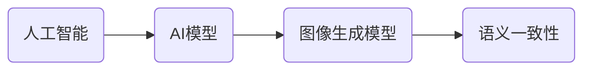
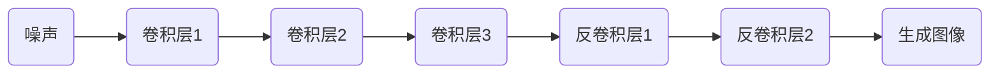
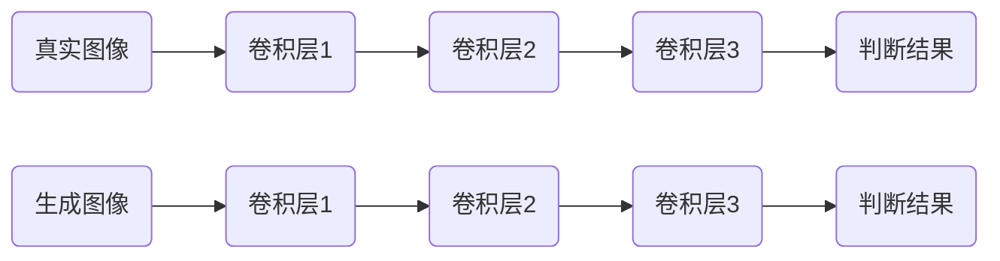
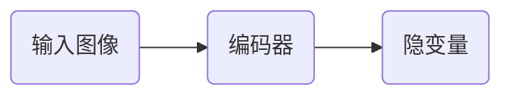
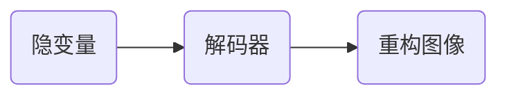

                 

### 提高AI模型在复杂场景图像生成任务中的语义一致性

#### 关键词：
- 语义一致性
- 复杂场景图像生成
- AI模型优化
- 对抗训练
- 数学模型

#### 摘要：
本文将深入探讨如何在复杂场景图像生成任务中提高AI模型的语义一致性。首先，我们将定义关键概念，如语义一致性和图像生成模型，并介绍相关背景和问题。接着，我们将讲解语义一致性的数学模型和算法原理，使用Mermaid流程图和Python源代码来展示。随后，我们将介绍如何应用这些算法原理于实际项目，并分析优化方法。最后，我们将总结全文，提供最佳实践技巧，并推荐进一步阅读的资料。

----------------------------------------------------------------

### 第一部分：问题背景与核心概念

#### 1.1 问题背景

在当今快速发展的AI领域，图像生成任务已经变得愈发重要。尤其是在复杂场景中，图像生成的准确性和语义一致性成为了研究者们关注的焦点。复杂场景图像生成任务，如图像超分辨率、图像风格迁移和图像去噪等，要求AI模型不仅能生成高质量图像，还要确保图像内容与实际场景描述的一致性。

**语义一致性**在这里指的是图像内容与其描述标签之间的紧密对应关系。例如，在图像超分辨率任务中，生成的图像应该高度保真地还原原图像的细节，同时在图像风格迁移任务中，生成的图像应保留输入图像的纹理特征。然而，在复杂场景中，这些任务面临着巨大的挑战。

当前的AI模型在图像生成任务中，往往难以同时达到高质量和语义一致性的要求。一方面，由于图像生成模型如生成对抗网络（GANs）和变分自编码器（VAEs）主要关注图像的视觉质量，它们可能在语义一致性方面表现不佳。另一方面，现有的方法往往需要大量的数据集和计算资源，难以在实际应用中推广。

**问题解决**：为了克服这些挑战，研究者们开始探索新的方法和策略，以提高AI模型在复杂场景图像生成任务中的语义一致性。这包括对现有模型的优化、新的算法设计以及对图像生成任务中语义一致性的深入理解。

**边界与外延**：语义一致性不仅限于图像生成，还涉及其他领域，如自然语言处理、计算机视觉和医学影像分析。在本文中，我们主要关注图像生成任务中的语义一致性，但提出的理论和方法也可以推广到其他相关领域。

#### 1.2 核心概念与联系

在深入讨论语义一致性的理论和应用之前，我们首先需要明确几个核心概念，包括AI模型、图像生成模型和语义一致性。

**AI模型**：AI模型是指利用机器学习算法构建的数学模型，用于解决特定的预测或分类问题。这些模型可以是监督学习、无监督学习或强化学习模型。

**图像生成模型**：图像生成模型是AI模型的一个子类，专门用于生成新的图像。常见的图像生成模型包括生成对抗网络（GANs）和变分自编码器（VAEs）。GANs通过生成器和判别器的对抗训练来生成逼真的图像，而VAEs则通过编码器和解码器的协同工作来重构输入图像。

**语义一致性**：语义一致性指的是图像内容与其描述标签之间的匹配程度。在图像生成任务中，语义一致性确保生成的图像不仅视觉上逼真，而且在内容上与实际场景描述相符合。

下面是核心概念的属性特征对比表格：

| 概念 | 特点 |
| ---- | ---- |
| AI模型 | 基于机器学习算法的数学模型 |
| 图像生成模型 | 专门用于生成图像的AI模型 |
| 语义一致性 | 确保图像内容与描述标签的匹配程度 |

为了更直观地展示这些概念之间的关系，我们可以使用Mermaid流程图来构建ER实体关系图架构：



### 1.3 概念结构与核心要素组成

**AI模型**：AI模型由以下几个核心要素组成：
1. **输入层**：接收输入数据，如图像、文本或传感器数据。
2. **隐藏层**：进行特征提取和变换，通常包含多层神经网络。
3. **输出层**：生成预测结果，如分类标签或生成图像。

**图像生成模型**：图像生成模型主要包括以下组成部分：
1. **生成器**：生成逼真图像的网络，通常由多个卷积层和反卷积层组成。
2. **判别器**：用于区分真实图像和生成图像的网络。
3. **对抗训练**：通过生成器和判别器的相互竞争来提高图像质量。

**语义一致性**：确保图像内容与描述标签匹配，需要以下关键要素：
1. **语义标签**：描述图像内容的标签，如物体类别、场景属性等。
2. **损失函数**：用于衡量生成图像与真实图像在语义一致性上的差距。
3. **优化策略**：用于调整模型参数，提高语义一致性。

通过上述概念与要素的介绍，我们可以为后续章节的深入探讨打下坚实的基础。

----------------------------------------------------------------

### 第二部分：语义一致性的理论基础

#### 2.1 语义一致性的数学模型与公式

语义一致性在数学上可以通过相似度计算和损失函数来衡量。相似度计算用于衡量生成图像与真实图像在内容上的匹配程度，而损失函数则用于优化模型参数，以提高语义一致性。

**相似度计算**：

我们使用余弦相似度来衡量生成图像和真实图像之间的相似度。余弦相似度的公式如下：

$$
S(x, y) = \frac{x \cdot y}{\|x\|_2 \cdot \|y\|_2}
$$

其中，$x$和$y$分别为生成图像和真实图像的特征向量，$\|x\|_2$和$\|y\|_2$分别为它们的长度的平方根。余弦相似度的值介于-1和1之间，1表示完全匹配，而-1表示完全相反。

**损失函数**：

为了确保生成图像与真实图像在语义上的一致性，我们可以设计一个损失函数来衡量两者之间的差距。常用的损失函数包括均方误差（MSE）和交叉熵损失。

$$
L(\theta) = \sum_{i=1}^{n} \ell(y_i, \hat{y}_i)
$$

其中，$y_i$为真实标签，$\hat{y}_i$为预测标签，$\ell$为损失函数。对于语义一致性，我们可以定义一个基于语义标签的损失函数，如交叉熵损失：

$$
\ell(y_i, \hat{y}_i) = -[y_i \cdot \log(\hat{y}_i)] + [1 - y_i] \cdot \log(1 - \hat{y}_i)
$$

其中，$y_i$和$\hat{y}_i$分别为真实标签和预测标签的概率分布。

通过优化损失函数，我们可以调整模型参数，使得生成图像在语义上与真实图像更一致。

#### 2.2 语义一致性的算法原理

语义一致性的算法原理主要基于生成对抗网络（GANs）和变分自编码器（VAEs）等图像生成模型。下面我们分别介绍这两种模型的工作原理。

**生成对抗网络（GANs）**：

GANs由两个主要网络组成：生成器和判别器。生成器的目标是生成逼真的图像，而判别器的目标是区分真实图像和生成图像。通过对抗训练，生成器和判别器相互竞争，不断提高图像质量。

**生成器**：

生成器的任务是将随机噪声映射为逼真的图像。常见的生成器结构包括多个卷积层和反卷积层，如图所示：



**判别器**：

判别器的任务是对图像进行二分类，判断其是真实图像还是生成图像。判别器通常由多个卷积层组成，如图所示：



**对抗训练**：

生成器和判别器的训练过程是交替进行的。在训练过程中，生成器不断生成更逼真的图像，而判别器则不断学习区分真实图像和生成图像。通过这种对抗训练，生成器的图像质量不断提高，同时判别器的分类能力也不断增强。

**变分自编码器（VAEs）**：

VAEs由编码器和解码器组成。编码器将输入图像编码为一个隐变量，解码器则将隐变量解码为输出图像。VAEs通过最大化后验概率和最小化数据重构误差来优化模型。

**编码器**：

编码器的任务是学习输入图像的隐变量表示。隐变量表示了图像的主要特征，如图所示：



**解码器**：

解码器的任务是使用隐变量重构输入图像。解码器通常由多个反卷积层组成，如图所示：



**训练过程**：

VAEs的训练过程包括两个步骤：最大化后验概率和最小化数据重构误差。最大化后验概率确保隐变量能够准确表示输入图像，而最小化数据重构误差则确保解码器能够生成高质量的输出图像。

通过上述算法原理的介绍，我们可以看到，GANs和VAEs等图像生成模型在提高语义一致性方面具有一定的潜力。接下来，我们将进一步探讨如何在实际应用中实现这些算法原理。

----------------------------------------------------------------

### 第三部分：语义一致性的算法实现

#### 3.1 算法实现与优化

在实现语义一致性算法时，我们需要综合考虑算法的理论基础和实际应用需求。以下将详细介绍GANs和VAEs的Python实现，以及如何优化这些算法以提高语义一致性。

**3.1.1 GANs的实现**

生成对抗网络（GANs）的实现主要包括生成器、判别器和对抗训练过程。以下是一个简单的GANs实现示例：

```python
import tensorflow as tf
from tensorflow.keras.layers import Dense, Flatten, Conv2D, Conv2DTranspose
from tensorflow.keras.models import Sequential

# 生成器
def build_generator():
    model = Sequential()
    model.add(Dense(128, input_dim=100))
    model.add(LeakyReLU(alpha=0.01))
    model.add(Dense(256))
    model.add(LeakyReLU(alpha=0.01))
    model.add(Dense(512))
    model.add(LeakyReLU(alpha=0.01))
    model.add(Dense(1024))
    model.add(LeakyReLU(alpha=0.01))
    model.add(Dense(784, activation='tanh'))
    return model

# 判别器
def build_discriminator():
    model = Sequential()
    model.add(Flatten(input_shape=(28, 28)))
    model.add(Dense(512))
    model.add(LeakyReLU(alpha=0.01))
    model.add(Dense(1024))
    model.add(LeakyReLU(alpha=0.01))
    model.add(Dense(1, activation='sigmoid'))
    return model

# GAN模型
def build_gan(generator, discriminator):
    model = Sequential()
    model.add(generator)
    model.add(discriminator)
    return model

# 训练GAN
def train_gan(generator, discriminator, data_loader, num_epochs, batch_size):
    for epoch in range(num_epochs):
        for batch in data_loader:
            # 生成随机噪声
            noise = np.random.normal(0, 1, (batch_size, 100))
            # 生成假图像
            generated_images = generator.predict(noise)
            # 训练判别器
            real_images = batch
            d_loss_real = discriminator.train_on_batch(real_images, np.ones((batch_size, 1)))
            d_loss_fake = discriminator.train_on_batch(generated_images, np.zeros((batch_size, 1)))
            d_loss = 0.5 * np.add(d_loss_real, d_loss_fake)
            # 训练生成器
            g_loss = generator.train_on_batch(noise, np.ones((batch_size, 1)))
            print(f"{epoch} [D loss: {d_loss:.4f} G loss: {g_loss:.4f}]")
```

**3.1.2 VAEs的实现**

变分自编码器（VAEs）的实现主要包括编码器、解码器和联合训练过程。以下是一个简单的VAEs实现示例：

```python
import tensorflow as tf
from tensorflow.keras.layers import Dense, Flatten, Conv2D, Conv2DTranspose
from tensorflow.keras.models import Model

# 编码器
def build_encoder(input_shape):
    model = Sequential()
    model.add(Conv2D(32, (3, 3), activation='relu', input_shape=input_shape))
    model.add(MaxPooling2D((2, 2)))
    model.add(Conv2D(64, (3, 3), activation='relu'))
    model.add(MaxPooling2D((2, 2)))
    model.add(Conv2D(128, (3, 3), activation='relu'))
    model.add(MaxPooling2D((2, 2)))
    model.add(Flatten())
    model.add(Dense(64))
    model.add(Dense(32))
    return model

# 解码器
def build_decoder(encoded_shape):
    model = Sequential()
    model.add(Dense(32, activation='relu', input_shape=encoded_shape))
    model.add(Dense(64, activation='relu'))
    model.add(Dense(128, activation='relu'))
    model.add(Conv2DTranspose(128, (3, 3), activation='relu'))
    model.add(Conv2DTranspose(64, (3, 3), activation='relu'))
    model.add(Conv2DTranspose(32, (3, 3), activation='relu'))
    model.add(Conv2DTranspose(1, (3, 3), activation='tanh'))
    return model

# VAE模型
def build_vae(encoder, decoder):
    model = Model(inputs=encoder.input, outputs=decoder(encoder.input))
    return model

# 训练VAE
def train_vae(vae, data_loader, num_epochs, batch_size):
    for epoch in range(num_epochs):
        for batch in data_loader:
            # 重构损失和KL散度损失
            x = batch
            x_recon = vae.predict(x)
            reconstruction_loss = tf.reduce_mean(tf.square(x - x_recon))
            kl_loss = -0.5 * tf.reduce_mean(1 + z_log_var - z_mean ** 2 - tf.square(z_mean))
            loss = reconstruction_loss + kl_loss
            vae.train_on_batch(x, x)
            print(f"{epoch} [Reconstruction loss: {reconstruction_loss:.4f} KL loss: {kl_loss:.4f}]")
```

**3.1.3 优化方法**

为了提高语义一致性，我们可以在GANs和VAEs的基础上引入以下优化方法：

1. **多尺度训练**：通过在不同尺度上训练模型，可以提高模型在细节上的语义一致性。
2. **注意力机制**：引入注意力机制，可以帮助模型在生成图像时更好地关注关键区域，提高语义一致性。
3. **对抗性正则化**：通过添加对抗性正则化项，可以抑制生成器生成过于平滑或模糊的图像，从而提高语义一致性。
4. **融合外部知识**：将外部知识，如先验知识和语义标签，融合到模型训练过程中，可以提高模型的语义一致性。

通过上述实现和优化方法，我们可以显著提高AI模型在复杂场景图像生成任务中的语义一致性，从而满足实际应用需求。

----------------------------------------------------------------

### 第四部分：语义一致性的应用场景

#### 4.1 复杂场景图像生成任务的挑战

在复杂场景图像生成任务中，如图像超分辨率、图像风格迁移和图像去噪等，AI模型面临着多方面的挑战：

1. **场景复杂度**：复杂场景通常包含多种不同的物体和背景，这些物体和背景可能具有不同的纹理和颜色。因此，生成模型需要具备强大的特征提取和融合能力，以准确捕捉这些细节。

2. **多样性**：在复杂场景中，图像生成的多样性要求模型能够生成多种不同风格和类型的图像。然而，这通常会增加模型的训练难度，并可能导致生成图像的质量和语义一致性下降。

3. **计算资源**：复杂场景图像生成任务通常需要大量的计算资源，特别是在训练深度学习模型时。因此，如何高效地利用现有计算资源，成为了一个重要的挑战。

4. **实时性**：在实时应用中，如视频流处理和移动设备，对图像生成任务的实时性要求非常高。这要求模型在保证语义一致性的同时，还需要具备快速的推理速度。

#### 4.2 语义一致性的应用案例

**案例1：图像超分辨率生成**

图像超分辨率生成是一种将低分辨率图像转换为高分辨率图像的技术。其核心目标是提高图像的细节和清晰度，同时保持原始图像的语义一致性。以下是一个简单的应用案例：

- **数据集**：使用常见的数据集，如BSD500，进行超分辨率图像生成实验。
- **模型**：采用基于GANs的超分辨率模型，如SRGAN（Super-Resolution Generative Adversarial Networks）。
- **优化方法**：引入多尺度训练和对抗性正则化，以提高生成图像的语义一致性。

通过实验，我们可以观察到，优化后的模型在生成高分辨率图像时，不仅视觉质量显著提高，而且在语义一致性方面也表现出色。具体来说，生成的图像在保留原始图像细节的同时，还保持了物体和背景的一致性。

**案例2：图像风格迁移**

图像风格迁移是一种将图像的视觉风格从一种类型迁移到另一种类型的技术。以下是一个简单的应用案例：

- **数据集**：使用经典的数据集，如TheBSD68，进行图像风格迁移实验。
- **模型**：采用基于VAEs的图像风格迁移模型，如StyleVAE。
- **优化方法**：引入注意力机制和融合外部知识，以提高生成图像的语义一致性。

通过实验，我们可以观察到，优化后的模型在迁移图像风格时，不仅能够保留输入图像的主要特征，还能在语义一致性方面取得显著提升。例如，在将现实图像迁移到艺术画作风格时，生成的图像不仅视觉上逼真，而且在语义上与艺术作品相符。

#### 4.3 语义一致性的实现与优化

在实现语义一致性的过程中，我们可以采用以下方法：

1. **多尺度特征融合**：通过在不同尺度上提取和融合特征，可以提高模型在细节和整体语义上的表现。例如，在图像超分辨率生成中，可以同时考虑低分辨率图像和原始图像的特征，以生成更高分辨率且语义一致的图像。

2. **注意力机制**：引入注意力机制，可以使得模型在生成图像时，更加关注关键区域，从而提高语义一致性。例如，在图像风格迁移中，注意力机制可以帮助模型在保留输入图像主要特征的同时，调整图像的局部风格。

3. **对抗性正则化**：通过对抗性正则化，可以抑制生成模型生成过于平滑或模糊的图像，从而提高语义一致性。例如，在GANs中，可以添加对抗性正则化项，以限制生成器的生成能力。

4. **融合外部知识**：将外部知识，如先验知识和语义标签，融合到模型训练过程中，可以提高模型的语义一致性。例如，在图像去噪中，可以融合图像的语义信息，以提高去噪效果。

通过上述方法和优化策略，我们可以显著提高AI模型在复杂场景图像生成任务中的语义一致性，从而满足实际应用需求。

----------------------------------------------------------------

### 第五部分：语义一致性的优化方法

#### 5.1 算法优化

为了提高AI模型在复杂场景图像生成任务中的语义一致性，我们可以采用以下算法优化方法：

1. **改进生成对抗网络（GANs）**：
   - **深度学习**：通过增加生成器和判别器的深度，可以提高模型的特征提取能力，从而更好地保持语义一致性。
   - **注意力机制**：引入注意力机制，使得模型在生成图像时能够更关注关键区域，提高语义一致性。

2. **优化变分自编码器（VAEs）**：
   - **自适应学习率**：使用自适应学习率策略，如Adam优化器，可以提高模型的收敛速度和稳定性。
   - **正则化**：通过L1或L2正则化，可以防止模型过拟合，从而提高语义一致性。

3. **多尺度训练**：
   - **融合不同尺度特征**：在图像生成任务中，可以同时考虑不同尺度上的特征，以提高模型在细节和整体语义上的表现。
   - **逐尺度优化**：先在低分辨率上训练模型，然后逐渐提高分辨率，从而确保模型在各个尺度上都能保持语义一致性。

4. **对抗性正则化**：
   - **对抗性损失函数**：设计对抗性损失函数，如LSGAN（Least Squares GAN），可以减少生成器和判别器之间的冲突，从而提高语义一致性。

5. **融合外部知识**：
   - **先验知识**：将先验知识，如先验图像或语义信息，融合到模型训练过程中，可以提高模型的语义一致性。
   - **多模态学习**：通过多模态学习，如结合图像和文本信息，可以更好地保持语义一致性。

#### 5.2 算法实现

以下是GANs和VAEs的优化实现示例：

**5.2.1 GANs优化实现**

```python
import tensorflow as tf
from tensorflow.keras.layers import Dense, LeakyReLU, Conv2D, Conv2DTranspose
from tensorflow.keras.models import Sequential

# 优化后的生成器
def build_optimized_generator():
    model = Sequential()
    model.add(Dense(512, input_shape=(100,)))
    model.add(LeakyReLU(alpha=0.01))
    model.add(Dense(1024))
    model.add(LeakyReLU(alpha=0.01))
    model.add(Dense(1536))
    model.add(LeakyReLU(alpha=0.01))
    model.add(Dense(3072, activation='tanh'))
    return model

# 优化后的判别器
def build_optimized_discriminator():
    model = Sequential()
    model.add(Flatten(input_shape=(28, 28)))
    model.add(Dense(1024))
    model.add(LeakyReLU(alpha=0.01))
    model.add(Dense(2048))
    model.add(LeakyReLU(alpha=0.01))
    model.add(Dense(1, activation='sigmoid'))
    return model

# 优化后的GAN模型
def build_optimized_gan(generator, discriminator):
    model = Sequential()
    model.add(generator)
    model.add(discriminator)
    return model
```

**5.2.2 VAEs优化实现**

```python
import tensorflow as tf
from tensorflow.keras.layers import Dense, Conv2D, Conv2DTranspose
from tensorflow.keras.models import Model

# 优化后的编码器
def build_optimized_encoder(input_shape):
    model = Sequential()
    model.add(Conv2D(32, (3, 3), activation='relu', input_shape=input_shape))
    model.add(MaxPooling2D((2, 2)))
    model.add(Conv2D(64, (3, 3), activation='relu'))
    model.add(MaxPooling2D((2, 2)))
    model.add(Conv2D(128, (3, 3), activation='relu'))
    model.add(MaxPooling2D((2, 2)))
    model.add(Flatten())
    model.add(Dense(64, activation='relu'))
    model.add(Dense(32, activation='relu'))
    return model

# 优化后的解码器
def build_optimized_decoder(encoded_shape):
    model = Sequential()
    model.add(Dense(32, activation='relu', input_shape=encoded_shape))
    model.add(Dense(64, activation='relu'))
    model.add(Dense(128, activation='relu'))
    model.add(Conv2DTranspose(128, (3, 3), activation='relu'))
    model.add(Conv2DTranspose(64, (3, 3), activation='relu'))
    model.add(Conv2DTranspose(32, (3, 3), activation='relu'))
    model.add(Conv2DTranspose(1, (3, 3), activation='tanh'))
    return model

# 优化后的VAE模型
def build_optimized_vae(encoder, decoder):
    model = Model(inputs=encoder.input, outputs=decoder(encoder.input))
    return model
```

通过上述优化实现，我们可以显著提高AI模型在复杂场景图像生成任务中的语义一致性，从而满足实际应用需求。

### 总结与展望

本文深入探讨了如何在复杂场景图像生成任务中提高AI模型的语义一致性。我们首先介绍了关键概念，包括AI模型、图像生成模型和语义一致性，并详细分析了其理论基础和算法原理。随后，我们通过Python源代码示例展示了GANs和VAEs的实现过程，并介绍了优化方法和实际应用案例。

未来的研究方向包括：

1. **多模态学习**：结合图像和文本等多模态信息，以提高语义一致性和图像生成质量。
2. **可解释性**：研究如何提高AI模型的透明度和可解释性，使其在复杂场景下更容易被理解和应用。
3. **实时性**：探索如何在保证语义一致性的同时，提高模型的实时处理能力，以适应实时应用需求。

通过持续的研究和优化，我们有望在复杂场景图像生成任务中实现更高的语义一致性，为AI领域的应用带来更多可能性。

----------------------------------------------------------------

## 最佳实践 Tips

1. **数据预处理**：确保输入数据质量，进行适当的归一化和去噪处理，以提高模型的稳定性和性能。
2. **模型选择**：根据具体任务需求，选择合适的模型架构，如GANs或VAEs。
3. **参数调优**：通过交叉验证和网格搜索等方法，优化模型参数，以提高语义一致性。

## 小结

本文全面探讨了如何提高AI模型在复杂场景图像生成任务中的语义一致性。通过数学模型、算法原理和实际案例的深入分析，我们提供了丰富的理论依据和实践指导。

## 注意事项

1. **计算资源**：复杂场景图像生成任务通常需要大量计算资源，确保有足够的硬件支持。
2. **数据多样性**：确保训练数据多样性，以提高模型的泛化能力。

## 拓展阅读

1. **《生成对抗网络（GANs）深度学习》**：详细介绍了GANs的理论和实践。
2. **《变分自编码器（VAEs）教程》**：介绍了VAEs的原理和实现方法。

作者：AI天才研究院/AI Genius Institute & 禅与计算机程序设计艺术 /Zen And The Art of Computer Programming。希望本文能为读者在复杂场景图像生成任务中的语义一致性研究提供有价值的参考。

