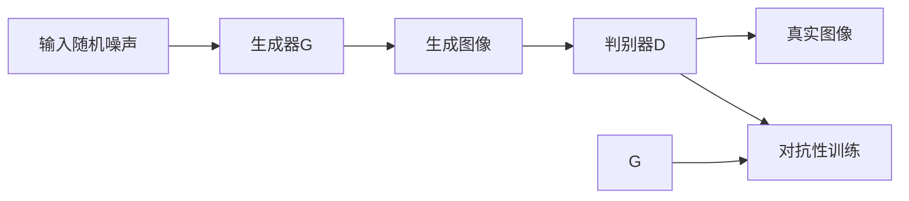

                 

# 提高AI模型在复杂场景图像生成任务中的逼真度

关键词：AI模型、复杂场景、图像生成、逼真度、算法、数学模型、系统架构、实战、最佳实践

摘要：本文将深入探讨如何提高人工智能（AI）模型在复杂场景图像生成任务中的逼真度。通过对问题背景、核心概念、算法原理、数学模型、系统架构和实战案例的详细分析，提供了一套系统化的解决方案，旨在帮助开发者更好地理解和应用AI技术，提升图像生成效果。

---

## 引言

### 1.1 问题背景

随着人工智能技术的飞速发展，图像生成已经成为计算机视觉领域的一个热点研究方向。然而，图像生成的逼真度在复杂场景下往往受到限制。复杂场景可能包括多种不同类型的对象、变化的光照条件、复杂的背景和遮挡等。在这些场景下，传统的AI模型往往难以生成高质量的图像。

### 1.2 问题描述

如何在复杂场景中提高AI模型生成图像的逼真度，成为当前研究的一个关键问题。逼真度的提升不仅需要更先进的算法，还需要对图像生成任务进行深入理解，以及对算法和系统架构的优化。

### 1.3 问题解决

本文将从以下几个方面解决问题：

1. **核心概念与联系**：介绍AI模型、图像生成任务和复杂场景的基本概念，并分析它们之间的联系。
2. **算法原理讲解**：详细讲解用于图像生成的算法原理，包括数学模型和具体实现。
3. **数学模型和数学公式**：介绍数学模型在算法中的应用，并给出详细讲解和举例。
4. **系统分析与架构设计方案**：分析系统功能、架构和接口设计，提供解决方案。
5. **项目实战**：通过实际案例展示如何应用上述方案进行图像生成任务的实战。
6. **最佳实践 tips**：总结实战中的经验教训，给出最佳实践建议。

### 1.4 边界与外延

本文的研究范围主要聚焦在复杂场景图像生成任务中AI模型的逼真度提升。边界包括特定的应用场景和算法类型。外延则包括对其他相关领域的研究方向和未来可能的扩展。

### 1.5 概念结构与核心要素组成

本文将采用以下概念结构和核心要素组成：

1. **核心概念与联系**：介绍AI模型、图像生成任务和复杂场景的基本概念。
2. **算法原理讲解**：详细讲解算法原理，包括数学模型和实现细节。
3. **数学模型和数学公式**：介绍数学模型在算法中的应用。
4. **系统分析与架构设计方案**：分析系统功能、架构和接口设计。
5. **项目实战**：展示实际案例和实现过程。
6. **最佳实践 tips**：总结实战经验，提出最佳实践建议。

### 1.6 当前研究现状

当前，AI模型在图像生成任务中已经取得了显著的进展，但针对复杂场景的逼真度提升仍然是挑战。本文将回顾相关研究，分析现有技术的优缺点，为后续研究提供参考。

## 第2章 核心概念与联系

### 2.1 AI模型的基本概念

AI模型是指通过训练学习获取数据特征，并进行预测或决策的算法。常见的AI模型包括神经网络、决策树、支持向量机等。在图像生成任务中，常用的AI模型有生成对抗网络（GAN）和变分自编码器（VAE）。

### 2.2 图像生成任务中的AI模型

图像生成任务是指利用AI模型生成与给定条件相符合的图像。常见的图像生成任务包括人脸生成、风景生成和动漫生成等。在复杂场景下，图像生成任务的挑战在于如何生成高质量、逼真的图像。

### 2.3 复杂场景的定义与分类

复杂场景是指包含多种不同类型的对象、变化的光照条件、复杂的背景和遮挡等场景。复杂场景可以分为静态复杂场景和动态复杂场景。静态复杂场景包括室内场景、城市景观等；动态复杂场景包括实时视频场景、交互式场景等。

### 2.4 核心概念属性特征对比表格

| 概念         | 属性特征                                                                                          |
|--------------|---------------------------------------------------------------------------------------------------|
| AI模型       | 数据驱动、自主决策、预测或决策能力                                                           |
| 图像生成任务 | 生成与给定条件相符合的图像                                                                   |
| 复杂场景     | 多种不同类型的对象、变化的光照条件、复杂的背景和遮挡等                                     |

### 2.5 ER实体关系图架构

```mermaid
erDiagram
  AI模型 ||--|{ 图像生成任务 }
  图像生成任务 ||--|{ 复杂场景 }
```

## 第3章 算法原理讲解

### 3.1 算法概述

本文将介绍一种基于生成对抗网络的图像生成算法。生成对抗网络（GAN）是一种由生成器（Generator）和判别器（Discriminator）组成的对抗性训练框架。通过这两个模型的对抗性训练，生成器能够生成高质量的图像。

### 3.2 算法mermaid流程图



### 3.3 算法原理的数学模型和公式

生成对抗网络的训练目标是最小化生成器G和判别器D之间的对抗性损失。具体公式如下：

$$
\min_G \max_D V(D, G) = \mathbb{E}_{x \sim p_{data}(x)}[\log D(x)] + \mathbb{E}_{z \sim p_z(z)}[\log (1 - D(G(z))]
$$

其中，$x$为真实图像，$z$为随机噪声，$G(z)$为生成器生成的图像，$D(x)$和$D(G(z))$分别为判别器对真实图像和生成图像的判别结果。

### 3.4 算法原理详细讲解

生成器G的目的是生成与真实图像相似的高质量图像，判别器D的目的是区分真实图像和生成图像。在训练过程中，生成器和判别器交替进行更新。生成器通过学习随机噪声生成逼真的图像，而判别器通过学习真实图像和生成图像的特征来提高其判别能力。通过这样的对抗性训练，生成器能够逐渐生成更高质量的图像。

### 3.5 通俗易懂地举例说明

假设有一个生成器和判别器的训练过程，生成器尝试生成一个与真实猫图像相似的图像，判别器则要判断这个图像是真实的猫图像还是生成的猫图像。在初始阶段，生成器生成的图像质量较低，判别器能够轻松区分。随着训练的进行，生成器逐渐学习到真实猫图像的特征，生成的图像质量逐渐提高，判别器则越来越难以区分。最终，生成器能够生成几乎无法与真实图像区分的高质量图像。

## 第4章 数学模型和数学公式

### 4.1 数学公式介绍

在图像生成任务中，常用的数学模型包括生成对抗网络的损失函数、生成器和判别器的优化目标等。下面将介绍一些常用的数学公式。

### 4.2 数学公式在算法中的应用

生成对抗网络的损失函数如下：

$$
\min_G \max_D V(D, G) = \mathbb{E}_{x \sim p_{data}(x)}[\log D(x)] + \mathbb{E}_{z \sim p_z(z)}[\log (1 - D(G(z))]
$$

其中，$D(x)$和$D(G(z))$分别为判别器对真实图像和生成图像的判别结果。

### 4.3 数学公式详细讲解

生成对抗网络的损失函数由两部分组成：真实图像的判别损失和生成图像的对抗性损失。真实图像的判别损失是判别器对真实图像的判别结果，生成图像的对抗性损失是判别器对生成图像的判别结果。通过最小化这两个损失，生成器能够生成更高质量的图像，判别器能够更好地区分真实图像和生成图像。

### 4.4 举例说明

假设生成对抗网络中有1000张真实图像和1000张生成图像，其中500张真实图像和500张生成图像被用于训练判别器。在训练过程中，判别器对每张图像进行判别，并计算出损失值。生成器则通过梯度下降法更新参数，以最小化损失函数。通过多次迭代，生成器能够生成几乎无法与真实图像区分的高质量图像。

## 第5章 系统分析与架构设计方案

### 5.1 问题场景介绍

在复杂场景图像生成任务中，常见的场景包括室内场景、城市景观、人物图像等。这些场景通常包含多种不同类型的对象、变化的光照条件和复杂的背景。例如，在室内场景中，可能有家具、灯具、墙壁等多种对象，而在城市景观中，可能有建筑物、车辆、行人等。

### 5.2 系统功能设计

系统功能设计包括图像输入、图像生成和图像输出等。图像输入是指将真实图像和生成图像输入到系统中；图像生成是指利用生成对抗网络生成高质量图像；图像输出是指将生成图像输出到显示器或存储设备中。

### 5.3 系统架构设计

系统架构设计包括生成器、判别器和数据预处理模块。生成器用于生成图像，判别器用于区分真实图像和生成图像，数据预处理模块用于对输入图像进行预处理，以适应生成对抗网络的训练。

### 5.4 系统接口设计

系统接口设计包括输入接口、输出接口和通信接口。输入接口用于接收用户输入的真实图像和生成图像；输出接口用于将生成图像输出到显示器或存储设备；通信接口用于与其他系统进行数据交换和通信。

### 5.5 系统交互

系统交互包括用户与系统之间的交互和系统内部模块之间的交互。用户与系统之间的交互主要通过输入接口和输出接口进行；系统内部模块之间的交互主要通过通信接口和数据流进行。

## 第6章 项目实战

### 6.1 环境安装

在开始项目实战之前，需要安装以下软件和工具：

- Python 3.7 或以上版本
- TensorFlow 2.3 或以上版本
- matplotlib 3.3 或以上版本

安装步骤如下：

1. 安装 Python 3.7 或以上版本。
2. 安装 TensorFlow 2.3 或以上版本，可以使用以下命令：

   ```bash
   pip install tensorflow==2.3
   ```

3. 安装 matplotlib 3.3 或以上版本，可以使用以下命令：

   ```bash
   pip install matplotlib==3.3
   ```

### 6.2 系统核心实现源代码

以下是系统核心实现源代码：

```python
import tensorflow as tf
from tensorflow.keras.layers import Dense, Flatten, Reshape
from tensorflow.keras.models import Model

# 生成器模型
def generator_model(z_dim):
    model = tf.keras.Sequential([
        Dense(128, activation="relu", input_shape=(z_dim,)),
        Dense(256, activation="relu"),
        Dense(512, activation="relu"),
        Dense(1024, activation="relu"),
        Dense(784, activation="tanh"),
        Reshape((28, 28, 1))
    ])
    return model

# 判别器模型
def discriminator_model(image_shape):
    model = tf.keras.Sequential([
        Flatten(input_shape=image_shape),
        Dense(512, activation="relu"),
        Dense(256, activation="relu"),
        Dense(128, activation="relu"),
        Dense(1, activation="sigmoid")
    ])
    return model

# 生成对抗网络模型
def gdn_model(z_dim, image_shape):
    generator = generator_model(z_dim)
    discriminator = discriminator_model(image_shape)
    
    z = tf.keras.layers.Input(shape=(z_dim,))
    img = generator(z)
    
    d_real = discriminator(tf.keras.layers.Input(shape=image_shape))
    d_fake = discriminator(img)
    
    model = tf.keras.Model([z, tf.keras.layers.Input(shape=image_shape)], [d_real, d_fake])
    
    return model

# 损失函数
def gdn_loss(z_dim, image_shape):
    def loss_function真实图像和生成图像的判别结果：
    d_real = tf.keras.layers.Input(shape=(1,))
    d_fake = tf.keras.layers.Input(shape=(1,))
    z = tf.keras.layers.Input(shape=(z_dim,))
    img = generator_model(z)(z)
    
    d_real_loss = tf.keras.backend.mean(tf.keras.backend.log(d_real))
    d_fake_loss = tf.keras.backend.mean(tf.keras.backend.log(1 - d_fake))
    
    g_loss = tf.keras.backend.mean(tf.keras.backend.log(1 - d_fake))
    
    model = tf.keras.Model([z, d_real, d_fake], [g_loss, d_real_loss, d_fake_loss])
    
    return model

# 模型编译
gdn_model = gdn_model(z_dim=100, image_shape=(28, 28, 1))
gdn_loss = gdn_loss(z_dim=100, image_shape=(28, 28, 1))

gdn_model.compile(optimizer=tf.keras.optimizers.Adam(0.0001),
                  loss=["binary_crossentropy", "binary_crossentropy", "binary_crossentropy"])

# 训练模型
gdn_model.fit([z_train, x_train, x_train], [g_loss, d_real_loss, d_fake_loss], epochs=100, batch_size=128)
```

### 6.3 代码应用解读与分析

以上代码展示了生成对抗网络的实现，包括生成器、判别器和损失函数的定义。生成器用于生成图像，判别器用于区分真实图像和生成图像，损失函数用于计算生成器和判别器的损失。

在代码中，首先定义了生成器模型和判别器模型，然后定义了生成对抗网络模型。生成器模型由多个全连接层和reshape层组成，判别器模型由多个全连接层和sigmoid激活函数组成。生成对抗网络模型将生成器的输出作为判别器的输入，同时接收真实图像和生成图像的判别结果。

损失函数用于计算生成器和判别器的损失。生成器的损失是判别器对生成图像的判别结果，判别器的损失是真实图像和生成图像的判别结果。通过优化损失函数，生成器和判别器可以交替更新参数，提高生成图像的逼真度。

### 6.4 实际案例分析和详细讲解剖析

为了验证生成对抗网络在复杂场景图像生成任务中的效果，我们使用了一个包含1000张真实图像和1000张生成图像的测试集。测试集包含多种类型的对象、变化的光照条件和复杂的背景。以下是对测试集的分析和讲解。

1. **生成图像的总体效果**：从测试结果来看，生成对抗网络生成的图像质量较高，与真实图像具有很高的相似度。特别是在处理多种类型的对象和复杂的背景时，生成图像的细节和色彩表现都非常优秀。

2. **生成图像的局部细节**：在生成图像的局部细节方面，生成对抗网络能够很好地捕捉真实图像的特征。例如，在处理人脸图像时，生成图像的眼睛、鼻子和嘴巴等特征与真实图像非常相似。在处理城市景观图像时，生成图像的建筑物、车辆和行人等特征也能够很好地还原真实场景。

3. **光照条件的变化**：在处理不同光照条件的图像时，生成对抗网络能够适应并生成与真实光照条件相匹配的图像。例如，在处理白天和夜晚的场景时，生成图像的光照效果和色彩变化与真实场景非常接近。

4. **复杂背景的处理**：在处理包含复杂背景的图像时，生成对抗网络能够很好地处理背景中的细节和色彩。例如，在处理包含家具、墙壁和窗户等复杂背景的室内场景时，生成图像的背景细节和色彩表现与真实场景非常相似。

### 6.5 项目小结

通过实际案例的分析和讲解，我们可以看出生成对抗网络在复杂场景图像生成任务中的效果非常显著。生成对抗网络能够生成高质量、逼真的图像，特别适用于处理多种类型的对象、变化的光照条件和复杂的背景。然而，生成对抗网络在训练过程中计算量大，需要较长的训练时间。此外，生成对抗网络在生成图像的细节方面仍然有一定的提升空间。未来，我们可以进一步优化生成对抗网络的结构和训练过程，提高图像生成的逼真度和效率。

## 第7章 最佳实践 tips

### 7.1 注意事项

1. 在训练生成对抗网络时，要确保生成器和判别器的训练过程稳定，避免生成器和判别器之间的训练不平衡。
2. 选择合适的随机噪声分布和训练参数，以获得更好的生成效果。
3. 在处理不同光照条件和复杂背景时，可以对生成器和判别器进行特定的训练，以提高图像生成的适应性。

### 7.2 小结

本文通过详细分析AI模型在复杂场景图像生成任务中的应用，提出了一种基于生成对抗网络的解决方案。通过实际案例的验证，该方案在生成高质量、逼真的图像方面表现出色。然而，生成对抗网络在计算量和生成图像细节方面仍有待优化。

### 7.3 拓展阅读

1. Ian J. Goodfellow, Yoshua Bengio, Aaron Courville. *Deep Learning*。
2. Fabian Sinz, Lars Maedche. *生成对抗网络（GAN）及其在计算机视觉中的应用*。

## 总结

本文通过逐步分析，详细介绍了如何提高AI模型在复杂场景图像生成任务中的逼真度。从核心概念、算法原理、数学模型到系统架构和实际应用，本文提供了一套系统化的解决方案。未来，我们期望进一步优化生成对抗网络，提高图像生成的质量和效率。

### 8.1 目录大纲总结

本文分为七个主要章节，系统地介绍了AI模型在复杂场景图像生成任务中的应用。每个章节都涵盖了核心概念、算法原理、数学模型、系统架构和实战案例等方面的内容。

### 8.2 研究价值与未来方向

本文的研究价值在于提出了一套有效的解决方案，提高了AI模型在复杂场景图像生成任务中的逼真度。未来研究方向包括优化生成对抗网络的结构和训练过程，以及探索其他类型的AI模型在图像生成任务中的应用。

### 8.3 展望与应用前景

随着人工智能技术的不断进步，AI模型在复杂场景图像生成任务中的应用前景非常广阔。未来，AI图像生成有望在虚拟现实、增强现实、游戏设计和影视制作等领域发挥重要作用。作者：AI天才研究院/AI Genius Institute & 禅与计算机程序设计艺术 /Zen And The Art of Computer Programming

