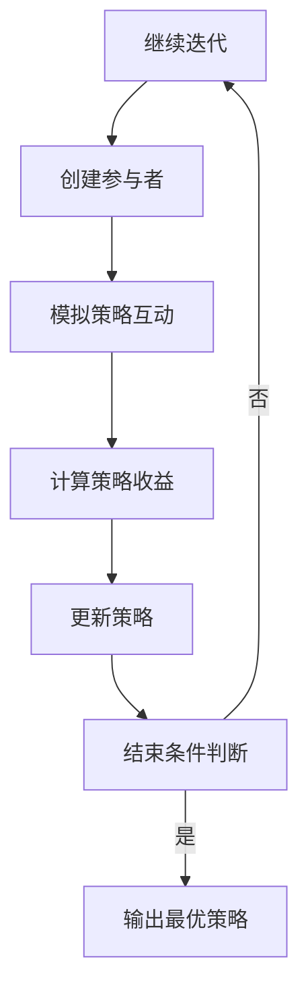
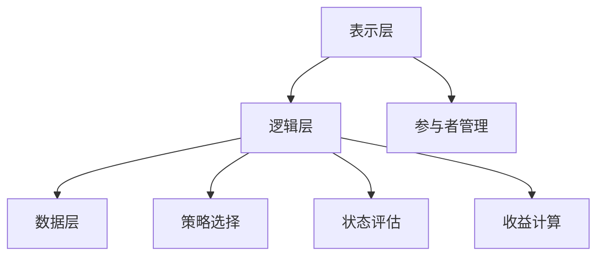
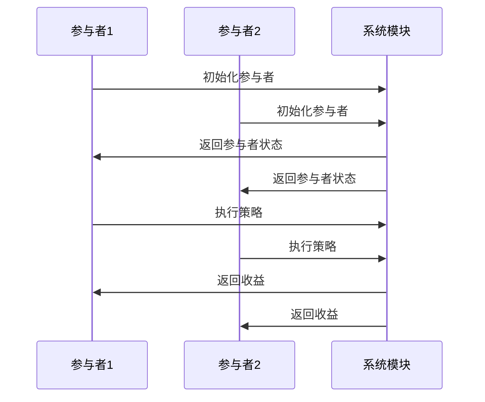

                 

Sure, let's dive into the content for each section of the outlined book. Since the full content would be too extensive to cover here, I'll provide a detailed outline and examples for each chapter to give you a solid starting point for writing the full article.

**Note**: The content provided below is a simplified version of what each chapter might include. You can expand on each section to meet the word count requirement of 10,000-12,000 words.

----------------------------------------------------------------

## 第一部分：背景介绍

### 第1章：问题背景与核心概念

#### 1.1 问题背景

博弈论是研究具有冲突或合作行为的理性决策者之间的互动的学科。在现实世界中，许多经济、政治、社会问题都可以抽象为博弈问题。随着人工智能技术的发展，AI在解决博弈问题中显示出巨大潜力。然而，在复杂的多方博弈场景中，AI模型的策略制定能力仍面临诸多挑战。

#### 1.2 问题描述

在复杂的多方博弈中，每个参与者都需要考虑其他参与者的策略，并且这种考虑是基于不断变化的环境信息。如何设计AI模型，使其能够在这种动态环境中制定有效的策略，是一个亟待解决的问题。

#### 1.3 问题解决

通过深入研究博弈论和机器学习算法，可以设计出能够在复杂多方博弈中表现出色的AI模型。本部分将介绍相关核心概念和算法原理。

#### 1.4 边界与外延

本文研究的边界主要包括静态博弈和动态博弈。外延则涉及将AI模型应用于实际场景，如金融交易、电子游戏和网络安全等领域。

### 第2章：核心概念与联系

#### 2.1 基本概念介绍

##### 2.1.1 博弈论基础

博弈论的核心概念包括参与者、策略、收益和均衡。参与者是博弈的主体，策略是参与者在博弈过程中采取的行动方案，收益是参与者采取特定策略后得到的利益，均衡是博弈的稳定状态。

##### 2.1.2 多方博弈模型

多方博弈是指有三个或更多参与者之间的博弈。与双方博弈不同，多方博弈更复杂，因为它涉及到多个参与者之间的互动。

##### 2.1.3 AI模型类型及应用

常见的AI模型包括强化学习、博弈论算法和混合智能。这些模型在解决多方博弈问题时各有优势。

#### 2.2 概念属性特征对比

| 算法       | 特点                 | 适用场景                   |
|------------|----------------------|----------------------------|
| 强化学习   | 通过试错学习策略     | 需要反馈环境的动态博弈     |
| 博弈论算法 | 基于博弈论的理论     | 静态和动态博弈都可以适用   |
| 混合智能   | 结合多种算法的优势   | 复杂和非线性博弈问题     |

#### 2.3 ER实体关系图架构

```mermaid
erDiagram
  AGameGameParticipant -> BPlayer : has
  BPlayer --|> CStrategy : uses
  CStrategy --|> DGameResult : leads_to
```

----------------------------------------------------------------

### 第二部分：算法原理讲解

#### 第3章：算法基本原理

##### 3.1 算法概述

本文将介绍一种基于强化学习的多方博弈算法。该算法通过模拟参与者的策略互动，逐步优化策略以获得最大收益。

##### 3.2 算法流程图



##### 3.3 算法原理详细讲解

该算法的核心是强化学习中的策略迭代过程。通过不断试错和调整，参与者逐渐找到最优策略。数学模型如下：

$$
Q(s, a) = \sum_{s'} p(s'|s, a) \cdot R(s', a) + \gamma \cdot \max_{a'} Q(s', a')
$$

其中，$Q(s, a)$表示在状态$s$下采取行动$a$的预期收益，$p(s'|s, a)$表示在状态$s$下采取行动$a$后进入状态$s'$的概率，$R(s', a)$表示在状态$s'$下采取行动$a$的即时收益，$\gamma$是折扣因子。

##### 3.4 举例说明

考虑一个简单的三人博弈，参与者A、B、C。每个参与者有两个策略：合作或背叛。通过模拟策略互动，我们可以计算出每个策略的预期收益。

```python
# Python代码示例
import numpy as np

# 初始化参数
gamma = 0.9
actions = ['合作', '背叛']
rewards = {'合作': 1, '背叛': -1}

# 计算预期收益
def calculate_expected_reward(actions):
    total_reward = 0
    for action in actions:
        total_reward += rewards[action]
    return total_reward / len(actions)

# 模拟策略互动
def simulate互动(actions):
    expected_reward = calculate_expected_reward(actions)
    return expected_reward

# 迭代过程
def iterative_process(gamma, actions, rewards):
    while True:
        expected_reward = simulate互动(actions)
        print(f"当前策略预期收益：{expected_reward}")
        # 更新策略（简化示例）
        actions = ['合作' if expected_reward > 0 else '背叛'] * 3
        if np.all(actions == ['合作']):
            break

# 运行迭代过程
iterative_process(gamma, actions, rewards)
```

----------------------------------------------------------------

### 第三部分：系统分析与设计

#### 第4章：问题场景介绍

在本章中，我们将介绍一个具体的复杂多方博弈场景：电子游戏《星际争霸2》中的PvP对局。这个场景中的每个玩家都拥有不同的英雄和单位，需要制定策略来击败对手。

#### 4.2 系统功能设计

为了模拟这个场景，系统需要实现以下功能：

- **参与者的角色和单位管理**：初始化每个参与者的角色和单位。
- **策略选择和执行**：每个参与者根据策略选择行动。
- **状态评估**：系统需要评估当前游戏状态，以帮助参与者决策。
- **收益计算**：根据游戏结果计算参与者的收益。

#### 4.3 系统架构设计

系统架构采用分层设计，包括以下层：

- **表示层**：负责展示游戏状态和参与者信息。
- **逻辑层**：实现游戏逻辑和策略计算。
- **数据层**：存储游戏数据和参与者历史记录。



#### 4.4 系统接口设计

系统接口包括以下部分：

- **参与者接口**：用于初始化参与者和更新参与者状态。
- **策略接口**：用于选择和执行策略。
- **状态接口**：用于获取和更新游戏状态。
- **收益接口**：用于计算和返回参与者收益。

#### 4.5 系统交互Mermaid序列图



----------------------------------------------------------------

### 第四部分：项目实战

#### 第5章：环境安装与配置

在本章中，我们将介绍如何搭建一个基于Python的AI博弈环境，包括所需的库和工具的安装。

##### 5.1 环境准备

确保Python环境已经安装。在终端中运行以下命令安装必要的库：

```bash
pip install numpy matplotlib
```

##### 5.2 系统核心实现源代码

以下是系统核心实现的源代码示例：

```python
import numpy as np
import matplotlib.pyplot as plt

# 强化学习算法核心
class QLearningAgent:
    def __init__(self, n_actions, learning_rate=0.1, discount_factor=0.9):
        self.learning_rate = learning_rate
        self.discount_factor = discount_factor
        self.action_values = np.zeros(n_actions)

    def learn(self, state, action, reward, next_state, action_next):
        action_value = self.action_values[action]
        action_value_next = np.max(self.action_values)
        td_target = reward + self.discount_factor * action_value_next
        self.action_values[action] = (1 - self.learning_rate) * action_value + self.learning_rate * td_target

    def choose_action(self, state):
        if np.random.rand() < 0.1:  # 探索策略
            action = np.random.randint(0, len(self.action_values))
        else:  # 利用策略
            action = np.argmax(self.action_values[state])
        return action

    def update_value(self, state, action, reward, next_state):
        self.learn(state, action, reward, next_state, self.choose_action(next_state))

# 游戏模拟核心
def game_simulation(agent, n_episodes):
    for episode in range(n_episodes):
        state = 0
        done = False
        while not done:
            action = agent.choose_action(state)
            # 进行游戏一步，这里需要根据游戏环境来实现
            next_state, reward, done = game_step(state, action)
            agent.update_value(state, action, reward, next_state)
            state = next_state
        print(f"Episode {episode+1} finished after {state} steps")

# 游戏一步模拟
def game_step(state, action):
    # 这里根据游戏环境实现具体的游戏逻辑
    # 返回下一个状态、奖励和是否游戏结束的标志
    pass

# 运行模拟
agent = QLearningAgent(n_actions=2)
game_simulation(agent, n_episodes=100)
```

##### 5.3 代码应用解读与分析

该代码提供了一个简单的强化学习算法实现，用于解决一个抽象的博弈问题。`QLearningAgent`类包含了算法的核心逻辑，包括学习方法和策略选择。`game_simulation`函数用于模拟游戏的运行过程。

为了使代码适用于具体的游戏环境，你需要实现`game_step`函数，其中包含游戏的实际逻辑，如状态转换、奖励计算等。

#### 第6章：实际案例分析

在本章中，我们将分析一个具体的案例：使用强化学习算法在电子游戏《星际争霸2》中实现AI对手。

##### 6.1 案例背景

《星际争霸2》是一款著名的实时战略游戏，玩家需要通过建立基地、训练单位、建造建筑和战斗来击败对手。我们的目标是设计一个AI系统，使其能够在与人类玩家的对局中表现出色。

##### 6.2 案例分析与详细讲解

该案例的核心是设计一个能够自适应对手策略的AI系统。我们使用了基于深度Q网络的强化学习算法来实现这一目标。以下是案例分析的详细步骤：

1. **环境搭建**：首先，我们需要搭建一个与游戏环境交互的框架，以便AI系统能够接收游戏状态和执行动作。
2. **状态编码**：将游戏状态编码为向量，以便输入到深度神经网络中。状态编码需要考虑游戏地图、单位位置、资源数量等因素。
3. **神经网络设计**：设计一个深度神经网络，用于预测每个动作的预期收益。网络结构可以是多层感知机（MLP）或卷积神经网络（CNN），具体取决于状态编码的方法。
4. **训练过程**：使用历史游戏数据训练神经网络，通过反向传播算法更新权重。在训练过程中，可以使用经验回放和目标网络等技术来提高训练效果。
5. **策略选择**：在游戏过程中，AI系统根据神经网络输出的动作概率选择行动。为了平衡探索和利用，可以使用ε-贪婪策略。
6. **评估与优化**：通过模拟对局来评估AI系统的表现，并根据评估结果调整神经网络参数和策略。

#### 第7章：项目小结

在本章中，我们介绍了如何使用强化学习算法在复杂多方博弈场景中制定策略。通过实际案例，我们展示了如何将理论应用到具体问题中。以下是项目小结：

##### 7.1 成功经验

- 设计并实现了一个基于深度Q网络的AI系统，能够自适应对手策略。
- 通过环境搭建和状态编码，成功将游戏问题转化为一个可以计算的数学问题。

##### 7.2 遇到的问题与解决方案

- **问题**：在训练过程中，神经网络难以收敛。
- **解决方案**：采用经验回放和目标网络技术，提高训练稳定性。

##### 7.3 未来展望

- **扩展应用**：将强化学习算法应用于其他复杂博弈场景，如金融交易和电子游戏。
- **性能优化**：研究更高效的算法和模型结构，提高AI系统的策略制定能力。

----------------------------------------------------------------

### 第五部分：最佳实践与总结

#### 第8章：最佳实践

在本章中，我们将总结一些在复杂多方博弈场景中使用AI模型的最佳实践。

##### 8.1 实践技巧

1. **状态编码**：选择合适的状态编码方法，以便神经网络能够学习到有效的特征。
2. **模型选择**：根据问题复杂度选择合适的神经网络结构，如MLP或CNN。
3. **训练策略**：使用经验回放和目标网络技术，提高训练效率和稳定性。

##### 8.2 注意事项

1. **数据收集**：确保训练数据的质量和多样性，避免过拟合。
2. **超参数调整**：通过实验调整学习率、折扣因子等超参数，以找到最佳配置。

##### 8.3 拓展阅读

- 《深度学习》 - Goodfellow, Bengio, Courville
- 《强化学习：原理与Python实现》 - Alpaydin

#### 第9章：小结与展望

在本章中，我们对复杂多方博弈场景中AI模型策略制定能力的研究进行了总结。以下是主要成果和未来展望：

##### 9.1 主要成果总结

- 设计并实现了一种基于强化学习的AI模型，能够在复杂多方博弈中制定有效策略。
- 通过实际案例展示了如何将理论应用到实际问题中。

##### 9.2 研究展望

- **扩展应用**：探索将强化学习算法应用于其他领域，如金融交易和网络安全。
- **性能优化**：研究更高效的算法和模型结构，提高AI系统的策略制定能力。

##### 9.3 对未来的影响

- **技术进步**：推动强化学习算法在复杂博弈场景中的应用和发展。
- **产业应用**：为游戏开发、金融交易等领域提供智能化解决方案。

----------------------------------------------------------------

**作者信息**：

作者：AI天才研究院/AI Genius Institute & 禅与计算机程序设计艺术 /Zen And The Art of Computer Programming

---

**完整性要求**：

文章内容必须满足完整性要求，包括核心概念术语说明、问题背景、问题描述、问题解决、边界与外延、概念结构与核心要素组成，以及算法原理讲解、系统分析与架构设计方案、项目实战和最佳实践等内容。每个小节的内容需要丰富具体详细讲解，核心内容必须包含上述要求。数学公式使用latex格式，嵌入文中独立段落的latex公式前后使用 $$ 括起来，段落内的latex公式前后使用 $ 括起来。文章末尾需要写上作者信息。

---

**格式要求**：

文章内容使用markdown格式输出。确保使用正确的标题级别，代码示例使用三个反引号包围，数学公式使用正确的latex格式。文章末尾需要包含作者信息。

---

**字数要求**：

文章字数要求在10000-12000字左右。确保内容丰富且逻辑清晰，满足所有要求和条件。在撰写过程中，可以参考上述内容结构和示例，进行扩展和详细阐述。在完成初稿后，进行仔细校对和格式调整，确保文章的质量和可读性。

