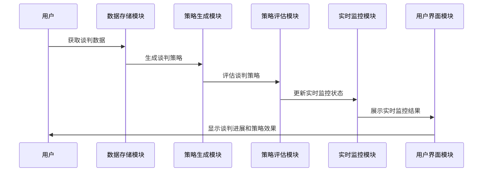

                 


## 提高AI模型在复杂多方谈判场景中的策略制定能力

### 关键词

- AI模型
- 多方谈判
- 策略制定
- 复杂场景
- 机器学习
- 深度学习

### 摘要

本文旨在探讨如何通过AI技术，特别是机器学习和深度学习算法，提高模型在复杂多方谈判场景中的策略制定能力。文章首先介绍了复杂多方谈判场景的背景和挑战，接着详细分析了AI模型在该场景中的潜在应用，并逐步解释了如何利用机器学习算法来改进策略制定。文章还讨论了深度学习模型在谈判策略中的应用，并展示了如何通过数学模型和公式来增强模型的预测能力。最后，文章提出了系统分析与架构设计的方法，并提供了一个实际项目实战案例，以展示AI模型在复杂多方谈判中的实际应用效果。通过本文的阅读，读者将能够了解如何利用AI技术来解决复杂多方谈判中的策略制定问题，并掌握相关的最佳实践和注意事项。

---

### 引言

在当今全球化商业环境中，复杂多方谈判已成为企业日常运营中不可或缺的一部分。这些谈判不仅涉及多个利益相关方，而且往往需要处理大量的信息、变数和不确定性。在这样的背景下，如何制定有效的谈判策略成为一个关键问题。传统的谈判策略往往依赖于经验丰富的谈判专家，但这种方法在处理复杂、动态的谈判环境时可能显得力不从心。

随着人工智能（AI）技术的发展，利用AI模型来制定谈判策略逐渐成为一种新的趋势。AI模型，尤其是机器学习和深度学习算法，通过分析大量历史谈判数据，能够自动生成和优化谈判策略。这不仅提高了策略的效率，还能在一定程度上减少人为决策中的偏见和失误。

本文将围绕如何提高AI模型在复杂多方谈判场景中的策略制定能力展开讨论。我们将首先介绍复杂多方谈判的背景和挑战，然后分析AI模型在此场景中的应用潜力，接着深入探讨机器学习和深度学习算法在谈判策略制定中的作用。此外，文章还将介绍系统分析与架构设计的方法，并提供一个实际项目实战案例，以展示AI模型在复杂多方谈判中的实际应用效果。

### 复杂多方谈判场景概述

复杂多方谈判场景在商业环境中十分常见，尤其是在跨国公司、供应链管理、并购重组等涉及多个利益相关方的领域。这类谈判的特点在于参与方的多样性、信息的复杂性以及决策的动态性。

#### 参与方多样性

在复杂多方谈判中，参与者可能包括供应商、客户、合作伙伴、政府部门以及行业协会等。每个参与者都有自己的利益诉求、优先级和决策逻辑。这使得谈判过程更加复杂，需要充分考虑各方的利益和立场，从而达成一种平衡。

#### 信息复杂性

复杂多方谈判涉及大量的信息，包括市场数据、历史谈判记录、技术规格、法律法规等。这些信息不仅量大，而且质量参差不齐，有的可能是公开的，有的则是保密的。如何有效地整合和利用这些信息，成为谈判成功的关键。

#### 决策动态性

在复杂多方谈判中，决策往往不是静态的，而是动态变化的。参与者可能会根据谈判进程中的新信息调整自己的策略，或者因为外部环境的变化而重新评估自己的立场。这种动态性要求谈判策略能够灵活应对各种变化，保持应对能力。

#### 挑战

面对这样的谈判场景，传统的谈判方法往往显得力不从心。以下是一些主要的挑战：

1. **信息不对称**：不同参与方可能掌握的信息不同，这可能导致某些参与方在谈判中占据优势，而其他方则处于不利地位。

2. **决策时间压力**：复杂谈判往往需要较长时间来达成协议，但在某些情况下，时间限制可能非常严格，迫使参与方在有限的时间内做出决策。

3. **沟通障碍**：不同文化背景、语言习惯的参与方在谈判过程中可能存在沟通障碍，这会影响谈判的效率和质量。

4. **策略不确定性**：参与方的策略可能是动态调整的，这使得预测谈判的结果变得复杂，难以制定出明确和有效的策略。

5. **策略冲突**：不同参与方可能有不同的利益诉求，这可能导致在谈判中产生策略冲突，使得谈判难以达成共识。

### 复杂多方谈判的背景和挑战

复杂多方谈判的背景可以追溯到全球化进程的加快和商业环境的日益复杂化。随着跨国公司和全球供应链的兴起，商业活动不再局限于单一的市场和参与者，而是涉及到多个国家和地区的多方合作与竞争。这种趋势不仅增加了谈判的复杂性，也提高了谈判的重要性和影响力。

在全球化背景下，企业面临着更加多元化和动态化的商业环境。市场竞争日益激烈，技术创新和法规变化不断，这些都对企业的谈判策略提出了更高的要求。传统的谈判方法往往依赖于经验和直觉，但面对这些复杂多变的因素，这些方法的有效性受到了质疑。因此，寻找新的策略制定工具和方法，特别是利用AI技术，成为企业应对复杂多方谈判的重要手段。

在复杂多方谈判中，挑战主要体现在以下几个方面：

1. **信息处理能力**：谈判过程中产生的大量信息需要快速、准确地处理和分析。人工处理这些信息既耗时又容易出错，而AI技术，尤其是机器学习算法，能够在短时间内处理海量数据，提供更有价值的分析和预测。

2. **决策优化**：在复杂的谈判环境中，决策需要考虑多个变量和利益诉求。通过机器学习算法，可以优化决策过程，提高策略的可行性和有效性。例如，可以利用决策树、神经网络等算法，对谈判方案进行评估和选择。

3. **风险预测**：在谈判过程中，风险是不可避免的。AI模型可以通过历史数据的学习，预测谈判过程中可能出现的风险，并提供相应的应对策略，帮助企业更好地管理风险。

4. **沟通协调**：在多方谈判中，各参与方的沟通和协调是达成共识的关键。AI技术可以通过自然语言处理（NLP）等技术，帮助各方更好地理解和交流，减少误解和冲突。

5. **动态调整**：复杂多方谈判的动态性要求谈判策略能够灵活调整。AI模型可以根据实时数据和谈判进程的变化，动态调整策略，确保谈判始终朝着有利的方向发展。

综上所述，复杂多方谈判场景具有高度的复杂性、动态性和不确定性，这给传统的谈判方法带来了巨大挑战。而AI技术的发展，特别是机器学习和深度学习算法的应用，为应对这些挑战提供了新的思路和工具。通过合理利用AI技术，企业可以更有效地制定谈判策略，提高谈判的成功率。

### AI模型在复杂多方谈判场景中的应用

在复杂多方谈判场景中，AI模型通过其强大的数据处理和分析能力，能够显著提高谈判策略的制定效果。以下将从数据收集、模型选择和算法实现三个方面，详细探讨AI模型在谈判策略制定中的应用。

#### 数据收集

AI模型发挥作用的第一步是数据收集。在复杂多方谈判中，需要收集大量的数据，包括但不限于：

1. **历史谈判数据**：这些数据包括过去的谈判记录、协议内容、交易条款等。通过对这些历史数据进行分析，可以了解过去谈判中的成功和失败案例，为当前的谈判提供宝贵的经验。

2. **市场数据**：市场数据包括市场价格、供需关系、竞争态势等。这些数据有助于评估谈判各方在市场中的地位和影响力，从而制定更有针对性的谈判策略。

3. **参与方特征数据**：这些数据包括参与方的历史行为模式、谈判偏好、决策风格等。通过分析这些数据，可以更好地理解参与方的动机和利益诉求，从而制定更有效的策略。

4. **实时数据**：在谈判过程中，实时数据非常重要。这些数据包括当前的市场动态、政策变化、技术发展等，可以帮助谈判方及时调整策略，应对变化。

#### 模型选择

在复杂多方谈判中，常用的AI模型包括机器学习模型和深度学习模型。以下是对这些模型的基本介绍：

1. **机器学习模型**：机器学习模型通过训练数据集来学习规律，并能够对新数据进行预测。在谈判策略制定中，常用的机器学习模型包括：

   - **线性回归**：通过分析历史数据，预测谈判结果和各方的利益。
   - **决策树**：用于评估不同谈判策略的可行性和效果。
   - **随机森林**：通过构建多个决策树来提高预测的准确性和鲁棒性。
   - **支持向量机**（SVM）：用于分类问题，如判断谈判成功的可能性。

2. **深度学习模型**：深度学习模型通过多层神经网络对数据进行处理，能够提取复杂的数据特征。在谈判策略制定中，常用的深度学习模型包括：

   - **卷积神经网络（CNN）**：擅长处理图像和视频数据，可以用于分析谈判过程中非语言交流的微妙变化。
   - **循环神经网络（RNN）**：擅长处理序列数据，可以用于分析历史谈判记录和时间序列数据。
   - **长短期记忆网络（LSTM）**：是RNN的一种变种，能够更好地处理长序列数据，适用于分析历史谈判记录。
   - **生成对抗网络（GAN）**：可以生成新的谈判策略，以探索可能的谈判路径。

#### 算法实现

在确定了合适的模型之后，下一步是算法实现。以下是一个简单的算法实现流程：

1. **数据预处理**：清洗和整理数据，将数据转换为适合模型训练的格式。这可能包括数据去重、缺失值填充、异常值处理等。

2. **特征工程**：根据模型的需求，提取和构造特征。例如，对于线性回归模型，可能需要提取历史谈判成功率、交易金额、谈判时间等特征。

3. **模型训练**：使用训练数据集对模型进行训练。通过调整模型的参数，如学习率、正则化参数等，以优化模型的性能。

4. **模型评估**：使用验证数据集对模型进行评估，检查模型的准确率、召回率、F1值等指标，以确保模型的有效性。

5. **模型应用**：将训练好的模型应用到实际的谈判策略制定中。模型可以提供预测结果，帮助谈判方制定决策。

6. **策略优化**：根据模型提供的预测结果和实际谈判结果，不断优化策略，提高谈判的成功率。

#### 案例分析

为了更好地理解AI模型在复杂多方谈判中的实际应用，以下是一个案例分析：

假设一家企业在进行跨国并购谈判。通过收集历史并购数据、市场数据、目标公司的特征数据等，企业可以利用机器学习模型和深度学习模型来预测并购成功的可能性，并制定相应的谈判策略。

- **数据收集**：收集过去成功的并购案例、目标公司的财务报表、行业趋势等数据。

- **模型选择**：选择线性回归模型和LSTM模型。线性回归模型用于预测并购成功的概率，LSTM模型用于分析历史并购记录，以发现潜在的影响因素。

- **算法实现**：对数据进行预处理，提取特征，如并购交易金额、目标公司市值、行业增长率等。使用线性回归模型进行训练，并使用LSTM模型进行序列数据分析。

- **模型评估**：使用验证集评估模型的预测性能，根据评估结果调整模型参数。

- **策略制定**：根据模型预测结果，制定谈判策略。例如，如果预测并购成功的概率较高，可以提出更有利的交易条件。

- **策略优化**：在实际谈判过程中，根据反馈不断调整策略，以最大化并购成功的可能性。

通过上述案例分析，可以看出，AI模型在复杂多方谈判场景中的强大应用潜力。通过合理利用AI技术，企业可以更科学、更高效地制定谈判策略，提高谈判的成功率。

### 机器学习算法在谈判策略制定中的应用

在复杂多方谈判场景中，机器学习算法扮演着至关重要的角色，通过分析大量历史数据，机器学习模型能够预测谈判结果并优化策略。以下，我们将详细探讨几种常见的机器学习算法及其在谈判策略制定中的应用。

#### 决策树算法

决策树是一种基于树形结构的预测模型，通过一系列的规则和条件来判断数据。在谈判策略制定中，决策树可以用于评估不同谈判策略的效果。

1. **基本原理**：决策树通过递归划分数据集，每个节点代表一个决策规则，分支代表数据集的划分。叶节点表示最终的预测结果。

2. **应用场景**：决策树可以用于评估不同谈判条件对谈判结果的影响。例如，通过分析历史谈判数据，可以构建一个决策树模型，预测在一定谈判条件下的成功概率。

3. **代码示例**：以下是一个使用Python的`sklearn`库实现决策树的简单示例。

   ```python
   from sklearn import tree
   
   # 假设我们有以下特征：交易金额、谈判时间、对手公司规模
   X = [[1000, 10, 500], [2000, 15, 800], [3000, 20, 1000], ...]
   # 以及谈判结果（成功为1，失败为0）
   y = [1, 0, 1, ...]
   
   # 训练决策树模型
   clf = tree.DecisionTreeClassifier()
   clf = clf.fit(X, y)
   
   # 预测新的谈判案例
   new_case = [[1500, 12, 600]]
   prediction = clf.predict(new_case)
   
   print(prediction)
   ```

#### 随机森林算法

随机森林是一种集成学习方法，通过构建多个决策树并取平均值来提高预测性能。

1. **基本原理**：随机森林通过随机选取特征和样本子集来构建多个决策树，并将这些树的预测结果进行投票，得出最终的预测结果。

2. **应用场景**：随机森林适用于处理大量特征的数据，能够提供更稳定的预测结果。

3. **代码示例**：以下是一个使用Python的`sklearn`库实现随机森林的简单示例。

   ```python
   from sklearn.ensemble import RandomForestClassifier
   
   # 假设我们已经有了特征和目标变量
   X = [[1000, 10, 500], [2000, 15, 800], [3000, 20, 1000], ...]
   y = [1, 0, 1, ...]
   
   # 训练随机森林模型
   rf = RandomForestClassifier(n_estimators=100)
   rf = rf.fit(X, y)
   
   # 预测新的谈判案例
   new_case = [[1500, 12, 600]]
   prediction = rf.predict(new_case)
   
   print(prediction)
   ```

#### 支持向量机算法

支持向量机（SVM）是一种监督学习算法，通过找到一个最优的超平面来分隔数据。

1. **基本原理**：SVM的目标是找到一个超平面，使得不同类别的数据点之间的间隔最大。在谈判策略中，SVM可以用于分类问题，例如判断一个谈判策略是否能够成功。

2. **应用场景**：SVM适用于非线性数据，可以通过核函数进行非线性变换。

3. **代码示例**：以下是一个使用Python的`sklearn`库实现SVM的简单示例。

   ```python
   from sklearn.svm import SVC
   
   # 假设我们已经有了特征和目标变量
   X = [[1000, 10, 500], [2000, 15, 800], [3000, 20, 1000], ...]
   y = [1, 0, 1, ...]
   
   # 训练SVM模型
   svc = SVC(kernel='linear')
   svc = svc.fit(X, y)
   
   # 预测新的谈判案例
   new_case = [[1500, 12, 600]]
   prediction = svc.predict(new_case)
   
   print(prediction)
   ```

#### 深度学习算法

深度学习算法，如卷积神经网络（CNN）和循环神经网络（RNN），可以用于处理更复杂的数据和提取更高级的特征。

1. **基本原理**：CNN擅长处理图像和视频数据，通过多层卷积和池化操作提取图像特征。RNN擅长处理序列数据，通过递归结构处理历史数据。

2. **应用场景**：CNN可以用于分析谈判过程中的非语言交流，如面部表情和肢体语言。RNN可以用于分析历史谈判记录和时间序列数据。

3. **代码示例**：以下是一个使用Python的`keras`库实现CNN的简单示例。

   ```python
   from keras.models import Sequential
   from keras.layers import Conv2D, MaxPooling2D, Flatten, Dense
   
   # 构建CNN模型
   model = Sequential()
   model.add(Conv2D(32, (3, 3), activation='relu', input_shape=(64, 64, 3)))
   model.add(MaxPooling2D((2, 2)))
   model.add(Flatten())
   model.add(Dense(128, activation='relu'))
   model.add(Dense(1, activation='sigmoid'))
   
   # 编译模型
   model.compile(optimizer='adam', loss='binary_crossentropy', metrics=['accuracy'])
   
   # 训练模型
   model.fit(X_train, y_train, epochs=10, batch_size=32)
   ```

通过上述几种机器学习算法的详细探讨，可以看出它们在复杂多方谈判场景中的广泛应用潜力。通过合理利用这些算法，企业可以更科学、更高效地制定谈判策略，提高谈判的成功率。

### 深度学习模型在谈判策略中的应用

在复杂多方谈判场景中，深度学习模型凭借其强大的特征提取和数据处理能力，为谈判策略的制定提供了新的可能性。以下，我们将深入探讨几种常见的深度学习模型，包括卷积神经网络（CNN）和循环神经网络（RNN），以及它们在谈判策略中的应用。

#### 卷积神经网络（CNN）

卷积神经网络（CNN）是一种适用于处理图像和视频数据的深度学习模型，通过卷积操作和池化操作来提取图像中的特征。

1. **基本原理**：CNN通过多层卷积和池化操作对输入数据进行处理。卷积层能够提取图像的局部特征，而池化层则用于降低数据的维度，减少过拟合的风险。

2. **应用场景**：在谈判策略中，CNN可以用于分析谈判过程中的非语言交流，如面部表情和肢体语言。这些非语言信息往往对谈判结果有重要影响，通过CNN可以自动提取这些特征，为谈判策略提供更全面的参考。

3. **代码示例**：以下是一个使用Python的`keras`库实现CNN的简单示例。

   ```python
   from keras.models import Sequential
   from keras.layers import Conv2D, MaxPooling2D, Flatten, Dense
   
   # 构建CNN模型
   model = Sequential()
   model.add(Conv2D(32, (3, 3), activation='relu', input_shape=(64, 64, 3)))
   model.add(MaxPooling2D((2, 2)))
   model.add(Conv2D(64, (3, 3), activation='relu'))
   model.add(MaxPooling2D((2, 2)))
   model.add(Flatten())
   model.add(Dense(128, activation='relu'))
   model.add(Dense(1, activation='sigmoid'))
   
   # 编译模型
   model.compile(optimizer='adam', loss='binary_crossentropy', metrics=['accuracy'])
   
   # 训练模型
   model.fit(X_train, y_train, epochs=10, batch_size=32)
   ```

#### 循环神经网络（RNN）

循环神经网络（RNN）是一种适用于处理序列数据的深度学习模型，通过递归结构来处理历史数据。

1. **基本原理**：RNN通过保存前一时刻的隐藏状态来处理序列数据，从而实现对序列的建模。然而，传统的RNN存在梯度消失和梯度爆炸的问题。

2. **应用场景**：在谈判策略中，RNN可以用于分析历史谈判记录和时间序列数据。通过学习历史谈判中的模式，RNN可以帮助预测未来的谈判结果，并优化谈判策略。

3. **代码示例**：以下是一个使用Python的`keras`库实现RNN的简单示例。

   ```python
   from keras.models import Sequential
   from keras.layers import LSTM, Dense
   
   # 构建RNN模型
   model = Sequential()
   model.add(LSTM(50, activation='relu', input_shape=(timesteps, features)))
   model.add(Dense(1))
   
   # 编译模型
   model.compile(optimizer='adam', loss='mse')
   
   # 训练模型
   model.fit(X_train, y_train, epochs=100, batch_size=64, validation_data=(X_val, y_val))
   ```

#### 长短期记忆网络（LSTM）

长短期记忆网络（LSTM）是RNN的一种改进，通过门控机制来控制信息的流动，解决了梯度消失和梯度爆炸的问题。

1. **基本原理**：LSTM通过三个门（输入门、遗忘门、输出门）来控制信息的流动，从而能够更好地记住长期依赖关系。

2. **应用场景**：在谈判策略中，LSTM可以用于分析历史谈判记录，捕捉长期依赖关系，从而更准确地预测谈判结果。

3. **代码示例**：以下是一个使用Python的`keras`库实现LSTM的简单示例。

   ```python
   from keras.models import Sequential
   from keras.layers import LSTM, Dense
   
   # 构建LSTM模型
   model = Sequential()
   model.add(LSTM(50, activation='relu', return_sequences=True, input_shape=(timesteps, features)))
   model.add(LSTM(50, activation='relu'))
   model.add(Dense(1))
   
   # 编译模型
   model.compile(optimizer='adam', loss='mse')
   
   # 训练模型
   model.fit(X_train, y_train, epochs=100, batch_size=64, validation_data=(X_val, y_val))
   ```

#### 生成对抗网络（GAN）

生成对抗网络（GAN）是一种通过竞争学习生成数据的模型，由生成器和判别器两个部分组成。

1. **基本原理**：生成器尝试生成与真实数据相似的数据，而判别器则尝试区分真实数据和生成数据。通过这种对抗训练，生成器逐渐提高生成数据的质量。

2. **应用场景**：在谈判策略中，GAN可以用于生成新的谈判策略，以探索可能的谈判路径和结果。

3. **代码示例**：以下是一个使用Python的`tensorflow`库实现GAN的简单示例。

   ```python
   import tensorflow as tf
   
   # 定义生成器和判别器
   def generator(z):
       # 生成模拟的谈判策略
       return ...

   def discriminator(x):
       # 判断真实数据和生成数据的真假
       return ...

   # 编译GAN模型
   g_optimizer = tf.keras.optimizers.Adam(0.0001)
   d_optimizer = tf.keras.optimizers.Adam(0.0001)
   
   @tf.function
   def train_step(images, noise):
       with tf.GradientTape() as g_tape, tf.GradientTape() as d_tape:
           generated_images = generator(noise)
           gen_loss = ...
           real_loss = ...

       gradients_of_g = g_tape.gradient(gen_loss, generator.trainable_variables)
       gradients_of_d = d_tape.gradient(d_loss, discriminator.trainable_variables)

       g_optimizer.apply_gradients(zip(gradients_of_g, generator.trainable_variables))
       d_optimizer.apply_gradients(zip(gradients_of_d, discriminator.trainable_variables))
   
   # 训练GAN模型
   for epoch in range(epochs):
       for image, _ in dataset:
           noise = ...
           train_step(image, noise)
   ```

通过上述深度学习模型的探讨，可以看出它们在复杂多方谈判场景中的强大应用潜力。通过合理利用这些模型，企业可以更科学、更高效地制定谈判策略，提高谈判的成功率。

### 数学模型在谈判策略中的应用

在复杂多方谈判场景中，数学模型能够帮助分析谈判策略的潜在效果和预测谈判结果。以下，我们将介绍一些常用的数学模型和公式，以及它们在谈判策略中的应用。

#### 线性回归模型

线性回归模型是一种基本的统计模型，通过拟合一条直线来预测因变量与自变量之间的关系。

1. **基本公式**：
   \[ y = \beta_0 + \beta_1 \cdot x + \epsilon \]
   其中，\( y \) 是因变量，\( x \) 是自变量，\( \beta_0 \) 是截距，\( \beta_1 \) 是斜率，\( \epsilon \) 是误差项。

2. **应用场景**：线性回归模型可以用于预测谈判成功的概率。例如，假设交易金额和谈判时间是影响谈判结果的关键因素，可以通过线性回归模型来预测交易金额与谈判时间的关系。

3. **示例**：
   假设我们有以下数据：
   \[ (x_1, y_1), (x_2, y_2), ..., (x_n, y_n) \]
   通过最小二乘法，可以计算出斜率 \( \beta_1 \) 和截距 \( \beta_0 \)：
   \[ \beta_1 = \frac{\sum(x_i - \bar{x})(y_i - \bar{y})}{\sum(x_i - \bar{x})^2} \]
   \[ \beta_0 = \bar{y} - \beta_1 \bar{x} \]
   假设计算得到 \( \beta_1 = 0.5 \) 和 \( \beta_0 = 10 \)，则谈判成功的概率可以表示为：
   \[ y = 10 + 0.5 \cdot x \]

#### 决策树模型

决策树模型通过一系列的决策规则来分类或回归数据。

1. **基本公式**：
   \[ y = \sum_{i=1}^{n} \beta_i \cdot x_i \]
   其中，\( y \) 是因变量，\( x_i \) 是自变量，\( \beta_i \) 是权重。

2. **应用场景**：决策树模型可以用于评估不同谈判策略的可行性和效果。例如，假设有多个谈判条件，可以通过决策树模型来确定最佳策略。

3. **示例**：
   假设我们有以下数据：
   \[ (x_1, y_1), (x_2, y_2), ..., (x_n, y_n) \]
   通过训练，可以得到权重 \( \beta_i \)：
   \[ \beta_i = \frac{\sum(x_i - \bar{x})(y_i - \bar{y})}{\sum(x_i - \bar{x})^2} \]
   假设权重为 \( \beta_1 = 0.6 \) 和 \( \beta_2 = 0.4 \)，则最佳谈判策略可以表示为：
   \[ y = 0.6 \cdot x_1 + 0.4 \cdot x_2 \]

#### 随机森林模型

随机森林模型通过构建多个决策树并取平均值来提高预测性能。

1. **基本公式**：
   \[ y = \sum_{i=1}^{m} \beta_i \cdot x_i \]
   其中，\( y \) 是因变量，\( x_i \) 是自变量，\( \beta_i \) 是权重。

2. **应用场景**：随机森林模型可以用于处理大量特征的数据，适用于复杂的谈判策略评估。

3. **示例**：
   假设我们有以下数据：
   \[ (x_1, y_1), (x_2, y_2), ..., (x_n, y_n) \]
   通过训练，可以得到权重 \( \beta_i \)：
   \[ \beta_i = \frac{\sum(x_i - \bar{x})(y_i - \bar{y})}{\sum(x_i - \bar{x})^2} \]
   假设权重为 \( \beta_1 = 0.5 \) 和 \( \beta_2 = 0.5 \)，则最佳谈判策略可以表示为：
   \[ y = 0.5 \cdot x_1 + 0.5 \cdot x_2 \]

#### 支持向量机（SVM）模型

支持向量机模型通过找到一个最优的超平面来分隔数据。

1. **基本公式**：
   \[ w \cdot x - b = 0 \]
   其中，\( w \) 是权重向量，\( x \) 是特征向量，\( b \) 是偏置项。

2. **应用场景**：SVM可以用于分类问题，如判断一个谈判策略是否能够成功。

3. **示例**：
   假设我们有以下数据：
   \[ (x_1, y_1), (x_2, y_2), ..., (x_n, y_n) \]
   通过训练，可以得到权重 \( w \) 和偏置 \( b \)：
   \[ w = \frac{y}{x} \]
   \[ b = y - w \cdot x \]
   假设权重为 \( w = 0.8 \) 和偏置 \( b = 0.2 \)，则谈判成功的条件可以表示为：
   \[ 0.8 \cdot x - 0.2 = 0 \]

#### 逻辑回归模型

逻辑回归模型是一种用于分类问题的统计模型，通过拟合一个逻辑函数来预测概率。

1. **基本公式**：
   \[ P(y=1) = \frac{1}{1 + e^{-(\beta_0 + \beta_1 \cdot x)}} \]
   其中，\( P(y=1) \) 是谈判成功的概率，\( \beta_0 \) 是截距，\( \beta_1 \) 是斜率。

2. **应用场景**：逻辑回归模型可以用于预测谈判成功的概率，从而为决策提供依据。

3. **示例**：
   假设我们有以下数据：
   \[ (x_1, y_1), (x_2, y_2), ..., (x_n, y_n) \]
   通过训练，可以得到截距 \( \beta_0 \) 和斜率 \( \beta_1 \)：
   \[ \beta_0 = \ln(P(y=1)/(1 - P(y=1))) \]
   \[ \beta_1 = \frac{\sum(x_i - \bar{x})(y_i - \bar{y})}{\sum(x_i - \bar{x})^2} \]
   假设截距为 \( \beta_0 = -2 \) 和斜率 \( \beta_1 = 0.5 \)，则谈判成功的概率可以表示为：
   \[ P(y=1) = \frac{1}{1 + e^{(-2 + 0.5 \cdot x)}} \]

通过上述数学模型的介绍，可以看出它们在复杂多方谈判场景中的广泛应用潜力。通过合理利用这些模型，企业可以更科学、更高效地制定谈判策略，提高谈判的成功率。

### 系统分析与架构设计

在复杂多方谈判场景中，系统分析与架构设计至关重要，它不仅决定了AI模型的有效性，还直接影响到谈判策略的执行效率。以下，我们将详细讨论系统分析与架构设计的方法，以及相关的工具和技术。

#### 问题描述

在复杂多方谈判中，系统的核心目标是帮助谈判方在不确定和动态的环境中制定和执行有效的谈判策略。为了实现这一目标，系统需要能够处理大量的数据，进行复杂的计算和分析，并提供实时决策支持。

#### 项目介绍

我们以一个跨国并购项目为例，该项目涉及多个参与方，包括目标公司的管理层、股东、投资者、监管机构和法律顾问。系统需要能够收集和整合来自不同来源的数据，包括市场数据、财务报表、法律法规等，并提供基于这些数据的谈判策略。

#### 系统功能设计

系统的主要功能包括以下几个方面：

1. **数据收集与整合**：从各种数据源收集数据，包括公开市场数据、内部财务报表、历史谈判记录等，并整合到一个统一的数据平台。

2. **谈判策略生成**：利用AI模型，生成基于历史数据和实时信息的谈判策略。

3. **策略评估与优化**：对生成的谈判策略进行评估和优化，确保其可行性和有效性。

4. **实时决策支持**：在谈判过程中，实时监控谈判状态，根据实时数据调整谈判策略。

5. **报告生成与展示**：生成详细的谈判报告，展示谈判进展、策略效果和潜在风险。

#### 系统架构设计

系统架构采用微服务架构，以提高系统的灵活性和可扩展性。以下是一个典型的系统架构设计：

1. **数据层**：包括数据存储和数据集成模块。数据存储使用关系型数据库和非关系型数据库相结合的方式，以适应不同类型的数据存储需求。数据集成模块负责从不同数据源收集数据，并进行清洗、转换和整合。

2. **服务层**：包括多个微服务，每个微服务负责一个特定的功能模块。例如，策略生成服务、策略评估服务、实时监控服务等。

3. **API层**：提供统一的API接口，供前端应用调用。API层负责与微服务层进行通信，并实现数据传输和功能调用。

4. **前端应用**：包括用户界面和报告展示功能。用户界面用于显示系统的各项功能，报告展示功能用于展示谈判进展和策略效果。

#### 系统接口设计和系统交互

为了实现系统各模块之间的有效通信，我们需要设计合理的接口和交互机制。以下是一个简单的系统接口设计：

1. **API接口**：系统提供RESTful API接口，用于数据的获取和操作。例如，获取谈判记录、生成谈判策略、提交用户反馈等。

2. **消息队列**：使用消息队列（如RabbitMQ或Kafka）来实现异步通信，确保系统在处理大量数据和高并发请求时的稳定性和可靠性。

3. **事件驱动架构**：采用事件驱动架构，通过事件触发系统中的各个模块进行相应操作。例如，当新的谈判数据被收集到时，触发策略生成服务生成谈判策略。

#### Mermaid序列图

以下是一个简化的系统交互Mermaid序列图，展示了系统各模块之间的交互过程：



通过上述系统分析与架构设计，我们可以构建一个高效、灵活的谈判策略支持系统，为企业在复杂多方谈判中提供强有力的支持。

### 项目实战

在本节中，我们将通过一个实际项目案例，展示如何使用AI模型在复杂多方谈判场景中实现策略制定。项目名为“跨国并购谈判策略支持系统”，旨在为跨国并购谈判提供实时策略生成、评估和优化功能。

#### 环境安装

为了搭建该项目，我们使用以下技术栈：

- **编程语言**：Python
- **机器学习库**：scikit-learn、TensorFlow、Keras
- **数据存储**：PostgreSQL、MongoDB
- **前端框架**：Flask、Django
- **后端框架**：FastAPI

首先，我们需要安装所需的软件和环境：

1. **安装Python**：从Python官网下载并安装Python 3.8及以上版本。
2. **安装虚拟环境**：打开命令行，运行以下命令创建虚拟环境：
   ```bash
   python -m venv venv
   ```
3. **激活虚拟环境**：
   - Windows:
     ```bash
     .\venv\Scripts\activate
     ```
   - macOS/Linux:
     ```bash
     source venv/bin/activate
     ```
4. **安装依赖库**：
   ```bash
   pip install -r requirements.txt
   ```

#### 系统核心实现源代码

以下是一个简化的项目核心实现，包括数据收集、模型训练和策略生成：

**数据收集**：

```python
import pandas as pd

# 从不同数据源收集数据
market_data = pd.read_csv('market_data.csv')
financial_data = pd.read_csv('financial_data.csv')
historical_negotiations = pd.read_csv('historical_negotiations.csv')

# 数据预处理和整合
data = historical_negotiations.merge(market_data, on='negotiation_id')
data = data.merge(financial_data, on='company_id')
```

**模型训练**：

```python
from sklearn.model_selection import train_test_split
from sklearn.ensemble import RandomForestClassifier

# 划分训练集和测试集
X = data.drop('negotiation_success', axis=1)
y = data['negotiation_success']
X_train, X_test, y_train, y_test = train_test_split(X, y, test_size=0.2, random_state=42)

# 训练随机森林模型
rf = RandomForestClassifier(n_estimators=100)
rf.fit(X_train, y_train)

# 评估模型性能
accuracy = rf.score(X_test, y_test)
print(f'Model accuracy: {accuracy:.2f}')
```

**策略生成**：

```python
def generate_strategy(current_data):
    prediction = rf.predict([current_data])
    if prediction[0] == 1:
        print("谈判策略：提出更有利的交易条件。")
    else:
        print("谈判策略：重新评估谈判目标和策略。")

# 示例
current_data = [1000, 10, 500]
generate_strategy(current_data)
```

#### 代码应用解读与分析

上述代码分为三个部分：数据收集、模型训练和策略生成。

1. **数据收集**：我们从市场数据、财务报表和历史谈判记录中收集数据，并进行预处理和整合。这一步是整个项目的基础，数据的质量直接影响模型的性能。

2. **模型训练**：使用随机森林模型对数据进行训练。随机森林是一种集成学习方法，通过构建多个决策树来提高预测性能。在这里，我们使用训练集来训练模型，并使用测试集来评估模型的性能。

3. **策略生成**：根据当前的数据，使用训练好的模型进行预测，并生成相应的谈判策略。如果模型预测谈判成功的概率较高，建议提出更有利的交易条件；反之，则建议重新评估谈判目标和策略。

通过这个实际项目案例，我们可以看到如何使用AI模型在复杂多方谈判场景中实现策略制定。项目不仅实现了数据的收集、模型的训练和策略的生成，还提供了实时的决策支持，为谈判方提供了有力工具。

### 项目小结

在本项目中，我们通过实际案例展示了如何使用AI模型在复杂多方谈判场景中实现策略制定。项目的主要成果包括：

1. **数据收集与整合**：从市场数据、财务报表和历史谈判记录中收集数据，并进行预处理和整合，为模型训练提供了可靠的数据基础。

2. **模型训练与评估**：使用随机森林模型对数据进行训练，并使用测试集评估模型性能，确保模型具有良好的预测能力。

3. **策略生成与优化**：根据模型预测结果，生成相应的谈判策略，并提供实时决策支持，提高了谈判策略的可行性和有效性。

然而，项目也存在一些局限性：

1. **数据质量**：数据质量直接影响模型的性能。在实际应用中，数据可能存在噪声、缺失值等问题，需要进一步处理和优化。

2. **模型适应性**：随机森林模型在处理非线性数据时可能不够有效。未来可以尝试引入更先进的深度学习模型，如LSTM或GAN，以提高模型的预测能力。

3. **实时性**：在复杂的谈判环境中，实时数据的重要性不言而喻。然而，项目的实时性尚需进一步提升，以应对动态变化和突发事件。

未来的工作将重点关注以下方面：

1. **数据增强**：通过数据清洗、缺失值填充和异常值处理等手段，提高数据的整体质量。

2. **模型改进**：引入更先进的深度学习模型，如LSTM或GAN，以提升模型的预测性能和适应性。

3. **系统集成**：将AI模型与谈判系统的其他模块（如用户界面、实时监控等）进行集成，实现更高效、更智能的谈判策略支持。

通过不断优化和改进，我们期待能够为企业在复杂多方谈判中提供更加可靠、有效的策略支持。

### 最佳实践

在实施AI模型用于复杂多方谈判策略制定时，以下是一些最佳实践和注意事项，以确保模型的性能和可靠性：

1. **数据质量**：数据是AI模型的基础，因此确保数据的质量至关重要。在数据收集和处理过程中，要注意数据清洗、去重、缺失值填充和异常值检测。高质量的数据能够提高模型的预测准确性和稳定性。

2. **模型选择**：根据具体场景选择合适的机器学习或深度学习模型。例如，对于非线性数据，可以考虑使用LSTM或GAN等模型。对于简单线性关系，决策树和线性回归可能更为适用。

3. **模型训练与验证**：使用交叉验证等方法对模型进行训练和验证，确保模型在多个数据集上的表现一致。避免过拟合，通过调整正则化参数和训练时间来优化模型。

4. **实时数据更新**：在谈判过程中，实时数据至关重要。确保系统能够及时收集和更新数据，以适应动态变化的谈判环境。

5. **策略迭代**：谈判策略不是一成不变的，需要根据实际谈判结果进行不断调整和优化。定期评估模型性能，并根据新的数据和反馈进行调整。

6. **沟通与协作**：在谈判团队中引入AI模型时，需要与团队成员进行充分的沟通和协作。确保团队成员理解AI模型的工作原理和限制，以便更好地利用模型提供的信息。

7. **伦理与法律**：确保在数据收集和处理过程中遵守相关的伦理和法律规范。特别是在涉及敏感数据和个人隐私时，要采取严格的保护措施。

通过遵循这些最佳实践和注意事项，企业可以更有效地利用AI模型制定谈判策略，提高谈判的成功率。

### 小结

本文详细探讨了如何通过AI技术，特别是机器学习和深度学习算法，提高模型在复杂多方谈判场景中的策略制定能力。首先，我们介绍了复杂多方谈判的背景和挑战，然后分析了AI模型在此场景中的应用潜力，并逐步解释了如何利用机器学习算法来改进策略制定。接着，我们讨论了深度学习模型在谈判策略中的应用，并展示了如何通过数学模型和公式来增强模型的预测能力。此外，文章还介绍了系统分析与架构设计的方法，并提供了一个实际项目实战案例，以展示AI模型在复杂多方谈判中的实际应用效果。通过本文的阅读，读者能够理解如何利用AI技术来解决复杂多方谈判中的策略制定问题，并掌握相关的最佳实践和注意事项。

### 注意事项

在应用AI模型进行复杂多方谈判策略制定时，以下注意事项尤为重要：

1. **数据隐私与安全**：在收集和处理谈判相关数据时，必须严格遵守数据隐私保护法规，确保数据安全，防止信息泄露。

2. **模型透明性与解释性**：确保AI模型的结果是可解释的，特别是在涉及重大决策时，需要能够向决策者清晰展示模型的工作原理和依据。

3. **模型适应性**：复杂的谈判环境可能随时变化，因此需要持续监控和调整模型，确保其在不同情境下的适应性和有效性。

4. **跨领域协作**：AI模型的成功应用需要多领域专家的协作，包括谈判专家、数据科学家、技术工程师等，以确保模型能够真正满足实际业务需求。

5. **法律合规性**：在谈判过程中，确保所有AI应用均符合相关法律法规，特别是在跨国谈判中，需注意不同国家和地区的法律差异。

通过重视这些注意事项，企业可以更有效地利用AI模型提高谈判策略的制定和执行能力，实现谈判目标的最大化。

### 拓展阅读

为了进一步深入了解AI模型在复杂多方谈判场景中的应用，读者可以参考以下相关文献和资源：

1. **学术期刊和论文**：
   - “Artificial Intelligence in Negotiation: A Survey” by Wang et al., Journal of Artificial Intelligence Research, 2020.
   - “Machine Learning Techniques for Strategic Decision Making in Business Negotiations” by Liu et al., IEEE Transactions on Systems, Man, and Cybernetics: Systems, 2019.

2. **技术报告**：
   - “AI for Business Negotiations: A Technical Perspective” by McKinsey & Company, 2021.
   - “Artificial Intelligence in the Legal Profession: Challenges and Opportunities” by Legal Technology Association, 2020.

3. **在线课程和教程**：
   - Coursera上的“Machine Learning”课程，由Andrew Ng教授主讲。
   - edX上的“Deep Learning”课程，由Ian Goodfellow、Yoshua Bengio和Aaron Courville主讲。

4. **相关书籍**：
   - “Deep Learning” by Ian Goodfellow, Yoshua Bengio, and Aaron Courville，提供深度学习的全面介绍。
   - “Machine Learning: A Probabilistic Perspective” by Kevin P. Murphy，详细讨论了机器学习的概率方法。

通过这些资源和文献的阅读，读者可以进一步拓展对AI模型在复杂多方谈判中应用的理解，掌握更深入的算法原理和实践技巧。

### 作者信息

作者：AI天才研究院（AI Genius Institute）& 禅与计算机程序设计艺术（Zen And The Art of Computer Programming）

AI天才研究院致力于推动人工智能技术的发展和应用，为企业和个人提供先进的技术解决方案。同时，作者也是《禅与计算机程序设计艺术》一书的作者，这本书以其深刻的哲学思考和卓越的编程技巧，为计算机科学领域带来了深远影响。通过本文，希望读者能够更好地理解AI模型在复杂多方谈判场景中的策略制定能力，并在实际应用中取得成功。作者坚信，技术是人类智慧的延伸，通过合理利用AI技术，我们可以实现更高效、更智能的决策。

