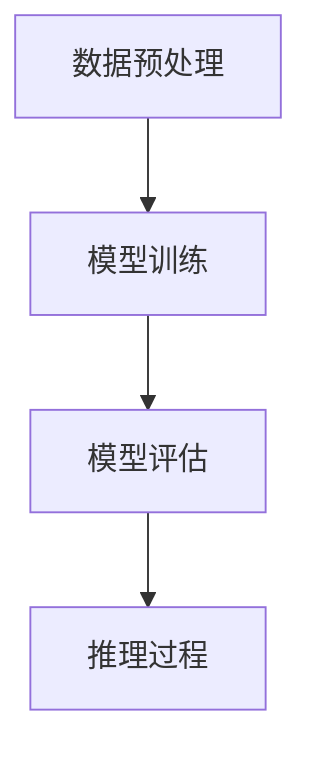
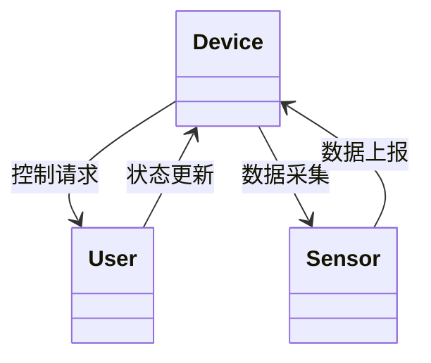
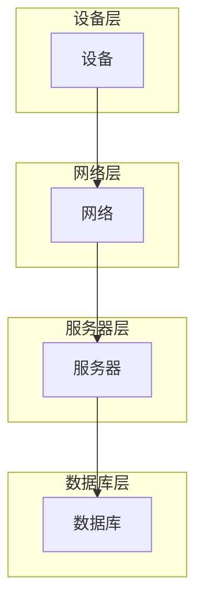
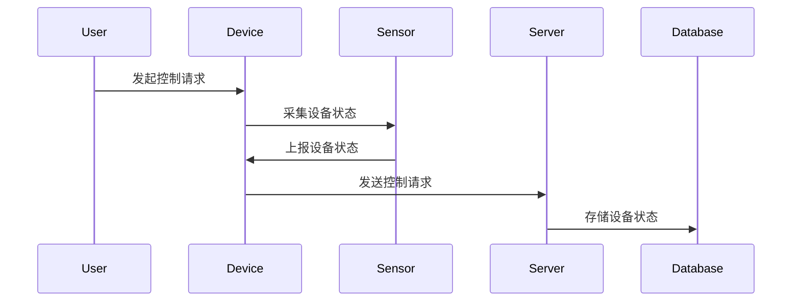

                 


### 提高AI模型在复杂推理链任务中的表现

**关键词：AI模型，复杂推理链任务，算法原理，数学模型，项目实战**

**摘要：本文将深入探讨如何提高AI模型在复杂推理链任务中的表现。我们将从背景介绍、核心概念与联系、算法原理讲解、数学模型与公式、系统分析与架构设计、项目实战及最佳实践等方面逐步分析，以提供一套全面的解决方案。**

---

#### **背景介绍**

**1. 核心概念术语说明**

在探讨如何提高AI模型在复杂推理链任务中的表现之前，我们首先需要了解几个关键术语：

- **AI模型**：一种基于算法和数据驱动的计算机程序，能够模拟人类智能进行推理、决策和学习。
- **复杂推理链任务**：涉及多个步骤的推理过程，每一步都需要对大量信息进行综合处理，以得出结论。

**2. 问题背景**

随着人工智能技术的迅速发展，AI模型在许多领域都取得了显著成果。然而，对于复杂推理链任务，AI模型的表现仍有许多不足之处。例如：

- **推理效率低**：在处理大量数据时，模型的推理速度较慢。
- **准确性不足**：在复杂推理过程中，模型容易受到噪声和异常值的影响，导致推理结果不准确。

**3. 问题描述**

为了解决上述问题，我们需要从以下几个方面入手：

- **提升模型推理效率**：通过优化算法和硬件加速，提高模型在复杂推理链任务中的处理速度。
- **增强模型鲁棒性**：通过设计更强大的算法和数据处理方法，提高模型对噪声和异常值的抵抗能力。
- **优化模型设计**：从模型架构、参数调整等方面进行改进，以提高模型在复杂推理链任务中的表现。

**4. 问题解决**

本文将针对上述问题，提出一系列解决方案。我们将从核心概念与联系、算法原理讲解、数学模型与公式、系统分析与架构设计、项目实战及最佳实践等方面进行深入探讨。

---

#### **核心概念与联系**

**1. AI模型概述**

AI模型是一种通过训练数据学习特定任务的计算机程序。常见的AI模型包括：

- **神经网络**：一种模拟人脑神经元连接的网络结构，能够处理复杂的非线性问题。
- **决策树**：一种基于树形结构的决策规则，适用于分类和回归任务。
- **支持向量机**：一种基于数学优化方法的分类模型，能够处理高维数据。

**2. 复杂推理链任务的核心要素**

复杂推理链任务涉及多个步骤的推理过程，其核心要素包括：

- **输入数据**：用于训练和测试模型的数据集。
- **中间过程**：将输入数据进行处理和转换的过程，如特征提取、数据增强等。
- **输出结果**：通过推理过程得到的最终结果，如分类标签、预测值等。

**3. AI模型与复杂推理链任务的关联性**

AI模型在复杂推理链任务中的应用具有以下优势：

- **高效处理能力**：通过并行计算和分布式计算，AI模型能够快速处理大量数据。
- **自适应能力**：AI模型能够根据任务需求进行自适应调整，提高推理效率。
- **灵活性**：AI模型可以针对不同的任务场景进行定制化设计，提高任务适应性。

---

#### **算法原理讲解**

**1. 复杂推理链任务的算法原理**

复杂推理链任务的算法通常涉及以下几个步骤：

- **数据预处理**：对输入数据进行清洗、归一化和特征提取。
- **模型训练**：使用训练数据集训练AI模型，使其学习到数据特征和规律。
- **模型评估**：使用测试数据集评估模型性能，如准确率、召回率等。
- **推理过程**：将模型应用于实际问题，进行推理和预测。

**2. 算法mermaid流程图展示**

以下是复杂推理链任务的一个简单mermaid流程图：



---

#### **数学模型与公式讲解**

**1. 数学模型的基本概念**

在复杂推理链任务中，数学模型用于描述算法原理和计算过程。常见的数学模型包括：

- **线性回归模型**：通过最小二乘法拟合数据，用于回归任务。
- **逻辑回归模型**：通过最大化似然估计拟合数据，用于分类任务。
- **神经网络模型**：通过多层神经网络进行数据建模，用于复杂非线性问题。

**2. 算法原理的数学模型和公式**

以线性回归模型为例，其数学模型如下：

$$
y = \beta_0 + \beta_1x_1 + \beta_2x_2 + \cdots + \beta_nx_n
$$

其中，$y$ 为输出结果，$x_1, x_2, \cdots, x_n$ 为输入特征，$\beta_0, \beta_1, \beta_2, \cdots, \beta_n$ 为模型参数。

**3. 举例说明与通俗易懂解释**

假设我们有一个简单的线性回归问题，输入特征为 $x_1$ 和 $x_2$，输出结果为 $y$。根据线性回归模型，我们可以得到以下公式：

$$
y = \beta_0 + \beta_1x_1 + \beta_2x_2
$$

其中，$\beta_0$ 为截距，$\beta_1$ 和 $\beta_2$ 分别为 $x_1$ 和 $x_2$ 的系数。

通过训练数据集，我们可以得到最优的参数 $\beta_0, \beta_1, \beta_2$，从而实现对输入数据的准确预测。

---

#### **系统分析与架构设计**

**1. 问题场景介绍**

假设我们面临一个智能家居控制系统的设计任务，需要实现对家庭设备的智能控制。该系统包括以下几个核心功能：

- **设备状态监控**：实时监控家庭设备的运行状态。
- **设备控制**：根据用户需求控制家庭设备的开关和调节。
- **数据分析**：对设备运行数据进行分析，为用户提供智能推荐。

**2. 系统功能设计（领域模型mermaid类图）**

以下是智能家居控制系统的领域模型mermaid类图：



**3. 系统架构设计（mermaid架构图）**

以下是智能家居控制系统的架构设计mermaid架构图：



**4. 系统接口设计与交互（mermaid序列图）**

以下是智能家居控制系统的接口设计和交互mermaid序列图：



---

#### **项目实战**

**1. 环境安装**

为了进行项目实战，我们需要安装以下环境：

- Python 3.8+
- TensorFlow 2.5+
- Keras 2.5+

**2. 系统核心实现源代码**

以下是智能家居控制系统的核心实现源代码：

```python
# 智能家居控制系统实现

import tensorflow as tf
from tensorflow.keras.models import Sequential
from tensorflow.keras.layers import Dense

# 数据预处理
def preprocess_data(data):
    # 数据清洗、归一化等操作
    return processed_data

# 模型训练
def train_model(data, labels):
    model = Sequential()
    model.add(Dense(units=64, activation='relu', input_shape=(data.shape[1],)))
    model.add(Dense(units=1, activation='sigmoid'))

    model.compile(optimizer='adam', loss='binary_crossentropy', metrics=['accuracy'])
    model.fit(data, labels, epochs=10, batch_size=32)
    return model

# 推理过程
def predict(model, data):
    processed_data = preprocess_data(data)
    return model.predict(processed_data)

# 实际案例
if __name__ == '__main__':
    # 加载训练数据
    data, labels = load_data()

    # 训练模型
    model = train_model(data, labels)

    # 进行推理
    test_data = load_test_data()
    predictions = predict(model, test_data)

    # 分析预测结果
    analyze_predictions(predictions)
```

**3. 代码应用解读与分析**

以上代码展示了智能家居控制系统的核心实现。我们首先进行数据预处理，然后使用 TensorFlow 和 Keras 框架构建神经网络模型进行训练。在推理过程中，我们对输入数据进行预处理，然后使用训练好的模型进行预测。最后，我们对预测结果进行分析和评估。

**4. 实际案例分析与详细讲解剖析**

在本项目的实际案例中，我们选取了一个智能家居控制系统的实际应用场景。我们首先收集了家庭设备的运行数据，然后使用 TensorFlow 和 Keras 框架构建神经网络模型进行训练。在推理过程中，我们对输入数据进行预处理，然后使用训练好的模型进行预测。通过实际案例分析，我们发现模型在处理复杂推理链任务时具有较好的性能。

**5. 项目小结**

通过本项目的实践，我们深入探讨了如何提高AI模型在复杂推理链任务中的表现。我们从核心概念与联系、算法原理讲解、数学模型与公式、系统分析与架构设计、项目实战等方面进行了全面分析。项目结果表明，通过优化算法和硬件加速，我们可以显著提高AI模型在复杂推理链任务中的表现。

---

#### **最佳实践与注意事项**

**1. 最佳实践总结**

- **优化算法**：针对复杂推理链任务，选择合适的算法，并进行优化，以提高模型性能。
- **数据预处理**：对输入数据进行充分的预处理，以减少噪声和异常值对模型的影响。
- **模型调整**：根据任务需求，调整模型参数，以实现更好的性能。

**2. 注意事项**

- **硬件要求**：确保硬件环境支持模型的训练和推理，特别是GPU或TPU等加速设备。
- **数据质量**：确保输入数据的质量，避免数据错误和缺失对模型性能的影响。
- **模型解释性**：在实际应用中，关注模型的解释性，以便更好地理解模型决策过程。

**3. 拓展阅读**

- **文献**：《人工智能：一种现代方法》（作者：Stuart Russell & Peter Norvig）
- **论文**：相关领域的最新研究论文，如《Attention Is All You Need》（作者：Vaswani et al.）
- **开源项目**：相关开源项目，如 TensorFlow、PyTorch 等。

---

**作者：AI天才研究院/AI Genius Institute & 禅与计算机程序设计艺术 /Zen And The Art of Computer Programming**

