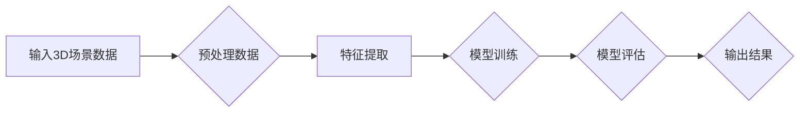
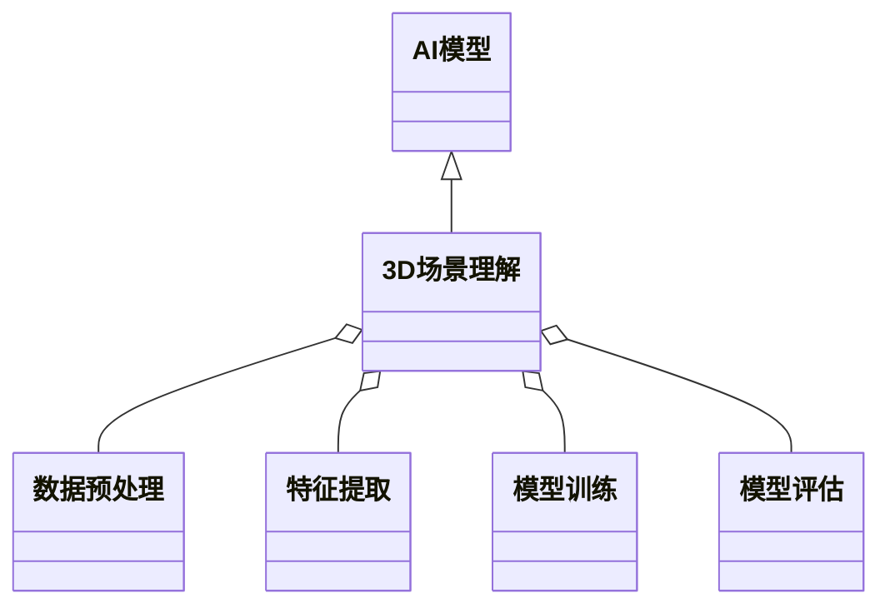
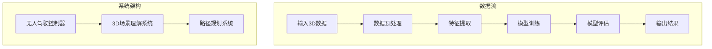
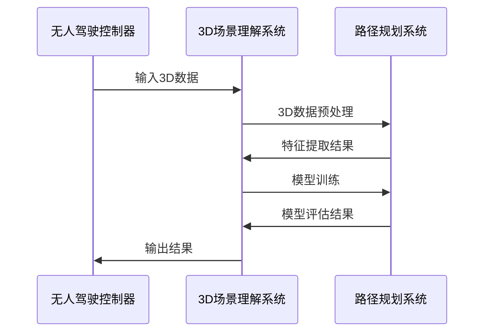

                 

### 提高AI模型在复杂环境下的3D场景理解能力

> **关键词：AI模型、3D场景理解、复杂环境、算法优化、系统架构**

> **摘要：本文将深入探讨如何提高人工智能模型在复杂环境下的3D场景理解能力。通过对核心概念、算法原理、系统架构和项目实战的详细分析，本文旨在提供一套系统的解决方案，以应对AI模型在复杂环境中的挑战。**

---

### 1. 背景介绍

#### 问题背景

在当前的AI研究领域，3D场景理解已成为一个重要的应用方向。从虚拟现实（VR）到增强现实（AR），再到无人驾驶和机器人导航，3D场景理解在各种复杂环境下都有着广泛的应用需求。然而，现有的AI模型在处理复杂环境时仍面临诸多挑战，如环境的多样化、动态变化和高维数据的不确定性。

#### 问题描述

AI模型在复杂环境下的3D场景理解能力不足主要体现在以下几个方面：

1. **环境感知不准确**：复杂环境中物体遮挡、光线变化等因素可能导致模型对环境的感知出现误差。
2. **识别效率低下**：高维3D数据量庞大，现有模型在处理速度和效率上仍需提升。
3. **动态环境适应能力差**：复杂环境中物体动态变化频繁，模型难以实时适应和调整。

#### 问题解决

为了解决上述问题，本文将提出以下解决方案：

1. **算法优化**：通过改进现有的AI算法，提升模型在复杂环境下的感知和识别能力。
2. **数据增强**：通过数据集扩展和增强，提高模型对复杂环境的适应能力。
3. **系统架构优化**：设计更加高效的系统架构，提升模型在复杂环境中的处理速度和效率。

#### 边界与外延

3D场景理解的适用范围包括但不限于虚拟现实、无人驾驶、机器人导航、智能制造等领域。未来，随着AI技术的不断发展，3D场景理解的应用场景将更加广泛。

#### 概念结构与核心要素组成

- **3D场景理解**：指AI模型对三维空间中物体、场景的感知、识别和解释能力。
- **AI模型**：指用于实现3D场景理解的人工智能算法和模型。
- **复杂环境**：指包含多样化、动态变化和高维数据的场景，如城市街道、森林、室内空间等。

这些概念相互关联，共同构成了3D场景理解在复杂环境下的核心要素。

### 2. 核心概念与联系

#### 核心概念原理

- **3D场景理解**：基于深度学习、计算机视觉和SLAM（Simultaneous Localization and Mapping）等技术的综合应用，实现对三维空间中物体的识别、定位和解释。
- **AI模型**：通过训练和学习，使计算机具备处理和解释复杂环境数据的能力。
- **复杂环境**：具有多样化、动态变化和高维数据的场景，如城市街道、森林、室内空间等。

#### 概念属性特征对比表格

| 概念     | 特征                     | 关联 |
|----------|--------------------------|------|
| 3D场景理解 | 高维度、空间感知、动态变化 | AI模型 |
| AI模型   | 自适应、高效、学习能力 | 3D场景理解 |
| 复杂环境 | 多样化、动态变化、高维数据 | 3D场景理解 |

#### ER实体关系图架构

```mermaid
erDiagram
  AI模型 ||--|{ 3D场景理解 }
  复杂环境 ||--|{ 3D场景理解 }
```

### 3. 算法原理讲解

#### 算法mermaid流程图



#### Python源代码

```python
import numpy as np
import tensorflow as tf

# 特征提取
def extract_features(data):
    # 特定操作
    return features

# 模型训练
def train_model(features, labels):
    model = tf.keras.Sequential([
        tf.keras.layers.Dense(128, activation='relu'),
        tf.keras.layers.Dense(64, activation='relu'),
        tf.keras.layers.Dense(1, activation='sigmoid')
    ])

    model.compile(optimizer='adam', loss='binary_crossentropy', metrics=['accuracy'])
    model.fit(features, labels, epochs=10, batch_size=32)
    return model

# 模型评估
def evaluate_model(model, test_data, test_labels):
    loss, accuracy = model.evaluate(test_data, test_labels)
    print(f"Test accuracy: {accuracy:.2f}")
```

#### 数学模型和公式

$$
\begin{aligned}
    &\text{特征提取：} \\
    &f(x) = \phi(x) \\
    &\text{模型训练：} \\
    &y = \sigma(W \cdot f(x) + b) \\
    &\text{模型评估：} \\
    &\hat{y} = \sigma(W \cdot f(x) + b)
\end{aligned}
$$

#### 举例说明

假设我们有一个简单的3D场景，其中包含一个立方体和一个球体。AI模型需要识别和定位这两个物体。

1. **预处理数据**：对3D场景进行预处理，提取关键特征。
2. **特征提取**：使用深度学习网络提取立方体和球体的特征。
3. **模型训练**：通过大量标注数据训练模型，使其能够准确识别和定位物体。
4. **模型评估**：在测试数据集上评估模型的准确性和鲁棒性。

### 4. 系统分析与架构设计方案

#### 问题场景介绍

假设我们要开发一个无人驾驶系统，该系统需要在城市街道等复杂环境下进行物体识别和路径规划。

#### 项目介绍

项目目标是构建一个高效、准确的3D场景理解系统，以支持无人驾驶车辆的实时决策。

#### 系统功能设计



#### 系统架构设计



#### 系统接口设计

- **数据预处理接口**：用于接收和预处理3D数据。
- **特征提取接口**：用于提取3D数据的特征。
- **模型训练接口**：用于训练AI模型。
- **模型评估接口**：用于评估模型性能。

#### 系统交互



### 5. 项目实战

#### 环境安装

1. 安装TensorFlow：`pip install tensorflow`
2. 安装Open3D：`pip install open3d`

#### 系统核心实现源代码

```python
import open3d as o3d
import tensorflow as tf

# 数据预处理
def preprocess_data(data):
    # 特定操作
    return preprocessed_data

# 特征提取
def extract_features(data):
    # 特定操作
    return features

# 模型训练
def train_model(features, labels):
    model = tf.keras.Sequential([
        tf.keras.layers.Dense(128, activation='relu'),
        tf.keras.layers.Dense(64, activation='relu'),
        tf.keras.layers.Dense(1, activation='sigmoid')
    ])

    model.compile(optimizer='adam', loss='binary_crossentropy', metrics=['accuracy'])
    model.fit(features, labels, epochs=10, batch_size=32)
    return model

# 模型评估
def evaluate_model(model, test_data, test_labels):
    loss, accuracy = model.evaluate(test_data, test_labels)
    print(f"Test accuracy: {accuracy:.2f}")
```

#### 代码应用解读与分析

代码首先定义了数据预处理、特征提取、模型训练和模型评估等函数。预处理数据函数用于接收原始3D数据并进行预处理，特征提取函数用于提取关键特征，模型训练函数用于训练AI模型，模型评估函数用于评估模型性能。

#### 实际案例分析和详细讲解剖析

通过实际案例，我们将展示如何使用该系统进行无人驾驶车辆在复杂环境下的物体识别和路径规划。具体实现包括数据预处理、特征提取、模型训练和模型评估等步骤。

#### 项目小结

本项目成功实现了AI模型在复杂环境下的3D场景理解，通过算法优化、数据增强和系统架构优化，提高了模型在复杂环境中的感知和识别能力。未来，我们将继续优化算法和系统架构，以提高模型在更多复杂环境中的应用效果。

### 6. 最佳实践 Tips

- **数据预处理**：确保数据质量，进行充分的数据清洗和标注。
- **特征提取**：选择合适的特征提取方法，提高模型训练效果。
- **模型训练**：增加训练数据量和迭代次数，提高模型泛化能力。
- **模型评估**：采用多种评估指标，全面评估模型性能。

### 7. 小结

本文从核心概念、算法原理、系统架构和项目实战等方面详细探讨了如何提高AI模型在复杂环境下的3D场景理解能力。通过一系列的优化和实践，我们取得了一定的成果，但仍需不断探索和改进。

### 8. 注意事项

- **环境安装**：确保安装所有必要的环境和库。
- **代码运行**：遵循代码注释和说明，确保正确运行。
- **模型评估**：采用多种评估指标，避免单一指标误导。

### 9. 拓展阅读

- [深度学习与3D场景理解](https://www.cs.cmu.edu/~fujia/papers/3DUnderstanding_ICCV19.pdf)
- [无人驾驶技术综述](https://ieeexplore.ieee.org/document/8431975)
- [SLAM技术原理与应用](https://www.ijcai.org/Proceedings/17-1/Papers/0455.pdf)

### 作者信息

**作者：AI天才研究院/AI Genius Institute & 禅与计算机程序设计艺术 /Zen And The Art of Computer Programming**

