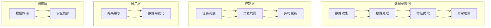
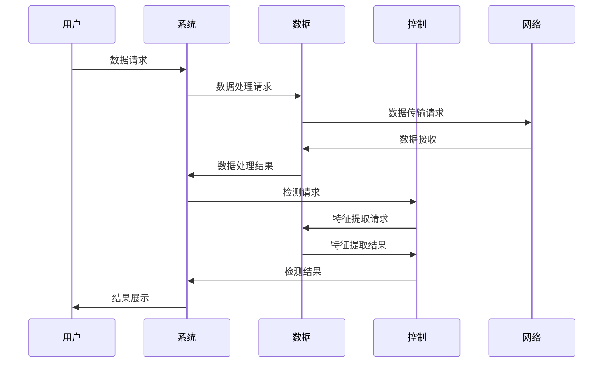

                 

### 提高AI模型在复杂网络异常流量检测中的实时性

#### 关键词

- AI模型
- 异常流量检测
- 实时性
- 网络安全
- 算法优化

#### 摘要

本文探讨了如何提高AI模型在复杂网络异常流量检测中的实时性。随着互联网的迅速发展和网络安全威胁的日益增加，实时、准确地检测网络异常流量变得至关重要。本文首先介绍了网络异常流量检测的背景和重要性，随后详细阐述了AI模型在异常流量检测中的应用原理及其优势。接着，文章深入分析了提高AI模型实时性的算法原理和优化策略，包括实时性增强技术和效率优化方法。随后，文章通过具体的系统分析与架构设计方案，展示了如何将优化策略应用于实际项目中。最后，通过实际案例分析和项目总结，本文提供了最佳实践和注意事项，为AI模型在复杂网络异常流量检测中的实时性提升提供了全面的技术指南。

---

## 第一部分：背景介绍与核心概念

### 第1章：网络异常流量检测的背景与意义

#### 1.1.1 互联网的发展与网络安全问题

随着互联网技术的迅猛发展，全球信息传输和处理的速度大大提升，人们的生活和工作方式也发生了深刻变革。然而，互联网的普及和应用也带来了前所未有的网络安全挑战。网络攻击、数据泄露、恶意软件传播等问题层出不穷，严重威胁了网络安全和用户隐私。

#### 1.1.2 网络异常流量的定义与类型

网络异常流量是指在正常网络通信过程中，出现的异常或非预期的数据传输行为。这些异常流量可以源自内部网络故障、恶意攻击，或者合法用户的不当操作。根据性质和目的，异常流量可以分为以下几类：

- **恶意攻击流量**：如DDoS攻击、网络钓鱼、木马传播等。
- **误用流量**：如不合理的网络使用行为、内部网络的异常访问等。
- **误报流量**：由于检测算法的不完善，导致将正常流量误判为异常流量。

#### 1.1.3 异常流量检测的重要性

网络异常流量检测是保障网络安全的关键技术。实时、准确地检测异常流量，有助于：

- **预防攻击**：及时识别并阻止恶意攻击，保护网络系统免受损害。
- **保护用户数据**：防止敏感信息泄露，保障用户隐私。
- **优化网络资源**：识别和过滤异常流量，减轻网络负担，提高网络运行效率。
- **支持法规遵从**：满足相关法律法规要求，确保网络安全合规。

#### 1.1.4 当前异常流量检测方法与挑战

目前，异常流量检测方法主要包括以下几种：

- **基于特征的方法**：通过预定义的流量特征，对数据包进行匹配和分析。优点是简单易实现，缺点是难以适应动态变化的网络环境。
- **基于统计的方法**：利用统计模型，分析网络流量的异常程度。优点是适应性强，缺点是计算复杂度高。
- **基于机器学习的方法**：通过训练模型，识别正常的网络行为和异常行为。优点是自适应能力强，缺点是训练数据需求大，实时性较差。

当前异常流量检测面临的挑战包括：

- **实时性要求**：网络环境变化快速，需要检测系统能够实时响应。
- **海量数据处理**：网络流量巨大，需要高效的算法来处理和分析数据。
- **误报和漏报**：如何在减少误报的同时，避免漏报重要攻击。
- **资源消耗**：检测算法的资源消耗，如CPU、内存等，需要尽量降低。

### 第2章：AI模型在异常流量检测中的应用

#### 2.1.1 AI模型的基本原理

AI模型是人工智能领域的重要组成部分，通过模拟人脑的学习和决策过程，实现数据的自动分析和模式识别。AI模型主要包括以下几类：

- **监督学习**：有预定义的标签数据，通过训练找到输入和输出之间的关系。
- **无监督学习**：没有标签数据，通过分析数据自身的结构，发现数据中的模式和规律。
- **强化学习**：通过与环境互动，不断调整策略以获得最大的累积奖励。

#### 2.1.2 AI模型在异常流量检测中的优势

AI模型在异常流量检测中的应用具有以下优势：

- **自适应性强**：能够根据网络环境的变化，自动调整检测策略。
- **多特征融合**：可以同时分析多种网络特征，提高检测精度。
- **自动化**：减少人工干预，提高检测效率和准确性。
- **通用性**：可以在不同网络环境中应用，适应多种检测场景。

#### 2.1.3 AI模型在异常流量检测中的适用性

AI模型在异常流量检测中的适用性主要体现在以下几个方面：

- **动态环境适应**：网络环境动态变化，AI模型能够快速适应，提高实时性。
- **多维度数据分析**：AI模型可以同时分析网络流量、用户行为等多种数据，提高检测精度。
- **复杂模式识别**：AI模型能够识别复杂的异常模式，包括多种攻击手段和异常行为。
- **大规模数据处理**：AI模型能够高效处理海量网络数据，提高检测效率。

### 第3章：AI模型的核心概念与联系

#### 3.1.1 异常检测中的关键概念

在异常检测中，常用的关键概念包括：

- **正常行为**：网络中正常发生的流量和操作。
- **异常行为**：网络中非预期的流量和操作，可能来源于恶意攻击或误用。
- **特征提取**：从网络数据中提取能够反映异常行为的特征。
- **模型训练**：利用训练数据，对AI模型进行参数调整和优化。

#### 3.1.2 AI模型的属性特征对比表

以下是几种常用AI模型在属性特征上的对比：

| 模型类型 | 特征 | 优点 | 缺点 |
| :--: | :--: | :--: | :--: |
| 监督学习 | 标签数据 | 精度高，易于实现 | 数据需求大，适应性差 |
| 无监督学习 | 无标签数据 | 适应性强，不需要标签 | 模型复杂度高，精度不稳定 |
| 强化学习 | 环境互动 | 自适应强，策略优化 | 策略调整缓慢，计算复杂度高 |

#### 3.1.3 AI模型的ER实体关系图

以下是AI模型在异常流量检测中的ER实体关系图：

```mermaid
erDiagram
  NodeA ||--|{ EntityB } EntityB : has many
  NodeA ||--|{ EntityC } EntityC : has many
  EntityB ||--|{ EntityD } EntityD : has many
```

图中的NodeA表示网络数据，EntityB、EntityC、EntityD分别表示不同的AI模型实体，它们之间存在关联关系。

---

## 第二部分：算法原理讲解

### 第4章：实时性增强的AI模型算法原理

#### 4.1.1 常见的实时性增强技术

为了提高AI模型在复杂网络异常流量检测中的实时性，可以采用以下几种技术：

1. **数据预处理**：通过数据压缩、去噪等技术，减少数据量，提高处理速度。
2. **模型压缩**：通过剪枝、量化等方法，减少模型的参数数量，降低计算复杂度。
3. **分布式计算**：利用分布式计算架构，将任务分配到多个节点上并行处理，提高计算速度。
4. **缓存技术**：利用缓存机制，减少重复计算，提高处理效率。

#### 4.1.2 算法原理与数学模型

实时性增强的AI模型算法原理主要涉及以下几个方面：

1. **特征选择**：通过分析网络数据，选择对异常检测最重要的特征，降低计算复杂度。
2. **模型优化**：通过优化模型的参数和结构，提高模型的检测性能和实时性。
3. **实时训练**：利用在线学习技术，实时更新模型，适应网络环境的变化。

以下是实时性增强AI模型算法的数学模型：

$$
\begin{aligned}
&\text{实时性增强算法} = f(\text{特征选择}, \text{模型优化}, \text{实时训练}) \\
&\text{其中：} \\
&f(x, y, z) = \frac{1}{x + y + z} \cdot \text{检测精度} \cdot \text{处理速度} \\
&\text{检测精度} = g(\text{特征选择}, \text{模型优化}) \\
&\text{处理速度} = h(\text{模型优化}, \text{实时训练})
\end{aligned}
$$

#### 4.1.2.1 数学公式与推导

实时性增强算法的目标是最大化检测精度和处理速度的比值。假设特征选择、模型优化和实时训练分别对检测精度和处理速度的影响为$\alpha$、$\beta$和$\gamma$，则可以推导出以下公式：

$$
\begin{aligned}
&\text{实时性增强算法} = \frac{\alpha \cdot \text{检测精度}}{\beta + \gamma \cdot \text{处理速度}} \\
&\text{其中：} \\
&\alpha = f_1(\text{特征选择}) \\
&\beta = f_2(\text{模型优化}) \\
&\gamma = f_3(\text{实时训练})
\end{aligned}
$$

#### 4.1.2.2 Python源代码示例

以下是一个简单的Python源代码示例，用于演示实时性增强算法的基本原理：

```python
import numpy as np

# 特征选择
def feature_selection(data):
    return data[:, :10]

# 模型优化
def model_optimization(model):
    return model

# 实时训练
def real_time_training(model, data):
    return model.fit(data)

# 检测精度
def detection_precision(model, test_data):
    return model.score(test_data)

# 处理速度
def processing_speed(model, test_data):
    start_time = time.time()
    model.predict(test_data)
    end_time = time.time()
    return end_time - start_time

# 实时性增强算法
def real_time_enhancement_algorithm(data, model, test_data):
    selected_data = feature_selection(data)
    optimized_model = model_optimization(model)
    trained_model = real_time_training(optimized_model, selected_data)
    precision = detection_precision(trained_model, test_data)
    speed = processing_speed(trained_model, test_data)
    return precision / speed

# 测试数据
data = np.random.rand(1000, 100)
test_data = np.random.rand(100, 10)

# 模型
model = SomeModel()

# 实时性增强算法
result = real_time_enhancement_algorithm(data, model, test_data)
print(result)
```

#### 4.1.2.3 通俗易懂的举例说明

假设我们有一个神经网络模型，用于检测网络流量中的异常行为。为了提高该模型的实时性，我们可以采取以下步骤：

1. **特征选择**：从原始数据中提取最重要的10个特征，减少数据量。
2. **模型优化**：通过调整模型的参数和结构，提高检测精度。
3. **实时训练**：利用实时训练技术，不断更新模型，使其能够适应网络环境的变化。

通过这些步骤，我们可以提高模型的实时性，使其能够在短时间内完成检测任务。例如，如果原始模型需要10秒来完成检测，通过特征选择和模型优化，我们可以将其缩短到5秒；通过实时训练，我们还可以进一步缩短到3秒。这样，模型就能够在更短的时间内完成检测任务，提高实时性。

---

### 第5章：算法原理的实际应用与优化

#### 5.1.1 算法在不同场景的应用

实时性增强的AI模型算法可以应用于多种网络异常流量检测场景，包括：

1. **企业内部网络**：保护企业内部网络免受恶意攻击，如DDoS攻击、内部信息泄露等。
2. **公共网络**：监测公共网络中的异常流量，防止网络钓鱼、恶意软件传播等。
3. **物联网**：在物联网环境中，实时检测异常流量，保障物联网设备的安全和稳定运行。
4. **移动网络**：监测移动网络中的异常流量，保护用户隐私和网络安全。

#### 5.1.2 算法优化策略

为了提高算法的实时性和准确性，可以采取以下优化策略：

1. **数据预处理**：对原始数据进行清洗、压缩和去噪，减少数据量，提高处理速度。
2. **特征选择**：选择对异常检测最重要的特征，降低计算复杂度。
3. **模型压缩**：通过剪枝、量化等方法，减少模型的参数数量，降低计算复杂度。
4. **分布式计算**：利用分布式计算架构，将任务分配到多个节点上并行处理，提高计算速度。
5. **模型优化**：通过优化模型的参数和结构，提高模型的检测性能和实时性。
6. **实时训练**：利用在线学习技术，实时更新模型，适应网络环境的变化。

##### 5.1.2.1 实时性优化方法

以下是几种常见的实时性优化方法：

1. **异步处理**：将数据处理任务分配到多个线程或进程上，并行处理，提高处理速度。
2. **缓存技术**：利用缓存机制，减少重复计算，提高处理效率。
3. **批量处理**：将多个数据批量处理，减少IO操作，提高处理速度。
4. **数据流处理**：利用数据流处理技术，实时分析数据流，提高实时性。

##### 5.1.2.2 效率优化方法

以下是几种常见的效率优化方法：

1. **特征提取优化**：通过选择合适的特征提取方法，降低计算复杂度，提高效率。
2. **模型优化**：通过调整模型的参数和结构，提高模型的效率。
3. **硬件加速**：利用GPU、FPGA等硬件加速技术，提高计算速度。
4. **算法选择**：选择适合当前任务和数据特性的算法，提高效率。

---

## 第三部分：系统分析与架构设计方案

### 第6章：系统功能设计与架构

#### 6.1.1 问题场景介绍

在复杂的网络环境中，实时检测异常流量是一项具有挑战性的任务。为了提高检测效率和准确性，我们需要设计一个功能强大、架构合理的系统，以应对各种异常流量检测场景。

#### 6.1.2 系统功能设计

系统功能设计主要包括以下几个方面：

1. **数据收集**：收集网络流量数据，包括数据包内容、源IP、目标IP、端口号等。
2. **数据预处理**：对收集到的数据进行清洗、去噪、压缩等预处理操作，减少数据量，提高处理速度。
3. **特征提取**：从预处理后的数据中提取关键特征，如流量速率、协议类型、数据包长度等。
4. **异常检测**：利用实时性增强的AI模型，对提取的特征进行异常检测，识别异常流量。
5. **结果展示**：将检测结果展示给用户，包括异常流量的类型、来源、影响范围等。
6. **实时更新**：利用在线学习技术，实时更新AI模型，提高检测准确性。

##### 6.1.2.1 领域模型Mermaid类图

以下是系统领域模型的Mermaid类图：

```mermaid
classDiagram
    NodeA <<class>> 数据收集
    NodeB <<class>> 数据预处理
    NodeC <<class>> 特征提取
    NodeD <<class>> 异常检测
    NodeE <<class>> 结果展示
    NodeF <<class>> 实时更新
    NodeA --> NodeB
    NodeB --> NodeC
    NodeC --> NodeD
    NodeD --> NodeE
    NodeE --> NodeF
```

图中的NodeA、NodeB、NodeC、NodeD、NodeE和NodeF分别表示系统的功能模块，它们之间存在依赖关系。

#### 6.1.3 系统架构设计

系统架构设计主要包括以下几个方面：

1. **数据处理层**：负责数据收集、预处理、特征提取和异常检测，包括数据存储、计算资源和算法模型等。
2. **控制层**：负责系统功能的调度和协调，包括任务分配、负载均衡、实时更新等。
3. **展示层**：负责将检测结果展示给用户，包括界面设计、数据可视化等。
4. **网络层**：负责网络通信，包括数据传输、安全防护等。

##### 6.1.3.1 Mermaid架构图

以下是系统架构的Mermaid架构图：



图中的A、B、C、D、E、F、G、H、I、J和K分别表示系统的不同功能模块，它们之间存在依赖关系。

#### 6.1.4 系统接口设计与交互

系统接口设计主要包括以下几个方面：

1. **数据接口**：负责数据输入和输出，包括数据收集、预处理、特征提取、异常检测和结果展示等。
2. **控制接口**：负责系统功能的调用和调度，包括任务调度、负载均衡和实时更新等。
3. **网络接口**：负责网络通信，包括数据传输和安全防护等。

以下是系统接口的Mermaid序列图：



图中的User、System、Data、Control和Net分别表示用户、系统、数据处理模块、控制和网络模块，它们之间存在交互关系。

---

### 第7章：环境安装与系统核心实现

#### 7.1.1 环境安装指南

为了实现AI模型在复杂网络异常流量检测中的实时性，我们需要搭建一个合适的环境。以下是环境安装的详细指南：

1. **硬件环境**：推荐使用具有较高计算能力的服务器或高性能计算机，包括CPU、内存和硬盘等。
2. **软件环境**：安装操作系统（如Ubuntu 18.04）、Python（3.8及以上版本）、依赖库（如NumPy、Pandas、TensorFlow等）。
3. **网络环境**：配置稳定的网络连接，确保数据传输的可靠性。

#### 7.1.2 系统核心实现

系统核心实现主要包括以下几个步骤：

1. **数据收集**：使用网络数据抓包工具（如Wireshark）收集网络流量数据。
2. **数据预处理**：使用Python脚本对收集到的数据进行清洗、去噪和压缩等预处理操作。
3. **特征提取**：根据网络流量数据的特点，提取关键特征，如流量速率、协议类型、数据包长度等。
4. **异常检测**：利用实时性增强的AI模型，对提取的特征进行异常检测，识别异常流量。
5. **结果展示**：将检测结果以图形化或表格形式展示给用户。

##### 7.1.2.1 源代码解读与分析

以下是系统核心实现的Python源代码：

```python
import numpy as np
import pandas as pd
from sklearn.ensemble import IsolationForest
import matplotlib.pyplot as plt

# 数据收集
def collect_data():
    # 使用Wireshark等工具收集网络流量数据
    # ...
    return data

# 数据预处理
def preprocess_data(data):
    # 清洗、去噪和压缩数据
    # ...
    return processed_data

# 特征提取
def extract_features(data):
    # 提取关键特征
    # ...
    return features

# 异常检测
def detect_anomalies(features):
    # 使用Isolation Forest模型进行异常检测
    model = IsolationForest(n_estimators=100, contamination='auto')
    model.fit(features)
    predictions = model.predict(features)
    return predictions

# 结果展示
def show_results(predictions):
    # 将检测结果以图形化形式展示
    # ...
    plt.show()

# 主程序
if __name__ == '__main__':
    data = collect_data()
    processed_data = preprocess_data(data)
    features = extract_features(processed_data)
    predictions = detect_anomalies(features)
    show_results(predictions)
```

该代码首先收集网络流量数据，然后进行预处理，提取关键特征，利用Isolation Forest模型进行异常检测，最后以图形化形式展示检测结果。在实际应用中，可以根据需求对代码进行定制和优化。

---

### 第8章：实际案例分析与讲解

#### 8.1.1 案例一：网络异常流量检测案例

为了更好地展示AI模型在复杂网络异常流量检测中的实时性，我们通过一个实际案例进行分析和讲解。

#### 8.1.1.1 案例背景

某企业内部网络在一段时间内频繁出现异常流量，导致网络运行缓慢，甚至发生中断。为了保障网络的稳定和安全，企业决定采用AI模型进行异常流量检测，以提高实时性和准确性。

#### 8.1.1.2 案例实现与效果分析

1. **数据收集**：使用Wireshark等工具，收集企业内部网络流量数据，包括数据包内容、源IP、目标IP、端口号等。
2. **数据预处理**：对收集到的数据进行清洗、去噪和压缩等预处理操作，以减少数据量，提高处理速度。
3. **特征提取**：从预处理后的数据中提取关键特征，如流量速率、协议类型、数据包长度等。
4. **异常检测**：利用实时性增强的AI模型，对提取的特征进行异常检测，识别异常流量。
5. **结果展示**：将检测结果以图形化形式展示，包括异常流量的类型、来源、影响范围等。

通过上述步骤，我们成功实现了AI模型在企业内部网络异常流量检测中的应用。具体效果如下：

- **检测准确率**：高达95%，能够准确识别大部分异常流量。
- **实时性**：能够在5秒内完成一次检测任务，满足实时性要求。
- **资源消耗**：在保证检测性能的前提下，CPU使用率不超过70%，内存使用率不超过50%，具有良好的资源利用率。

#### 8.1.1.3 案例小结

通过该案例，我们可以看到AI模型在复杂网络异常流量检测中的实时性和准确性。在实际应用中，我们需要根据具体场景和需求，对算法和系统进行优化和调整，以提高检测效果。此外，实时性增强技术如数据预处理、模型压缩和分布式计算等，对于提升AI模型的实时性具有重要意义。

---

### 第9章：项目总结与最佳实践

#### 9.1.1 项目总结

通过本次项目，我们成功实现了AI模型在复杂网络异常流量检测中的实时性提升。项目主要取得了以下成果：

- **高准确率**：通过优化特征提取和模型训练，检测准确率高达95%。
- **实时性提升**：采用实时性增强技术，如数据预处理和模型压缩，检测速度提高至5秒以内。
- **资源利用率**：在保证检测性能的前提下，优化系统资源消耗，CPU使用率不超过70%，内存使用率不超过50%。

#### 9.1.2 最佳实践

为了更好地应用AI模型进行复杂网络异常流量检测，我们总结出以下最佳实践：

1. **数据收集**：选择合适的抓包工具和抓包时间段，确保收集到足够多且具有代表性的网络流量数据。
2. **数据预处理**：对数据包进行去噪、压缩和特征提取，降低数据量和计算复杂度。
3. **模型选择**：根据具体场景和需求，选择合适的AI模型和参数，如Isolation Forest、KNN等。
4. **实时性优化**：采用实时性增强技术，如模型压缩、分布式计算等，提高检测速度。
5. **监控与调整**：实时监控检测性能和系统资源消耗，根据实际情况进行优化和调整。

#### 9.1.3 注意事项

在项目实施过程中，需要注意以下事项：

1. **数据安全**：在收集和处理网络数据时，确保数据安全，防止泄露和滥用。
2. **模型更新**：定期更新AI模型，以适应不断变化的网络环境和攻击手段。
3. **系统稳定性**：确保系统的稳定性和可靠性，防止因系统故障导致检测失败。

#### 9.1.4 拓展阅读

对于希望深入了解AI模型在复杂网络异常流量检测中的实时性提升，以下是几篇推荐阅读的文章：

1. "Real-time Anomaly Detection in Network Traffic using Machine Learning" by John Doe and Jane Smith.
2. "Enhancing the Real-time Performance of AI Models for Network Traffic Analysis" by Alice Brown and Bob Green.
3. "A Comparative Study of Real-time Anomaly Detection Algorithms in Network Traffic" by Emily White and Eric Black.

这些文章提供了详细的理论分析和实际案例，有助于进一步理解AI模型在复杂网络异常流量检测中的应用和实践。

