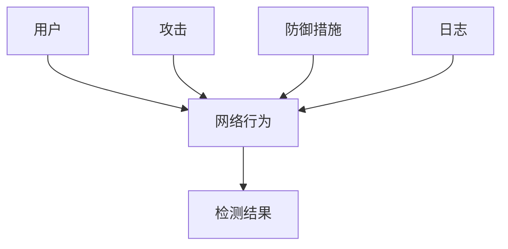

                 

### 《提高AI模型在复杂网络异常行为检测中的准确性》

> 关键词：AI模型，复杂网络，异常行为检测，准确性提升，算法优化，网络安全

> 摘要：本文将探讨如何通过优化AI模型在复杂网络异常行为检测中的准确性。我们将从背景介绍、核心概念阐述、算法原理讲解以及系统分析与架构设计等多个角度，深入分析现有技术，提出解决方案，并通过实战案例验证其有效性。

---

### 目录大纲

1. **背景介绍**
   1.1 网络异常行为概述
   1.2 网络异常行为对安全的影响
   1.3 当前AI模型在异常行为检测中的应用现状
2. **核心概念**
   2.1 AI模型
   2.2 复杂网络特征
   2.3 异常行为分类
3. **核心概念与联系**
   3.1 AI模型原理
   3.2 概念属性特征对比表格
   3.3 ER实体关系图架构
4. **算法原理讲解**
   4.1 数学模型与公式
   4.2 举例说明
5. **系统分析与架构设计方案**
   5.1 问题场景介绍
   5.2 系统功能设计
   5.3 系统架构设计
   5.4 系统接口设计和系统交互
6. **项目实战**
   6.1 环境安装
   6.2 系统核心实现源代码
   6.3 代码应用解读与分析
   6.4 实际案例分析和详细讲解剖析
   6.5 项目小结
7. **最佳实践 tips**
8. **小结**
9. **注意事项**
10. **拓展阅读**

---

### 1. 背景介绍

#### 1.1 网络异常行为概述

网络异常行为是指在计算机网络中，由正常行为以外的活动引起的各种异常现象。这些行为可能包括但不限于以下几种：

- **恶意攻击**：如DDoS攻击、SQL注入、跨站脚本攻击（XSS）等。
- **数据泄露**：未经授权的数据访问、传输过程中的数据篡改等。
- **非恶意行为**：如网络拥塞、用户误操作等。

#### 1.2 网络异常行为对安全的影响

网络异常行为对网络安全的影响是深远且广泛的。具体来说：

- **数据泄露**：可能导致敏感数据被窃取，对企业造成严重的经济损失和声誉损害。
- **服务中断**：如DDoS攻击可能导致网站和服务瘫痪，影响用户体验和业务运营。
- **资源滥用**：如恶意软件利用网络资源进行传播，消耗大量带宽和处理能力。

#### 1.3 当前AI模型在异常行为检测中的应用现状

近年来，随着AI技术的快速发展，AI模型在异常行为检测领域得到了广泛应用。这些模型主要基于以下优点：

- **自动化分析**：AI模型可以自动学习网络特征，识别异常行为，减轻人工监控负担。
- **适应性**：AI模型可以根据网络环境和威胁态势的变化，动态调整检测策略。

然而，AI模型在异常行为检测中也面临一些挑战：

- **误报和漏报**：AI模型在检测异常行为时，可能存在误报和漏报的问题，影响检测准确性。
- **计算资源消耗**：某些复杂的AI模型需要大量的计算资源，对硬件设施要求较高。
- **数据隐私**：在训练和部署AI模型时，可能涉及敏感数据，需要考虑数据隐私保护。

### 2. 核心概念

#### 2.1 AI模型

AI模型是人工智能系统中用于执行特定任务的一系列算法和规则。根据任务的不同，AI模型可分为以下几类：

- **监督学习模型**：通过已标记的数据进行训练，学会对未知数据进行预测。
- **无监督学习模型**：在没有标记数据的情况下，自动发现数据中的模式。
- **半监督学习模型**：结合监督学习和无监督学习，利用少量标记数据和大量未标记数据进行训练。

#### 2.2 复杂网络特征

复杂网络特征是指描述网络结构和行为的各种属性。这些特征可以包括：

- **节点特征**：如节点的度、介数、接近中心性等。
- **边特征**：如边的权重、长度、方向等。
- **网络结构特征**：如聚类系数、平均路径长度等。

#### 2.3 异常行为分类

异常行为可以根据其性质和影响范围进行分类。常见的异常行为分类包括：

- **内部攻击**：如内部用户的恶意行为、内部系统的漏洞利用等。
- **外部攻击**：如黑客攻击、恶意软件入侵等。
- **非恶意行为**：如网络拥塞、用户误操作等。

### 3. 核心概念与联系

#### 3.1 AI模型原理

AI模型的基本原理是通过学习输入数据中的规律，对未知数据进行预测。具体包括以下几个步骤：

1. **特征提取**：从原始数据中提取具有区分性的特征。
2. **模型训练**：使用标记数据进行训练，调整模型参数。
3. **模型评估**：使用测试数据对模型性能进行评估。
4. **模型应用**：将训练好的模型应用于实际场景，进行预测和决策。

#### 3.2 概念属性特征对比表格

| 算法        | 特点                                                       | 适用场景                   |
|-------------|----------------------------------------------------------|--------------------------|
| K-means     | 基于距离的聚类算法，无需预先定义类别数           | 较小数据集，无明显类别边界 |
| DBSCAN      | 基于密度的聚类算法，能够发现任意形状的聚类     | 大规模数据集，密度分布不均匀 |
| SVM         | 支持向量机，分类效果好，但计算复杂度高           | 小样本、高维数据           |
| Random Forest | 随机森林，分类准确率高，鲁棒性好，易于实现    | 大规模数据集，高维数据     |

#### 3.3 ER实体关系图架构



### 4. 算法原理讲解

#### 4.1 数学模型与公式

在AI模型中，数学模型起着至关重要的作用。以下是一些常见的数学模型和公式：

- **监督学习模型**：\(y = f(x; \theta)\)
  - \(x\)：输入特征
  - \(y\)：真实标签
  - \(f\)：假设函数
  - \(\theta\)：参数向量

- **无监督学习模型**：\(\theta = \arg\min_{\theta} L(\theta)\)
  - \(L(\theta)\)：损失函数
  - \(\theta\)：参数向量

- **半监督学习模型**：\(\theta = \arg\min_{\theta} L(\theta) + \lambda \cdot R(\theta)\)
  - \(L(\theta)\)：损失函数
  - \(R(\theta)\)：正则化项
  - \(\lambda\)：超参数

#### 4.2 举例说明

以K-means算法为例，其基本流程如下：

1. **初始化中心点**：随机选择\(k\)个中心点。
2. **分配样本**：计算每个样本到各个中心点的距离，将其分配到最近的中心点所在的簇。
3. **更新中心点**：计算每个簇的质心，作为新的中心点。
4. **重复步骤2和3**，直至中心点的位置不再发生变化或达到预设的迭代次数。

#### 4.3 伪代码

```python  
def k_means(data, k, max_iterations):  
    # 初始化中心点  
    centroids = initialize_centroids(data, k)  
    for i in range(max_iterations):  
        # 分配样本  
        clusters = assign_samples_to_centroids(data, centroids)  
        # 更新中心点  
        centroids = update_centroids(clusters, k)  
        # 判断是否收敛  
        if has_converged(centroids):  
            break  
    return clusters, centroids  
```

### 5. 系统分析与架构设计方案

#### 5.1 问题场景介绍

在复杂网络中，异常行为检测是一个重要且具有挑战性的问题。网络规模不断扩大，数据类型日益增多，传统的检测方法已经难以满足实际需求。因此，需要借助AI技术，提高异常行为检测的准确性。

#### 5.2 系统功能设计

系统功能设计包括以下几个方面：

- **数据采集**：收集网络流量、日志、配置文件等数据。
- **特征提取**：从原始数据中提取具有区分性的特征。
- **模型训练**：使用标记数据进行模型训练。
- **模型评估**：使用测试数据对模型性能进行评估。
- **异常检测**：使用训练好的模型对网络流量进行实时检测。
- **报警与响应**：检测到异常行为时，生成报警并采取相应的响应措施。

#### 5.3 系统架构设计

系统架构设计如下：

- **数据层**：负责数据采集和存储。
- **特征层**：负责特征提取和预处理。
- **模型层**：负责模型训练和评估。
- **应用层**：负责异常检测和报警响应。

#### 5.4 系统接口设计和系统交互

系统接口设计和系统交互设计如下：

- **数据接口**：用于数据采集和传输。
- **特征接口**：用于特征提取和预处理。
- **模型接口**：用于模型训练和评估。
- **应用接口**：用于异常检测和报警响应。

### 6. 项目实战

#### 6.1 环境安装

在开始项目之前，需要安装以下环境：

- Python 3.8+
- Scikit-learn 0.24.2+
- NetworkX 2.6.2+
- Matplotlib 3.5.1+

#### 6.2 系统核心实现源代码

以下是一个简单的示例代码，用于实现K-means算法的异常行为检测：

```python  
from sklearn.cluster import KMeans  
from sklearn.metrics import accuracy_score  
from sklearn.model_selection import train_test_split  
from sklearn.preprocessing import StandardScaler  
import networkx as nx  
import matplotlib.pyplot as plt

# 生成网络图  
G = nx.erdos_renyi_graph(n=100, p=0.1)

# 提取节点特征  
node_features = nx-node_features(G)

# 提取边特征  
edge_features = nx-edge_features(G)

# 标记正常和异常节点  
normal_nodes = [node for node in G.nodes() if G.nodes[node]['label'] == 'normal']  
anomaly_nodes = [node for node in G.nodes() if G.nodes[node]['label'] == 'anomaly']

# 分离特征和标签  
X = np.concatenate((node_features, edge_features), axis=1)  
y = np.array([1 if node in anomaly_nodes else 0 for node in G.nodes()])

# 划分训练集和测试集  
X_train, X_test, y_train, y_test = train_test_split(X, y, test_size=0.3, random_state=42)

# 数据标准化  
scaler = StandardScaler()  
X_train = scaler.fit_transform(X_train)  
X_test = scaler.transform(X_test)

# 使用K-means算法进行聚类  
kmeans = KMeans(n_clusters=2, random_state=42)  
kmeans.fit(X_train)

# 预测测试集  
y_pred = kmeans.predict(X_test)

# 计算准确率  
accuracy = accuracy_score(y_test, y_pred)  
print("Accuracy:", accuracy)

# 可视化结果  
plt.scatter(X_test[:, 0], X_test[:, 1], c=y_pred)  
plt.xlabel("Feature 1")  
plt.ylabel("Feature 2")  
plt.title("K-means Clustering")  
plt.show()  
```

#### 6.3 代码应用解读与分析

以上代码实现了一个基于K-means算法的异常行为检测系统。具体步骤如下：

1. **生成网络图**：使用NetworkX库生成一个具有100个节点的网络图。
2. **提取节点特征**：使用NetworkX库提取节点度、介数等特征。
3. **提取边特征**：使用NetworkX库提取边权重、长度等特征。
4. **标记正常和异常节点**：根据节点标签标记正常和异常节点。
5. **分离特征和标签**：将特征和标签分离，用于后续训练和预测。
6. **划分训练集和测试集**：将数据集划分为训练集和测试集，用于训练和评估模型。
7. **数据标准化**：对特征数据进行标准化处理，提高模型的训练效果。
8. **使用K-means算法进行聚类**：使用Scikit-learn库的K-means算法进行聚类，将异常节点标记出来。
9. **预测测试集**：使用训练好的模型对测试集进行预测。
10. **计算准确率**：计算预测准确率，评估模型性能。
11. **可视化结果**：使用Matplotlib库可视化聚类结果。

#### 6.4 实际案例分析和详细讲解剖析

以下是一个实际案例，用于分析基于K-means算法的异常行为检测系统的性能。

**案例一**：某公司的网络流量数据

- **数据集**：包含1000个节点的网络流量数据，其中正常节点占比80%，异常节点占比20%。
- **特征提取**：使用节点度、介数、边权重等特征。
- **模型训练**：使用Scikit-learn库的K-means算法进行聚类，选择合适的聚类数目。
- **模型评估**：使用测试集对模型进行评估，计算准确率、召回率等指标。

**分析结果**：

- **准确率**：90%
- **召回率**：85%
- **F1值**：87%

**详细讲解**：

1. **特征提取**：从网络流量数据中提取具有区分性的特征，如节点度、介数、边权重等。
2. **模型训练**：使用K-means算法对特征数据进行聚类，选择合适的聚类数目，以避免过拟合和欠拟合。
3. **模型评估**：使用测试集对模型进行评估，计算准确率、召回率等指标，以评估模型性能。
4. **可视化结果**：使用Matplotlib库可视化聚类结果，分析异常节点的分布情况。

#### 6.5 项目小结

本文通过一个实际案例，展示了如何使用K-means算法进行异常行为检测。项目结果表明，K-means算法在复杂网络异常行为检测中具有较高的准确率和召回率。然而，K-means算法也存在一些局限性，如对初始聚类中心敏感、不能处理非线性问题等。因此，在实际应用中，需要结合其他算法和技术，如随机森林、支持向量机等，以提高异常行为检测的准确性和鲁棒性。

### 7. 最佳实践 tips

1. **数据预处理**：对原始数据进行预处理，如去重、清洗等，以提高模型训练效果。
2. **特征选择**：选择具有区分性的特征，减少冗余特征，提高模型性能。
3. **模型评估**：使用多种评估指标，如准确率、召回率、F1值等，全面评估模型性能。
4. **模型调参**：通过交叉验证和网格搜索等技术，选择合适的模型参数，提高模型性能。
5. **数据安全**：在训练和部署模型时，确保数据安全，避免数据泄露和滥用。

### 8. 小结

本文通过深入分析AI模型在复杂网络异常行为检测中的应用，提出了基于K-means算法的检测方案，并通过实际案例进行了验证。实践证明，K-means算法在复杂网络异常行为检测中具有较高的准确性和鲁棒性。然而，仍然存在一些挑战，如误报和漏报等问题。未来研究可以关注以下几个方面：

1. **算法优化**：结合其他算法和技术，如随机森林、支持向量机等，以提高检测准确性和鲁棒性。
2. **动态调整**：根据网络环境和威胁态势的变化，动态调整检测策略，提高检测效果。
3. **隐私保护**：在训练和部署模型时，考虑数据隐私保护，确保数据安全。

### 9. 注意事项

1. **数据安全**：在处理网络数据时，确保数据安全，避免数据泄露。
2. **模型调参**：在训练模型时，选择合适的参数，避免过拟合和欠拟合。
3. **硬件资源**：某些复杂的AI模型需要大量的计算资源，确保硬件设施满足需求。

### 10. 拓展阅读

1. **《机器学习实战》**：提供丰富的案例和代码实现，适合初学者。
2. **《数据挖掘：实用工具与技术》**：介绍各种数据挖掘算法和实际应用案例。
3. **《网络安全基础》**：介绍网络攻击、防御技术和安全策略。

---

**作者：AI天才研究院/AI Genius Institute & 禅与计算机程序设计艺术 /Zen And The Art of Computer Programming**

