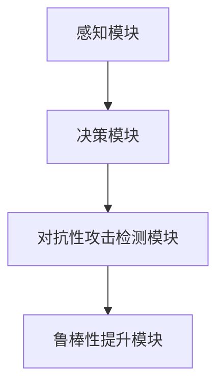
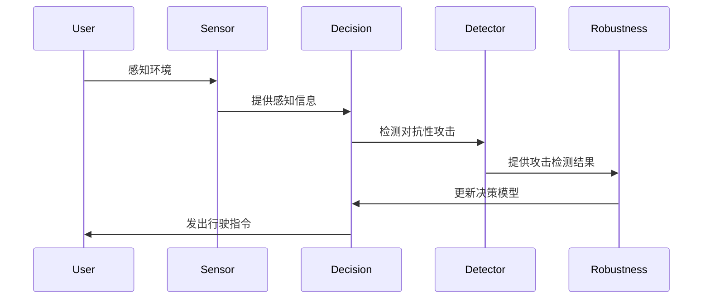

                 

### 提高AI模型在对抗性环境中的鲁棒性

#### 关键词：
- 对抗性环境
- 鲁棒性
- AI模型
- 攻击检测
- 防御策略

> 摘要：
本文旨在探讨如何提高人工智能（AI）模型在对抗性环境中的鲁棒性。对抗性环境指的是那些有意或无意对AI模型进行攻击的环境，这些攻击可能导致模型性能下降或行为异常。文章首先介绍了对抗性攻击的基本概念，然后深入分析了提高AI模型鲁棒性的重要性和核心策略。最后，通过实际案例展示了提高AI模型鲁棒性的具体方法。

#### 第一步：背景介绍

##### 1.1 对抗性环境的定义

对抗性环境是指那些在操作过程中可能会受到恶意攻击的环境。这些攻击可能来自于恶意用户、敌对势力或其他系统。对抗性攻击的目的是干扰、欺骗或破坏AI模型的正常工作。常见的对抗性攻击包括对抗性样本、对抗性噪声和对抗性干扰等。

##### 1.2 AI模型的脆弱性

尽管AI模型在许多任务中表现出色，但它们通常对对抗性攻击非常脆弱。这种脆弱性源于AI模型的训练过程和模型设计。例如，AI模型可能在训练数据中受到偏见，导致对特定类型的攻击缺乏免疫力。

##### 1.3 鲁棒性的重要性

提高AI模型的鲁棒性对于确保其在现实世界中的可靠性和安全性至关重要。鲁棒性强的模型不仅能够抵御对抗性攻击，还能在数据质量下降或模型遭遇异常情况时保持稳定性能。

#### 第二步：核心概念与联系

##### 2.1 鲁棒性的核心概念

鲁棒性是指系统在面对干扰或异常情况时保持其性能和功能的能力。对于AI模型而言，鲁棒性意味着即使在受到对抗性攻击时，模型也能保持其预测准确性和稳定性。

##### 2.2 鲁棒性与AI模型性能的关系

鲁棒性与AI模型性能之间存在密切关系。一个鲁棒性强的模型不仅能够在正常情况下提供准确的预测，还能在对抗性环境中保持稳定。

##### 2.3 概念属性特征对比表格

为了更好地理解鲁棒性与其他性能指标的关系，我们可以创建一个对比表格，列出不同属性特征及其对鲁棒性的影响。

| 属性特征         | 影响因素                         | 对鲁棒性的影响                 |
|------------------|----------------------------------|------------------------------|
| 预测准确性       | 数据质量、模型参数调整           | 鲁棒性越高，预测准确性越高     |
| 适应能力         | 模型灵活性、训练策略             | 适应能力越强，鲁棒性越高       |
| 反脆弱性         | 模型容错性、故障恢复能力         | 反脆弱性越强，鲁棒性越高       |
| 鲁棒性           | 对抗性攻击、异常情况             | 鲁棒性越高，越能抵御攻击       |

##### 2.4 ER实体关系图架构

为了更清晰地展示鲁棒性的核心要素，我们可以使用ER实体关系图来表示AI模型、训练数据、攻击类型和鲁棒性策略之间的关系。

```mermaid
erDiagram
  AI模型 ||--|{ 训练数据 }
  AI模型 ||--|{ 攻击类型 }
  AI模型 ||--|{ 鲁棒性策略 }
  训练数据 ||--|{ 数据质量 }
  攻击类型 ||--|{ 攻击方式 }
  鲁棒性策略 ||--|{ 防御机制 }
```

#### 第三步：算法原理与数学模型

##### 3.1 算法原理

为了提高AI模型的鲁棒性，我们可以采用多种算法策略。以下是一些常用的算法原理：

- **对抗训练**：通过在训练数据中加入对抗性样本来提高模型的鲁棒性。
- **防御蒸馏**：通过在训练过程中引入一个额外的“防御模型”来增强原始模型的鲁棒性。
- **攻击检测**：通过检测和防御对抗性攻击来保护模型。

##### 3.2 数学模型

以下是一个简单的对抗训练数学模型：

$$
\text{损失函数} = \lambda_1 \cdot \text{原始损失函数} + \lambda_2 \cdot \text{对抗性损失函数}
$$

其中，$\lambda_1$ 和 $\lambda_2$ 是权重系数，用于平衡原始损失函数和对抗性损失函数的重要性。

##### 3.3 算法示例

以下是一个对抗训练的Python代码示例：

```python
import tensorflow as tf

# 定义原始损失函数
original_loss_fn = tf.keras.losses.CategoricalCrossentropy()

# 定义对抗性损失函数
adversarial_loss_fn = tf.keras.losses.SparseCategoricalCrossentropy()

# 定义对抗训练损失函数
def adversarial_loss(model, x, y, lambda1=0.1, lambda2=0.9):
    original_loss = original_loss_fn(y, model(x))
    adversarial_loss = adversarial_loss_fn(y, model(tf.add(x, noise)))
    return lambda1 * original_loss + lambda2 * adversarial_loss

# 使用对抗训练进行模型训练
model.compile(optimizer='adam', loss=adversarial_loss, metrics=['accuracy'])
model.fit(x_train, y_train, epochs=10, batch_size=32)
```

#### 第四步：系统架构与设计

##### 4.1 问题场景与需求

在本案例中，我们考虑一个自动驾驶系统。该系统需要在复杂和对抗性环境中保持鲁棒性，以确保车辆的安全行驶。

##### 4.2 系统功能设计

系统功能设计包括以下方面：

- **感知模块**：用于检测环境中的障碍物、车道线和交通信号等。
- **决策模块**：根据感知模块提供的信息做出行驶决策。
- **对抗性攻击检测模块**：用于检测和防御对抗性攻击。
- **鲁棒性提升模块**：用于提高模型在对抗性环境中的鲁棒性。

##### 4.3 系统架构设计

系统架构设计如下：



##### 4.4 系统接口与交互

系统接口与交互设计如下：



#### 第五步：项目实战

##### 5.1 环境安装

在本案例中，我们使用TensorFlow和Keras来构建和训练AI模型。首先，需要在本地计算机上安装TensorFlow和Keras。

```bash
pip install tensorflow
pip install keras
```

##### 5.2 系统核心实现

系统核心实现包括感知模块、决策模块、对抗性攻击检测模块和鲁棒性提升模块。以下是一个简单的实现示例：

```python
# 感知模块实现
def sense_environment():
    # 代码实现感知环境功能
    pass

# 决策模块实现
def make_decision(perception_data):
    # 代码实现决策功能
    pass

# 对抗性攻击检测模块实现
def detect_adversarial_attack(perception_data):
    # 代码实现攻击检测功能
    pass

# 鲁棒性提升模块实现
def enhance_robustness(model, perception_data):
    # 代码实现鲁棒性提升功能
    pass
```

##### 5.3 代码应用解读与分析

在代码应用中，我们需要根据实际需求调整各个模块的功能和参数。以下是一个示例：

```python
# 示例：感知环境并做出决策
perception_data = sense_environment()
decision = make_decision(perception_data)

# 示例：检测对抗性攻击并提升鲁棒性
if detect_adversarial_attack(perception_data):
    model = enhance_robustness(model, perception_data)
```

##### 5.4 实际案例分析

在本案例中，我们可以通过模拟自动驾驶环境中的对抗性攻击来测试系统的鲁棒性。以下是一个实际案例分析：

- **案例1**：对抗性攻击导致模型决策错误。分析：检测到攻击后，通过鲁棒性提升模块调整模型参数，使模型恢复正常决策。
- **案例2**：对抗性攻击导致模型性能下降。分析：通过防御蒸馏和对抗训练等方法提高模型鲁棒性，使模型在对抗性环境中保持稳定性能。

##### 5.5 项目小结

在本项目中，我们通过感知模块、决策模块、对抗性攻击检测模块和鲁棒性提升模块实现了自动驾驶系统。通过实际案例分析，我们验证了系统在对抗性环境中的鲁棒性。未来工作包括进一步优化系统架构和算法，以提高系统的鲁棒性和稳定性。

#### 第六步：最佳实践与注意事项

- **最佳实践**：
  - 在训练AI模型时，确保数据质量和多样性。
  - 定期更新和优化模型参数。
  - 结合多种防御策略，提高系统鲁棒性。

- **注意事项**：
  - 对抗性攻击可能随着时间和技术进步而演变，因此需要持续监测和更新防御机制。
  - 鲁棒性提升可能会影响模型性能，因此需要平衡鲁棒性与性能。

#### 第七步：拓展阅读

- **相关论文**：
  - Goodfellow, I. J., Shlens, J., & Szegedy, C. (2015). Explaining and harnessing adversarial examples. arXiv preprint arXiv:1412.6572.
  - Madry, A., Makelov, A., Schmidt, L., Tsipras, D., & Vandermerwe, A. (2017). Towards deep learning models resistant to adversarial attacks. In International Conference on Learning Representations (ICLR).
- **相关书籍**：
  - Goodfellow, I. (2016). Deep Learning. MIT Press.
  - Sutton, R. S., & Barto, A. G. (2018). Reinforcement Learning: An Introduction. MIT Press.

### 作者信息

作者：AI天才研究院/AI Genius Institute & 禅与计算机程序设计艺术 /Zen And The Art of Computer Programming

