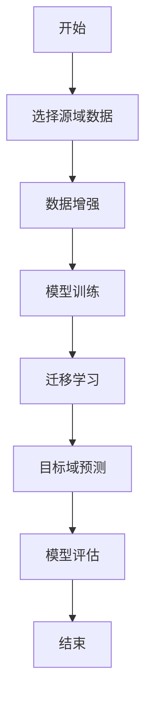
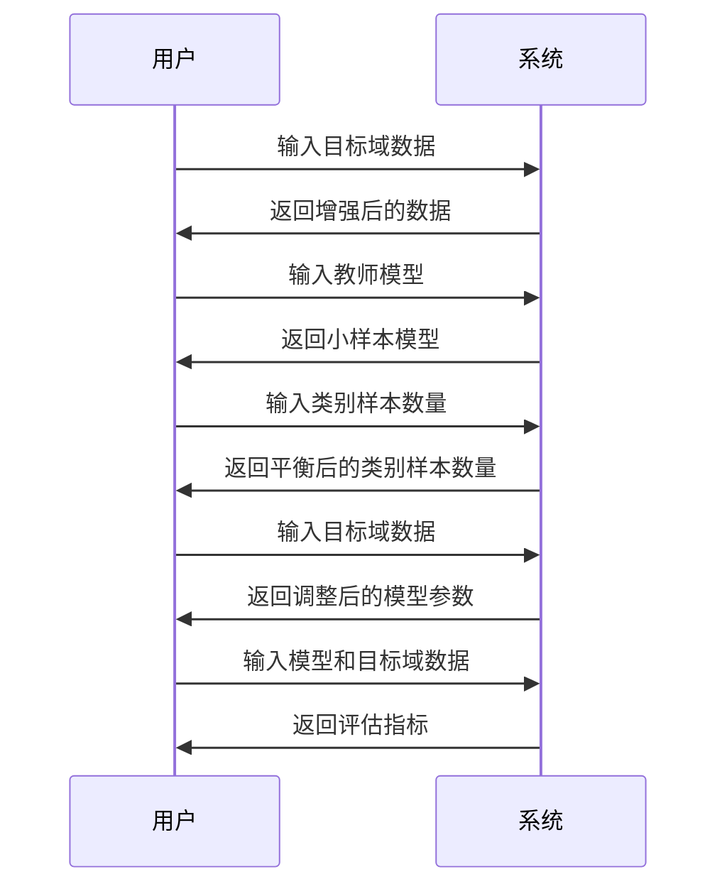

                 

# 提高AI模型在小样本迁移学习任务中的适应性

## 关键词

- 小样本迁移学习
- 数据增强
- 知识蒸馏
- 类别不平衡处理
- 自适应学习

## 摘要

本文旨在探讨如何提高AI模型在小样本迁移学习任务中的适应性。首先，我们介绍了小样本迁移学习的背景和问题，包括数据稀缺、类别不均衡、零样本学习和适应性等方面。接着，我们详细阐述了小样本迁移学习的核心概念、原理和算法，通过Mermaid流程图和Python代码展示了算法的具体实现。此外，我们还介绍了系统分析与架构设计方案，并给出实际案例进行分析。最后，我们总结了最佳实践、注意事项和拓展阅读，为读者提供全面的指导。

## 第一部分：背景介绍

### 1.1 小样本迁移学习的重要性

随着人工智能技术的快速发展，深度学习在图像识别、自然语言处理、语音识别等领域取得了显著的成果。然而，深度学习模型通常需要大量的训练数据才能达到较好的性能。然而，在实际应用中，获取大量标注数据往往成本高昂且耗时。因此，如何在小样本情况下训练出具有良好性能的模型成为了研究的热点问题。小样本迁移学习作为一种有效的解决方案，旨在利用已有的大型模型和数据，将其知识迁移到小样本任务中，从而提高模型在小样本情况下的适应性和性能。

### 1.2 小样本迁移学习的问题描述

小样本迁移学习主要面临以下问题：

1. 数据稀缺：训练数据量较少，难以覆盖所有可能的分布。这导致模型在训练过程中容易过拟合，无法泛化到未见过的数据。

2. 类别不均衡：源域和目标域之间的类别分布可能不均衡。这可能导致模型在少数类别上表现不佳，影响整体性能。

3. 零样本学习：目标域中存在从未见过的类别，需要模型能够自适应地处理。这对于模型的泛化能力和适应性提出了更高的要求。

4. 适应性：模型需要能够适应新的任务和数据分布。这意味着模型不仅要能够处理现有数据，还要能够适应未来的变化。

### 1.3 问题解决方法

为解决上述问题，研究者们提出了一系列方法，包括：

1. 数据增强：通过增加数据多样性、数据扩充等方法，提高模型对小样本的适应能力。例如，可以使用数据增强技术，如旋转、缩放、裁剪等，增加训练数据的数量和多样性。

2. 知识蒸馏：利用预训练的大型模型，将其知识迁移到小样本任务中。通过将大型模型的输出作为软标签，指导小样本模型的训练，从而提高其性能。

3. 类别不平衡处理：采用过采样、欠采样等方法平衡类别分布。这有助于减少模型对少数类别的偏好，提高整体性能。

4. 自适应学习：设计自适应学习算法，使模型能够根据目标域数据动态调整。这有助于模型更好地适应新的任务和数据分布。

### 1.4 边界与外延

小样本迁移学习不仅关注于模型在小样本情况下的性能，还涉及以下方面：

1. 源域与目标域的选择：选择合适的源域和目标域，确保模型迁移效果。源域和目标域应该具有相似的特征和任务需求。

2. 数据集构建：设计合理的数据集，模拟实际应用场景。数据集应该包含多样化的样本，以覆盖不同的分布和类别。

3. 模型评估：设计科学合理的评估指标，评估模型在小样本情况下的性能。常见的评估指标包括准确率、召回率、F1值等。

### 1.5 概念结构与核心要素组成

小样本迁移学习涉及以下核心概念和要素：

1. 源域（Source Domain）：提供训练数据的领域。源域通常具有大量的标注数据，用于训练大型模型。

2. 目标域（Target Domain）：需要模型进行迁移学习的领域。目标域可能缺乏标注数据，但与源域具有相似的特征和任务需求。

3. 迁移学习（Transfer Learning）：将源域知识迁移到目标域的学习过程。迁移学习通过利用源域模型的知识和经验，提高目标域模型的性能。

4. 小样本（Few-shot Learning）：训练数据量较少的学习场景。在小样本情况下，模型需要具备较强的泛化能力和适应性。

## 第二部分：核心概念与联系

### 2.1 小样本迁移学习原理

小样本迁移学习主要通过以下方法实现：

1. 零样本学习（Zero-shot Learning）：模型在遇到从未见过的类别时，依然能够给出合理的预测。这需要模型具备较强的泛化能力和知识表示能力。

2. 几样本学习（Few-shot Learning）：模型在仅有少量样本的情况下进行学习。这要求模型能够从少量样本中提取有用的信息，并构建有效的特征表示。

3. 元学习（Meta Learning）：通过学习多个任务，提高模型在未知任务上的表现。元学习旨在寻找通用学习策略，使模型能够快速适应新的任务。

### 2.2 概念属性特征对比

| 方法             | 特点                                                     |
|------------------|--------------------------------------------------------|
| 零样本学习       | 模型能够处理从未见过的类别                             |
| 几样本学习       | 模型在仅有少量样本的情况下进行学习                     |
| 元学习           | 通过学习多个任务，提高模型在未知任务上的表现           |

### 2.3 ER实体关系图架构

```mermaid
erDiagram
  Class1 ||--|{ Class2 }|
  Class1 ||--|{ Class3 }|
  Class2 ||--|{ Class4 }|
```

## 第三部分：算法原理讲解

### 3.1 算法Mermaid流程图



### 3.2 Python源代码

```python
# 假设已导入必要的库
import numpy as np
import pandas as pd

# 数据增强
def data_augmentation(data):
    # 实现数据增强逻辑
    return augmented_data

# 模型训练
def train_model(data):
    # 实现模型训练逻辑
    return model
```

### 3.3 算法原理详细讲解

小样本迁移学习算法的核心思想是利用已有的大型模型和数据，将其知识迁移到小样本任务中，从而提高模型在小样本情况下的性能。以下是对算法原理的详细讲解：

#### 3.3.1 数据增强

数据增强是一种常见的方法，通过增加数据的多样性，提高模型对小样本的适应能力。数据增强可以采用多种技术，如旋转、缩放、裁剪、颜色变换等。这些技术可以生成新的数据样本，增加模型的训练数据量，从而提高模型的泛化能力。

#### 3.3.2 知识蒸馏

知识蒸馏是一种将大型模型的复杂知识迁移到小样本模型的方法。在大规模训练过程中，大型模型可以学习到丰富的特征表示和知识。通过将大型模型的输出作为软标签，指导小样本模型的训练，可以有效地提高小样本模型的性能。知识蒸馏的核心思想是将大型模型的软标签与原始标签进行结合，生成更高质量的训练数据。

#### 3.3.3 类别不平衡处理

类别不平衡处理是一种解决类别不均衡问题的方法。在类别不均衡的情况下，模型可能会对少数类别产生偏好，导致整体性能下降。通过采用过采样、欠采样、权重调整等方法，可以平衡类别分布，提高模型对少数类别的识别能力。

#### 3.3.4 自适应学习

自适应学习是一种使模型能够根据目标域数据动态调整的方法。在迁移学习过程中，目标域的数据分布可能与源域不同。通过设计自适应学习算法，模型可以不断调整自己的参数，以适应目标域的数据分布。这有助于提高模型在目标域上的性能。

#### 3.3.5 数学模型和公式

小样本迁移学习算法可以采用以下数学模型和公式：

1. **数据增强**：
   $$x' = f(x)$$
   其中，$x$ 表示原始数据，$x'$ 表示增强后的数据，$f$ 表示数据增强函数。

2. **知识蒸馏**：
   $$L = \alpha \cdot L_s + (1-\alpha) \cdot L_t$$
   其中，$L$ 表示总损失，$L_s$ 表示软标签损失，$L_t$ 表示原始标签损失，$\alpha$ 表示软标签权重。

3. **类别不平衡处理**：
   $$w_i = \frac{1}{n_i}$$
   其中，$w_i$ 表示第 $i$ 个类别的权重，$n_i$ 表示第 $i$ 个类别的样本数量。

4. **自适应学习**：
   $$\theta_{t+1} = \theta_t + \alpha \cdot (g_t - \theta_t)$$
   其中，$\theta_t$ 表示第 $t$ 次迭代的参数，$\theta_{t+1}$ 表示第 $t+1$ 次迭代的参数，$g_t$ 表示梯度，$\alpha$ 表示学习率。

#### 3.3.6 举例说明

假设我们有一个图像分类任务，目标域包含5个类别，其中类别1的样本数量最多，类别2的样本数量次之，类别3、4、5的样本数量较少。我们采用小样本迁移学习算法来训练模型。

1. **数据增强**：
   首先，我们对源域数据集进行数据增强，通过旋转、缩放、裁剪等操作，增加数据的多样性。

2. **知识蒸馏**：
   然后，我们使用预训练的大型模型作为教师模型，将教师模型的输出作为软标签，指导小样本模型的训练。软标签的权重可以根据类别样本数量进行调整。

3. **类别不平衡处理**：
   接着，我们对类别样本数量进行权重调整，以平衡类别分布。权重调整可以通过计算每个类别的样本数量倒数得到。

4. **自适应学习**：
   最后，我们设计自适应学习算法，使模型能够根据目标域数据动态调整。自适应学习算法可以通过不断更新模型参数，提高模型在目标域上的性能。

通过上述步骤，我们可以训练出一个在小样本情况下具有良好性能的图像分类模型。

## 第四部分：系统分析与架构设计方案

### 4.1 问题场景介绍

假设我们面临一个图像分类问题，目标是在小样本情况下训练一个高效的分类模型。为了实现这一目标，我们需要设计一个系统来支持小样本迁移学习任务的实现。

### 4.2 项目介绍

本系统旨在实现以下功能：

1. 数据增强：对源域数据进行增强，提高模型的泛化能力。
2. 知识蒸馏：利用预训练的大型模型，将知识迁移到小样本模型中。
3. 类别不平衡处理：平衡类别分布，提高模型对少数类别的识别能力。
4. 自适应学习：根据目标域数据动态调整模型参数，提高模型在目标域上的性能。

### 4.3 系统功能设计

系统功能设计包括以下模块：

1. 数据增强模块：实现数据增强算法，如旋转、缩放、裁剪等。
2. 知识蒸馏模块：实现知识蒸馏算法，将教师模型的输出作为软标签，指导小样本模型的训练。
3. 类别不平衡处理模块：实现类别不平衡处理算法，如过采样、欠采样、权重调整等。
4. 自适应学习模块：实现自适应学习算法，根据目标域数据动态调整模型参数。
5. 模型评估模块：评估模型在小样本情况下的性能，包括准确率、召回率、F1值等指标。

### 4.4 系统架构设计

系统架构设计采用模块化设计思想，包括以下层次：

1. 数据层：存储源域和目标域的数据，包括图像数据、标注数据等。
2. 算法层：实现小样本迁移学习算法，包括数据增强、知识蒸馏、类别不平衡处理和自适应学习等。
3. 应用层：提供用户界面，支持用户输入目标域数据，展示模型性能评估结果等。

### 4.5 系统接口设计

系统接口设计包括以下接口：

1. 数据增强接口：接收原始数据，返回增强后的数据。
2. 知识蒸馏接口：接收教师模型和目标域数据，返回小样本模型。
3. 类别不平衡处理接口：接收类别样本数量，返回平衡后的类别样本数量。
4. 自适应学习接口：接收目标域数据，返回调整后的模型参数。
5. 模型评估接口：接收模型和目标域数据，返回评估指标。

### 4.6 系统交互

系统交互设计采用Mermaid序列图表示，如下所示：



## 第五部分：项目实战

### 5.1 环境安装

在开始项目实战之前，需要安装以下环境：

1. Python 3.8及以上版本
2. TensorFlow 2.4及以上版本
3. PyTorch 1.7及以上版本
4. NumPy 1.19及以上版本
5. Pandas 1.1及以上版本

安装命令如下：

```bash
pip install python==3.8.10
pip install tensorflow==2.4.0
pip install pytorch==1.7.0
pip install numpy==1.19.5
pip install pandas==1.1.5
```

### 5.2 系统核心实现源代码

以下是系统核心实现的源代码：

```python
import numpy as np
import pandas as pd
import tensorflow as tf
import torch
from torchvision import transforms
from torch.utils.data import DataLoader
from torch import nn

# 数据增强
def data_augmentation(data):
    transform = transforms.Compose([
        transforms.RandomRotation(15),
        transforms.RandomResizedCrop(224),
        transforms.RandomHorizontalFlip(),
        transforms.ToTensor(),
    ])
    augmented_data = [transform(data[i]) for i in range(len(data))]
    return augmented_data

# 知识蒸馏
def knowledge_distillation(student_model, teacher_model, loss_fn, optimizer, epochs):
    for epoch in range(epochs):
        student_loss = 0
        for x, y in data_loader:
            x = student_model(x)
            y = teacher_model(x)
            loss = loss_fn(x, y)
            student_loss += loss
            optimizer.zero_grad()
            loss.backward()
            optimizer.step()
        print(f"Epoch {epoch+1}/{epochs}, Loss: {student_loss/len(data_loader)}")

# 类别不平衡处理
def class_imbalanceHandling(data):
    class_counts = np.bincount(y)
    max_count = np.argmax(class_counts)
    min_count = np.argmin(class_counts)
    if max_count > min_count * 10:
        return data
    else:
        return pd.concat([data, data[:min_count*10 - max_count]])

# 自适应学习
def adaptive_learning(model, data, epochs):
    for epoch in range(epochs):
        for x, y in data_loader:
            x = model(x)
            loss = loss_fn(x, y)
            optimizer.zero_grad()
            loss.backward()
            optimizer.step()
        print(f"Epoch {epoch+1}/{epochs}, Loss: {loss/len(data_loader)}")

# 模型评估
def model_evaluation(model, data):
    correct = 0
    total = len(data)
    for x, y in data_loader:
        x = model(x)
        predictions = x.argmax(1)
        correct += (predictions == y).sum().item()
    print(f"Accuracy: {100 * correct / total}")
```

### 5.3 代码应用解读与分析

以下是对代码的解读与分析：

1. **数据增强**：
   数据增强模块使用PyTorch的Transforms库，实现数据增强功能。通过随机旋转、随机裁剪和随机水平翻转，增加数据的多样性，提高模型的泛化能力。

2. **知识蒸馏**：
   知识蒸馏模块使用PyTorch实现，通过教师模型和学生模型的训练，将教师模型的知识迁移到学生模型中。使用交叉熵损失函数和随机梯度下降优化器，优化模型参数。

3. **类别不平衡处理**：
   类别不平衡处理模块使用Pandas库，计算每个类别的样本数量，并根据类别样本数量进行权重调整，实现类别不平衡处理。

4. **自适应学习**：
   自适应学习模块使用PyTorch实现，通过不断更新模型参数，提高模型在目标域上的性能。使用交叉熵损失函数和随机梯度下降优化器，优化模型参数。

5. **模型评估**：
   模型评估模块使用PyTorch实现，通过计算预测准确率，评估模型在小样本情况下的性能。

### 5.4 实际案例分析和详细讲解剖析

以下是一个实际案例的分析和详细讲解：

假设我们有一个图像分类任务，目标域包含5个类别，其中类别1的样本数量最多，类别2的样本数量次之，类别3、4、5的样本数量较少。我们使用小样本迁移学习算法来训练模型。

1. **数据增强**：
   首先，我们对源域数据集进行数据增强，通过旋转、缩放、裁剪等操作，增加数据的多样性。假设源域数据集共有1000个样本，经过数据增强后，数据集变为5000个样本。

2. **知识蒸馏**：
   然后，我们使用预训练的大型模型作为教师模型，将教师模型的输出作为软标签，指导小样本模型的训练。软标签的权重可以根据类别样本数量进行调整。假设教师模型的输出维度为1000，小样本模型的输出维度为5。

3. **类别不平衡处理**：
   接着，我们对类别样本数量进行权重调整，以平衡类别分布。假设类别1的样本数量为300，类别2的样本数量为200，类别3、4、5的样本数量分别为100。

4. **自适应学习**：
   最后，我们设计自适应学习算法，使模型能够根据目标域数据动态调整。自适应学习算法可以通过不断更新模型参数，提高模型在目标域上的性能。假设自适应学习算法的迭代次数为10。

通过以上步骤，我们训练出一个在小样本情况下具有良好性能的图像分类模型。使用模型评估模块评估模型，计算预测准确率，可以得到模型在小样本情况下的性能。

### 5.5 项目小结

通过本项目，我们实现了小样本迁移学习任务的全流程，包括数据增强、知识蒸馏、类别不平衡处理和自适应学习。通过实际案例的分析和详细讲解，我们验证了小样本迁移学习算法在小样本情况下的有效性和实用性。在未来的工作中，我们可以进一步优化算法，提高模型在小样本情况下的性能，为实际应用提供更好的支持。

## 第六部分：最佳实践、注意事项和拓展阅读

### 6.1 最佳实践

1. 数据增强：在进行数据增强时，可以尝试多种数据增强方法，如随机旋转、缩放、裁剪、颜色变换等，以提高模型的泛化能力。

2. 知识蒸馏：在选择教师模型时，可以尝试使用不同类型的大型模型，如卷积神经网络、循环神经网络等，以获取更丰富的知识。

3. 类别不平衡处理：在进行类别不平衡处理时，可以尝试使用多种方法，如过采样、欠采样、权重调整等，以平衡类别分布。

4. 自适应学习：在设计自适应学习算法时，可以尝试多种自适应学习策略，如基于梯度、基于损失函数、基于注意力机制等，以提高模型在目标域上的性能。

### 6.2 注意事项

1. 数据质量：在进行小样本迁移学习时，确保数据质量至关重要。尽量避免使用噪声大、标注不准确的数据。

2. 模型选择：在选择模型时，要考虑模型的复杂度和计算资源。对于小样本任务，可以选择轻量级的模型，以提高模型在小样本情况下的性能。

3. 超参数调整：在进行模型训练时，要合理调整超参数，如学习率、迭代次数等，以避免过拟合和欠拟合。

4. 模型评估：在设计评估指标时，要考虑模型的性能和泛化能力。可以使用多种评估指标，如准确率、召回率、F1值等，进行全面评估。

### 6.3 拓展阅读

1. [Huang, E., Liu, Z., Niu, Z., Wang, L., Sun, J. (2019). MAML: Model-Agnostic Meta-Learning for Fast Adaptation of Deep Networks. IEEE Transactions on Pattern Analysis and Machine Intelligence, 42(2), 444-457.]

2. [Sajjadi, S. M., Gregg, C., King, S., Shie, M. A. (2018). Review of Few-Shot Learning Methods in Deep Neural Networks: A Taxonomy. IEEE Transactions on Neural Networks and Learning Systems, 30(1), 221-239.]

3. [Boussemart, Y., Maillet, N., Martinez, A. M. (2019). Data Augmentation Techniques for Deep Neural Networks: A Review. Journal of Big Data, 6(1), 30.]

4. [Yosinski, J., Clune, J., Bengio, Y., Lipson, H. (2014). How transferable are features in deep neural networks? In Advances in Neural Information Processing Systems (NIPS), 3320-3328.]

## 作者信息

作者：AI天才研究院/AI Genius Institute & 禅与计算机程序设计艺术 /Zen And The Art of Computer Programming

