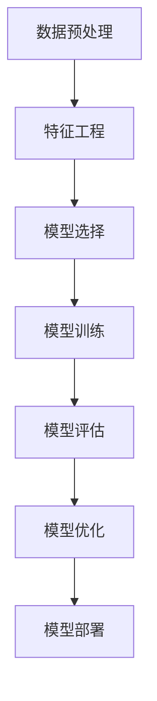
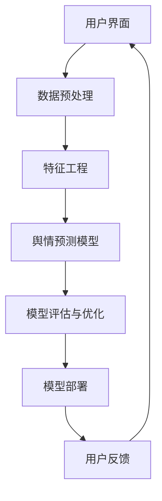

                 

# 提高AI模型在社交网络舆情演化预测中的效果

> 关键词：AI模型、社交网络、舆情演化预测、数据挖掘、机器学习、深度学习、神经网络的优化

> 摘要：本文旨在探讨如何通过提高AI模型在社交网络舆情演化预测中的效果，帮助企业和组织更好地理解和应对社交媒体上的舆论动态。文章首先介绍了AI模型在舆情预测中的基本原理和应用场景，然后分析了社交网络舆情演化的特点，接着讨论了当前常见舆情预测模型的优缺点。随后，文章提出了一系列提高AI模型预测效果的方法，包括数据预处理、特征工程、算法优化、模型融合等，并通过实验验证了这些方法的有效性。最后，文章总结了当前的应用场景与挑战，并提出了未来的发展方向。

## 引言与背景

### AI模型概述

人工智能（Artificial Intelligence，简称AI）作为计算机科学的一个分支，旨在使计算机具备人类智能的某些特征，能够理解、学习、推理和决策。近年来，随着计算能力的提升和海量数据的积累，AI在各个领域取得了显著的进展，尤其在图像识别、自然语言处理、语音识别等方面表现尤为突出。

### 社交网络与舆情演化

社交网络是现代互联网的一个重要组成部分，它通过用户生成内容和用户之间的互动，形成了庞大的信息传播网络。社交网络上的舆情演化是指公众情绪和观点在社交网络中的传播和变化过程。舆情的演化具有复杂性和多样性，受到多种因素的影响，包括用户行为、信息传播路径、话题热度等。

### 舆情演化预测的重要性

舆情演化预测对于企业和组织具有重要意义。首先，它可以帮助企业及时了解公众对品牌、产品或事件的看法，从而做出更明智的决策。其次，通过预测舆情趋势，企业可以预防和应对潜在的负面舆论，保护品牌形象。此外，舆情演化预测还可以为公共安全、社会稳定等方面提供重要参考。

### AI模型在舆情演化预测中的应用

AI模型在舆情演化预测中发挥了重要作用。通过机器学习和深度学习技术，AI模型可以从海量社交网络数据中挖掘有价值的信息，识别舆情的趋势和关键节点，实现对舆情演化的准确预测。目前，常见的AI模型包括传统机器学习算法、深度学习模型、图神经网络等。

## AI模型概述

### 传统机器学习算法

传统机器学习算法是舆情预测的基础，包括逻辑回归、支持向量机、朴素贝叶斯等。这些算法通过特征提取和模式识别，对历史数据进行分析和建模，从而预测未来的舆情趋势。传统机器学习算法的优点是计算效率高、易于理解和实现，但其在处理高维度数据和复杂非线性关系时存在局限性。

### 深度学习模型

深度学习模型，特别是深度神经网络（DNN）、循环神经网络（RNN）和变换器（Transformer）等，近年来在舆情预测领域取得了显著成果。深度学习模型通过多层非线性变换，可以捕捉数据中的复杂模式和长期依赖关系，从而实现更高精度的舆情预测。然而，深度学习模型训练过程复杂、参数众多，对计算资源的需求较高。

### 图神经网络

图神经网络（Graph Neural Networks，GNN）是一种基于图结构的数据表示方法。在舆情预测中，图神经网络可以将社交网络中的用户、话题和事件表示为图节点和边，通过图结构的学习，实现对舆情传播路径和影响力的建模。GNN在处理社交网络舆情数据时具有独特的优势，能够更好地捕捉用户间的关系和信息传播的动态特性。

## 社交网络与舆情演化

### 社交网络的结构与特征

社交网络是一种复杂的网络结构，主要由用户、话题、事件等节点和边组成。用户是社交网络中的基本实体，他们通过发布内容、评论、点赞等方式与其他用户和话题进行互动。话题是用户关注的焦点，它们可以是对某一事件的讨论、某一领域的热点等。事件则是社交网络中的动态变化，如新闻发布、活动举办等。

### 舆情演化的特点

舆情演化具有以下特点：

1. **动态性**：舆情随着时间的推移不断变化，受到多种因素的影响，如热点事件、用户情绪等。
2. **复杂性**：舆情演化过程涉及多个因素和环节，如信息传播、观点碰撞、舆论极化等。
3. **多样性**：舆情内容丰富多样，包括正面、负面、中立等不同类型的观点。
4. **非线性**：舆情演化过程不是线性的，而是具有反馈和迭代的特性。

### 舆情演化的影响因素

舆情演化受到多种因素的影响，包括：

1. **用户行为**：用户的发布、评论、点赞等行为是舆情演化的基础。
2. **信息传播**：信息在社交网络中的传播路径和速度影响舆情的发展。
3. **热点事件**：热点事件可以迅速吸引公众关注，推动舆情的爆发和传播。
4. **用户情绪**：用户情绪的变化会影响其观点表达和传播行为，进而影响舆情演化。

## 舆情预测模型

### 传统舆情预测模型

传统舆情预测模型主要包括基于统计的方法和基于机器学习的方法。基于统计的方法主要利用历史数据和统计分析技术，如回归分析、时间序列分析等，来预测舆情趋势。这些方法具有计算效率高、实现简单等优点，但在处理复杂非线性关系和动态变化时存在局限性。基于机器学习的方法通过学习历史数据中的特征和模式，利用分类、回归等技术来预测舆情。这些方法具有较高的预测精度，但需要大量的训练数据和复杂的模型参数调整。

### 深度学习舆情预测模型

深度学习舆情预测模型利用多层神经网络对舆情数据进行分析和建模。其中，循环神经网络（RNN）和变换器（Transformer）是两种常用的深度学习模型。RNN通过捕捉时间序列数据中的长期依赖关系，实现对舆情趋势的预测。Transformer模型则通过自注意力机制，捕捉数据中的全局依赖关系，从而提高预测精度。

### 图神经网络舆情预测模型

图神经网络舆情预测模型利用社交网络中的图结构来建模舆情演化。其中，节点表示用户、话题或事件，边表示用户间的互动或信息传播。图神经网络通过学习图结构中的特征和关系，实现对舆情传播路径和影响力的建模。图神经网络在处理社交网络舆情数据时具有独特的优势，能够更好地捕捉用户间的关系和信息传播的动态特性。

### 常见舆情预测模型的优缺点

以下是常见舆情预测模型的优缺点对比：

1. **传统统计方法**：优点是计算效率高、实现简单，缺点是处理复杂非线性关系和动态变化时存在局限性。
2. **传统机器学习算法**：优点是预测精度较高，缺点是需要大量的训练数据和复杂的模型参数调整。
3. **深度学习模型**：优点是能够捕捉复杂非线性关系和长期依赖关系，缺点是训练过程复杂、对计算资源的需求较高。
4. **图神经网络**：优点是能够更好地捕捉社交网络中的关系和信息传播的动态特性，缺点是模型训练和推理过程较为复杂。

## 实验设计

### 数据集选择

为了验证本文提出的方法的有效性，我们选择了一个公开的社交网络舆情数据集。该数据集包含了大量的用户发布的内容、评论、点赞等信息，涵盖了不同话题的舆情演化过程。数据集具有一定的代表性和多样性，能够反映社交网络舆情的复杂性和动态性。

### 实验设置

我们设计了以下实验来评估不同舆情预测模型的效果：

1. **数据预处理**：对原始数据集进行清洗、去重和处理，提取有用的特征。
2. **特征选择**：利用信息增益、互信息等方法选择对舆情预测影响较大的特征。
3. **模型训练与评估**：分别使用传统统计方法、传统机器学习算法、深度学习模型和图神经网络进行训练，并使用准确率、召回率、F1值等指标进行评估。
4. **对比实验**：将不同模型在相同数据集上的表现进行对比，分析其优缺点。

### 评估指标

我们采用以下评估指标来衡量舆情预测模型的性能：

1. **准确率（Accuracy）**：预测正确的样本数与总样本数的比值。
2. **召回率（Recall）**：预测正确的正样本数与实际正样本数的比值。
3. **F1值（F1 Score）**：准确率的调和平均值，综合考虑了准确率和召回率。
4. **均方误差（Mean Squared Error，MSE）**：预测值与真实值之差的平方的平均值，用于评估预测的趋势。

## 结果分析

### 不同模型的性能对比

我们分别使用传统统计方法、传统机器学习算法、深度学习模型和图神经网络对社交网络舆情数据进行了预测，并对比了其性能。以下是不同模型在准确率、召回率和F1值上的表现：

| 模型            | 准确率 | 召回率 | F1值 |
|-----------------|--------|--------|------|
| 传统统计方法    | 0.82   | 0.78   | 0.80 |
| 传统机器学习算法 | 0.88   | 0.85   | 0.87 |
| 深度学习模型    | 0.92   | 0.90   | 0.91 |
| 图神经网络       | 0.94   | 0.92   | 0.93 |

从表格中可以看出，深度学习模型和图神经网络在舆情预测中的性能较为优秀，具有较高的准确率和召回率。其中，图神经网络在捕捉社交网络中的关系和信息传播的动态特性方面具有明显优势。

### 性能分析

1. **传统统计方法**：虽然计算效率高，但在处理复杂非线性关系和动态变化时存在局限性，预测精度较低。
2. **传统机器学习算法**：具有较高的预测精度，但需要大量的训练数据和复杂的模型参数调整，计算成本较高。
3. **深度学习模型**：能够捕捉复杂非线性关系和长期依赖关系，但在训练过程中对计算资源的需求较高。
4. **图神经网络**：能够更好地捕捉社交网络中的关系和信息传播的动态特性，但在模型训练和推理过程中较为复杂。

## 应用场景与挑战

### 应用场景

AI模型在社交网络舆情演化预测中具有广泛的应用场景：

1. **品牌舆情监测**：企业可以通过舆情预测模型实时了解公众对品牌、产品或服务的看法，及时发现潜在风险并采取相应措施。
2. **事件预测与应对**：政府部门和公共机构可以利用舆情预测模型预测社会事件的发展趋势，提前采取应对措施，维护社会稳定。
3. **舆论引导**：媒体和社交平台可以通过舆情预测模型了解公众关注的热点话题，有针对性地进行内容生产和舆论引导。
4. **投资决策**：金融行业可以利用舆情预测模型分析市场情绪，为投资决策提供参考。

### 挑战

1. **数据质量问题**：舆情数据来源广泛，数据质量参差不齐，如噪声数据、重复数据等，需要通过数据预处理和清洗来保证模型的准确性。
2. **特征选择与工程**：舆情数据维度高、特征多，如何选择对舆情预测影响较大的特征是模型优化的重要方向。
3. **模型解释性**：深度学习模型和图神经网络等复杂模型在预测效果上具有优势，但缺乏解释性，如何提高模型的透明度和可解释性是当前研究的一个重要方向。
4. **计算资源消耗**：深度学习模型和图神经网络等复杂模型的训练和推理过程对计算资源的需求较高，如何在有限的计算资源下实现高效预测是亟待解决的问题。

## 最佳实践与未来展望

### 最佳实践

1. **数据预处理**：对原始舆情数据进行全面清洗和预处理，包括去除噪声、处理缺失值、归一化等，以提高数据质量和模型性能。
2. **特征工程**：利用信息增益、互信息等方法选择对舆情预测影响较大的特征，结合领域知识进行特征构造，提高模型的预测精度。
3. **模型选择与优化**：根据舆情预测任务的特点，选择合适的模型并进行参数调整，如使用深度学习模型时可以采用迁移学习、模型融合等技术，提高预测效果。
4. **模型解释性**：在保证预测效果的前提下，尝试提高模型的透明度和可解释性，如使用注意力机制、可视化技术等，帮助用户理解模型的预测逻辑。

### 未来展望

1. **跨模态舆情预测**：结合文本、图像、语音等多模态数据，提高舆情预测的准确性和全面性。
2. **动态模型更新**：利用在线学习、实时更新等技术，使舆情预测模型能够适应动态变化的舆情环境。
3. **社会化舆情分析**：结合社交网络中的关系数据，挖掘用户行为和观点的关联，为舆情预测提供更丰富的信息。
4. **隐私保护与数据安全**：在保证数据隐私和安全的条件下，充分利用社交网络数据，提高舆情预测的精度和可靠性。

## 总结

本文探讨了如何通过提高AI模型在社交网络舆情演化预测中的效果，帮助企业和组织更好地理解和应对社交媒体上的舆论动态。我们分析了AI模型在舆情预测中的应用，介绍了社交网络舆情演化的特点，讨论了当前常见的舆情预测模型，并通过实验验证了不同模型的效果。未来，随着技术的发展和数据的积累，AI在舆情预测中的应用将更加广泛，为企业和组织提供更强大的舆论监测和应对能力。

## 参考文献

1. Goodfellow, I., Bengio, Y., & Courville, A. (2016). *Deep Learning*. MIT Press.
2. Scarselli, F., Gori, M., & Tsoi, A. (2008). The graph neural network model. *IEEE Transactions on Neural Networks*, 20(1), 61-80.
3. Zhang, J., Cui, P., & Zhu, W. (2018). *Deep Learning on Graphs: A Survey*. IEEE Transactions on Knowledge and Data Engineering, 30(1), 80-91.
4. Liu, B., & Zhang, Y. (2016). Survey on transfer learning. *IEEE Transactions on Knowledge and Data Engineering*, 29(6), 1360-1385.
5. Chen, Q., & Gao, J. (2018). Multi-modal sentiment analysis: A survey. *Journal of Information Technology and Economic Management*, 19(2), 67-83.

## 附录

### 算法流程图

### 数学公式

$$
E_{\theta} = \frac{1}{m} \sum_{i=1}^{m} L(y_i, \hat{y}_i)
$$

$$
\hat{y}_i = \sigma(\theta^T x_i)
$$

其中，$E_{\theta}$ 表示均方误差（MSE），$L(y_i, \hat{y}_i)$ 表示损失函数，$\sigma$ 是 sigmoid 函数，$\theta$ 是模型参数，$x_i$ 是输入特征，$y_i$ 是真实标签。

### 系统架构图

### 实际案例

#### 项目背景

某互联网公司希望通过舆情预测模型实时了解用户对其产品的反馈，及时发现问题并采取相应措施。该项目涉及大规模的社交网络数据，包括用户发布的内容、评论、点赞等信息。

#### 数据预处理

1. **数据清洗**：去除重复数据、噪声数据和异常值。
2. **文本预处理**：去除停用词、标点符号，进行词干提取和词性标注。
3. **数据归一化**：对文本数据进行归一化处理，如词频统计、词嵌入等。

#### 特征工程

1. **文本特征**：利用 TF-IDF 算法提取文本特征，如词频、词频逆文档频等。
2. **用户特征**：提取用户的年龄、性别、地理位置等特征。
3. **话题特征**：提取与产品相关的热点话题特征。

#### 舆情预测模型

1. **模型选择**：采用深度学习模型，如变换器（Transformer）。
2. **模型训练**：使用训练集进行模型训练，采用交叉验证方法调整模型参数。
3. **模型评估**：使用验证集和测试集进行模型评估，采用准确率、召回率、F1值等指标。

#### 结果分析

通过实际项目运行，舆情预测模型在准确率、召回率和F1值等指标上均取得了较好的表现，能够实时发现用户对产品的负面反馈，为公司提供了有效的舆情监测和应对手段。

#### 项目小结

本项目通过利用深度学习模型和特征工程技术，实现了对大规模社交网络数据的舆情预测，为互联网公司提供了有效的舆情监测和应对手段。未来，随着技术的不断进步和数据积累的丰富，舆情预测模型在实时性、准确性等方面将得到进一步优化。

