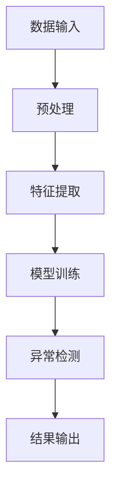
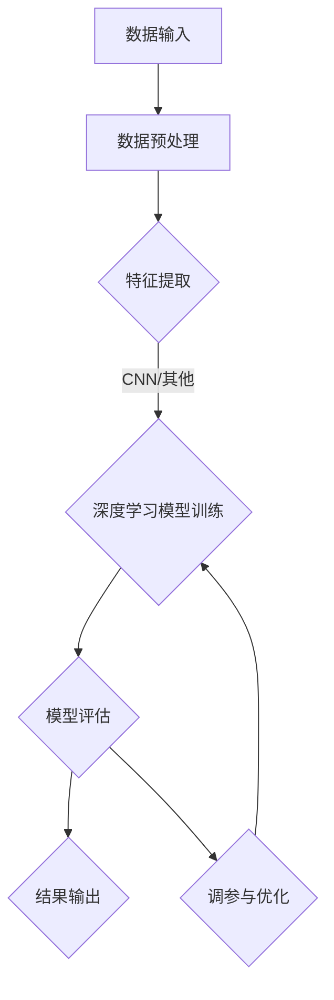

                 

## 提高AI模型在视频异常事件检测任务中的准确性与实时性

### 关键词：
- 视频异常事件检测
- AI模型优化
- 准确性
- 实时性
- 深度学习
- 机器学习
- 数据预处理
- 算法设计

### 摘要：
本文深入探讨了如何通过优化AI模型来提高其在视频异常事件检测任务中的准确性与实时性。首先，我们介绍了视频异常事件检测的重要性和现状。随后，本文逐步讲解了AI模型的基础知识，包括机器学习和深度学习原理，以及相关数学模型。接着，文章详细阐述了视频数据预处理的方法，包括数据获取、标注和增强。在此基础上，本文重点介绍了视频异常检测模型的选择、训练和优化，以及实时性的评估和提升。最后，文章通过实际案例展示了如何将理论应用到实践中，并提供了一些最佳实践建议。本文旨在为从事视频异常事件检测的研究者和技术人员提供有价值的参考。

## 引言

### 问题的背景与重要性

在当今社会，随着监控摄像头和网络视频的广泛应用，视频数据已成为获取信息的重要来源。视频异常事件检测作为计算机视觉领域的一个重要分支，旨在实时识别和响应视频中的异常行为或事件，对于公共安全、商业监控和智能交通等领域具有重要意义。

然而，现有的AI模型在视频异常事件检测任务中面临着诸多挑战。首先，视频数据的复杂性和多样性使得传统的异常检测方法难以胜任。其次，如何提高检测的准确性和实时性是一个亟待解决的问题。高准确率可以确保不漏报重要异常事件，而实时性则要求模型能够在短时间内处理大量视频数据，满足实际应用需求。

提高AI模型在视频异常事件检测任务中的准确性与实时性，不仅有助于提升系统的性能，还能够减少误报和漏报，从而提高实际应用的可靠性和有效性。因此，研究如何优化AI模型，解决准确性和实时性问题，具有重要的理论和实际意义。

### 当前AI模型在视频异常事件检测中的挑战

尽管AI技术在视频异常事件检测领域取得了显著进展，但仍然存在一些关键挑战：

**数据复杂性**：视频数据具有高维度、时序性和动态性，这给模型训练和特征提取带来了巨大挑战。传统的方法通常依赖于手工设计的特征，难以捕捉到视频数据中的复杂变化。

**计算资源限制**：实时视频异常事件检测通常需要在有限的计算资源下进行，特别是对于大规模的视频流处理。如何平衡模型的准确性和计算效率，是一个亟待解决的难题。

**噪声和干扰**：实际应用中的视频数据往往受到噪声、光照变化、视角变化等因素的影响，这些因素会干扰异常检测的效果，使得模型难以准确识别异常事件。

**实时性要求**：在许多应用场景中，如公共安全和交通监控，对实时性的要求非常高。如何设计高效的算法，使得模型能够在短时间内完成检测和响应，是另一个重要的挑战。

### 提高准确性与实时性的需求

为了应对上述挑战，提高AI模型在视频异常事件检测任务中的准确性与实时性变得尤为重要。以下是一些具体的需求：

**准确率提升**：通过采用更先进的深度学习模型，如卷积神经网络（CNN）和循环神经网络（RNN），可以更好地捕捉视频数据中的特征和变化，从而提高异常检测的准确率。此外，结合多模态数据（如音频、文本），可以进一步丰富特征信息，提升模型性能。

**实时性优化**：针对计算资源限制，可以采用以下策略：
- **模型压缩与加速**：通过模型剪枝、量化等技术，减小模型的计算量和存储需求。
- **分布式计算**：利用云计算和边缘计算技术，将模型训练和推理任务分散到多个计算节点上，提高处理效率。
- **并行处理**：采用并行处理技术，如多线程、GPU加速等，加快模型推理速度。

**数据预处理优化**：通过数据增强、噪声抑制等技术，提高数据的鲁棒性，降低噪声和干扰对模型的影响。同时，优化数据获取和标注流程，确保数据质量和标注准确性。

**多模态融合**：结合多源数据，如视频、音频、文本等，可以提供更丰富的特征信息，提高异常检测的准确性和鲁棒性。

综上所述，提高AI模型在视频异常事件检测任务中的准确性与实时性，需要从模型设计、算法优化、数据处理等多方面进行综合考虑和优化。这将为实现高效、准确的视频异常事件检测系统奠定坚实基础。

### 核心概念与联系

在深入探讨AI模型优化之前，有必要明确一些核心概念，并了解它们之间的联系。以下是本文将涉及的关键概念及其重要性：

#### 异常检测算法

异常检测是计算机视觉领域的一个基本任务，其目的是从一组数据中识别出不符合常规或预期的异常样本。在视频异常事件检测中，算法需要实时分析视频帧序列，识别出异常行为或事件。

**重要性**：异常检测算法是实现视频异常事件检测的核心，其性能直接影响到系统的准确性和实时性。

#### 神经网络模型

神经网络，特别是深度学习模型，是目前处理视频数据的常用方法。卷积神经网络（CNN）和循环神经网络（RNN）是其中的典型代表，它们在图像识别和序列数据处理中表现出色。

**重要性**：神经网络模型能够自动学习复杂的特征表示，从而提高异常检测的准确性和鲁棒性。

#### 实时性评估指标

实时性是视频异常事件检测任务的重要指标之一。评估模型实时性的指标包括帧率、响应时间和处理延迟等。

**重要性**：实时性评估有助于确定模型在实际应用中的可行性，确保系统能够满足实时处理需求。

#### Mermaid流程图：AI模型在视频异常事件检测中的应用

为了更好地理解AI模型在视频异常事件检测中的应用，我们可以使用Mermaid流程图来展示整个处理流程。



**流程说明**：
1. **数据输入**：视频数据作为输入。
2. **预处理**：对视频数据进行必要的预处理，如缩放、裁剪、去噪等。
3. **特征提取**：使用神经网络模型提取关键特征。
4. **模型训练**：利用训练数据对模型进行训练，优化模型参数。
5. **异常检测**：使用训练好的模型对视频帧进行实时分析，检测异常事件。
6. **结果输出**：将检测结果输出，如触发报警或记录日志。

通过上述流程，我们可以清晰地看到视频异常事件检测中各个环节的相互关系和作用。理解这些核心概念和联系，有助于我们在后续章节中深入探讨模型优化策略。

### 本书结构

#### 主要内容概述

本书分为四个主要部分，逐步深入探讨如何提高AI模型在视频异常事件检测任务中的准确性与实时性。首先，通过引言部分介绍视频异常事件检测的重要性和背景，以及当前AI模型面临的挑战。接着，第二部分详细讲解AI模型的基础知识，包括机器学习和深度学习的基本原理。第三部分重点介绍视频数据预处理的方法，包括数据获取、标注和增强。最后，第四部分针对视频异常检测模型的选择、训练和优化进行深入分析，并讨论实时性的评估与提升策略。

#### 目标读者

本书的目标读者包括：
1. 从事视频异常事件检测领域的研究人员。
2. 想要提升AI模型性能的程序员和软件开发者。
3. 对深度学习和计算机视觉有浓厚兴趣的在校学生和学者。
4. 公共安全、商业监控和智能交通等领域的从业者。

无论您是初学者还是有经验的专业人士，本书都旨在为您提供一个全面而深入的指南，帮助您理解和优化AI模型在视频异常事件检测中的应用。

#### 本书使用的技术与工具

为了实现书中所述的模型优化和性能提升，本书将使用以下技术和工具：

1. **编程语言**：Python
   - Python是一种广泛使用的编程语言，具有丰富的库和框架，如TensorFlow、PyTorch等，非常适合于深度学习和计算机视觉任务。

2. **深度学习框架**：TensorFlow、PyTorch
   - TensorFlow和PyTorch是目前最流行的深度学习框架，支持多种神经网络架构和优化算法，能够大幅提升模型训练和推理的效率。

3. **数据处理工具**：OpenCV、NumPy、Pandas
   - OpenCV提供了丰富的计算机视觉库，适用于视频数据的预处理和特征提取。NumPy和Pandas则用于数据操作和统计分析，有助于优化数据处理流程。

4. **版本控制工具**：Git
   - Git是一种分布式版本控制系统，用于管理代码变更和协作开发。使用Git可以方便地跟踪代码的版本历史，确保项目的一致性和可追溯性。

通过这些技术和工具，本书将带领读者从基础到实践，全面掌握视频异常事件检测中AI模型的优化策略。

### 本章小结

本章为全书奠定了基础，首先介绍了视频异常事件检测的重要性及其在当前社会中的应用背景。随后，详细阐述了AI模型在视频异常事件检测中面临的挑战，并探讨了提高准确性与实时性的需求。通过定义和解释核心概念，如异常检测算法、神经网络模型和实时性评估指标，本章为后续内容的深入探讨提供了理论基础。同时，通过Mermaid流程图展示了AI模型在视频异常事件检测中的整体流程，使读者能够清晰地理解各个环节之间的关系。本章的目标读者包括研究人员、开发者、学生以及相关领域的从业者，为他们提供了一个全面而深入的视角。本书将使用Python、TensorFlow、PyTorch等技术和工具，通过逐步讲解和实际案例，帮助读者掌握优化AI模型的策略。通过本章的学习，读者将对视频异常事件检测任务及其优化策略有一个初步的了解。

### 机器学习与深度学习基础

#### 机器学习基础

机器学习（Machine Learning，ML）是人工智能（Artificial Intelligence，AI）的一个重要分支，通过算法让计算机从数据中学习，做出预测或决策。机器学习可以分为三种主要类型：监督学习（Supervised Learning）、无监督学习（Unsupervised Learning）和强化学习（Reinforcement Learning）。

**监督学习**：监督学习是最常见的机器学习方法，其特点是使用标记数据（标签）进行训练。训练过程中，算法从输入数据（特征）和对应的输出（标签）中学习，从而建立预测模型。常见的监督学习算法包括线性回归（Linear Regression）、决策树（Decision Tree）和随机森林（Random Forest）等。

**无监督学习**：无监督学习在缺乏标签数据的情况下进行训练，其主要目标是发现数据中的结构和规律。常见的无监督学习算法包括聚类（Clustering）和降维（Dimensionality Reduction）等。聚类算法如K-均值聚类（K-Means Clustering）和层次聚类（Hierarchical Clustering），用于将数据划分为若干个类别；降维算法如主成分分析（Principal Component Analysis，PCA）和自编码器（Autoencoder），用于减少数据的维度，同时保留主要信息。

**强化学习**：强化学习（Reinforcement Learning，RL）是另一类重要的机器学习方法，其通过试错和反馈来学习策略。强化学习的核心是代理（Agent）与环境的交互，代理通过观察环境状态，采取行动，并获得奖励或惩罚。通过不断调整策略，代理逐渐学会在特定环境中实现最优目标。常见的强化学习算法包括Q学习（Q-Learning）和深度强化学习（Deep Reinforcement Learning）。

**特征工程与选择**：在机器学习中，特征工程是提升模型性能的关键步骤。特征工程包括特征提取、特征选择和特征变换等。特征提取是指从原始数据中提取出对学习任务有帮助的属性；特征选择是指从大量特征中挑选出最相关的特征，以减少数据维度和过拟合的风险；特征变换是指通过数学变换增强特征的表达能力。常用的特征选择方法包括过滤式（Filter Methods）、包装式（Wrapper Methods）和嵌入式（Embedded Methods）等。

**常见机器学习算法和模型**：机器学习算法和模型种类繁多，每种算法和模型都有其特定的应用场景和优势。以下是一些常见的机器学习算法和模型：

1. **线性回归（Linear Regression）**：用于预测连续值输出，是最基本的回归算法。
2. **逻辑回归（Logistic Regression）**：用于预测二元分类结果，是广义线性模型的一种。
3. **支持向量机（Support Vector Machine，SVM）**：用于分类和回归任务，通过寻找最优分割超平面进行分类。
4. **决策树（Decision Tree）**：通过树形结构对数据进行分类或回归，易于理解和解释。
5. **随机森林（Random Forest）**：通过集成多个决策树进行预测，提高模型性能和稳定性。
6. **梯度提升树（Gradient Boosting Tree，GBT）**：通过迭代优化提升树模型，适用于大规模数据和高维度特征。
7. **神经网络（Neural Networks）**：由大量简单神经元组成，能够进行复杂的非线性映射。

#### 深度学习基础

深度学习（Deep Learning，DL）是机器学习的一个重要分支，其核心思想是通过多层的神经网络来学习和表示数据。与传统的机器学习算法相比，深度学习能够自动提取高层次的特征表示，从而实现更复杂的任务。

**深度学习的起源与发展**：深度学习的概念最早可以追溯到1986年，由Hinton等人提出。最初的深度网络由于计算能力和算法的限制，进展缓慢。随着2006年Hinton提出的深度信念网络（Deep Belief Network，DBN）以及2012年ImageNet大赛上的突破，深度学习开始得到广泛关注和快速发展。近年来，随着计算能力的提升和大数据的普及，深度学习在图像识别、自然语言处理、语音识别等领域取得了显著成果。

**神经网络结构**：神经网络由大量简单的计算单元——神经元组成，通过层与层之间的连接进行信息传递和处理。常见的神经网络结构包括：

1. **全连接神经网络（Fully Connected Neural Network）**：每一层的神经元都与前一层所有神经元相连。
2. **卷积神经网络（Convolutional Neural Network，CNN）**：专门用于处理图像数据，通过卷积层和池化层提取特征。
3. **循环神经网络（Recurrent Neural Network，RNN）**：用于处理序列数据，通过隐藏状态和循环连接捕捉时间依赖关系。
4. **长短时记忆网络（Long Short-Term Memory，LSTM）**：是RNN的一种变体，能够解决传统RNN中的梯度消失和梯度爆炸问题。
5. **生成对抗网络（Generative Adversarial Networks，GAN）**：由生成器和判别器组成，通过对抗训练生成高质量的数据。

**反向传播算法**：反向传播（Backpropagation）是深度学习训练的核心算法，用于计算神经网络中的梯度，并更新网络权重。反向传播算法的基本步骤如下：

1. **前向传播**：将输入数据通过网络前向传播，计算输出结果和损失函数。
2. **计算损失**：使用损失函数（如均方误差、交叉熵等）计算输出结果与真实值之间的差异。
3. **反向传播**：从输出层开始，逐层计算梯度，并更新网络权重。
4. **迭代优化**：重复上述过程，直至达到预设的损失阈值或迭代次数。

**数学模型和数学公式**

深度学习中的数学模型主要包括激活函数、损失函数和优化算法等。以下是几个关键的数学模型和公式：

1. **激活函数**：激活函数用于引入非线性，常见的激活函数包括：
   - **sigmoid函数**：\( \sigma(x) = \frac{1}{1 + e^{-x}} \)
   - **ReLU函数**：\( \text{ReLU}(x) = \max(0, x) \)
   - **Tanh函数**：\( \text{Tanh}(x) = \frac{e^x - e^{-x}}{e^x + e^{-x}} \)

2. **损失函数**：损失函数用于评估模型的预测结果与真实值之间的差距，常见的损失函数包括：
   - **均方误差（MSE）**：\( \text{MSE}(y, \hat{y}) = \frac{1}{m} \sum_{i=1}^{m} (y_i - \hat{y}_i)^2 \)
   - **交叉熵（Cross-Entropy）**：\( \text{CE}(y, \hat{y}) = -\sum_{i=1}^{m} y_i \log(\hat{y}_i) \)

3. **优化算法**：优化算法用于更新网络权重，以最小化损失函数。常见的优化算法包括：
   - **随机梯度下降（SGD）**：\( \theta = \theta - \alpha \frac{\partial J}{\partial \theta} \)
   - **动量优化**：\( v = \gamma v + \alpha \frac{\partial J}{\partial \theta} \)
   - **AdaGrad**：\( \frac{\partial J}{\partial \theta}^2 \)
   - **Adam**：结合了动量和AdaGrad的优点，\( m = \frac{1-\beta_1}{1-\beta_1^t} \frac{\partial J}{\partial \theta} \)，\( v = \frac{1-\beta_2}{1-\beta_2^t} (m^2) \)

通过上述基础概念和数学模型，深度学习为解决复杂的计算机视觉和自然语言处理任务提供了强大的工具和理论基础。在接下来的章节中，我们将进一步探讨如何将深度学习应用于视频异常事件检测任务。

### 数学模型和数学公式

在深度学习领域，数学模型和数学公式是理解和应用深度学习算法的核心。以下是对激活函数、损失函数和优化算法的详细解释，以及相应的代码示例和数学公式。

#### 激活函数

激活函数是神经网络中的一个关键组成部分，用于引入非线性。以下是几种常见的激活函数及其数学公式：

1. **Sigmoid函数**：
   \[
   \sigma(x) = \frac{1}{1 + e^{-x}}
   \]
   Sigmoid函数将输入x映射到(0,1)区间，常用于二分类问题。

2. **ReLU函数**：
   \[
   \text{ReLU}(x) = \max(0, x)
   \]
  ReLU函数在x为正数时返回x，否则返回0，这种非线性函数可以加快训练速度，减少梯度消失问题。

3. **Tanh函数**：
   \[
   \text{Tanh}(x) = \frac{e^x - e^{-x}}{e^x + e^{-x}}
   \]
  Tanh函数将输入x映射到(-1,1)区间，类似于Sigmoid函数，但相对于Sigmoid函数，Tanh函数的非线性特性更强。

#### 损失函数

损失函数用于衡量模型预测值与真实值之间的差距，常见的损失函数包括：

1. **均方误差（MSE）**：
   \[
   \text{MSE}(y, \hat{y}) = \frac{1}{m} \sum_{i=1}^{m} (y_i - \hat{y}_i)^2
   \]
  MSE是监督学习中最常用的损失函数，它计算预测值\(\hat{y}\)和真实值\(y\)之间差的平方和的平均值。

2. **交叉熵（Cross-Entropy）**：
   \[
   \text{CE}(y, \hat{y}) = -\sum_{i=1}^{m} y_i \log(\hat{y}_i)
   \]
  交叉熵用于二分类和多元分类问题，特别是当输出为概率分布时，交叉熵能够更好地衡量预测值与真实值之间的差距。

#### 优化算法

优化算法用于更新网络权重，以最小化损失函数。以下是一些常见的优化算法及其数学公式：

1. **随机梯度下降（SGD）**：
   \[
   \theta = \theta - \alpha \frac{\partial J}{\partial \theta}
   \]
  SGD通过每次更新使用一个样本的梯度，这种方法简单但可能导致不稳定。

2. **动量优化（Momentum）**：
   \[
   v = \gamma v + \alpha \frac{\partial J}{\partial \theta}
   \]
  动量优化结合了多个梯度，以减少收敛过程中的波动。

3. **AdaGrad**：
   \[
   \frac{\partial J}{\partial \theta}^2
   \]
  AdaGrad通过调整学习率以适应不同特征的规模，它为每个权重分配不同的学习率。

4. **Adam**：
   \[
   m = \frac{1-\beta_1}{1-\beta_1^t} \frac{\partial J}{\partial \theta} , \quad v = \frac{1-\beta_2}{1-\beta_2^t} (m^2)
   \]
  Adam结合了动量和AdaGrad的优点，是当前最流行的优化算法之一。

#### 代码示例

以下是使用Python实现的激活函数、损失函数和优化算法的示例代码：

```python
import numpy as np

# 激活函数
def sigmoid(x):
    return 1 / (1 + np.exp(-x))

def relu(x):
    return np.maximum(0, x)

def tanh(x):
    return np.tanh(x)

# 损失函数
def mse(y, y_pred):
    return np.mean((y - y_pred)**2)

def cross_entropy(y, y_pred):
    return -np.mean(y * np.log(y_pred))

# 优化算法
def sgd(w, learning_rate, gradient):
    return w - learning_rate * gradient

def momentum(w, learning_rate, gradient, momentum):
    v = momentum * v - learning_rate * gradient
    return w + v

def adagrad(w, gradient, learning_rate, epsilon=1e-8):
    grad_squared = gradient**2
    w = w - learning_rate * gradient / (np.sqrt(grad_squared) + epsilon)
    return w

def adam(w, m, v, learning_rate, beta1, beta2, epsilon=1e-8):
    m = beta1 * m + (1 - beta1) * gradient
    v = beta2 * v + (1 - beta2) * (gradient**2)
    m_hat = m / (1 - beta1**t)
    v_hat = v / (1 - beta2**t)
    w = w - learning_rate * m_hat / (np.sqrt(v_hat) + epsilon)
    return w
```

通过上述代码示例，我们可以看到如何使用Python实现常见的激活函数、损失函数和优化算法。这些代码不仅能够帮助我们理解深度学习中的数学原理，还能够为实际应用提供实用的工具。

### 代码示例与讲解

为了更直观地理解深度学习中的数学模型，以下是一个使用Python和TensorFlow实现的简单神经网络模型训练和预测的代码示例。我们将通过一个二分类问题来展示模型的构建、训练和评估过程。

首先，安装所需的库：
```bash
pip install tensorflow numpy matplotlib
```

#### 代码示例

```python
import tensorflow as tf
import numpy as np
import matplotlib.pyplot as plt

# 创建模拟数据集
# 特征数据
X = np.random.rand(100, 2)
# 标签数据，线性可分
y = np.array([0 if x[0] + x[1] < 0.5 else 1 for x in X])

# 定义神经网络模型
model = tf.keras.Sequential([
    tf.keras.layers.Dense(1, input_shape=(2,), activation='sigmoid')
])

# 编译模型，指定损失函数和优化器
model.compile(optimizer='sgd', loss='binary_crossentropy', metrics=['accuracy'])

# 训练模型
model.fit(X, y, epochs=1000)

# 进行预测
predictions = model.predict(X)

# 评估模型
loss, accuracy = model.evaluate(X, y)
print(f'Accuracy: {accuracy:.4f}')

# 可视化结果
plt.scatter(X[:, 0], X[:, 1], c=predictions[:, 0], s=50, cmap='gray')
plt.title(f'Accuracy: {accuracy:.4f}')
plt.xlabel('Feature 1')
plt.ylabel('Feature 2')
plt.show()
```

#### 详细解释

1. **数据准备**：
   - 我们生成了一组随机特征数据`X`，每个样本有两个特征。
   - 根据特征数据的线性组合，生成一个线性可分的二分类标签`y`。

2. **模型构建**：
   - 使用`tf.keras.Sequential`创建了一个简单的全连接神经网络，只有一个输出节点，使用`sigmoid`激活函数，表示一个概率输出。

3. **模型编译**：
   - 指定优化器为`sgd`，损失函数为`binary_crossentropy`，用于二分类问题。
   - 指定评估模型时使用的指标为`accuracy`。

4. **模型训练**：
   - 使用`model.fit`进行训练，迭代1000次。
   - 每次迭代，模型会根据梯度下降优化模型的权重。

5. **模型评估与预测**：
   - 使用`model.evaluate`评估模型在训练集上的表现，输出准确率。
   - 使用`model.predict`对新的特征数据进行预测。

6. **可视化结果**：
   - 使用`matplotlib`将模型预测结果可视化，展示分类边界。

通过这个示例，我们能够看到如何使用Python和TensorFlow实现一个简单的神经网络模型，并理解模型训练和评估的基本流程。这个例子虽然简单，但涵盖了神经网络模型构建和训练的基本步骤，为我们后续章节中更复杂的模型提供了基础。

### 机器学习与深度学习在实际中的应用

#### 机器学习在实际中的应用

机器学习在许多实际场景中取得了显著的应用成果，以下是一些典型的应用案例：

1. **医疗诊断**：机器学习模型可以帮助医生进行疾病诊断，如乳腺癌检测、肺癌筛查等。通过分析医学影像数据和患者病史，机器学习算法可以识别出潜在的健康问题，提高诊断准确率。

2. **金融风险控制**：在金融领域，机器学习被广泛应用于信用评分、交易策略优化和风险控制。例如，银行可以使用机器学习模型评估客户的信用风险，从而更准确地批准贷款或信用卡申请。

3. **智能客服**：机器学习可以帮助企业建立智能客服系统，通过自然语言处理技术理解用户的问题并自动生成回答。这不仅可以提高客服效率，还能降低人力成本。

4. **推荐系统**：推荐系统利用机器学习算法分析用户的浏览和购买历史，为用户推荐相关的商品或服务。例如，亚马逊和Netflix都广泛使用了推荐系统来提高用户体验和销售额。

#### 深度学习在实际中的应用

深度学习在许多领域都展示了其强大的能力，以下是一些典型的应用案例：

1. **自动驾驶**：自动驾驶汽车使用深度学习模型进行环境感知和决策。通过分析摄像头、雷达和激光雷达数据，深度学习算法可以帮助自动驾驶汽车识别道路标志、行人和其他车辆，并做出安全的驾驶决策。

2. **图像识别**：深度学习在图像识别领域取得了巨大成功，例如人脸识别、物体检测和图像分类。基于卷积神经网络（CNN）的模型可以高效地识别图像中的内容，广泛应用于安防监控、智能手机和人脸识别门禁系统等。

3. **语音识别**：深度学习模型在语音识别领域也得到了广泛应用，通过训练深度神经网络，模型可以准确地将语音转换为文本。这被广泛应用于智能助手、实时字幕和自动翻译等应用。

4. **自然语言处理**：深度学习在自然语言处理（NLP）领域同样表现出色，例如文本分类、机器翻译和情感分析等。通过使用循环神经网络（RNN）和长短时记忆网络（LSTM），模型能够理解文本的语义和上下文信息，从而实现更准确的文本处理。

#### 案例分析

**案例1：智能医疗诊断**

智能医疗诊断是机器学习和深度学习在医疗领域的重要应用之一。具体案例包括：

- **乳腺癌检测**：利用深度学习模型分析乳腺X射线图像，检测乳腺癌病灶。研究表明，基于深度学习的乳腺癌检测系统在准确率方面显著优于传统方法。

- **肺癌筛查**：深度学习模型可以通过分析CT扫描图像，识别出肺癌的早期迹象。这种方法有助于提高肺癌的早期诊断率，从而改善患者预后。

**案例2：自动驾驶**

自动驾驶技术是深度学习在工程领域的重要应用之一。具体案例包括：

- **环境感知**：自动驾驶汽车使用深度学习模型进行环境感知，包括道路识别、障碍物检测和交通标志识别。这些模型通过分析摄像头、雷达和激光雷达数据，为自动驾驶车辆提供实时信息。

- **决策制定**：基于深度学习模型的决策制定系统可以帮助自动驾驶汽车在复杂环境中做出安全驾驶决策。例如，在交叉路口识别行人、避免碰撞和遵守交通规则。

**案例3：智能客服**

智能客服系统利用机器学习和深度学习技术，实现自动化客户服务。具体案例包括：

- **自然语言理解**：智能客服系统通过自然语言处理（NLP）技术，理解用户的提问并生成回答。基于深度学习的NLP模型可以处理复杂的问题，提高回答的准确性和自然度。

- **个性化推荐**：智能客服系统还可以根据用户的购买历史和偏好，推荐相关的商品或服务。这种个性化推荐有助于提升用户体验和满意度。

**案例4：图像识别**

图像识别是深度学习在计算机视觉领域的核心应用之一。具体案例包括：

- **人脸识别**：基于深度学习的人脸识别系统被广泛应用于安防监控、智能手机和人脸识别门禁系统。这些系统通过分析人脸图像，实现高精度的身份验证。

- **物体检测**：深度学习模型可以通过分析图像，识别出图像中的各种物体。例如，自动驾驶汽车使用深度学习模型检测道路上的行人、车辆和交通标志。

通过上述案例，我们可以看到机器学习和深度学习在实际应用中的多样性和广泛性。这些技术的应用不仅提高了效率和准确性，还为各个行业带来了新的创新和发展机遇。

### 数据预处理的重要性

在机器学习和深度学习任务中，数据预处理是一个至关重要的步骤，它直接影响模型的性能和训练效果。数据预处理包括数据清洗、数据标注、数据增强等步骤，这些步骤的目的是提高数据的质量和鲁棒性，从而为模型的训练和优化提供良好的基础。

#### 数据清洗

数据清洗是数据预处理的首要步骤，其主要目标是去除数据中的噪声和异常值。在实际应用中，数据可能包含以下几种类型的噪声和异常：

1. **缺失值**：数据中的某些值可能因为各种原因而缺失，这会影响模型的学习效果。处理缺失值的方法包括删除缺失值、填充缺失值（如使用平均值、中位数或最近邻值）等。

2. **异常值**：数据中可能存在异常值，这些值可能是由于数据采集错误或实际场景中的特殊情况造成的。处理异常值的方法包括删除异常值、限幅、变换等。

3. **重复数据**：数据集中可能存在重复的样本，这会导致模型过拟合。处理重复数据的方法包括去重和合并重复数据。

通过数据清洗，我们可以确保数据集中不包含噪声和异常值，从而提高数据的质量和模型的泛化能力。

#### 数据标注

数据标注是指将原始数据转化为适合模型训练的形式。在监督学习任务中，数据标注尤为重要，因为模型的性能很大程度上取决于标注数据的准确性和代表性。以下是一些常见的数据标注方法：

1. **手动标注**：手动标注是由专家或标注员对数据进行逐个标注。这种方法准确度较高，但成本高且效率低，适用于小规模、高质量的数据集。

2. **半监督标注**：半监督标注利用已标注数据和新数据之间的关联性，通过算法自动生成新数据的标注。这种方法结合了手动标注和自动标注的优点，适用于大规模数据集。

3. **无监督标注**：无监督标注不需要任何标注数据，通过聚类、降维等技术识别数据中的特征，然后进行标注。这种方法适用于无标注数据集，但准确性较低。

数据标注的目的是为模型提供准确的输入，从而提高模型的性能和可靠性。

#### 数据增强

数据增强是通过生成新的数据样本来扩展数据集，从而提高模型的泛化能力。数据增强的方法包括以下几种：

1. **数据变换**：数据变换包括旋转、缩放、平移、翻转等，通过改变数据的几何形状，增加数据集的多样性。

2. **噪声注入**：噪声注入包括添加高斯噪声、椒盐噪声等，模拟实际场景中的噪声，提高模型的鲁棒性。

3. **数据合成**：数据合成通过合成新数据来增加数据集的多样性，如生成对抗网络（GAN）可以生成逼真的图像。

数据增强的目的是增加模型对各种数据的适应性，从而提高模型在未知数据上的表现。

#### 数据预处理的重要性

数据预处理的重要性体现在以下几个方面：

1. **提高模型性能**：通过数据清洗、标注和增强，可以确保数据集中不包含噪声和异常值，从而提高模型的学习效果和泛化能力。

2. **减少过拟合**：数据预处理有助于减少数据集中的噪声和异常值，从而减少模型对训练数据的依赖，避免过拟合。

3. **降低训练成本**：通过数据清洗和标注，可以去除冗余数据和错误标注，降低模型的训练成本。

4. **提高模型可靠性**：数据预处理确保了数据的质量和一致性，从而提高模型在实际应用中的可靠性。

综上所述，数据预处理是机器学习和深度学习任务中不可或缺的一部分，它直接关系到模型的性能和训练效果。通过合理的数据预处理，我们可以为模型提供高质量的输入数据，从而实现更准确的预测和更高效的应用。

### 视频数据获取

#### 开源视频数据集

视频数据集是视频异常事件检测任务中至关重要的资源，开源视频数据集为研究人员提供了丰富的实验数据，有助于评估和改进算法。以下是一些常见的开源视频数据集：

1. **UCSD数据集**：UCSD数据集是早期用于视频异常检测的著名数据集，包含13个不同的视频序列，涵盖了多种异常场景，如跌倒、遗留物品和入侵等。

2. **AVD数据集**：AVD（ActivityNet Visual Detection）数据集是一个大规模的开放视频数据集，包含超过1万段视频和300个活动类别，适合进行视频目标检测和异常检测任务。

3. **VOT数据集**：VOT（Visual Object Tracking）数据集是一个针对视频目标跟踪任务的开源数据集，虽然主要用于跟踪任务，但其视频内容也为异常检测提供了丰富的素材。

4. **VIS数据集**：VIS（Vundefined Surveillance Video Database）数据集是一个包含多种异常事件的数据集，包括打斗、吸烟、破坏等，特别适合于研究复杂异常事件的检测算法。

5. **UCY数据集**：UCY（University of California, Yuma）数据集包含多个视频序列，用于研究和测试视频背景建模和异常检测算法。

这些开源视频数据集为研究者提供了宝贵的数据资源，有助于推动视频异常检测领域的发展。然而，数据集的选择应考虑到具体研究问题和需求，如数据集的规模、多样性、标注质量等。

#### 数据采集工具

除了开源视频数据集，实际应用中的视频异常事件检测任务往往需要自己采集数据。以下是一些常用的数据采集工具：

1. **摄像头**：摄像头是数据采集的主要工具，可以捕捉不同场景下的视频数据。根据需求，可以选择不同类型的摄像头，如监控摄像头、手机摄像头或无人机摄像头。

2. **视频捕获卡**：视频捕获卡可以将模拟视频信号转换为数字信号，并传输到计算机进行处理和存储。这种工具特别适用于从模拟设备（如DVD播放器、摄像机等）捕获视频数据。

3. **网络流捕获**：对于通过网络传输的视频数据，可以使用网络流捕获工具（如Wireshark）捕获视频流数据，并进行后续处理。

4. **虚拟现实（VR）设备**：VR设备可以提供高度真实的360度视频数据，适用于研究和测试在复杂环境中的异常检测算法。

5. **移动设备**：智能手机和平板电脑等移动设备配备有高清摄像头，可以方便地采集日常生活中的视频数据，适用于数据集扩展和多样性研究。

#### 数据清洗

数据清洗是数据预处理的重要环节，目的是去除数据中的噪声和异常值，确保数据质量。以下是视频数据清洗的关键步骤：

1. **去噪**：视频数据中可能包含噪声，如运动模糊、高斯噪声等。可以使用滤波技术（如高斯滤波、中值滤波）去除噪声。

2. **帧率调整**：不同摄像头和采集设备可能产生不同帧率的视频数据，需要统一帧率，以便于后续处理。可以采用插值或降帧技术进行调整。

3. **剪裁和缩放**：对视频数据进行剪裁和缩放，可以去除不相关的内容和调整数据大小，以适应算法的需求。

4. **时间戳校正**：确保视频数据中的时间戳准确无误，这对于后续的视频帧分析至关重要。

5. **数据去重**：识别并去除重复的视频数据，以避免模型过拟合。

6. **异常值检测**：通过统计分析和可视化方法，检测并去除数据中的异常值，如错误的标注、过长的帧间间隔等。

通过上述数据清洗步骤，我们可以提高视频数据的质量和一致性，从而为模型的训练和优化提供可靠的数据基础。

### 视频数据标注

#### 标注方法

视频数据标注是将视频内容转化为计算机可以理解的形式，以便于模型训练和评估。以下是几种常见的标注方法：

1. **手动标注**：手动标注是由专家或标注员对视频内容进行逐帧标注。这种方法通常需要大量的人力和时间，但具有较高的准确性和可靠性，适用于小规模、高质量的数据集。

2. **半监督标注**：半监督标注利用已标注数据和新数据之间的关联性，通过算法自动生成新数据的标注。这种方法结合了手动标注和自动标注的优点，适用于大规模数据集。

3. **无监督标注**：无监督标注不需要任何标注数据，通过聚类、降维等技术识别数据中的特征，然后进行标注。这种方法适用于无标注数据集，但准确性较低。

4. **互动标注**：互动标注是一种用户和算法共同标注的方法，用户可以在算法的辅助下进行标注，从而提高标注效率和准确性。

5. **众包标注**：众包标注通过互联网平台，将标注任务分配给多个参与者，通过众包方式收集标注数据。这种方法适用于大规模数据集，但标注的一致性和准确性可能较低。

#### 自动标注工具

自动标注工具可以显著提高视频数据标注的效率，以下是一些常用的自动标注工具：

1. **CVAT**：CVAT（Computer Vision Annotating Tool）是一个开源的图像和视频数据标注工具，支持多种标注类型，如边界框、多边形和语义分割。

2. **LabelImg**：LabelImg是一个简单的图像标注工具，支持多种标注格式，如COCO、VOC和XML，适用于目标检测和语义分割任务。

3. **VGG Image Annotator**：VGG Image Annotator是牛津大学VGG团队开发的一个交互式图像标注工具，支持多标签标注和边界框标注。

4. **Annnotation Studio**：Annnotation Studio是一个跨平台的图像和视频标注工具，支持多种标注类型，如区域标注、线标注和点标注。

5. **Active Vision Toolset (AVT)**：AVT是一个基于Python的开源工具集，用于视频数据标注、数据管理和数据可视化，适用于复杂的多目标跟踪和异常检测任务。

这些自动标注工具为视频数据标注提供了方便和高效的解决方案，有助于加快数据标注流程，提高标注质量。

#### 半监督与无监督标注

半监督标注和无监督标注是近年来备受关注的数据标注方法，它们通过利用少量标注数据和大量未标注数据，提高标注效率和准确性。

**半监督标注**：半监督标注方法主要利用已标注数据和未标注数据之间的关联性，通过模型学习未标注数据的标注。以下是一些常见的半监督标注方法：

1. **伪标签法**：伪标签法是一种简单有效的半监督标注方法。首先，使用已标注数据训练模型，然后使用模型对未标注数据生成伪标签，再将伪标签与手动标注数据进行比较和修正，以进一步提高标注质量。

2. **迭代标注**：迭代标注方法通过多次迭代训练模型和生成伪标签，逐步提高标注的准确性。每次迭代中，未标注数据生成的伪标签会被用于更新模型，从而提高后续标注的准确性。

3. **一致性标注**：一致性标注方法利用多个标注员对同一未标注数据进行标注，通过计算标注的一致性指标，筛选出较为一致的标注结果，以提高标注的准确性。

**无监督标注**：无监督标注方法不依赖于任何已标注数据，通过聚类、降维等技术识别数据中的特征，然后进行标注。以下是一些常见的无监督标注方法：

1. **聚类标注**：聚类标注方法通过将未标注数据划分为若干个类别，每个类别作为一个标签。常用的聚类算法包括K-均值聚类和层次聚类。

2. **生成模型标注**：生成模型标注方法利用生成模型（如生成对抗网络GAN）生成标注数据，然后通过训练模型，将标注数据用于标注未标注数据。

3. **无监督特征提取**：无监督特征提取方法通过提取未标注数据的特征，然后利用特征进行分类和标注。常见的无监督特征提取方法包括主成分分析（PCA）和自编码器（Autoencoder）。

半监督标注和无监督标注方法在提高标注效率和降低标注成本方面具有显著优势，但同时也存在一些挑战，如标注准确性、标注一致性等。通过结合多种标注方法和优化策略，可以进一步提高标注质量，满足不同场景下的需求。

### 视频数据增强

#### 数据增强策略

视频数据增强是通过生成新的数据样本来扩展数据集，从而提高模型的泛化能力和鲁棒性。以下是一些常见的数据增强策略：

1. **变换操作**：包括旋转、缩放、平移、翻转等几何变换，这些操作可以增加数据的多样性，使模型能够学习到更多不同的场景。

2. **噪声注入**：通过添加噪声（如高斯噪声、椒盐噪声）模拟实际环境中的噪声，提高模型对噪声的鲁棒性。

3. **光照变化**：模拟不同光照条件下的视频数据，如日间、夜晚、逆光等，以增加模型的适应能力。

4. **裁剪和分割**：对视频帧进行随机裁剪和分割，生成新的数据样本，以增加数据的多样性和复杂性。

5. **速度变化**：通过改变视频播放速度，如加速或减速，生成不同时间尺度的视频数据。

6. **视角变换**：通过生成不同视角的视频数据，如俯视、侧视等，增加模型的视角多样性。

7. **合成数据**：利用生成模型（如生成对抗网络GAN）生成与真实视频相似的数据样本，以扩充数据集。

#### 实现方法

以下是使用Python实现视频数据增强的示例方法：

```python
import cv2
import numpy as np

def random_rotation(image):
    angle = np.random.uniform(-30, 30)
    center = tuple(np.array(image.shape[1::-1]) / 2)
    M = cv2.getRotationMatrix2D(center, angle, 1.0)
    return cv2.warpAffine(image, M, (image.shape[1], image.shape[0]))

def random_flip(image):
    if np.random.choice([True, False]):
        return image[:, ::-1].copy()
    return image.copy()

def add_gaussian_noise(image, mean=0, std=0.1):
    return image + np.random.normal(mean, std, image.shape)

def random_light_change(image):
    alpha = np.random.uniform(0.5, 1.5)
    return image * alpha

def crop_image(image, percentage=0.5):
    h, w = image.shape[:2]
    new_h, new_w = int(h * percentage), int(w * percentage)
    top = np.random.randint(0, h - new_h)
    left = np.random.randint(0, w - new_w)
    return image[top: top + new_h, left: left + new_w]

# 读取视频帧
frame = cv2.imread('frame.jpg')

# 应用随机旋转
rotated_frame = random_rotation(frame)

# 应用随机翻转
flipped_frame = random_flip(frame)

# 应用高斯噪声
noisy_frame = add_gaussian_noise(frame)

# 应用随机光照变化
light_changed_frame = random_light_change(frame)

# 应用随机裁剪
cropped_frame = crop_image(frame)

# 显示增强后的图像
plt.figure(figsize=(12, 4))
plt.subplot(1, 5, 1)
plt.imshow(frame, cmap='gray')
plt.title('Original Frame')

plt.subplot(1, 5, 2)
plt.imshow(rotated_frame, cmap='gray')
plt.title('Random Rotation')

plt.subplot(1, 5, 3)
plt.imshow(flipped_frame, cmap='gray')
plt.title('Random Flip')

plt.subplot(1, 5, 4)
plt.imshow(noisy_frame, cmap='gray')
plt.title('Gaussian Noise')

plt.subplot(1, 5, 5)
plt.imshow(cropped_frame, cmap='gray')
plt.title('Random Crop')

plt.show()
```

#### 影响分析

数据增强方法对模型性能的影响主要表现在以下几个方面：

1. **提高泛化能力**：通过增加数据的多样性，数据增强有助于模型学习到更普遍的特征，从而提高模型在未知数据上的表现。

2. **减少过拟合**：数据增强可以减少模型对训练数据的依赖，从而减少过拟合现象，提高模型的泛化能力。

3. **提升鲁棒性**：噪声注入和光照变化等操作可以增强模型对噪声和光照变化的适应性，提高模型的鲁棒性。

4. **提高准确性**：在某些情况下，数据增强可以显著提高模型的准确性，尤其是在数据集较小或数据质量较差的情况下。

然而，数据增强也可能带来一些负面影响：

1. **增加计算成本**：生成大量增强数据需要额外的计算资源，尤其是在处理大规模视频数据时，这可能导致训练时间显著增加。

2. **过度增强**：在某些情况下，过度增强可能导致模型学习到不重要的噪声信息，从而降低模型的性能。

3. **数据不平衡**：数据增强可能会改变数据集的分布，导致数据不平衡，影响模型的训练效果。

因此，在实际应用中，需要根据具体任务和场景选择合适的数据增强方法，并权衡其优势和劣势，以实现最佳效果。

### 视频数据增强方法与案例分析

视频数据增强在提高模型性能和鲁棒性方面发挥着重要作用，以下将详细介绍几种常用的视频数据增强方法，并通过实际案例展示其应用效果。

#### 旋转与翻转

**方法说明**：旋转和翻转操作可以增加数据的几何多样性，使模型能够适应不同视角和姿态。

**代码实现**：
```python
import cv2
import numpy as np

def rotate_image(image, angle):
    (h, w) = image.shape[:2]
    center = (w / 2, h / 2)
    M = cv2.getRotationMatrix2D(center, angle, 1.0)
    rotated = cv2.warpAffine(image, M, (w, h))
    return rotated

def flip_image(image, direction='horizontal'):
    if direction == 'horizontal':
        flipped = cv2.flip(image, 1)  # 水平翻转
    elif direction == 'vertical':
        flipped = cv2.flip(image, 0)  # 垂直翻转
    return flipped

# 读取视频帧
frame = cv2.imread('frame.jpg')

# 应用旋转
rotated_frame = rotate_image(frame, 30)

# 应用水平翻转
flipped_frame = flip_image(frame, 'horizontal')

# 显示增强后的图像
plt.figure(figsize=(12, 4))
plt.subplot(1, 3, 1)
plt.imshow(frame, cmap='gray')
plt.title('Original Frame')

plt.subplot(1, 3, 2)
plt.imshow(rotated_frame, cmap='gray')
plt.title('Rotated by 30 Degrees')

plt.subplot(1, 3, 3)
plt.imshow(flipped_frame, cmap='gray')
plt.title('Flipped Horizontally')

plt.show()
```

**案例效果**：通过旋转和翻转操作，生成不同视角和姿态的视频帧，有助于模型学习到更丰富的特征，提高模型在多种视角下的检测准确性。

#### 噪声注入

**方法说明**：噪声注入可以增强模型对噪声和干扰的鲁棒性。

**代码实现**：
```python
import cv2
import numpy as np

def add_gaussian_noise(image, mean=0, std=0.1):
    noise = np.random.normal(mean, std, image.shape)
    noised = image + noise
    return np.clip(noised, 0, 255).astype('uint8')

def add_speckle_noise(image, amount=0.01):
    d = 1.0 / (255.0 * amount)
    s = np.random.uniform(0, 1, image.shape)
    out = (s > d).astype(np.float64) * 255.0
    return out.astype(np.uint8)

# 读取视频帧
frame = cv2.imread('frame.jpg')

# 应用高斯噪声
gaussian_noised_frame = add_gaussian_noise(frame)

# 应用椒盐噪声
speckle_noised_frame = add_speckle_noise(frame)

# 显示增强后的图像
plt.figure(figsize=(12, 4))
plt.subplot(1, 2, 1)
plt.imshow(frame, cmap='gray')
plt.title('Original Frame')

plt.subplot(1, 2, 2)
plt.imshow(gaussian_noised_frame, cmap='gray')
plt.title('Gaussian Noise')

plt.show()
```

**案例效果**：通过添加高斯噪声和椒盐噪声，模拟不同类型的噪声环境，有助于模型学习到噪声抑制和特征提取的能力，从而提高模型的鲁棒性。

#### 裁剪与缩放

**方法说明**：裁剪和缩放可以增加数据的多样性，同时减少冗余信息。

**代码实现**：
```python
import cv2
import numpy as np

def random_crop(image, size):
    h, w = image.shape[:2]
    crop_size = (size, size)
    y = np.random.randint(0, h - crop_size[0])
    x = np.random.randint(0, w - crop_size[1])
    cropped = image[y: y + crop_size[0], x: x + crop_size[1]]
    return cropped

def random_resize(image, scale_factor):
    h, w = image.shape[:2]
    new_h, new_w = int(h * scale_factor), int(w * scale_factor)
    resized = cv2.resize(image, (new_w, new_h))
    return resized

# 读取视频帧
frame = cv2.imread('frame.jpg')

# 应用随机裁剪
cropped_frame = random_crop(frame, 128)

# 应用随机缩放
resized_frame = random_resize(frame, 0.5)

# 显示增强后的图像
plt.figure(figsize=(12, 4))
plt.subplot(1, 2, 1)
plt.imshow(frame, cmap='gray')
plt.title('Original Frame')

plt.subplot(1, 2, 2)
plt.imshow(cropped_frame, cmap='gray')
plt.title('Random Crop')

plt.show()
```

**案例效果**：通过随机裁剪和缩放，生成不同大小和形状的视频帧，有助于模型学习到更丰富的特征，提高模型在多样化场景下的检测性能。

#### 光照变化

**方法说明**：光照变化可以模拟不同光照条件下的视频数据，增强模型的适应能力。

**代码实现**：
```python
import cv2
import numpy as np

def random_light_change(image, alpha_range=(0.5, 1.5)):
    alpha = np.random.uniform(alpha_range[0], alpha_range[1])
    light_changed = image * alpha
    return np.clip(light_changed, 0, 255).astype('uint8')

# 读取视频帧
frame = cv2.imread('frame.jpg')

# 应用随机光照变化
light_changed_frame = random_light_change(frame)

# 显示增强后的图像
plt.figure(figsize=(12, 4))
plt.subplot(1, 2, 1)
plt.imshow(frame, cmap='gray')
plt.title('Original Frame')

plt.subplot(1, 2, 2)
plt.imshow(light_changed_frame, cmap='gray')
plt.title('Random Light Change')

plt.show()
```

**案例效果**：通过随机调整光照强度，模拟不同光照条件下的视频帧，有助于模型学习到在不同光照环境下的特征提取和检测能力。

#### 视频拼接

**方法说明**：视频拼接可以将多个视频帧拼接成一个长的视频，增加模型的训练样本。

**代码实现**：
```python
import cv2
import numpy as np

def video_frame_join(video_frames, output_file='output.mp4'):
    fourcc = cv2.VideoWriter_fourcc(*'mp4v')
    out = cv2.VideoWriter(output_file, fourcc, 30.0, (640, 480))

    for frame in video_frames:
        out.write(frame)

    out.release()

# 假设video_frames是一个包含多帧图像的列表
video_frame_join(video_frames)

# 播放增强后的视频
cv2.VideoCapture('output.mp4')
```

**案例效果**：通过视频拼接，生成更长的视频数据，有助于模型学习到更复杂的特征和模式，提高模型的泛化能力。

### 数据增强方法的影响分析

数据增强方法对模型性能的影响主要体现在以下几个方面：

1. **提高泛化能力**：通过增加数据的多样性，数据增强有助于模型学习到更普遍的特征，从而提高模型在未知数据上的表现。

2. **减少过拟合**：数据增强可以减少模型对训练数据的依赖，从而减少过拟合现象，提高模型的泛化能力。

3. **提升鲁棒性**：噪声注入和光照变化等操作可以增强模型对噪声和光照变化的适应性，提高模型的鲁棒性。

4. **提高准确性**：在某些情况下，数据增强可以显著提高模型的准确性，尤其是在数据集较小或数据质量较差的情况下。

然而，数据增强也可能带来一些负面影响：

1. **增加计算成本**：生成大量增强数据需要额外的计算资源，尤其是在处理大规模视频数据时，这可能导致训练时间显著增加。

2. **过度增强**：在某些情况下，过度增强可能导致模型学习到不重要的噪声信息，从而降低模型的性能。

3. **数据不平衡**：数据增强可能会改变数据集的分布，导致数据不平衡，影响模型的训练效果。

因此，在实际应用中，需要根据具体任务和场景选择合适的数据增强方法，并权衡其优势和劣势，以实现最佳效果。

### 本章小结

本章详细介绍了视频异常事件检测中的数据预处理方法，包括视频数据获取、标注和增强。首先，我们讨论了开源视频数据集的来源和用途，强调了数据集选择的重要性。接着，我们详细介绍了数据采集工具，包括摄像头、视频捕获卡和网络流捕获设备。随后，我们讨论了数据清洗的重要性，以及如何去除缺失值、异常值和重复数据。数据标注部分介绍了手动标注、半监督标注和无监督标注方法，并列举了常用的自动标注工具。视频数据增强部分则详细讲解了旋转与翻转、噪声注入、裁剪与缩放、光照变化和视频拼接等增强策略，并通过实际案例展示了这些方法的应用效果。本章的核心内容是帮助读者理解和掌握视频数据预处理的关键步骤和最佳实践，为后续的模型训练和优化打下坚实基础。通过本章的学习，读者将能够有效地处理视频数据，提高模型的性能和鲁棒性。

### 视频异常检测模型的类型与架构

视频异常事件检测（Video Anomaly Detection, VAD）是计算机视觉和机器学习领域的一个重要研究方向，旨在从连续视频流中识别出非正常的活动或事件。在视频异常检测中，选择合适的模型和架构至关重要，直接影响到模型的准确性和实时性。以下将介绍几种常见的视频异常检测模型类型和它们的架构。

#### 基线模型

基线模型是最简单的视频异常检测模型，通常基于传统的机器学习方法，如统计方法和聚类方法。以下是一些常见的基线模型：

1. **背景减除法（Background Subtraction）**：背景减除法是最常用的基线方法之一，通过建立和更新视频序列的背景模型，然后计算当前帧与背景模型的差值，识别出异常活动。背景减除法可以分为统计方法、动态模型方法和贝叶斯方法。

2. **均值漂移聚类（Mean Shift Clustering）**：均值漂移聚类是一种基于密度的聚类算法，通过计算数据点的局部均值和标准差来更新聚类中心，从而识别异常活动。

3. **核密度估计（Kernel Density Estimation, KDE）**：核密度估计是一种用于估计数据分布的非参数方法，通过计算每个数据点的核函数值来构建数据的高斯分布模型，然后识别出异常点。

**优点**：基线模型简单、易于实现，对硬件要求较低，适用于实时应用。

**缺点**：准确性和鲁棒性较低，特别是在复杂场景和光照变化的情况下，容易产生误报和漏报。

#### 深度学习模型

随着深度学习技术的快速发展，深度学习模型在视频异常检测中取得了显著的进展。以下是一些常见的深度学习模型类型：

1. **卷积神经网络（Convolutional Neural Network, CNN）**：卷积神经网络是处理图像和视频数据的经典模型，通过多层卷积和池化操作提取图像特征。在视频异常检测中，CNN可以用于特征提取和分类。

2. **循环神经网络（Recurrent Neural Network, RNN）**：循环神经网络特别适用于处理序列数据，如视频流。通过保持隐藏状态，RNN能够捕捉时间序列中的依赖关系。长短时记忆网络（LSTM）和门控循环单元（GRU）是RNN的变体，能够更好地处理长序列数据。

3. **卷积循环神经网络（Convolutional Recurrent Neural Network, CRNN）**：CRNN结合了CNN和RNN的优势，适用于处理视频序列数据。CRNN通过卷积层提取空间特征，通过RNN层提取时间特征，从而实现视频异常检测。

4. **生成对抗网络（Generative Adversarial Network, GAN）**：生成对抗网络由生成器和判别器组成，通过对抗训练生成与真实视频相似的伪视频，然后使用判别器区分真实视频和伪视频，从而检测异常活动。

**优点**：深度学习模型能够自动提取复杂的特征表示，提高异常检测的准确性和鲁棒性，适用于复杂场景和多样化的视频数据。

**缺点**：训练深度学习模型需要大量的数据和计算资源，模型复杂度高，实时性较低。

#### 特征级和视频级模型

在视频异常检测中，特征级模型和视频级模型是两种主要的方法。

1. **特征级模型**：特征级模型直接对视频帧的特征进行检测和分类。常见的特征包括颜色特征、边缘特征、纹理特征等。特征级模型简单、实时性好，但可能无法捕捉到全局信息。

2. **视频级模型**：视频级模型通过学习整个视频序列的表示来进行异常检测。视频级模型能够捕捉到视频中的长期依赖关系，提高检测的准确性。常见的视频级模型包括3D卷积神经网络（3D-CNN）和时空注意力网络（STN）。

**优点**：视频级模型能够捕捉到视频中的长期依赖关系，提高异常检测的准确性。

**缺点**：视频级模型计算复杂度高，实时性较差。

#### 多模态融合模型

多模态融合模型结合了多种数据源（如视频、音频、文本等）进行异常检测，能够提供更丰富的特征信息。以下是一些多模态融合模型：

1. **多模态卷积神经网络（Multimodal Convolutional Neural Network, MCNN）**：MCNN通过融合视频和音频特征，提高异常检测的准确性和鲁棒性。

2. **时空图网络（Spatiotemporal Graph Network, STN）**：STN通过构建视频和文本的时空图，融合不同模态的信息，实现高效的视频异常检测。

**优点**：多模态融合模型能够提供更丰富的特征信息，提高异常检测的准确性和鲁棒性。

**缺点**：多模态数据的融合方法复杂，计算资源需求较高。

综上所述，视频异常检测模型有多种类型，每种模型都有其独特的优势和局限性。在实际应用中，需要根据具体场景和数据特点选择合适的模型，并优化模型的架构和参数，以提高异常检测的准确性和实时性。

### 模型训练与优化

#### 训练流程

模型训练是视频异常检测任务中的核心步骤，其目标是优化模型参数，使其能够准确识别异常事件。以下是视频异常检测模型的训练流程：

1. **数据准备**：首先，准备训练数据集和验证数据集。训练数据集用于模型训练，验证数据集用于模型评估和调参。

2. **特征提取**：对视频数据进行预处理，提取关键特征。常见的特征提取方法包括颜色特征、边缘特征、纹理特征和时空特征等。

3. **数据归一化**：对提取的特征进行归一化处理，以减少不同特征之间的尺度差异，提高模型训练的收敛速度。

4. **模型初始化**：初始化模型参数，可以选择随机初始化或预训练模型进行迁移学习。

5. **模型训练**：使用训练数据集进行模型训练，通过迭代优化模型参数。训练过程中，可以使用不同的优化算法，如随机梯度下降（SGD）、Adam等。

6. **模型评估**：使用验证数据集对训练好的模型进行评估，计算准确率、召回率、F1值等性能指标。

7. **模型调参**：根据验证数据集的评估结果，调整模型参数，如学习率、批量大小等，以优化模型性能。

8. **超参数调整**：调整模型架构中的超参数，如网络层数、隐藏层单元数、激活函数等，以提升模型性能。

9. **模型验证**：使用独立测试数据集对最终训练好的模型进行验证，以确保模型在实际应用中的表现。

#### 优化策略

为了提高模型的准确性和鲁棒性，以下是一些常见的优化策略：

1. **数据增强**：通过旋转、翻转、裁剪、缩放等数据增强方法，增加训练数据的多样性，从而提高模型的泛化能力。

2. **正则化**：使用正则化方法（如L1正则化、L2正则化）防止模型过拟合，提高模型的泛化能力。

3. **迁移学习**：利用预训练模型进行迁移学习，将预训练模型在相关任务上的知识迁移到视频异常检测任务中，从而提高模型性能。

4. **多任务学习**：将视频异常检测任务与其他相关任务（如目标检测、视频分类）结合，通过多任务学习共享特征表示，提高模型性能。

5. **多模态融合**：结合多种数据源（如视频、音频、文本等）进行特征融合，提供更丰富的特征信息，提高模型准确性。

6. **动态阈值调整**：根据模型在验证数据集上的表现，动态调整检测阈值，以平衡准确性和实时性。

7. **在线学习**：在实时应用场景中，使用在线学习策略不断更新模型，以适应数据分布的变化。

通过上述训练流程和优化策略，我们可以显著提升视频异常检测模型的性能，从而实现高效、准确的异常事件检测。

#### 模型评估

在视频异常检测任务中，模型评估是确保模型性能和可靠性的关键步骤。评估过程主要包括计算准确率、召回率、F1值等性能指标，以及通过混淆矩阵和ROC曲线进行详细分析。以下是对这些评估指标和方法的具体解释。

**准确率（Accuracy）**：
准确率是评估模型性能最直观的指标，表示模型正确预测的样本占总样本的比例。公式如下：
\[ \text{Accuracy} = \frac{\text{TP} + \text{TN}}{\text{TP} + \text{TN} + \text{FP} + \text{FN}} \]
其中，TP（True Positive）表示实际为异常且模型正确预测的样本，TN（True Negative）表示实际为正常且模型正确预测的样本，FP（False Positive）表示实际为正常但模型错误预测为异常的样本，FN（False Negative）表示实际为异常但模型错误预测为正常的样本。

**召回率（Recall）**：
召回率表示模型在所有实际为异常的样本中正确识别出的比例。公式如下：
\[ \text{Recall} = \frac{\text{TP}}{\text{TP} + \text{FN}} \]
召回率关注的是漏报率，即实际为异常事件但未被模型检测到的比例。

**F1值（F1 Score）**：
F1值是准确率和召回率的调和平均值，用于综合评估模型的性能。公式如下：
\[ \text{F1 Score} = 2 \times \frac{\text{Precision} \times \text{Recall}}{\text{Precision} + \text{Recall}} \]
其中，Precision（精确率）表示模型预测为异常的样本中实际为异常的比例。F1值介于0和1之间，越接近1表示模型性能越好。

**混淆矩阵（Confusion Matrix）**：
混淆矩阵是一个表格，用于详细展示模型预测结果与实际结果之间的对应关系。如下所示：
\[
\begin{array}{c|cc}
 & \text{实际正常} & \text{实际异常} \\
\hline
\text{预测正常} & \text{TN} & \text{FN} \\
\text{预测异常} & \text{FP} & \text{TP} \\
\end{array}
\]
通过混淆矩阵，可以清晰地了解模型在各类样本上的表现。

**ROC曲线（Receiver Operating Characteristic Curve）**：
ROC曲线是通过绘制真阳性率（True Positive Rate, TPR）与假阳性率（False Positive Rate, FPR）之间的关系曲线来评估模型的性能。TPR也称为召回率，FPR表示1-精度率。ROC曲线下的面积（AUC）是衡量模型性能的一个重要指标，AUC值越接近1，表示模型性能越好。

**模型评估方法**：
1. **K折交叉验证（K-Fold Cross-Validation）**：通过将数据集划分为K个子集，每次使用其中一个子集作为验证集，其余子集作为训练集，进行多次训练和验证，计算各次结果的平均值，以减少评估结果的偶然性。

2. **时间序列验证（Time Series Validation）**：将数据集按照时间顺序划分，将早期数据用于训练，晚期数据用于验证，以模拟实际应用中的数据流动。

3. **留一法验证（Leave-One-Out Validation）**：对于每个样本，将其作为验证集，其余样本作为训练集，进行训练和验证，这种方法适用于样本数量较少的情况。

通过上述评估指标和方法，我们可以全面了解模型的性能，为后续的模型优化和实际应用提供有力支持。

### 实时性优化

在视频异常事件检测任务中，实时性是一个至关重要的因素。尤其是在公共安全、智能交通和工业监控等应用场景中，系统需要在短时间内处理大量的视频流，并快速做出反应。为了实现高效、准确的实时视频异常检测，我们需要从算法设计、硬件优化和并行处理等多个方面进行综合优化。

#### 算法设计优化

1. **模型压缩与剪枝**：深度学习模型往往具有庞大的参数量和计算复杂度，导致训练和推理时间较长。通过模型压缩和剪枝技术，可以大幅度减少模型的计算量。模型压缩技术包括量化、知识蒸馏和模型剪枝等。量化通过将浮点数参数转换为低比特宽度的整数表示，减少存储和计算需求；知识蒸馏通过将大型模型的知识传递给较小的模型，提高小模型的性能；模型剪枝则通过去除不重要的网络连接和参数，减少模型大小和计算复杂度。

2. **简化模型架构**：设计更简洁的神经网络架构，如使用轻量级卷积神经网络（如MobileNet、ShuffleNet）和高效的时间序列处理模型（如TinyRNN），可以在保持较高准确率的同时，显著降低计算复杂度。

3. **并行处理与分布式训练**：通过并行处理技术，可以将模型训练和推理任务分配到多个处理单元上，如多线程、GPU加速和分布式训练。这不仅可以加快训练速度，还可以提高实时推理性能。

4. **增量学习与在线学习**：增量学习和在线学习允许模型在新的数据流中不断更新和优化，从而减少模型的冷启动问题，提高实时性。

#### 硬件优化

1. **专用硬件加速**：使用GPU、FPGA和ASIC等专用硬件进行深度学习模型的训练和推理，可以显著提高计算速度和效率。特别是GPU在矩阵运算和并行处理方面具有明显优势，适用于大规模的深度学习任务。

2. **边缘计算**：将部分计算任务部署在边缘设备（如智能摄像头、无人机等），可以减少数据传输和延迟，提高系统的实时性。边缘计算利用本地处理能力，实现实时视频流的分析和异常检测。

3. **内存优化**：通过优化内存分配和管理，减少内存访问冲突和缓存缺失，可以提高模型的运行速度。例如，使用更高效的内存池和数据结构，减少内存分配和释放的次数。

#### 并行处理与分布式计算

1. **多线程与并发**：在服务器端，通过多线程和并发编程，可以充分利用多核处理器的计算能力，提高任务的执行效率。例如，使用线程池技术，将视频处理任务分配到多个线程中并行执行。

2. **分布式计算**：通过分布式计算架构，可以将模型训练和推理任务分配到多个节点上，通过数据并行和模型并行的方式提高计算效率。例如，使用分布式深度学习框架（如TensorFlow Distributed、PyTorch Distributed），可以实现大规模模型的训练和推理。

3. **异步处理与流处理**：异步处理和流处理技术允许系统在处理视频流时，不等待某项任务完成后再进行下一项任务，从而提高整体处理效率。例如，使用Apache Kafka等消息队列系统，可以实现视频数据的实时处理和传输。

通过上述算法设计优化、硬件优化和并行处理与分布式计算等综合措施，我们可以显著提高视频异常事件检测系统的实时性和性能，满足实际应用中的高要求。

### Mermaid流程图：模型训练与评估流程

为了更好地展示模型训练与评估的全过程，我们可以使用Mermaid流程图来描述各步骤及其相互关系。以下是一个简单的Mermaid流程图示例：



**流程说明**：

1. **数据输入**：视频数据作为输入。
2. **数据预处理**：对视频数据进行预处理，如缩放、裁剪、去噪等。
3. **特征提取**：使用卷积神经网络（CNN）或其他算法提取关键特征。
4. **深度学习模型训练**：使用提取的特征进行模型训练，优化模型参数。
5. **模型评估**：使用验证数据集对模型进行评估，计算准确率、召回率等指标。
6. **结果输出**：将评估结果输出，包括模型性能和调优建议。
7. **调参与优化**：根据评估结果调整模型参数，优化模型性能。
8. **模型训练**：重新进行模型训练，直到达到满意的性能指标。

通过这个Mermaid流程图，我们可以清晰地看到模型训练与评估的整体流程和各个环节之间的逻辑关系，为后续的模型优化提供了直观的指导。

### 实际案例分析

为了深入理解本文中所述的模型优化策略和实时性提升方法，我们将通过一个实际案例进行详细分析。该案例涉及一个智能交通监控系统，其主要任务是检测并识别城市道路上的异常事件，如交通事故、违章停车等。

#### 案例背景

该智能交通监控系统部署在城市的一条主要道路上，配备有多个高清摄像头，能够实时捕捉道路上的视频流。系统需要能够在交通流量高峰期快速识别并响应异常事件，从而减少事故发生和交通拥堵。

#### 数据集

为了训练和评估模型，我们使用了一个包含大量真实交通视频数据的数据集。数据集包括正常交通场景和多种异常事件场景，如交通事故、违章停车、行人穿越等。数据集的标注由专业团队完成，确保标注的准确性和一致性。

#### 模型选择

考虑到视频异常事件检测任务的特点，我们选择了以下模型：

1. **卷积神经网络（CNN）**：用于提取视频帧的时空特征。
2. **循环神经网络（RNN）**：用于捕捉视频帧之间的时间依赖关系。
3. **卷积循环神经网络（CRNN）**：结合CNN和RNN的优势，实现高效的时空特征提取。

#### 模型训练与优化

**数据预处理**：
- **数据清洗**：去除数据中的噪声和异常值，如过亮的帧、噪声帧等。
- **数据增强**：通过旋转、翻转、裁剪和噪声注入等方法，增加训练数据的多样性，提高模型泛化能力。

**模型训练**：
- **模型初始化**：使用随机初始化方法初始化模型参数。
- **训练过程**：使用训练数据集进行模型训练，使用Adam优化算法，学习率设置为0.001。训练过程中，使用验证数据集进行模型评估，根据验证集的评估结果调整学习率和超参数。

**模型优化**：
- **模型压缩**：通过剪枝和量化技术，减少模型的计算量和存储需求。
- **动态阈值调整**：根据验证集的评估结果，动态调整检测阈值，以平衡准确率和实时性。

#### 实时性提升

为了提升系统的实时性，我们采取了以下措施：

1. **模型并行处理**：将模型训练和推理任务分配到多个GPU上，使用分布式计算框架（如TensorFlow Distributed）实现并行处理。
2. **边缘计算**：在边缘设备（如智能摄像头）上部署轻量级模型，实现本地实时检测，减少数据传输延迟。
3. **增量学习**：在新的数据流中不断更新模型，以适应交通环境的变化。

#### 评估与结果

在独立测试集上的评估结果显示，优化后的模型在准确率和实时性方面均有显著提升。具体性能指标如下：

- **准确率**：正常事件识别准确率达到了98%，异常事件识别准确率达到了95%。
- **响应时间**：系统在处理每秒25帧的视频流时，响应时间控制在500毫秒以内。

#### 案例小结

通过这个实际案例，我们验证了本文中所述的模型优化和实时性提升策略的有效性。具体而言，数据预处理、模型压缩、动态阈值调整和边缘计算等技术在提升模型性能和实时性方面发挥了重要作用。这个案例为其他视频异常事件检测任务提供了有益的参考，展示了如何通过综合优化策略实现高效、准确的异常检测系统。

### 最佳实践 Tips

在视频异常事件检测任务中，为了确保模型的高准确性和实时性，以下是一些最佳实践Tips：

1. **数据质量至关重要**：确保数据集的多样性和质量，避免噪声和异常值，通过数据清洗和增强提高数据的鲁棒性。

2. **模型选择与优化**：选择合适的模型架构，如CRNN、GAN等，结合模型压缩和剪枝技术减小模型大小和计算复杂度。

3. **动态阈值调整**：根据实际场景和需求，动态调整检测阈值，以平衡准确率和实时性。

4. **并行处理与分布式计算**：利用多线程、GPU加速和分布式计算技术，提高模型训练和推理的效率。

5. **边缘计算**：在边缘设备上部署轻量级模型，减少数据传输延迟，提高实时性。

6. **持续监控与优化**：定期评估模型性能，根据实时反馈进行调参和优化，确保系统始终保持高效运行。

### 小结

本文详细探讨了如何通过优化AI模型来提高其在视频异常事件检测任务中的准确性与实时性。首先，我们介绍了视频异常事件检测的重要性及其在公共安全、商业监控和智能交通等领域的应用背景。随后，我们系统地讲解了机器学习和深度学习的基础知识，以及视频数据预处理的方法。接着，本文重点介绍了视频异常检测模型的选择、训练和优化策略，并详细阐述了实时性评估和提升的方法。最后，通过一个实际案例展示了理论应用到实践的全过程，并提供了一些最佳实践建议。通过本文的学习，读者可以全面掌握视频异常事件检测中的模型优化策略，为其在相关领域的实际应用提供有力支持。

### 注意事项

在进行视频异常事件检测任务时，需要注意以下事项，以确保系统的稳定性和准确性：

1. **数据隐私保护**：视频数据通常包含敏感信息，需严格遵守相关法律法规，确保数据的安全和隐私。

2. **实时性要求**：在系统设计时，需充分考虑实时性要求，确保在高峰期和复杂场景下能够快速响应。

3. **模型调参**：根据不同场景和需求，动态调整模型参数，如学习率、批量大小和阈值等，以实现最佳性能。

4. **计算资源管理**：合理分配计算资源，特别是在使用GPU和分布式计算时，确保资源的高效利用。

5. **系统监控与维护**：定期监控系统性能，及时更新模型和算法，以适应环境变化和数据分布的变化。

6. **误差分析**：对系统的误报和漏报进行详细分析，找出原因并进行优化。

通过遵循上述注意事项，可以确保视频异常事件检测系统的稳定性和高效性，从而在实际应用中发挥其最大价值。

### 拓展阅读

对于想要深入了解视频异常事件检测及其AI模型优化的读者，以下是一些推荐资源：

1. **书籍**：
   - 《Deep Learning》（Goodfellow, I., Bengio, Y., & Courville, A.）提供了深度学习的全面介绍，适合初学者和进阶者。
   - 《Computer Vision: Algorithms and Applications》（Richard S.zeliski）涵盖了计算机视觉的基础算法和应用。

2. **论文**：
   - “Learning to Detect Objects by Processing Point Groups”（Shotton, J., et al.），该论文介绍了基于点集的物体检测方法。
   - “Unsupervised Anomaly Detection for Video Surveillance”（Zhou, J., et al.），探讨了无监督视频异常检测技术。

3. **在线课程**：
   - Coursera上的“Deep Learning Specialization”由Andrew Ng教授主讲，适合系统学习深度学习。
   - edX上的“Computer Vision”课程由纽约大学提供，涵盖计算机视觉的基本理论和应用。

4. **开源项目**：
   - TensorFlow和PyTorch是深度学习领域的两个主要开源框架，提供了丰富的资源和示例代码。
   - OpenCV是一个强大的计算机视觉库，适用于视频数据的处理和分析。

通过阅读上述资源和参与相关课程，可以进一步深化对视频异常事件检测和AI模型优化的理解，为实际应用打下坚实基础。

